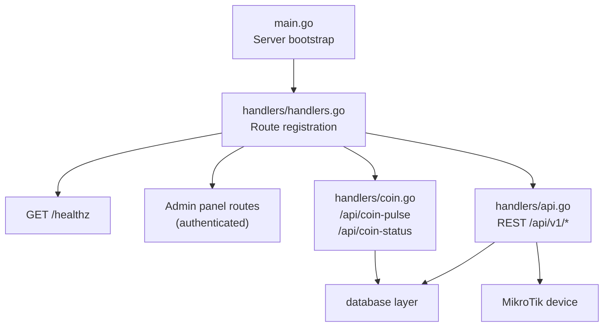
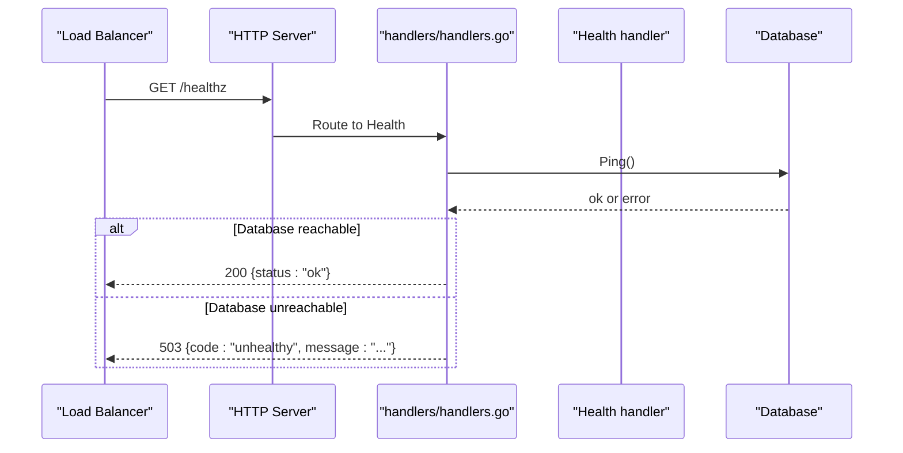
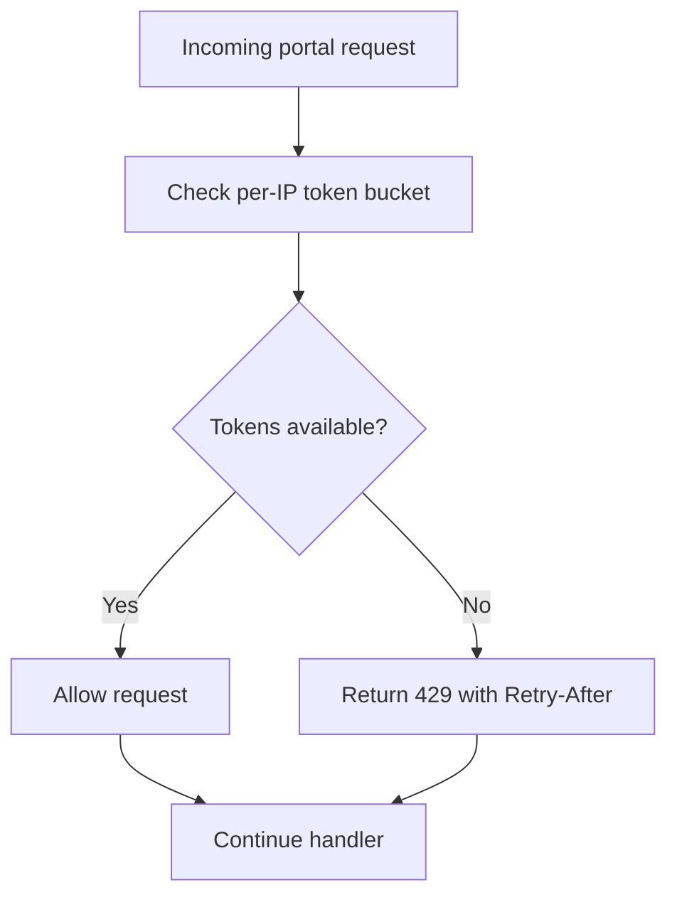
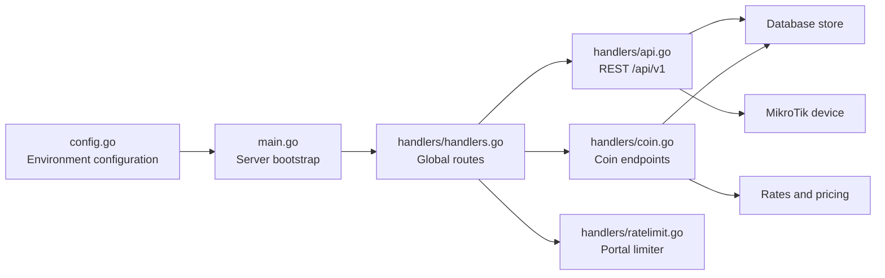

# API Reference

<cite>
**Referenced Files in This Document**
- [main.go](file://main.go)
- [config.go](file://config.go)
- [handlers/handlers.go](file://handlers/handlers.go)
- [handlers/api.go](file://handlers/api.go)
- [handlers/coin.go](file://handlers/coin.go)
- [handlers/ratelimit.go](file://handlers/ratelimit.go)
</cite>

## Table of Contents
1. [Introduction](#introduction)
2. [Project Structure](#project-structure)
3. [Core Components](#core-components)
4. [Architecture Overview](#architecture-overview)
5. [Detailed Component Analysis](#detailed-component-analysis)
6. [Dependency Analysis](#dependency-analysis)
7. [Performance Considerations](#performance-considerations)
8. [Troubleshooting Guide](#troubleshooting-guide)
9. [Conclusion](#conclusion)

## Introduction
This document describes the public HTTP APIs exposed by the Aircoins MikroTik Controller. It focuses on:
- REST router management under `/api/v1`.
- The coin acceptor integration endpoints under `/api/coin-pulse` and `/api/coin-status`.
- The health check endpoint at `/healthz`.

The controller is a Go application that starts an HTTP server, wires handlers through a central mux, and exposes both operator-facing web routes and machine-facing JSON APIs. The REST API is intended for integrations and monitoring tools; it speaks JSON and reuses the same RouterOS client used by the web UI.

## Project Structure
At runtime, `main.go` loads configuration from environment variables, opens the SQLite database, builds the handler layer, and starts an `http.Server`. The handler layer registers:
- A flat `/healthz` probe.
- Operator panel routes behind authentication.
- Machine-facing REST routes under `/api/v1`.
- Coin-slot endpoints outside the admin prefix so hardware and captive portal clients can reach them without a browser session.



**Diagram sources**
- [main.go:214-285](file://main.go#L214-L285)
- [handlers/handlers.go:293-303](file://handlers/handlers.go#L293-L303)
- [handlers/api.go:106-136](file://handlers/api.go#L106-L136)
- [handlers/coin.go:27-55](file://handlers/coin.go#L27-L55)

**Section sources**
- [main.go:214-285](file://main.go#L214-L285)
- [handlers/handlers.go:293-303](file://handlers/handlers.go#L293-L303)

## Core Components
- **REST API versioning**: All REST endpoints are mounted under `/api/v1`. The package comment states this is the v1 surface for machine clients.
- **Health check**: `/healthz` is a flat, prefix-free probe for systemd and load balancers.
- **Coin acceptor API**: `/api/coin-pulse` accepts hardware pulse reports with token-based authentication; `/api/coin-status` returns a client’s current credit balance.
- **Rate limiting**: A per-IP in-memory token bucket limits portal login attempts and returns `429 Too Many Requests` with a `Retry-After` header when exceeded.

**Section sources**
- [handlers/api.go:1-9](file://handlers/api.go#L1-L9)
- [handlers/handlers.go:296-303](file://handlers/handlers.go#L296-L303)
- [handlers/coin.go:27-55](file://handlers/coin.go#L27-L55)
- [handlers/ratelimit.go:89-103](file://handlers/ratelimit.go#L89-L103)

## Architecture Overview
The request flow differs by audience:

| Audience | Entry point | Authentication | Primary responsibility |
|---|---|---|---|
| Load balancer or orchestrator | `GET /healthz` | None | Liveness probe |
| Integration client | `GET /api/v1/*` | Reverse proxy auth recommended | Router inventory, device queries, vouchers, portal login |
| NodeMCU coin acceptor | `POST /api/coin-pulse` | Shared secret via header or query parameter | Report pulses and receive balance |
| Captive portal JavaScript | `GET /api/coin-status` | Subject-scoped read only | Poll inserted credit |



**Diagram sources**
- [handlers/handlers.go:296-303](file://handlers/handlers.go#L296-L303)
- [handlers/api.go:138-146](file://handlers/api.go#L138-L146)

## Detailed Component Analysis

### Health Check Endpoint

| Property | Value |
|---|---|
| Method | `GET` |
| URL | `/healthz` |
| Authentication | None |
| Purpose | Liveness probe for systemd, Kubernetes, or load balancers |
| Success response | `200 OK`, JSON body with `status: "ok"` |
| Failure response | `503 Service Unavailable`, JSON body with `code: "unhealthy"` and a human-readable message |

#### Request
No request body.

#### Response schema
- `200 OK`:
  - `status`: string, always `"ok"` when healthy.
- `503 Service Unavailable`:
  - `code`: string, `"unhealthy"`.
  - `message`: string describing why the database ping failed.

#### Example curl command
```bash
curl --fail --show-error http://localhost:80/healthz
```

#### Example responses
- Healthy:
  ```json
  {"status":"ok"}
  ```
- Unhealthy:
  ```json
  {"code":"unhealthy","message":"database unreachable"}
  ```

**Section sources**
- [handlers/handlers.go:296-303](file://handlers/handlers.go#L296-L303)
- [handlers/api.go:138-146](file://handlers/api.go#L138-L146)

### REST Router Management API

All router management endpoints live under `/api/v1`. They return JSON and use a consistent error envelope for non-2xx responses.

#### Common behavior
- Content-Type: `application/json`.
- Errors use a standard JSON object with `code` and `message`.
- Router identifiers are positive integers taken from the URL path.
- Endpoints that need live device access open a RouterOS connection, perform the operation, and close the connection.
- Some endpoints require the device to be reachable; others only read the local router inventory.

#### Error envelope
Every non-success response uses:
- `code`: machine-readable error code.
- `message`: human-readable explanation.

Common codes include:
- `bad_request`: invalid JSON or malformed request.
- `validation`: missing or invalid required fields.
- `invalid_id`: router id is not a positive integer.
- `not_found`: router does not exist.
- `db_error`: internal database failure.
- `router_unreachable`: cannot connect to the MikroTik device.
- `device_error`: device returned an error during a live query.
- `query_failed`: device query failed.
- `disconnect_failed`: client disconnect action failed.
- `conflict`: duplicate resource.

#### Rate limiting
The REST API itself is not rate-limited by the in-memory limiter. The limiter applies to portal login flows. For production exposure over untrusted networks, place the controller behind a reverse proxy with IP-based rate limiting.

#### Versioning
The API is explicitly documented as `/api/v1`. There is no explicit version header or content negotiation; clients should treat `/api/v1` as the stable contract and avoid relying on undocumented paths.

---

#### List routers

| Property | Value |
|---|---|
| Method | `GET` |
| URL | `/api/v1/routers` |
| Authentication | Recommended via reverse proxy |
| Success response | `200 OK` |
| Error response | `500 Internal Server Error` with `code: "db_error"` if listing fails |

Request: none.

Response schema:
- `routers`: array of router objects.
- `total`: number of routers returned.

Router object fields:
- `id`: integer.
- `name`: string.
- `host`: string.
- `port`: integer.
- `username`: string.
- `use_tls`: boolean.
- `verify_tls`: boolean.
- `location`: string.
- `portal_tag`: string.
- `default_portal`: boolean.
- `notes`: string.
- `transport`: string.
- `rest_port`: integer.
- `last_transport`: string.
- `last_status`: string.
- `last_error`: string.
- `last_latency_ms`: integer.
- `last_seen_at`: timestamp or null.
- `created_at`: timestamp.
- `updated_at`: timestamp.

Example curl command:
```bash
curl --fail --show-error http://localhost:80/api/v1/routers
```

Example response:
```json
{
  "routers": [],
  "total": 0
}
```

**Section sources**
- [handlers/api.go:106-136](file://handlers/api.go#L106-L136)
- [handlers/api.go:152-187](file://handlers/api.go#L152-L187)
- [handlers/api.go:314-331](file://handlers/api.go#L314-L331)

---

#### Create router

| Property | Value |
|---|---|
| Method | `POST` |
| URL | `/api/v1/routers` |
| Authentication | Recommended via reverse proxy |
| Success response | `201 Created` |
| Validation errors | `400 Bad Request` |
| Conflict | `409 Conflict` if unique constraint fails |
| Database error | `500 Internal Server Error` |

Request body:
- `name`: required string.
- `host`: required string.
- `port`: optional integer.
- `username`: required string.
- `password`: optional string.
- `use_tls`: optional boolean.
- `verify_tls`: optional boolean.
- `location`: optional string.
- `portal_tag`: optional string.
- `default_portal`: optional boolean.
- `notes`: optional string.
- `transport`: optional string.
- `rest_port`: required when transport is REST over HTTP.

Response: router object.

Example curl command:
```bash
curl --request POST \
  --header "Content-Type: application/json" \
  --data '{"name":"Branch-R1","host":"10.0.0.1","port":8728,"username":"aircoins","transport":"auto"}' \
  --fail --show-error http://localhost:80/api/v1/routers
```

Example success response:
```json
{
  "id": 1,
  "name": "Branch-R1",
  "host": "10.0.0.1",
  "port": 8728,
  "username": "aircoins",
  "transport": "auto",
  "created_at": "2025-01-01T00:00:00Z",
  "updated_at": "2025-01-01T00:00:00Z"
}
```

**Section sources**
- [handlers/api.go:343-407](file://handlers/api.go#L343-L407)

---

#### Get router

| Property | Value |
|---|---|
| Method | `GET` |
| URL | `/api/v1/routers/{id}` |
| Authentication | Recommended via reverse proxy |
| Success response | `200 OK` |
| Not found | `404 Not Found` |
| Invalid id | `400 Bad Request` |
| Database error | `500 Internal Server Error` |

Path parameter:
- `id`: positive integer.

Response: router object.

Example curl command:
```bash
curl --fail --show-error http://localhost:80/api/v1/routers/1
```

**Section sources**
- [handlers/api.go:333-341](file://handlers/api.go#L333-L341)
- [handlers/api.go:52-74](file://handlers/api.go#L52-L74)

---

#### Update router

| Property | Value |
|---|---|
| Method | `PUT` |
| URL | `/api/v1/routers/{id}` |
| Authentication | Recommended via reverse proxy |
| Success response | `200 OK` |
| Not found | `404 Not Found` |
| Validation error | `400 Bad Request` |
| Conflict | `409 Conflict` |
| Database error | `500 Internal Server Error` |

Path parameter:
- `id`: positive integer.

Request body: same fields as create, but password is optional and omitted means keep the stored secret.

Response: updated router object.

Example curl command:
```bash
curl --request PUT \
  --header "Content-Type: application/json" \
  --data '{"name":"Branch-R1","host":"10.0.0.1","username":"aircoins"}' \
  --fail --show-error http://localhost:80/api/v1/routers/1
```

**Section sources**
- [handlers/api.go:409-480](file://handlers/api.go#L409-L480)

---

#### Delete router

| Property | Value |
|---|---|
| Method | `DELETE` |
| URL | `/api/v1/routers/{id}` |
| Authentication | Recommended via reverse proxy |
| Success response | `204 No Content` |
| Not found | `404 Not Found` |
| Database error | `500 Internal Server Error` |

Path parameter:
- `id`: positive integer.

Example curl command:
```bash
curl --request DELETE --fail --show-error http://localhost:80/api/v1/routers/1
```

**Section sources**
- [handlers/api.go:482-502](file://handlers/api.go#L482-L502)

---

#### Test router connectivity

| Property | Value |
|---|---|
| Method | `POST` |
| URL | `/api/v1/routers/{id}/test` |
| Authentication | Recommended via reverse proxy |
| Success response | `200 OK` |
| Device error | `502 Bad Gateway` |
| Not found | `404 Not Found` |
| Invalid id | `400 Bad Request` |

Path parameter:
- `id`: positive integer.

Success response fields:
- `connected`: boolean, always true on success.
- `identity`: string.
- `version`: string.
- `board`: string.
- `latency_ms`: integer.

Example curl command:
```bash
curl --request POST --fail --show-error http://localhost:80/api/v1/routers/1/test
```

**Section sources**
- [handlers/api.go:504-528](file://handlers/api.go#L504-L528)

---

#### Get device information

| Property | Value |
|---|---|
| Method | `GET` |
| URL | `/api/v1/routers/{id}/device` |
| Authentication | Recommended via reverse proxy |
| Success response | `200 OK` |
| Device error | `502 Bad Gateway` |
| Not found | `404 Not Found` |
| Invalid id | `400 Bad Request` |

Path parameter:
- `id`: positive integer.

Response fields:
- `identity`: string.
- `version`: string.
- `board_name`: string.
- `architecture`: string.
- `uptime`: string.
- `cpu_load`: integer.
- `free_memory`: integer.
- `total_memory`: integer.

Example curl command:
```bash
curl --fail --show-error http://localhost:80/api/v1/routers/1/device
```

**Section sources**
- [handlers/api.go:530-544](file://handlers/api.go#L530-L544)

---

#### List active clients

| Property | Value |
|---|---|
| Method | `GET` |
| URL | `/api/v1/routers/{id}/clients` |
| Authentication | Recommended via reverse proxy |
| Success response | `200 OK` |
| Query error | `502 Bad Gateway` |
| Not found | `404 Not Found` |
| Invalid id | `400 Bad Request` |

Path parameter:
- `id`: positive integer.

Response fields:
- `clients`: array of client objects.
- `total`: integer count.

Client object fields:
- `id`: string.
- `user`: string.
- `address`: string.
- `mac_address`: string.
- `uptime`: string.
- `login_by`: string.
- `server`: string.
- `comment`: string.
- `bytes_in`: integer.
- `bytes_out`: integer.
- `total_bytes`: integer.

Example curl command:
```bash
curl --fail --show-error http://localhost:80/api/v1/routers/1/clients
```

**Section sources**
- [handlers/api.go:546-567](file://handlers/api.go#L546-L567)

---

#### List IP bindings

| Property | Value |
|---|---|
| Method | `GET` |
| URL | `/api/v1/routers/{id}/bindings` |
| Authentication | Recommended via reverse proxy |
| Success response | `200 OK` |
| Query error | `502 Bad Gateway` |
| Not found | `404 Not Found` |
| Invalid id | `400 Bad Request` |

Path parameter:
- `id`: positive integer.

Response fields:
- `bindings`: array of binding objects.
- `total`: integer count.

Binding object fields:
- `id`: string.
- `mac_address`: string.
- `address`: string.
- `to_address`: string.
- `server`: string.
- `type`: string.
- `blocked`: boolean.
- `comment`: string.
- `disabled`: boolean.

Example curl command:
```bash
curl --fail --show-error http://localhost:80/api/v1/routers/1/bindings
```

**Section sources**
- [handlers/api.go:569-590](file://handlers/api.go#L569-L590)

---

#### List interfaces

| Property | Value |
|---|---|
| Method | `GET` |
| URL | `/api/v1/routers/{id}/interfaces` |
| Authentication | Recommended via reverse proxy |
| Success response | `200 OK` |
| Query error | `502 Bad Gateway` |
| Not found | `404 Not Found` |
| Invalid id | `400 Bad Request` |

Path parameter:
- `id`: positive integer.

Response fields:
- `interfaces`: array of interface objects.
- `total`: integer count.

Interface object fields:
- `id`: string.
- `name`: string.
- `type`: string.
- `mtu`: integer.
- `mac_address`: string.
- `rx_bytes`: integer.
- `tx_bytes`: integer.
- `rx_packets`: integer.
- `tx_packets`: integer.

Example curl command:
```bash
curl --fail --show-error http://localhost:80/api/v1/routers/1/interfaces
```

**Section sources**
- [handlers/api.go:592-613](file://handlers/api.go#L592-L613)

---

#### Get interface traffic history

| Property | Value |
|---|---|
| Method | `GET` |
| URL | `/api/v1/routers/{id}/interfaces/{iface}/traffic` |
| Authentication | Recommended via reverse proxy |
| Success response | `200 OK` |
| Missing interface | `404 Not Found` |
| Invalid input | `400 Bad Request` |
| Query error | `502 Bad Gateway` |

Path parameters:
- `id`: positive integer.
- `iface`: interface identifier or name.

Response fields:
- `interface`: interface object.
- `interface_name`: string.
- `points`: array of traffic points.
- `rx_rate`: integer.
- `tx_rate`: integer.
- `timestamp`: timestamp.

Traffic point fields:
- `timestamp`: timestamp.
- `rx_bytes`: integer.
- `tx_bytes`: integer.
- `rx_rate`: integer.
- `tx_rate`: integer.

Example curl command:
```bash
curl --fail --show-error http://localhost:80/api/v1/routers/1/interfaces/ether1/traffic
```

**Section sources**
- [handlers/api.go:685-745](file://handlers/api.go#L685-L745)

---

#### Disconnect client

| Property | Value |
|---|---|
| Method | `POST` |
| URL | `/api/v1/routers/{id}/clients/{cid}/disconnect` |
| Authentication | Recommended via reverse proxy |
| Success response | `200 OK` |
| Client not found | `404 Not Found` |
| Validation error | `400 Bad Request` |
| Disconnect error | `502 Bad Gateway` |

Path parameter:
- `id`: positive integer.
- `cid`: optional client id.

Optional request body:
- `client_id`: alternative way to identify the client.
- `user`: username to disconnect.

Response:
- `status`: string, `"disconnected"`.

Example curl command:
```bash
curl --request POST \
  --header "Content-Type: application/json" \
  --data '{"client_id":"ABC123"}' \
  --fail --show-error http://localhost:80/api/v1/routers/1/clients/ABC123/disconnect
```

**Section sources**
- [handlers/api.go:757-790](file://handlers/api.go#L757-L790)

---

#### Block and unblock clients

These endpoints add or remove hotspot IP bindings.

| Property | Value |
|---|---|
| Methods | `POST` |
| URLs | `/api/v1/routers/{id}/block`<br/>`/api/v1/routers/{id}/unblock` |
| Authentication | Recommended via reverse proxy |
| Success response | `200 OK` |
| Validation error | `400 Bad Request` |
| Device error | `502 Bad Gateway` |
| Not found | `404 Not Found` |
| Invalid id | `400 Bad Request` |

Path parameter:
- `id`: positive integer.

Typical request body:
- `mac`: MAC address string.

Example curl commands:
```bash
curl --request POST \
  --header "Content-Type: application/json" \
  --data '{"mac":"AA:BB:CC:DD:EE:FF"}' \
  --fail --show-error http://localhost:80/api/v1/routers/1/block

curl --request POST \
  --header "Content-Type: application/json" \
  --data '{"mac":"AA:BB:CC:DD:EE:FF"}' \
  --fail --show-error http://localhost:80/api/v1/routers/1/unblock
```

**Section sources**
- [handlers/api.go:792-800](file://handlers/api.go#L792-L800)

---

#### Execute router command

| Property | Value |
|---|---|
| Method | `POST` |
| URL | `/api/v1/routers/{id}/command` |
| Authentication | Recommended via reverse proxy |
| Purpose | Send a RouterOS command through the active device client |
| Success response | `200 OK` |
| Device error | `502 Bad Gateway` |
| Not found | `404 Not Found` |
| Invalid id | `400 Bad Request` |

Path parameter:
- `id`: positive integer.

Security note: This endpoint can execute device operations. Restrict it behind strong authentication and network controls.

**Section sources**
- [handlers/api.go:127-127](file://handlers/api.go#L127-L127)

---

#### Voucher endpoints

The REST API also exposes voucher management.

| Method | URL | Purpose |
|---|---|---|
| `GET` | `/api/v1/vouchers` | List vouchers |
| `POST` | `/api/v1/vouchers` | Create voucher |
| `GET` | `/api/v1/vouchers/{code}` | Get voucher by code |
| `POST` | `/api/v1/vouchers/{code}/redeem` | Redeem voucher |
| `DELETE` | `/api/v1/vouchers/{id}` | Delete voucher |

Voucher object fields include:
- `id`, `code`, `batch`, `router_id`, `router_name`, `profile`, `duration_minutes`, `data_limit_mb`, `device_limit`, `price_cents`, `status`, `status_label`, `uses`, `max_uses`, `remaining_uses`, `note`, timestamps.

Example curl command:
```bash
curl --fail --show-error http://localhost:80/api/v1/vouchers
```

**Section sources**
- [handlers/api.go:129-133](file://handlers/api.go#L129-L133)
- [handlers/api.go:272-308](file://handlers/api.go#L272-L308)

---

#### Portal login endpoint

| Property | Value |
|---|---|
| Method | `POST` |
| URL | `/api/v1/portal/login` |
| Purpose | Programmatic captive portal login |
| Authentication | Recommended via reverse proxy |

This endpoint is registered under the REST API and shares the same routing table.

**Section sources**
- [handlers/api.go:135-136](file://handlers/api.go#L135-L136)

### Coin Acceptor Integration API

The coin acceptor API is designed for a NodeMCU or similar hardware device. It is intentionally separate from the admin panel so that hardware and captive portal clients do not need a browser session.

#### Security model
- `/api/coin-pulse` requires a shared secret configured via `COIN_NODE_TOKEN`.
- The token is checked using constant-time comparison.
- If `COIN_NODE_TOKEN` is empty, every pulse request is rejected.
- The token can be sent as:
  - Header: `X-Coin-Token`.
  - Query parameter: `token`.
- `/api/coin-status` is read-only and scoped to a subject; it does not expose secrets.

#### Configuration
- `COIN_NODE_TOKEN`: shared secret for coin-slot nodes.
- `COIN_SECONDS_PER_PULSE`: fallback seconds per pulse.
- `COIN_CENTS_PER_PULSE`: fallback cents per pulse.
- `COIN_IDLE_TTL`: how long an unspent balance survives.
- `COIN_MAX_SESSION_MINUTES`: maximum session time created from coin credit.

**Section sources**
- [handlers/coin.go:27-55](file://handlers/coin.go#L27-L55)
- [handlers/coin.go:551-572](file://handlers/coin.go#L551-L572)
- [config.go:59-67](file://config.go#L59-L67)

---

#### Pulse reporting endpoint

| Property | Value |
|---|---|
| Method | `POST` |
| URL | `/api/coin-pulse` |
| Authentication | Required: shared secret via `X-Coin-Token` header or `?token=` query parameter |
| Supported bodies | JSON or URL-encoded form |
| Success response | `200 OK` |
| Unauthorized | `401 Unauthorized` |
| Invalid body | `400 Bad Request` |
| Missing rates | `503 Service Unavailable` |
| Duplicate event | `200 OK` with `duplicate: true` |

Authentication:
- Header: `X-Coin-Token`.
- Query parameter: `token`.

Request body (JSON):
- `subject`: optional override storage key.
- `mac`: optional MAC address.
- `ip`: optional IP address.
- `pulses`: integer number of pulses.
- `amount_cents`: optional face value in smallest currency unit.
- `seconds`: optional override for access time.
- `node_id`: optional acceptor identifier.
- `event_id`: monotonic de-duplication token.
- `router_id`: optional router identifier.

Request body (form):
- Same logical fields, parsed from URL-encoded form data.

Response schema:
- `subject`: string.
- `mac`: string.
- `pulses`: integer.
- `amount_cents`: integer.
- `remaining_seconds`: integer.
- `session_label`: string.
- `status`: string, one of `"active"`, `"connected"`, or `"expired"`.
- `seconds_per_pulse`: integer.
- `duplicate`: boolean, true when the event was already recorded.
- `accepted_pulses`: integer, how many pulses this request added.
- `updated_at`: RFC3339 timestamp.

Example curl command (JSON):
```bash
curl --request POST \
  --header "Content-Type: application/json" \
  --header "X-Coin-Token: YOUR_SHARED_SECRET" \
  --data '{"mac":"AA:BB:CC:DD:EE:FF","pulses":1,"event_id":"e-1"}' \
  --fail --show-error http://localhost:80/api/coin-pulse
```

Example curl command (form):
```bash
curl --request POST \
  --header "X-Coin-Token: YOUR_SHARED_SECRET" \
  --data-urlencode "mac=AA:BB:CC:DD:EE:FF" \
  --data-urlencode "pulses=1" \
  --data-urlencode "event_id=e-1" \
  --fail --show-error http://localhost:80/api/coin-pulse
```

Example success response:
```json
{
  "subject": "mac:AA:BB:CC:DD:EE:FF",
  "mac": "AA:BB:CC:DD:EE:FF",
  "pulses": 1,
  "amount_cents": 500,
  "remaining_seconds": 300,
  "session_label": "5 minutes",
  "status": "active",
  "seconds_per_pulse": 300,
  "accepted_pulses": 1,
  "updated_at": "2025-01-01T00:00:00Z"
}
```

Example duplicate response:
```json
{
  "subject": "mac:AA:BB:CC:DD:EE:FF",
  "pulses": 1,
  "duplicate": true,
  "updated_at": "2025-01-01T00:00:00Z"
}
```

Example unauthorized response:
```json
{
  "ok": false,
  "code": "unauthorized",
  "message": "the coin-slot node token is missing or wrong"
}
```

**Section sources**
- [handlers/coin.go:115-220](file://handlers/coin.go#L115-L220)
- [handlers/coin.go:57-86](file://handlers/coin.go#L57-L86)
- [handlers/coin.go:88-113](file://handlers/coin.go#L88-L113)
- [handlers/coin.go:551-572](file://handlers/coin.go#L551-L572)
- [handlers/coin.go:574-643](file://handlers/coin.go#L574-L643)

---

#### Balance polling endpoint

| Property | Value |
|---|---|
| Method | `GET` |
| URL | `/api/coin-status` |
| Authentication | None |
| Scope | Read-only for a single subject |
| Success response | `200 OK` |
| Invalid subject | `400 Bad Request` |

Query parameters:
- `mac`: client MAC address.
- `subject`: explicit storage key.
- Fallback: remote client IP when neither is provided.

Response schema: same as the pulse response shape, including `subject`, `pulses`, `amount_cents`, `remaining_seconds`, `session_label`, `status`, `seconds_per_pulse`, `updated_at`.

A client with no balance receives a zeroed balance rather than an error.

Example curl command:
```bash
curl --fail --show-error "http://localhost:80/api/coin-status?mac=AA:BB:CC:DD:EE:FF"
```

Example response:
```json
{
  "subject": "mac:AA:BB:CC:DD:EE:FF",
  "mac": "AA:BB:CC:DD:EE:FF",
  "pulses": 0,
  "amount_cents": 0,
  "remaining_seconds": 0,
  "session_label": "0 minutes",
  "status": "active",
  "seconds_per_pulse": 300,
  "updated_at": "2025-01-01T00:00:00Z"
}
```

**Section sources**
- [handlers/coin.go:222-263](file://handlers/coin.go#L222-L263)
- [handlers/coin.go:310-332](file://handlers/coin.go#L310-L332)

### Rate Limiting

The built-in rate limiter protects portal login flows from rapid repeated attempts. It is implemented as an in-memory per-IP token bucket.

Key behavior:
- Default burst: 12 requests.
- Default window: 1 minute.
- When exceeded, returns `429 Too Many Requests`.
- Includes a `Retry-After` header indicating suggested wait time.
- Buckets are garbage-collected after two idle windows.

Important distinction:
- The limiter applies to portal login handling, not directly to every REST endpoint.
- For protecting `/api/v1` against abuse, deploy a reverse proxy with IP-based rate limiting and consider additional authentication.



**Diagram sources**
- [handlers/ratelimit.go:10-87](file://handlers/ratelimit.go#L10-L87)
- [handlers/ratelimit.go:89-103](file://handlers/ratelimit.go#L89-L103)

**Section sources**
- [handlers/ratelimit.go:10-103](file://handlers/ratelimit.go#L10-L103)

## Dependency Analysis



**Diagram sources**
- [config.go:14-77](file://config.go#L14-L77)
- [main.go:214-285](file://main.go#L214-L285)
- [handlers/handlers.go:293-328](file://handlers/handlers.go#L293-L328)
- [handlers/api.go:106-136](file://handlers/api.go#L106-L136)
- [handlers/coin.go:27-55](file://handlers/coin.go#L27-L55)
- [handlers/ratelimit.go:89-103](file://handlers/ratelimit.go#L89-L103)

**Section sources**
- [config.go:14-77](file://config.go#L14-L77)
- [main.go:214-285](file://main.go#L214-L285)
- [handlers/handlers.go:293-328](file://handlers/handlers.go#L293-L328)
- [handlers/api.go:106-136](file://handlers/api.go#L106-L136)
- [handlers/coin.go:27-55](file://handlers/coin.go#L27-L55)
- [handlers/ratelimit.go:89-103](file://handlers/ratelimit.go#L89-L103)

## Performance Considerations
- The REST API dials a live RouterOS connection for device queries and closes it after each request. High-frequency polling should cache results where possible.
- Interface traffic history keeps up to 60 samples per router/interface in memory and prunes stale entries after 15 minutes.
- The coin status response sets `Cache-Control: no-store` because it represents live money state.
- The portal rate limiter is in-memory and resets on process restart; it is suitable for protecting against brute-force login attempts but not for distributed rate limiting.
- Database timeouts and API timeouts are configurable through environment variables.

[No sources needed since this section provides general guidance]

## Troubleshooting Guide

### Health check returns unhealthy
- Cause: database ping fails.
- Action: verify database path, permissions, and SQLite file integrity.
- Expected response: `503` with `code: "unhealthy"`.

**Section sources**
- [handlers/api.go:138-146](file://handlers/api.go#L138-L146)

### Coin pulse rejected as unauthorized
- Cause: `COIN_NODE_TOKEN` is empty, missing, or wrong.
- Action: set `COIN_NODE_TOKEN` and send it via `X-Coin-Token` or `?token=`.
- Expected response: `401` with `code: "unauthorized"`.

**Section sources**
- [handlers/coin.go:123-131](file://handlers/coin.go#L123-L131)
- [handlers/coin.go:551-572](file://handlers/coin.go#L551-L572)
- [config.go:59-63](file://config.go#L59-L63)

### Coin pulse reports duplicate event
- Cause: the same `event_id` was already accepted.
- Action: increment the monotonic event counter on the hardware side; no refund is needed.
- Expected response: `200` with `duplicate: true`.

**Section sources**
- [handlers/coin.go:200-208](file://handlers/coin.go#L200-L208)

### Coin pulse has no active rate
- Cause: no active rate tier exists and environment fallback is invalid.
- Action: configure rates in the controller or set valid `COIN_SECONDS_PER_PULSE` and `COIN_CENTS_PER_PULSE`.
- Expected response: `503` with `code: "no_rates"`.

**Section sources**
- [handlers/coin.go:154-176](file://handlers/coin.go#L154-L176)
- [handlers/coin.go:265-298](file://handlers/coin.go#L265-L298)

### Router endpoint returns bad gateway
- Cause: device is unreachable, credentials are wrong, or RouterOS command failed.
- Action: test connectivity with `POST /api/v1/routers/{id}/test`, then inspect device logs.
- Expected response: `502` with `code: "device_error"` or `router_unreachable`.

**Section sources**
- [handlers/api.go:504-528](file://handlers/api.go#L504-L528)
- [handlers/api.go:530-544](file://handlers/api.go#L530-L544)

### Portal login throttled
- Cause: too many login attempts from the same IP.
- Action: respect `Retry-After`, back off, and reduce retry frequency.
- Expected response: `429` with `Retry-After` header.

**Section sources**
- [handlers/ratelimit.go:89-103](file://handlers/ratelimit.go#L89-L103)

## Conclusion
The Aircoins MikroTik Controller exposes three important API surfaces:
- `/healthz` for liveness checks.
- `/api/v1` for router, client, voucher, and portal automation.
- `/api/coin-pulse` and `/api/coin-status` for coin acceptor integration.

For safe production use:
- Protect `/api/v1` behind a reverse proxy with strong authentication and rate limiting.
- Always configure `COIN_NODE_TOKEN` before exposing the controller to guest networks.
- Treat `/api/coin-pulse` as a trusted hardware channel and validate `event_id` uniqueness on the device side.
- Use `/api/v1/routers/{id}/test` to diagnose device connectivity before querying live client or interface data.

[No sources needed since this section summarizes without analyzing specific files]