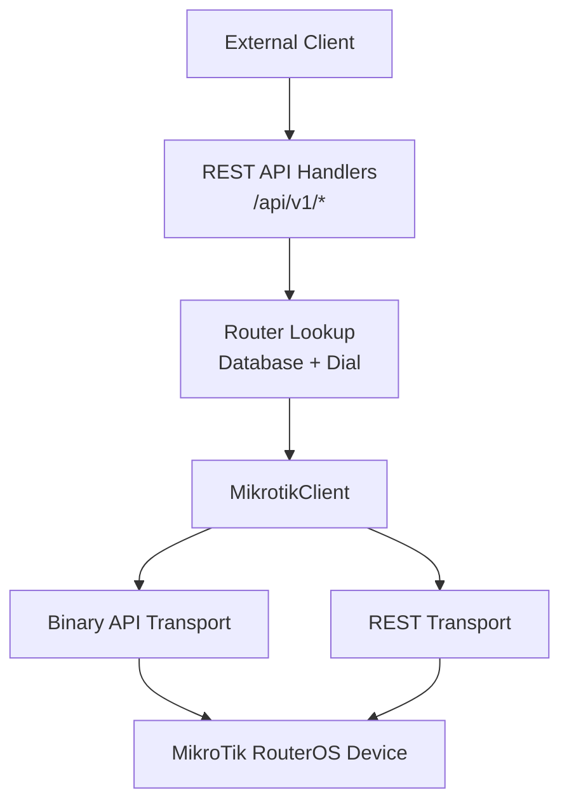
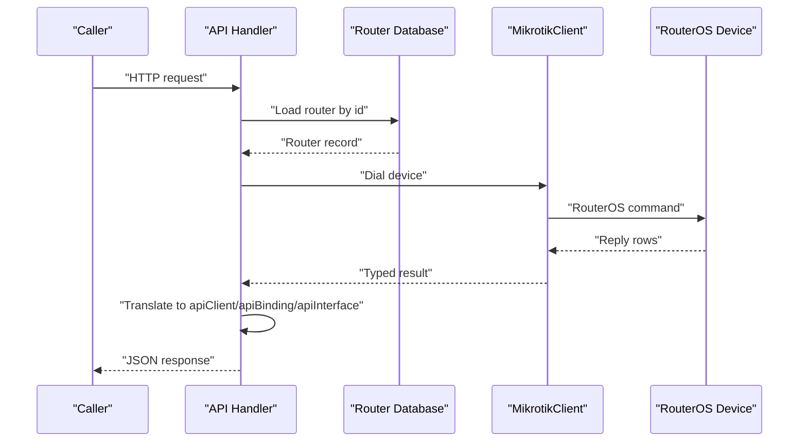
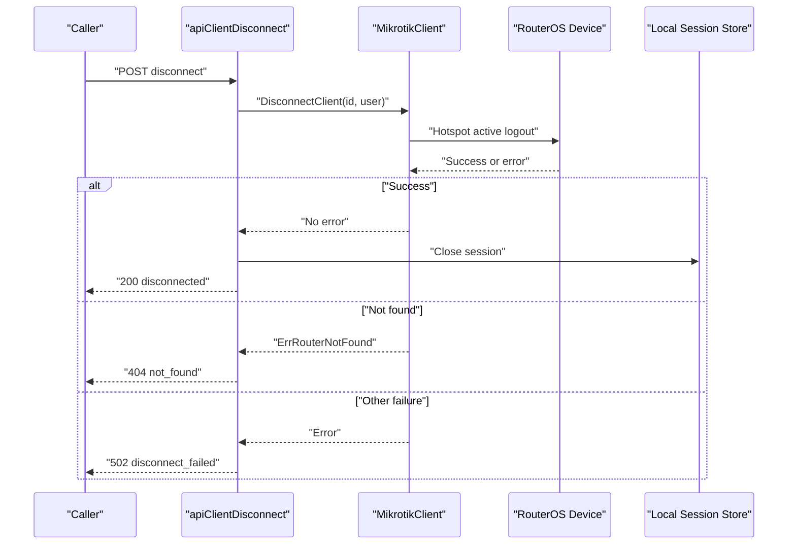
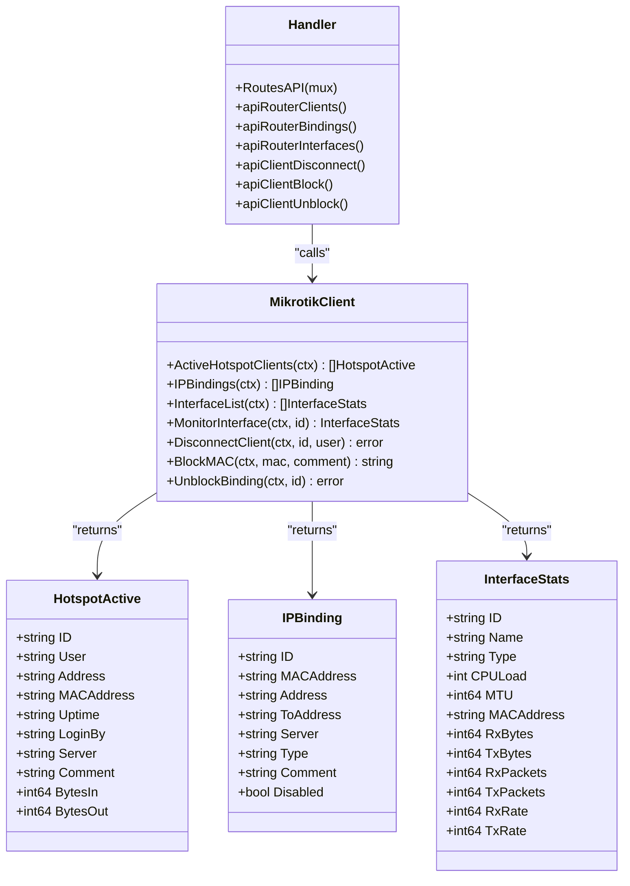

# Client Session Management API

<cite>
**Referenced Files in This Document**
- [api.go](file://handlers/api.go)
- [mikrotik.go](file://handlers/mikrotik.go)
- [mikrotik_hotspot.go](file://handlers/mikrotik_hotspot.go)
- [mikrotik_rest.go](file://handlers/mikrotik_rest.go)
</cite>

## Table of Contents
1. [Introduction](#introduction)
2. [Project Structure](#project-structure)
3. [Core Components](#core-components)
4. [Architecture Overview](#architecture-overview)
5. [Detailed Component Analysis](#detailed-component-analysis)
6. [Dependency Analysis](#dependency-analysis)
7. [Performance Considerations](#performance-considerations)
8. [Troubleshooting Guide](#troubleshooting-guide)
9. [Conclusion](#conclusion)

## Introduction
This document describes the client session management endpoints exposed under `/api/v1`. These endpoints let external systems list active Hotspot clients, inspect IP bindings, disconnect sessions, block or unblock MAC addresses, and monitor router interface traffic. They are machine-oriented JSON APIs that reuse the same MikroTik device layer used by the web UI.

The controller does not implement its own authentication for these routes; it reuses the web application’s middleware chain. Because the API is intended for integrations and monitoring tools, it is explicitly exempt from browser CSRF protection. Production deployments should place the controller behind a reverse proxy with access control when it may be reachable from untrusted networks.

## Project Structure
The session management endpoints live in the REST API handler layer. Routing is registered once and then dispatched to per-endpoint functions. Device interaction goes through `MikrotikClient`, which abstracts RouterOS over either the binary API or the v7 REST transport.

**Diagram sources**
- [api.go:108-136](file://handlers/api.go#L108-L136)
- [api.go:78-104](file://handlers/api.go#L78-L104)
- [mikrotik.go:163-181](file://handlers/mikrotik.go#L163-L181)
- [mikrotik_rest.go:49-94](file://handlers/mikrotik_rest.go#L49-L94)

**Section sources**
- [api.go:1-22](file://handlers/api.go#L1-L22)
- [api.go:108-136](file://handlers/api.go#L108-L136)

## Core Components
The session management API revolves around three response structures:

| Structure | Purpose | Key Fields |
|---|---|---|
| `apiClient` | Represents an active Hotspot client | `id`, `user`, `address`, `mac_address`, `uptime`, `login_by`, `server`, `comment`, `bytes_in`, `bytes_out`, `total_bytes` |
| `apiBinding` | Represents an IP binding on the device | `id`, `mac_address`, `address`, `to_address`, `server`, `type`, `blocked`, `comment`, `disabled` |
| `apiInterface` | Represents a router interface with counters | `id`, `name`, `type`, `mtu`, `mac_address`, `rx_bytes`, `tx_bytes`, `rx_packets`, `tx_packets` |

These structures are derived from internal types:

- `HotspotActive` represents an active Hotspot session.
- `IPBinding` represents a hotspot IP binding entry.
- `InterfaceStats` represents interface metadata plus byte/packet/rate counters.

The API layer converts those internal types into the JSON shapes returned by the endpoints.

**Section sources**
- [api.go:189-270](file://handlers/api.go#L189-L270)
- [mikrotik.go:879-890](file://handlers/mikrotik.go#L879-L890)
- [mikrotik.go:977-986](file://handlers/mikrotik.go#L977-L986)
- [mikrotik.go:691-704](file://handlers/mikrotik.go#L691-L704)

## Architecture Overview
All session management endpoints follow the same request flow:

1. The HTTP router matches `/api/v1/routers/{id}/...`.
2. The handler resolves the router by ID from the database.
3. The handler dials a `MikrotikClient` using the configured transport (binary API or REST).
4. The handler calls a device method such as listing active clients, listing bindings, disconnecting a client, blocking/unblocking a MAC, or reading interface stats.
5. The handler translates device data into JSON and writes a standardized response.
6. On success, some operations also update local session state.

**Diagram sources**
- [api.go:78-104](file://handlers/api.go#L78-L104)
- [api.go:547-613](file://handlers/api.go#L547-L613)
- [mikrotik.go:163-181](file://handlers/mikrotik.go#L163-L181)

## Detailed Component Analysis

### GET /api/v1/routers/{id}/clients
Lists active Hotspot clients on the selected router.

| Item | Detail |
|---|---|
| Method | `GET` |
| Path | `/api/v1/routers/{id}/clients` |
| Path parameters | `id`: positive integer router ID |
| Request body | None |
| Required permissions | Depends on the underlying transport: binary API user or REST user must have permission to query active Hotspot sessions |
| Success response | `200 OK` with JSON object containing `clients` array and `total` count |
| Failure responses | `400 Bad Request` for invalid router ID, `404 Not Found` if router missing, `502 Bad Gateway` if device query fails |

Response shape:

| Field | Type | Description |
|---|---|---|
| `clients` | array | List of `apiClient` objects |
| `total` | number | Number of active clients returned |

Each `apiClient` field:

| Field | Type | Description |
|---|---|---|
| `id` | string | Hotspot active session identifier |
| `user` | string | Hotspot username |
| `address` | string | Assigned IP address |
| `mac_address` | string | Client MAC address |
| `uptime` | string | Uptime representation from the device |
| `login_by` | string | Login method, such as cookie, CHAP, HTTPS, PAP, trial, or MAC-based methods |
| `server` | string | Hotspot server name |
| `comment` | string | Comment attached to the session |
| `bytes_in` | number | Bytes received from the client |
| `bytes_out` | number | Bytes sent to the client |
| `total_bytes` | number | Sum of `bytes_in` and `bytes_out` |

Operational impact:
- Read-only.
- Returns current device state at the time of the query.
- Does not modify sessions or routing configuration.

Example workflow:
1. Call `GET /api/v1/routers/{id}/clients`.
2. Inspect the returned `clients` array.
3. Use the `id` or `user` value when disconnecting a specific client.

**Section sources**
- [api.go:119](file://handlers/api.go#L119)
- [api.go:547-567](file://handlers/api.go#L547-L567)
- [api.go:189-210](file://handlers/api.go#L189-L210)
- [mikrotik.go:879-890](file://handlers/mikrotik.go#L879-L890)

### GET /api/v1/routers/{id}/bindings
Lists IP bindings configured for the Hotspot on the selected router.

| Item | Detail |
|---|---|
| Method | `GET` |
| Path | `/api/v1/routers/{id}/bindings` |
| Path parameters | `id`: positive integer router ID |
| Request body | None |
| Required permissions | Must be able to read `/ip/hotspot/ip-binding` entries |
| Success response | `200 OK` with JSON object containing `bindings` array and `total` count |
| Failure responses | `400 Bad Request` for invalid router ID, `404 Not Found` if router missing, `502 Bad Gateway` if device query fails |

Response shape:

| Field | Type | Description |
|---|---|---|
| `bindings` | array | List of `apiBinding` objects |
| `total` | number | Number of bindings returned |

Each `apiBinding` field:

| Field | Type | Description |
|---|---|---|
| `id` | string | RouterOS binding identifier |
| `mac_address` | string | MAC address associated with the binding |
| `address` | string | Source address or pool reference |
| `to_address` | string | Destination or mapped address |
| `server` | string | Hotspot server name |
| `type` | string | Binding type |
| `blocked` | boolean | Whether the binding is blocked |
| `comment` | string | Comment attached to the binding |
| `disabled` | boolean | Whether the binding is disabled |

Operational impact:
- Read-only.
- Useful before blocking or unblocking a MAC address.
- The `blocked` field reflects the current device state.

**Section sources**
- [api.go:120](file://handlers/api.go#L120)
- [api.go:569-590](file://handlers/api.go#L569-L590)
- [api.go:231-249](file://handlers/api.go#L231-L249)
- [mikrotik.go:977-986](file://handlers/mikrotik.go#L977-L986)

### POST /api/v1/routers/{id}/clients/{cid}/disconnect
Disconnects an active Hotspot client.

| Item | Detail |
|---|---|
| Method | `POST` |
| Path | `/api/v1/routers/{id}/clients/{cid}/disconnect` |
| Path parameters | `id`: router ID, `cid`: optional client identifier |
| Request body | Optional JSON with `client_id` or `user` |
| Required permissions | Must be able to terminate active Hotspot sessions |
| Success response | `200 OK` with `{"status": "disconnected"}` |
| Failure responses | `400 Bad Request` if neither path `cid` nor body `client_id`/`user` is provided, `404 Not Found` if no active client matches, `502 Bad Gateway` if disconnection fails |

Request options:

| Option | Location | Description |
|---|---|---|
| `cid` | URL path segment | Hotspot active client ID |
| `client_id` | JSON body | Alternative way to identify the client |
| `user` | JSON body | Username of the active client |

Operational impact:
- Immediately terminates the targeted Hotspot session on the device.
- Updates the local session store to mark the session closed.
- May cause the client to lose network access depending on Hotspot policy.

Example disconnection workflows:

1. Disconnect by path client ID:
   - `POST /api/v1/routers/{id}/clients/{cid}/disconnect`
   - No body required.

2. Disconnect by body client ID:
   - `POST /api/v1/routers/{id}/clients/{cid}/disconnect`
   - Body: `{ "client_id": "<session-id>" }`

3. Disconnect by username:
   - `POST /api/v1/routers/{id}/clients/{cid}/disconnect`
   - Body: `{ "user": "<username>" }`

**Diagram sources**
- [api.go:757-790](file://handlers/api.go#L757-L790)

**Section sources**
- [api.go:124](file://handlers/api.go#L124)
- [api.go:757-790](file://handlers/api.go#L757-L790)
- [mikrotik.go:921-929](file://handlers/mikrotik.go#L921-L929)

### POST /api/v1/routers/{id}/block
Adds a blocked IP binding for a MAC address.

| Item | Detail |
|---|---|
| Method | `POST` |
| Path | `/api/v1/routers/{id}/block` |
| Path parameters | `id`: router ID |
| Request body | JSON with `mac` and optional `comment` |
| Required permissions | Must be able to create or modify `/ip/hotspot/ip-binding` entries |
| Success response | `201 Created` with `status`, normalized `mac`, and `binding_id` |
| Failure responses | `400 Bad Request` if MAC is missing or body is invalid, `409 Conflict` if a binding already exists for the MAC, `502 Bad Gateway` if device operation fails |

Request fields:

| Field | Type | Required | Description |
|---|---|---|---|
| `mac` | string | Yes | MAC address to block |
| `comment` | string | No | Optional comment stored with the binding |

Operational impact:
- Creates or updates a blocked IP binding on the device.
- Closes any tracked local sessions associated with the normalized MAC address.
- Prevents future Hotspot login attempts from that MAC address according to Hotspot binding behavior.

MAC blocking procedure:
1. Optionally call `GET /api/v1/routers/{id}/bindings` to check existing bindings.
2. Call `POST /api/v1/routers/{id}/block` with the target MAC.
3. Inspect the response for `binding_id`.
4. Verify the binding appears in the bindings list with `blocked: true`.

**Section sources**
- [api.go:125](file://handlers/api.go#L125)
- [api.go:792-826](file://handlers/api.go#L792-L826)

### POST /api/v1/routers/{id}/unblock
Removes an IP binding, either by binding ID or by MAC address.

| Item | Detail |
|---|---|
| Method | `POST` |
| Path | `/api/v1/routers/{id}/unblock` |
| Path parameters | `id`: router ID |
| Request body | JSON with `binding_id` or `mac`; also supports form values |
| Required permissions | Must be able to remove `/ip/hotspot/ip-binding` entries |
| Success response | `200 OK` with `{"status": "unblocked"}` |
| Failure responses | `400 Bad Request` if neither `binding_id` nor `mac` is provided, `404 Not Found` if no matching binding exists or the binding was removed externally, `502 Bad Gateway` if device operation fails |

Request options:

| Option | Description |
|---|---|
| `binding_id` | Directly removes the binding by RouterOS ID |
| `mac` | Looks up the binding by normalized MAC address, then removes it |

Operational impact:
- Removes the selected IP binding from the device.
- Does not automatically reconnect a client; the client must authenticate again.
- If the binding was already removed on the device, the endpoint returns `not_found`.

MAC unblocking procedure:
1. Call `GET /api/v1/routers/{id}/bindings` to find the binding ID or confirm the MAC.
2. Call `POST /api/v1/routers/{id}/unblock` with `binding_id` or `mac`.
3. Confirm the binding no longer appears or is no longer blocked.

**Section sources**
- [api.go:126](file://handlers/api.go#L126)
- [api.go:828-880](file://handlers/api.go#L828-L880)

### GET /api/v1/routers/{id}/interfaces
Lists router interfaces with traffic statistics.

| Item | Detail |
|---|---|
| Method | `GET` |
| Path | `/api/v1/routers/{id}/interfaces` |
| Path parameters | `id`: router ID |
| Request body | None |
| Required permissions | Must be able to read interface information and counters |
| Success response | `200 OK` with JSON object containing `interfaces` array and `total` count |
| Failure responses | `400 Bad Request` for invalid router ID, `404 Not Found` if router missing, `502 Bad Gateway` if device query fails |

Response shape:

| Field | Type | Description |
|---|---|---|
| `interfaces` | array | List of `apiInterface` objects |
| `total` | number | Number of interfaces returned |

Each `apiInterface` field:

| Field | Type | Description |
|---|---|---|
| `id` | string | Interface identifier |
| `name` | string | Interface name |
| `type` | string | Interface type |
| `mtu` | number | Maximum transmission unit |
| `mac_address` | string | Interface MAC address |
| `rx_bytes` | number | Received bytes |
| `tx_bytes` | number | Transmitted bytes |
| `rx_packets` | number | Received packets |
| `tx_packets` | number | Transmitted packets |

Operational impact:
- Read-only.
- Provides a snapshot of interface counters.
- Useful for selecting an interface before polling real-time traffic.

Real-time traffic monitoring:
- Use `GET /api/v1/routers/{id}/interfaces/{iface}/traffic` to poll rolling traffic history.
- The controller maintains a rolling window of up to 60 samples per router/interface.
- Each sample includes timestamps, byte counts, and rates.

**Section sources**
- [api.go:121](file://handlers/api.go#L121)
- [api.go:592-613](file://handlers/api.go#L592-L613)
- [api.go:251-270](file://handlers/api.go#L251-L270)
- [mikrotik.go:691-704](file://handlers/mikrotik.go#L691-L704)
- [mikrotik.go:707-731](file://handlers/mikrotik.go#L707-L731)

## Dependency Analysis
The session management endpoints depend on several layers:

**Diagram sources**
- [api.go:108-136](file://handlers/api.go#L108-L136)
- [api.go:547-613](file://handlers/api.go#L547-L613)
- [api.go:757-880](file://handlers/api.go#L757-L880)
- [mikrotik.go:163-181](file://handlers/mikrotik.go#L163-L181)
- [mikrotik.go:691-704](file://handlers/mikrotik.go#L691-L704)
- [mikrotik.go:879-890](file://handlers/mikrotik.go#L879-L890)
- [mikrotik.go:921-929](file://handlers/mikrotik.go#L921-L929)
- [mikrotik.go:977-986](file://handlers/mikrotik.go#L977-L986)

Key dependency relationships:

- `apiRouterClients` → `MikrotikClient.ActiveHotspotClients` → RouterOS active session query.
- `apiRouterBindings` → `MikrotikClient.IPBindings` → RouterOS `/ip/hotspot/ip-binding` query.
- `apiRouterInterfaces` → `MikrotikClient.InterfaceList` → RouterOS interface list with counters.
- `apiClientDisconnect` → `MikrotikClient.DisconnectClient` → Hotspot active logout.
- `apiClientBlock` → `MikrotikClient.BlockMAC` → Create/update blocked IP binding.
- `apiClientUnblock` → `MikrotikClient.UnblockBinding` → Remove IP binding.

Transport details:
- The binary API uses a persistent, reconnecting connection guarded by a mutex.
- The REST transport maps console commands to HTTP requests and enriches interface counters when the binary-style sum operator is unavailable.

**Section sources**
- [mikrotik.go:163-181](file://handlers/mikrotik.go#L163-L181)
- [mikrotik_rest.go:1-17](file://handlers/mikrotik_rest.go#L1-L17)
- [mikrotik_rest.go:123-169](file://handlers/mikrotik_rest.go#L123-L169)

## Performance Considerations
- All session management endpoints open a device connection through `apiRouterLookup`, then close it after the handler completes.
- Listing clients, bindings, and interfaces performs a single device query and returns a JSON array plus a total count.
- Real-time interface traffic uses an in-memory rolling window of up to 60 samples per router/interface. Stale windows older than 15 minutes are pruned.
- Polling frequency should balance responsiveness with device load. The dashboard design assumes frequent polling, but external integrations should avoid excessive concurrent requests.
- Blocking and unblocking operations write to the device and also update local session state, so they are more expensive and state-changing than read endpoints.

[No sources needed since this section provides general guidance]

## Troubleshooting Guide

Common errors and their meanings:

| Error code | HTTP status | Meaning | Likely cause |
|---|---:|---|---|
| `invalid_id` | 400 | Router ID is missing or not a positive integer | Malformed URL path |
| `not_found` | 404 | Router, client, or binding not found | Wrong ID, deleted object, or stale reference |
| `validation` | 400 | Missing or invalid request parameter | Empty MAC, missing client/user, malformed body |
| `router_unreachable` | 502 | Cannot dial or authenticate against the device | Network issue, wrong credentials, service disabled |
| `query_failed` | 502 | Device query failed | Permission denied, unsupported command, device error |
| `disconnect_failed` | 502 | Disconnection command failed | Client already gone, permission issue, device error |
| `block_failed` | 502 | MAC blocking failed | Device rejected the operation |
| `conflict` | 409 | MAC already has an IP binding | Duplicate binding creation |
| `unblock_failed` | 502 | Unblocking failed | Binding removed externally or permission issue |

Integration notes:
- When a client is disconnected via the API, the local session store is updated. External systems should treat this as confirmation that the controller recorded the event, not necessarily proof that the device accepted the command.
- When blocking a MAC, the controller closes tracked sessions for that MAC. If the MAC changes formatting, use the database normalization helpers implicitly applied by the controller.
- For interface traffic, prefer the dedicated traffic endpoint rather than repeatedly parsing raw interface lists.

**Section sources**
- [api.go:54-104](file://handlers/api.go#L54-L104)
- [api.go:757-880](file://handlers/api.go#L757-L880)
- [mikrotik_rest.go:393-476](file://handlers/mikrotik_rest.go#L393-L476)

## Conclusion
The client session management API provides a consistent, machine-readable interface for managing MikroTik Hotspot sessions. It exposes read endpoints for active clients, IP bindings, and interface statistics, and mutation endpoints for disconnecting clients and controlling MAC-level access through IP bindings. All endpoints share a common router lookup and device abstraction, making them suitable for automation, monitoring dashboards, and integration with external access-control systems.

For reliable operation:
- Validate router IDs and request bodies before calling.
- Handle `not_found` and `conflict` cases explicitly.
- Treat device errors as transient where appropriate and retry cautiously.
- Use the bindings list to resolve MAC-to-binding-ID mappings before unblocking.
- Use the interface list to select stable identifiers for traffic monitoring.

[No sources needed since this section summarizes without analyzing specific files]