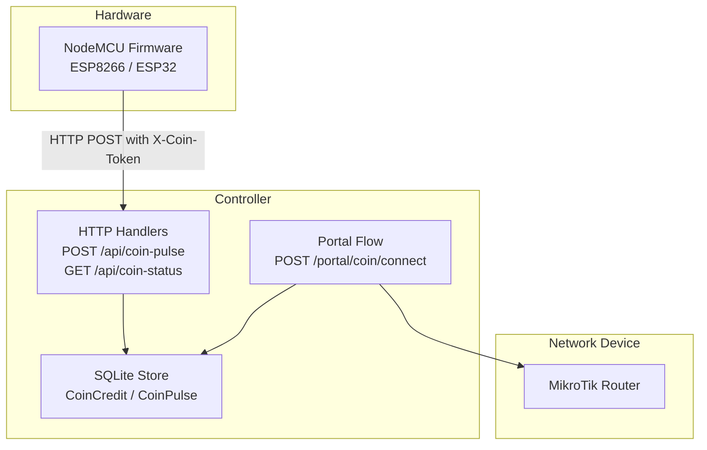
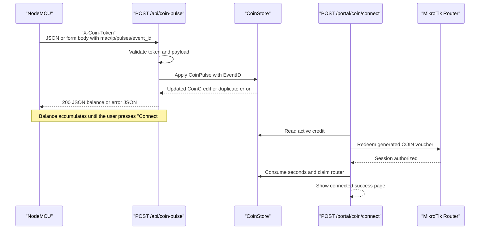
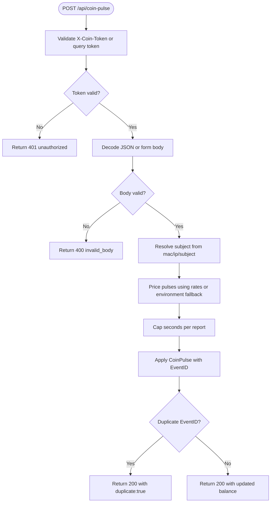
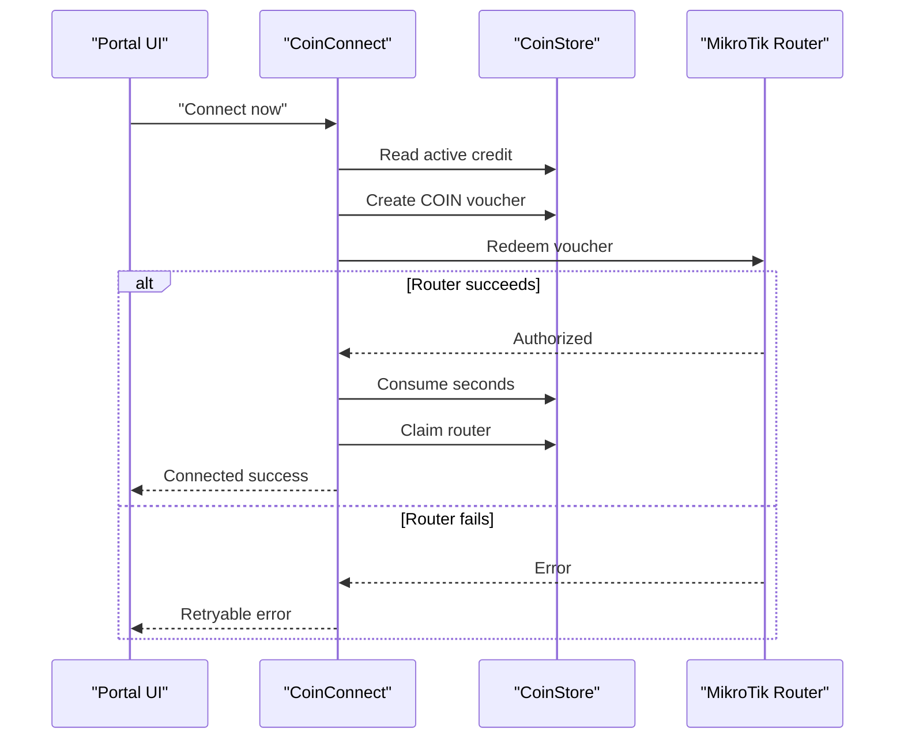
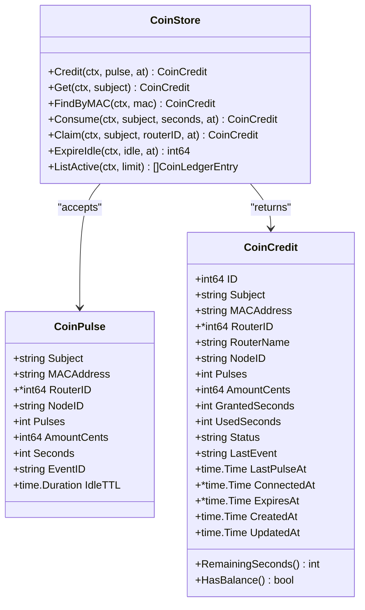

# Coin Integration API

<cite>
**Referenced Files in This Document**
- [coin.go](file://handlers/coin.go)
- [coins.go](file://database/coins.go)
- [nodemcu_coin_slot.ino](file://hardware/nodemcu_coin_slot/nodemcu_coin_slot.ino)
- [README.md](file://README.md)
- [config.go](file://config.go)
</cite>

## Table of Contents
1. [Introduction](#introduction)
2. [Project Structure](#project-structure)
3. [Core Components](#core-components)
4. [Architecture Overview](#architecture-overview)
5. [Detailed Component Analysis](#detailed-component-analysis)
6. [Dependency Analysis](#dependency-analysis)
7. [Performance Considerations](#performance-considerations)
8. [Troubleshooting Guide](#troubleshooting-guide)
9. [Conclusion](#conclusion)

## Introduction
This document describes the coin acceptor integration for the Aircoins MikroTik Controller, focusing on the hardware-facing endpoint that receives coin pulse events from a NodeMCU-based coin acceptor. It explains authentication, request and response formats, credit allocation, voucher redemption, security considerations, rate limits, error handling, and common troubleshooting scenarios.

The system is designed so that an inserted coin is never lost and never counted twice:
- The controller persists credit in SQLite rather than memory.
- Every hardware report carries a de-duplication token.
- Credit is only deducted after the router successfully authorizes the client.

## Project Structure
The coin integration spans three main areas:
- HTTP handlers for the coin API and portal connection flow.
- Database models and persistence for coin credits, pulses, and idle expiry.
- Embedded NodeMCU firmware that counts acceptor pulses and reports them to the controller.

**Diagram sources**
- [coin.go:27-50](file://handlers/coin.go#L27-L50)
- [coins.go:41-118](file://database/coins.go#L41-L118)
- [nodemcu_coin_slot.ino:9-27](file://hardware/nodemcu_coin_slot/nodemcu_coin_slot.ino#L9-L27)

**Section sources**
- [coin.go:1-55](file://handlers/coin.go#L1-L55)
- [coins.go:1-39](file://database/coins.go#L1-L39)
- [nodemcu_coin_slot.ino:1-64](file://hardware/nodemcu_coin_slot/nodemcu_coin_slot.ino#L1-L64)

## Core Components
- **POST /api/coin-pulse**: Receives coin pulse events from the NodeMCU, authenticates the node, prices pulses into time or accepts explicit denomination data, applies idempotent credit, and returns the updated balance.
- **GET /api/coin-status**: Returns the current coin balance for a subject (MAC or IP), used by the captive portal while the customer stands at the box.
- **POST /portal/coin/connect**: Converts accumulated coin credit into a voucher and redeems it against the MikroTik router; this is the “Done / Connect now” flow.
- **Database coin store**: Persists running totals of pulses, face value, granted seconds, used seconds, status, and de-duplication tokens.
- **NodeMCU firmware**: Counts mechanical pulses, debounces interrupts, journals pending reports, and retries until the controller acknowledges the event.

**Section sources**
- [coin.go:27-55](file://handlers/coin.go#L27-L55)
- [coin.go:115-220](file://handlers/coin.go#L115-L220)
- [coin.go:222-263](file://handlers/coin.go#L222-L263)
- [coin.go:334-454](file://handlers/coin.go#L334-L454)
- [coins.go:41-118](file://database/coins.go#L41-L118)
- [coins.go:149-223](file://database/coins.go#L149-L223)
- [nodemcu_coin_slot.ino:67-99](file://hardware/nodemcu_coin_slot/nodemcu_coin_slot.ino#L67-L99)

## Architecture Overview
The coin integration follows a strict separation between hardware reporting and pricing:
- The NodeMCU reports pulses, not seconds or currency amounts, unless its acceptor explicitly knows denominations.
- The controller prices pulses using configured rates or environment fallbacks.
- Credit is durable and idempotent.
- Connection activation goes through the same voucher redemption path as printed vouchers.

**Diagram sources**
- [coin.go:123-220](file://handlers/coin.go#L123-L220)
- [coin.go:353-454](file://handlers/coin.go#L353-L454)
- [coins.go:149-223](file://database/coins.go#L149-L223)
- [nodemcu_coin_slot.ino:374-450](file://hardware/nodemcu_coin_slot/nodemcu_coin_slot.ino#L374-L450)

## Detailed Component Analysis

### POST /api/coin-pulse Endpoint

#### Purpose
Accepts coin pulse reports from a trusted NodeMCU and adds the corresponding access time to the client’s coin balance.

#### Authentication
- The endpoint requires a shared secret provided by the NodeMCU.
- The secret is sent in the `X-Coin-Token` header.
- For compatibility with simple URL-only clients, the token can also be passed as a query parameter named `token`.
- If the controller’s `COIN_NODE_TOKEN` configuration is empty, the endpoint rejects all requests.
- Token comparison uses constant-time comparison to avoid timing side channels.

**Section sources**
- [coin.go:38-50](file://handlers/coin.go#L38-L50)
- [coin.go:551-572](file://handlers/coin.go#L551-L572)
- [README.md:98](file://README.md#L98)
- [config.go:60-65](file://config.go#L60-L65)

#### Request Payload Format
The endpoint accepts either JSON or a URL-encoded form body.

**JSON fields**
- `subject`: Optional storage key. If omitted, the server derives it from `mac` or `ip`.
- `mac`: Client MAC address. Accepts multiple separator styles and is normalized.
- `ip`: Fallback client IP when the hotspot has not yet identified the device.
- `pulses`: Number of acceptor pulses reported.
- `amount_cents`: Optional face value in the smallest currency unit. If zero, derived from pulses and configured rates.
- `seconds`: Optional override for access time per report. If zero, derived from pulses and configured rates.
- `node_id`: Optional identifier for the coin acceptor, used in audit trails.
- `event_id`: Monotonic de-duplication token. A retry with the same ID is ignored.
- `router_id`: Optional integer identifying the router for attribution.

**Form fields**
- Same logical fields as JSON, but parsed from a URL-encoded form body.
- Numeric fields are parsed as integers; missing values default to zero where allowed.

**Section sources**
- [coin.go:57-86](file://handlers/coin.go#L57-L86)
- [coin.go:574-619](file://handlers/coin.go#L574-L619)

#### Response Handling
Successful responses return HTTP 200 with a JSON balance object. Duplicate events also return HTTP 200 with `duplicate: true`, so the NodeMCU stops retrying without treating the coin as failed.

**Response fields**
- `subject`: Storage key for the client.
- `mac`: Normalized MAC address.
- `pulses`: Running total of accepted pulses.
- `amount_cents`: Running total of accepted face value.
- `remaining_seconds`: Access time still available.
- `session_label`: Human-readable remaining time.
- `status`: One of `active`, `connected`, or `expired`.
- `seconds_per_pulse`: Current server-side price per pulse.
- `duplicate`: Boolean indicating whether the event was already recorded.
- `accepted_pulses`: How many pulses this request added.
- `updated_at`: Timestamp of the last update.

Error responses return JSON with `ok: false`, a machine-readable `code`, and a human-readable `message`.

**Section sources**
- [coin.go:88-113](file://handlers/coin.go#L88-L113)
- [coin.go:199-220](file://handlers/coin.go#L199-L220)
- [coin.go:635-654](file://handlers/coin.go#L635-L654)

#### Processing Pipeline

**Diagram sources**
- [coin.go:123-220](file://handlers/coin.go#L123-L220)
- [coins.go:149-223](file://database/coins.go#L149-L223)

**Section sources**
- [coin.go:123-220](file://handlers/coin.go#L123-L220)
- [coins.go:149-223](file://database/coins.go#L149-L223)

### GET /api/coin-status Endpoint

#### Purpose
Allows the captive portal to poll the current coin balance for a client while the customer is standing at the coin box.

#### Subject Resolution
- The endpoint prefers a `mac` query parameter.
- Otherwise, it accepts a `subject` query parameter.
- As a final fallback, it uses the requester’s IP address.
- If no usable subject can be resolved, it returns a 400 error.

**Section sources**
- [coin.go:222-263](file://handlers/coin.go#L222-L263)

### Coin Credit Allocation Workflow

#### Pricing Rules
- If the node sends `seconds` or `amount_cents`, those values are honored because a hardware acceptor that knows its own denominations is authoritative.
- Otherwise, the controller prices pulses using:
  - Active rate tiers from the database, or
  - Environment fallback variables `COIN_SECONDS_PER_PULSE` and `COIN_CENTS_PER_PULSE`.
- If no active rates exist and the environment fallback yields zero, the request fails with a service-unavailable error indicating that an operator must configure rates.

#### Safety Limits
- Seconds per report are capped to prevent a stuck input line or misconfigured node from granting excessive time.
- Pulses, amount cents, and event ID length are bounded by database constants.

**Section sources**
- [coin.go:154-182](file://handlers/coin.go#L154-L182)
- [coin.go:265-298](file://handlers/coin.go#L265-L298)
- [coins.go:24-39](file://database/coins.go#L24-L39)
- [coins.go:149-170](file://database/coins.go#L149-L170)

### Voucher Redemption and Session Activation

#### Conversion to Voucher
When the user presses “Connect”:
1. The portal reads the active coin credit.
2. It generates a unique voucher code with the `COIN` prefix.
3. It provisions the session on the MikroTik router.
4. Only after successful authorization does it consume the credit and attribute it to the router.

This design ensures that if the router is unreachable or refuses the login, the customer’s coins remain on the balance.

**Section sources**
- [coin.go:334-454](file://handlers/coin.go#L334-L454)
- [coins.go:261-319](file://database/coins.go#L261-L319)

**Diagram sources**
- [coin.go:353-454](file://handlers/coin.go#L353-L454)
- [coins.go:261-319](file://database/coins.go#L261-L319)

### NodeMCU Firmware Integration

#### Hardware Responsibilities
- Count pulses from the coin acceptor using an interrupt handler.
- Debounce contact bounce using a time window.
- Journal pending pulses and event counters to flash so power loss does not lose money.
- POST reports to `/api/coin-pulse` with `X-Coin-Token`, MAC, pulses, `node_id`, and `event_id`.
- Treat HTTP 200 with `duplicate: true` as success and stop retrying that event.

#### Configuration
- `COIN_NODE_TOKEN` must match the controller’s configured token.
- `CLIENT_MAC` can be left empty to use the board’s station MAC for kiosk mode.
- `CONTROLLER_HOST` and `CONTROLLER_PORT` define the controller endpoint.
- `NODE_ID` identifies the acceptor for auditing.

**Section sources**
- [nodemcu_coin_slot.ino:9-27](file://hardware/nodemcu_coin_slot/nodemcu_coin_slot.ino#L9-L27)
- [nodemcu_coin_slot.ino:118-141](file://hardware/nodemcu_coin_slot/nodemcu_coin_slot.ino#L118-L141)
- [nodemcu_coin_slot.ino:220-234](file://hardware/nodemcu_coin_slot/nodemcu_coin_slot.ino#L220-L234)
- [nodemcu_coin_slot.ino:249-297](file://hardware/nodemcu_coin_slot/nodemcu_coin_slot.ino#L249-L297)
- [nodemcu_coin_slot.ino:374-450](file://hardware/nodemcu_coin_slot/nodemcu_coin_slot.ino#L374-L450)
- [nodemcu_coin_slot.ino:456-511](file://hardware/nodemcu_coin_slot/nodemcu_coin_slot.ino#L456-L511)
- [nodemcu_coin_slot.ino:515-576](file://hardware/nodemcu_coin_slot/nodemcu_coin_slot.ino#L515-L576)

### Security Considerations for Hardware Integration

- **Shared secret required**: The controller rejects all coin-pulse requests if `COIN_NODE_TOKEN` is unset.
- **Header-based authentication**: The NodeMCU sends the token in `X-Coin-Token`; browsers cannot set custom headers via cross-site forms, reducing exposure.
- **Constant-time comparison**: Prevents timing attacks against the token.
- **Idempotent credit**: `event_id` prevents double-counting even if the NodeMCU retries after network failure.
- **Rate and value caps**: Pulses, amount cents, seconds, and event ID length are bounded.
- **Idle expiry**: Unspent balances expire after a configurable window so one customer’s credit does not leak to the next user on the same address.

**Section sources**
- [coin.go:38-50](file://handlers/coin.go#L38-L50)
- [coin.go:551-572](file://handlers/coin.go#L551-L572)
- [coins.go:24-39](file://database/coins.go#L24-L39)
- [coins.go:321-348](file://database/coins.go#L321-L348)
- [nodemcu_coin_slot.ino:67-99](file://hardware/nodemcu_coin_slot/nodemcu_coin_slot.ino#L67-L99)

### Rate Limiting for Coin Pulses
The implementation does not implement a general-purpose request-per-second rate limiter for `/api/coin-pulse`. Instead, it enforces safety through:
- Maximum pulses per report.
- Maximum amount cents per report.
- Maximum seconds granted per report.
- De-duplication via `event_id`.
- Idle expiry of unspent balances.

For high-throughput deployments, consider adding a separate rate limiter around the coin endpoints if needed.

**Section sources**
- [coins.go:24-39](file://database/coins.go#L24-L39)
- [coins.go:149-170](file://database/coins.go#L149-L170)
- [coins.go:321-348](file://database/coins.go#L321-L348)

### Error Handling

#### Invalid or Missing Token
- Returns HTTP 401 with an unauthorized error code.
- Logs the remote address and reason.

**Section sources**
- [coin.go:123-131](file://handlers/coin.go#L123-L131)

#### Malformed Request Body
- Returns HTTP 400 with an `invalid_body` code.
- Includes the decoding error message.

**Section sources**
- [coin.go:133-138](file://handlers/coin.go#L133-L138)
- [coin.go:574-619](file://handlers/coin.go#L574-L619)

#### Invalid Pulse Data
- Returned by the database layer when pulses, amount cents, seconds, or subject violate constraints.
- Mapped to HTTP 400 with an `invalid_pulse` code.

**Section sources**
- [coin.go:199-211](file://handlers/coin.go#L199-L211)
- [coins.go:149-170](file://database/coins.go#L149-L170)

#### No Active Rates
- Returns HTTP 503 with a `no_rates` code when pricing fails due to missing rate configuration.

**Section sources**
- [coin.go:154-176](file://handlers/coin.go#L154-L176)

#### Duplicate Event
- Returns HTTP 200 with `duplicate: true`, allowing the NodeMCU to treat the coin as paid without retrying indefinitely.

**Section sources**
- [coin.go:200-208](file://handlers/coin.go#L200-L208)
- [coins.go:216-223](file://database/coins.go#L216-L223)

## Dependency Analysis

**Diagram sources**
- [coins.go:41-118](file://database/coins.go#L41-L118)
- [coins.go:149-319](file://database/coins.go#L149-L319)

**Section sources**
- [coins.go:41-118](file://database/coins.go#L41-L118)
- [coins.go:149-319](file://database/coins.go#L149-L319)

## Performance Considerations
- **Interrupt-driven counting**: The NodeMCU increments a counter in the ISR, ensuring fast pulse bursts are captured without blocking the main loop.
- **Debouncing**: A time-window debounce avoids double-counting contact bounce while preserving rapid multi-coin sequences.
- **Bounded reporting**: The firmware batches pulses up to a maximum per report to keep payloads small and safe.
- **Durable journaling**: Pending pulses and event IDs are written to flash before transmission, surviving power loss.
- **Server-side caps**: The controller limits pulses, amount cents, and seconds per report to protect against misconfiguration or stuck hardware.
- **Idle expiry**: Background expiry prevents stale balances from accumulating indefinitely.

**Section sources**
- [nodemcu_coin_slot.ino:220-234](file://hardware/nodemcu_coin_slot/nodemcu_coin_slot.ino#L220-L234)
- [nodemcu_coin_slot.ino:152-185](file://hardware/nodemcu_coin_slot/nodemcu_coin_slot.ino#L152-L185)
- [nodemcu_coin_slot.ino:531-576](file://hardware/nodemcu_coin_slot/nodemcu_coin_slot.ino#L531-L576)
- [coins.go:24-39](file://database/coins.go#L24-L39)
- [coins.go:321-348](file://database/coins.go#L321-L348)

## Troubleshooting Guide

### NodeMCU Reports Nothing
- Verify `COIN_NODE_TOKEN` matches the controller’s configured token.
- Check Wi-Fi association logs and ensure the controller host is reachable.
- Confirm the acceptor signal pin wiring and pull-up configuration.
- Inspect serial output for “FATAL: COIN_NODE_TOKEN is empty” or connection failures.

**Section sources**
- [nodemcu_coin_slot.ino:118-141](file://hardware/nodemcu_coin_slot/nodemcu_coin_slot.ino#L118-L141)
- [nodemcu_coin_slot.ino:301-343](file://hardware/nodemcu_coin_slot/nodemcu_coin_slot.ino#L301-L343)
- [nodemcu_coin_slot.ino:468-476](file://hardware/nodemcu_coin_slot/nodemcu_coin_slot.ino#L468-L476)

### Coins Are Not Counted or Double-Counted
- Adjust the debounce window if contacts bounce too quickly or too slowly.
- Ensure the acceptor wiring uses a proper voltage divider for 5V open-collector outputs.
- Check for mechanical issues causing repeated edges.

**Section sources**
- [nodemcu_coin_slot.ino:152-175](file://hardware/nodemcu_coin_slot/nodemcu_coin_slot.ino#L152-L175)
- [nodemcu_coin_slot.ino:30-47](file://hardware/nodemcu_coin_slot/nodemcu_coin_slot.ino#L30-L47)

### Controller Rejects Requests
- Confirm `X-Coin-Token` is present and correct.
- Check for malformed JSON or invalid numeric fields.
- Review error codes such as `unauthorized`, `invalid_body`, `invalid_subject`, `no_rates`, and `invalid_pulse`.

**Section sources**
- [coin.go:123-138](file://handlers/coin.go#L123-L138)
- [coin.go:140-176](file://handlers/coin.go#L140-L176)
- [coin.go:199-211](file://handlers/coin.go#L199-L211)

### Credit Is Not Spent on Connect
- Ensure the portal can resolve the client’s credit by IP or MAC.
- Verify the router is reachable and the voucher redemption succeeds.
- Check that the credit has remaining seconds and is not expired.

**Section sources**
- [coin.go:353-454](file://handlers/coin.go#L353-L454)
- [coins.go:261-319](file://database/coins.go#L261-L319)
- [coins.go:321-348](file://database/coins.go#L321-L348)

### Reconciliation and Audit
- Use `node_id` and `event_id` to correlate hardware reports with controller logs.
- Review active coin credits and their last pulse timestamps.
- Match voucher notes containing node identifiers and pulse counts.

**Section sources**
- [coin.go:506-549](file://handlers/coin.go#L506-L549)
- [coins.go:357-378](file://database/coins.go#L357-L378)

## Conclusion
The coin integration provides a secure, durable, and auditable pipeline from mechanical coin pulses to hotspot sessions. Authentication is enforced at the HTTP layer, credit is persisted and de-duplicated at the database layer, and connection activation reuses the existing voucher redemption flow. The NodeMCU firmware is designed for reliability under power loss and network instability, while the controller applies conservative limits and idle expiry to protect operators and customers.