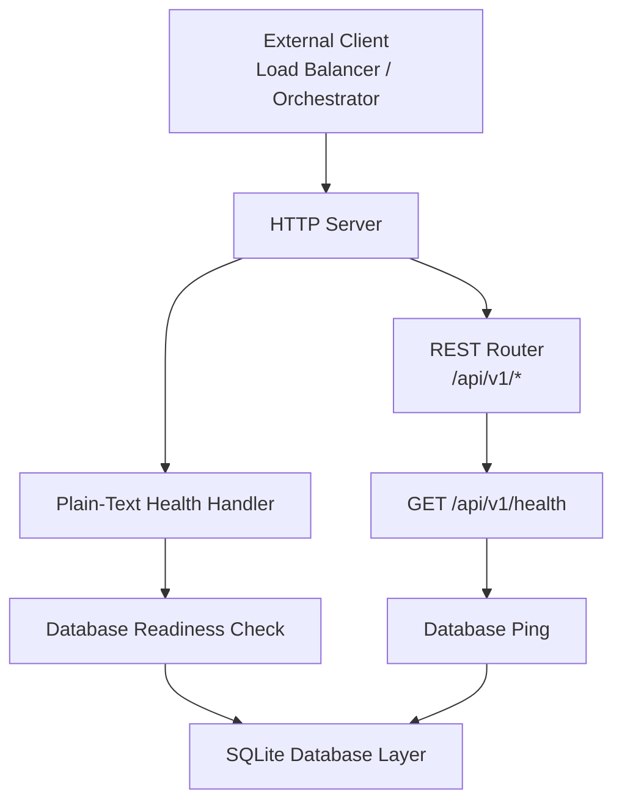
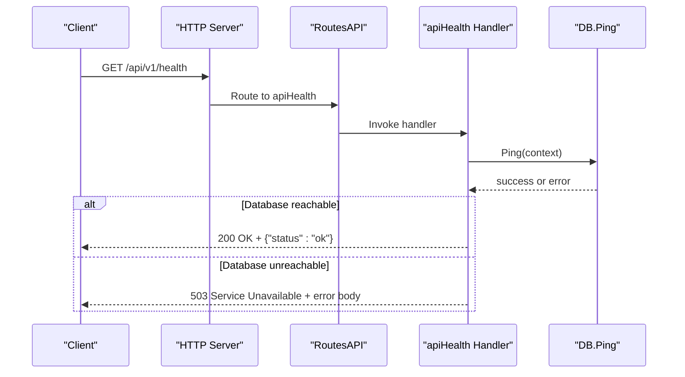
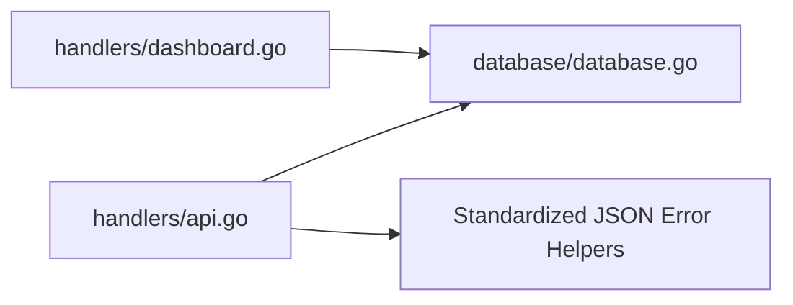

# Health & Monitoring API

<cite>
**Referenced Files in This Document**
- [main.go](file://main.go)
- [handlers/api.go](file://handlers/api.go)
- [handlers/dashboard.go](file://handlers/dashboard.go)
- [database/database.go](file://database/database.go)
</cite>

## Table of Contents
1. [Introduction](#introduction)
2. [Project Structure](#project-structure)
3. [Core Components](#core-components)
4. [Architecture Overview](#architecture-overview)
5. [Detailed Component Analysis](#detailed-component-analysis)
6. [Dependency Analysis](#dependency-analysis)
7. [Performance Considerations](#performance-considerations)
8. [Troubleshooting Guide](#troubleshooting-guide)
9. [Conclusion](#conclusion)

## Introduction
This document describes the health check and monitoring endpoints for the Aircoins MikroTik Controller, with a focus on the machine-readable liveness probe at `GET /api/v1/health`. It explains how the endpoint verifies service availability and database connectivity, documents response formats and error conditions, and provides guidance for integration with load balancers, container orchestration systems, and monitoring tools such as Prometheus or Grafana.

The controller exposes both:
- A JSON-based REST health endpoint under `/api/v1/health`, suitable for automated system clients.
- A plain-text health endpoint used by systemd and load balancers, which performs a lightweight database readiness check.

## Project Structure
The health-related behavior is implemented across three layers:
- HTTP routing and handler logic live in the handlers package.
- The database layer provides connection pooling, migrations, and ping/readiness checks.
- The application entry point wires configuration, logging, graceful shutdown, and server startup.



**Diagram sources**
- [handlers/api.go:106-146](file://handlers/api.go#L106-L146)
- [handlers/dashboard.go:88-98](file://handlers/dashboard.go#L88-L98)
- [database/database.go:143-146](file://database/database.go#L143-L146)

**Section sources**
- [main.go:214-285](file://main.go#L214-L285)
- [handlers/api.go:106-146](file://handlers/api.go#L106-L146)
- [handlers/dashboard.go:88-98](file://handlers/dashboard.go#L88-L98)
- [database/database.go:70-116](file://database/database.go#L70-L116)

## Core Components
- REST health handler: Implements `GET /api/v1/health` and returns structured JSON indicating service status.
- Plain-text health handler: Returns simple text for systemd/load balancer compatibility.
- Database layer: Provides `Ping` and readiness checks against the SQLite backend.

Key responsibilities:
- Keep health checks fast and non-blocking.
- Fail fast when the database is unreachable.
- Return stable, machine-parseable responses.

**Section sources**
- [handlers/api.go:138-146](file://handlers/api.go#L138-L146)
- [handlers/dashboard.go:88-98](file://handlers/dashboard.go#L88-L98)
- [database/database.go:143-146](file://database/database.go#L143-L146)

## Architecture Overview
The health check flow validates that the process is running and that the embedded SQLite database is reachable.



**Diagram sources**
- [handlers/api.go:106-146](file://handlers/api.go#L106-L146)
- [database/database.go:143-146](file://database/database.go#L143-L146)

## Detailed Component Analysis

### REST Health Endpoint: `GET /api/v1/health`
Purpose:
- Provide a machine-readable liveness probe for orchestrators and automation.
- Validate that the controller process is alive and its SQLite database is reachable.

Request:
- Method: `GET`
- Path: `/api/v1/health`
- Headers: None required; standard HTTP headers apply.

Response:
- Success:
  - Status code: `200 OK`
  - Content-Type: `application/json`
  - Body: `{"status": "ok"}`
- Failure:
  - Status code: `503 Service Unavailable`
  - Content-Type: `application/json`
  - Body: Standardized error object containing a short code and message.

Error handling:
- If the database ping fails, the endpoint responds with `503 Service Unavailable` and an error payload indicating that the database is unreachable.

Implementation notes:
- The handler calls the database layer’s ping method using the request context.
- Successful pings return a minimal JSON object with a single status field.
- All API errors use a consistent JSON structure with `code` and `message` fields.

```mermaid
flowchart TD
Start(["GET /api/v1/health"]) --> Ping["Call database.Ping(ctx)"]
Ping --> Ok{"Ping succeeded?"}
Ok --> |Yes| RespondOK["Return 200 OK<br/>JSON {\"status\":\"ok\"}"]
Ok --> |No| RespondError["Return 503 Service Unavailable<br/>Standardized error JSON"]
RespondOK --> End(["Done"])
RespondError --> End
```

**Diagram sources**
- [handlers/api.go:138-146](file://handlers/api.go#L138-L146)
- [database/database.go:143-146](file://database/database.go#L143-L146)

**Section sources**
- [handlers/api.go:24-42](file://handlers/api.go#L24-L42)
- [handlers/api.go:106-146](file://handlers/api.go#L106-L146)
- [database/database.go:143-146](file://database/database.go#L143-L146)

### Plain-Text Health Endpoint
Purpose:
- Provide a simple text-based health check compatible with systemd and legacy load balancers.
- Perform a lightweight database readiness check.

Behavior:
- On success, returns `200 OK` with a plain `ok` line.
- On failure, returns `503 Service Unavailable` with a plain `unhealthy` line and logs the underlying error.

Integration note:
- This endpoint uses a database readiness check rather than a raw ping, making it suitable for probes that need to confirm the database is ready beyond just being open.

**Section sources**
- [handlers/dashboard.go:88-98](file://handlers/dashboard.go#L88-L98)

### Database Connectivity Checks
The database layer exposes two relevant operations:
- `Ping`: Performs a direct ping against the underlying SQLite connection pool.
- `Open`: During initialization, opens the database, applies migrations, and pings the database to ensure it is writable and ready.

Operational implications:
- Startup failures can occur if the database file cannot be written or opened.
- Runtime health checks rely on `Ping` to detect connectivity issues.

**Section sources**
- [database/database.go:70-116](file://database/database.go#L70-L116)
- [database/database.go:143-146](file://database/database.go#L143-L146)

### Application Lifecycle and Health Context
The application:
- Loads configuration and sets up logging.
- Opens the database with a timeout during startup.
- Starts the HTTP server with configured timeouts.
- Handles graceful shutdown on signals.

Relevance to health checks:
- Health checks should remain fast because the server may be shutting down while still accepting requests briefly.
- Timeouts are set at the HTTP server level, so health checks must complete within those bounds.

**Section sources**
- [main.go:214-285](file://main.go#L214-L285)

## Dependency Analysis
The health endpoint depends on:
- HTTP routing and middleware chain.
- The database layer for connectivity verification.
- Consistent JSON error formatting utilities.



**Diagram sources**
- [handlers/api.go:106-146](file://handlers/api.go#L106-L146)
- [handlers/dashboard.go:88-98](file://handlers/dashboard.go#L88-L98)
- [database/database.go:143-146](file://database/database.go#L143-L146)

**Section sources**
- [handlers/api.go:24-42](file://handlers/api.go#L24-L42)
- [handlers/api.go:106-146](file://handlers/api.go#L106-L146)
- [handlers/dashboard.go:88-98](file://handlers/dashboard.go#L88-L98)
- [database/database.go:143-146](file://database/database.go#L143-L146)

## Performance Considerations
- Keep health checks lightweight: only verify essential dependencies (here, the database).
- Avoid heavy queries or external network calls in liveness probes.
- Use short-lived contexts and respect server timeouts.
- Prefer `200 OK` for healthy states and `503 Service Unavailable` for degraded states.
- For readiness probes, consider checking whether the database is fully initialized and writable.

[No sources needed since this section provides general guidance]

## Troubleshooting Guide
Common issues and diagnostics:
- Database unreachable:
  - The REST health endpoint returns `503 Service Unavailable` with an error indicating the database is unreachable.
  - Check database file permissions, disk space, and SQLite WAL mode settings.
- Startup failures:
  - If the database cannot be opened or pinged during startup, the application reports an error before serving traffic.
- Log inspection:
  - The plain-text health handler logs errors when the database readiness check fails.
  - Review application logs around health check failures to identify root causes.

Recommended steps:
- Verify the database path and permissions.
- Confirm the process has write access to the SQLite file.
- Inspect application logs for detailed error messages.
- Ensure the service is not in graceful shutdown when health checks fail.

**Section sources**
- [handlers/api.go:138-146](file://handlers/api.go#L138-L146)
- [handlers/dashboard.go:88-98](file://handlers/dashboard.go#L88-L98)
- [database/database.go:70-116](file://database/database.go#L70-L116)

## Conclusion
The Aircoins MikroTik Controller provides robust health check capabilities through both a JSON REST endpoint and a plain-text endpoint. The REST endpoint offers a clear, machine-parseable signal for orchestrators and automation, while the plain-text endpoint supports traditional system integrations. Both rely on lightweight database connectivity checks to ensure reliable liveness and readiness signaling. Operators should monitor these endpoints, keep them fast, and use logs and status codes to diagnose service availability issues quickly.

[No sources needed since this section summarizes without analyzing specific files]