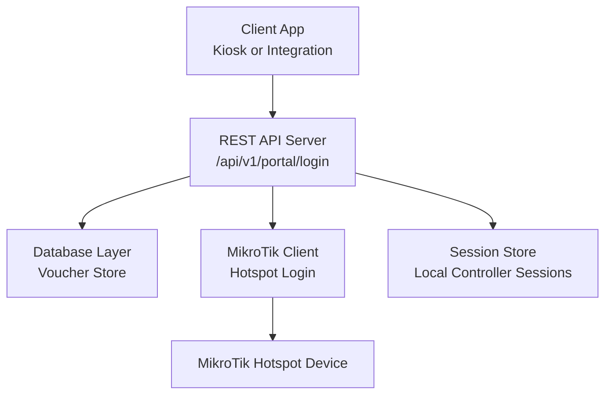
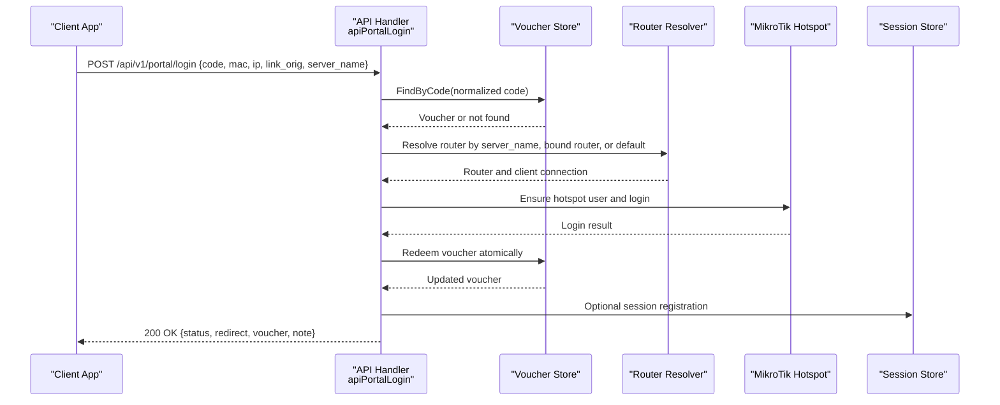
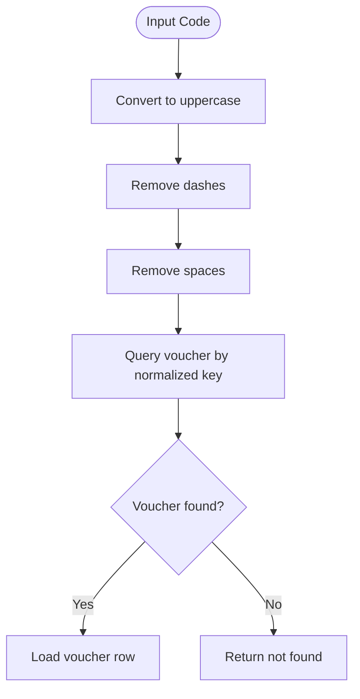
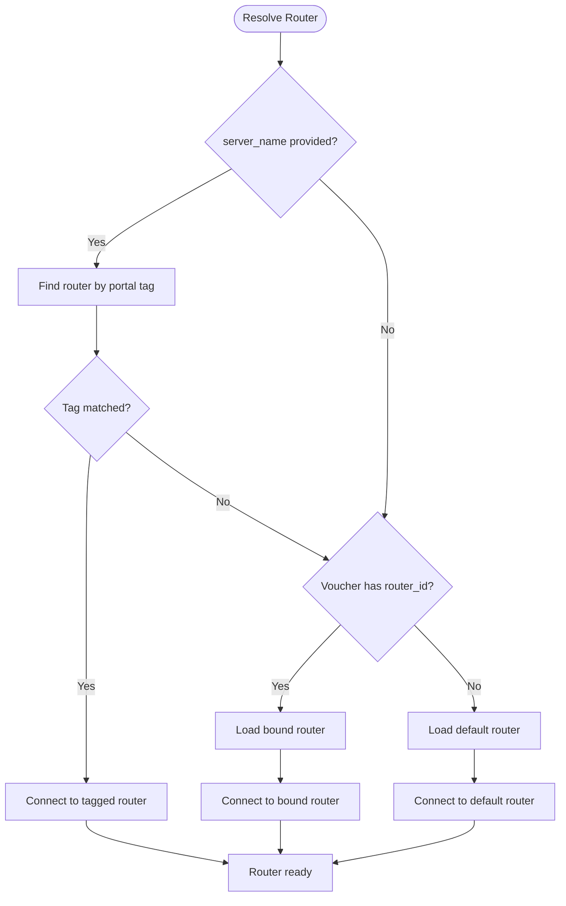
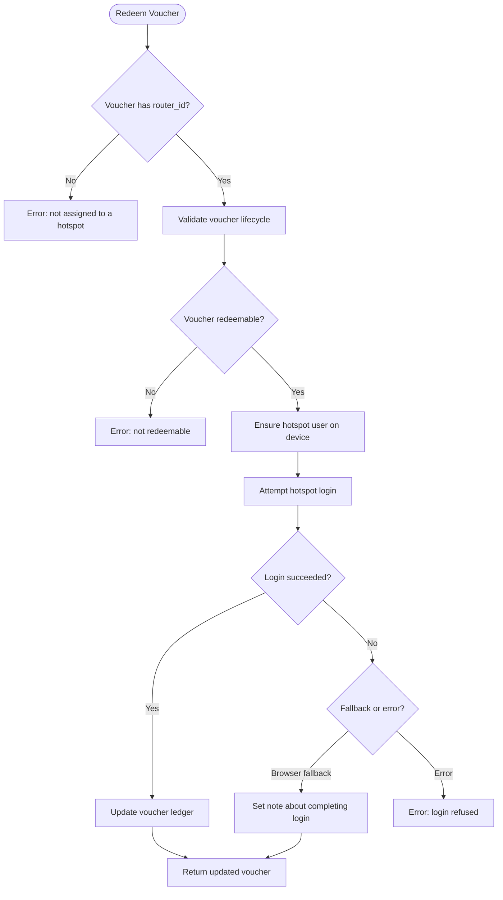
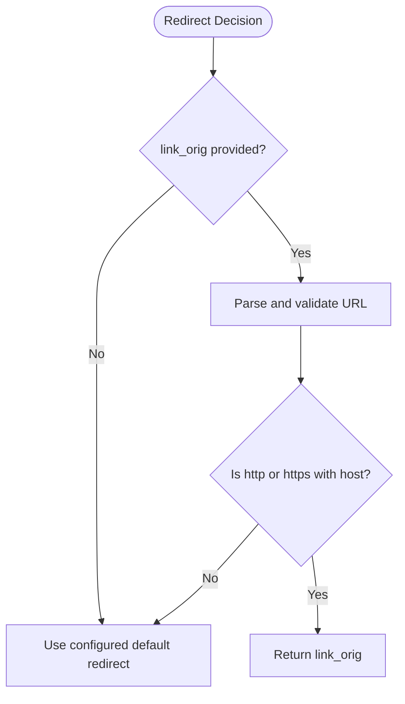
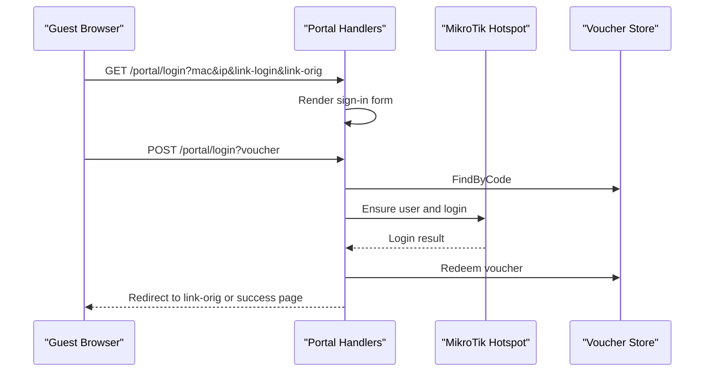
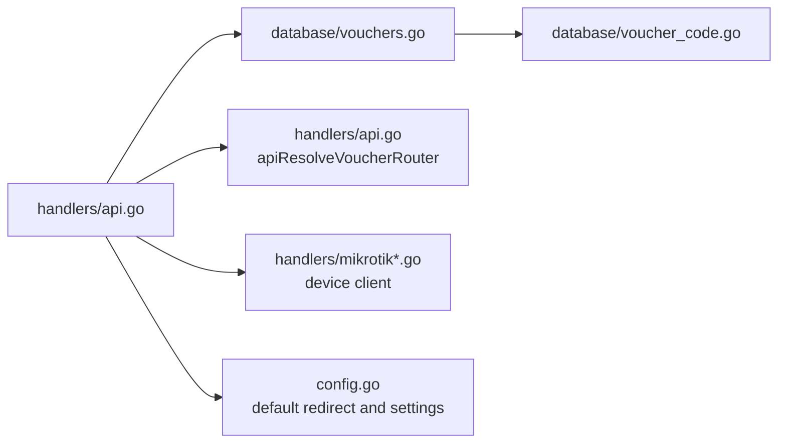

# Portal Authentication API

<cite>
**Referenced Files in This Document**   
- [api.go](file://handlers/api.go)
- [portal.go](file://handlers/portal.go)
- [captive.go](file://handlers/captive.go)
- [vouchers.go](file://database/vouchers.go)
- [voucher_code.go](file://database/voucher_code.go)
</cite>

## Table of Contents
1. [Introduction](#introduction)
2. [Project Structure](#project-structure)
3. [Core Components](#core-components)
4. [Architecture Overview](#architecture-overview)
5. [Detailed Component Analysis](#detailed-component-analysis)
6. [Dependency Analysis](#dependency-analysis)
7. [Performance Considerations](#performance-considerations)
8. [Troubleshooting Guide](#troubleshooting-guide)
9. [Conclusion](#conclusion)

## Introduction
This document provides comprehensive API documentation for the captive portal authentication endpoint used by voucher-based hotspot access. The primary endpoint is `POST /api/v1/portal/login`. It accepts a JSON payload containing a voucher code and MikroTik hotspot redirect parameters, validates the voucher against the local ledger, provisions or uses the key on a MikroTik Hotspot device, creates a controller-side session record, and returns a safe redirect URL for the client to continue browsing.

The implementation is part of a MikroTik controller that manages routers, vouchers, sessions, and the captive portal UI. The API is intended for machine clients such as kiosk systems, integrations, or automated login flows rather than direct browser interaction.

## Project Structure
The portal authentication flow spans several layers:

- HTTP routing and JSON request/response handling live under the REST API layer.
- Voucher validation and redemption logic are implemented in the handler and database packages.
- MikroTik Hotspot integration is performed through a dedicated client abstraction.
- The captive portal UI and browser-based login flow share related helpers with the API.

**Diagram sources**
- [api.go:108-136](file://handlers/api.go#L108-L136)
- [api.go:1224-1285](file://handlers/api.go#L1224-L1285)
- [vouchers.go:289-303](file://database/vouchers.go#L289-L303)
- [vouchers.go:439-495](file://database/vouchers.go#L439-L495)

**Section sources**
- [api.go:108-136](file://handlers/api.go#L108-L136)
- [portal.go:19-63](file://handlers/portal.go#L19-L63)

## Core Components
The portal authentication API relies on these core components:

| Component | Responsibility | Key Behavior |
|---|---|---|
| REST API handler | Accepts JSON requests, validates input, resolves router, redeems voucher, writes JSON responses | Uses standardized error format and JSON encoder |
| Voucher store | Loads vouchers by normalized code, enforces lifecycle rules, consumes redemptions atomically | Supports dash/space-insensitive lookup and transactional redemption |
| Router resolver | Chooses the MikroTik device based on server-name tag, voucher binding, or default router | Returns unreachable or missing-router errors when needed |
| Mikrotik client | Ensures hotspot user exists, performs hotspot login, disconnects clients | Handles RouterOS-specific errors and fallback behavior |
| Session store | Records controller-side portal sessions for guest-facing status pages | Mirrors active hotspot logins for UI display |

**Section sources**
- [api.go:24-50](file://handlers/api.go#L24-L50)
- [api.go:1126-1170](file://handlers/api.go#L1126-L1170)
- [vouchers.go:78-160](file://database/vouchers.go#L78-L160)
- [vouchers.go:289-303](file://database/vouchers.go#L289-L303)
- [vouchers.go:439-495](file://database/vouchers.go#L439-L495)

## Architecture Overview
The `POST /api/v1/portal/login` endpoint implements a controlled authentication workflow:

1. Parse and validate the JSON body.
2. Require a non-empty voucher code.
3. Look up the voucher using a normalized code lookup.
4. Resolve the target MikroTik router.
5. Provision the hotspot user if required.
6. Attempt hotspot login via the device API.
7. Atomically redeem the voucher in the database.
8. Return an authenticated response with a safe redirect URL.

**Diagram sources**
- [api.go:1224-1285](file://handlers/api.go#L1224-L1285)
- [api.go:1126-1170](file://handlers/api.go#L1126-L1170)
- [vouchers.go:439-495](file://database/vouchers.go#L439-L495)

## Detailed Component Analysis

### Endpoint Definition
The endpoint is registered under `/api/v1` and handled by `apiPortalLogin`. It expects a JSON body and returns standardized JSON responses.

| Field | Type | Required | Description |
|---|---|---:|---|
| `code` | string | Yes | Voucher code submitted by the client. Normalized during lookup. |
| `mac` | string | No | Client MAC address forwarded from the hotspot. |
| `ip` | string | No | Client IP address forwarded from the hotspot. |
| `link_login` | string | No | MikroTik hotspot login URL used for browser fallback flows. |
| `link_orig` | string | No | Original destination URL requested before redirection. Used for post-login redirect. |
| `server_name` | string | No | Hotspot server name used to resolve the correct router when multiple devices are configured. |

**Section sources**
- [api.go:135-136](file://handlers/api.go#L135-L136)
- [api.go:1224-1232](file://handlers/api.go#L1224-L1232)

### Request Validation Rules
- The request body must be valid JSON.
- The `code` field must be present and non-empty after trimming whitespace.
- Missing or invalid JSON returns a bad request error.
- Missing `code` returns a validation error.

**Section sources**
- [api.go:44-50](file://handlers/api.go#L44-L50)
- [api.go:1233-1242](file://handlers/api.go#L1233-L1242)

### Voucher Lookup and Normalization
Voucher codes are normalized so users can type them without dashes or spaces. The lookup function converts the input to uppercase and removes dashes and spaces before querying the database.

**Diagram sources**
- [voucher_code.go:90-96](file://database/voucher_code.go#L90-L96)
- [vouchers.go:289-303](file://database/vouchers.go#L289-L303)

**Section sources**
- [voucher_code.go:10-16](file://database/voucher_code.go#L10-L16)
- [voucher_code.go:90-96](file://database/voucher_code.go#L90-L96)
- [vouchers.go:289-303](file://database/vouchers.go#L289-L303)

### Router Resolution Strategy
The endpoint selects the MikroTik device using this priority order:

1. If `server_name` is provided, find a router whose portal tag matches.
2. If the voucher has a bound router ID, use that router.
3. Otherwise, fall back to the default portal router.

If no router can be resolved or the device is unreachable, the endpoint returns an appropriate error instead of proceeding with authentication.

**Diagram sources**
- [api.go:1126-1170](file://handlers/api.go#L1126-L1170)

**Section sources**
- [api.go:1126-1170](file://handlers/api.go#L1126-L1170)

### Voucher Redemption and MikroTik Integration
Redemption is the core business operation. It ensures the hotspot user exists, attempts login, and then atomically updates the voucher ledger.

Key behaviors:

- A voucher without a bound router cannot be redeemed through this flow.
- The voucher’s lifecycle state is checked before redemption.
- The hotspot user is created or verified on the device.
- Hotspot login may succeed directly via API or require browser completion.
- The voucher is only marked redeemed after successful device provisioning and login preparation.
- If the ledger update fails after a successful device login, the implementation attempts to roll back the hotspot session.

**Diagram sources**
- [api.go:1260-1272](file://handlers/api.go#L1260-L1272)
- [vouchers.go:439-495](file://database/vouchers.go#L439-L495)

**Section sources**
- [vouchers.go:141-160](file://database/vouchers.go#L141-L160)
- [vouchers.go:439-495](file://database/vouchers.go#L439-L495)

### Response Format
On success, the endpoint returns HTTP 200 with a JSON object containing:

| Field | Type | Description |
|---|---|---|
| `status` | string | Always `"authenticated"` on success. |
| `login_via_api` | boolean | Indicates whether the hotspot login was completed through the device API. |
| `note` | string | Human-readable note, such as when the hotspot requires browser completion. |
| `voucher` | object | Voucher metadata including code, profile, limits, usage counts, and timestamps. |
| `redirect` | string | Safe redirect URL for the client to continue browsing. |

The voucher object includes fields such as code, batch, router association, profile, duration, data limit, device limit, price, status, usage counts, and timestamps.

**Section sources**
- [api.go:1278-1284](file://handlers/api.go#L1278-L1284)
- [api.go:272-308](file://handlers/api.go#L272-L308)

### Redirect Handling and Security
The redirect URL comes from `link_orig`. If it is empty or not a safe absolute HTTP(S) URL, the system falls back to the configured default redirect.

Security properties:

- Only absolute `http://` or `https://` URLs are accepted.
- Relative paths, protocol-relative URLs, and unsafe schemes are rejected.
- The redirect is validated before being returned to the client.

**Diagram sources**
- [api.go:1274-1290](file://handlers/api.go#L1274-L1290)

**Section sources**
- [api.go:1274-1290](file://handlers/api.go#L1274-L1290)

### Browser-Based Portal Flow Comparison
The browser-based captive portal flow shares much of the same redemption logic but differs in transport and presentation:

- The browser form posts to `/portal/login` with hotspot parameters in the action query string and the voucher in the form body.
- The handler reads both the query string and form body.
- Successful voucher redemption registers a local session and redirects the browser to the original destination or a fallback page.
- The API endpoint is machine-oriented and returns JSON instead of HTML.

**Diagram sources**
- [portal.go:85-114](file://handlers/portal.go#L85-L114)
- [portal.go:116-194](file://handlers/portal.go#L116-L194)
- [portal.go:198-242](file://handlers/portal.go#L198-L242)

**Section sources**
- [portal.go:85-114](file://handlers/portal.go#L85-L114)
- [portal.go:116-194](file://handlers/portal.go#L116-L194)
- [portal.go:198-242](file://handlers/portal.go#L198-L242)
- [captive.go:95-153](file://handlers/captive.go#L95-L153)

### Error Responses
All non-success responses use a standardized JSON error structure with `code` and `message`.

| Status | Error Code | Meaning |
|---:|---|---|
| 400 | `bad_request` | Invalid JSON body. |
| 400 | `validation` | Missing or empty required field such as `code`. |
| 401 | `invalid_code` | Voucher code not found in the database. |
| 409 | `not_redeemable` | Voucher exists but cannot be redeemed due to lifecycle rules. |
| 422 | `no_router` | Voucher is not assigned to a hotspot or router resolution failed. |
| 502 | `router_unreachable` | Target router could not be connected. |
| 502 | `redeem_failed` | General device or redemption failure. |
| 500 | `db_error` | Database error while loading voucher or performing operations. |

Common redemption reasons include disabled vouchers, expired validity windows, fully consumed uses, and insufficient remaining uses.

**Section sources**
- [api.go:24-42](file://handlers/api.go#L24-L42)
- [api.go:1233-1285](file://handlers/api.go#L1233-L1285)
- [vouchers.go:141-160](file://database/vouchers.go#L141-L160)

### Session Creation
The API endpoint itself does not explicitly register a controller-side session in its implementation path. However, the browser-based portal flow registers a session after successful redemption. Machine clients integrating with this API should treat the presence of `login_via_api` and a successful HTTP 200 response as proof that the hotspot session exists on the MikroTik device.

For operator-facing session visibility, the browser portal flow records:

- Router ID
- Username (voucher code)
- Client IP
- MAC address
- Login method
- Server name

**Section sources**
- [portal.go:331-344](file://handlers/portal.go#L331-L344)

## Dependency Analysis
The portal authentication endpoint depends on several internal modules:

**Diagram sources**
- [api.go:1224-1285](file://handlers/api.go#L1224-L1285)
- [api.go:1126-1170](file://handlers/api.go#L1126-L1170)
- [vouchers.go:289-303](file://database/vouchers.go#L289-L303)
- [voucher_code.go:90-96](file://database/voucher_code.go#L90-L96)

**Section sources**
- [api.go:108-136](file://handlers/api.go#L108-L136)
- [api.go:1126-1170](file://handlers/api.go#L1126-L1170)
- [vouchers.go:289-303](file://database/vouchers.go#L289-L303)
- [voucher_code.go:90-96](file://database/voucher_code.go#L90-L96)

## Performance Considerations
- Voucher lookup uses normalized keys, which avoids case and formatting issues but still requires a database read per login attempt.
- Redemption is transactional, preventing race conditions where two simultaneous login attempts consume the same single-use voucher.
- Router connections are opened per request and closed after processing; long-lived connections are not reused by this endpoint.
- Redirect validation is lightweight string and URL parsing.
- External dependencies include the database and MikroTik device; network latency and device availability are the main performance constraints.

[No sources needed since this section provides general guidance]

## Troubleshooting Guide

### Common Issues

| Symptom | Likely Cause | Recommended Action |
|---|---|---|
| `invalid_code` | Voucher code not found | Verify the code spelling, normalization, and existence in the voucher ledger. |
| `not_redeemable` | Voucher expired, disabled, or fully used | Check voucher status, expiration date, and remaining uses. |
| `no_router` | Voucher not bound to a hotspot or router resolution failed | Assign the voucher to a router or configure a default portal router. |
| `router_unreachable` | MikroTik device not reachable | Verify router credentials, TLS settings, and network connectivity. |
| `redeem_failed` | Device rejected login or provisioning failed | Inspect hotspot configuration and device logs. |
| Redirect goes to unexpected page | `link_orig` is empty or unsafe | Provide a valid absolute `http://` or `https://` URL. |

### Debugging Steps
1. Confirm the request body contains a valid JSON object with a non-empty `code`.
2. Verify the voucher exists and is redeemable.
3. Check router resolution using `server_name`, voucher-bound router, or default router.
4. Test MikroTik connectivity separately using router test endpoints.
5. Inspect hotspot configuration to ensure the voucher profile and login mechanism are supported.
6. Validate redirect URLs are absolute HTTP(S) targets.

**Section sources**
- [api.go:1233-1285](file://handlers/api.go#L1233-L1285)
- [vouchers.go:141-160](file://database/vouchers.go#L141-L160)
- [api.go:1126-1170](file://handlers/api.go#L1126-L1170)

## Conclusion
The `POST /api/v1/portal/login` endpoint provides a secure, machine-friendly interface for voucher-based captive portal authentication. It normalizes voucher input, validates lifecycle rules, resolves the correct MikroTik device, integrates with hotspot login flows, and returns a safe redirect URL. For production deployments, expose the API behind a reverse proxy with authentication, enforce rate limiting at the edge, validate all redirect targets, and monitor device connectivity and voucher redemption failures.

[No sources needed since this section summarizes without analyzing specific files]