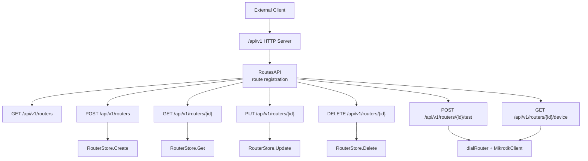
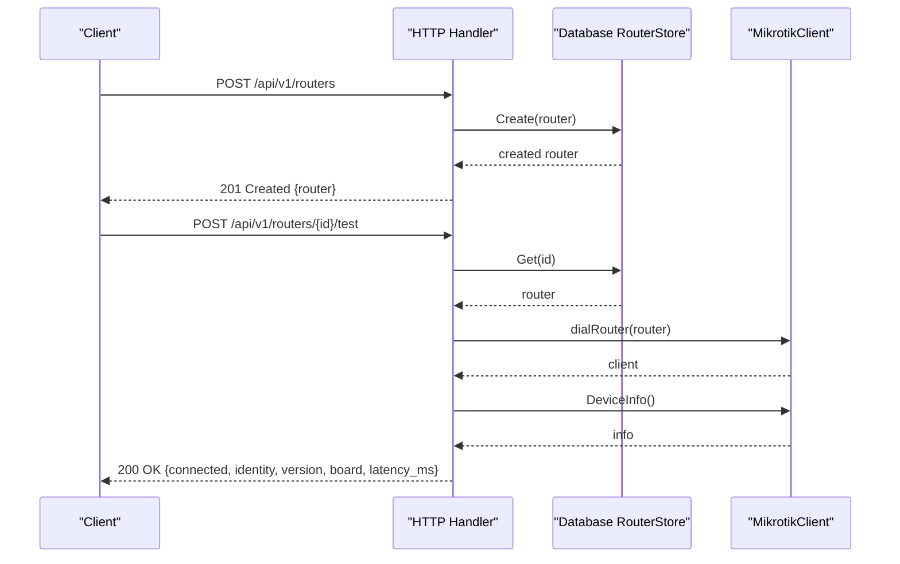
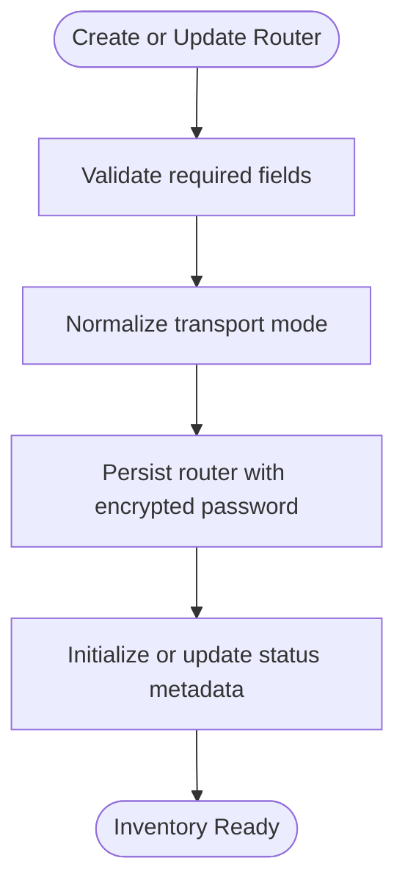
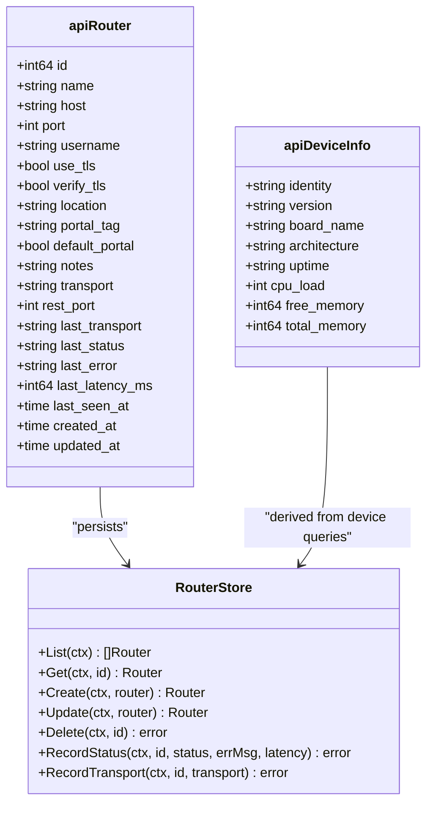
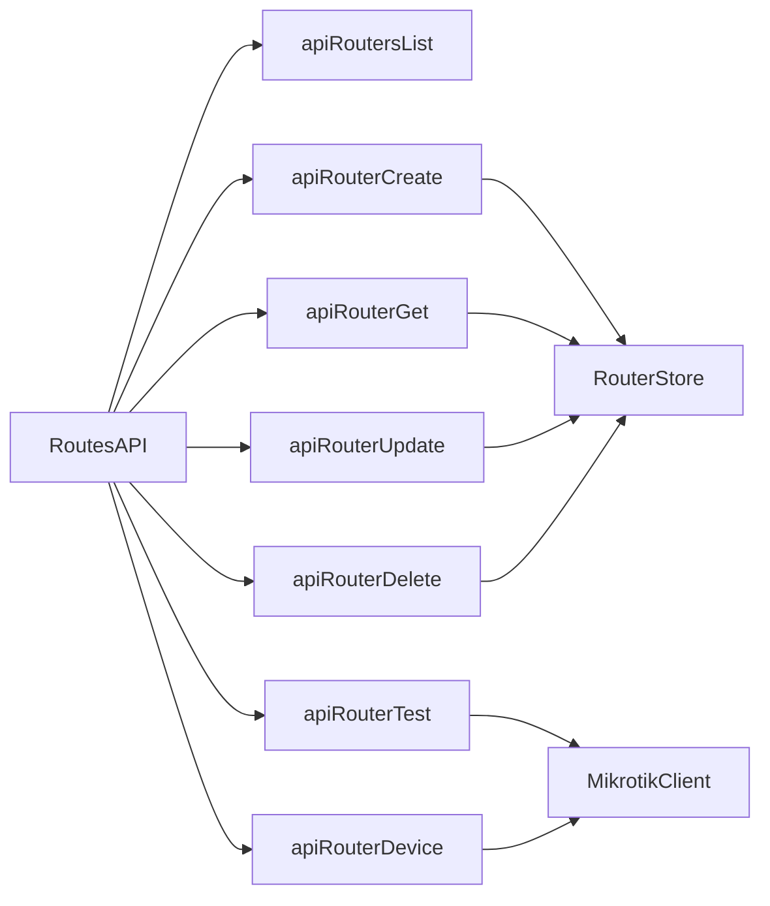

# Router Management API

<cite>
**Referenced Files in This Document**
- [api.go](file://handlers/api.go)
- [routers.go](file://handlers/routers.go)
- [routers.go](file://database/routers.go)
</cite>

## Table of Contents
1. [Introduction](#introduction)
2. [Project Structure](#project-structure)
3. [Core Components](#core-components)
4. [Architecture Overview](#architecture-overview)
5. [Detailed Component Analysis](#detailed-component-analysis)
6. [Dependency Analysis](#dependency-analysis)
7. [Performance Considerations](#performance-considerations)
8. [Troubleshooting Guide](#troubleshooting-guide)
9. [Conclusion](#conclusion)

## Introduction
This document describes the router management REST API under `/api/v1/routers`. It covers listing routers, creating and updating router inventory entries, retrieving a single router, deleting a router, testing connectivity, and reading device information. It also documents the `apiRouter` JSON schema, supported transport modes (ROS binary API and RouterOS v7 REST), TLS configuration fields, validation rules, authentication expectations, error responses, and how the controller integrates with MikroTik RouterOS devices.

The API is intended for machine clients such as integrations or monitoring systems. It speaks JSON and reuses the same MikroTik client used by the web UI. The API documentation does not prescribe an external authentication scheme; callers should expose the endpoint behind a reverse proxy or network boundary that enforces access control when needed.

## Project Structure
The router endpoints are registered in the API route table and implemented in the handler layer. Inventory persistence lives in the database package.



**Diagram sources**
- [api.go:108-136](file://handlers/api.go#L108-L136)
- [api.go:314-544](file://handlers/api.go#L314-L544)
- [routers.go:190-287](file://database/routers.go#L190-L287)

**Section sources**
- [api.go:108-136](file://handlers/api.go#L108-L136)
- [routers.go:190-287](file://database/routers.go#L190-L287)

## Core Components
- `apiRouter`: JSON representation of a router inventory entry returned by list, get, create, and update operations.
- `apiDeviceInfo`: JSON representation of live device identity and resource usage returned by the device endpoint.
- Transport modes: `auto`, `api`, `api-ssl`, `rest`, `rest-ssl`.
- Connection parameters: host, port, username, password, TLS flags, optional REST www port, location, portal tag, default portal flag, notes, and status metadata.

Key implementation references:
- `apiRouter` struct and conversion helper: [api.go:152-187](file://handlers/api.go#L152-L187)
- `apiDeviceInfo` struct and conversion helper: [api.go:212-229](file://handlers/api.go#L212-L229)
- Transport constants and normalization: [routers.go:19-52](file://database/routers.go#L19-L52)
- Database `Router` model and persistence helpers: [routers.go:57-98](file://database/routers.go#L57-L98), [routers.go:190-287](file://database/routers.go#L190-L287)

**Section sources**
- [api.go:152-187](file://handlers/api.go#L152-L187)
- [api.go:212-229](file://handlers/api.go#L212-L229)
- [routers.go:19-52](file://database/routers.go#L19-L52)
- [routers.go:57-98](file://database/routers.go#L57-L98)
- [routers.go:190-287](file://database/routers.go#L190-L287)

## Architecture Overview
The router management API follows a layered pattern:
- Route registration maps HTTP methods to handler functions.
- Handlers validate input, load router records from the database, and optionally open a connection to the MikroTik device.
- The database layer persists router inventory and status metadata.
- The MikroTik client performs live queries against RouterOS using either the legacy binary API or the RouterOS v7 REST API.



**Diagram sources**
- [api.go:343-407](file://handlers/api.go#L343-L407)
- [api.go:504-528](file://handlers/api.go#L504-L528)
- [routers.go:190-226](file://database/routers.go#L190-L226)

## Detailed Component Analysis

### Authentication and Security
- The API comment states it is intended for machine clients and can be exposed behind a reverse proxy with authentication on untrusted networks.
- There is no built-in bearer token or session check inside the API handlers themselves.
- Callers should enforce authentication at the network edge (reverse proxy, gateway, or firewall).

Security guidance:
- Restrict `/api/v1` to trusted networks or require strong authentication upstream.
- Use HTTPS termination at the reverse proxy.
- Avoid logging sensitive fields such as passwords.

**Section sources**
- [api.go:1-9](file://handlers/api.go#L1-L9)

### Common Request and Response Conventions
- Content-Type: `application/json` for all JSON endpoints.
- Success responses use standard HTTP status codes:
  - `200 OK` for successful reads and updates.
  - `201 Created` for successful creation.
  - `204 No Content` for successful deletion.
- Error responses return a JSON object with `code` and `message`.

Common error codes:
- `bad_request`: invalid JSON body or missing required fields.
- `validation`: field-level validation failure.
- `invalid_id`: path parameter is not a positive integer.
- `not_found`: router does not exist.
- `conflict`: duplicate router name.
- `db_error`: database operation failed.
- `router_unreachable`: cannot connect to the device.
- `device_error`: device query failed after connection.
- `query_failed`: device query failed.

**Section sources**
- [api.go:24-50](file://handlers/api.go#L24-L50)
- [api.go:314-544](file://handlers/api.go#L314-L544)

### Data Model: `apiRouter`
| Field | Type | Required | Description |
|---|---|---:|---|
| `id` | integer | Read-only | Database-assigned router identifier. |
| `name` | string | Yes for create/update | Human-readable router name. |
| `host` | string | Yes for create/update | Hostname or IP address reachable on the API port. |
| `port` | integer | Optional | Legacy ROS API port; defaults to `8728` when omitted. |
| `username` | string | Yes for create/update | RouterOS API user. |
| `password` | string | Optional | API password. Omitted on update to keep the stored secret. |
| `use_tls` | boolean | Optional | Enable TLS for ROS API transports (`api-ssl`). |
| `verify_tls` | boolean | Optional | Enforce certificate verification for TLS transports. |
| `location` | string | Optional | Physical or logical location label. |
| `portal_tag` | string | Optional | Hotspot server-name used to attribute captive portal requests. |
| `default_portal` | boolean | Optional | Marks fallback router for captive portal routing. |
| `notes` | string | Optional | Free-form notes. |
| `transport` | string | Optional | Protocol mode: `auto`, `api`, `api-ssl`, `rest`, `rest-ssl`. |
| `rest_port` | integer | Conditional | WWW/www-ssl port for REST transports; required for plain HTTP REST. |
| `last_transport` | string | Read-only | Transport that last connected successfully. |
| `last_status` | string | Read-only | Last probe status: `unknown`, `online`, `offline`. |
| `last_error` | string | Read-only | Last error message. |
| `last_latency_ms` | integer | Read-only | Latency in milliseconds from last probe. |
| `last_seen_at` | timestamp | Read-only | Time of last successful observation. |
| `created_at` | timestamp | Read-only | Creation time. |
| `updated_at` | timestamp | Read-only | Last update time. |

Notes:
- The response never includes the plaintext password.
- `transport` is normalized before storage and response.
- `rest_port` is only meaningful for REST transports.

**Section sources**
- [api.go:152-187](file://handlers/api.go#L152-L187)
- [routers.go:57-98](file://database/routers.go#L57-L98)
- [routers.go:19-52](file://database/routers.go#L19-L52)

### Transport Modes and Connection Parameters
Supported transport modes:
- `auto`: probes candidates and remembers the successful transport.
- `api`: legacy RouterOS binary API over TCP.
- `api-ssl`: legacy RouterOS binary API over TLS.
- `rest`: RouterOS v7 REST API over HTTP.
- `rest-ssl`: RouterOS v7 REST API over HTTPS.

Connection parameters:
- `host`: Router hostname or IP.
- `port`: ROS API port; defaults to `8728` if omitted.
- `username`: API user account.
- `password`: API password.
- `use_tls`: Enables TLS for ROS API transports.
- `verify_tls`: Requires certificate verification for TLS transports.
- `transport`: Selects protocol family.
- `rest_port`: WWW/www-ssl port for REST; required for plain HTTP REST.

Validation rules:
- For `transport=rest` over HTTP, `rest_port` must be explicitly provided.
- Unknown or empty transport values normalize to `auto`.

**Section sources**
- [routers.go:19-52](file://database/routers.go#L19-L52)
- [api.go:365-379](file://handlers/api.go#L365-L379)
- [api.go:443-447](file://handlers/api.go#L443-L447)

### Endpoint: GET /api/v1/routers
Lists all registered routers.

- Method: `GET`
- Path: `/api/v1/routers`
- Authentication: Upstream authentication recommended.
- Request body: None.
- Success response: `200 OK`
- Response schema:
  - `routers`: array of `apiRouter` objects.
  - `total`: number of routers returned.
- Error responses:
  - `500 Internal Server Error` with code `db_error` when listing fails.

Example curl command:
```bash
curl --request GET \
  --url "https://controller.example.com/api/v1/routers" \
  --header "Authorization: Bearer YOUR_TOKEN"
```

**Section sources**
- [api.go:314-331](file://handlers/api.go#L314-L331)

### Endpoint: POST /api/v1/routers
Creates a new router inventory entry.

- Method: `POST`
- Path: `/api/v1/routers`
- Authentication: Upstream authentication recommended.
- Request body: JSON object matching `apiRouter` input fields.
- Validation rules:
  - `name`, `host`, and `username` are required.
  - If `transport=rest` over HTTP, `rest_port` must be greater than zero.
- Success response: `201 Created` with the created `apiRouter`.
- Error responses:
  - `400 Bad Request` with code `bad_request` for invalid JSON.
  - `400 Bad Request` with code `validation` for missing or invalid fields.
  - `409 Conflict` with code `conflict` when a router with the same name already exists.
  - `500 Internal Server Error` with code `db_error` for database failures.

Example curl command for ROS API with TLS:
```bash
curl --request POST \
  --url "https://controller.example.com/api/v1/routers" \
  --header "Content-Type: application/json" \
  --header "Authorization: Bearer YOUR_TOKEN" \
  --data '{
    "name": "HQ-R1",
    "host": "10.0.1.1",
    "port": 8729,
    "username": "aircoins",
    "password": "secret",
    "use_tls": true,
    "verify_tls": false,
    "transport": "api-ssl",
    "location": "Headquarters",
    "portal_tag": "hq-hotspot",
    "default_portal": false,
    "notes": "Primary hotspot router"
  }'
```

Example curl command for RouterOS v7 REST over HTTPS:
```bash
curl --request POST \
  --url "https://controller.example.com/api/v1/routers" \
  --header "Content-Type: application/json" \
  --header "Authorization: Bearer YOUR_TOKEN" \
  --data '{
    "name": "Branch-R2",
    "host": "10.0.2.1",
    "username": "aircoins",
    "password": "secret",
    "transport": "rest-ssl",
    "rest_port": 443,
    "location": "Branch Office",
    "portal_tag": "branch-hotspot"
  }'
```

**Section sources**
- [api.go:343-407](file://handlers/api.go#L343-L407)
- [routers.go:190-226](file://database/routers.go#L190-L226)

### Endpoint: GET /api/v1/routers/{id}
Retrieves one router by ID without requiring the device to be reachable.

- Method: `GET`
- Path: `/api/v1/routers/{id}`
- Path parameter:
  - `id`: positive integer.
- Authentication: Upstream authentication recommended.
- Success response: `200 OK` with a single `apiRouter` object.
- Error responses:
  - `400 Bad Request` with code `invalid_id` when `id` is invalid.
  - `404 Not Found` with code `not_found` when the router does not exist.
  - `500 Internal Server Error` with code `db_error` for database failures.

Example curl command:
```bash
curl --request GET \
  --url "https://controller.example.com/api/v1/routers/1" \
  --header "Authorization: Bearer YOUR_TOKEN"
```

**Section sources**
- [api.go:333-341](file://handlers/api.go#L333-L341)
- [api.go:52-74](file://handlers/api.go#L52-L74)

### Endpoint: PUT /api/v1/routers/{id}
Updates an existing router. An omitted `password` keeps the stored secret.

- Method: `PUT`
- Path: `/api/v1/routers/{id}`
- Path parameter:
  - `id`: positive integer.
- Authentication: Upstream authentication recommended.
- Request body: JSON object matching `apiRouter` input fields.
- Validation rules:
  - `name`, `host`, and `username` are required.
  - If `transport=rest` over HTTP, `rest_port` must be greater than zero.
- Success response: `200 OK` with the updated `apiRouter`.
- Error responses:
  - `400 Bad Request` with code `bad_request` for invalid JSON.
  - `400 Bad Request` with code `validation` for missing or invalid fields.
  - `404 Not Found` with code `not_found` when the router does not exist.
  - `409 Conflict` with code `conflict` when a router with the same name already exists.
  - `500 Internal Server Error` with code `db_error` for database failures.

Example curl command:
```bash
curl --request PUT \
  --url "https://controller.example.com/api/v1/routers/1" \
  --header "Content-Type: application/json" \
  --header "Authorization: Bearer YOUR_TOKEN" \
  --data '{
    "name": "HQ-R1",
    "host": "10.0.1.1",
    "port": 8729,
    "username": "aircoins",
    "password": "new-secret",
    "use_tls": true,
    "verify_tls": true,
    "transport": "api-ssl",
    "location": "Headquarters",
    "portal_tag": "hq-hotspot",
    "default_portal": true,
    "notes": "Updated configuration"
  }'
```

**Section sources**
- [api.go:409-480](file://handlers/api.go#L409-L480)
- [routers.go:228-257](file://database/routers.go#L228-L257)

### Endpoint: DELETE /api/v1/routers/{id}
Deletes a router from the inventory.

- Method: `DELETE`
- Path: `/api/v1/routers/{id}`
- Path parameter:
  - `id`: positive integer.
- Authentication: Upstream authentication recommended.
- Success response: `204 No Content`.
- Error responses:
  - `400 Bad Request` with code `invalid_id` when `id` is invalid.
  - `404 Not Found` with code `not_found` when the router does not exist.
  - `500 Internal Server Error` with code `db_error` for database failures.

Example curl command:
```bash
curl --request DELETE \
  --url "https://controller.example.com/api/v1/routers/1" \
  --header "Authorization: Bearer YOUR_TOKEN"
```

**Section sources**
- [api.go:482-502](file://handlers/api.go#L482-L502)
- [routers.go:276-287](file://database/routers.go#L276-L287)

### Endpoint: POST /api/v1/routers/{id}/test
Tests connectivity and returns device identity information.

- Method: `POST`
- Path: `/api/v1/routers/{id}/test`
- Path parameter:
  - `id`: positive integer.
- Authentication: Upstream authentication recommended.
- Request body: None.
- Success response: `200 OK`
- Response schema:
  - `connected`: boolean, always `true` when successful.
  - `identity`: device identity string, falling back to configured host when unavailable.
  - `version`: RouterOS version string.
  - `board`: board name string.
  - `latency_ms`: latency from last recorded probe.
- Error responses:
  - `400 Bad Request` with code `invalid_id`.
  - `404 Not Found` with code `not_found`.
  - `502 Bad Gateway` with code `router_unreachable` when the device cannot be contacted.
  - `502 Bad Gateway` with code `device_error` when device identity retrieval fails.

Example curl command:
```bash
curl --request POST \
  --url "https://controller.example.com/api/v1/routers/1/test" \
  --header "Authorization: Bearer YOUR_TOKEN"
```

**Section sources**
- [api.go:504-528](file://handlers/api.go#L504-L528)
- [api.go:76-104](file://handlers/api.go#L76-L104)

### Endpoint: GET /api/v1/routers/{id}/device
Retrieves live device information including identity and resource usage.

- Method: `GET`
- Path: `/api/v1/routers/{id}/device`
- Path parameter:
  - `id`: positive integer.
- Authentication: Upstream authentication recommended.
- Request body: None.
- Success response: `200 OK`
- Response schema:
  - `identity`: device identity string.
  - `version`: RouterOS version string.
  - `board_name`: board name string.
  - `architecture`: device architecture string.
  - `uptime`: uptime string.
  - `cpu_load`: CPU load value.
  - `free_memory`: free memory value.
  - `total_memory`: total memory value.
- Error responses:
  - `400 Bad Request` with code `invalid_id`.
  - `404 Not Found` with code `not_found`.
  - `502 Bad Gateway` with code `router_unreachable`.
  - `502 Bad Gateway` with code `device_error`.

Example curl command:
```bash
curl --request GET \
  --url "https://controller.example.com/api/v1/routers/1/device" \
  --header "Authorization: Bearer YOUR_TOKEN"
```

**Section sources**
- [api.go:530-544](file://handlers/api.go#L530-L544)
- [api.go:212-229](file://handlers/api.go#L212-L229)

### Router Inventory Management Patterns
- Inventory persistence uses a dedicated store with CRUD operations.
- Passwords are encrypted before storage and decrypted when needed for connections.
- Transport selection supports automatic probing and remembers the last successful transport.
- Status metadata tracks last probe result, error, latency, and last seen time.
- Default portal handling ensures only one router acts as the captive portal fallback.



**Diagram sources**
- [routers.go:190-257](file://database/routers.go#L190-L257)
- [routers.go:297-317](file://database/routers.go#L297-L317)

**Section sources**
- [routers.go:190-257](file://database/routers.go#L190-L257)
- [routers.go:297-317](file://database/routers.go#L297-L317)

### Integration with MikroTik RouterOS API
- The controller connects to MikroTik devices using either the legacy binary API or RouterOS v7 REST API.
- Connectivity tests and device information calls reuse the same client used by the web UI.
- Errors from device queries are classified and surfaced through standardized API error responses.
- Live data such as device identity, active clients, bindings, interfaces, and traffic metrics are fetched through the MikroTik client.



**Diagram sources**
- [api.go:152-187](file://handlers/api.go#L152-L187)
- [api.go:212-229](file://handlers/api.go#L212-L229)
- [routers.go:117-317](file://database/routers.go#L117-L317)

**Section sources**
- [api.go:1-9](file://handlers/api.go#L1-L9)
- [api.go:504-544](file://handlers/api.go#L504-L544)
- [routers.go:19-52](file://database/routers.go#L19-L52)

## Dependency Analysis
The router management API depends on:
- Route registration in `RoutesAPI`.
- Handler functions for each endpoint.
- Database router store for persistence.
- MikroTik client for live device communication.



**Diagram sources**
- [api.go:108-136](file://handlers/api.go#L108-L136)
- [api.go:314-544](file://handlers/api.go#L314-L544)
- [routers.go:117-317](file://database/routers.go#L117-L317)

**Section sources**
- [api.go:108-136](file://handlers/api.go#L108-L136)
- [api.go:314-544](file://handlers/api.go#L314-L544)
- [routers.go:117-317](file://database/routers.go#L117-L317)

## Performance Considerations
- Listing routers is a simple database read and scales with the number of inventory entries.
- Creating, updating, and deleting routers involve database writes and may trigger unique constraint checks.
- Connectivity test and device endpoints open a connection to the MikroTik device per request; avoid polling them too frequently.
- Transport auto mode may probe multiple protocols initially but remembers the last successful transport to reduce future probing.
- Status metadata helps monitor device health without repeated live queries.

[No sources needed since this section provides general guidance]

## Troubleshooting Guide
Common issues and resolutions:
- Invalid JSON body: ensure `Content-Type: application/json` and valid JSON structure.
- Missing required fields: include `name`, `host`, and `username`; provide `rest_port` for REST over HTTP.
- Duplicate router name: choose a unique name or update the existing router.
- Router not found: verify the `{id}` path parameter matches an existing inventory entry.
- Router unreachable: check host, port, credentials, TLS settings, and network reachability.
- Device query failed: verify permissions and available commands on the RouterOS device.

Operational tips:
- Use `POST /api/v1/routers/{id}/test` to validate connectivity after configuration changes.
- Use `GET /api/v1/routers/{id}/device` to inspect device identity and resource usage.
- Monitor `last_status`, `last_error`, `last_latency_ms`, and `last_seen_at` to assess router health.

**Section sources**
- [api.go:343-544](file://handlers/api.go#L343-L544)
- [routers.go:297-317](file://database/routers.go#L297-L317)

## Conclusion
The router management API provides a complete interface for managing MikroTik router inventory and performing basic connectivity and device introspection. It supports both legacy ROS API and RouterOS v7 REST transports, with clear validation rules, standardized error responses, and safe handling of secrets. Callers should protect the API with upstream authentication and rate limiting appropriate to their deployment.

[No sources needed since this section summarizes without analyzing specific files]