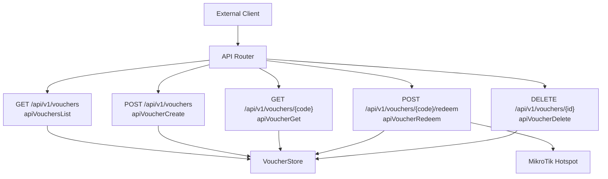
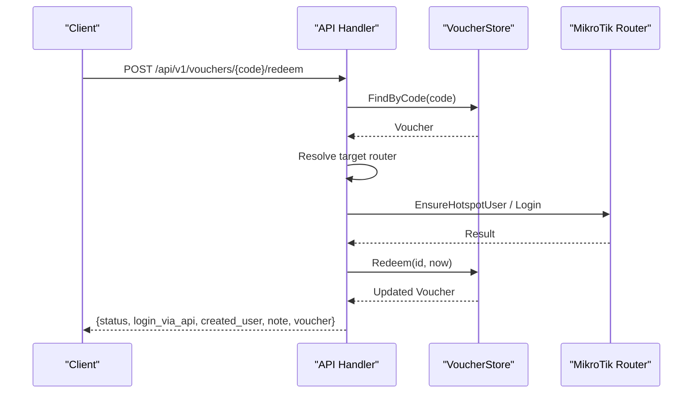
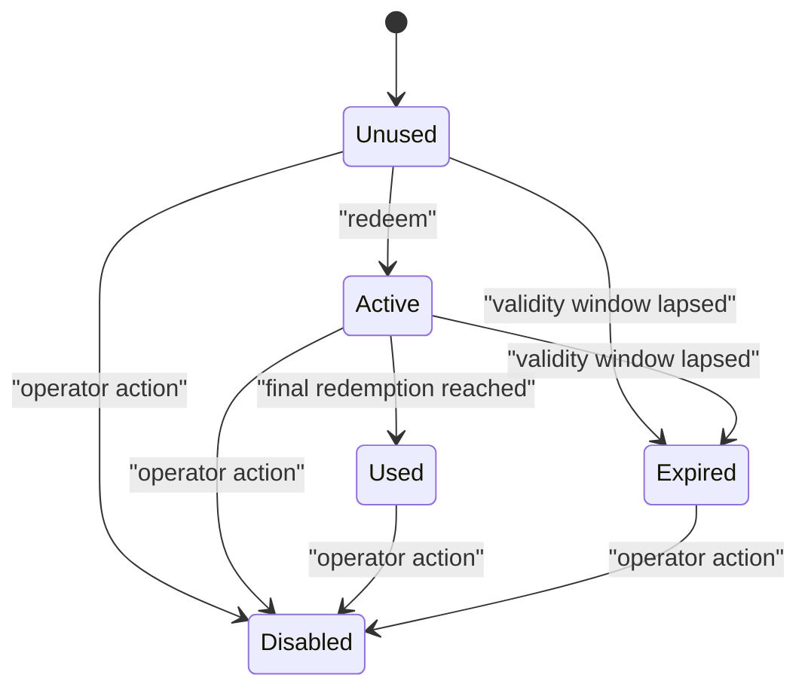
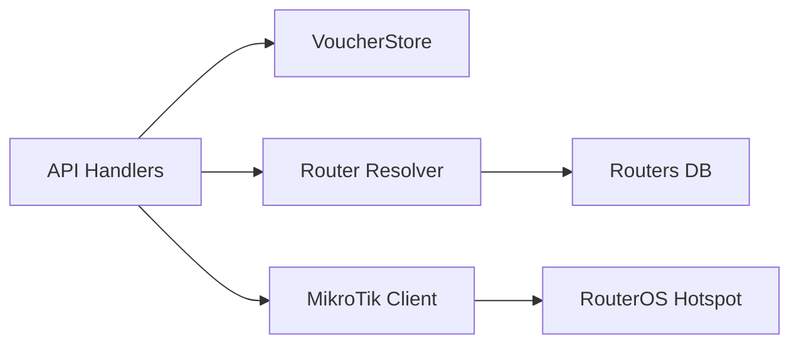

# Voucher System API

<cite>
**Referenced Files in This Document**   
- [handlers/api.go](file://handlers/api.go)
- [handlers/vouchers.go](file://handlers/vouchers.go)
- [database/vouchers.go](file://database/vouchers.go)
- [database/voucher_code.go](file://database/voucher_code.go)
</cite>

## Table of Contents
1. [Introduction](#introduction)
2. [Project Structure](#project-structure)
3. [Core Components](#core-components)
4. [Architecture Overview](#architecture-overview)
5. [Detailed Component Analysis](#detailed-component-analysis)
6. [Dependency Analysis](#dependency-analysis)
7. [Performance Considerations](#performance-considerations)
8. [Troubleshooting Guide](#troubleshooting-guide)
9. [Conclusion](#conclusion)

## Introduction
This document describes the voucher management API under `/api/v1/vouchers`. It covers listing vouchers, creating vouchers in batches, retrieving a voucher by code, redeeming a voucher through the captive portal or external systems, and deleting a voucher by database ID. It also documents the `apiVoucher` response schema, voucher creation parameters (duration, data limits, device limits, pricing), redemption workflow, status transitions, integration with MikroTik Hotspot authentication, lifecycle management, rate limiting considerations, and security best practices.

The implementation is split between:
- HTTP routing and JSON request/response handling in the handler layer.
- Voucher persistence, validation, and state logic in the database layer.
- Optional provisioning of hotspot users on MikroTik routers.

## Project Structure
The voucher endpoints are registered as part of the application’s API router and implemented by dedicated handlers. The core data model lives in the database package, while helper logic for code generation and batch labeling is also provided there.



**Diagram sources**
- [handlers/api.go:129-133](file://handlers/api.go#L129-L133)
- [handlers/api.go:930-1219](file://handlers/api.go#L930-L1219)
- [database/vouchers.go:197-576](file://database/vouchers.go#L197-L576)

**Section sources**
- [handlers/api.go:129-133](file://handlers/api.go#L129-L133)

## Core Components
- `apiVoucher`: JSON representation returned by all voucher endpoints.
- `VoucherStore`: Database operations for listing, creating, redeeming, updating status, and deleting vouchers.
- `VoucherStatus`: Lifecycle states including unused, active, used, expired, and disabled.
- `VoucherCodeOptions` and helpers: Generate cryptographically random, human-friendly voucher codes and normalize user input.

Key responsibilities:
- API handlers parse requests, validate inputs, call the database store, and return structured JSON.
- Redemption resolves the target MikroTik router, provisions or uses a hotspot user, updates ledger state, and returns usage information.
- Listing supports filtering by query, router, status, batch, and pagination.

**Section sources**
- [handlers/api.go:272-308](file://handlers/api.go#L272-L308)
- [database/vouchers.go:12-102](file://database/vouchers.go#L12-L102)
- [database/voucher_code.go:18-76](file://database/voucher_code.go#L18-L76)

## Architecture Overview
The voucher system follows a layered architecture:
- Presentation/API layer: HTTP routes and JSON serialization.
- Business layer: Voucher validation, redemption logic, and router resolution.
- Persistence layer: SQL-backed voucher ledger with transactional redemption.
- External integration: MikroTik Hotspot user provisioning and session enforcement.



**Diagram sources**
- [handlers/api.go:1174-1219](file://handlers/api.go#L1174-L1219)
- [handlers/api.go:1126-1170](file://handlers/api.go#L1126-L1170)
- [database/vouchers.go:439-495](file://database/vouchers.go#L439-L495)

## Detailed Component Analysis

### GET /api/v1/vouchers — List Vouchers
Lists vouchers with optional filtering and pagination.

- Method: `GET`
- Path: `/api/v1/vouchers`
- Query parameters:
  - `q`: Search across normalized code, batch, and note.
  - `router_id`: Filter by bound router ID.
  - `status`: Filter by voucher lifecycle state.
  - `batch`: Filter by batch label.
  - `limit`: Page size cap; defaults to internal limit.
  - `offset`: Pagination offset.

Response body:
- `vouchers`: Array of `apiVoucher` objects.
- `total`: Total matching count.
- `limit`: Applied limit.
- `offset`: Applied offset.

Error responses:
- `500` with error code `db_error` when listing fails.

Notes:
- Filtering uses the same normalization rules as lookup keys.
- Status values must be valid lifecycle states.

**Section sources**
- [handlers/api.go:930-977](file://handlers/api.go#L930-L977)
- [database/vouchers.go:208-354](file://database/vouchers.go#L208-L354)

### POST /api/v1/vouchers — Create Vouchers
Creates a batch of vouchers. Each voucher receives a unique code unless a collision occurs, in which case the endpoint returns a conflict.

- Method: `POST`
- Path: `/api/v1/vouchers`
- Request body fields:
  - `router_id`: Optional integer; if provided, must exist.
  - `count`: Number of vouchers to create; default 10; maximum equals batch cap.
  - `batch`: Optional batch label; auto-generated if omitted.
  - `profile`: Hotspot profile name applied to generated vouchers.
  - `duration_minutes`: Session time allowance in minutes.
  - `data_limit_mb`: Data allowance in megabytes.
  - `device_limit`: Maximum simultaneous devices per voucher; minimum 1.
  - `price_cents`: Face value in cents.
  - `max_uses`: Maximum redemptions per voucher; minimum 1.
  - `note`: Optional operator note.
  - `prefix`: Code prefix; defaults to standard options.

Response body:
- `count`: Number inserted.
- `batch`: Batch label used.
- `vouchers`: Array of created `apiVoucher` objects.

Error responses:
- `400` with `bad_request` for invalid JSON.
- `400` with `validation` for invalid router, excessive count, or invalid numeric constraints.
- `409` with `conflict` when generated code collides with an existing code.
- `500` with `db_error` for database failures.

Batch generation details:
- Codes are generated using cryptographic randomness and a safe alphabet.
- Default code shape includes a prefix and dash-separated groups.
- Batch labels can be timestamped automatically.

**Section sources**
- [handlers/api.go:979-1085](file://handlers/api.go#L979-L1085)
- [database/voucher_code.go:18-76](file://database/voucher_code.go#L18-L76)
- [database/voucher_code.go:106-109](file://database/voucher_code.go#L106-L109)

### GET /api/v1/vouchers/{code} — Get Voucher Details
Retrieves a single voucher by its code. Lookup normalizes input by uppercasing and removing dashes/spaces.

- Method: `GET`
- Path: `/api/v1/vouchers/{code}`
- Path parameter:
  - `code`: Human-friendly voucher code.

Response body:
- Single `apiVoucher` object.

Error responses:
- `404` with `not_found` when no voucher matches the code.
- `500` with `db_error` for database failures.

**Section sources**
- [handlers/api.go:1087-1102](file://handlers/api.go#L1087-L1102)
- [database/vouchers.go:289-303](file://database/vouchers.go#L289-L303)

### POST /api/v1/vouchers/{code}/redeem — Redeem Voucher
Redeems one use of a voucher, optionally provisioning it on a MikroTik router and logging the client in.

- Method: `POST`
- Path: `/api/v1/vouchers/{code}/redeem`
- Path parameter:
  - `code`: Voucher code to redeem.
- Request body fields:
  - `mac`: Client MAC address.
  - `ip`: Client IP address.
  - `server_name`: Optional hotspot server tag to select the target router.

Workflow:
1. Load voucher by code.
2. Resolve target router:
   - Prefer router matching `server_name`.
   - Otherwise use voucher-bound router.
   - Otherwise fall back to default router.
3. Provision hotspot user if needed.
4. Log client into hotspot.
5. Atomically consume one redemption in the ledger.
6. Return updated voucher and redemption metadata.

Response body:
- `status`: Always `"redeemed"` on success.
- `login_via_api`: Whether login was performed via API.
- `created_user`: Whether a new hotspot user was created.
- `note`: Operational note from redemption process.
- `voucher`: Updated `apiVoucher` object.

Error responses:
- `404` with `not_found` when voucher code does not exist.
- `422` with `no_router` when voucher is not assigned to a hotspot and no default router is available.
- `409` with `not_redeemable` when voucher cannot be redeemed due to lifecycle or usage limits.
- `502` with `redeem_failed` for router or hotspot errors.
- `500` with `db_error` for database failures.

Router resolution behavior:
- If `server_name` is provided, the first router with that portal tag is selected.
- If voucher has a bound router, that router is used.
- If neither exists, the default router is required.

**Section sources**
- [handlers/api.go:1174-1219](file://handlers/api.go#L1174-L1219)
- [handlers/api.go:1126-1170](file://handlers/api.go#L1126-L1170)
- [database/vouchers.go:439-495](file://database/vouchers.go#L439-L495)

### DELETE /api/v1/vouchers/{id} — Delete Voucher
Deletes a voucher from the ledger by its database ID.

- Method: `DELETE`
- Path: `/api/v1/vouchers/{id}`
- Path parameter:
  - `id`: Positive integer database ID.

Response:
- `204 No Content` on successful deletion.

Error responses:
- `400` with `invalid_id` when ID is missing or non-positive.
- `404` with `not_found` when voucher does not exist.
- `500` with `db_error` for database failures.

Note:
- This endpoint removes the ledger record only. Administrative UI logic may additionally revoke the hotspot user on the router, but the API delete itself does not perform router-side revocation.

**Section sources**
- [handlers/api.go:1104-1124](file://handlers/api.go#L1104-L1124)
- [database/vouchers.go:529-539](file://database/vouchers.go#L529-L539)

## apiVoucher Schema
The `apiVoucher` struct defines the JSON shape returned by voucher endpoints.

Fields:
- `id`: Integer database identifier.
- `code`: Human-friendly voucher code.
- `batch`: Batch label grouping generated vouchers.
- `router_id`: Optional bound router ID.
- `router_name`: Resolved router name when joined.
- `profile`: Hotspot profile name.
- `duration_minutes`: Time allowance in minutes.
- `data_limit_mb`: Data allowance in megabytes.
- `device_limit`: Maximum simultaneous devices.
- `price_cents`: Face value in cents.
- `status`: Lifecycle state string.
- `status_label`: Human-readable status label.
- `uses`: Number of redemptions consumed.
- `max_uses`: Maximum allowed redemptions.
- `remaining_uses`: Computed remaining redemptions.
- `note`: Operator note.
- `created_at`: Creation timestamp.
- `pushed_at`: Timestamp when pushed to router (nullable).
- `activated_at`: First activation timestamp (nullable).
- `expires_at`: Expiration timestamp (nullable).
- `last_used_at`: Last usage timestamp (nullable).

Mapping:
- The API layer converts the database `Voucher` into `apiVoucher`, including computed fields like `RemainingUses` and `StatusLabel`.

**Section sources**
- [handlers/api.go:272-308](file://handlers/api.go#L272-L308)
- [database/vouchers.go:78-180](file://database/vouchers.go#L78-L180)

## Voucher Lifecycle and Status Transitions
Lifecycle states:
- `unused`: Never redeemed.
- `active`: Redeemed and still usable.
- `used`: All allowed redemptions consumed.
- `expired`: Validity window lapsed without redemption.
- `disabled`: Manually blocked by an operator.

Redemption transition:
- On successful redemption, the ledger increments `uses`, sets `activated_at` if absent, computes `expires_at` based on duration when applicable, and updates `status` to `active` or `used` depending on `max_uses`.

Expiration handling:
- A background sync marks vouchers whose validity window has ended as `expired`.

Operator actions:
- Operators can force status changes such as disabling, re-enabling, or marking as used.



**Diagram sources**
- [database/vouchers.go:12-26](file://database/vouchers.go#L12-L26)
- [database/vouchers.go:141-160](file://database/vouchers.go#L141-L160)
- [database/vouchers.go:439-495](file://database/vouchers.go#L439-L495)
- [database/vouchers.go:561-576](file://database/vouchers.go#L561-L576)

**Section sources**
- [database/vouchers.go:12-26](file://database/vouchers.go#L12-L26)
- [database/vouchers.go:141-160](file://database/vouchers.go#L141-L160)
- [database/vouchers.go:439-495](file://database/vouchers.go#L439-L495)
- [database/vouchers.go:561-576](file://database/vouchers.go#L561-L576)

## Integration with MikroTik Hotspot Authentication
Voucher redemption integrates with MikroTik Hotspot in two ways:
- Provisioning: Ensures a hotspot user exists with the voucher’s profile, comment, uptime/data/device limits.
- Authentication: Logs the client in using the hotspot user and enforces limits on the device.

Router selection during redemption:
- Preferred router by `server_name` tag.
- Fallback to voucher-bound router.
- Final fallback to default router.

Provisioning and login flow:
- The redemption handler resolves the router, ensures the hotspot user, logs the client, and then atomically consumes the voucher redemption.

Operational notes:
- If provisioning or login fails, the voucher redemption is not consumed, preserving idempotency at the ledger level.
- The administrative UI provides additional push and validation helpers for operators.

**Section sources**
- [handlers/api.go:1126-1170](file://handlers/api.go#L1126-L1170)
- [handlers/api.go:1174-1219](file://handlers/api.go#L1174-L1219)
- [handlers/vouchers.go:452-516](file://handlers/vouchers.go#L452-L516)

## Voucher Creation Parameters
When creating vouchers via the API, the following parameters control allowances and identity:

- `duration_minutes`: Session time allowance. Zero means unlimited time.
- `data_limit_mb`: Data allowance in MB. Zero means unlimited data.
- `device_limit`: Maximum simultaneous devices per voucher; minimum enforced as 1.
- `price_cents`: Face value in cents; stored as integer cents.
- `max_uses`: Maximum redemptions per voucher; minimum enforced as 1.
- `profile`: Hotspot profile applied to the voucher.
- `batch`: Grouping label for generated vouchers.
- `prefix`: Code prefix for generated codes.
- `note`: Optional operator note.

Validation rules:
- `count` defaults to 10 and is capped by a batch limit.
- `router_id` must exist if provided.
- Negative or invalid numeric values are rejected.

**Section sources**
- [handlers/api.go:979-1085](file://handlers/api.go#L979-L1085)
- [handlers/vouchers.go:145-174](file://handlers/vouchers.go#L145-L174)

## Examples

### Batch Voucher Generation
Use the create endpoint to generate multiple vouchers in one request.

Example request:
```json
{
  "count": 25,
  "batch": "BATCH-20260921-1200",
  "profile": "default",
  "duration_minutes": 60,
  "data_limit_mb": 1000,
  "device_limit": 1,
  "price_cents": 5000,
  "max_uses": 1,
  "note": "Promo weekend",
  "prefix": "AIR"
}
```

Expected response:
```json
{
  "count": 25,
  "batch": "BATCH-20260921-1200",
  "vouchers": [
    {
      "id": 1,
      "code": "AIR-XXXX-YYYY",
      "batch": "BATCH-20260921-1200",
      "router_id": null,
      "router_name": "",
      "profile": "default",
      "duration_minutes": 60,
      "data_limit_mb": 1000,
      "device_limit": 1,
      "price_cents": 5000,
      "status": "unused",
      "status_label": "Unused",
      "uses": 0,
      "max_uses": 1,
      "remaining_uses": 1,
      "note": "Promo weekend",
      "created_at": "2026-09-21T12:00:00Z",
      "pushed_at": null,
      "activated_at": null,
      "expires_at": null,
      "last_used_at": null
    }
  ]
}
```

**Section sources**
- [handlers/api.go:979-1085](file://handlers/api.go#L979-L1085)

### Redemption Processing
Redeem a voucher through the API, optionally specifying the target router via `server_name`.

Example request:
```json
{
  "mac": "aa:bb:cc:dd:ee:ff",
  "ip": "192.168.88.10",
  "server_name": "hotspot-wifi"
}
```

Expected response:
```json
{
  "status": "redeemed",
  "login_via_api": true,
  "created_user": false,
  "note": "Voucher redeemed via API",
  "voucher": {
    "id": 1,
    "code": "AIR-XXXX-YYYY",
    "batch": "BATCH-20260921-1200",
    "router_id": 1,
    "router_name": "WiFi Router",
    "profile": "default",
    "duration_minutes": 60,
    "data_limit_mb": 1000,
    "device_limit": 1,
    "price_cents": 5000,
    "status": "active",
    "status_label": "Active",
    "uses": 1,
    "max_uses": 1,
    "remaining_uses": 0,
    "note": "Promo weekend",
    "created_at": "2026-09-21T12:00:00Z",
    "pushed_at": null,
    "activated_at": "2026-09-21T12:05:00Z",
    "expires_at": "2026-09-21T13:05:00Z",
    "last_used_at": "2026-09-21T12:05:00Z"
  }
}
```

**Section sources**
- [handlers/api.go:1174-1219](file://handlers/api.go#L1174-L1219)
- [database/vouchers.go:439-495](file://database/vouchers.go#L439-L495)

### Usage Tracking
Usage tracking is reflected in the voucher object:
- `uses`: Incremented on each successful redemption.
- `activated_at`: Set on first redemption.
- `expires_at`: Calculated based on duration when applicable.
- `last_used_at`: Updated on each redemption.
- `remaining_uses`: Computed from `max_uses` and `uses`.

Administrative tools:
- The administrative UI lists vouchers, filters by status/router/batch/query, and shows statistics.
- Export functionality streams CSV with key fields for POS or reporting systems.

**Section sources**
- [handlers/api.go:272-308](file://handlers/api.go#L272-L308)
- [handlers/vouchers.go:732-794](file://handlers/vouchers.go#L732-L794)

## Dependency Analysis
The voucher API depends on:
- Database store for persistence and state transitions.
- Router resolution for selecting the correct MikroTik device.
- Hotspot client for provisioning and authentication.



**Diagram sources**
- [handlers/api.go:1126-1170](file://handlers/api.go#L1126-L1170)
- [database/vouchers.go:197-576](file://database/vouchers.go#L197-L576)

**Section sources**
- [handlers/api.go:1126-1170](file://handlers/api.go#L1126-L1170)
- [database/vouchers.go:197-576](file://database/vouchers.go#L197-L576)

## Performance Considerations
- Batch creation is capped to prevent accidental large inserts.
- Redemption is transactional to avoid double consumption.
- Listing supports pagination via `limit` and `offset`.
- Router calls have timeouts to avoid hanging requests.
- Expiration sync runs before listings to keep status badges accurate.

Recommendations:
- Use reasonable batch sizes for creation.
- Paginate list queries appropriately.
- Avoid frequent redemption retries on transient router errors.
- Monitor router connectivity and latency.

**Section sources**
- [handlers/api.go:979-1085](file://handlers/api.go#L979-L1085)
- [database/vouchers.go:439-495](file://database/vouchers.go#L439-L495)
- [handlers/vouchers.go:201-210](file://handlers/vouchers.go#L201-L210)

## Troubleshooting Guide
Common issues and resolutions:
- Invalid JSON body: Ensure request payloads are valid JSON.
- Validation errors: Check numeric ranges, router existence, and field constraints.
- Duplicate code conflict: Retry creation with a different batch or prefix.
- Not found: Verify voucher code or ID.
- Not redeemable: Check voucher status, expiration, and remaining uses.
- No router: Bind voucher to a router or configure a default router.
- Router unreachable: Check router configuration, credentials, and network connectivity.
- Redeem failed: Inspect router logs and hotspot configuration.

Operational tips:
- Use the administrative UI to validate voucher state against the router.
- Push vouchers to routers to pre-provision hotspot users.
- Export vouchers for offline audits and POS imports.

**Section sources**
- [handlers/api.go:979-1085](file://handlers/api.go#L979-L1085)
- [handlers/api.go:1174-1219](file://handlers/api.go#L1174-L1219)
- [handlers/vouchers.go:570-630](file://handlers/vouchers.go#L570-L630)

## Conclusion
The voucher API provides a robust interface for managing prepaid hotspot access. It supports batch creation, flexible filtering, secure redemption, and clear lifecycle management. Integration with MikroTik Hotspot ensures that device-side limits are enforced while the controller maintains an authoritative ledger. Proper use of batching, pagination, and router resolution helps maintain performance and reliability. Security best practices include validating inputs, protecting sensitive endpoints, and ensuring safe redirect handling where applicable.