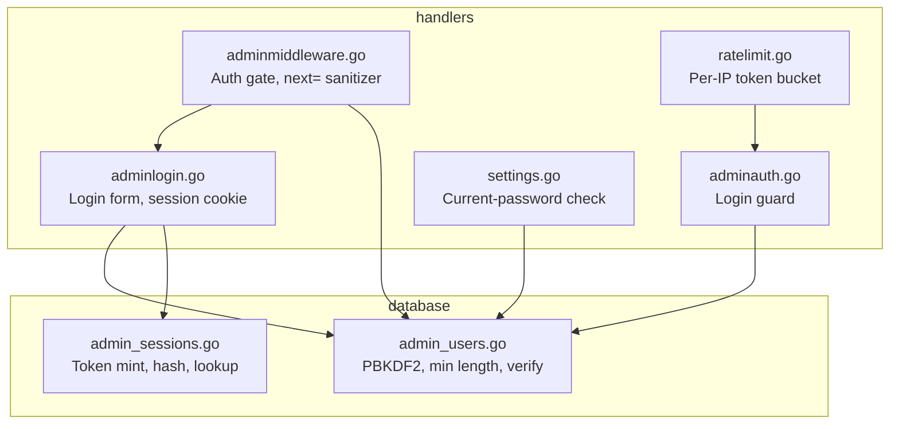
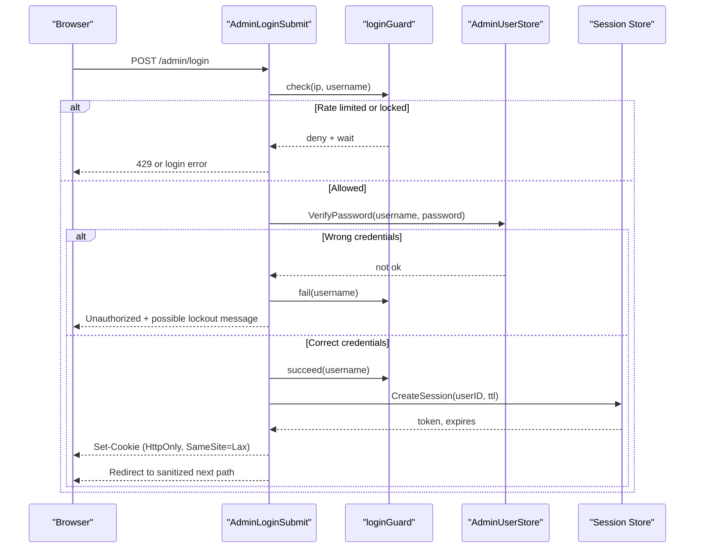
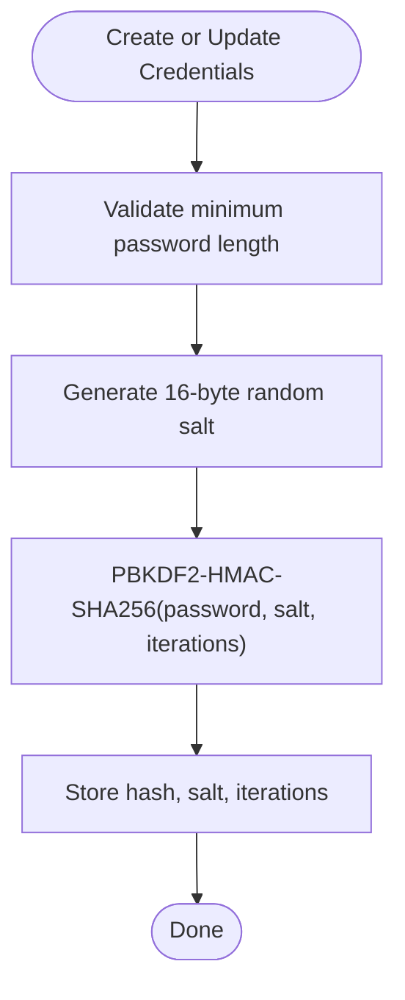
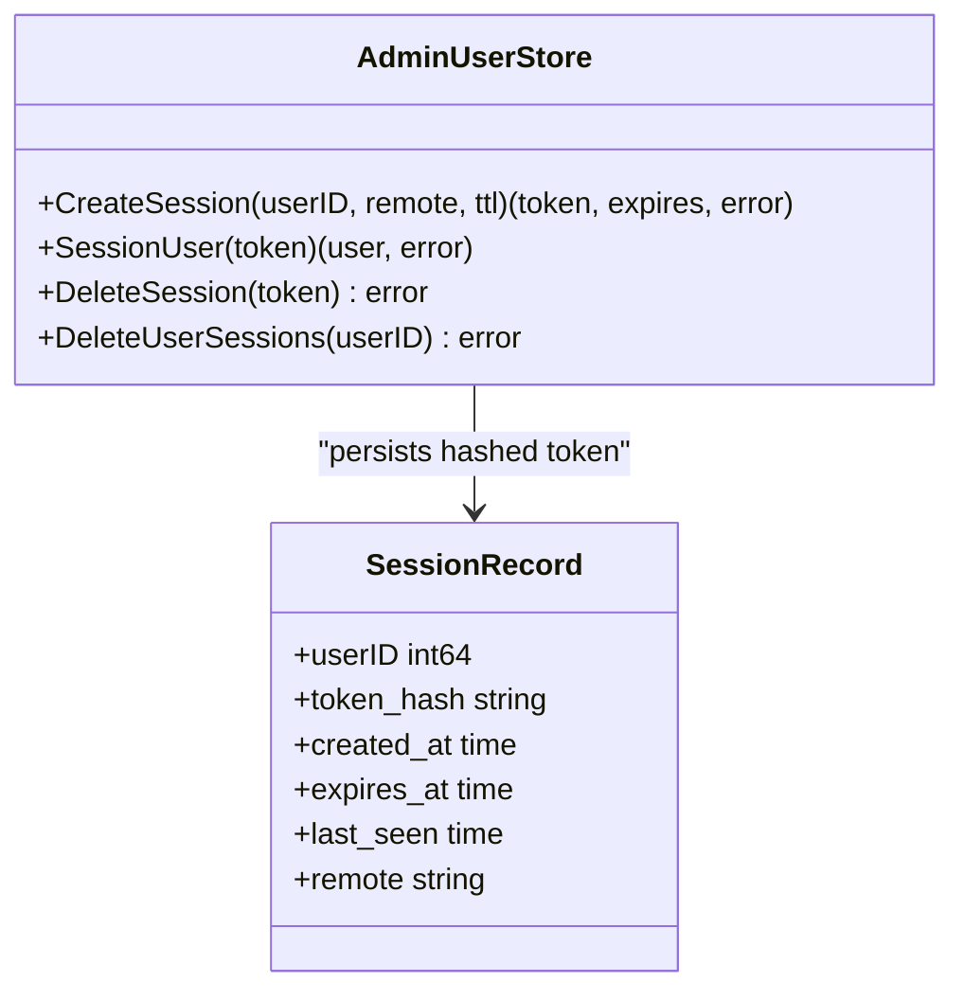
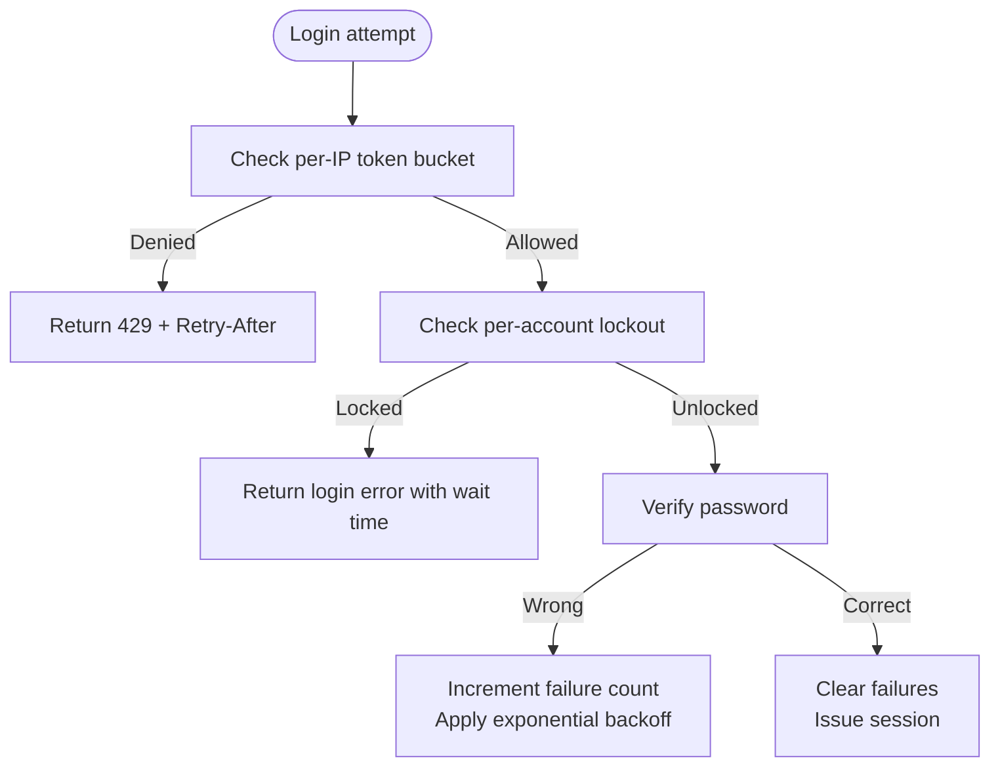
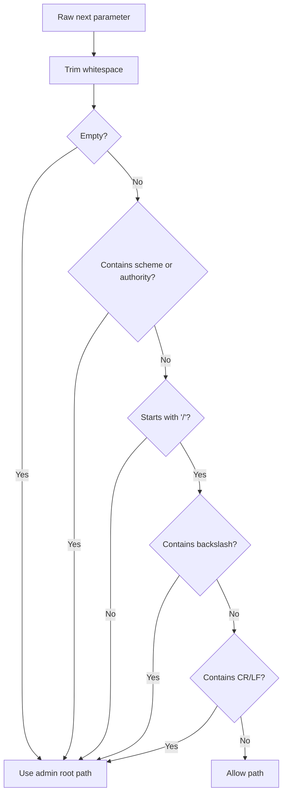
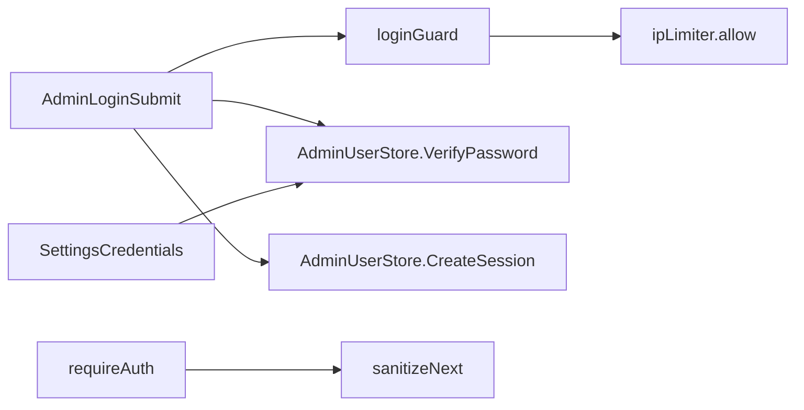

# Authentication & Security

<cite>
**Referenced Files in This Document**
- [admin_users.go](file://database/admin_users.go)
- [admin_sessions.go](file://database/admin_sessions.go)
- [adminauth.go](file://handlers/adminauth.go)
- [adminlogin.go](file://handlers/adminlogin.go)
- [adminmiddleware.go](file://handlers/adminmiddleware.go)
- [ratelimit.go](file://handlers/ratelimit.go)
- [settings.go](file://handlers/settings.go)
- [config.go](file://config.go)
</cite>

## Table of Contents
1. [Introduction](#introduction)
2. [Project Structure](#project-structure)
3. [Core Components](#core-components)
4. [Architecture Overview](#architecture-overview)
5. [Detailed Component Analysis](#detailed-component-analysis)
6. [Dependency Analysis](#dependency-analysis)
7. [Performance Considerations](#performance-considerations)
8. [Troubleshooting Guide](#troubleshooting-guide)
9. [Security Best Practices](#security-best-practices)
10. [HTTPS Deployment Guidance](#https-deployment-guidance)
11. [Security Audit Recommendations](#security-audit-recommendations)
12. [Conclusion](#conclusion)

## Introduction
This document explains the authentication and security model for the panel operator account. It covers password hashing, session management, brute-force protection, input validation, redirect safety, and operational hardening guidance. The implementation is designed for a single-operator controller that must remain simple, auditable, and resistant to common web attacks such as credential stuffing, session fixation, open redirects, and cross-site request forgery through cookies.

## Project Structure
The authentication and security logic spans two packages:

- `database`: Password hashing, user persistence, and session token storage.
- `handlers`: HTTP entry points, login guard, rate limiting, session cookie handling, middleware, and settings enforcement.

**Diagram sources**
- [adminauth.go:18-68](file://handlers/adminauth.go#L18-L68)
- [adminlogin.go:22-77](file://handlers/adminlogin.go#L22-L77)
- [adminmiddleware.go:31-97](file://handlers/adminmiddleware.go#L31-L97)
- [ratelimit.go:10-40](file://handlers/ratelimit.go#L10-L40)
- [admin_users.go:17-37](file://database/admin_users.go#L17-L37)
- [admin_sessions.go:16-50](file://database/admin_sessions.go#L16-L50)
- [settings.go:24-43](file://handlers/settings.go#L24-L43)

**Section sources**
- [adminauth.go:18-68](file://handlers/adminauth.go#L18-L68)
- [adminlogin.go:22-77](file://handlers/adminlogin.go#L22-L77)
- [adminmiddleware.go:31-97](file://handlers/adminmiddleware.go#L31-L97)
- [ratelimit.go:10-40](file://handlers/ratelimit.go#L10-L40)
- [admin_users.go:17-37](file://database/admin_users.go#L17-L37)
- [admin_sessions.go:16-50](file://database/admin_sessions.go#L16-L50)
- [settings.go:24-43](file://handlers/settings.go#L24-L43)

## Core Components
- **Password hashing**: PBKDF2-HMAC-SHA256 with per-row salt and configurable iteration count. New hashes use 210,000 iterations; stored iterations allow future upgrades without invalidating existing accounts.
- **Session tokens**: 32-byte random tokens stored as SHA-256 hex digests in the database; only the raw token is sent to the browser via an HttpOnly cookie.
- **Brute-force protection**: Two-layer guard combining per-IP rate limiting and per-account lockout with exponential backoff.
- **Input validation**: Minimum password length enforced; current password required for sensitive settings changes; strict `next=` redirect validation.
- **Cookie policy**: HttpOnly, SameSite=Lax, optional Secure flag controlled by deployment configuration.

**Section sources**
- [admin_users.go:17-37](file://database/admin_users.go#L17-L37)
- [admin_users.go:64-94](file://database/admin_users.go#L64-L94)
- [admin_sessions.go:16-50](file://database/admin_sessions.go#L16-L50)
- [adminauth.go:18-68](file://handlers/adminauth.go#L18-L68)
- [adminlogin.go:112-128](file://handlers/adminlogin.go#L112-L128)
- [adminmiddleware.go:68-97](file://handlers/adminmiddleware.go#L68-L97)
- [settings.go:67-94](file://handlers/settings.go#L67-L94)

## Architecture Overview
The operator login flow enforces multiple security layers before issuing a session cookie.

**Diagram sources**
- [adminlogin.go:36-77](file://handlers/adminlogin.go#L36-L77)
- [adminauth.go:70-127](file://handlers/adminauth.go#L70-L127)
- [admin_users.go:293-328](file://database/admin_users.go#L293-L328)
- [admin_sessions.go:23-50](file://database/admin_sessions.go#L23-L50)

## Detailed Component Analysis

### Password Hashing and Storage
- Algorithm: PBKDF2-HMAC-SHA256 using Go’s standard library.
- Salt: 16 random bytes per row, base64-encoded and stored alongside the hash.
- Iterations: Default 210,000 for new hashes; stored per row so it can be increased later while old hashes still verify.
- Comparison: Constant-time comparison prevents timing-based enumeration.
- Unknown-user defense: Even when a username does not exist, a dummy derivation runs to avoid timing leaks.

**Diagram sources**
- [admin_users.go:64-85](file://database/admin_users.go#L64-L85)
- [admin_users.go:87-94](file://database/admin_users.go#L87-L94)
- [admin_users.go:124-147](file://database/admin_users.go#L124-L147)
- [admin_users.go:293-328](file://database/admin_users.go#L293-L328)

**Section sources**
- [admin_users.go:17-37](file://database/admin_users.go#L17-L37)
- [admin_users.go:64-94](file://database/admin_users.go#L64-L94)
- [admin_users.go:293-328](file://database/admin_users.go#L293-L328)

### Session Management
- Token generation: 32 random bytes, URL-safe base64 string.
- Database storage: Only the SHA-256 digest of the token is stored; the raw token never enters the database.
- Expiration: Default 12-hour TTL, configurable via environment variable.
- Cookie flags: HttpOnly, SameSite=Lax, Secure flag controlled by deployment setting.
- Revocation: Logout deletes the token; changing the password revokes all sessions for that user.

**Diagram sources**
- [admin_sessions.go:16-50](file://database/admin_sessions.go#L16-L50)
- [admin_sessions.go:53-82](file://database/admin_sessions.go#L53-L82)
- [admin_sessions.go:84-99](file://database/admin_sessions.go#L84-L99)

**Section sources**
- [admin_sessions.go:16-50](file://database/admin_sessions.go#L16-L50)
- [admin_sessions.go:53-82](file://database/admin_sessions.go#L53-L82)
- [admin_sessions.go:84-99](file://database/admin_sessions.go#L84-L99)
- [adminlogin.go:112-128](file://handlers/adminlogin.go#L112-L128)
- [config.go:48-57](file://config.go#L48-L57)

### Brute-Force Protection
Two independent mechanisms protect the login endpoint:

1. Per-IP rate limiting
   - Token-bucket limiter allows a fixed number of requests per minute per client IP.
   - When exhausted, returns 429 with a `Retry-After` header.

2. Per-account lockout
   - After a threshold of consecutive failures, the account is locked for an escalating delay.
   - Base delay doubles on each additional failure up to a maximum cap.
   - Successful login clears the failure counter.

**Diagram sources**
- [adminauth.go:18-68](file://handlers/adminauth.go#L18-L68)
- [adminauth.go:70-127](file://handlers/adminauth.go#L70-L127)
- [adminauth.go:164-180](file://handlers/adminauth.go#L164-L180)
- [ratelimit.go:27-73](file://handlers/ratelimit.go#L27-L73)

**Section sources**
- [adminauth.go:18-68](file://handlers/adminauth.go#L18-L68)
- [adminauth.go:70-127](file://handlers/adminauth.go#L70-L127)
- [adminauth.go:164-180](file://handlers/adminauth.go#L164-L180)
- [ratelimit.go:27-73](file://handlers/ratelimit.go#L27-L73)

### Input Validation and Redirect Safety
- Minimum password length: Enforced at both creation and update paths.
- Current password requirement: Changing operator credentials requires re-authentication via the current password.
- Next redirect validation: Only same-host relative paths are allowed; absolute URLs, protocol-relative URLs, backslashes, and newline characters are rejected to prevent open redirects and header injection.

**Diagram sources**
- [adminmiddleware.go:68-97](file://handlers/adminmiddleware.go#L68-L97)
- [adminlogin.go:22-33](file://handlers/adminlogin.go#L22-L33)
- [adminlogin.go:155-164](file://handlers/adminlogin.go#L155-L164)

**Section sources**
- [admin_users.go:87-94](file://database/admin_users.go#L87-L94)
- [settings.go:67-94](file://handlers/settings.go#L67-L94)
- [adminmiddleware.go:68-97](file://handlers/adminmiddleware.go#L68-L97)

### Settings Change Protections
- Re-authentication: The current password must be supplied to change the operator name or password.
- Consistency checks: New password cannot be empty, must match confirmation, must meet minimum length, and cannot equal the current password.
- Session revocation: Changing credentials revokes all existing sessions for that user and clears the current browser cookie.

**Section sources**
- [settings.go:24-43](file://handlers/settings.go#L24-L43)
- [settings.go:45-119](file://handlers/settings.go#L45-L119)
- [admin_users.go:199-243](file://database/admin_users.go#L199-L243)

## Dependency Analysis
Authentication depends on layered components:

**Diagram sources**
- [adminlogin.go:36-77](file://handlers/adminlogin.go#L36-L77)
- [adminauth.go:70-127](file://handlers/adminauth.go#L70-L127)
- [ratelimit.go:42-73](file://handlers/ratelimit.go#L42-L73)
- [adminmiddleware.go:31-97](file://handlers/adminmiddleware.go#L31-L97)
- [settings.go:45-119](file://handlers/settings.go#L45-L119)

**Section sources**
- [adminlogin.go:36-77](file://handlers/adminlogin.go#L36-L77)
- [adminauth.go:70-127](file://handlers/adminauth.go#L70-L127)
- [ratelimit.go:42-73](file://handlers/ratelimit.go#L42-L73)
- [adminmiddleware.go:31-97](file://handlers/adminmiddleware.go#L31-L97)
- [settings.go:45-119](file://handlers/settings.go#L45-L119)

## Performance Considerations
- PBKDF2 cost: 210,000 iterations provide strong resistance to offline cracking but increase CPU usage during login and password changes. Tune only after measuring server capacity.
- In-memory guards: Both the per-IP limiter and per-account failure map live in process memory. A restart resets counters, which is acceptable because it also provides an opportunity to rotate passwords.
- Session cleanup: Expired sessions are pruned lazily on access and via dedicated pruning; ensure periodic maintenance if session volume grows.

[No sources needed since this section provides general guidance]

## Troubleshooting Guide
- Too many failed attempts: Indicates either per-IP throttling or per-account lockout. Check `Retry-After` headers and logs for retry durations.
- Account remains locked: Confirm whether the lockout is due to repeated failures; successful login clears the counter.
- Cookie not set: Ensure the browser accepts HttpOnly cookies and that the Secure flag is correctly configured behind HTTPS.
- Redirect loop or wrong destination: Inspect the `next` parameter; only safe relative paths are accepted.
- Settings change fails: Verify the current password and that the new password meets the minimum length and confirmation rules.

**Section sources**
- [adminauth.go:164-180](file://handlers/adminauth.go#L164-L180)
- [adminlogin.go:112-128](file://handlers/adminlogin.go#L112-L128)
- [adminmiddleware.go:68-97](file://handlers/adminmiddleware.go#L68-L97)
- [settings.go:67-94](file://handlers/settings.go#L67-L94)

## Security Best Practices
- Use HTTPS everywhere: Enable the Secure cookie flag and serve the panel over TLS.
- Restrict exposed endpoints: Keep the panel under a non-root path and expose only necessary routes publicly.
- Rotate secrets: Treat the database secret key and any shared service tokens as secrets; store them outside the repository.
- Limit session lifetime: Configure a reasonable `ADMIN_SESSION_TTL` aligned with operator workflow.
- Monitor logs: Track throttled logins, failed verifications, and credential changes.

**Section sources**
- [config.go:46-57](file://config.go#L46-L57)
- [adminlogin.go:112-128](file://handlers/adminlogin.go#L112-L128)
- [adminauth.go:164-180](file://handlers/adminauth.go#L164-L180)

## HTTPS Deployment Guidance
- Enable secure cookies: Set the deployment flag that makes the `Secure` attribute true on admin cookies.
- Serve over TLS: Place the controller behind a reverse proxy or configure the application to listen on HTTPS.
- Enforce HSTS: If you control the upstream, enforce HTTP Strict Transport Security to prevent downgrade attacks.
- Validate certificates: Use trusted certificate authorities and automate renewal.
- Disable insecure defaults: Do not run the panel directly on port 80 in production without TLS termination.

**Section sources**
- [config.go:46-57](file://config.go#L46-L57)
- [adminlogin.go:112-128](file://handlers/adminlogin.go#L112-L128)

## Security Audit Recommendations
- Verify PBKDF2 parameters: Confirm that new hashes use at least 210,000 iterations and that stored iterations are present.
- Inspect salts: Ensure every user record has a unique, randomly generated salt.
- Review session storage: Confirm only hashed tokens are persisted and that expired rows are pruned.
- Test brute-force defenses: Simulate distributed login attempts across multiple IPs and confirm both per-IP throttling and per-account lockout behavior.
- Validate redirect sanitization: Attempt open redirect payloads including absolute URLs, protocol-relative URLs, encoded slashes, backslashes, and newline characters.
- Confirm settings protections: Attempt to change credentials without providing the current password and verify rejection.
- Assess cookie flags: Verify HttpOnly, SameSite=Lax, and Secure attributes in production.

**Section sources**
- [admin_users.go:64-85](file://database/admin_users.go#L64-L85)
- [admin_sessions.go:16-50](file://database/admin_sessions.go#L16-L50)
- [adminauth.go:18-68](file://handlers/adminauth.go#L18-L68)
- [adminmiddleware.go:68-97](file://handlers/adminmiddleware.go#L68-L97)
- [settings.go:67-94](file://handlers/settings.go#L67-L94)
- [adminlogin.go:112-128](file://handlers/adminlogin.go#L112-L128)

## Conclusion
The authentication system combines strong password hashing, secure session tokens, layered brute-force protection, strict input validation, and careful cookie configuration. Together, these controls mitigate common attack vectors while keeping the implementation straightforward and maintainable. For production deployments, enable HTTPS, tune session lifetimes, and regularly audit the security posture against the recommendations above.