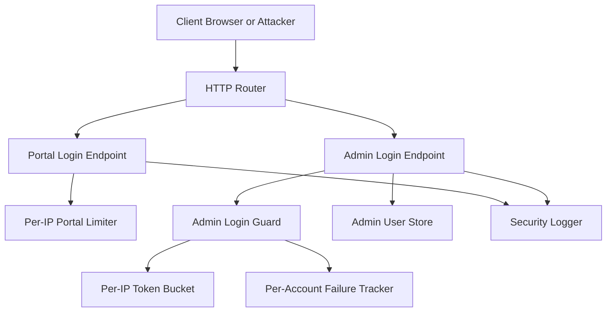
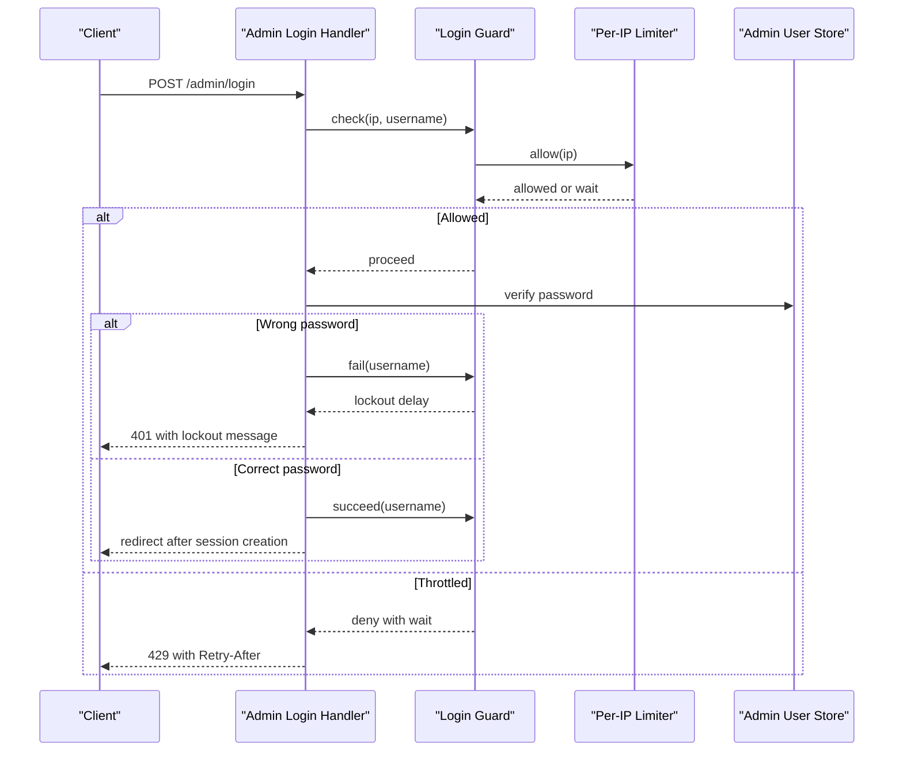
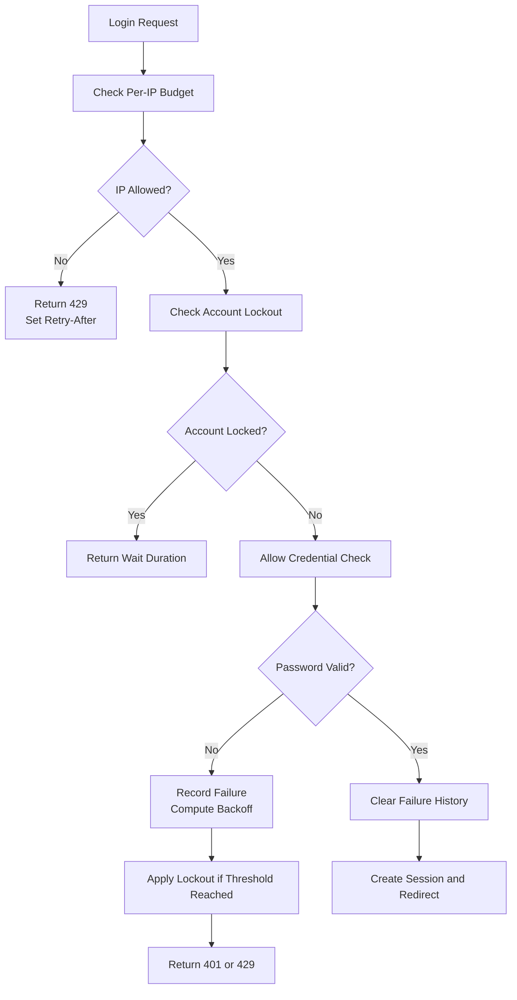
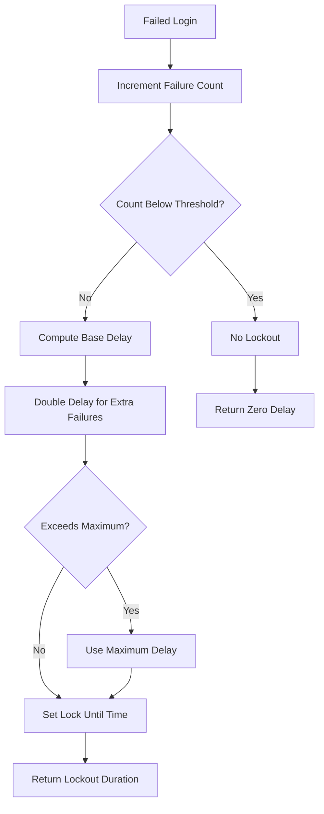
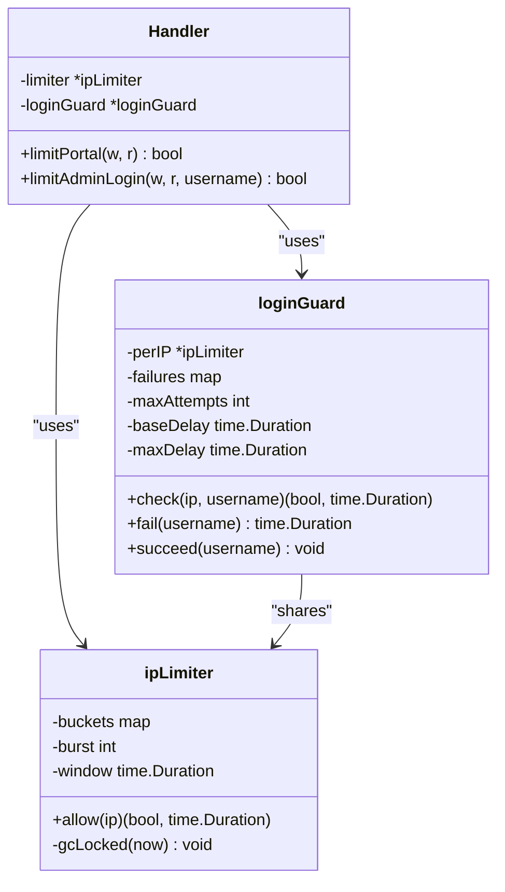

# Brute-Force Protection

<cite>
**Referenced Files in This Document**   
- [handlers/ratelimit.go](file://handlers/ratelimit.go)
- [handlers/adminauth.go](file://handlers/adminauth.go)
- [handlers/adminlogin.go](file://handlers/adminlogin.go)
- [handlers/handlers.go](file://handlers/handlers.go)
- [config.go](file://config.go)
</cite>

## Table of Contents
1. [Introduction](#introduction)
2. [Project Structure](#project-structure)
3. [Core Components](#core-components)
4. [Architecture Overview](#architecture-overview)
5. [Detailed Component Analysis](#detailed-component-analysis)
6. [Dependency Analysis](#dependency-analysis)
7. [Performance Considerations](#performance-considerations)
8. [Troubleshooting Guide](#troubleshooting-guide)
9. [Conclusion](#conclusion)

## Introduction
This document explains the brute-force protection mechanisms implemented for the captive portal and operator panel login. The system uses a dual-layer rate limiting strategy:

- **Per-address limit:** A per-IP token bucket limits how many login attempts a single client address can make within a short window.
- **Per-account lockout with exponential backoff:** After repeated failed logins against an account, the account is locked out for an escalating delay that doubles on each further failure until it reaches a maximum.

The implementation is in-memory, meaning process restarts clear counters. This is acceptable because a restart also gives operators a chance to reset credentials, and it avoids giving attackers a way to fill persistent storage with attempt records.

## Project Structure
Brute-force protection spans three main areas:

| Area | Responsibility | Key File |
|---|---|---|
| Per-IP limiter | Token-bucket throttling by client IP | [handlers/ratelimit.go](file://handlers/ratelimit.go) |
| Account lockout guard | Per-account failure tracking and exponential backoff | [handlers/adminauth.go](file://handlers/adminauth.go) |
| Login flow integration | Applies guards before credential checks and returns safe error responses | [handlers/adminlogin.go](file://handlers/adminlogin.go) |
| Handler wiring and configuration | Builds the handler, sets default limits, and exposes HTTP routes | [handlers/handlers.go](file://handlers/handlers.go) |
| Runtime configuration | Loads environment-based settings into the application config | [config.go](file://config.go) |

**Diagram sources**
- [handlers/handlers.go:234-303](file://handlers/handlers.go#L234-L303)
- [handlers/ratelimit.go:10-103](file://handlers/ratelimit.go#L10-L103)
- [handlers/adminauth.go:18-180](file://handlers/adminauth.go#L18-L180)
- [handlers/adminlogin.go:35-77](file://handlers/adminlogin.go#L35-L77)

**Section sources**
- [handlers/ratelimit.go:10-103](file://handlers/ratelimit.go#L10-L103)
- [handlers/adminauth.go:18-180](file://handlers/adminauth.go#L18-L180)
- [handlers/adminlogin.go:35-77](file://handlers/adminlogin.go#L35-L77)
- [handlers/handlers.go:145-173](file://handlers/handlers.go#L145-L173)

## Core Components

### Per-Address Rate Limiting
The per-address limiter is a small in-memory token bucket keyed by client IP. It is used for both:

- Captive portal login throttling.
- The shared per-IP layer inside the admin login guard.

Key behavior:

- Each IP starts with a burst of tokens.
- Tokens refill proportionally over time based on elapsed seconds.
- If no tokens remain, the request is rejected and a retry duration is returned.
- Idle buckets older than two windows are garbage-collected.
- The portal endpoint writes a `Retry-After` header and a 429 response when throttled.

Default values:

- Default burst: 12 requests per window.
- Default window: one minute.
- These defaults come from the handler configuration defaults.

Configuration options:

- `PortalLoginBurst`: maximum portal login attempts allowed per IP in the configured window.
- `PortalLoginWindow`: the sliding window duration for portal login throttling.

These fields exist in the handler configuration and are applied when constructing the handler.

**Section sources**
- [handlers/ratelimit.go:10-87](file://handlers/ratelimit.go#L10-L87)
- [handlers/ratelimit.go:89-103](file://handlers/ratelimit.go#L89-L103)
- [handlers/handlers.go:61-65](file://handlers/handlers.go#L61-L65)
- [handlers/handlers.go:115-120](file://handlers/handlers.go#L115-L120)
- [handlers/handlers.go:161-173](file://handlers/handlers.go#L161-L173)

### Per-Account Lockout with Exponential Backoff
The admin login guard protects the operator panel login against password guessing. It combines:

1. A per-IP token bucket check.
2. A per-account failure counter.
3. An escalating lockout delay after too many failures.

Defaults:

- Per-IP budget: 10 attempts per minute.
- Maximum consecutive failures before lockout: 5.
- Base lockout delay: 15 seconds.
- Maximum lockout delay: 15 minutes.
- Delay growth: doubles for each additional failure beyond the threshold.

Account normalization:

- Account names are lowercased and trimmed so different capitalization does not create separate counters.

Lockout lifecycle:

- On a failed login, the failure count increases.
- Once the count reaches the threshold, a lockout timestamp is set.
- Subsequent attempts while locked return a wait duration.
- On a successful login, the failure history for that account is cleared.

Garbage collection:

- Accounts inactive for more than an hour are removed from memory to prevent unbounded growth.

**Section sources**
- [handlers/adminauth.go:18-68](file://handlers/adminauth.go#L18-L68)
- [handlers/adminauth.go:70-127](file://handlers/adminauth.go#L70-L127)
- [handlers/adminauth.go:140-159](file://handlers/adminauth.go#L140-L159)

### Login Flow Integration
The admin login handler applies the guard before checking credentials. This means:

- A locked account does not trigger expensive password verification.
- Throttled clients receive a 429 response with a human-readable wait message.
- Failed passwords increment the account failure counter and may trigger lockout.
- Successful logins clear previous failures and issue a session cookie.

**Diagram sources**
- [handlers/adminlogin.go:35-77](file://handlers/adminlogin.go#L35-L77)
- [handlers/adminauth.go:70-127](file://handlers/adminauth.go#L70-L127)
- [handlers/adminauth.go:164-180](file://handlers/adminauth.go#L164-L180)

**Section sources**
- [handlers/adminlogin.go:35-77](file://handlers/adminlogin.go#L35-L77)
- [handlers/adminauth.go:164-180](file://handlers/adminauth.go#L164-L180)

## Architecture Overview
The brute-force protection architecture has two independent layers:

| Layer | Scope | Purpose | Behavior |
|---|---|---|---|
| Per-IP token bucket | Client IP address | Prevents a single host from spraying thousands of guesses quickly | Refills tokens over time; rejects requests when empty |
| Per-account lockout | Normalized account name | Stops distributed attacks targeting one account | Doubles delay after threshold; caps at maximum delay |

**Diagram sources**
- [handlers/adminauth.go:70-127](file://handlers/adminauth.go#L70-L127)
- [handlers/adminauth.go:164-180](file://handlers/adminauth.go#L164-L180)
- [handlers/adminlogin.go:45-65](file://handlers/adminlogin.go#L45-L65)

## Detailed Component Analysis

### Per-IP Token Bucket Algorithm
The per-IP limiter tracks:

- Current token balance.
- Last seen time.
- Burst capacity.
- Window duration.
- Garbage collection state.

Algorithm steps:

1. Initialize a bucket for a new IP with full tokens.
2. Calculate refill rate as burst divided by window seconds.
3. Add elapsed-time-based tokens up to the burst cap.
4. Update last seen time.
5. If tokens are below one, compute wait time and reject.
6. Otherwise, consume one token and allow the request.

Complexity:

- Lookup and update are O(1) per IP.
- Garbage collection scans all buckets but runs only once per window.

Optimization opportunities:

- Replace the map with a concurrent-safe structure if horizontal scaling is required.
- Persist counters if restart resilience is needed.
- Add trusted-IP bypass logic if internal monitoring or health checks must be exempt.

Error handling:

- Nil limiter allows all requests.
- Minimum retry duration is enforced at the response layer.

**Section sources**
- [handlers/ratelimit.go:10-87](file://handlers/ratelimit.go#L10-L87)
- [handlers/ratelimit.go:89-103](file://handlers/ratelimit.go#L89-L103)

### Account Failure Tracking and Exponential Backoff
The account failure tracker stores:

- Consecutive failure count.
- Most recent failure time.
- Lockout expiration time.

Backoff calculation:

- Starts at base delay after reaching the failure threshold.
- Doubles for each additional failure.
- Is capped at the maximum delay.

Important design points:

- Lockout is per normalized account, not per IP.
- Successful login clears failure history.
- Inactive accounts are garbage-collected after one hour.

**Diagram sources**
- [handlers/adminauth.go:94-127](file://handlers/adminauth.go#L94-L127)

**Section sources**
- [handlers/adminauth.go:48-68](file://handlers/adminauth.go#L48-L68)
- [handlers/adminauth.go:94-127](file://handlers/adminauth.go#L94-L127)
- [handlers/adminauth.go:140-159](file://handlers/adminauth.go#L140-L159)

### Custom Error Responses and Logging
Throttled requests use consistent security-friendly responses:

| Scenario | Status Code | Headers | Body / Message |
|---|---:|---|---|
| Portal login throttled | 429 | `Retry-After` | Human-readable throttling message |
| Admin login throttled | 429 | `Retry-After` | Form re-rendered with throttling message |
| Account locked | 401 or 429 depending on path | Optional `Retry-After` | Lockout message with human-readable wait time |

Logging includes:

- Remote IP.
- Normalized account name.
- Retry duration.
- Security-relevant events such as throttling, failed logins, successful sign-in, and logout.

**Section sources**
- [handlers/ratelimit.go:89-103](file://handlers/ratelimit.go#L89-L103)
- [handlers/adminauth.go:164-180](file://handlers/adminauth.go#L164-L180)
- [handlers/adminlogin.go:45-77](file://handlers/adminlogin.go#L45-L77)

### Configuration Options
The current codebase exposes portal-level rate limit configuration through the handler configuration:

| Option | Type | Default | Description |
|---|---|---:|---|
| `PortalLoginBurst` | integer | 12 | Maximum portal login attempts per IP in the configured window |
| `PortalLoginWindow` | duration | 1 minute | Time window for portal login throttling |

The admin login guard uses hardcoded production defaults:

- 10 attempts per minute per IP.
- 5 failures before lockout.
- 15-second base delay.
- 15-minute maximum delay.

Environment variables currently loaded into the application configuration include database paths, API timeout, portal labels, admin credentials, session TTL, coin slot settings, and listen address. There is no explicit environment variable for adjusting the admin login guard’s thresholds in the current configuration loader.

**Section sources**
- [handlers/handlers.go:61-65](file://handlers/handlers.go#L61-L65)
- [handlers/handlers.go:115-120](file://handlers/handlers.go#L115-L120)
- [handlers/adminauth.go:57-68](file://handlers/adminauth.go#L57-L68)
- [config.go:20-77](file://config.go#L20-L77)

## Dependency Analysis
The brute-force protection components have the following relationships:

**Diagram sources**
- [handlers/ratelimit.go:10-87](file://handlers/ratelimit.go#L10-L87)
- [handlers/adminauth.go:18-127](file://handlers/adminauth.go#L18-L127)
- [handlers/handlers.go:145-173](file://handlers/handlers.go#L145-L173)

Coupling and cohesion:

- The per-IP limiter is cohesive and reusable across portal and admin flows.
- The login guard composes the limiter and adds account-specific policy.
- The handler owns both dependencies and applies them at the appropriate endpoints.

Potential circular dependencies:

- None observed. The limiter does not depend on the guard or handler.

External integration points:

- Database access occurs after the guard passes, reducing attack surface.
- Logging integrates with structured logging for security monitoring.

**Section sources**
- [handlers/ratelimit.go:10-87](file://handlers/ratelimit.go#L10-L87)
- [handlers/adminauth.go:18-127](file://handlers/adminauth.go#L18-L127)
- [handlers/handlers.go:145-173](file://handlers/handlers.go#L145-L173)

## Performance Considerations
- All rate-limit state is in memory. This keeps latency low and avoids database overhead during brute-force attacks.
- Memory usage grows with the number of distinct IPs and account names. Garbage collection reduces this risk.
- The per-IP check is cheap and runs before expensive password hashing.
- Lockout delays reduce repeated work even when an attacker changes source IPs.

Recommendations:

- Monitor memory usage under sustained attack scenarios.
- Tune `PortalLoginBurst` and `PortalLoginWindow` based on expected legitimate traffic patterns.
- Consider persisting critical lockout state if restart resilience is required.
- Add metrics for throttled requests, failed logins, and lockouts to support external monitoring.

[No sources needed since this section provides general guidance]

## Troubleshooting Guide

### Clients Are Repeatedly Throttled
Symptoms:

- Portal or admin login returns 429.
- `Retry-After` header is present.
- Logs show throttling warnings.

Likely causes:

- Too many login attempts from one IP.
- Automated scripts or misconfigured clients retrying rapidly.
- Shared NAT or proxy addresses causing multiple users to share one IP budget.

Actions:

- Reduce retry frequency on the client side.
- Adjust `PortalLoginBurst` and `PortalLoginWindow` if legitimate traffic is being over-throttled.
- Investigate whether a reverse proxy or load balancer is masking real client IPs.

**Section sources**
- [handlers/ratelimit.go:89-103](file://handlers/ratelimit.go#L89-L103)
- [handlers/adminauth.go:164-180](file://handlers/adminauth.go#L164-L180)

### Account Is Permanently Locked
Symptoms:

- Operator cannot log in.
- Login form shows a long wait time.
- Logs indicate lockout duration.

Likely causes:

- Multiple failed password attempts.
- Distributed guessing against the same account.
- Stale lockout state due to in-memory storage.

Actions:

- Wait until the lockout expires.
- Restart the controller to clear in-memory state.
- Change the operator password through supported administrative procedures.
- Review logs for suspicious activity.

**Section sources**
- [handlers/adminauth.go:94-127](file://handlers/adminauth.go#L94-L127)
- [handlers/adminlogin.go:56-65](file://handlers/adminlogin.go#L56-L65)

### Monitoring and Security Observability
Useful log signals:

- Throttled login attempts.
- Failed admin logins with lockout duration.
- Successful admin sign-ins.
- Admin logout events.

Recommended monitoring:

- Alert on spikes in 429 responses.
- Track per-account failure counts.
- Correlate throttling with known malicious IPs.
- Export logs to a centralized security monitoring system.

**Section sources**
- [handlers/ratelimit.go:99-101](file://handlers/ratelimit.go#L99-L101)
- [handlers/adminauth.go:174-178](file://handlers/adminauth.go#L174-L178)
- [handlers/adminlogin.go:56-75](file://handlers/adminlogin.go#L56-L75)

## Conclusion
The brute-force protection system combines a fast per-IP token bucket with a stronger per-account lockout mechanism. This dual approach defends against both local flooding and distributed guessing. The implementation prioritizes simplicity and safety:

- In-memory state avoids giving attackers a persistence target.
- Lockout delays grow exponentially and are capped.
- Errors are safe, informative, and instrumented for monitoring.
- Configuration supports tuning portal-level rate limits.

For environments requiring higher durability, trusted-IP bypass, or external monitoring integration, the current design provides clear extension points around the limiter, guard, and logging layers.

[No sources needed since this section summarizes without analyzing specific files]