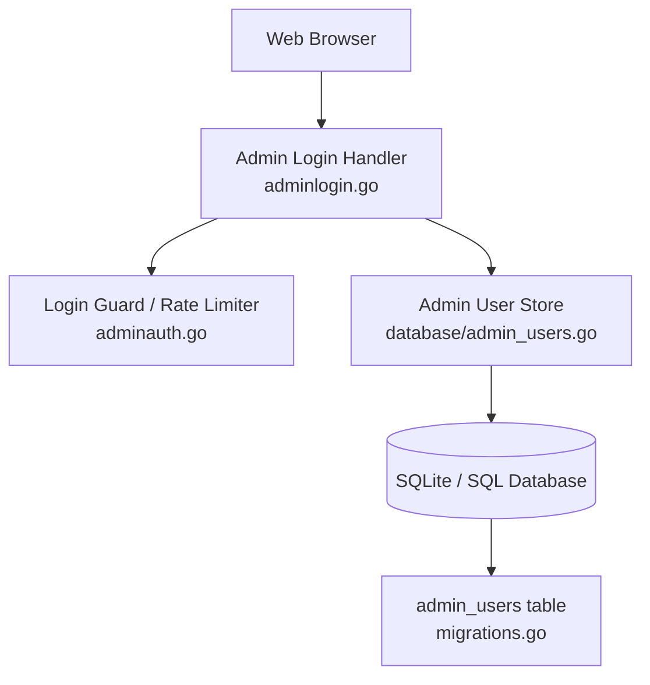
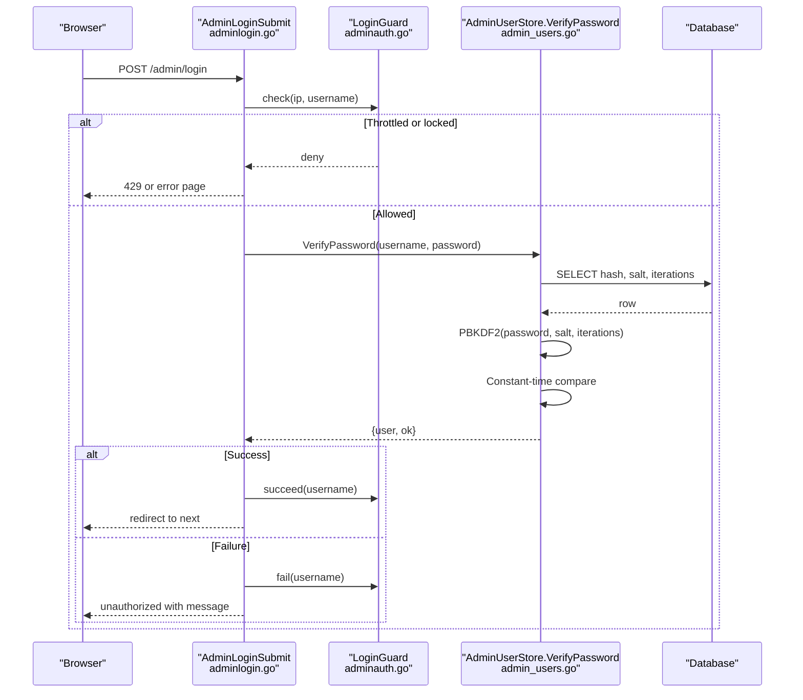
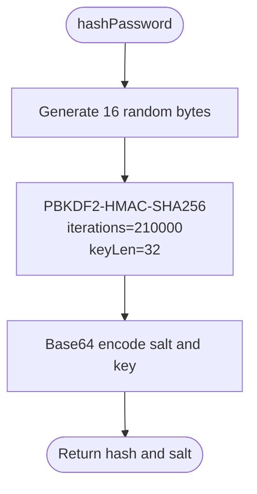
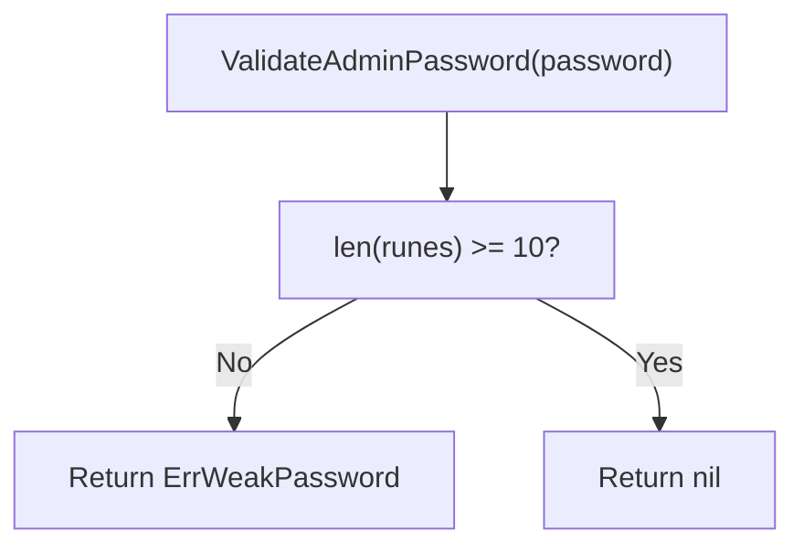
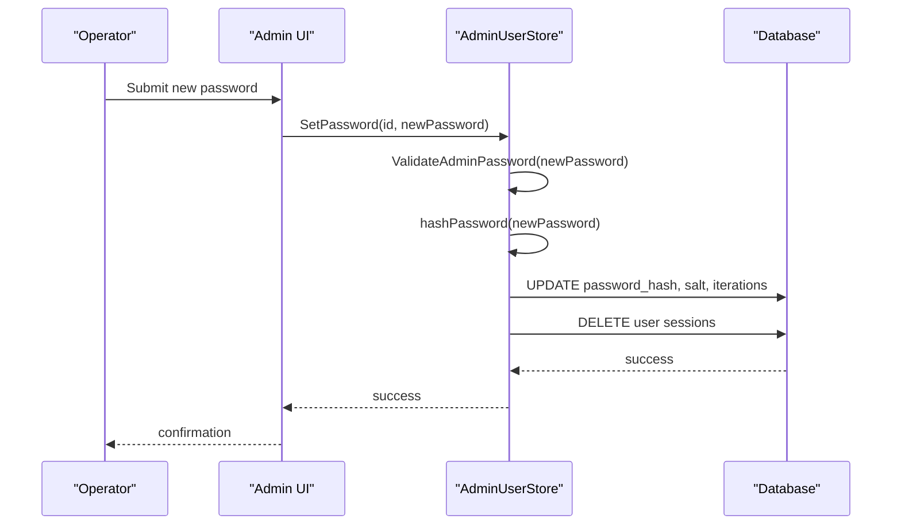
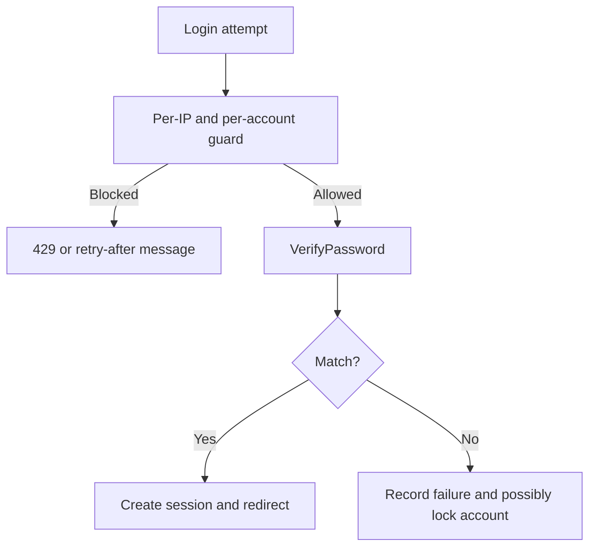
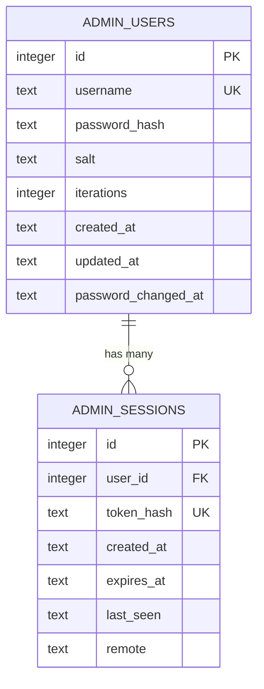
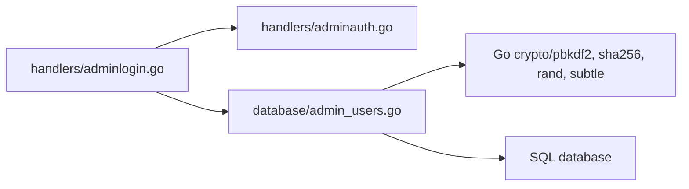

# Password Hashing & Storage

<cite>
**Referenced Files in This Document**
- [admin_users.go](file://database/admin_users.go)
- [migrations.go](file://database/migrations.go)
- [adminauth.go](file://handlers/adminauth.go)
- [adminlogin.go](file://handlers/adminlogin.go)
- [README.md](file://README.md)
</cite>

## Table of Contents
1. [Introduction](#introduction)
2. [Project Structure](#project-structure)
3. [Core Components](#core-components)
4. [Architecture Overview](#architecture-overview)
5. [Detailed Component Analysis](#detailed-component-analysis)
6. [Dependency Analysis](#dependency-analysis)
7. [Performance Considerations](#performance-considerations)
8. [Troubleshooting Guide](#troubleshooting-guide)
9. [Conclusion](#conclusion)

## Introduction
This document explains the admin panel password hashing, storage, validation, and change workflow. It focuses on:
- PBKDF2-HMAC-SHA256 with 210,000 iterations and per-row salt storage using 16-byte random salts.
- Minimum password length enforcement and current-password verification behavior.
- Secure password change flow, including session revocation.
- Error handling for invalid credentials and brute-force protection.
- The database schema used to store admin users and their authentication material.

The implementation is designed for a single-operator panel where one `admin_users` row represents the operator account.

## Project Structure
The password system spans two layers:
- Database layer: PBKDF2 hashing, salt generation, password validation, credential persistence, and verification.
- HTTP handler layer: login form processing, rate limiting, session creation, and logout.

**Diagram sources**
- [adminlogin.go:36-77](file://handlers/adminlogin.go#L36-L77)
- [adminauth.go:18-68](file://handlers/adminauth.go#L18-L68)
- [admin_users.go:64-94](file://database/admin_users.go#L64-L94)
- [migrations.go:101-111](file://database/migrations.go#L101-L111)

**Section sources**
- [admin_users.go:17-34](file://database/admin_users.go#L17-L34)
- [migrations.go:101-126](file://database/migrations.go#L101-L126)
- [adminauth.go:18-68](file://handlers/adminauth.go#L18-L68)
- [adminlogin.go:36-77](file://handlers/adminlogin.go#L36-L77)

## Core Components
- PBKDF2 parameters:
  - Algorithm: PBKDF2-HMAC-SHA256.
  - Iterations: 210,000 for new hashes.
  - Salt: 16 bytes generated from a cryptographically secure random source.
  - Derived key length: 32 bytes.
- Password policy:
  - Minimum length enforced at the store layer.
  - Username normalization (trim + lowercase).
- Credential operations:
  - Create, update username/password, recovery reset, and verification.
- Brute-force protection:
  - Per-IP token bucket.
  - Per-account escalating lockout with exponential backoff.
- Session security:
  - Random session tokens.
  - Only hashed tokens stored in the database.
  - Session revocation on password change.

**Section sources**
- [admin_users.go:24-34](file://database/admin_users.go#L24-L34)
- [admin_users.go:64-94](file://database/admin_users.go#L64-L94)
- [adminauth.go:18-68](file://handlers/adminauth.go#L18-L68)

## Architecture Overview
The login and password change flows are layered so that expensive cryptographic work happens only after lightweight checks pass, while still preventing timing-based user enumeration.

**Diagram sources**
- [adminlogin.go:36-77](file://handlers/adminlogin.go#L36-L77)
- [adminauth.go:70-127](file://handlers/adminauth.go#L70-L127)
- [admin_users.go:293-328](file://database/admin_users.go#L293-L328)

## Detailed Component Analysis

### PBKDF2-HMAC-SHA256 Implementation
- New hashes are created by generating a fresh 16-byte salt and deriving a 32-byte key using PBKDF2 with 210,000 iterations.
- Both the base64-encoded salt and derived key are persisted.
- Verification reads the stored salt and iteration count, derives a candidate hash, and compares it using constant-time comparison.
- Unknown usernames still perform a derivation to avoid timing-based enumeration.

**Diagram sources**
- [admin_users.go:64-85](file://database/admin_users.go#L64-L85)

**Section sources**
- [admin_users.go:24-34](file://database/admin_users.go#L24-L34)
- [admin_users.go:64-85](file://database/admin_users.go#L64-L85)
- [admin_users.go:293-328](file://database/admin_users.go#L293-L328)

### Password Validation Rules
- Minimum length: passwords shorter than 10 characters are rejected.
- Validation runs before any database write, ensuring weak accounts cannot be created through any code path.
- Username normalization prevents duplicate accounts differing only by case.

**Diagram sources**
- [admin_users.go:87-94](file://database/admin_users.go#L87-L94)

**Section sources**
- [admin_users.go:36-41](file://database/admin_users.go#L36-L41)
- [admin_users.go:87-98](file://database/admin_users.go#L87-L98)

### Secure Password Change Workflow
There are three relevant paths:
- Changing both username and password via `SetCredentials`.
- Resetting only the password via `SetPassword`.
- Creating an initial operator account via `Create`/`EnsureAdminUser`.

Key behaviors:
- All password changes validate minimum length.
- A new hash and salt are generated.
- On any password change, all existing sessions for that user are revoked.
- Recovery/reset paths enforce the same strength rules as normal creation.

**Diagram sources**
- [admin_users.go:260-291](file://database/admin_users.go#L260-L291)

**Section sources**
- [admin_users.go:124-148](file://database/admin_users.go#L124-L148)
- [admin_users.go:199-243](file://database/admin_users.go#L199-L243)
- [admin_users.go:260-291](file://database/admin_users.go#L260-L291)

### Current Password Requirement Verification
- The store’s public API does not require the old password when changing it; instead, it relies on caller-level authorization and session validation.
- When a password is changed, every existing session is deleted, which effectively invalidates previously captured cookies.
- Tests assert that after a reset, the old password no longer verifies and sessions are removed.

Security implication:
- Do not expose password-change endpoints without verifying the caller’s authenticated session and authorization.
- If you add a “change my password” endpoint, verify the current password at the handler/service boundary before calling `SetPassword`.

**Section sources**
- [admin_users.go:260-291](file://database/admin_users.go#L260-L291)
- [admin_users_test.go:36-52](file://database/admin_users_test.go#L36-L52)

### Error Handling for Invalid Credentials
- Wrong username or password returns an unauthorized response.
- Failed attempts trigger the login guard:
  - Per-IP throttling rejects rapid guesses.
  - Per-account lockout applies exponential backoff after repeated failures.
- For unknown usernames, verification still performs a PBKDF2 derivation to prevent timing-based user enumeration.

**Diagram sources**
- [adminauth.go:70-127](file://handlers/adminauth.go#L70-L127)
- [adminlogin.go:45-66](file://handlers/adminlogin.go#L45-L66)
- [admin_users.go:293-328](file://database/admin_users.go#L293-L328)

**Section sources**
- [adminauth.go:18-68](file://handlers/adminauth.go#L18-L68)
- [adminauth.go:70-127](file://handlers/adminauth.go#L70-L127)
- [adminlogin.go:45-66](file://handlers/adminlogin.go#L45-L66)
- [admin_users.go:293-328](file://database/admin_users.go#L293-L328)

### Database Schema for Admin User Storage
The `admin_users` table stores:
- `id`: primary key.
- `username`: unique, case-insensitive.
- `password_hash`: base64-encoded PBKDF2-derived key.
- `salt`: base64-encoded 16-byte random salt.
- `iterations`: per-row iteration count, allowing future increases without breaking older hashes.
- Lifecycle timestamps and `password_changed_at`.

**Diagram sources**
- [migrations.go:101-126](file://database/migrations.go#L101-L126)

**Section sources**
- [migrations.go:101-126](file://database/migrations.go#L101-L126)

## Dependency Analysis
The password system depends on:
- Go standard library cryptography (`crypto/pbkdf2`, `crypto/sha256`, `crypto/rand`, `crypto/subtle`).
- SQL database access through the application’s database abstraction.
- HTTP handlers for login submission, session cookie management, and logout.
- In-memory login guard for brute-force mitigation.

**Diagram sources**
- [adminlogin.go:36-77](file://handlers/adminlogin.go#L36-L77)
- [adminauth.go:18-68](file://handlers/adminauth.go#L18-L68)
- [admin_users.go:5-14](file://database/admin_users.go#L5-L14)

**Section sources**
- [admin_users.go:5-14](file://database/admin_users.go#L5-L14)
- [adminauth.go:18-68](file://handlers/adminauth.go#L18-L68)
- [adminlogin.go:36-77](file://handlers/adminlogin.go#L36-L77)

## Performance Considerations
- PBKDF2 cost:
  - 210,000 iterations provide strong resistance against offline cracking while remaining practical for a small number of admin logins.
  - Each failed login triggers one derivation; successful logins also derive once.
- Timing side-channel mitigation:
  - Unknown usernames still incur a derivation cost to avoid timing leaks.
- Memory usage:
  - Salts and derived keys are short and transient.
- Scalability:
  - The login guard state is in memory; restarts clear counters, which is acceptable because restarts also invalidate active sessions.

[No sources needed since this section provides general guidance]

## Troubleshooting Guide
Common issues and remedies:
- Weak password rejected:
  - Ensure the password meets the minimum length requirement.
  - The store returns a distinct weak-password error that can be surfaced to the UI.
- Account locked due to too many failures:
  - Wait for the indicated retry interval.
  - The guard reports a human-readable wait time and sets a retry header.
- Old password still works after reset:
  - This should not happen; tests assert that resets invalidate old passwords and sessions.
  - Investigate whether the reset path was actually executed and whether sessions were deleted.
- Corrupt salt:
  - If the stored salt cannot be decoded, verification fails with a corruption error.
  - Restore from backup or reinitialize the operator account if necessary.

**Section sources**
- [admin_users.go:39-41](file://database/admin_users.go#L39-L41)
- [admin_users.go:316-318](file://database/admin_users.go#L316-L318)
- [adminauth.go:164-179](file://handlers/adminauth.go#L164-L179)

## Conclusion
The admin panel uses PBKDF2-HMAC-SHA256 with 210,000 iterations and per-row 16-byte random salts. Passwords are validated against a minimum length policy before being persisted. Verification is constant-time and resistant to timing-based user enumeration. Brute-force attacks are mitigated by per-IP throttling and per-account lockout with exponential backoff. Any password change invalidates existing sessions, reducing the risk of replayed cookies. The schema stores the hash, salt, and iteration count per row, enabling safe future upgrades to stronger parameters.

[No sources needed since this section summarizes without analyzing specific files]