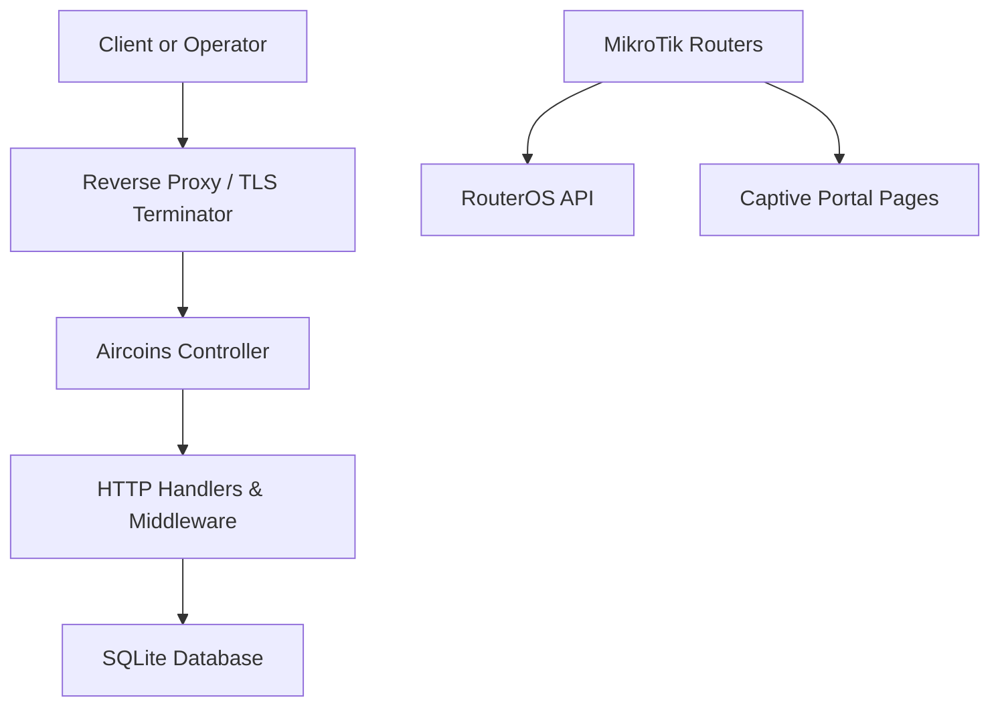
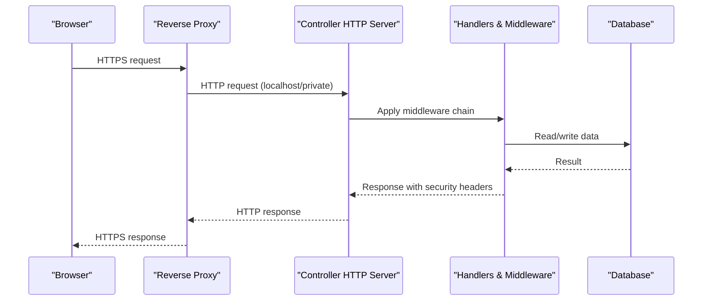
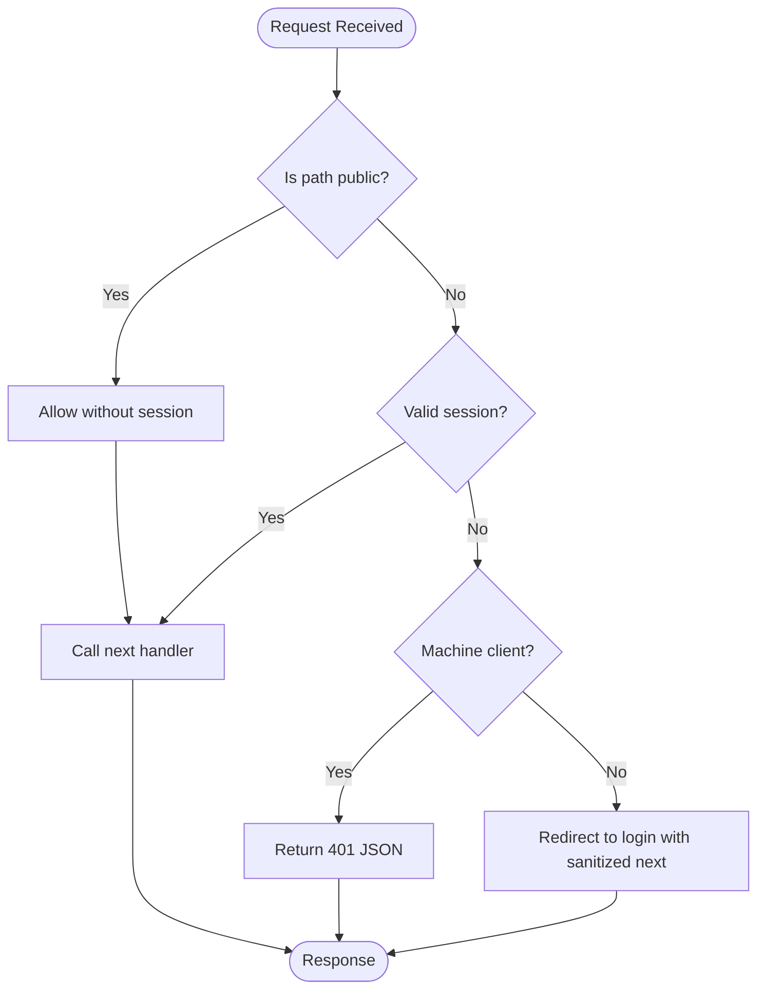
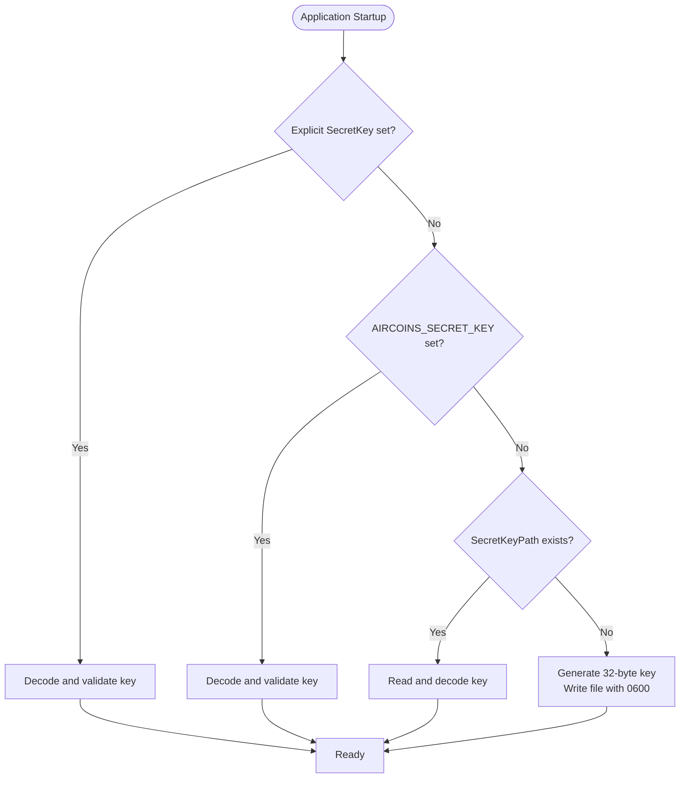
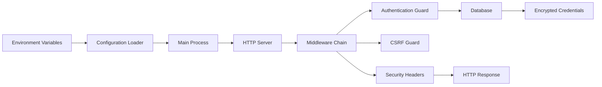

# Security Best Practices

<cite>
**Referenced Files in This Document**
- [README.md](file://README.md)
- [main.go](file://main.go)
- [config.go](file://config.go)
- [handlers/handlers.go](file://handlers/handlers.go)
- [handlers/adminmiddleware.go](file://handlers/adminmiddleware.go)
- [database/secretbox.go](file://database/secretbox.go)
</cite>

## Table of Contents
1. [Introduction](#introduction)
2. [Project Structure](#project-structure)
3. [Core Components](#core-components)
4. [Architecture Overview](#architecture-overview)
5. [Detailed Component Analysis](#detailed-component-analysis)
6. [Dependency Analysis](#dependency-analysis)
7. [Performance Considerations](#performance-considerations)
8. [Troubleshooting Guide](#troubleshooting-guide)
9. [Conclusion](#conclusion)
10. [Appendices](#appendices)

## Introduction
This document provides security best practices for deploying the MikroTik controller in production. It focuses on HTTPS deployment, security headers, session and credential protection, environment-based configuration, secret management, network hardening, SSL/TLS setup, and incident response guidance tailored to this application.

The controller exposes two primary surfaces:
- A captive portal reachable by hotspot clients.
- An operator panel used to manage routers, vouchers, sessions, and network settings.

Because these surfaces have different trust levels, the deployment must clearly separate public guest traffic from authenticated administrative operations.

## Project Structure
At a high level, the project is organized into:
- Application entry point and process lifecycle.
- Environment-driven configuration.
- HTTP routing, middleware, and handlers.
- Database layer with encrypted credentials.
- Templates for captive portal and operator interfaces.

**Diagram sources**
- [main.go:214-285](file://main.go#L214-L285)
- [handlers/handlers.go:234-303](file://handlers/handlers.go#L234-L303)
- [database/secretbox.go:26-44](file://database/secretbox.go#L26-L44)

**Section sources**
- [README.md:1-206](file://README.md#L1-L206)
- [main.go:1-350](file://main.go#L1-L350)

## Core Components
The security-relevant core components are:
- HTTP server startup and graceful shutdown.
- Environment configuration loader.
- Request pipeline with recovery, logging, security headers, CSRF guard, and authentication.
- Session and login protection.
- Master key and credential encryption.

Key responsibilities:
- The entry point loads configuration, opens the database, boots the admin account, constructs the handler, and starts the HTTP server.
- Configuration is driven by environment variables, including secure cookie behavior and master key location.
- The handler composes middleware that enforces safe defaults, request limits, CSRF validation, and authentication.
- Router passwords are encrypted at rest using AES-GCM with a 32-byte master key.

**Section sources**
- [main.go:214-285](file://main.go#L214-L285)
- [config.go:20-77](file://config.go#L20-L77)
- [handlers/handlers.go:234-303](file://handlers/handlers.go#L234-L303)
- [database/secretbox.go:26-44](file://database/secretbox.go#L26-L44)

## Architecture Overview
The recommended production architecture places a reverse proxy in front of the controller. The proxy terminates TLS, enforces HTTPS-only access, and forwards requests to the controller over localhost or a private network.

**Diagram sources**
- [main.go:246-285](file://main.go#L246-L285)
- [handlers/handlers.go:498-525](file://handlers/handlers.go#L498-L525)

## Detailed Component Analysis

### HTTPS Deployment Requirements
The controller itself does not terminate TLS; it listens on an address configured through `ADDR`. Production deployments should:
- Terminate TLS at a reverse proxy such as Nginx, Caddy, HAProxy, or a cloud load balancer.
- Forward only trusted internal traffic to the controller.
- Set `SECURE_COOKIES=1` so session cookies are marked secure and sent only over HTTPS.
- Avoid exposing the controller directly to untrusted networks.

Security implications:
- Without HTTPS, session cookies can be intercepted.
- Without `SECURE_COOKIES=1`, cookies may be sent over insecure connections even if TLS is terminated upstream.
- Direct exposure increases attack surface for brute-force, CSRF, and credential theft.

Recommended proxy configuration principles:
- Enforce HTTPS redirect from HTTP.
- Use modern TLS versions and strong cipher suites.
- Enable HSTS at the proxy.
- Restrict source IPs to trusted networks where possible.
- Log TLS handshake failures and certificate errors.

**Section sources**
- [README.md:70-90](file://README.md#L70-L90)
- [README.md:139-140](file://README.md#L139-L140)
- [config.go:46-46](file://config.go#L46-L46)
- [main.go:246-253](file://main.go#L246-L253)

### Security Header Configuration
The controller applies conservative security headers through middleware:
- `X-Content-Type-Options: nosniff` prevents MIME sniffing.
- `X-Frame-Options: DENY` prevents clickjacking by disallowing framing.
- `Referrer-Policy: no-referrer` reduces accidental information leakage.
- `Content-Security-Policy` uses a restrictive default policy while allowing inline scripts and same-origin connections required by the dashboard.

Important notes:
- The CSP sets `default-src 'none'`, then explicitly allows `script-src 'self' 'unsafe-inline'`, `connect-src 'self'`, `style-src 'unsafe-inline'`, `img-src 'self' data:`, `form-action 'self'`, `frame-ancestors 'none'`, and `base-uri 'none'`.
- Inline scripts are allowed because the dashboard ships its logic as inline JavaScript.
- Same-origin fetch calls are permitted via `connect-src 'self'`.
- Styles are also allowed inline because templates include inline styles.

Recommendations:
- Keep `X-Frame-Options: DENY` unless you have a documented reason to allow framing.
- If you move all JavaScript to external files, consider removing `'unsafe-inline'` from `script-src`.
- Monitor CSP violations using browser developer tools and CSP reporting endpoints if you add a report URI later.
- Do not weaken the policy broadly; prefer targeted exceptions.

**Section sources**
- [handlers/handlers.go:498-525](file://handlers/handlers.go#L498-L525)
- [handlers/security_headers_test.go:11-48](file://handlers/security_headers_test.go#L11-L48)

### Authentication and Session Security
The operator panel requires authentication:
- Unauthenticated requests are redirected to the login form or receive a JSON unauthorized response for machine clients.
- Public paths are narrowly defined and include captive portal endpoints and the panel login/logout routes.
- Redirect targets are sanitized to prevent open redirects.
- Sessions use a random token stored as a hash, with cookies marked `HttpOnly` and `SameSite=Lax`.
- Changing the password invalidates existing sessions.

Brute-force protections:
- Per-address rate limiting for captive portal logins.
- Per-account lockout after consecutive failures, with exponential backoff.
- Minimum password length enforcement.

CSRF protection:
- Admin state-changing requests require a double-submit CSRF token.
- Captive portal and machine-facing endpoints are intentionally exempt where appropriate.

Best practices:
- Always deploy behind HTTPS.
- Enable `SECURE_COOKIES=1`.
- Restrict admin access to trusted operators and networks.
- Rotate operator credentials regularly.
- Monitor failed login attempts and account lockouts.

**Diagram sources**
- [handlers/adminmiddleware.go:18-55](file://handlers/adminmiddleware.go#L18-L55)
- [handlers/adminmiddleware.go:68-97](file://handlers/adminmiddleware.go#L68-L97)

**Section sources**
- [handlers/adminmiddleware.go:1-98](file://handlers/adminmiddleware.go#L1-L98)
- [handlers/handlers.go:546-614](file://handlers/handlers.go#L546-L614)
- [README.md:111-140](file://README.md#L111-L140)

### Secret Management and Credential Encryption
Router API passwords are encrypted at rest:
- A 32-byte master key is used with AES-GCM.
- The master key can be provided via configuration, environment variable, or file.
- If missing, a new key file is created with restrictive permissions.
- Stored credentials include a version prefix and nonce for integrity and forward compatibility.

Secret resolution priority:
1. Explicit configuration value.
2. Environment variable.
3. Key file path.

Operational guidance:
- Store the master key in a secrets manager or protected file system.
- Back up the master key securely; losing it makes stored router passwords unrecoverable.
- Never commit the key file or environment values to source control.
- Rotate keys according to your organization’s policy, understanding that changing the key requires re-encrypting stored credentials.

**Diagram sources**
- [database/secretbox.go:84-132](file://database/secretbox.go#L84-L132)
- [database/secretbox.go:134-151](file://database/secretbox.go#L134-L151)

**Section sources**
- [database/secretbox.go:1-152](file://database/secretbox.go#L1-L152)
- [README.md:108-109](file://README.md#L108-L109)

### Network Security and Firewall Configuration
For MikroTik controller deployments:
- Restrict controller access to trusted networks.
- Limit RouterOS API access to the controller IP.
- Prefer RouterOS API-SSL where supported.
- Use VLANs or isolated management networks for administrative traffic.
- Disable unnecessary services on the host running the controller.
- Apply OS-level firewall rules to allow only required ports.

Network recommendations:
- Block direct access to `/admin` from guest networks.
- Rate-limit incoming connections at the firewall or reverse proxy.
- Monitor connection attempts to sensitive endpoints.
- Use intrusion detection systems where available.

**Section sources**
- [README.md:167-186](file://README.md#L167-L186)
- [handlers/handlers.go:234-303](file://handlers/handlers.go#L234-L303)

### SSL/TLS Setup
TLS termination should occur at the reverse proxy:
- Use a valid certificate issued by a trusted CA.
- Configure modern TLS protocols and ciphers.
- Enable HSTS with a reasonable max-age and preload if appropriate.
- Ensure the proxy forwards correct scheme and host headers.
- Verify certificate validity and renewal automation.

Controller-side considerations:
- Set `SECURE_COOKIES=1` when TLS is enabled upstream.
- Avoid configuring plaintext HTTP as the only access method in production.
- Validate that the controller’s listen address is bound to localhost or a private interface when proxied.

**Section sources**
- [README.md:70-90](file://README.md#L70-L90)
- [README.md:139-140](file://README.md#L139-L140)
- [config.go:46-46](file://config.go#L46-L46)
- [main.go:246-253](file://main.go#L246-L253)

### Environment-Based Security Configuration
Environment variables control critical security behavior:
- `ADDR`: Listen address and port.
- `DB_PATH`: SQLite database file path.
- `SECRET_KEY_PATH`: Path to the master key file.
- `AIRCOINS_SECRET_KEY`: Master key override.
- `ADMIN_USER` and `ADMIN_PASSWORD`: Initial operator credentials.
- `SECURE_COOKIES`: Enables secure cookie flag behind HTTPS.
- `ADMIN_SESSION_TTL`: Session lifetime.
- `API_TIMEOUT`: Timeout for RouterOS API calls.

Best practices:
- Inject secrets through a secrets manager or protected environment file.
- Avoid passing sensitive values as command-line arguments.
- Validate environment values before deployment.
- Separate development, staging, and production configurations.

**Section sources**
- [README.md:70-90](file://README.md#L70-L90)
- [config.go:20-77](file://config.go#L20-L77)
- [main.go:214-224](file://main.go#L214-L224)

### Secure Deployment Patterns
Recommended production pattern:
- Run the controller as an unprivileged user.
- Bind to a non-public interface or port when using a reverse proxy.
- Use systemd or a container orchestrator with least privilege.
- Restrict file permissions for the database and master key.
- Enable structured logging and forward logs to a centralized system.
- Perform regular backups of the database and master key.

Deployment checklist:
- TLS terminated at the proxy.
- `SECURE_COOKIES=1` enabled.
- Admin panel restricted to trusted networks.
- Router API access limited to controller IP.
- Master key secured and backed up.
- Logs retained and monitored.
- Automated updates and certificate renewal in place.

**Section sources**
- [README.md:143-165](file://README.md#L143-L165)
- [main.go:246-285](file://main.go#L246-L285)
- [database/secretbox.go:120-131](file://database/secretbox.go#L120-L131)

### Common Vulnerabilities and Mitigations
- Open redirect: Mitigated by sanitizing redirect targets.
- CSRF: Mitigated by double-submit tokens for admin forms.
- Brute-force attacks: Mitigated by per-address and per-account rate limiting and lockouts.
- Credential exposure: Mitigated by PBKDF2 password hashing and AES-GCM credential encryption.
- Cookie interception: Mitigated by HTTPS and secure cookies.
- Clickjacking: Mitigated by `X-Frame-Options: DENY`.
- MIME sniffing: Mitigated by `X-Content-Type-Options: nosniff`.
- Excessive request size: Mitigated by request body limits.

**Section sources**
- [handlers/adminmiddleware.go:68-97](file://handlers/adminmiddleware.go#L68-L97)
- [handlers/handlers.go:546-590](file://handlers/handlers.go#L546-L590)
- [handlers/handlers.go:498-525](file://handlers/handlers.go#L498-L525)
- [README.md:111-140](file://README.md#L111-L140)

### Incident Response Procedures
If a compromise is suspected:
1. Revoke all active sessions by resetting the operator password.
2. Rotate the operator credentials.
3. Rotate the master key and re-encrypt stored router passwords.
4. Review logs for unusual login attempts, failed authentications, and unexpected configuration changes.
5. Restrict network access to the controller and router API.
6. Inspect backups for signs of tampering.
7. Update TLS certificates and rotate any leaked secrets.
8. Document the incident and update runbooks.

Operational commands referenced by the project support incident response:
- Password reset utility.
- Service restart after credential rotation.
- Journal inspection for initial password generation.

**Section sources**
- [README.md:21-43](file://README.md#L21-L43)
- [main.go:82-191](file://main.go#L82-L191)
- [main.go:287-327](file://main.go#L287-L327)

## Dependency Analysis
The security model depends on several layers working together:

**Diagram sources**
- [config.go:20-77](file://config.go#L20-L77)
- [main.go:214-285](file://main.go#L214-L285)
- [handlers/handlers.go:234-303](file://handlers/handlers.go#L234-L303)
- [handlers/adminmiddleware.go:18-55](file://handlers/adminmiddleware.go#L18-L55)
- [database/secretbox.go:26-44](file://database/secretbox.go#L26-L44)

**Section sources**
- [config.go:20-77](file://config.go#L20-L77)
- [handlers/handlers.go:234-303](file://handlers/handlers.go#L234-L303)
- [handlers/adminmiddleware.go:1-98](file://handlers/adminmiddleware.go#L1-L98)
- [database/secretbox.go:1-152](file://database/secretbox.go#L1-L152)

## Performance Considerations
Security controls should not degrade availability:
- Keep request timeouts reasonable for RouterOS API calls.
- Use rate limiting conservatively to avoid blocking legitimate users.
- Monitor memory usage for large uploads and form parsing.
- Avoid overly strict CSP policies that break functionality.
- Tune session TTL based on operational needs.

Recommended monitoring:
- Track authentication failures and lockouts.
- Monitor CSP violation reports if added.
- Watch for unusually large request bodies.
- Alert on certificate expiration and TLS handshake errors.

[No sources needed since this section provides general guidance]

## Troubleshooting Guide
Common issues and resolutions:
- Cannot bind privileged port: Use `sudo`, capabilities, or a non-privileged port.
- Session cookie not sent over HTTPS: Ensure `SECURE_COOKIES=1` and TLS termination.
- Dashboard scripts blocked: Verify CSP allows inline scripts and same-origin connections.
- Form submission rejected: Reload the page to obtain a fresh CSRF token.
- Router passwords cannot decrypt: Confirm the master key matches the one used to encrypt them.
- Initial password unknown: Check service logs for generated password output.

**Section sources**
- [main.go:340-349](file://main.go#L340-L349)
- [handlers/handlers.go:546-590](file://handlers/handlers.go#L546-L590)
- [handlers/handlers.go:498-525](file://handlers/handlers.go#L498-L525)
- [database/secretbox.go:61-82](file://database/secretbox.go#L61-L82)
- [README.md:21-43](file://README.md#L21-L43)

## Conclusion
Securing the MikroTik controller requires layered defenses:
- HTTPS termination at a trusted reverse proxy.
- Conservative security headers.
- Strong authentication, session handling, and CSRF protection.
- Encrypted credentials with a well-managed master key.
- Network restrictions and firewall rules.
- Operational discipline around secrets, logs, and incident response.

Following these practices reduces the risk of credential theft, unauthorized access, and exploitation of common web vulnerabilities in production environments.

[No sources needed since this section summarizes without analyzing specific files]

## Appendices

### Security Header Reference
- `X-Content-Type-Options: nosniff`
- `X-Frame-Options: DENY`
- `Referrer-Policy: no-referrer`
- `Content-Security-Policy: default-src 'none'; script-src 'self' 'unsafe-inline'; connect-src 'self'; style-src 'unsafe-inline'; img-src 'self' data:; form-action 'self'; frame-ancestors 'none'; base-uri 'none'`

**Section sources**
- [handlers/handlers.go:498-525](file://handlers/handlers.go#L498-L525)

### Environment Variables Summary
- `ADDR`: Listen address.
- `DB_PATH`: Database path.
- `SECRET_KEY_PATH`: Master key file path.
- `AIRCOINS_SECRET_KEY`: Master key override.
- `SECURE_COOKIES`: Enable secure cookies behind HTTPS.
- `ADMIN_USER`, `ADMIN_PASSWORD`: Initial operator credentials.
- `ADMIN_SESSION_TTL`: Session lifetime.
- `API_TIMEOUT`: RouterOS API timeout.

**Section sources**
- [README.md:70-90](file://README.md#L70-L90)
- [config.go:20-77](file://config.go#L20-L77)