# Session Management

<cite>
**Referenced Files in This Document**   
- [admin_sessions.go](file://database/admin_sessions.go)
- [admin_users.go](file://database/admin_users.go)
- [sessions.go](file://database/sessions.go)
- [adminlogin.go](file://handlers/adminlogin.go)
- [adminauth.go](file://handlers/adminauth.go)
- [handlers.go](file://handlers/handlers.go)
</cite>

## Table of Contents
1. [Introduction](#introduction)
2. [Project Structure](#project-structure)
3. [Core Components](#core-components)
4. [Architecture Overview](#architecture-overview)
5. [Detailed Component Analysis](#detailed-component-analysis)
6. [Dependency Analysis](#dependency-analysis)
7. [Performance Considerations](#performance-considerations)
8. [Troubleshooting Guide](#troubleshooting-guide)
9. [Conclusion](#conclusion)

## Introduction
This document explains the session management system used by the administrator panel and hotspot session tracking layer. It covers:

- Generation of 32-byte random session tokens using a cryptographically secure random number generator.
- HttpOnly cookie configuration with SameSite=Lax for CSRF protection and safe cross-site navigation.
- Full session lifecycle: creation, validation, expiration, logout, password-change invalidation, and cleanup.
- SQLite-backed storage, concurrent access handling, and memory management.
- Security considerations including session fixation prevention, timeout policies, and proper session invalidation on logout or password changes.

The system has two related but distinct concepts:

1. **Admin panel sessions**: browser-based operator authentication backed by an opaque bearer token stored as a hash in SQLite.
2. **Hotspot client sessions**: observed MikroTik hotspot sessions persisted locally so the controller retains history even when the router is unreachable.

## Project Structure
Session-related logic is split between the HTTP handler layer and the database layer:

| Layer | Responsibility | Key Files |
|---|---|---|
| HTTP handlers | Login, logout, cookie setting, CSRF guard, rate limiting, session resolution | `handlers/adminlogin.go`, `handlers/adminauth.go`, `handlers/handlers.go` |
| Database store | Token generation, hashing, session persistence, expiration pruning, user session revocation | `database/admin_sessions.go`, `database/admin_users.go` |
| Hotspot session store | Local observation, synchronization, closing, listing, pruning | `database/sessions.go` |

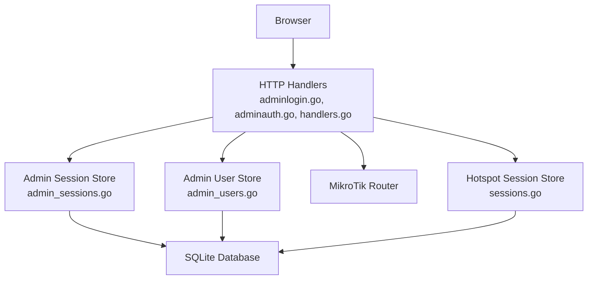

**Diagram sources**
- [adminlogin.go:35-77](file://handlers/adminlogin.go#L35-L77)
- [adminlogin.go:97-153](file://handlers/adminlogin.go#L97-L153)
- [adminauth.go:18-68](file://handlers/adminauth.go#L18-L68)
- [handlers.go:546-625](file://handlers/handlers.go#L546-L625)
- [admin_sessions.go:23-50](file://database/admin_sessions.go#L23-L50)
- [admin_users.go:204-291](file://database/admin_users.go#L204-L291)
- [sessions.go:101-178](file://database/sessions.go#L101-L178)

**Section sources**
- [adminlogin.go:35-77](file://handlers/adminlogin.go#L35-L77)
- [adminlogin.go:97-153](file://handlers/adminlogin.go#L97-L153)
- [adminauth.go:18-68](file://handlers/adminauth.go#L18-L68)
- [handlers.go:546-625](file://handlers/handlers.go#L546-L625)
- [admin_sessions.go:23-50](file://database/admin_sessions.go#L23-L50)
- [admin_users.go:204-291](file://database/admin_users.go#L204-L291)
- [sessions.go:101-178](file://database/sessions.go#L101-L178)

## Core Components

### Admin Panel Session Lifecycle
The admin panel uses a cookie named after the application to carry a session token. On successful login:

1. Credentials are verified against the stored PBKDF2-HMAC-SHA256 hash.
2. A 32-byte token is generated from a cryptographically secure random source.
3. Only the SHA-256 hash of the token is stored in SQLite.
4. The raw token is returned to the caller and set into an HttpOnly, SameSite=Lax cookie.
5. Subsequent requests resolve the cookie token to a user by matching its hash.
6. Logout deletes the server-side session record and clears the cookie.
7. Password changes revoke all active sessions for that user.

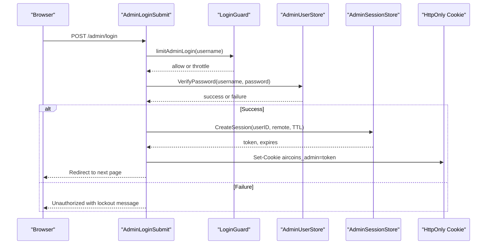

**Diagram sources**
- [adminlogin.go:35-77](file://handlers/adminlogin.go#L35-L77)
- [adminauth.go:70-92](file://handlers/adminauth.go#L70-L92)
- [admin_sessions.go:23-50](file://database/admin_sessions.go#L23-L50)
- [admin_users.go:293-328](file://database/admin_users.go#L293-L328)

**Section sources**
- [adminlogin.go:35-77](file://handlers/adminlogin.go#L35-L77)
- [adminauth.go:70-92](file://handlers/adminauth.go#L70-L92)
- [admin_sessions.go:23-50](file://database/admin_sessions.go#L23-L50)
- [admin_users.go:293-328](file://database/admin_users.go#L293-L328)

### Hotspot Client Session Lifecycle
Hotspot sessions represent active MikroTik hotspot clients. They are tracked locally so the controller can show history and control behavior even if the router API is temporarily unavailable.

Key operations:

- **Registration**: insert or upsert a live session.
- **Sync**: reconcile local state with router-reported active sessions.
- **Closing**: mark a session ended by operator action, voucher exhaustion, or device disconnect.
- **Listing and counting**: support dashboard and history views.
- **Pruning**: delete closed sessions older than a cutoff.

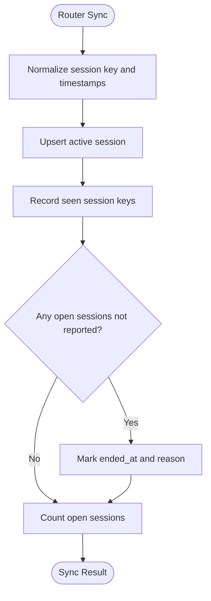

**Diagram sources**
- [sessions.go:101-178](file://database/sessions.go#L101-L178)

**Section sources**
- [sessions.go:101-178](file://database/sessions.go#L101-L178)
- [sessions.go:180-246](file://database/sessions.go#L180-L246)
- [sessions.go:377-386](file://database/sessions.go#L377-L386)

## Architecture Overview
The session architecture separates concerns across three layers:

1. **HTTP middleware and handlers**: enforce CSRF protection, manage cookies, validate credentials, and apply login throttling.
2. **Database session stores**: generate tokens, persist hashed tokens, resolve sessions, prune expired records, and invalidate sessions on sensitive account changes.
3. **Hotspot session store**: maintain operational visibility into active network sessions independent of admin authentication.

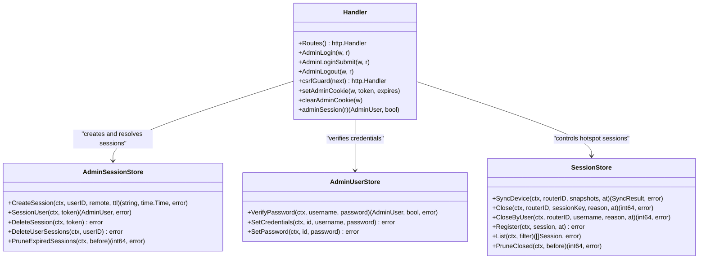

**Diagram sources**
- [handlers.go:234-303](file://handlers/handlers.go#L234-L303)
- [handlers.go:546-625](file://handlers/handlers.go#L546-L625)
- [adminlogin.go:112-153](file://handlers/adminlogin.go#L112-L153)
- [admin_sessions.go:23-123](file://database/admin_sessions.go#L23-L123)
- [admin_users.go:204-291](file://database/admin_users.go#L204-L291)
- [sessions.go:101-386](file://database/sessions.go#L101-L386)

## Detailed Component Analysis

### Cryptographically Secure 32-Byte Token Generation
Admin session tokens are generated as follows:

- A 32-byte buffer is allocated.
- Bytes are filled using `crypto/rand`, which provides a cryptographically secure random number generator.
- The raw bytes are encoded with URL-safe base64 without padding.
- Only the SHA-256 hash of the token is inserted into the `admin_sessions` table.
- The raw token is returned to the caller and placed into the session cookie.

This design ensures that even if the SQLite database is copied or exfiltrated, it cannot be replayed as a set of valid logins because only hashes are stored.

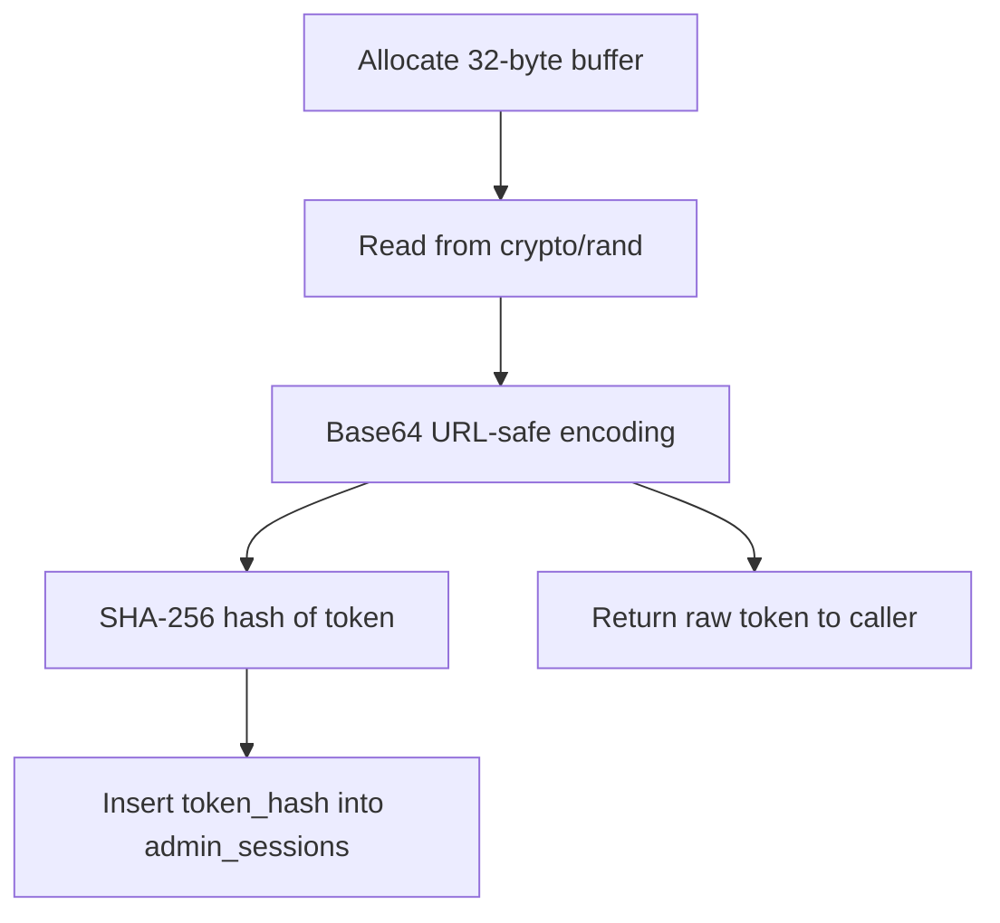

**Diagram sources**
- [admin_sessions.go:23-50](file://database/admin_sessions.go#L23-L50)

**Section sources**
- [admin_sessions.go:23-50](file://database/admin_sessions.go#L23-L50)

### HttpOnly Cookie Configuration and CSRF Protection
The admin session cookie is configured with:

- **Name**: application-specific session cookie name.
- **Path**: `/`.
- **Expires and MaxAge**: derived from the session expiry time.
- **HttpOnly**: true, preventing JavaScript access.
- **SameSite**: `Lax`, allowing top-level GET navigations while mitigating cross-site request forgery.
- **Secure**: controlled by configuration; enables HTTPS-only transmission when enabled.

CSRF protection is implemented separately through a double-submit cookie pattern:

- A separate CSRF cookie holds a random token.
- Forms submit a matching `csrf_token` field.
- The server compares them using constant-time comparison.
- State-changing admin routes require the CSRF token; captive portal and machine API routes are intentionally exempt.

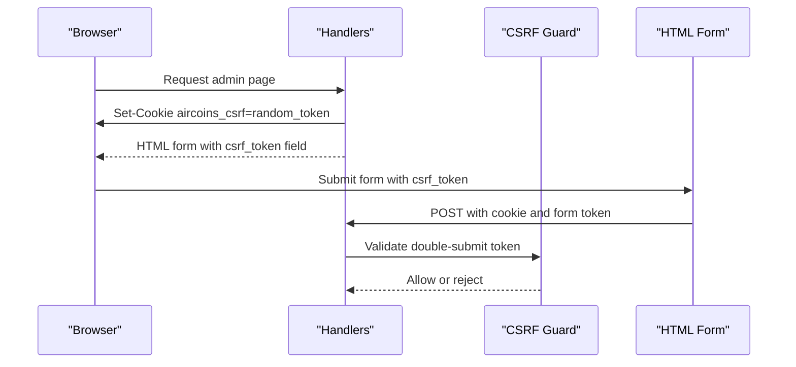

**Diagram sources**
- [handlers.go:546-625](file://handlers/handlers.go#L546-L625)
- [adminlogin.go:112-140](file://handlers/adminlogin.go#L112-L140)

**Section sources**
- [adminlogin.go:112-140](file://handlers/adminlogin.go#L112-L140)
- [handlers.go:546-625](file://handlers/handlers.go#L546-L625)

### Session Creation Flow
On successful admin login:

1. The login form is parsed.
2. Rate limiting checks whether the IP and account are allowed to proceed.
3. Credentials are verified.
4. On success, the login guard clears previous failures.
5. A session is created with the configured TTL.
6. The session cookie is set.
7. The browser is redirected to a sanitized next path.

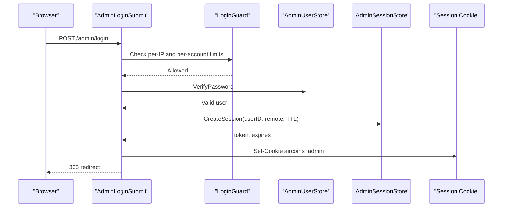

**Diagram sources**
- [adminlogin.go:35-77](file://handlers/adminlogin.go#L35-L77)
- [adminauth.go:70-92](file://handlers/adminauth.go#L70-L92)
- [admin_sessions.go:23-50](file://database/admin_sessions.go#L23-L50)

**Section sources**
- [adminlogin.go:35-77](file://handlers/adminlogin.go#L35-L77)
- [adminauth.go:70-92](file://handlers/adminauth.go#L70-L92)
- [admin_sessions.go:23-50](file://database/admin_sessions.go#L23-L50)

### Session Validation Flow
Every protected admin route goes through authentication:

1. The handler reads the session cookie.
2. If missing or empty, the request is unauthenticated.
3. The token is hashed and looked up in the session table.
4. If expired, the session is deleted and treated as unknown.
5. If valid, `last_seen` is updated.
6. The associated admin user is resolved.

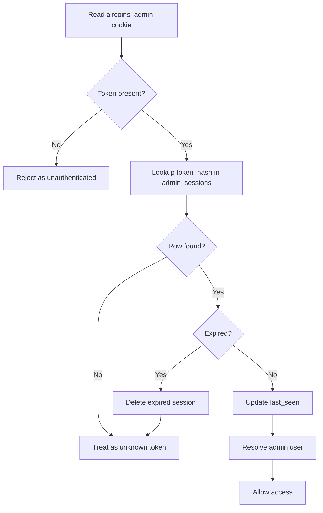

**Diagram sources**
- [adminlogin.go:142-153](file://handlers/adminlogin.go#L142-L153)
- [admin_sessions.go:53-82](file://database/admin_sessions.go#L53-L82)

**Section sources**
- [adminlogin.go:142-153](file://handlers/adminlogin.go#L142-L153)
- [admin_sessions.go:53-82](file://database/admin_sessions.go#L53-L82)

### Session Expiration and Cleanup
Expiration and cleanup occur in multiple places:

- **On validation**: expired sessions are pruned automatically during lookup.
- **Explicit pruning**: a helper deletes sessions expired before a cutoff.
- **Default TTL**: the default admin session TTL is 12 hours.
- **Configuration override**: the handler configuration defaults to 12 hours if unset.

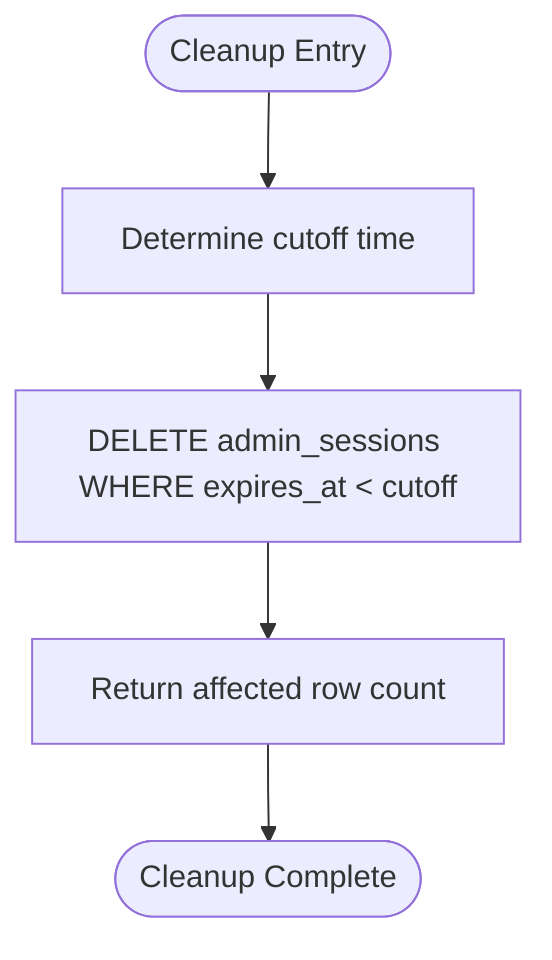

**Diagram sources**
- [admin_sessions.go:110-123](file://database/admin_sessions.go#L110-L123)
- [handlers.go:124-126](file://handlers/handlers.go#L124-L126)
- [admin_users.go:32-34](file://database/admin_users.go#L32-L34)

**Section sources**
- [admin_sessions.go:110-123](file://database/admin_sessions.go#L110-L123)
- [handlers.go:124-126](file://handlers/handlers.go#L124-L126)
- [admin_users.go:32-34](file://database/admin_users.go#L32-L34)

### Logout and Session Invalidation
Logout performs both client-side and server-side cleanup:

1. The session cookie is read.
2. The corresponding session record is deleted from the database.
3. The cookie is cleared by setting `MaxAge=-1`.
4. The browser is redirected to the captive portal home path.

Password changes also invalidate sessions:

- Changing the operator credentials revokes every existing session for that user.
- Setting a new password explicitly revokes sessions to prevent stolen cookies from remaining valid after credential rotation.

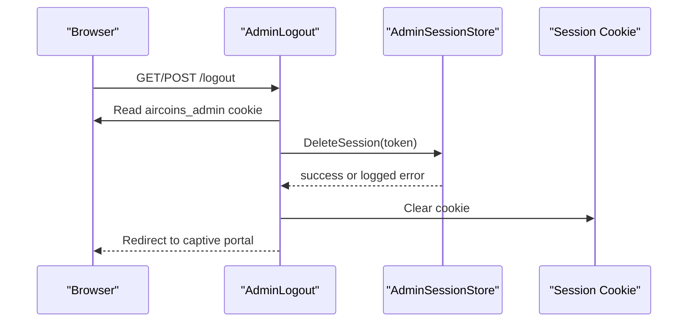

**Diagram sources**
- [adminlogin.go:97-110](file://handlers/adminlogin.go#L97-L110)
- [admin_sessions.go:84-92](file://database/admin_sessions.go#L84-L92)
- [admin_users.go:204-291](file://database/admin_users.go#L204-L291)

**Section sources**
- [adminlogin.go:97-110](file://handlers/adminlogin.go#L97-L110)
- [admin_sessions.go:84-92](file://database/admin_sessions.go#L84-L92)
- [admin_users.go:204-291](file://database/admin_users.go#L204-L291)

### Hotspot Session Storage and Concurrency
Hotspot sessions are stored in SQLite under an `active_sessions` table. Concurrency is handled through:

- **Transactions**: device sync runs inside a transaction to keep inserts, updates, and stale-session closures consistent.
- **Context-aware execution**: all queries use context-aware methods.
- **Atomic upserts**: existing sessions are refreshed rather than duplicated.
- **Stale detection**: sessions no longer reported by the router are marked closed.

Memory management characteristics:

- Query results are scanned row by row and appended to slices.
- Rows are closed after iteration.
- Filters include limit and offset to avoid loading entire histories into memory.
- Closed sessions are pruned by age to prevent unbounded growth.

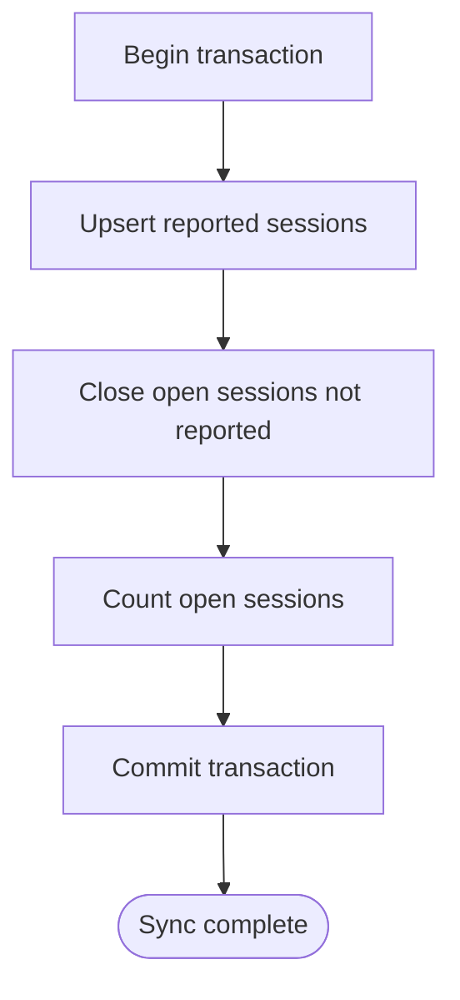

**Diagram sources**
- [sessions.go:101-178](file://database/sessions.go#L101-L178)

**Section sources**
- [sessions.go:101-178](file://database/sessions.go#L101-L178)
- [sessions.go:248-269](file://database/sessions.go#L248-L269)
- [sessions.go:377-386](file://database/sessions.go#L377-L386)

### Security Considerations

#### Session Fixation Prevention
Session fixation is mitigated by:

- Generating a fresh 32-byte token on each successful login.
- Storing only the SHA-256 hash of the token in the database.
- Replacing any previously captured token with a new one after re-authentication.
- Using HttpOnly cookies to reduce exposure to client-side scripts.
- Using SameSite=Lax to reduce cross-site request forgery risk.

#### Timeout Policies
- Default admin session TTL is 12 hours.
- TTL can be overridden via handler configuration.
- Expired sessions are cleaned up during validation and through explicit pruning.

#### Proper Session Invalidation
- Logout deletes the specific session record and clears the cookie.
- Password changes revoke all sessions for the affected user.
- Credential changes ensure that a stolen cookie cannot remain valid after the operator rotates their password.

#### CSRF Protection
- Double-submit cookie pattern protects state-changing admin routes.
- Captive portal and machine API endpoints are intentionally exempt because they do not rely on admin cookies.
- Constant-time comparison prevents timing-based token leakage.

**Section sources**
- [admin_sessions.go:23-50](file://database/admin_sessions.go#L23-L50)
- [adminlogin.go:112-153](file://handlers/adminlogin.go#L112-L153)
- [handlers.go:546-625](file://handlers/handlers.go#L546-L625)
- [admin_users.go:204-291](file://database/admin_users.go#L204-L291)

## Dependency Analysis
The following diagram shows how session-related components depend on each other:

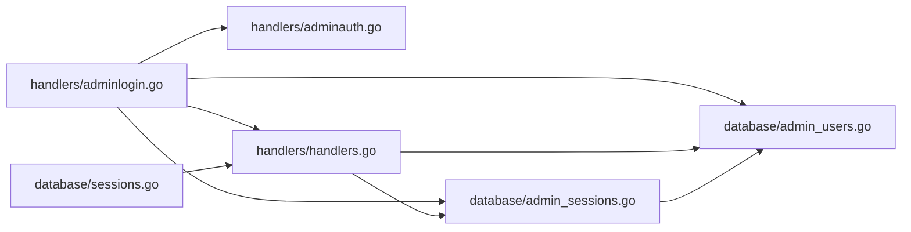

**Diagram sources**
- [adminlogin.go:35-77](file://handlers/adminlogin.go#L35-L77)
- [adminauth.go:18-68](file://handlers/adminauth.go#L18-L68)
- [handlers.go:234-303](file://handlers/handlers.go#L234-L303)
- [admin_sessions.go:23-123](file://database/admin_sessions.go#L23-L123)
- [admin_users.go:204-291](file://database/admin_users.go#L204-L291)
- [sessions.go:101-386](file://database/sessions.go#L101-L386)

**Section sources**
- [adminlogin.go:35-77](file://handlers/adminlogin.go#L35-L77)
- [adminauth.go:18-68](file://handlers/adminauth.go#L18-L68)
- [handlers.go:234-303](file://handlers/handlers.go#L234-L303)
- [admin_sessions.go:23-123](file://database/admin_sessions.go#L23-L123)
- [admin_users.go:204-291](file://database/admin_users.go#L204-L291)
- [sessions.go:101-386](file://database/sessions.go#L101-L386)

## Performance Considerations
- **Token generation**: 32-byte cryptographic random generation is lightweight and appropriate for per-login use.
- **Hashing overhead**: SHA-256 hashing of tokens is inexpensive compared to password verification.
- **Password verification**: PBKDF2 with a high iteration count adds intentional cost to resist brute-force attacks.
- **Session lookup**: Each authenticated request performs a single hashed token lookup and optional `last_seen` update.
- **Hotspot sync**: Uses transactions and batched upserts to keep local state consistent with router reports.
- **Pagination**: Session history uses limit and offset to avoid loading large result sets.
- **Cleanup**: Pruning expired admin sessions and closed hotspot sessions prevents unbounded database growth.

[No sources needed since this section provides general guidance]

## Troubleshooting Guide

### Admin Cannot Log In After Password Change
If an operator changes their password, all existing sessions are revoked. Symptoms include immediate logout or inability to stay signed in.

Resolution:

- Sign in again after changing the password.
- Confirm that the new password meets the minimum length requirement.
- Check that the session cookie is being set and not blocked by browser settings.

**Section sources**
- [admin_users.go:204-291](file://database/admin_users.go#L204-L291)

### Session Expires Too Quickly
Symptoms include frequent redirects to the login page.

Check:

- Whether `AdminSessionTTL` is configured correctly.
- Whether the default 12-hour TTL is being applied.
- Whether the server clock is correct, since expiration depends on current time.

**Section sources**
- [handlers.go:124-126](file://handlers/handlers.go#L124-L126)
- [admin_users.go:32-34](file://database/admin_users.go#L32-L34)
- [admin_sessions.go:28-42](file://database/admin_sessions.go#L28-L42)

### CSRF Errors on Admin Forms
Symptoms include forbidden responses when submitting admin forms.

Causes:

- Missing or mismatched CSRF token.
- Stale CSRF cookie.
- Attempting to submit a state-changing request without a valid double-submit token.

Resolution:

- Reload the admin page to obtain a fresh CSRF token.
- Ensure cookies are enabled.
- Do not reuse old CSRF tokens across different pages or sessions.

**Section sources**
- [handlers.go:546-625](file://handlers/handlers.go#L546-L625)

### Hotspot Sessions Not Closing
Symptoms include stale hotspot sessions appearing in the dashboard.

Likely causes:

- Router API connection lost.
- Device reboot without proper session reporting.
- Local sync not yet run.

Resolution:

- Refresh the router view to trigger session synchronization.
- Use operator disconnect actions where available.
- Allow the sync process to close sessions no longer reported by the router.

**Section sources**
- [sessions.go:101-178](file://database/sessions.go#L101-L178)
- [sessions.go:180-246](file://database/sessions.go#L180-L246)

## Conclusion
The session management system combines strong cryptographic token generation, secure cookie configuration, and robust server-side session storage. Admin sessions are protected by hashed token persistence, expiration handling, logout revocation, and password-change invalidation. CSRF protection is enforced through a double-submit cookie mechanism for administrative state changes. Hotspot session tracking provides resilient local state synchronized with router activity. Together, these components provide a secure, configurable, and maintainable session model suitable for an embedded network controller environment.

[No sources needed since this section summarizes without analyzing specific files]