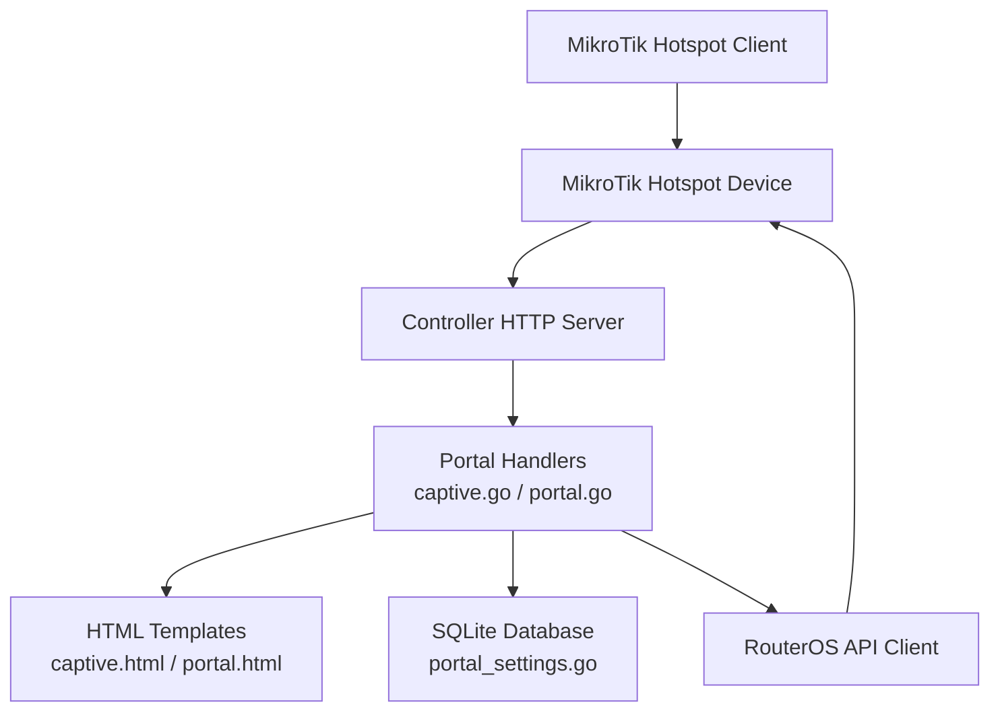
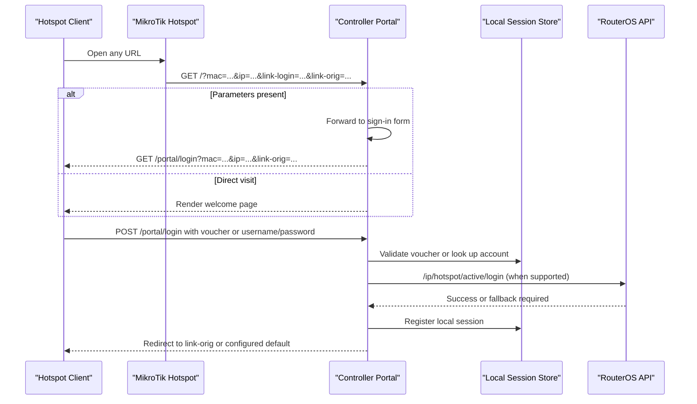
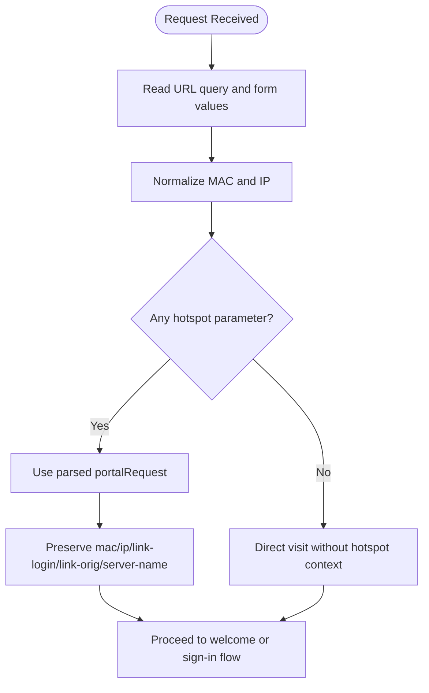
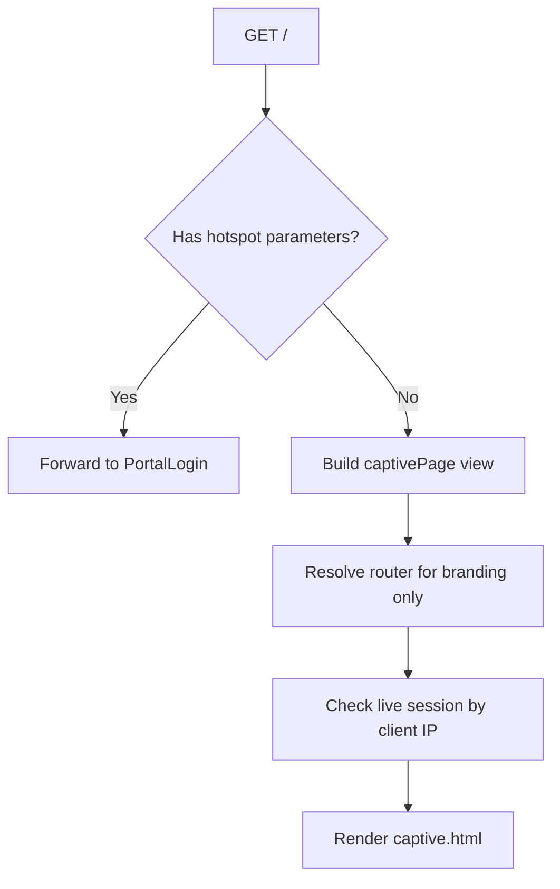
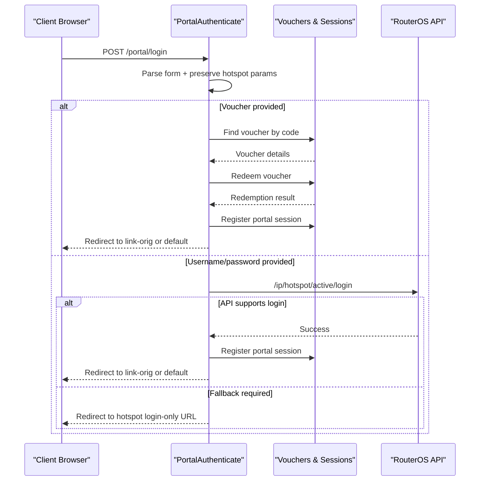
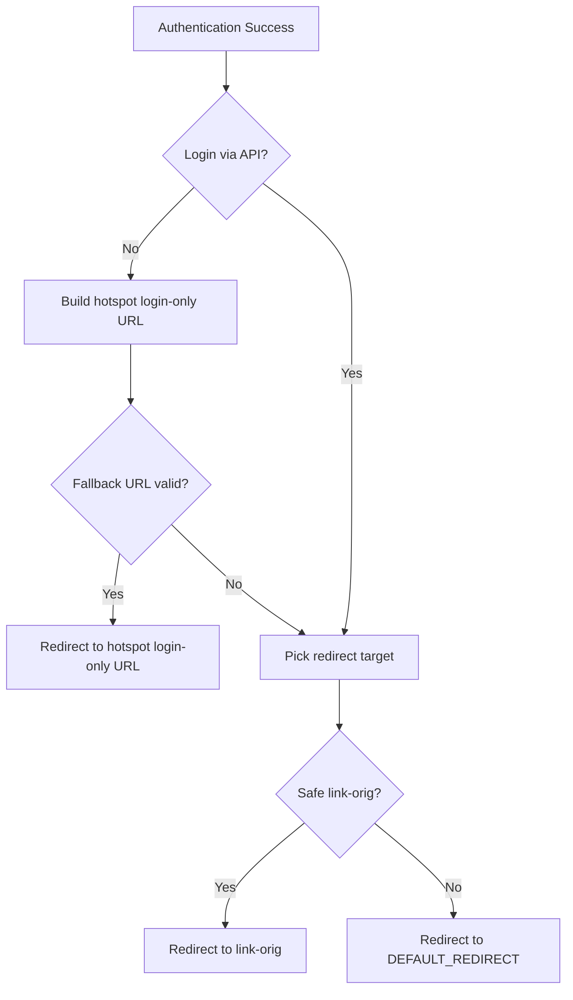
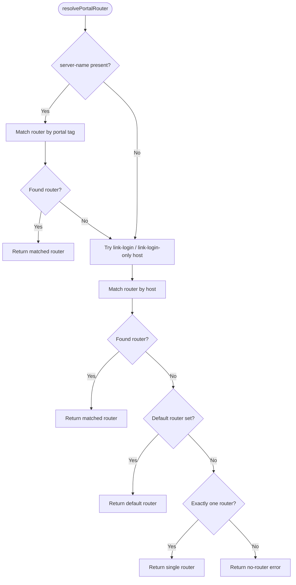
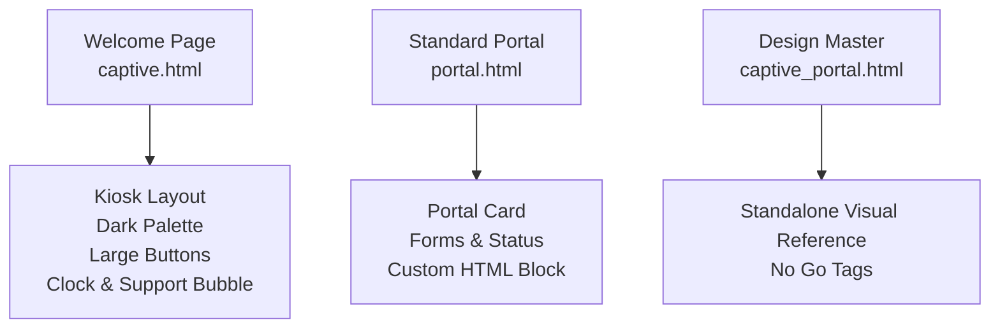
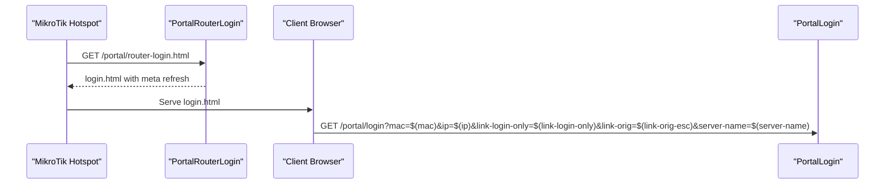
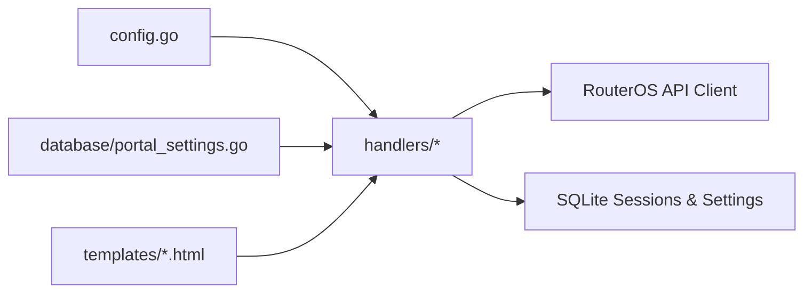

# Captive Portal

<cite>
**Referenced Files in This Document**
- [README.md](file://README.md)
- [config.go](file://config.go)
- [handlers/captive.go](file://handlers/captive.go)
- [handlers/portal.go](file://handlers/portal.go)
- [handlers/portal_fullpage.go](file://handlers/portal_fullpage.go)
- [handlers/portal_router_page.go](file://handlers/portal_router_page.go)
- [database/portal_settings.go](file://database/portal_settings.go)
- [templates/captive.html](file://templates/captive.html)
- [templates/captive_portal.html](file://templates/captive_portal.html)
- [templates/portal.html](file://templates/portal.html)
</cite>

## Table of Contents
1. [Introduction](#introduction)
2. [Project Structure](#project-structure)
3. [Core Components](#core-components)
4. [Architecture Overview](#architecture-overview)
5. [Detailed Component Analysis](#detailed-component-analysis)
6. [Dependency Analysis](#dependency-analysis)
7. [Performance Considerations](#performance-considerations)
8. [Troubleshooting Guide](#troubleshooting-guide)
9. [Conclusion](#conclusion)

## Introduction
This document explains the captive portal functionality that sits between MikroTik hotspot clients and the controller. It covers:
- How the portal receives and preserves MikroTik redirect parameters such as `mac`, `ip`, `link-login`, `link-login-only`, `link-orig`, `server-name`, and related fields.
- The sign-in flow for voucher codes and hotspot username/password pairs.
- Voucher redemption, session registration, and post-login redirection.
- Portal customization through branding, taglines, support text, theme selection, background images, custom HTML, and full-page operator templates.
- Mobile-responsive design, template structure, and the relationship between the kiosk landing page and the standard portal layout.
- Router resolution logic when a request arrives without an explicit router identifier.
- Deployment guidance, SSL configuration, and troubleshooting steps for portal connectivity.

The portal is intentionally public: guests can reach `/` (the welcome page), `/portal/login`, `/portal/status`, and `/healthz` without operator authentication. The operator panel lives under `/admin`.

**Section sources**
- [README.md:1-49](file://README.md#L1-L49)

## Project Structure
The captive portal spans handlers, templates, database settings, and environment configuration:

**Diagram sources**
- [handlers/captive.go:95-153](file://handlers/captive.go#L95-L153)
- [handlers/portal.go:85-194](file://handlers/portal.go#L85-L194)
- [database/portal_settings.go:140-173](file://database/portal_settings.go#L140-L173)
- [templates/captive.html:1-10](file://templates/captive.html#L1-L10)
- [templates/portal.html:1-10](file://templates/portal.html#L1-L10)

**Section sources**
- [README.md:197-205](file://README.md#L197-L205)
- [handlers/captive.go:95-153](file://handlers/captive.go#L95-L153)
- [handlers/portal.go:85-194](file://handlers/portal.go#L85-L194)

## Core Components
The captive portal has two main entry points:
- Welcome page at `/`: shows a branded landing page, detects whether the device is already online, and offers voucher or coin-based access.
- Sign-in page at `/portal/login`: renders the login form with preserved hotspot parameters and processes voucher or username/password submissions.

Key responsibilities:
- Parse and normalize MikroTik redirect parameters.
- Resolve which registered router owns the request.
- Authenticate via voucher or hotspot credentials.
- Register local sessions and redirect to the original destination.
- Render either the built-in portal layout or an operator-provided full page.

**Section sources**
- [handlers/captive.go:10-49](file://handlers/captive.go#L10-L49)
- [handlers/portal.go:19-37](file://handlers/portal.go#L19-L37)
- [handlers/portal.go:85-194](file://handlers/portal.go#L85-L194)

## Architecture Overview
The portal integrates tightly with MikroTik’s redirect mechanism. A client connects to Wi-Fi, opens any website, and the hotspot redirects it to the controller with query parameters. The controller then decides whether to show the welcome page, the sign-in form, or a success redirect.

**Diagram sources**
- [handlers/captive.go:102-153](file://handlers/captive.go#L102-L153)
- [handlers/portal.go:85-194](file://handlers/portal.go#L85-L194)
- [handlers/mikrotik.go:948-974](file://handlers/mikrotik.go#L948-L974)

**Section sources**
- [README.md:167-185](file://README.md#L167-L185)
- [handlers/captive.go:102-153](file://handlers/captive.go#L102-L153)
- [handlers/portal.go:85-194](file://handlers/portal.go#L85-L194)

## Detailed Component Analysis

### MikroTik Redirect Parameter Handling
The portal captures hotspot variables from both the query string and the submitted form. Normalization ensures MAC addresses and IP addresses are consistent before use.

Important fields:
- `mac`: normalized hardware address.
- `ip`: normalized client IP.
- `username`: optional hotspot username.
- `link-login`: base login URL used by MikroTik.
- `link-login-only`: login-only endpoint used when the controller cannot authenticate directly.
- `link-orig`: original destination after successful login.
- `server-name`: router identifier used for router resolution; falls back to `nasid`.
- `error`: error message returned by the hotspot.
- `chap-id` and `chap-challenge`: challenge-response fields carried through.

**Diagram sources**
- [handlers/portal.go:19-63](file://handlers/portal.go#L19-L63)

**Section sources**
- [handlers/portal.go:19-63](file://handlers/portal.go#L19-L63)

### Welcome Page Flow
The root path serves the captive portal welcome page. If the request includes hotspot parameters, the handler forwards directly to the sign-in form so the handshake remains intact. Otherwise, it renders a branded landing page that may greet an already-online device.

Behavior highlights:
- Hotspot redirects bypass the welcome page and go straight to `/portal/login`.
- The welcome page checks active sessions by client IP and displays connection status when available.
- Branding, tagline, support text, admin path, and coin state are included.
- Router name is resolved for display but does not block rendering if unknown.

**Diagram sources**
- [handlers/captive.go:95-153](file://handlers/captive.go#L95-L153)

**Section sources**
- [handlers/captive.go:95-153](file://handlers/captive.go#L95-L153)

### Sign-In Flow and Authentication
The sign-in page handles both voucher redemption and hotspot username/password authentication.

Voucher path:
- Look up the voucher code.
- Ensure it belongs to the current router when scoped.
- Redeem the voucher and register a local session.
- Redirect to `link-orig` or the configured default.

Password path:
- Call the RouterOS API to log the client in.
- If the API rejects the command, fall back to redirecting the browser to the hotspot’s login-only URL with credentials appended.
- Register a local session on success.

**Diagram sources**
- [handlers/portal.go:116-194](file://handlers/portal.go#L116-L194)
- [handlers/mikrotik.go:948-974](file://handlers/mikrotik.go#L948-L974)

**Section sources**
- [handlers/portal.go:116-194](file://handlers/portal.go#L116-L194)
- [handlers/mikrotik.go:948-974](file://handlers/mikrotik.go#L948-L974)

### Post-Login Redirection and Fallback
After authentication, the portal chooses where to send the client:
- If direct API login was not used, build a MikroTik login-only URL with `username`, `password`, `dst`, `ip`, and `mac`.
- Otherwise, pick `link-orig` if safe, or fall back to the configured `DEFAULT_REDIRECT`.
- Only absolute `http` or `https` URLs are accepted, preventing open redirects.

**Diagram sources**
- [handlers/portal.go:306-402](file://handlers/portal.go#L306-L402)

**Section sources**
- [handlers/portal.go:306-402](file://handlers/portal.go#L306-L402)

### Router Resolution Logic
When a request arrives, the portal must decide which registered router it belongs to. The resolution order is:
1. Match `server-name` against a router’s portal tag.
2. Extract the host from `link-login` or `link-login-only` and match it against a registered device address.
3. Use the router marked as the default portal.
4. Use the single registered router when exactly one exists.
5. Return an error if no router can be determined.

**Diagram sources**
- [handlers/portal.go:404-451](file://handlers/portal.go#L404-L451)

**Section sources**
- [handlers/portal.go:404-451](file://handlers/portal.go#L404-L451)

### Portal Customization Options
The portal supports several customization layers:

Environment-level branding:
- `PORTAL_NAME`: brand name shown in UI and portal.
- `PORTAL_TAGLINE`: welcome line on the landing page.
- `PORTAL_SUPPORT`: contact/help line on the landing page.
- `ADMIN_PATH`: operator panel prefix.
- `DEFAULT_REDIRECT`: fallback destination when `link-orig` is absent.
- `SECURE_COOKIES`: enable secure cookies behind HTTPS.

Operator-level portal settings:
- Theme selection among predefined themes.
- Header name override.
- Custom HTML block inside the standard layout.
- Background image stored in the database.
- Full-page mode allowing an operator-authored complete HTML document.

These options are persisted in the `portal_settings` table and loaded during portal rendering.

**Section sources**
- [config.go:20-76](file://config.go#L20-L76)
- [database/portal_settings.go:12-67](file://database/portal_settings.go#L12-L67)
- [database/portal_settings.go:140-173](file://database/portal_settings.go#L140-L173)
- [database/portal_settings.go:201-285](file://database/portal_settings.go#L201-L285)

### Template Structure and Mobile-Responsive Design
There are three relevant template families:

- `captive.html`: the kiosk-style welcome page served at `/`. It uses a dark, high-contrast palette, large tap targets, responsive media queries, and embedded JavaScript for the clock, support bubble, and coin interactions.
- `captive_portal.html`: a standalone design master mirroring the kiosk layout without Go template tags. It is intended for visual inspection and designer handoff.
- `portal.html`: the standard portal layout used for the sign-in form, success screen, and voucher/session information. It supports branding, custom HTML, and the coin tab.

Mobile responsiveness is achieved through:
- Viewport meta tags.
- Flexbox layouts.
- Media queries for narrow phones and landscape orientations.
- Reduced-motion preferences.
- Large touch-friendly buttons and inputs.

**Diagram sources**
- [templates/captive.html:1-10](file://templates/captive.html#L1-L10)
- [templates/captive.html:276-298](file://templates/captive.html#L276-L298)
- [templates/portal.html:1-10](file://templates/portal.html#L1-L10)
- [templates/captive_portal.html:1-25](file://templates/captive_portal.html#L1-L25)

**Section sources**
- [templates/captive.html:1-10](file://templates/captive.html#L1-L10)
- [templates/captive.html:276-298](file://templates/captive.html#L276-L298)
- [templates/portal.html:1-10](file://templates/portal.html#L1-L10)
- [templates/captive_portal.html:1-25](file://templates/captive_portal.html#L1-L25)

### Full-Page Operator Templates
When the operator enables full-page mode, their own HTML document replaces the built-in layout. The renderer:
- Compiles and caches the operator’s template once per source.
- Injects safe data such as portal name, MAC/IP, router name, login action, redirect target, success state, errors, notices, banner URL, admin path, version, and expiry information.
- Falls back to the built-in portal if compilation or rendering fails, ensuring guests never see a server-side template error.

Security model:
- The operator’s full HTML is trusted code executed in every guest’s browser.
- Data injected into the template is escaped.
- The Content-Security-Policy restricts remote scripts and styles.
- The form action and login URL are constructed by the controller, not authored by the operator page.

**Section sources**
- [handlers/portal_fullpage.go:14-59](file://handlers/portal_fullpage.go#L14-L59)
- [handlers/portal_fullpage.go:113-125](file://handlers/portal_fullpage.go#L113-L125)
- [handlers/portal_fullpage.go:146-197](file://handlers/portal_fullpage.go#L146-L197)
- [handlers/portal_fullpage.go:199-220](file://handlers/portal_fullpage.go#L199-L220)

### Relationship Between Portal and MikroTik Redirect Mechanism
The controller is designed to work with stock MikroTik hotspot behavior:
- The hotspot can point its login page at the controller while passing variables like `mac`, `ip`, `username`, `link-login`, `link-login-only`, `link-orig`, `server-name`, and `error`.
- The controller preserves these parameters across the sign-in round trip.
- When the controller cannot authenticate directly, it builds a fallback URL using `link-login-only` or `link-login`, appending credentials and the original destination.
- A helper route generates a minimal `login.html` file for routers that serve their own hotspot files, redirecting guests to the controller with essential parameters.

**Diagram sources**
- [handlers/portal_router_page.go:10-45](file://handlers/portal_router_page.go#L10-L45)
- [handlers/portal_router_page.go:47-86](file://handlers/portal_router_page.go#L47-L86)

**Section sources**
- [README.md:167-185](file://README.md#L167-L185)
- [handlers/portal_router_page.go:10-86](file://handlers/portal_router_page.go#L10-L86)
- [handlers/portal.go:354-382](file://handlers/portal.go#L354-L382)

## Dependency Analysis
The captive portal depends on:
- Environment configuration for branding, routing, timeouts, and security flags.
- SQLite database for portal settings, vouchers, sessions, and router metadata.
- RouterOS API client for hotspot authentication and session management.
- HTML templates for rendering the kiosk welcome page, standard portal, and optional full-page operator template.

**Diagram sources**
- [config.go:20-76](file://config.go#L20-L76)
- [database/portal_settings.go:185-189](file://database/portal_settings.go#L185-L189)
- [handlers/portal.go:85-194](file://handlers/portal.go#L85-L194)

**Section sources**
- [config.go:20-76](file://config.go#L20-L76)
- [database/portal_settings.go:185-189](file://database/portal_settings.go#L185-L189)
- [handlers/portal.go:85-194](file://handlers/portal.go#L85-L194)

## Performance Considerations
- The welcome page avoids heavy router resolution logging for operating-system captive-portal probes by separating probe handling from the main index.
- Full-page operator templates are compiled once and cached, reducing repeated parsing overhead.
- Redirect validation is lightweight and prevents expensive or unsafe redirects.
- Session lookup degrades gracefully when the database is unavailable, keeping the portal usable even under partial failure.

[No sources needed since this section provides general guidance]

## Troubleshooting Guide

Common issues and resolutions:

- **Hotspot redirects do not reach the portal:**
  - Verify the hotspot login page points to the controller and passes `mac`, `ip`, `link-login`, `link-login-only`, `link-orig`, and `server-name`.
  - Use the generated `login.html` helper when the router serves its own hotspot files.

- **Portal says “no hotspot router is linked”:**
  - Ensure the router is registered in the controller.
  - Provide `server-name` matching a router portal tag, or ensure `link-login` resolves to a registered host.
  - Set a default portal router when multiple routers exist.

- **Sign-in succeeds but the client is not redirected:**
  - Check that `link-orig` is a safe absolute `http` or `https` URL.
  - Configure `DEFAULT_REDIRECT` as a fallback.

- **Username/password login fails:**
  - Confirm the RouterOS API user has hotspot permissions.
  - Check network reachability and API timeout settings.
  - Some RouterOS builds require fallback to the hotspot login-only URL.

- **Portal works but branding looks wrong:**
  - Verify `PORTAL_NAME`, `PORTAL_TAGLINE`, and `PORTAL_SUPPORT`.
  - Check portal settings theme, header name, custom HTML, and background image.
  - If full-page mode is enabled, validate the operator’s HTML template.

- **SSL and cookie security:**
  - Place the controller behind HTTPS.
  - Enable `SECURE_COOKIES=1` when TLS is terminated by a reverse proxy.
  - Ensure `X-Forwarded-Proto` is correctly forwarded so the generated login URL uses HTTPS.

- **Connectivity diagnostics:**
  - Use `/portal/status` to verify portal availability and router resolution.
  - Add `?server-name=<name>` or `?link-login=<url>` to test router attribution.

**Section sources**
- [README.md:167-185](file://README.md#L167-L185)
- [handlers/portal.go:453-481](file://handlers/portal.go#L453-L481)
- [handlers/portal_router_page.go:88-110](file://handlers/portal_router_page.go#L88-L110)
- [config.go:40-46](file://config.go#L40-L46)

## Conclusion
The captive portal provides a robust bridge between MikroTik hotspot clients and the controller. It preserves critical redirect parameters, supports voucher and password authentication, registers local sessions, and safely redirects users to their original destination. Operators can customize branding, taglines, support text, themes, backgrounds, and even replace the entire portal layout. The mobile-first templates ensure a reliable experience on phones and kiosks, while router resolution logic adapts to different deployment sizes. With proper SSL configuration, correct hotspot wiring, and the diagnostic endpoints described here, the portal can operate reliably in production environments.

[No sources needed since this section summarizes without analyzing specific files]