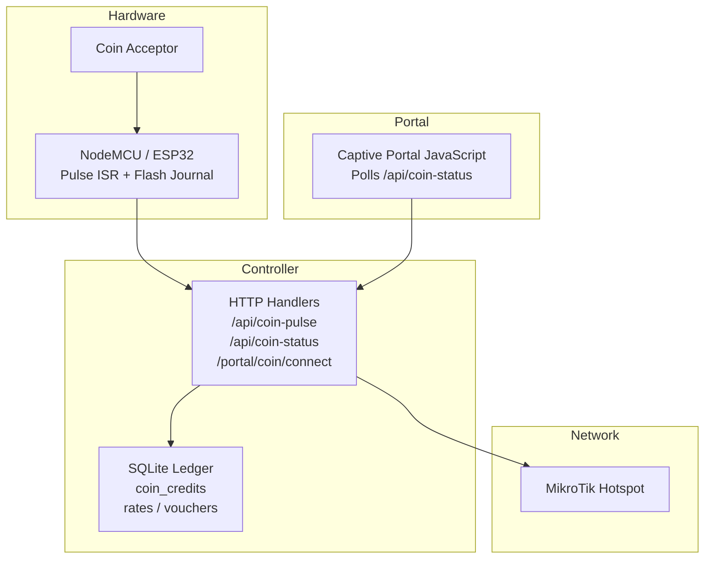
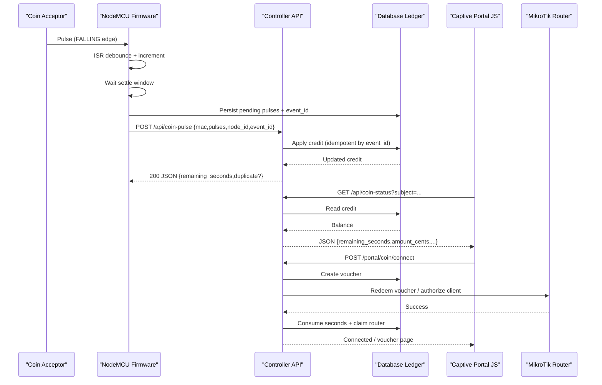
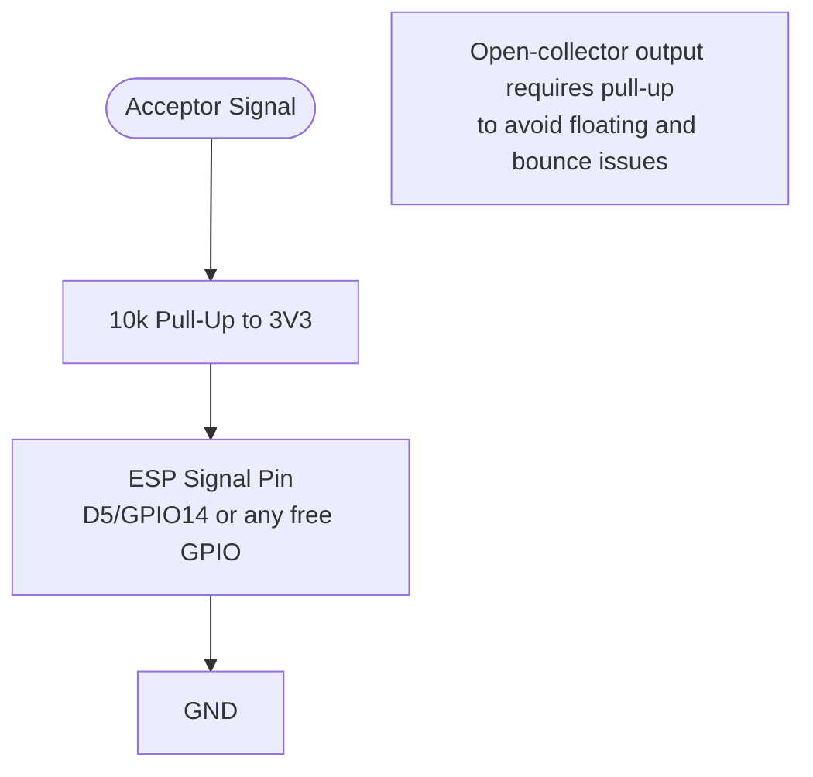
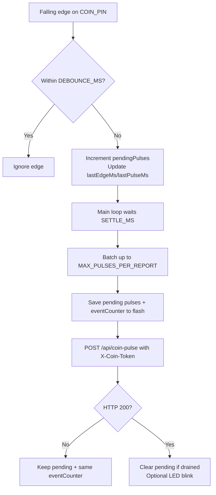
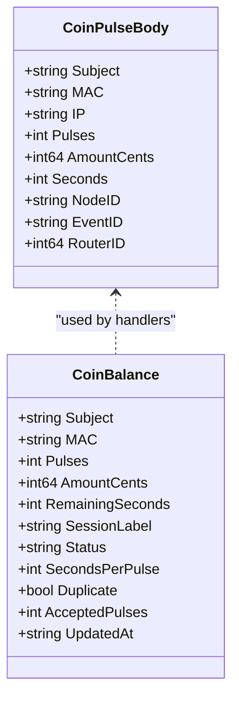
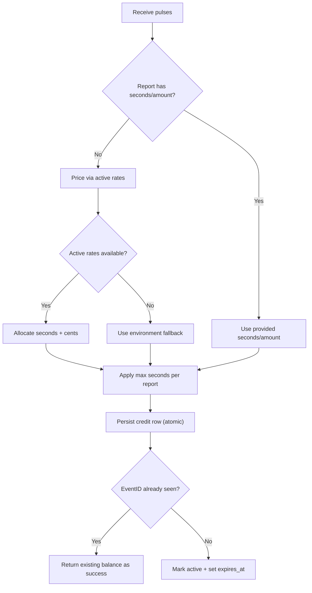
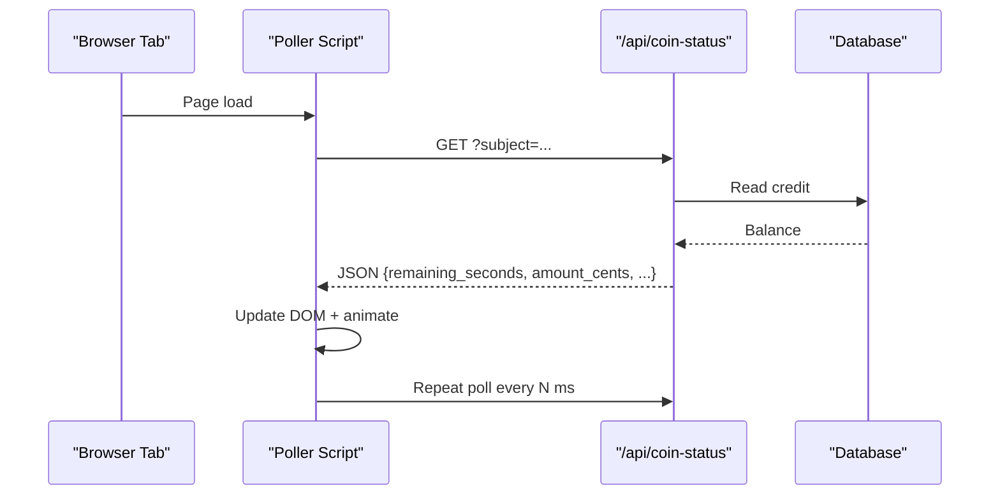
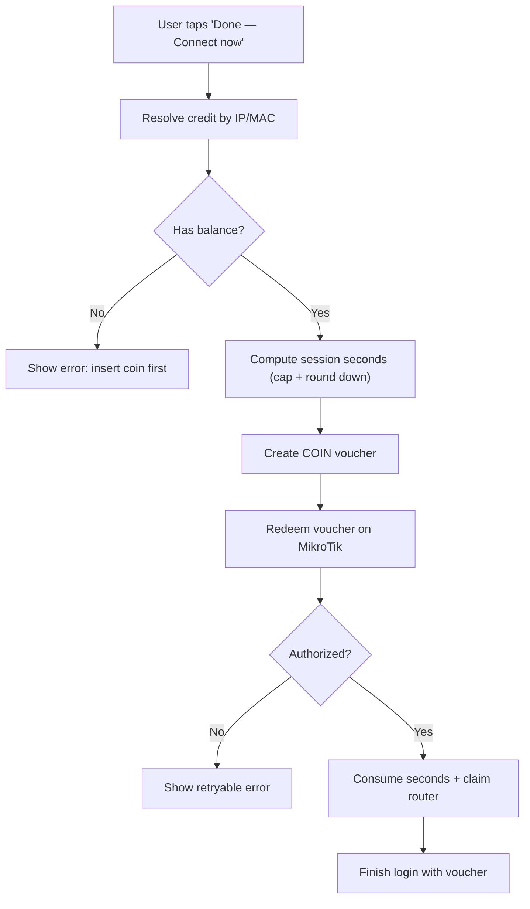
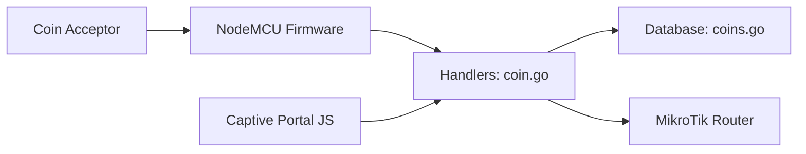

# Coin Slot Integration

<cite>
**Referenced Files in This Document**
- [README.md](file://hardware/nodemcu_coin_slot/README.md)
- [nodemcu_coin_slot.ino](file://hardware/nodemcu_coin_slot/nodemcu_coin_slot.ino)
- [coin.go](file://handlers/coin.go)
- [coins.go](file://database/coins.go)
- [captive_portal.html](file://templates/captive_portal.html)
</cite>

## Table of Contents
1. [Introduction](#introduction)
2. [Project Structure](#project-structure)
3. [Core Components](#core-components)
4. [Architecture Overview](#architecture-overview)
5. [Detailed Component Analysis](#detailed-component-analysis)
6. [Dependency Analysis](#dependency-analysis)
7. [Performance Considerations](#performance-considerations)
8. [Troubleshooting Guide](#troubleshooting-guide)
9. [Security Considerations](#security-considerations)
10. [Conclusion](#conclusion)

## Introduction
This document explains how physical coin insertion is turned into hotspot access time in the Aircoins MikroTik controller. It covers:
- The coin acceptor wiring and NodeMCU firmware behavior
- The HTTP protocol between the hardware and the web portal
- Credit allocation, de-duplication, idle expiry, and balance persistence
- Real-time balance updates in the captive portal
- The “Insert coin” tab and the final “Connect now” flow
- Wiring diagrams, configuration examples, troubleshooting, and security guidance

The system is designed so that a coin is never lost and never counted twice. Credits are stored durably, retries are idempotent, and money is only deducted after the router has successfully authorized the client.

## Project Structure
The coin slot integration spans four layers:
- Hardware firmware: ESP8266 / ESP32 sketch that counts pulses and reports them to the controller
- Web handlers: HTTP endpoints for pulse reporting, balance polling, and session activation
- Database layer: durable credit ledger, rate pricing, and voucher creation
- Captive portal UI: real-time balance display and user actions

**Diagram sources**
- [nodemcu_coin_slot.ino:1-64](file://hardware/nodemcu_coin_slot/nodemcu_coin_slot.ino#L1-L64)
- [coin.go:27-55](file://handlers/coin.go#L27-L55)
- [coins.go:120-149](file://database/coins.go#L120-L149)
- [captive_portal.html:344-534](file://templates/captive_portal.html#L344-L534)

**Section sources**
- [README.md:11-24](file://hardware/nodemcu_coin_slot/README.md#L11-L24)
- [coin.go:1-11](file://handlers/coin.go#L1-L11)

## Core Components
- NodeMCU firmware: Counts acceptor pulses using an interrupt handler, debounces edges, journals pending credits to flash, and POSTs batches with monotonic event IDs.
- Controller API: Authenticates hardware reports, prices pulses against configured rates, applies idempotent credit updates, exposes live balance, and converts balances into vouchers for hotspot login.
- Database ledger: Stores running totals of pulses, amount, granted seconds, used seconds, status, and last event ID; enforces caps and idle expiry.
- Captive portal: Polls the balance endpoint, animates changes, and posts “Connect now” to activate a session.

**Section sources**
- [nodemcu_coin_slot.ino:66-99](file://hardware/nodemcu_coin_slot/nodemcu_coin_slot.ino#L66-L99)
- [coin.go:115-220](file://handlers/coin.go#L115-L220)
- [coins.go:41-88](file://database/coins.go#L41-L88)
- [captive_portal.html:444-534](file://templates/captive_portal.html#L444-L534)

## Architecture Overview
The end-to-end flow is:
1. A coin closes the acceptor switch, generating a short pulse.
2. The NodeMCU ISR increments a counter and timestamps the edge.
3. After a settle window, the firmware writes pending pulses and a monotonic event ID to flash, then POSTs to `/api/coin-pulse`.
4. The controller authenticates the request, prices the pulses, and atomically applies the credit. Duplicate events are recognized and answered as success without double-counting.
5. The captive portal polls `/api/coin-status` to show updated time and inserted amount.
6. When the user taps “Done — Connect now”, the controller creates a voucher, provisions the client on MikroTik, and only then deducts the spent seconds from the balance.

**Diagram sources**
- [nodemcu_coin_slot.ino:210-234](file://hardware/nodemcu_coin_slot/nodemcu_coin_slot.ino#L210-L234)
- [nodemcu_coin_slot.ino:347-450](file://hardware/nodemcu_coin_slot/nodemcu_coin_slot.ino#L347-L450)
- [coin.go:123-220](file://handlers/coin.go#L123-L220)
- [coin.go:334-454](file://handlers/coin.go#L334-L454)
- [coins.go:149-223](file://database/coins.go#L149-L223)
- [captive_portal.html:476-516](file://templates/captive_portal.html#L476-L516)

## Detailed Component Analysis

### Coin Acceptor Wiring and Electrical Notes
- Most multi-coin acceptors close a switch contact for roughly 20–40 ms per pulse.
- Use an interrupt-driven input rather than polling `loop()`.
- Add a 10 kΩ pull-up between the signal pin and 3V3. Without it, the pin floats and coins may be double-counted or missed.
- For 5 V open-collector outputs, use a voltage divider (e.g., 1 kΩ to the pin and 2.2 kΩ to GND). Do not connect 5 V directly to the ESP pin.

**Diagram sources**
- [README.md:26-48](file://hardware/nodemcu_coin_slot/README.md#L26-L48)
- [nodemcu_coin_slot.ino:30-47](file://hardware/nodemcu_coin_slot/nodemcu_coin_slot.ino#L30-L47)

**Section sources**
- [README.md:26-48](file://hardware/nodemcu_coin_slot/README.md#L26-L48)
- [nodemcu_coin_slot.ino:30-47](file://hardware/nodemcu_coin_slot/nodemcu_coin_slot.ino#L30-L47)

### NodeMCU Firmware Configuration
Key configuration constants include:
- Shared token matching the controller’s `COIN_NODE_TOKEN`
- Controller host and port
- Wi-Fi SSID and password
- Client MAC (leave empty to credit the board’s own station MAC)
- Node ID for audit trails
- Coin signal pin
- Debounce window, batch size, settle delay, and Wi-Fi retry timing

Important behaviors:
- ISR increments a volatile counter and timestamps edges.
- Pending pulses and event ID are written to SPIFFS before sending.
- Only after a successful 200 response are pending pulses cleared.
- Every POST carries a monotonic event ID; duplicate responses are treated as already paid.
- Wi-Fi association is rate-limited to avoid radio hammering.

**Diagram sources**
- [nodemcu_coin_slot.ino:116-192](file://hardware/nodemcu_coin_slot/nodemcu_coin_slot.ino#L116-L192)
- [nodemcu_coin_slot.ino:210-234](file://hardware/nodemcu_coin_slot/nodemcu_coin_slot.ino#L210-L234)
- [nodemcu_coin_slot.ino:238-297](file://hardware/nodemcu_coin_slot/nodemcu_coin_slot.ino#L238-L297)
- [nodemcu_coin_slot.ino:347-450](file://hardware/nodemcu_coin_slot/nodemcu_coin_slot.ino#L347-L450)
- [nodemcu_coin_slot.ino:515-576](file://hardware/nodemcu_coin_slot/nodemcu_coin_slot.ino#L515-L576)

**Section sources**
- [nodemcu_coin_slot.ino:66-99](file://hardware/nodemcu_coin_slot/nodemcu_coin_slot.ino#L66-L99)
- [nodemcu_coin_slot.ino:116-192](file://hardware/nodemcu_coin_slot/nodemcu_coin_slot.ino#L116-L192)
- [nodemcu_coin_slot.ino:210-234](file://hardware/nodemcu_coin_slot/nodemcu_coin_slot.ino#L210-L234)
- [nodemcu_coin_slot.ino:238-297](file://hardware/nodemcu_coin_slot/nodemcu_coin_slot.ino#L238-L297)
- [nodemcu_coin_slot.ino:347-450](file://hardware/nodemcu_coin_slot/nodemcu_coin_slot.ino#L347-L450)
- [nodemcu_coin_slot.ino:515-576](file://hardware/nodemcu_coin_slot/nodemcu_coin_slot.ino#L515-L576)

### Communication Protocol Between Hardware and Web Portal
Endpoints:
- `POST /api/coin-pulse`: Hardware reports pulses. Requires header `X-Coin-Token`. Body includes `mac`, `pulses`, `node_id`, and `event_id`. Optional fields include `ip`, `amount_cents`, `seconds`, and `router_id`.
- `GET /api/coin-status`: Portal polls balance. Query parameter `subject` (or `mac`) identifies the client. Returns JSON with `remaining_seconds`, `amount_cents`, `session_label`, `status`, `seconds_per_pulse`, and `duplicate`.
- `POST /portal/coin/connect`: User activates a session. Converts the balance into a voucher and provisions the client on MikroTik.

Request/response shape:
- Hardware body: subject identity, pulse count, node identifier, and monotonic event ID.
- Status response: current balance, formatted session label, and metadata for the UI.
- Connect response: success view with voucher details and connection confirmation.

**Diagram sources**
- [coin.go:57-113](file://handlers/coin.go#L57-L113)

**Section sources**
- [coin.go:27-55](file://handlers/coin.go#L27-L55)
- [coin.go:57-113](file://handlers/coin.go#L57-L113)
- [coin.go:123-220](file://handlers/coin.go#L123-L220)
- [coin.go:222-263](file://handlers/coin.go#L222-L263)
- [coin.go:334-454](file://handlers/coin.go#L334-L454)

### Credit Allocation System
Credit allocation combines hardware reports with operator-configured pricing:
- If the report does not specify `seconds` or `amount_cents`, the controller prices pulses using active rate tiers.
- If no active tiers exist, environment fallback values (`COIN_SECONDS_PER_PULSE`, `COIN_CENTS_PER_PULSE`) are used.
- A cap prevents one report from granting excessive time.
- The database stores running totals of pulses, amount, granted seconds, used seconds, and status.
- Idle balances expire after a configurable TTL to prevent one device from holding another customer’s credit.

**Diagram sources**
- [coin.go:154-182](file://handlers/coin.go#L154-L182)
- [coin.go:265-298](file://handlers/coin.go#L265-L298)
- [coins.go:149-223](file://database/coins.go#L149-L223)
- [coins.go:321-348](file://database/coins.go#L321-L348)

**Section sources**
- [coin.go:154-182](file://handlers/coin.go#L154-L182)
- [coin.go:265-298](file://handlers/coin.go#L265-L298)
- [coins.go:41-88](file://database/coins.go#L41-L88)
- [coins.go:149-223](file://database/coins.go#L149-L223)
- [coins.go:321-348](file://database/coins.go#L321-L348)

### Real-Time Balance Updates
The captive portal JavaScript:
- Seeds initial values from server-rendered configuration.
- Polls `/api/coin-status` at a configurable interval.
- Animates changes to time and inserted amount.
- Enables the “Connect now” button when there is remaining time.
- Handles transient network failures by keeping the last known balance visible.

**Diagram sources**
- [captive_portal.html:344-386](file://templates/captive_portal.html#L344-L386)
- [captive_portal.html:444-534](file://templates/captive_portal.html#L444-L534)
- [coin.go:222-263](file://handlers/coin.go#L222-L263)

**Section sources**
- [captive_portal.html:344-386](file://templates/captive_portal.html#L344-L386)
- [captive_portal.html:444-534](file://templates/captive_portal.html#L444-L534)

### “Insert Coin” Tab Functionality
The “Insert coin” panel:
- Shows time bought and inserted amount.
- Provides hints based on balance state.
- Disables “Done — Connect now” until there is usable time.
- Scrolls into view when the user taps the main “Insert coin” action.

When the user clicks “Done — Connect now”:
- The controller resolves the credit for the current request (by IP or MAC).
- It computes the session duration (whole minutes, capped).
- It creates a voucher with a unique code and notes linking back to the coin slot.
- It attempts to redeem the voucher on MikroTik.
- Only after successful authorization does it consume the balance and attribute the credit to the router.

**Diagram sources**
- [captive_portal.html:297-323](file://templates/captive_portal.html#L297-L323)
- [coin.go:334-454](file://handlers/coin.go#L334-L454)
- [coin.go:456-549](file://handlers/coin.go#L456-L549)

**Section sources**
- [captive_portal.html:297-323](file://templates/captive_portal.html#L297-L323)
- [coin.go:334-454](file://handlers/coin.go#L334-L454)
- [coin.go:456-549](file://handlers/coin.go#L456-L549)

## Dependency Analysis
The coin slot integration depends on:
- Hardware: coin acceptor producing short pulses
- Firmware: ESP8266/ESP32 sketch with interrupt handling, flash journaling, and HTTP client
- Controller: Go handlers for authentication, pricing, and session provisioning
- Database: SQLite-backed credit ledger and rate/voucher tables
- Network: MikroTik hotspot for session enforcement

**Diagram sources**
- [nodemcu_coin_slot.ino:101-110](file://hardware/nodemcu_coin_slot/nodemcu_coin_slot.ino#L101-L110)
- [coin.go:13-25](file://handlers/coin.go#L13-L25)
- [coins.go:1-10](file://database/coins.go#L1-L10)
- [captive_portal.html:476-516](file://templates/captive_portal.html#L476-L516)

**Section sources**
- [nodemcu_coin_slot.ino:101-110](file://hardware/nodemcu_coin_slot/nodemcu_coin_slot.ino#L101-L110)
- [coin.go:13-25](file://handlers/coin.go#L13-L25)
- [coins.go:1-10](file://database/coins.go#L1-L10)
- [captive_portal.html:476-516](file://templates/captive_portal.html#L476-L516)

## Performance Considerations
- Interrupt-driven counting avoids missing fast bursts.
- Debouncing uses a time window to swallow mechanical bounce while preserving distinct coins.
- Batching limits request size and reduces network overhead.
- Flash journaling ensures durability across power cuts.
- Wi-Fi association is rate-limited to protect shared AP performance.
- Balance polling is throttled and pauses when the tab is hidden.

[No sources needed since this section provides general guidance]

## Troubleshooting Guide
Common symptoms and causes:
- No Wi-Fi association: wrong SSID/password or out of range; pulses still queue in flash.
- Unauthorized errors from the controller: token mismatch or missing token.
- Balance never moves despite 200 responses: wrong MAC; compare boot-printed MAC with the one being polled.
- Double-counting or missed coins: missing or incorrect pull-up resistor.
- Field validation errors: controller not restarted after config change or non-integer field.

Verification steps:
- Simulate a pulse report with curl to test controller logic independently of hardware.
- Check the status endpoint to confirm what the portal sees.
- Inspect serial logs for token mismatches, association failures, and duplicate acknowledgments.

**Section sources**
- [README.md:98-118](file://hardware/nodemcu_coin_slot/README.md#L98-L118)
- [README.md:145-154](file://hardware/nodemcu_coin_slot/README.md#L145-L154)
- [nodemcu_coin_slot.ino:468-510](file://hardware/nodemcu_coin_slot/nodemcu_coin_slot.ino#L468-L510)
- [coin.go:557-572](file://handlers/coin.go#L557-L572)

## Security Considerations
- Hardware reports require a shared secret header `X-Coin-Token`; without it, all reports are rejected.
- Token comparison is constant-time to mitigate timing attacks.
- The write endpoint is safe to expose on the guest network because anonymous requests fail.
- Balances are keyed by subject (MAC or IP), limiting visibility to the relevant client.
- Rate caps and per-report limits prevent abuse from stuck inputs or misconfigured nodes.
- Idle expiry prevents one device from holding another customer’s credit indefinitely.

**Section sources**
- [coin.go:38-55](file://handlers/coin.go#L38-L55)
- [coin.go:551-572](file://handlers/coin.go#L551-L572)
- [coins.go:24-39](file://database/coins.go#L24-L39)
- [coins.go:321-348](file://database/coins.go#L321-L348)

## Conclusion
The coin slot integration separates concerns cleanly:
- Hardware counts pulses reliably and reports them idempotently
- The controller prices pulses according to operator settings and persists durable credits
- The captive portal shows real-time balance and converts credits into sessions safely
- Security and durability are enforced at each layer to ensure coins are neither lost nor double-counted

For deployment, configure the controller token and pricing, wire the acceptor with a proper pull-up, flash the firmware with matching credentials, and verify operation using the documented curl tests and serial logs.

[No sources needed since this section summarizes without analyzing specific files]