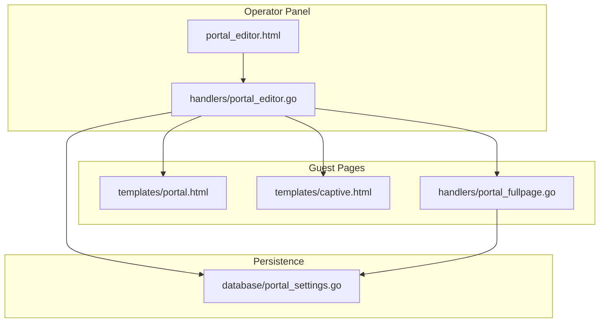
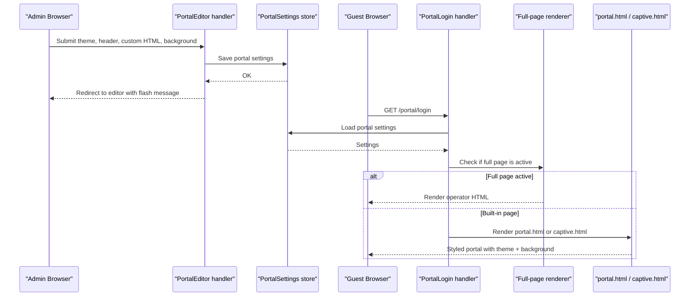
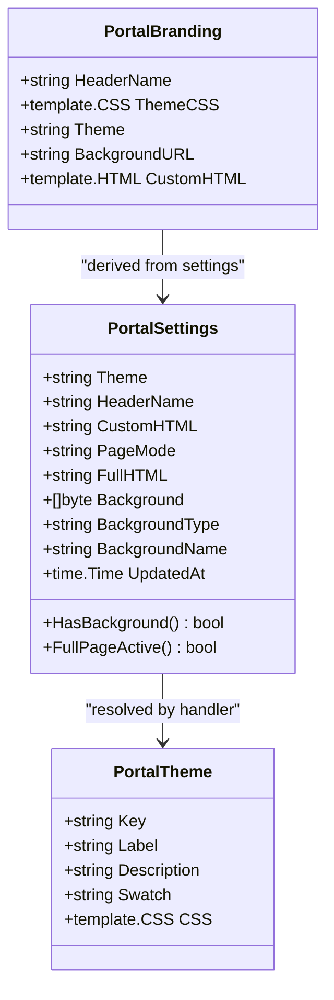
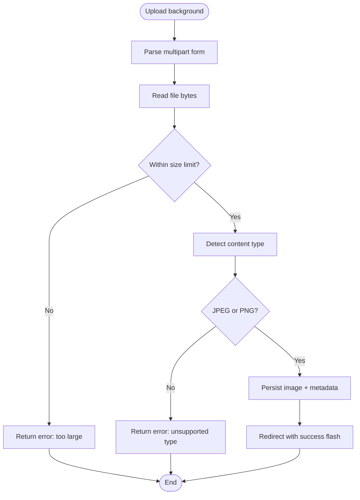
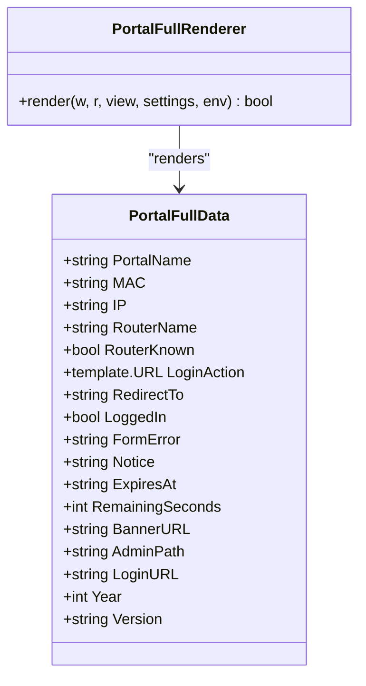
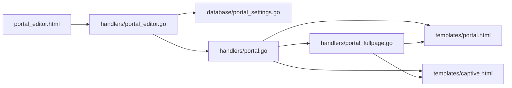

# Portal Customization & Branding

<cite>
**Referenced Files in This Document**   
- [README.md](file://README.md)
- [handlers/portal_editor.go](file://handlers/portal_editor.go)
- [handlers/portal.go](file://handlers/portal.go)
- [handlers/portal_fullpage.go](file://handlers/portal_fullpage.go)
- [handlers/views.go](file://handlers/views.go)
- [database/portal_settings.go](file://database/portal_settings.go)
- [templates/portal_editor.html](file://templates/portal_editor.html)
- [templates/portal.html](file://templates/portal.html)
- [templates/captive.html](file://templates/captive.html)
</cite>

## Table of Contents
1. [Introduction](#introduction)
2. [Project Structure](#project-structure)
3. [Core Components](#core-components)
4. [Architecture Overview](#architecture-overview)
5. [Detailed Component Analysis](#detailed-component-analysis)
6. [Dependency Analysis](#dependency-analysis)
7. [Performance Considerations](#performance-considerations)
8. [Troubleshooting Guide](#troubleshooting-guide)
9. [Conclusion](#conclusion)
10. [Appendices](#appendices)

## Introduction
This document explains how to customize the captive portal’s branding and appearance, including theme selection, header name, background image, custom HTML injection, and full-page overrides. It also documents the operator portal editor interface, tagline and support information display, template variables available for custom pages, and mobile-responsive design behavior across devices.

The system provides two guest-facing rendering paths:
- Built-in sign-in page with theme, header name, and optional extra HTML block.
- Full-page mode where an operator supplies a complete HTML document that replaces the built-in layout.

Branding is stored in a single database row so the theme, header, custom HTML, and background image stay consistent across all guest pages.

**Section sources**
- [README.md:70-89](file://README.md#L70-L89)
- [handlers/portal_editor.go:17-36](file://handlers/portal_editor.go#L17-L36)
- [database/portal_settings.go:140-173](file://database/portal_settings.go#L140-L173)

## Project Structure
Portal customization spans handlers, templates, and the portal settings store:

**Diagram sources**
- [handlers/portal_editor.go:17-52](file://handlers/portal_editor.go#L17-L52)
- [handlers/portal_fullpage.go:14-59](file://handlers/portal_fullpage.go#L14-L59)
- [database/portal_settings.go:12-29](file://database/portal_settings.go#L12-L29)
- [templates/portal_editor.html:1-268](file://templates/portal_editor.html#L1-L268)
- [templates/portal.html:1-105](file://templates/portal.html#L1-L105)
- [templates/captive.html:1-523](file://templates/captive.html#L1-L523)

**Section sources**
- [handlers/portal_editor.go:17-52](file://handlers/portal_editor.go#L17-L52)
- [handlers/portal_fullpage.go:14-59](file://handlers/portal_fullpage.go#L14-L59)
- [database/portal_settings.go:12-29](file://database/portal_settings.go#L12-L29)
- [templates/portal_editor.html:1-268](file://templates/portal_editor.html#L1-L268)
- [templates/portal.html:1-105](file://templates/portal.html#L1-L105)
- [templates/captive.html:1-523](file://templates/captive.html#L1-L523)

## Core Components
- Portal branding model: a single value used by both guest pages to ensure consistent look and feel.
- Theme system: five built-in themes defined as CSS custom property overrides.
- Background image storage: JPEG or PNG stored in the database and served through a public endpoint.
- Custom HTML injection: safe markup rendered inside the built-in card.
- Full-page override: operator-supplied complete HTML document with a documented data model.
- Portal editor UI: theme selector, header name, page mode, custom HTML, background upload, and router installation instructions.
- Template helpers: shared functions such as `portalAction`, icon rendering, and time formatting.

Key responsibilities:
- `handlers/portal_editor.go` resolves branding, validates editor input, handles uploads, and serves the background image.
- `database/portal_settings.go` persists theme, header, custom HTML, page mode, full HTML, and background metadata.
- `handlers/portal.go` renders the built-in portal and delegates to full-page rendering when active.
- `handlers/portal_fullpage.go` compiles and caches the operator’s full page and maps runtime data into it.
- `templates/portal.html` and `templates/captive.html` consume branding and render the guest experience.
- `templates/portal_editor.html` exposes the operator controls.

**Section sources**
- [handlers/portal_editor.go:17-36](file://handlers/portal_editor.go#L17-L36)
- [handlers/portal_editor.go:63-124](file://handlers/portal_editor.go#L63-L124)
- [handlers/portal_editor.go:390-450](file://handlers/portal_editor.go#L390-L450)
- [handlers/portal.go:273-304](file://handlers/portal.go#L273-L304)
- [handlers/portal_fullpage.go:14-59](file://handlers/portal_fullpage.go#L14-L59)
- [database/portal_settings.go:140-173](file://database/portal_settings.go#L140-L173)
- [handlers/views.go:268-301](file://handlers/views.go#L268-L301)

## Architecture Overview
The portal customization flow connects the operator editor to persisted settings and then to guest templates.

**Diagram sources**
- [handlers/portal_editor.go:305-388](file://handlers/portal_editor.go#L305-L388)
- [handlers/portal.go:85-114](file://handlers/portal.go#L85-L114)
- [handlers/portal.go:273-304](file://handlers/portal.go#L273-L304)
- [handlers/portal_fullpage.go:146-197](file://handlers/portal_fullpage.go#L146-L197)
- [database/portal_settings.go:201-285](file://database/portal_settings.go#L201-L285)

## Detailed Component Analysis

### Branding Model and Theme System
The branding model carries the header name, selected theme CSS, theme key, background URL, and custom HTML. Themes are defined as CSS custom properties under `:root`. Each theme only redefines these tokens, so adding a new theme does not require changing markup.

Built-in themes include Midnight, Ocean, Sunset, Forest, and Daylight. The theme key is persisted; the CSS implementation lives in the handler. Unknown or normalized theme keys fall back to the default theme.

**Diagram sources**
- [database/portal_settings.go:140-173](file://database/portal_settings.go#L140-L173)
- [handlers/portal_editor.go:63-124](file://handlers/portal_editor.go#L63-L124)
- [handlers/portal_editor.go:17-36](file://handlers/portal_editor.go#L17-L36)

**Section sources**
- [handlers/portal_editor.go:63-124](file://handlers/portal_editor.go#L63-L124)
- [database/portal_settings.go:31-51](file://database/portal_settings.go#L31-L51)
- [database/portal_settings.go:71-88](file://database/portal_settings.go#L71-L88)
- [handlers/portal_editor.go:126-135](file://handlers/portal_editor.go#L126-L135)

### Background Image Upload and Serving
Background images are uploaded via the portal editor, validated by content type sniffing, size limits, and MIME allowlisting. The image is stored in the database alongside other portal settings. Guests fetch it from a public path before signing in.

Validation and safety:
- Only JPEG and PNG types are accepted.
- Content type is sniffed from bytes, not filename.
- Size limit prevents oversized blobs.
- Read errors degrade gracefully so guests still see a working form.

Caching:
- Public cache headers and ETag reduce repeated downloads.
- Last-Modified supports conditional requests.

**Diagram sources**
- [handlers/portal_editor.go:390-450](file://handlers/portal_editor.go#L390-L450)
- [database/portal_settings.go:287-318](file://database/portal_settings.go#L287-L318)
- [database/portal_settings.go:90-101](file://database/portal_settings.go#L90-L101)

**Section sources**
- [handlers/portal_editor.go:390-450](file://handlers/portal_editor.go#L390-L450)
- [handlers/portal_editor.go:487-518](file://handlers/portal_editor.go#L487-L518)
- [database/portal_settings.go:287-318](file://database/portal_settings.go#L287-L318)
- [database/portal_settings.go:332-360](file://database/portal_settings.go#L332-L360)

### Custom HTML Injection
Custom HTML is rendered inside the built-in portal card. It is intended for small blocks such as terms, opening hours, contact info, or QR codes. It inherits portal styles but is restricted:
- Scripts are rejected.
- Iframes are rejected.
- JavaScript links are rejected.
- Byte limit applies.

When full-page mode is active, this field is kept but not shown to guests.

**Section sources**
- [handlers/portal_editor.go:345-364](file://handlers/portal_editor.go#L345-L364)
- [database/portal_settings.go:147-151](file://database/portal_settings.go#L147-L151)
- [templates/portal.html:96-98](file://templates/portal.html#L96-L98)
- [templates/captive.html:418-420](file://templates/captive.html#L418-L420)

### Full-Page Override and Template Variables
In full-page mode, the operator supplies a complete HTML document. The controller parses and caches it once per source, then renders it with a flat data model. Runtime values are escaped automatically; the operator’s own markup is trusted code.

Available variables for the full page:
- `PortalName`: header name from the editor or environment.
- `MAC`: guest MAC address.
- `IP`: guest IP address.
- `RouterName`: device serving the hotspot, when known.
- `RouterKnown`: whether the router was resolved.
- `LoginAction`: form action carrying hotspot parameters.
- `RedirectTo`: original destination after successful login.
- `LoggedIn`: true after successful authentication.
- `FormError`: last login failure message.
- `Notice`: post-login notice.
- `ExpiresAt`: allowance expiry in RFC3339, empty when unknown.
- `RemainingSeconds`: seconds left for countdown timers.
- `BannerURL`: uploaded background image path, empty when none.
- `AdminPath`: operator panel prefix.
- `LoginURL`: built-in sign-in page path.
- `Year`: current year.
- `Version`: build version.

**Diagram sources**
- [handlers/portal_fullpage.go:14-59](file://handlers/portal_fullpage.go#L14-L59)
- [handlers/portal_fullpage.go:146-197](file://handlers/portal_fullpage.go#L146-L197)

**Section sources**
- [handlers/portal_fullpage.go:14-59](file://handlers/portal_fullpage.go#L14-L59)
- [handlers/portal_fullpage.go:61-102](file://handlers/portal_fullpage.go#L61-L102)
- [handlers/portal_fullpage.go:146-197](file://handlers/portal_fullpage.go#L146-L197)
- [templates/portal_editor.html:103-130](file://templates/portal_editor.html#L103-L130)

### Portal Editor Interface
The portal editor provides:
- Theme selection with swatches and descriptions.
- Header name configuration.
- Page mode selection: built-in page vs full-page override.
- Custom HTML editor for the built-in page.
- Full-page HTML editor with starter template insertion and live preview link.
- Background image upload and removal.
- Router installation instructions and walled-garden guidance.
- Timestamps showing when text fields and background were last updated.

The editor enforces limits for header runes, custom HTML bytes, full page bytes, and background image size. Errors are surfaced inline.

**Section sources**
- [templates/portal_editor.html:25-159](file://templates/portal_editor.html#L25-L159)
- [templates/portal_editor.html:161-211](file://templates/portal_editor.html#L161-L211)
- [templates/portal_editor.html:213-251](file://templates/portal_editor.html#L213-L251)
- [handlers/portal_editor.go:279-303](file://handlers/portal_editor.go#L279-L303)
- [handlers/portal_editor.go:305-388](file://handlers/portal_editor.go#L305-L388)

### Tagline and Support Information Display
Tagline and support information are configured via environment variables and displayed on guest pages:
- `PORTAL_TAGLINE`: welcome line on the portal landing page.
- `PORTAL_SUPPORT`: contact line shown on the portal landing page.

These values appear in the captive portal kiosk view and are part of the broader portal context.

**Section sources**
- [README.md:78-82](file://README.md#L78-L82)
- [templates/captive.html:422-428](file://templates/captive.html#L422-L428)
- [templates/captive.html:437-448](file://templates/captive.html#L437-L448)

### Mobile-Responsive Design Principles
Both the built-in portal and the kiosk use responsive CSS:
- Viewport meta ensures proper scaling on phones.
- Media queries adjust banner height, font sizes, padding, and button sizing for narrow screens.
- Landscape phone adjustments prioritize visible controls above the fold.
- Reduced-motion preference disables transitions for accessibility.
- Safe area insets are respected on modern phones.

The kiosk uses a fixed palette independent of operator themes to keep signal colors readable at arm’s length.

**Section sources**
- [templates/portal.html:1-10](file://templates/portal.html#L1-L10)
- [templates/captive.html:276-298](file://templates/captive.html#L276-L298)
- [templates/captive.html:23-38](file://templates/captive.html#L23-L38)

## Dependency Analysis
The following diagram shows how customization flows from the editor to persistence and rendering.

**Diagram sources**
- [handlers/portal_editor.go:279-303](file://handlers/portal_editor.go#L279-L303)
- [handlers/portal.go:85-114](file://handlers/portal.go#L85-L114)
- [handlers/portal.go:273-304](file://handlers/portal.go#L273-L304)
- [handlers/portal_fullpage.go:146-197](file://handlers/portal_fullpage.go#L146-L197)
- [database/portal_settings.go:201-285](file://database/portal_settings.go#L201-L285)

**Section sources**
- [handlers/portal_editor.go:279-303](file://handlers/portal_editor.go#L279-L303)
- [handlers/portal.go:85-114](file://handlers/portal.go#L85-L114)
- [handlers/portal.go:273-304](file://handlers/portal.go#L273-L304)
- [handlers/portal_fullpage.go:146-197](file://handlers/portal_fullpage.go#L146-L197)
- [database/portal_settings.go:201-285](file://database/portal_settings.go#L201-L285)

## Performance Considerations
- Background image caching: public cache headers and ETag reduce bandwidth and server load.
- Full-page template caching: the operator’s page is compiled once per source and reused across requests.
- Graceful degradation: database read errors for branding or settings fall back to defaults or built-in pages rather than failing the guest flow.
- Input validation: strict size and type checks prevent oversized payloads and unsafe content types.

[No sources needed since this section provides general guidance]

## Troubleshooting Guide
Common issues and resolutions:
- Unknown theme key: the editor normalizes unknown themes to the default; verify the selected theme exists.
- Unsupported background type: only JPEG and PNG are accepted; re-export the image.
- Oversized background: resize the image below the configured limit.
- Broken full-page template: the editor pre-validates compilation; fix the reported line and resubmit.
- Missing router linkage: the portal displays a message indicating the hotspot is not linked; configure the router and portal tag.
- Form action parameter loss: ensure hotspot redirect parameters are preserved; the helper builds the action safely.

**Section sources**
- [handlers/portal_editor.go:323-343](file://handlers/portal_editor.go#L323-L343)
- [handlers/portal_editor.go:420-439](file://handlers/portal_editor.go#L420-L439)
- [handlers/portal.go:98-114](file://handlers/portal.go#L98-L114)
- [handlers/views.go:268-301](file://handlers/views.go#L268-L301)

## Conclusion
Portal customization centers on a single branding model that keeps the theme, header, custom HTML, and background consistent across guest pages. Operators can choose from built-in themes, upload a background image, inject safe custom HTML, or replace the entire page with their own template using a documented variable set. The portal editor enforces safety and size limits while providing clear feedback. Responsive design ensures readability on phones and tablets, and graceful fallbacks protect the guest experience when configuration or backend state is unavailable.

[No sources needed since this section summarizes without analyzing specific files]

## Appendices

### Configuration Variables Relevant to Portal Branding
- `PORTAL_NAME`: brand name used when no header override is set.
- `PORTAL_TAGLINE`: welcome line on the portal landing page.
- `PORTAL_SUPPORT`: contact line on the portal landing page.
- `DEFAULT_REDIRECT`: fallback destination when `link-orig` is absent.

**Section sources**
- [README.md:78-89](file://README.md#L78-L89)

### Best Practices for Consistent Branding Across Devices
- Use the built-in theme system and avoid overriding global CSS directly; extend via theme tokens.
- Keep custom HTML concise; place large images in the background upload.
- Test full-page templates against the provided starter template and preview link.
- Choose backgrounds with sufficient contrast for text legibility.
- Validate mobile layouts at narrow widths and landscape orientations.
- Avoid remote scripts and frames in custom HTML; use full-page mode only when necessary and understand the security implications.

[No sources needed since this section provides general guidance]