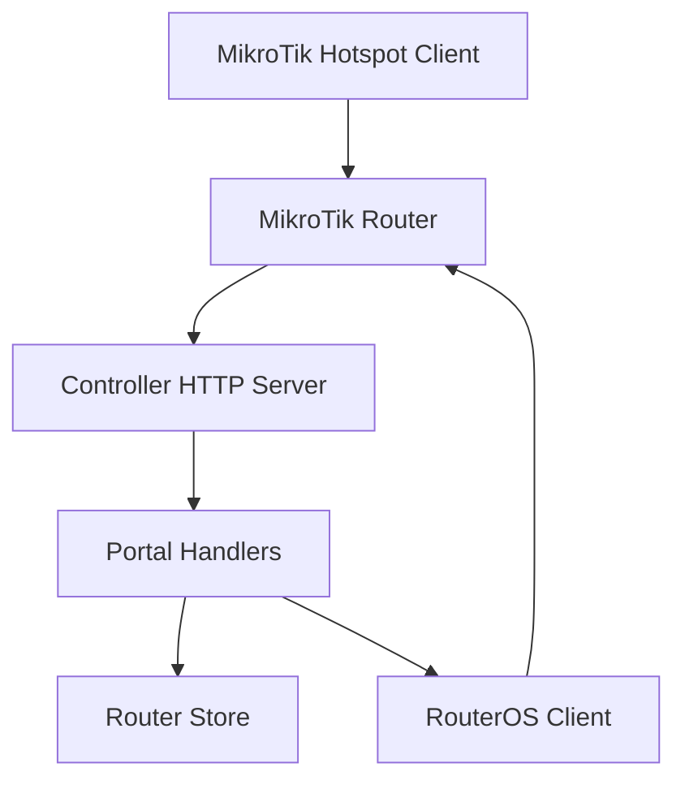
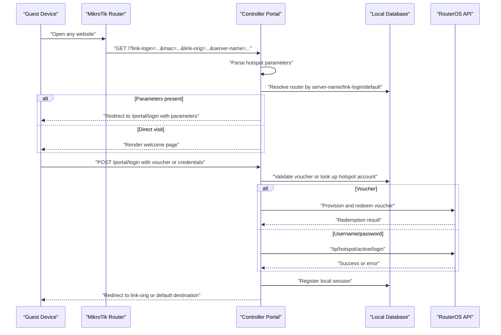
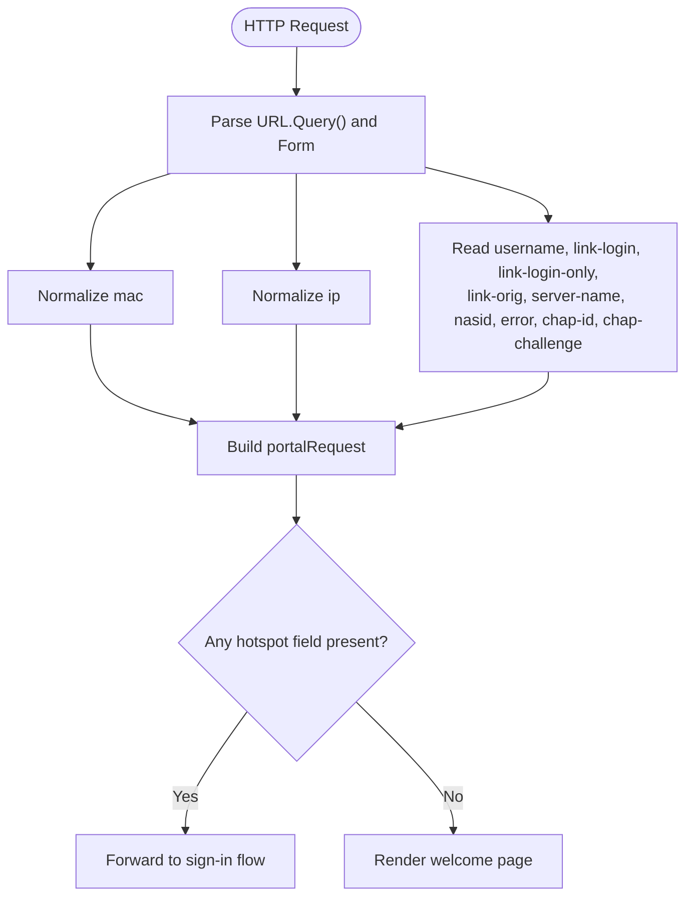
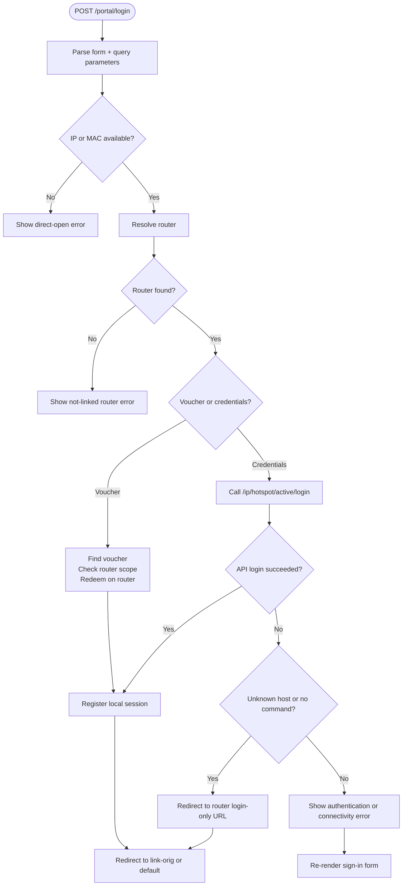
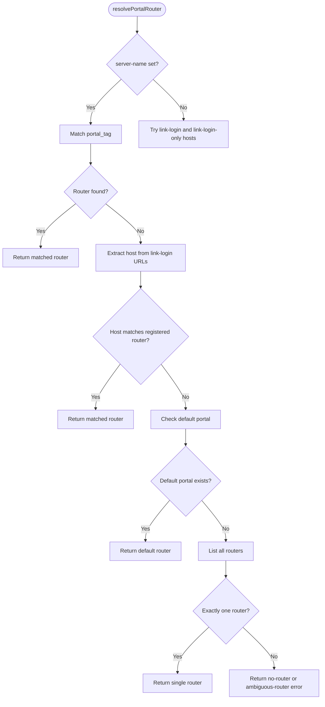
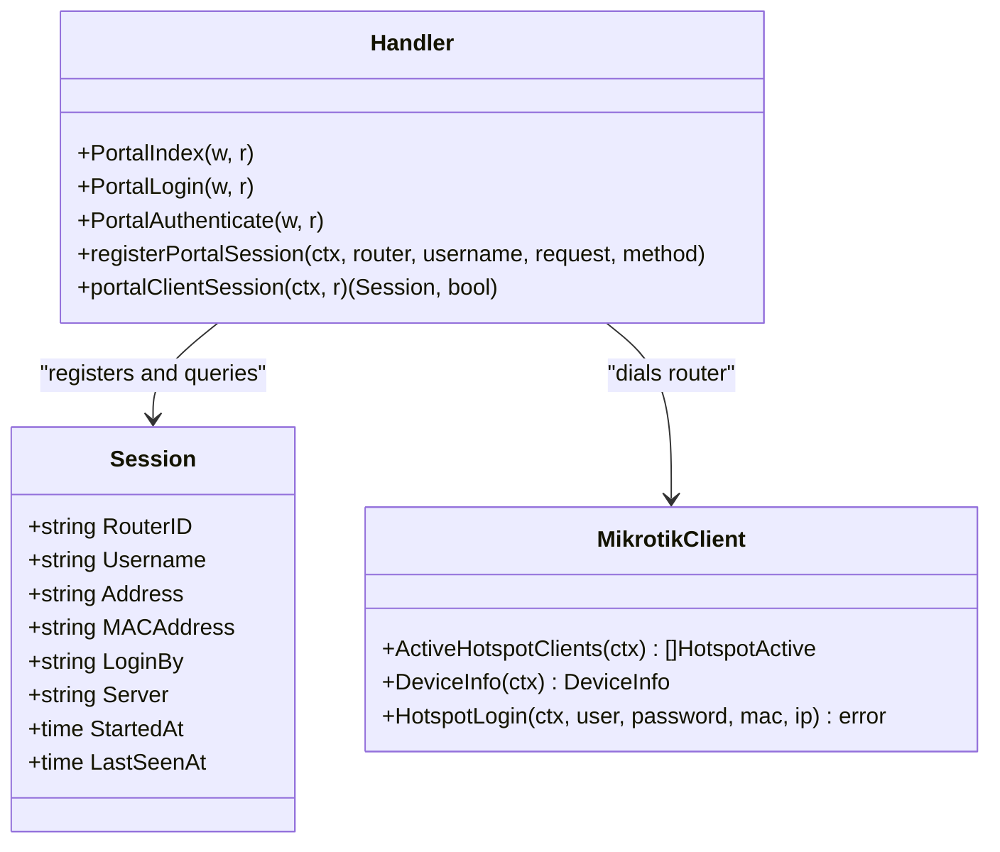
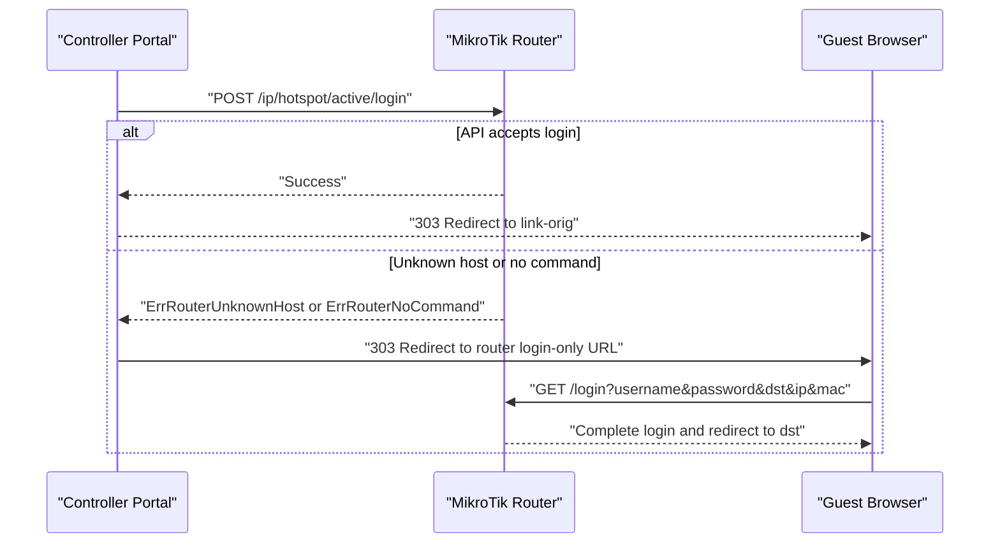
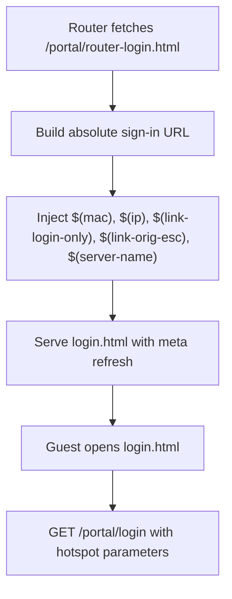
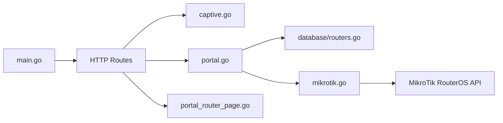

# Portal Integration & MikroTik Handshake

<cite>
**Referenced Files in This Document**   
- [README.md](file://README.md)
- [main.go](file://main.go)
- [handlers/portal.go](file://handlers/portal.go)
- [handlers/captive.go](file://handlers/captive.go)
- [handlers/portal_router_page.go](file://handlers/portal_router_page.go)
- [handlers/mikrotik.go](file://handlers/mikrotik.go)
- [handlers/routers.go](file://handlers/routers.go)
- [database/routers.go](file://database/routers.go)
</cite>

## Table of Contents
1. [Introduction](#introduction)
2. [Project Structure](#project-structure)
3. [Core Components](#core-components)
4. [Architecture Overview](#architecture-overview)
5. [Detailed Component Analysis](#detailed-component-analysis)
6. [Dependency Analysis](#dependency-analysis)
7. [Performance Considerations](#performance-considerations)
8. [Troubleshooting Guide](#troubleshooting-guide)
9. [Conclusion](#conclusion)

## Introduction
This document explains how the controller integrates with MikroTik hotspot redirect behavior and completes the captive portal handshake. It covers:

- How MikroTik redirect parameters are received, normalized, and preserved.
- The full sign-in flow from the initial hotspot redirect to authentication completion.
- Router resolution logic that attributes a request to a registered MikroTik device.
- Hotspot client detection and session tracking.
- The handshake protocol between the controller and MikroTik devices, including API-based login and browser fallback.
- Example redirect URLs, parameter handling locations, and common integration issues.

The controller exposes two public-facing doors: the captive portal at the root path and the operator panel under `/admin`. Guests who connect to a hotspot are redirected by the router to the controller, which then either shows a welcome page or forwards directly to the sign-in form when hotspot parameters are present.

**Section sources**
- [README.md:1-8](file://README.md#L1-L8)
- [README.md:10-19](file://README.md#L10-L19)
- [main.go:36-57](file://main.go#L36-L57)

## Project Structure
The relevant integration code is split across HTTP handlers, the RouterOS client layer, and the database model for routers:

| Area | Responsibility |
| --- | --- |
| `handlers/captive.go` | Captive portal welcome page, probe endpoint, and live-session detection. |
| `handlers/portal.go` | Sign-in form, authentication, router resolution, redirect target selection, and session registration. |
| `handlers/portal_router_page.go` | Generates the login page installed on the MikroTik; builds the redirect URL with hotspot variables. |
| `handlers/mikrotik.go` | RouterOS API client, error types, and hotspot login command. |
| `handlers/routers.go` | Operator-facing router inventory and device snapshot logic. |
| `database/routers.go` | Router persistence, portal tag matching, default portal selection, and host lookup. |
| `main.go` | Server bootstrap, configuration loading, and route wiring. |

**Diagram sources**
- [handlers/captive.go:95-153](file://handlers/captive.go#L95-L153)
- [handlers/portal.go:85-194](file://handlers/portal.go#L85-L194)
- [handlers/portal_router_page.go:47-86](file://handlers/portal_router_page.go#L47-L86)
- [handlers/mikrotik.go:160-181](file://handlers/mikrotik.go#L160-L181)
- [database/routers.go:140-166](file://database/routers.go#L140-L166)

**Section sources**
- [main.go:214-285](file://main.go#L214-L285)
- [handlers/captive.go:10-49](file://handlers/captive.go#L10-L49)
- [handlers/portal.go:19-33](file://handlers/portal.go#L19-L33)
- [handlers/portal_router_page.go:10-31](file://handlers/portal_router_page.go#L10-L31)

## Core Components
The captive portal integration centers on five core components:

1. **Hotspot redirect parameters** — parsed into a typed `portalRequest` structure.
2. **Captive portal welcome page** — detects whether a client was redirected by a hotspot and forwards immediately if hotspot parameters are present.
3. **Sign-in handler** — validates input, resolves the correct router, authenticates via voucher or username/password, and redirects to the original destination.
4. **Router resolution** — selects a registered MikroTik device using server name, link-login host, default portal, or single-router fallback.
5. **RouterOS handshake** — calls `/ip/hotspot/active/login`, falls back to browser-driven login when the API cannot authenticate the client.

Key responsibilities:

| Component | Key Behavior |
| --- | --- |
| `portalRequest` | Holds `mac`, `ip`, `username`, `link-login`, `link-login-only`, `link-orig`, `server-name`, `error`, `chap-id`, and `chap-challenge`. |
| `portalRequestFromValues` | Normalizes MAC/IP, supports `nasid` as an alternative server identifier, and merges query/form values. |
| `PortalIndex` | Forwards hotspot redirects straight to the sign-in form so parameters stay intact. |
| `PortalLogin` | Renders the sign-in form, carries hotspot parameters, and displays router attribution or missing-router errors. |
| `resolvePortalRouter` | Chooses a router by portal tag, link-login host, default portal, or single-device rule. |
| `finishPortalLogin` | Redirects to `link-orig` or configured default, or falls back to the router’s login-only URL. |
| `HotspotLogin` | Authenticates through the RouterOS active login API and retries with MAC-only when needed. |

**Section sources**
- [handlers/portal.go:19-63](file://handlers/portal.go#L19-L63)
- [handlers/captive.go:95-153](file://handlers/captive.go#L95-L153)
- [handlers/portal.go:85-194](file://handlers/portal.go#L85-L194)
- [handlers/portal.go:306-382](file://handlers/portal.go#L306-L382)
- [handlers/mikrotik.go:951-974](file://handlers/mikrotik.go#L951-L974)

## Architecture Overview
The integration follows a predictable sequence:

1. The MikroTik hotspot intercepts a guest’s first web request.
2. The router redirects the guest to the controller with hotspot variables.
3. The controller parses the variables and resolves the responsible router.
4. The controller renders the sign-in form or forwards directly when parameters are already present.
5. The guest submits a voucher or hotspot credentials.
6. The controller authenticates locally (voucher) or against the router (hotspot user).
7. The controller registers a local session and redirects the guest to the original destination.

**Diagram sources**
- [handlers/captive.go:95-153](file://handlers/captive.go#L95-L153)
- [handlers/portal.go:85-194](file://handlers/portal.go#L85-L194)
- [handlers/portal.go:196-271](file://handlers/portal.go#L196-L271)
- [handlers/portal.go:306-382](file://handlers/portal.go#L306-L382)
- [handlers/mikrotik.go:951-974](file://handlers/mikrotik.go#L951-L974)

## Detailed Component Analysis

### MikroTik Redirect Parameter Handling
The controller treats hotspot redirect parameters as the primary identity and routing signal for a guest. The `portalRequest` type captures all fields commonly supplied by MikroTik hotspot templates.

Important behaviors:

- `mac` is normalized to a canonical MAC format.
- `ip` is normalized to a stable IP representation.
- `link-login` and `link-login-only` identify the router’s login endpoint.
- `link-orig` identifies the original destination the guest wanted before being intercepted.
- `server-name` identifies the hotspot server; if absent, `nasid` is used as a fallback.
- `error` carries a failed login message from the router.
- `chap-id` and `chap-challenge` are captured for CHAP-style flows.

Parameter parsing occurs in one central function, which reads both query strings and submitted forms. This matters because the sign-in form action includes the hotspot parameters in its URL, while the voucher itself is posted in the body.

**Diagram sources**
- [handlers/portal.go:19-63](file://handlers/portal.go#L19-L63)
- [handlers/captive.go:95-153](file://handlers/captive.go#L95-L153)

Example redirect patterns supported by the integration:

| Scenario | Example URL Pattern |
| --- | --- |
| Initial hotspot redirect | `http://controller/?link-login=http%3A%2F%2F10.0.0.1%2Flogin&mac=AA:BB:CC:DD:EE:FF&link-orig=http%3A%2F%2Fexample.com%2Fpage&a=1&b=2&server-name=hotspot1` |
| Router-installed login page redirect | `http://controller/portal/login?mac=$(mac)&ip=$(ip)&link-login-only=$(link-login-only)&link-orig=$(link-orig-esc)&server-name=$(server-name)` |
| Direct portal status test | `http://controller/portal/status?server-name=hotspot1` |
| Direct sign-in without hotspot context | `http://controller/portal/login?mac=AA-BB-CC-DD-EE-FF&ip=10.5.50.42&link-login=http://10.0.0.1/login&link-orig=http://example.com/` |

**Section sources**
- [handlers/portal.go:19-63](file://handlers/portal.go#L19-L63)
- [handlers/portal_router_page.go:68-86](file://handlers/portal_router_page.go#L68-L86)
- [handlers/captive_test.go:481-527](file://handlers/captive_test.go#L481-L527)

### Complete Sign-In Flow
The sign-in flow handles two main paths: voucher redemption and hotspot username/password login.

#### Voucher Path
1. Guest enters a voucher code.
2. Controller looks up the voucher and checks router scope.
3. Controller redeems the voucher on the router.
4. Controller registers a local session.
5. Controller redirects to `link-orig` or the configured default.

#### Username/Password Path
1. Guest enters hotspot credentials.
2. Controller dials the resolved router.
3. Controller calls `/ip/hotspot/active/login`.
4. If the API rejects the request due to unknown host or missing command, the controller falls back to browser-driven login.
5. On success, controller registers a local session and redirects.

**Diagram sources**
- [handlers/portal.go:116-194](file://handlers/portal.go#L116-L194)
- [handlers/portal.go:196-271](file://handlers/portal.go#L196-L271)
- [handlers/portal.go:306-382](file://handlers/portal.go#L306-L382)
- [handlers/mikrotik.go:951-974](file://handlers/mikrotik.go#L951-L974)

**Section sources**
- [handlers/portal.go:116-194](file://handlers/portal.go#L116-L194)
- [handlers/portal.go:196-271](file://handlers/portal.go#L196-L271)
- [handlers/portal.go:306-382](file://handlers/portal.go#L306-L382)

### Router Resolution Logic
Router resolution determines which registered MikroTik device should handle a portal request. The order is explicit and defensive:

1. **Server name match** — matches `server-name` or `nasid` against the router’s `portal_tag`.
2. **Link-login host match** — extracts the hostname from `link-login` or `link-login-only` and matches it against the router’s API host.
3. **Default portal** — uses the router marked as the default captive portal.
4. **Single router** — if exactly one router is registered, use it.
5. **Ambiguous or missing** — return an error indicating that a portal tag, default portal, or single router is required.

**Diagram sources**
- [handlers/portal.go:404-451](file://handlers/portal.go#L404-L451)
- [database/routers.go:140-166](file://database/routers.go#L140-L166)

**Section sources**
- [handlers/portal.go:404-451](file://handlers/portal.go#L404-L451)
- [database/routers.go:83-88](file://database/routers.go#L83-L88)
- [database/routers.go:140-166](file://database/routers.go#L140-L166)

### Hotspot Client Detection
The controller tracks hotspot clients in two complementary ways:

- **Live device sync** — the operator can refresh a router’s active client list from `/ip/hotspot/active/print`.
- **Local session registration** — successful portal logins register a local session so the welcome page can greet an already-connected device without requiring a live API call.

The welcome page checks for an open session whose address matches the current request. If found, it shows elapsed time and avoids asking the same device to sign in again.

**Diagram sources**
- [handlers/captive.go:187-211](file://handlers/captive.go#L187-L211)
- [handlers/portal.go:331-344](file://handlers/portal.go#L331-L344)
- [handlers/routers.go:566-619](file://handlers/routers.go#L566-L619)

**Section sources**
- [handlers/captive.go:187-211](file://handlers/captive.go#L187-L211)
- [handlers/portal.go:331-344](file://handlers/portal.go#L331-L344)
- [handlers/routers.go:566-619](file://handlers/routers.go#L566-L619)

### Handshake Protocol Between Controller and MikroTik
The handshake has two modes:

#### API-Based Handshake
Preferred when the router supports `/ip/hotspot/active/login`:

1. Controller calls the active login endpoint with username, password, optional IP, and optional MAC.
2. If the device does not know the client yet, the controller retries with MAC-only.
3. On success, the controller registers a local session and redirects to the original destination.

#### Browser Fallback Handshake
Used when the API reports that the client is unknown or the command is unavailable:

1. Controller builds a redirect to the router’s login-only URL.
2. The redirect includes `username`, `password`, `dst`, `ip`, and `mac`.
3. The browser completes the login against the router’s own login page.
4. After the router finishes, the client is sent to `link-orig` or the configured default.

**Diagram sources**
- [handlers/mikrotik.go:951-974](file://handlers/mikrotik.go#L951-L974)
- [handlers/portal.go:245-271](file://handlers/portal.go#L245-L271)
- [handlers/portal.go:354-382](file://handlers/portal.go#L354-L382)

**Section sources**
- [handlers/mikrotik.go:23-48](file://handlers/mikrotik.go#L23-L48)
- [handlers/mikrotik.go:951-974](file://handlers/mikrotik.go#L951-L974)
- [handlers/portal.go:245-271](file://handlers/portal.go#L245-L271)
- [handlers/portal.go:354-382](file://handlers/portal.go#L354-L382)

### Router Installation and Redirect Page Generation
The controller provides a generated login page intended to be installed on the MikroTik hotspot. This page performs a simple meta refresh to the controller’s sign-in URL, carrying selected hotspot variables.

Key points:

- The generated page uses RouterOS template variables such as `$(mac)`, `$(ip)`, `$(link-login-only)`, `$(link-orig-esc)`, and `$(server-name)`.
- The `-esc` form is used for `link-orig` so URLs containing `&` survive redirection.
- The base URL is derived from the request’s scheme and host, with strict validation to prevent open redirects.
- The response is served inline as `login.html` for convenience.

**Diagram sources**
- [handlers/portal_router_page.go:47-86](file://handlers/portal_router_page.go#L47-L86)
- [handlers/portal_router_page.go:88-160](file://handlers/portal_router_page.go#L88-L160)

**Section sources**
- [handlers/portal_router_page.go:10-31](file://handlers/portal_router_page.go#L10-L31)
- [handlers/portal_router_page.go:47-86](file://handlers/portal_router_page.go#L47-L86)
- [handlers/portal_router_page.go:88-160](file://handlers/portal_router_page.go#L88-L160)

## Dependency Analysis
The integration depends on several layers:

| Layer | Dependency | Purpose |
| --- | --- | --- |
| HTTP handlers | `handlers/portal.go` | Parses parameters, resolves router, authenticates, redirects. |
| HTTP handlers | `handlers/captive.go` | Serves welcome page and probe endpoint. |
| HTTP handlers | `handlers/portal_router_page.go` | Generates router-side login page. |
| RouterOS client | `handlers/mikrotik.go` | Connects to RouterOS API and executes hotspot commands. |
| Data store | `database/routers.go` | Persists routers and supports portal-tag/host/default resolution. |
| Application bootstrap | `main.go` | Loads config, opens database, wires routes, starts server. |

**Diagram sources**
- [main.go:214-285](file://main.go#L214-L285)
- [handlers/captive.go:95-153](file://handlers/captive.go#L95-L153)
- [handlers/portal.go:85-194](file://handlers/portal.go#L85-L194)
- [handlers/portal_router_page.go:47-86](file://handlers/portal_router_page.go#L47-L86)
- [handlers/mikrotik.go:160-181](file://handlers/mikrotik.go#L160-L181)
- [database/routers.go:140-166](file://database/routers.go#L140-L166)

**Section sources**
- [main.go:214-285](file://main.go#L214-L285)
- [handlers/portal.go:404-451](file://handlers/portal.go#L404-L451)
- [handlers/mikrotik.go:160-181](file://handlers/mikrotik.go#L160-L181)
- [database/routers.go:140-166](file://database/routers.go#L140-L166)

## Performance Considerations
- **Parameter normalization** is lightweight string processing and happens per request.
- **Router resolution** may perform database queries; ensure the router inventory is small enough that host/tag/default lookups remain fast.
- **Hotspot login** uses a timeout derived from configuration, preventing slow routers from blocking requests indefinitely.
- **Local session registration** avoids repeated API calls for already-authenticated guests on the welcome page.
- **Fallback login** shifts part of the handshake to the browser, reducing controller load when the API cannot authenticate directly.

[No sources needed since this section provides general guidance]

## Troubleshooting Guide

### Common Integration Issues

| Symptom | Likely Cause | Resolution |
| --- | --- | --- |
| Guest sees “This hotspot is not linked to the Aircoins controller yet.” | Router resolution failed. | Set `portal_tag` on the router entry to match `server-name`, or mark one router as the default portal. |
| `link-orig` is lost after sign-in | Original destination was missing, invalid, or stripped by unsafe redirect logic. | Ensure `link-orig` is an absolute `http` or `https` URL and survives RouterOS escaping. |
| Sign-in works but device stays captive | Router did not accept `/ip/hotspot/active/login`. | Use browser fallback by ensuring `link-login-only` or `link-login` is present; verify hotspot package is enabled. |
| Wrong router handles the request | Multiple routers are registered without a portal tag or default. | Assign unique `portal_tag` values or mark exactly one router as the default portal. |
| Welcome page logs “no router” | Router branding lookup failed. | This is non-fatal for guests; still configure a router so the page can show the correct network name. |
| Voucher code rejected | Code not found or bound to another router. | Verify voucher code spelling and router scope. |
| API connection fails | Router IP, port, service, or credentials are wrong. | Use the router test endpoint and check firewall rules for API access. |

### Diagnostic Endpoints
- `/portal/status` — returns JSON showing whether the portal can resolve a router based on `server-name` or `link-login`.
- Router inventory test — verifies API connectivity and lists active hotspot clients.

**Section sources**
- [handlers/portal.go:453-481](file://handlers/portal.go#L453-L481)
- [handlers/routers.go:338-381](file://handlers/routers.go#L338-L381)
- [handlers/mikrotik.go:89-113](file://handlers/mikrotik.go#L89-L113)

## Conclusion
The captive portal integration is built around preserving MikroTik redirect parameters, resolving the correct router, and completing the handshake through either the RouterOS API or the browser-driven login flow. The most important operational details are:

- Always include hotspot variables in the router-side login page.
- Set `portal_tag` or a default portal when multiple routers are registered.
- Keep `link-orig` as a safe absolute URL so guests return to their intended destination.
- Use `/portal/status` and the router test endpoints to validate integration during setup.
- Rely on local session registration for a smooth guest experience even when the router API is temporarily unavailable.

[No sources needed since this section summarizes without analyzing specific files]