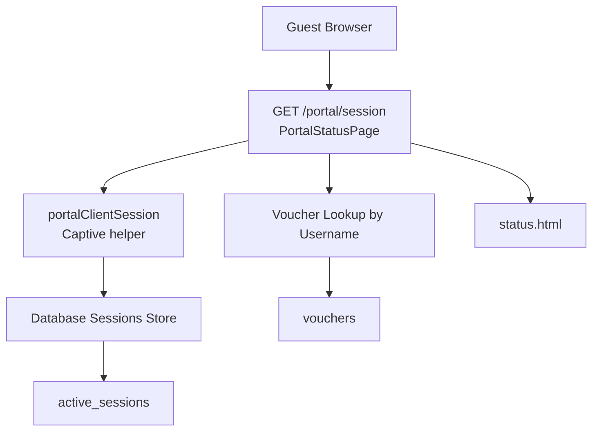
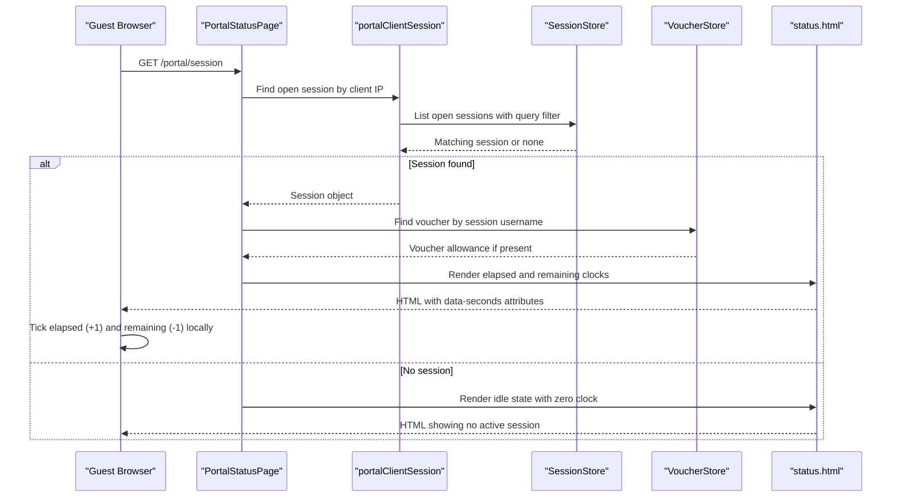
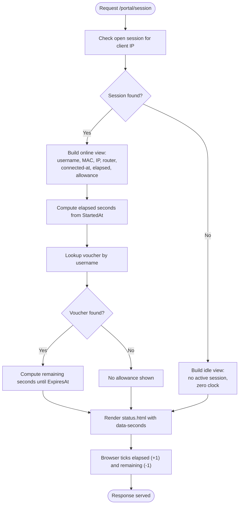
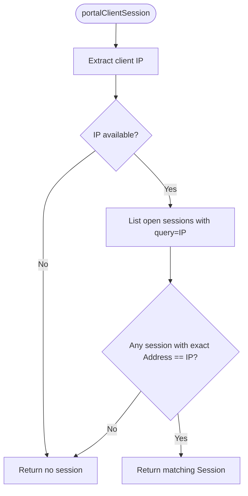
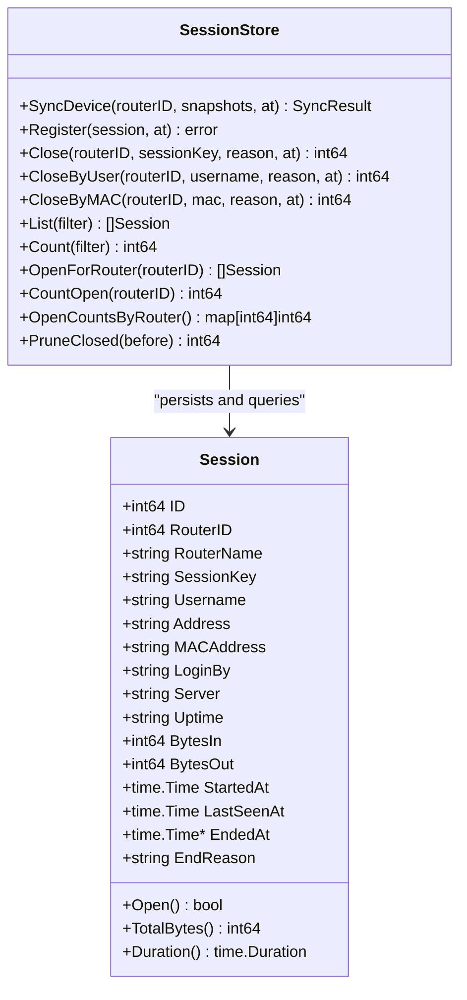
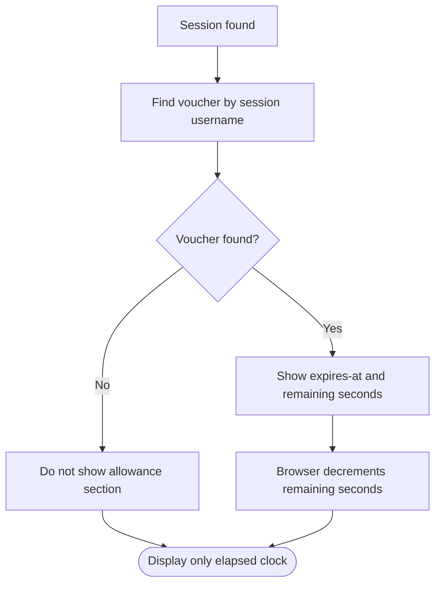
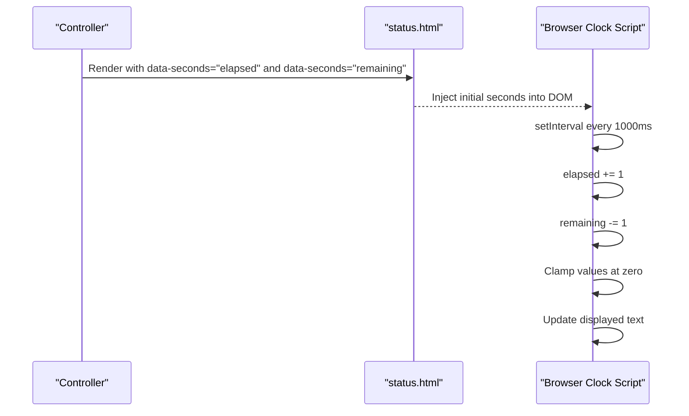
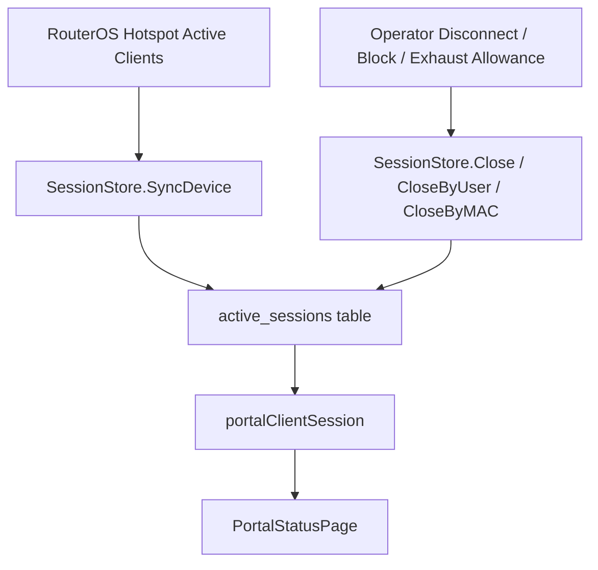
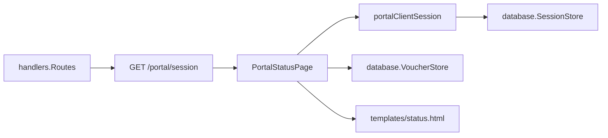

# Portal Status & Session Monitoring

<cite>
**Referenced Files in This Document**
- [portal_status.go](file://handlers/portal_status.go)
- [captive.go](file://handlers/captive.go)
- [handlers.go](file://handlers/handlers.go)
- [status.html](file://templates/status.html)
- [sessions.go](file://database/sessions.go)
- [vouchers.go](file://database/vouchers.go)
- [api.go](file://handlers/api.go)
</cite>

## Table of Contents
1. [Introduction](#introduction)
2. [Project Structure](#project-structure)
3. [Core Components](#core-components)
4. [Architecture Overview](#architecture-overview)
5. [Detailed Component Analysis](#detailed-component-analysis)
6. [Dependency Analysis](#dependency-analysis)
7. [Performance Considerations](#performance-considerations)
8. [Troubleshooting Guide](#troubleshooting-guide)
9. [Conclusion](#conclusion)

## Introduction
This document explains how the portal monitors guest session status and tracks active hotspot sessions. It covers:
- How the portal detects whether a device already has an active session.
- Which user information is displayed (username, MAC address, IP address, router name, connection time).
- How elapsed-time and paid-session countdown timers are calculated and rendered.
- How real-time updates work without polling the server every second.
- How local database sessions relate to live RouterOS sessions.
- Example API calls for session management and troubleshooting synchronization issues.

## Project Structure
The portal status feature spans three layers:
- HTTP handlers expose the guest-facing session page and operator endpoints.
- The template renders clocks and user details.
- The database layer persists observed sessions and voucher allowances.

**Diagram sources**
- [portal_status.go:110-146](file://handlers/portal_status.go#L110-L146)
- [captive.go:187-211](file://handlers/captive.go#L187-L211)
- [sessions.go:12-34](file://database/sessions.go#L12-L34)
- [vouchers.go:78-102](file://database/vouchers.go#L78-L102)
- [status.html:29-56](file://templates/status.html#L29-L56)

**Section sources**
- [handlers.go:407-417](file://handlers/handlers.go#L407-L417)
- [portal_status.go:13-54](file://handlers/portal_status.go#L13-L54)

## Core Components
- Guest session page handler: builds the “Your session” view, detects an active session, computes elapsed time, and shows allowance when the session came from a voucher.
- Session detection helper: finds an open session matching the client’s IP address.
- Database session model: represents tracked hotspot sessions, including start time, last seen time, end reason, and byte counters.
- Voucher model: provides allowance metadata such as expiration time used for paid-session countdowns.
- Client-side clock script: ticks elapsed and remaining seconds locally after initial page load.

Key responsibilities:
- Detecting existing sessions by client IP.
- Rendering username, MAC, IP, router name, connected timestamp, elapsed time, and optional allowance expiry.
- Computing countdown values safely so negative or future timestamps do not break display.
- Keeping the browser clock accurate without per-second server requests.

**Section sources**
- [portal_status.go:110-173](file://handlers/portal_status.go#L110-L173)
- [captive.go:187-211](file://handlers/captive.go#L187-L211)
- [sessions.go:12-52](file://database/sessions.go#L12-L52)
- [vouchers.go:78-102](file://database/vouchers.go#L78-L102)
- [status.html:87-119](file://templates/status.html#L87-L119)

## Architecture Overview
The portal status flow connects the guest browser, HTTP handler, session store, and voucher store.

**Diagram sources**
- [portal_status.go:110-146](file://handlers/portal_status.go#L110-L146)
- [captive.go:187-211](file://handlers/captive.go#L187-L211)
- [sessions.go:248-269](file://database/sessions.go#L248-L269)
- [vouchers.go:289-303](file://database/vouchers.go#L289-L303)
- [status.html:87-119](file://templates/status.html#L87-L119)

## Detailed Component Analysis

### Guest Session Page: `/portal/session`
The guest-facing session page is intentionally separate from the operator JSON probe path. Its purpose is to show the current device its own session state and countdowns.

Behavior:
- If an open session exists for the request’s client IP, the page marks the device as online and displays:
  - Username
  - MAC address
  - IP address
  - Router name
  - Connected-at timestamp
  - Elapsed time since session start
  - Optional allowance expiry and remaining time when the session was created from a voucher
- If no session is found, it shows an idle state with a zeroed clock and instructions to sign in.

Countdown logic:
- Elapsed seconds are computed from the session start time.
- Remaining seconds are computed from the voucher’s expiration time when available.
- Both values are clamped at zero to avoid negative or future-looking counters.
- The server sends the starting seconds; the browser increments or decrements them locally.

**Diagram sources**
- [portal_status.go:110-173](file://handlers/portal_status.go#L110-L173)
- [status.html:29-56](file://templates/status.html#L29-L56)
- [status.html:87-119](file://templates/status.html#L87-L119)

**Section sources**
- [portal_status.go:13-54](file://handlers/portal_status.go#L13-L54)
- [portal_status.go:110-173](file://handlers/portal_status.go#L110-L173)
- [status.html:29-79](file://templates/status.html#L29-L79)

### Session Detection: `portalClientSession`
The helper locates an active session owned by the requesting device.

Detection rules:
- Extracts the client IP from the request.
- Lists open sessions filtered by the IP address.
- Confirms that the returned session’s address exactly matches the client IP before accepting it.
- Treats database errors as “not online,” ensuring the page still renders even if the session store is temporarily unavailable.

**Diagram sources**
- [captive.go:187-211](file://handlers/captive.go#L187-L211)

**Section sources**
- [captive.go:187-211](file://handlers/captive.go#L187-L211)

### Database Session Model and Lifecycle
The session model represents one hotspot client observed on a device. It includes identifiers, network details, login method, traffic counters, and lifecycle timestamps.

Important fields and methods:
- `StartedAt`: when the session began.
- `LastSeenAt`: when the controller last saw the session during sync.
- `EndedAt`: nil while open; set when closed.
- `Open()`: true when `EndedAt` is nil.
- `Duration()`: duration between start and last seen or end time.
- `TotalBytes()`: sum of inbound and outbound bytes.

Lifecycle operations:
- `SyncDevice`: reconciles local sessions with live RouterOS snapshots, inserting new entries, refreshing existing ones, and closing stale sessions.
- `Register`: opens a session locally right after captive portal authentication, before the router reports it.
- `Close`, `CloseByUser`, `CloseByMAC`: mark sessions finished.
- `List`, `Count`, `OpenForRouter`, `CountOpen`, `OpenCountsByRouter`: query and aggregate session state.
- `PruneClosed`: removes old closed sessions.

**Diagram sources**
- [sessions.go:12-52](file://database/sessions.go#L12-L52)
- [sessions.go:101-178](file://database/sessions.go#L101-L178)
- [sessions.go:180-246](file://database/sessions.go#L180-L246)
- [sessions.go:248-386](file://database/sessions.go#L248-L386)

**Section sources**
- [sessions.go:12-52](file://database/sessions.go#L12-L52)
- [sessions.go:101-178](file://database/sessions.go#L101-L178)
- [sessions.go:180-246](file://database/sessions.go#L180-L246)
- [sessions.go:248-386](file://database/sessions.go#L248-L386)

### Paid Session Allowance and Countdown
When a session’s username corresponds to a redeemed voucher, the portal shows an allowance expiry and remaining time.

Allowance behavior:
- The portal looks up a voucher by the session username.
- If found, it sets `HasAllowance` and computes `RemainingSeconds` from the voucher’s `ExpiresAt`.
- The template renders both elapsed and remaining clocks when applicable.
- The browser runs a local timer that decrements the remaining seconds.

**Diagram sources**
- [portal_status.go:135-142](file://handlers/portal_status.go#L135-L142)
- [vouchers.go:78-102](file://database/vouchers.go#L78-L102)
- [vouchers.go:289-303](file://database/vouchers.go#L289-L303)
- [status.html:41-46](file://templates/status.html#L41-L46)

**Section sources**
- [portal_status.go:135-142](file://handlers/portal_status.go#L135-L142)
- [vouchers.go:78-102](file://database/vouchers.go#L78-L102)
- [vouchers.go:289-303](file://database/vouchers.go#L289-L303)
- [status.html:41-46](file://templates/status.html#L41-L46)

### Real-Time Status Updates
Real-time updates are achieved without per-second server polling:
- The server calculates the initial elapsed and remaining seconds.
- The HTML includes `data-seconds` attributes for each clock.
- A small JavaScript block increments the elapsed clock and decrements the remaining clock every second.
- This design avoids overwhelming the controller with frequent requests from many guests.

**Diagram sources**
- [status.html:87-119](file://templates/status.html#L87-L119)

**Section sources**
- [status.html:87-119](file://templates/status.html#L87-L119)

### Relationship Between Portal State and Active Database Sessions
The portal does not directly query RouterOS for its own session page. Instead, it relies on the controller’s local session store, which is synchronized with live device sessions.

Synchronization highlights:
- `SyncDevice` inserts or refreshes sessions reported by the router.
- It closes any locally open session no longer reported by the device.
- `Register` creates a local session immediately after captive portal authentication.
- `Close` and related methods mark sessions finished when operators disconnect clients or allowances expire.
- The portal’s session lookup filters by open status and client IP.

**Diagram sources**
- [sessions.go:101-178](file://database/sessions.go#L101-L178)
- [sessions.go:180-246](file://database/sessions.go#L180-L246)
- [captive.go:187-211](file://handlers/captive.go#L187-L211)
- [portal_status.go:110-146](file://handlers/portal_status.go#L110-L146)

**Section sources**
- [sessions.go:101-178](file://database/sessions.go#L101-L178)
- [sessions.go:180-246](file://database/sessions.go#L180-L246)
- [captive.go:187-211](file://handlers/captive.go#L187-L211)
- [portal_status.go:110-146](file://handlers/portal_status.go#L110-L146)

## Dependency Analysis
The portal status feature depends on routing, session detection, database persistence, voucher allowance, and template rendering.

**Diagram sources**
- [handlers.go:407-417](file://handlers/handlers.go#L407-L417)
- [portal_status.go:110-146](file://handlers/portal_status.go#L110-L146)
- [captive.go:187-211](file://handlers/captive.go#L187-L211)
- [sessions.go:248-269](file://database/sessions.go#L248-L269)
- [vouchers.go:289-303](file://database/vouchers.go#L289-L303)
- [status.html:29-56](file://templates/status.html#L29-L56)

**Section sources**
- [handlers.go:407-417](file://handlers/handlers.go#L407-L417)
- [portal_status.go:110-146](file://handlers/portal_status.go#L110-L146)

## Performance Considerations
- Client-side ticking avoids per-second HTTP requests from every guest.
- Session listing uses a limited result set and substring filtering, then validates the exact address match.
- Counters are clamped at zero to prevent invalid display states.
- Database errors degrade gracefully so the portal remains usable even when session storage is temporarily unavailable.

[No sources needed since this section provides general guidance]

## Troubleshooting Guide

### Symptom: Portal shows “No active session” even though the device is browsing
Likely causes:
- The device’s IP is not present in open sessions.
- The session was closed locally but the router still considers it active.
- The session store could not list sessions due to a database error.

Checks:
- Verify the client IP used by the controller matches the session’s address.
- Confirm the session is marked open (`EndedAt` is nil).
- Review logs for warnings about reading active sessions.

Relevant implementation points:
- Session detection requires an exact address match.
- Database errors cause the helper to return no session.

**Section sources**
- [captive.go:187-211](file://handlers/captive.go#L187-L211)
- [sessions.go:248-269](file://database/sessions.go#L248-L269)

### Symptom: Elapsed clock is correct but remaining clock does not count down
Likely causes:
- The session username does not correspond to a voucher.
- The voucher’s expiration time is missing or already expired.
- The browser script did not find the remaining clock element.

Checks:
- Confirm the session username resolves to a voucher.
- Confirm the voucher has an expiration time.
- Inspect the rendered HTML for the remaining clock element and its `data-seconds` attribute.

Relevant implementation points:
- Allowance is only shown when a voucher is found by username.
- Remaining seconds are computed from the voucher’s expiration time.
- The browser script only ticks elements that exist.

**Section sources**
- [portal_status.go:135-142](file://handlers/portal_status.go#L135-L142)
- [vouchers.go:289-303](file://database/vouchers.go#L289-L303)
- [status.html:41-46](file://templates/status.html#L41-L46)
- [status.html:115-118](file://templates/status.html#L115-L118)

### Symptom: Session stays open after disconnection
Likely causes:
- RouterOS sync did not close the stale session.
- An operator action disconnected the client but the local session was not updated.
- The session key mismatch prevented proper closure.

Checks:
- Run router session sync and verify stale sessions are closed.
- Use operator disconnect actions and confirm local session closure.
- Validate session keys and router association.

Relevant implementation points:
- `SyncDevice` closes sessions no longer reported by the router.
- `Close`, `CloseByUser`, and `CloseByMAC` mark sessions finished.
- Operator disconnect API updates the local session store.

**Section sources**
- [sessions.go:101-178](file://database/sessions.go#L101-L178)
- [sessions.go:180-246](file://database/sessions.go#L180-L246)
- [api.go:757-790](file://handlers/api.go#L757-L790)

### Example API Calls for Session Management
- Health check:
  - `GET /api/v1/health`
  - Returns a JSON health status and database reachability.
- List routers:
  - `GET /api/v1/routers`
  - Returns registered routers and totals.
- Test router connectivity:
  - `POST /api/v1/routers/{id}/test`
  - Returns connection identity, version, board info, and latency.
- Disconnect a client:
  - `POST /api/v1/routers/{id}/clients/{cid}/disconnect`
  - Accepts optional body with `client_id` or `user`; also updates local session store.

Example request patterns:
- Health probe:
  - Request: `GET /api/v1/health`
  - Expected response: JSON with status field indicating health.
- Router test:
  - Request: `POST /api/v1/routers/1/test`
  - Expected response: JSON with connected flag, identity, version, board, and latency.
- Client disconnect:
  - Request: `POST /api/v1/routers/1/clients/abc123/disconnect`
  - Body: `{}` or `{ "client_id": "abc123", "user": "" }`
  - Expected response: JSON confirming disconnection.

**Section sources**
- [api.go:106-146](file://handlers/api.go#L106-L146)
- [api.go:504-528](file://handlers/api.go#L504-L528)
- [api.go:757-790](file://handlers/api.go#L757-L790)

## Conclusion
The portal status system provides guests with a clear view of their own hotspot session and allows operators to manage sessions through consistent database-backed state. It separates real-time client-side ticking from server-side computation, ensures graceful degradation when session data is unavailable, and ties paid-session countdowns to voucher allowances. For reliable operation, keep router synchronization running, validate client IP resolution, and use the session and voucher stores to diagnose mismatches between portal state and active database sessions.