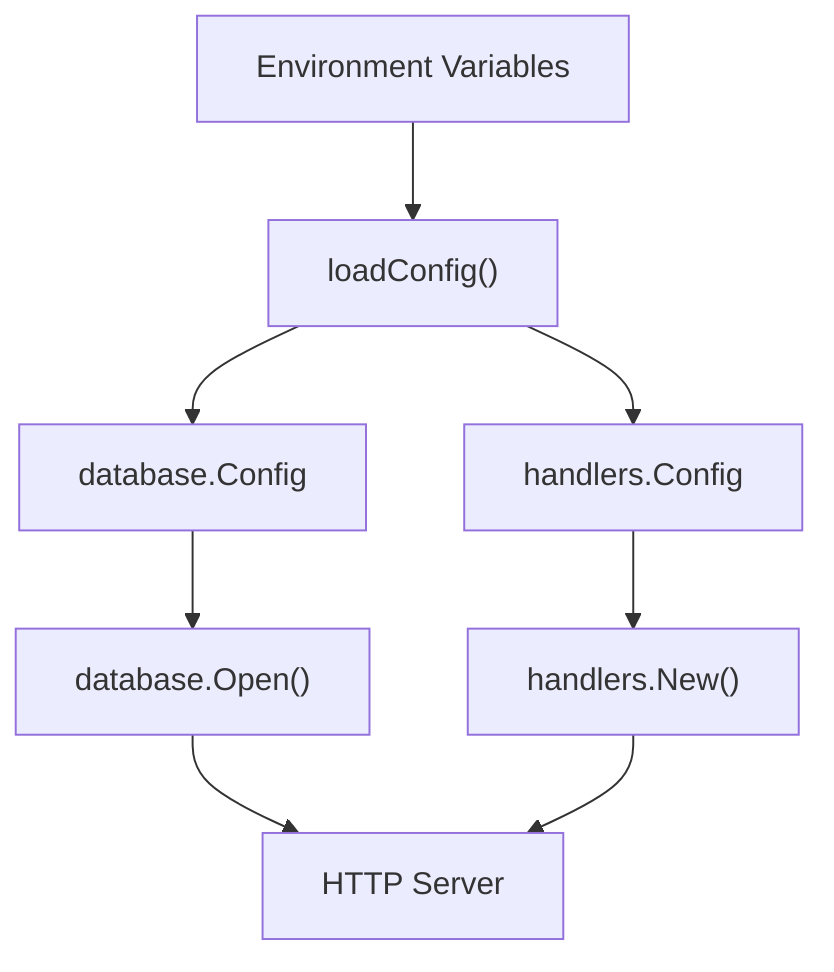
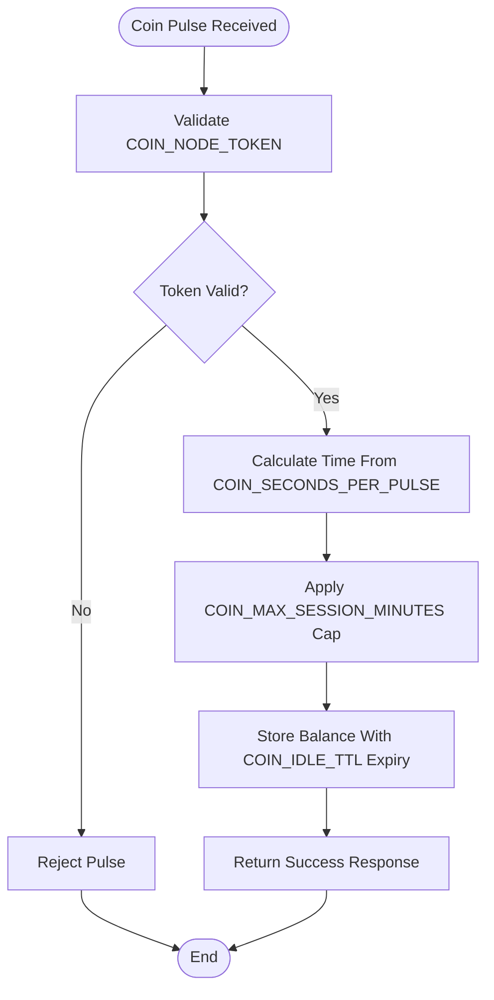
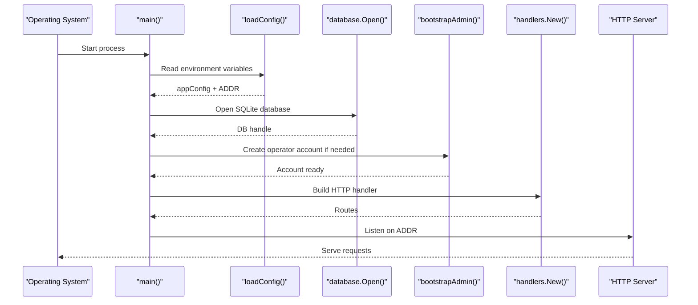
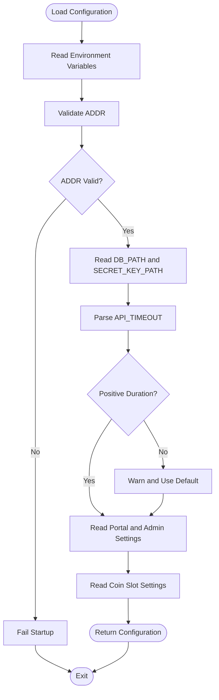
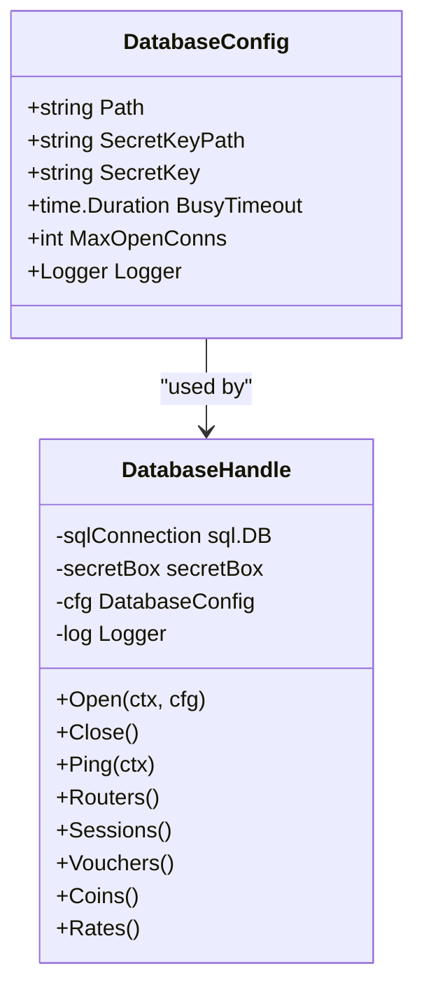
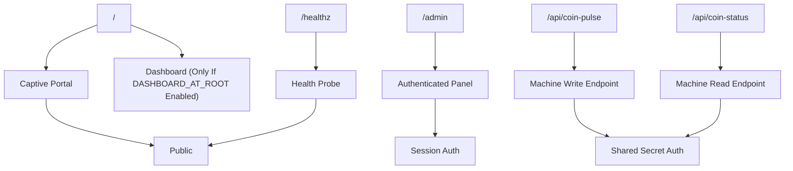
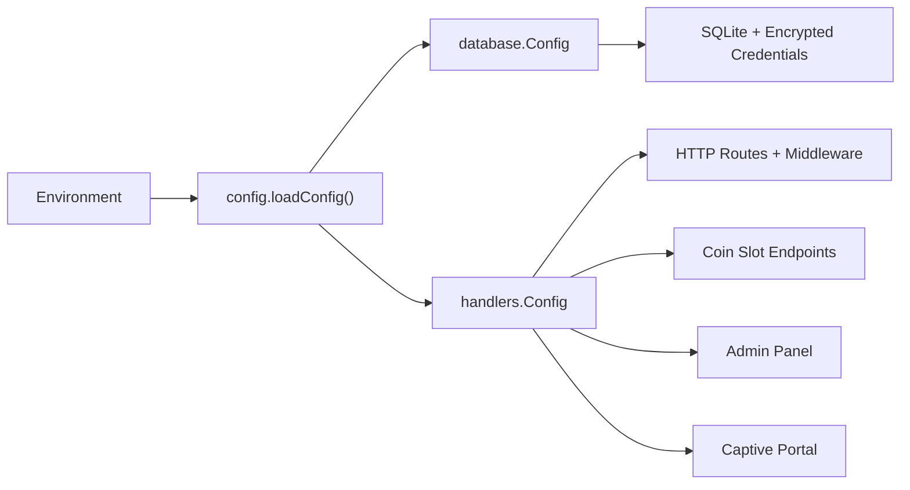

# Configuration Guide

<cite>
**Referenced Files in This Document**
- [config.go](file://config.go)
- [main.go](file://main.go)
- [handlers/handlers.go](file://handlers/handlers.go)
- [database/database.go](file://database/database.go)
- [README.md](file://README.md)
- [INSTALLATION.md](file://INSTALLATION.md)
</cite>

## Table of Contents
1. [Introduction](#introduction)
2. [Project Structure](#project-structure)
3. [Core Components](#core-components)
4. [Architecture Overview](#architecture-overview)
5. [Detailed Component Analysis](#detailed-component-analysis)
6. [Dependency Analysis](#dependency-analysis)
7. [Performance Considerations](#performance-considerations)
8. [Troubleshooting Guide](#troubleshooting-guide)
9. [Conclusion](#conclusion)

## Introduction
This document explains how to configure the Aircoins MikroTik Controller for production use. It covers every environment variable used by the application, including general settings, Piso Wi-Fi coin slot configuration, security options, and encryption behavior. It also provides common deployment scenarios and troubleshooting guidance based on the actual code paths that read and validate these values.

The controller is primarily environment-driven: `ADDR`, database paths, secret key location, portal branding, admin panel routing, session lifetime, API timeouts, cookie security, and version metadata are all loaded at startup before the HTTP server begins listening.

## Project Structure
At a high level, configuration flows from environment variables into two internal configuration objects:

- Database configuration controls SQLite file location, master key handling, connection pooling, and logging.
- Handler configuration controls HTTP routing, captive portal branding, admin panel behavior, coin-slot integration, and runtime security flags.

**Diagram sources**
- [config.go:14-77](file://config.go#L14-L77)
- [database/database.go:30-116](file://database/database.go#L30-L116)
- [handlers/handlers.go:28-173](file://handlers/handlers.go#L28-L173)

**Section sources**
- [config.go:14-77](file://config.go#L14-L77)
- [handlers/handlers.go:28-173](file://handlers/handlers.go#L28-L173)
- [database/database.go:30-116](file://database/database.go#L30-L116)

## Core Components
The configuration system is split across three main areas:

| Area | Responsibility | Key Files |
|---|---|---|
| Environment loader | Reads and validates environment variables, applies defaults, and returns structured configuration | [config.go](file://config.go) |
| HTTP handler configuration | Defines runtime behavior for routing, portal branding, admin panel, coin slot, and cookies | [handlers/handlers.go](file://handlers/handlers.go) |
| Database configuration | Defines SQLite path, master key source, connection pool, and persistence behavior | [database/database.go](file://database/database.go) |

### General Environment Variables

| Variable | Default | Type | Behavior and Notes |
|---|---:|---|---|
| `ADDR` | `:80` | Address string | Listen address for the HTTP server. Accepts `:port`, `host:port`, or a bare port number. Values outside `1..65535` cause startup failure. Port `80` requires root or `CAP_NET_BIND_SERVICE`. |
| `DB_PATH` | `data/aircoins.db` | File path | SQLite database file. The directory is created if missing. Tests may use `:memory:`. |
| `SECRET_KEY_PATH` | `data/secret.key` | File path | Location of the master key file used to encrypt router API passwords at rest. Created with restrictive permissions when missing. |
| `PORTAL_NAME` | `Aircoins Hotspot` | String | Branding text shown in the captive portal and operator dashboard. |
| `ADMIN_PATH` | `/admin` | URL prefix | Operator panel mount point. A trailing slash is normalized; an empty value becomes `/admin`. |
| `DASHBOARD_AT_ROOT` | Disabled | Boolean flag | When enabled, the operator dashboard is served at `/` and the captive portal moves under `/portal`. By default, `/` serves the captive portal. |
| `PORTAL_TAGLINE` | `Connect to the Wi-Fi to get online` | String | Welcome line displayed on the captive portal landing page. |
| `PORTAL_SUPPORT` | `Ask the front desk for a voucher code.` | String | Contact/help line shown on the captive portal landing page. |
| `ADMIN_USER` | `admin` | String | Operator username seeded only on first boot when no account exists. |
| `ADMIN_PASSWORD` | None | String | Password seeded only on first boot. If unset, a random password is generated once and logged. Changing it later has no effect after initial account creation; use the panel or `passwd` subcommand. |
| `DEFAULT_REDIRECT` | None | URL string | Fallback destination when the captive portal receives no `link-orig` parameter. Whitespace is trimmed. |
| `ADMIN_SESSION_TTL` | `12h` | Duration string | How long an administrator login remains valid. Invalid or non-positive durations are ignored and the default is used. |
| `API_TIMEOUT` | `12s` | Duration string | Timeout applied to individual RouterOS API calls. Must be a positive duration such as `12s`. |
| `SECURE_COOKIES` | Disabled | Boolean flag | Sets the `Secure` flag on cookies. Enable behind HTTPS so cookies are not sent over unencrypted connections. |
| `VERSION` | `dev` | String | Build-time version shown in the footer. Normally set via linker flags or installation metadata. |

#### Boolean Parsing Rules
Boolean-style environment variables accept case-insensitive values such as `1`, `true`, `yes`, or `on` to enable them. Any other value is treated as disabled.

#### Address Validation
`ADDR` is validated before the server starts. Valid forms include:

- `:80`
- `0.0.0.0:8080`
- `127.0.0.1:8080`
- A single numeric port between `1` and `65535`

Invalid addresses produce a startup error rather than silently falling back.

**Section sources**
- [config.go:20-77](file://config.go#L20-L77)
- [config.go:79-93](file://config.go#L79-L93)
- [config.go:128-149](file://config.go#L128-L149)
- [handlers/handlers.go:28-143](file://handlers/handlers.go#L28-L143)
- [main.go:36-57](file://main.go#L36-L57)
- [main.go:214-285](file://main.go#L214-L285)

### Piso Wi-Fi Coin Slot Configuration Variables

| Variable | Default | Type | Behavior and Notes |
|---|---:|---|---|
| `COIN_NODE_TOKEN` | None | Shared secret | Required machine-to-machine token presented by the NodeMCU coin acceptor. While unset, the coin pulse endpoint rejects every report, preventing free internet access from a publicly reachable controller. |
| `COIN_SECONDS_PER_PULSE` | `300` | Positive integer | Access time granted per coin pulse. A bad value is rejected and the default is used. |
| `COIN_CENTS_PER_PULSE` | `500` | Positive integer | Face value recorded for reconciliation. Does not change the time granted to customers. |
| `COIN_IDLE_TTL` | `20m` | Duration | Time after which an inserted-but-unconnected balance expires. Prevents one customer’s unused credit from being inherited by another device on the same IP/MAC. |
| `COIN_MAX_SESSION_MINUTES` | `240` | Positive integer | Maximum session length allowed when connecting immediately after inserting coins. Protects against jammed acceptors or misconfiguration. |

These variables are consumed by the coin-slot handlers and the background expiry sweeper. They do not need to be configured unless you have physical coin hardware connected to the controller.

**Diagram sources**
- [config.go:59-67](file://config.go#L59-L67)
- [handlers/handlers.go:66-85](file://handlers/handlers.go#L66-L85)

**Section sources**
- [config.go:59-67](file://config.go#L59-L67)
- [handlers/handlers.go:66-85](file://handlers/handlers.go#L66-L85)
- [README.md:91-106](file://README.md#L91-L106)

## Architecture Overview
The controller boots in this order:

1. Parse command-line arguments for special modes such as `--version` and `passwd`.
2. Load environment configuration through `loadConfig()`.
3. Open the SQLite database and apply migrations.
4. Bootstrap the operator account if none exists.
5. Create the HTTP handler with the resolved configuration.
6. Start the background coin-balance expiry sweeper.
7. Begin serving HTTP requests.

**Diagram sources**
- [main.go:36-57](file://main.go#L36-L57)
- [main.go:214-285](file://main.go#L214-L285)
- [config.go:20-77](file://config.go#L20-L77)
- [database/database.go:70-116](file://database/database.go#L70-L116)
- [handlers/handlers.go:160-173](file://handlers/handlers.go#L160-L173)

**Section sources**
- [main.go:36-57](file://main.go#L36-L57)
- [main.go:214-285](file://main.go#L214-L285)

## Detailed Component Analysis

### Environment Loading and Validation
The environment loader centralizes all configuration parsing. It uses helper functions to safely read strings, booleans, integers, and durations while preserving sensible defaults.

Key behaviors:

- Missing required values either receive safe defaults or fail fast (for example, invalid `ADDR`).
- Dangerous misconfiguration is guarded: zero or negative coin-pulse values fall back to defaults instead of making coins worthless.
- Invalid durations and timeouts are reported on stderr and ignored rather than stopping the service.
- `ADMIN_PASSWORD` is intentionally read directly because it may be empty, meaning “generate one.”
- `ADMIN_SESSION_TTL` is lenient: a typo does not prevent the hotspot controller from starting.

**Diagram sources**
- [config.go:20-77](file://config.go#L20-L77)
- [config.go:95-126](file://config.go#L95-L126)
- [config.go:128-149](file://config.go#L128-L149)

**Section sources**
- [config.go:20-77](file://config.go#L20-L77)
- [config.go:79-126](file://config.go#L79-L126)
- [config.go:128-149](file://config.go#L128-L149)

### Database and Encryption Configuration
The database configuration controls both persistence and encryption:

- `DB_PATH` selects the SQLite file or in-memory store.
- `SECRET_KEY_PATH` points to the master key file.
- An optional inline master key can override the file-based key.
- The database opens with WAL mode, foreign keys enabled, and a bounded busy timeout.
- Connection pooling is capped to a small number because SQLite serializes writers.

Router API passwords are encrypted at rest using AES-256-GCM with a master key. Without the master key, a stolen database cannot be decrypted.

**Diagram sources**
- [database/database.go:30-68](file://database/database.go#L30-L68)
- [database/database.go:70-116](file://database/database.go#L70-L116)
- [database/database.go:151-165](file://database/database.go#L151-L165)

**Section sources**
- [database/database.go:30-116](file://database/database.go#L30-L116)
- [README.md:108-109](file://README.md#L108-L109)

### HTTP Handler Configuration and Routing
The handler configuration determines how the web interface behaves:

- `PORTAL_NAME`, `PORTAL_TAGLINE`, and `PORTAL_SUPPORT` brand the captive portal.
- `ADMIN_PATH` controls where the operator panel is mounted.
- `DASHBOARD_AT_ROOT` switches between the default captive-portal-first layout and the legacy dashboard-at-root layout.
- `SECURE_COOKIES` sets the `Secure` flag on cookies used by the admin panel.
- `APITIMEOUT` bounds RouterOS API calls.
- Coin-slot variables control machine-facing endpoints and session caps.

The route table deliberately separates public guest-facing routes from authenticated admin routes. Public routes include the captive portal, health check, coin-slot machine API, and operating-system captive-probe endpoints.

**Diagram sources**
- [handlers/handlers.go:222-303](file://handlers/handlers.go#L222-L303)
- [handlers/handlers.go:305-441](file://handlers/handlers.go#L305-L441)

**Section sources**
- [handlers/handlers.go:28-143](file://handlers/handlers.go#L28-L143)
- [handlers/handlers.go:222-303](file://handlers/handlers.go#L222-L303)
- [handlers/handlers.go:305-441](file://handlers/handlers.go#L305-L441)

### Security Settings and Best Practices
Security-related configuration appears in multiple layers:

| Setting | Purpose | Production Recommendation |
|---|---|---|
| `SECURE_COOKIES=1` | Marks admin cookies as secure | Enable behind HTTPS or a TLS-terminating reverse proxy |
| `ADMIN_PASSWORD` | Seeds the first operator account | Set explicitly on first boot; otherwise capture the generated password from logs |
| `ADMIN_SESSION_TTL` | Controls admin session lifetime | Keep reasonable; shorter TTL reduces risk of stale sessions |
| `API_TIMEOUT` | Limits RouterOS API call duration | Tune according to network latency and router load |
| `COIN_NODE_TOKEN` | Authenticates coin-slot hardware | Generate a strong random token and never expose it in logs or public URLs |
| `DB_PATH` | SQLite database location | Place on persistent, backed-up storage with restricted filesystem permissions |
| `SECRET_KEY_PATH` | Master encryption key location | Back up securely; without it, encrypted router credentials are unrecoverable |

Additional built-in protections include:

- CSRF protection for admin form submissions.
- Captive portal login rate limiting.
- Brute-force protection for panel sign-in attempts.
- Minimum password length enforcement.
- Strict content security headers.
- Redirect validation to prevent open redirects.
- Machine-only authentication for coin-slot endpoints.

**Section sources**
- [handlers/handlers.go:498-525](file://handlers/handlers.go#L498-L525)
- [handlers/handlers.go:546-590](file://handlers/handlers.go#L546-L590)
- [handlers/handlers.go:592-625](file://handlers/handlers.go#L592-L625)
- [README.md:111-140](file://README.md#L111-L140)

### Common Configuration Scenarios

#### Scenario 1: Default Local Deployment
Use this when running locally or on a private board without HTTPS:

- `ADDR=:8080`
- `DB_PATH=/var/lib/aircoins/aircoins.db`
- `SECRET_KEY_PATH=/var/lib/aircoins/secret.key`
- `PORTAL_NAME="My Hotspot"`
- Leave `SECURE_COOKIES` disabled.

This avoids privileged-port issues and keeps the captive portal accessible without TLS.

#### Scenario 2: Reverse Proxy Behind Nginx or Caddy
Use this when terminating HTTPS externally:

- `ADDR=127.0.0.1:8080`
- `SECURE_COOKIES=1`
- Ensure the reverse proxy forwards `X-Forwarded-For`, `X-Real-IP`, and `X-Forwarded-Proto`.
- Keep the MikroTik hotspot redirect pointing at the public HTTPS URL.

#### Scenario 3: Piso Wi-Fi Coin Hardware
Use this when integrating a NodeMCU coin acceptor:

- Generate a strong `COIN_NODE_TOKEN`.
- Set `COIN_SECONDS_PER_PULSE` to match your acceptor’s time-per-pulse behavior.
- Set `COIN_CENTS_PER_PULSE` to your currency’s smallest unit.
- Tune `COIN_IDLE_TTL` so balances expire before another user inherits them.
- Set `COIN_MAX_SESSION_MINUTES` to guard against stuck hardware.

#### Scenario 4: Legacy Dashboard Layout
Use this only if you need the operator dashboard at `/`:

- Set `DASHBOARD_AT_ROOT=1`.
- Understand that guests opening the controller IP will see the dashboard instead of the captive portal.
- Prefer keeping the default captive-portal-first layout for security.

**Section sources**
- [INSTALLATION.md:236-258](file://INSTALLATION.md#L236-L258)
- [README.md:70-106](file://README.md#L70-L106)
- [config.go:35-46](file://config.go#L35-L46)
- [config.go:59-67](file://config.go#L59-L67)

## Dependency Analysis
Configuration dependencies flow from environment variables into runtime components:

**Diagram sources**
- [config.go:14-77](file://config.go#L14-L77)
- [handlers/handlers.go:28-173](file://handlers/handlers.go#L28-L173)
- [database/database.go:30-116](file://database/database.go#L30-L116)

**Section sources**
- [config.go:14-77](file://config.go#L14-L77)
- [handlers/handlers.go:28-173](file://handlers/handlers.go#L28-L173)
- [database/database.go:30-116](file://database/database.go#L30-L116)

## Performance Considerations
- `API_TIMEOUT` should reflect typical RouterOS response times. Too short causes frequent timeouts; too long delays error reporting.
- `DB_PATH` should reside on reliable storage. SQLite performance benefits from a small connection pool, which the database layer already limits.
- `COIN_IDLE_TTL` should balance usability and fairness. Too long risks accidental credit inheritance; too short frustrates users who insert coins but delay connection.
- `COIN_MAX_SESSION_MINUTES` protects against hardware faults. Keep it low enough to limit damage from a jammed coin slot.
- Behind a reverse proxy, ensure request size limits and timeouts are aligned with the controller’s own body-size limits and middleware behavior.

[No sources needed since this section provides general guidance]

## Troubleshooting Guide

### Service Cannot Bind Port 80
**Symptoms:**
- Error mentioning permission denied or privileged ports.
- Manual run fails even though the systemd service works.

**Cause:**
Port `80` requires root or `CAP_NET_BIND_SERVICE`.

**Resolution:**
- Run with elevated privileges, or
- Add the capability through systemd, or
- Change `ADDR` to a higher port such as `:8080`.

**Section sources**
- [main.go:340-349](file://main.go#L340-L349)
- [INSTALLATION.md:198-218](file://INSTALLATION.md#L198-L218)

### Invalid or Unexpected ADDR Value
**Symptoms:**
- Startup fails with an invalid address error.
- The service listens on a different port than expected.

**Cause:**
`ADDR` must be a valid host/port combination or a numeric port in range.

**Resolution:**
Use `:80`, `0.0.0.0:8080`, or `127.0.0.1:8080`. Avoid malformed values like missing ports or out-of-range numbers.

**Section sources**
- [config.go:69-76](file://config.go#L69-L76)
- [config.go:128-149](file://config.go#L128-L149)

### ADMIN_PASSWORD Not Working After First Boot
**Symptoms:**
- Changing `ADMIN_PASSWORD` in the environment does not update the existing operator account.

**Cause:**
`ADMIN_USER` and `ADMIN_PASSWORD` seed the account only when no operator account exists.

**Resolution:**
Use the panel’s Settings page or the `aircoins-controller passwd` subcommand to update credentials.

**Section sources**
- [config.go:40-46](file://config.go#L40-L46)
- [main.go:287-327](file://main.go#L287-L327)
- [README.md:21-42](file://README.md#L21-L42)

### Invalid ADMIN_SESSION_TTL or API_TIMEOUT
**Symptoms:**
- Warning messages about ignoring invalid durations.
- Service continues running with default timeouts.

**Cause:**
Duration parsing failed or the value was non-positive.

**Resolution:**
Use Go duration syntax such as `12h`, `30m`, or `12s`. Do not use units like `5m` for integer fields.

**Section sources**
- [config.go:26-31](file://config.go#L26-L31)
- [config.go:48-57](file://config.go#L48-L57)
- [config.go:114-126](file://config.go#L114-L126)

### Coin Slot Pulses Rejected
**Symptoms:**
- Coin pulses are ignored.
- No balance is added.

**Cause:**
`COIN_NODE_TOKEN` is unset or incorrect.

**Resolution:**
Set a strong shared secret and ensure the NodeMCU presents it exactly as configured.

**Section sources**
- [config.go:59-63](file://config.go#L59-L63)
- [handlers/handlers.go:66-70](file://handlers/handlers.go#L66-L70)
- [README.md:91-106](file://README.md#L91-L106)

### Cookies Not Sent Over HTTPS
**Symptoms:**
- Admin sessions fail when accessed through HTTPS.
- Login redirects or session loss occur behind a reverse proxy.

**Cause:**
`SECURE_COOKIES` is not enabled while traffic is terminated over TLS.

**Resolution:**
Enable `SECURE_COOKIES=1` behind HTTPS or a TLS-terminating reverse proxy.

**Section sources**
- [config.go:46-46](file://config.go#L46-L46)
- [handlers/handlers.go:50-52](file://handlers/handlers.go#L50-L52)
- [README.md:139-140](file://README.md#L139-L140)

### Lost Master Key
**Symptoms:**
- Router credentials cannot be decrypted.
- Database backups exist but router passwords are unreadable.

**Cause:**
The master key file referenced by `SECRET_KEY_PATH` is missing or changed.

**Resolution:**
Restore the original `secret.key`. If lost, re-enter router credentials.

**Section sources**
- [database/database.go:30-47](file://database/database.go#L30-L47)
- [database/database.go:86-90](file://database/database.go#L86-L90)
- [INSTALLATION.md:101-105](file://INSTALLATION.md#L101-L105)
- [INSTALLATION.md:153](file://INSTALLATION.md#L153)

## Conclusion
The Aircoins MikroTik Controller relies on a small, explicit set of environment variables. For production deployments:

- Always set `DB_PATH` and `SECRET_KEY_PATH` to persistent, protected locations.
- Configure `ADDR` appropriately for your deployment model.
- Seed `ADMIN_PASSWORD` on first boot or capture the generated password.
- Enable `SECURE_COOKIES=1` behind HTTPS.
- Tune `API_TIMEOUT`, `ADMIN_SESSION_TTL`, and coin-slot variables to match your network and hardware.
- Treat `COIN_NODE_TOKEN` as a machine secret.
- Back up the master key alongside the database.

When in doubt, prefer the defaults provided by the code: they are designed to keep the controller booting safely while avoiding dangerous zero-value behavior.

[No sources needed since this section summarizes without analyzing specific files]