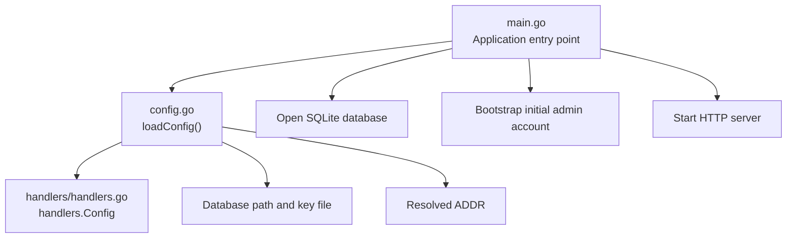
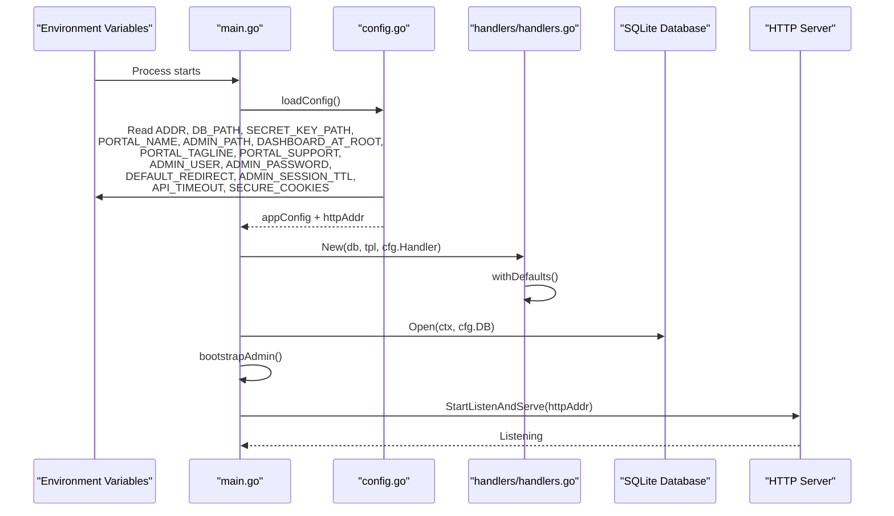
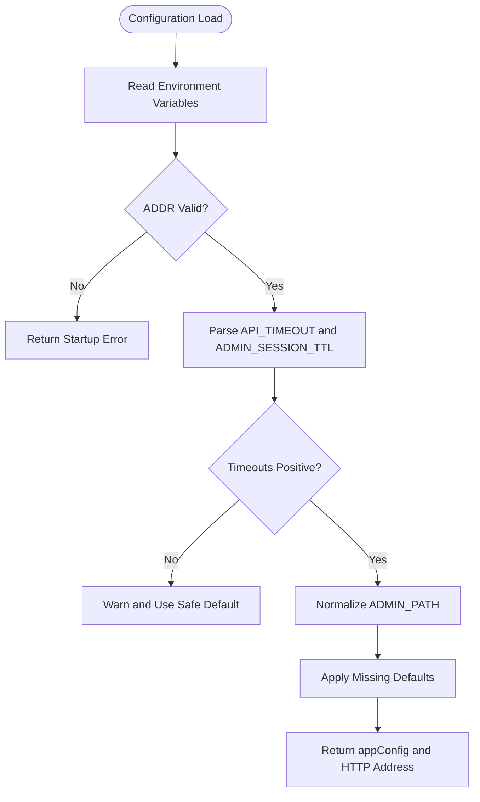
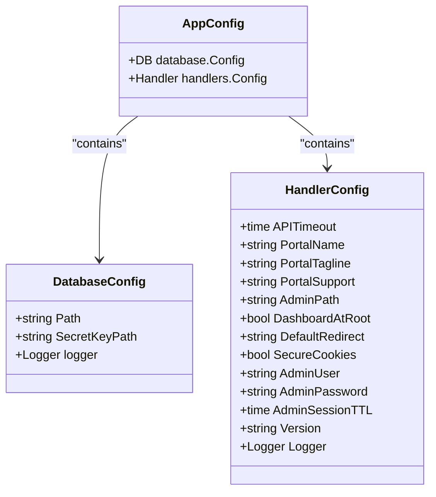
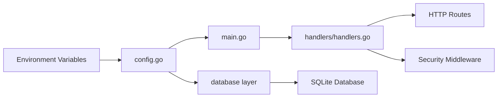

# Core Configuration

<cite>
**Referenced Files in This Document**
- [config.go](file://config.go)
- [main.go](file://main.go)
- [handlers.go](file://handlers/handlers.go)
- [README.md](file://README.md)
</cite>

## Table of Contents
1. [Introduction](#introduction)
2. [Project Structure](#project-structure)
3. [Core Components](#core-components)
4. [Architecture Overview](#architecture-overview)
5. [Detailed Component Analysis](#detailed-component-analysis)
6. [Dependency Analysis](#dependency-analysis)
7. [Performance Considerations](#performance-considerations)
8. [Troubleshooting Guide](#troubleshooting-guide)
9. [Conclusion](#conclusion)

## Introduction
This document explains the core configuration options for the Aircoins MikroTik Controller, focusing on environment variables that control server binding, database storage, encryption keys, captive portal branding, operator panel routing, authentication behavior, API timeouts, cookie security, and application versioning. It also provides practical configuration examples for development, staging, and production deployments.

The controller is environment-driven: it reads its runtime settings from process environment variables at startup, validates them, applies safe defaults where appropriate, and then starts the HTTP server with the configured handler and database layer.

## Project Structure
At a high level, configuration loading happens early in the application lifecycle:

- `main.go` initializes logging, loads configuration, opens the database, boots the admin account if needed, constructs the HTTP server, and starts listening.
- `config.go` parses environment variables into an internal configuration structure, validates critical values such as listen address and timeouts, and returns both the configuration and the resolved HTTP address.
- `handlers/handlers.go` defines the HTTP-layer configuration struct used by the router, templates, and middleware, including fields for portal branding, admin path, session TTL, secure cookies, and API timeout.

**Diagram sources**
- [main.go:36-57](file://main.go#L36-L57)
- [main.go:214-285](file://main.go#L214-L285)
- [config.go:20-77](file://config.go#L20-L77)
- [handlers.go:28-90](file://handlers/handlers.go#L28-L90)

**Section sources**
- [main.go:1-57](file://main.go#L1-L57)
- [config.go:1-77](file://config.go#L1-L77)
- [handlers.go:1-90](file://handlers/handlers.go#L1-L90)

## Core Components
The core configuration is split between two layers:

1. **Environment loader (`config.go`)**
   - Reads environment variables.
   - Applies validation and safe fallbacks.
   - Produces an internal `appConfig` containing database settings and handler settings.

2. **HTTP-layer configuration (`handlers/handlers.go`)**
   - Holds runtime values used by routes, templates, CSRF handling, session behavior, and API timeouts.
   - Normalizes values through `withDefaults()` so invalid or missing values do not break the service.

Key responsibilities:
- Server binding: `ADDR`
- Storage and encryption: `DB_PATH`, `SECRET_KEY_PATH`
- Captive portal branding: `PORTAL_NAME`, `PORTAL_TAGLINE`, `PORTAL_SUPPORT`
- Operator panel routing: `ADMIN_PATH`, `DASHBOARD_AT_ROOT`
- Initial operator credentials: `ADMIN_USER`, `ADMIN_PASSWORD`
- Portal redirect behavior: `DEFAULT_REDIRECT`
- Session lifetime: `ADMIN_SESSION_TTL`
- RouterOS API timeout: `API_TIMEOUT`
- Cookie security: `SECURE_COOKIES`
- Application version display: `VERSION`

**Section sources**
- [config.go:14-77](file://config.go#L14-L77)
- [handlers.go:28-90](file://handlers/handlers.go#L28-L90)

## Architecture Overview
The following diagram shows how environment configuration flows into the running system.

**Diagram sources**
- [main.go:214-285](file://main.go#L214-L285)
- [config.go:20-77](file://config.go#L20-L77)
- [handlers.go:160-173](file://handlers/handlers.go#L160-L173)

## Detailed Component Analysis

### Environment Variable Reference

| Variable | Default | Purpose | Valid Format / Behavior | Security Implications |
|---|---:|---|---|---|
| `ADDR` | `:80` | Controls which host and port the HTTP server listens on. | Accepts `:port`, `host:port`, or a bare integer port. Must be within 1–65535. Invalid values cause startup failure. | Binding to privileged ports like 80 requires elevated privileges or capabilities. Misconfiguration can prevent the service from starting or expose it on the wrong interface. |
| `DB_PATH` | `data/aircoins.db` | Location of the SQLite database file. | Filesystem path string. Tests may use in-memory databases, but production should use a persistent path. | The database contains encrypted router credentials and session data. Protect file permissions and backups. |
| `SECRET_KEY_PATH` | `data/secret.key` | Path to the master encryption key file used to encrypt sensitive data at rest. | Filesystem path. The key file is created with restrictive permissions. | Losing this key makes stored encrypted data unrecoverable. Compromising it exposes encrypted secrets. |
| `PORTAL_NAME` | `Aircoins Hotspot` | Brand name shown on the captive portal and in the operator panel footer. | Free-form text; empty values are normalized to the default. | Primarily UI branding; low security impact. |
| `ADMIN_PATH` | `/admin` | URL prefix for the operator panel. | Clean absolute path without trailing slash; normalized internally. | Changing this does not replace authentication; keep it distinct from public portal paths. |
| `DASHBOARD_AT_ROOT` | Disabled | When enabled, places the dashboard at `/` and moves the captive portal to `/portal`. | Boolean-like value: `1`, `true`, `yes`, or `on` enable it. | Enabling it changes the root route behavior; ensure guests do not accidentally reach the dashboard. |
| `PORTAL_TAGLINE` | `Connect to the Wi-Fi to get online` | Welcome line displayed on the captive portal landing page. | Free-form text; empty values are normalized to the default. | Low security impact; mainly user-facing messaging. |
| `PORTAL_SUPPORT` | `Ask the front desk for a voucher code.` | Support contact line on the captive portal landing page. | Free-form text; empty values are normalized to the default. | Low security impact; mainly user-facing messaging. |
| `ADMIN_USER` | `admin` | Operator username seeded only during first boot when no account exists. | Username string; normalized and validated by the admin store. | Only affects initial account creation. Existing accounts are not overwritten. |
| `ADMIN_PASSWORD` | Not set | Password seeded only during first boot when no account exists. If unset, a random password is generated and logged once. | String; must meet minimum length requirements. | Never commit this value. Treat logs carefully because a generated password is printed once. |
| `DEFAULT_REDIRECT` | Not set | Fallback redirect destination when the hotspot does not provide `link-orig`. | URL string; trimmed before use. | Should point to a trusted destination. Avoid open redirects. |
| `ADMIN_SESSION_TTL` | `12h` | How long an operator panel login remains valid. | Go duration string such as `12h`, `30m`, `2h30m`. Non-positive or unparsable values are ignored and fall back to defaults. | Shorter TTL reduces window for stolen sessions; longer TTL increases convenience but raises risk. |
| `API_TIMEOUT` | `12s` | Timeout for individual RouterOS API calls. | Go duration string such as `12s`, `5s`, `30s`. Must be positive. | Too short causes frequent API failures; too long delays error detection and resource cleanup. |
| `SECURE_COOKIES` | Disabled | Sets the `Secure` flag on cookies, including CSRF and session cookies. | Boolean-like value: `1`, `true`, `yes`, or `on` enables it. | Enable only behind HTTPS. Without TLS, enabling it can break cookie delivery. |
| `VERSION` | `dev` | Application version displayed in the operator panel footer. | Build-time string; overridden via linker flags. | Informational only; avoid exposing unnecessary version details in production if desired. |

**Section sources**
- [config.go:20-77](file://config.go#L20-L77)
- [handlers.go:28-90](file://handlers/handlers.go#L28-L90)
- [README.md:70-89](file://README.md#L70-L89)

### Validation and Defaults

#### Address Validation
The controller validates `ADDR` before starting. It accepts:
- A bare port number.
- A `host:port` pair.
- Rejects invalid ranges, malformed strings, and empty addresses.

If the address is invalid, startup fails with a clear error message.

#### Duration Validation
Both `API_TIMEOUT` and `ADMIN_SESSION_TTL` are parsed as durations:
- Positive durations are accepted.
- Invalid or non-positive values are rejected.
- For `ADMIN_SESSION_TTL`, invalid values are ignored rather than fatal, allowing the controller to boot safely while warning on stderr.

#### Boolean Flags
Flags such as `DASHBOARD_AT_ROOT` and `SECURE_COOKIES` accept common boolean-like inputs:
- Enabled: `1`, `true`, `yes`, `on`
- Disabled: anything else

#### Admin Path Normalization
`ADMIN_PATH` is normalized to a clean absolute path without a trailing slash. If set to `/`, it is normalized to `/admin` to preserve the intended separation between the captive portal and the operator panel.

#### Safe Defaults
Missing or empty values are filled with safe defaults:
- Portal branding defaults prevent blank UI text.
- API timeout defaults protect against unbounded RouterOS calls.
- Session TTL defaults balance usability and security.
- Version defaults ensure the footer always shows a value.

**Diagram sources**
- [config.go:20-77](file://config.go#L20-L77)
- [config.go:79-126](file://config.go#L79-L126)
- [config.go:128-149](file://config.go#L128-L149)
- [handlers.go:92-143](file://handlers/handlers.go#L92-L143)

**Section sources**
- [config.go:20-77](file://config.go#L20-L77)
- [config.go:79-149](file://config.go#L79-L149)
- [handlers.go:92-143](file://handlers/handlers.go#L92-L143)

### Security Model Around Configuration

#### Encryption Key Handling
- `DB_PATH` points to the SQLite database.
- `SECRET_KEY_PATH` points to the master key file.
- RouterOS passwords are encrypted at rest using AES-256-GCM with the master key.
- Without the master key, a stolen database file cannot decrypt stored credentials.

#### Initial Admin Account
- On first boot, if no admin account exists, the controller creates one.
- If `ADMIN_PASSWORD` is set, it is used.
- If `ADMIN_PASSWORD` is unset, a random password is generated and logged once.
- After the first boot, changing `ADMIN_USER` or `ADMIN_PASSWORD` has no effect; operators must use the panel settings or the `passwd` subcommand.

#### Cookie Security
- Session cookies are `HttpOnly` and `SameSite=Lax`.
- CSRF tokens are issued per browser session.
- `SECURE_COOKIES=1` sets the `Secure` flag, ensuring cookies are only sent over HTTPS.

**Diagram sources**
- [config.go:14-18](file://config.go#L14-L18)
- [handlers.go:28-90](file://handlers/handlers.go#L28-L90)

**Section sources**
- [README.md:108-140](file://README.md#L108-L140)
- [main.go:287-327](file://main.go#L287-L327)
- [handlers.go:598-614](file://handlers/handlers.go#L598-L614)

### Practical Configuration Scenarios

#### Development Setup
Development focuses on ease of access and minimal privilege requirements:
- Bind to a non-privileged port.
- Use a temporary database location.
- Keep branding simple.
- Disable secure cookies unless testing behind local HTTPS.
- Use shorter API timeouts to detect misconfigured routers quickly.

Example environment:
- `ADDR=:8080`
- `DB_PATH=/tmp/aircoins-dev.db`
- `SECRET_KEY_PATH=/tmp/aircoins-secret.key`
- `PORTAL_NAME=Dev Hotspot`
- `ADMIN_PATH=/admin`
- `DASHBOARD_AT_ROOT=`
- `PORTAL_TAGLINE=Development Portal`
- `PORTAL_SUPPORT=Contact dev team`
- `ADMIN_USER=admin`
- `ADMIN_PASSWORD=`
- `DEFAULT_REDIRECT=`
- `ADMIN_SESSION_TTL=1h`
- `API_TIMEOUT=5s`
- `SECURE_COOKIES=`
- `VERSION=dev`

Notes:
- Leaving `ADMIN_PASSWORD` unset generates a random password on first boot.
- Using `/tmp` ensures the database is ephemeral.
- Port 8080 avoids needing elevated privileges.

#### Staging Setup
Staging should resemble production more closely:
- Use a dedicated database directory.
- Store the secret key outside world-readable locations.
- Set explicit portal branding.
- Pin session TTL and API timeout to realistic values.
- Test secure cookies behind a reverse proxy with TLS.

Example environment:
- `ADDR=:8080`
- `DB_PATH=/var/lib/aircoins/staging.db`
- `SECRET_KEY_PATH=/var/lib/aircoins/staging-secret.key`
- `PORTAL_NAME=Staging Hotspot`
- `ADMIN_PATH=/admin`
- `DASHBOARD_AT_ROOT=`
- `PORTAL_TAGLINE=Staging Wi-Fi Portal`
- `PORTAL_SUPPORT=Contact support@example.com`
- `ADMIN_USER=staging-admin`
- `ADMIN_PASSWORD=<strong-random-password>`
- `DEFAULT_REDIRECT=https://example.com`
- `ADMIN_SESSION_TTL=8h`
- `API_TIMEOUT=12s`
- `SECURE_COOKIES=1`
- `VERSION=1.0.0-staging`

Notes:
- `SECURE_COOKIES=1` requires HTTPS termination at a reverse proxy.
- `DEFAULT_REDIRECT` should point to a trusted domain.
- Use a strong, unique password for staging.

#### Production Setup
Production should minimize exposure and maximize operational safety:
- Bind only to the required interface or use a reverse proxy.
- Use persistent, protected database and key files.
- Set explicit portal branding and support contact.
- Restrict admin path and disable dashboard-at-root unless explicitly required.
- Use reasonable session TTL and API timeout values.
- Enable secure cookies behind TLS.
- Set a meaningful version for auditability.

Example environment:
- `ADDR=:80`
- `DB_PATH=/var/lib/aircoins/aircoins.db`
- `SECRET_KEY_PATH=/var/lib/aircoins/secret.key`
- `PORTAL_NAME=Company Hotspot`
- `ADMIN_PATH=/admin`
- `DASHBOARD_AT_ROOT=`
- `PORTAL_TAGLINE=Connect to Company Wi-Fi`
- `PORTAL_SUPPORT=IT Helpdesk`
- `ADMIN_USER=operator`
- `ADMIN_PASSWORD=<strong-random-password>`
- `DEFAULT_REDIRECT=https://www.company.com`
- `ADMIN_SESSION_TTL=12h`
- `API_TIMEOUT=12s`
- `SECURE_COOKIES=1`
- `VERSION=1.0.0`

Notes:
- Port 80 requires elevated privileges or capability configuration.
- The secret key file should have restrictive filesystem permissions.
- Back up the database and secret key securely.
- Rotate operator credentials through the panel or `passwd` subcommand.

**Section sources**
- [README.md:70-89](file://README.md#L70-L89)
- [config.go:20-77](file://config.go#L20-L77)
- [handlers.go:92-143](file://handlers/handlers.go#L92-L143)

## Dependency Analysis
The configuration dependencies form a clear chain:

- `main.go` depends on `config.go` to obtain runtime configuration.
- `config.go` depends on environment variables and produces both database configuration and handler configuration.
- `handlers/handlers.go` consumes handler configuration to build routes, middleware, and template context.
- The database layer depends on `DB_PATH` and `SECRET_KEY_PATH` for persistence and encryption.

**Diagram sources**
- [main.go:214-285](file://main.go#L214-L285)
- [config.go:20-77](file://config.go#L20-L77)
- [handlers.go:234-303](file://handlers/handlers.go#L234-L303)

**Section sources**
- [main.go:214-285](file://main.go#L214-L285)
- [config.go:20-77](file://config.go#L20-L77)
- [handlers.go:234-303](file://handlers/handlers.go#L234-L303)

## Performance Considerations
- `API_TIMEOUT` controls how long each RouterOS API call waits. Tune this based on network latency and router responsiveness.
- `ADMIN_SESSION_TTL` balances convenience and security. Longer sessions reduce re-authentication but increase exposure if a session is compromised.
- `SECURE_COOKIES` should be enabled behind HTTPS to prevent accidental cleartext cookie transmission.
- `DB_PATH` should point to fast, reliable storage. SQLite performance benefits from proper filesystem tuning and backup strategies.
- Avoid overly broad `DEFAULT_REDIRECT` values that could introduce unnecessary external network calls.

[No sources needed since this section provides general guidance]

## Troubleshooting Guide

### Common Issues

| Symptom | Likely Cause | Resolution |
|---|---|---|
| Service fails to start with address error | `ADDR` is invalid or uses a privileged port without proper privileges | Verify format and range; use a non-privileged port or configure capabilities. |
| Panel login does not work after first boot | Changed `ADMIN_USER` or `ADMIN_PASSWORD` after initial account was created | Use `/admin/settings` or the `passwd` subcommand to update credentials. |
| Cookies not delivered | `SECURE_COOKIES=1` enabled without HTTPS | Terminate TLS at a reverse proxy or disable secure cookies for non-TLS testing. |
| RouterOS calls fail quickly | `API_TIMEOUT` too short | Increase timeout to match network conditions. |
| Dashboard appears at root unexpectedly | `DASHBOARD_AT_ROOT` enabled | Disable the flag to restore captive portal at `/`. |
| Database cannot be read | Wrong `DB_PATH` or missing `SECRET_KEY_PATH` | Confirm file paths and permissions; ensure the secret key exists. |

### Debugging Steps
1. Check startup logs for configuration warnings.
2. Verify environment variables are set correctly in the service manager.
3. Confirm filesystem permissions for `DB_PATH` and `SECRET_KEY_PATH`.
4. Test connectivity to RouterOS devices independently.
5. Review whether TLS is properly configured when `SECURE_COOKIES=1`.

**Section sources**
- [config.go:20-77](file://config.go#L20-L77)
- [config.go:128-149](file://config.go#L128-L149)
- [main.go:340-349](file://main.go#L340-L349)
- [README.md:70-89](file://README.md#L70-L89)

## Conclusion
The Aircoins MikroTik Controller’s configuration model is intentionally simple and resilient: environment variables are read early, validated where necessary, and backed by safe defaults. This design supports quick development iteration while remaining suitable for staged and production environments.

For secure operations:
- Protect `DB_PATH` and `SECRET_KEY_PATH`.
- Use strong initial credentials or rely on generated passwords.
- Enable `SECURE_COOKIES` behind HTTPS.
- Tune `API_TIMEOUT` and `ADMIN_SESSION_TTL` for your deployment.
- Keep `ADMIN_PATH` separate from public portal routes.
- Treat `VERSION` as an operational identifier for audits and upgrades.

With these controls understood, you can confidently deploy the controller across development, staging, and production environments while maintaining security, reliability, and operational clarity.