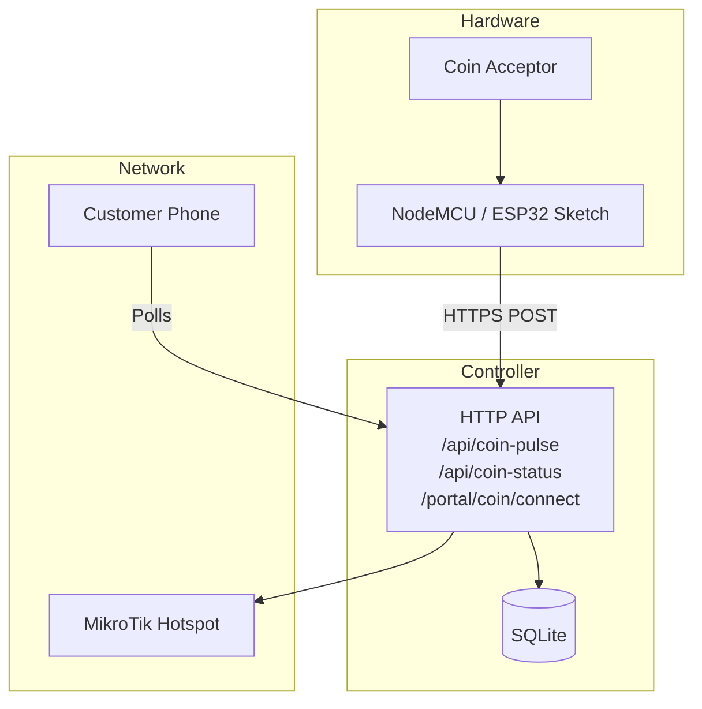
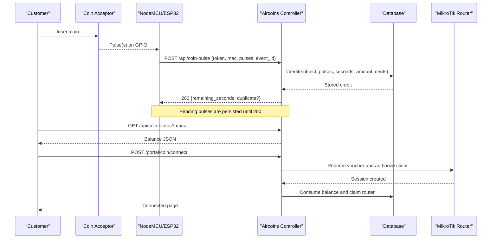
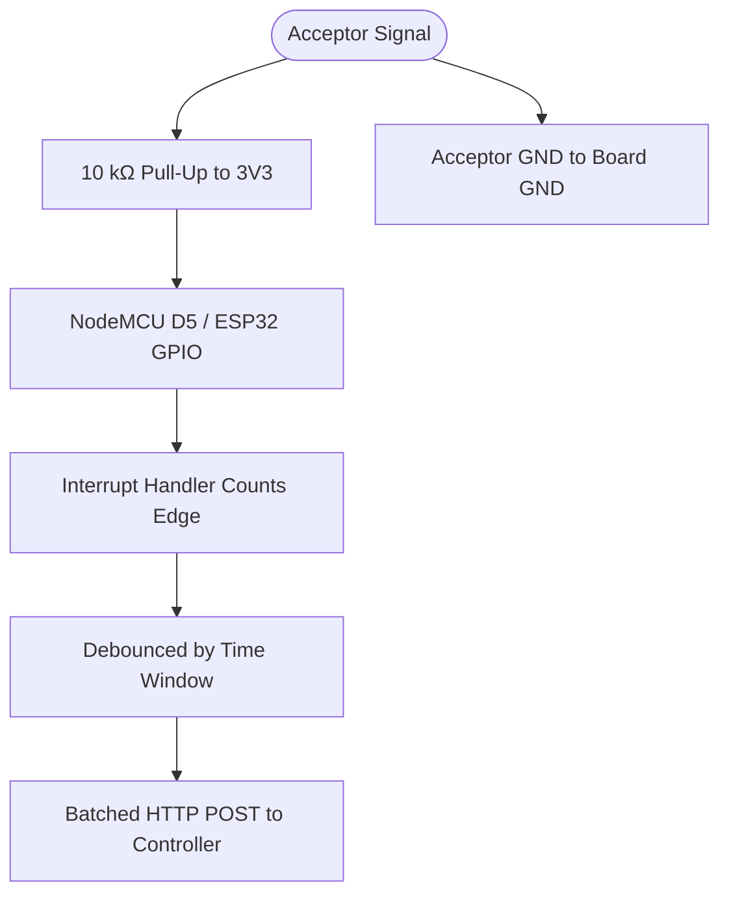
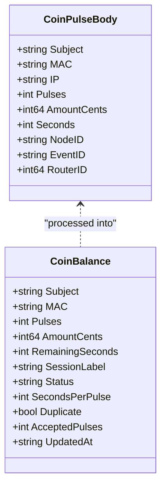
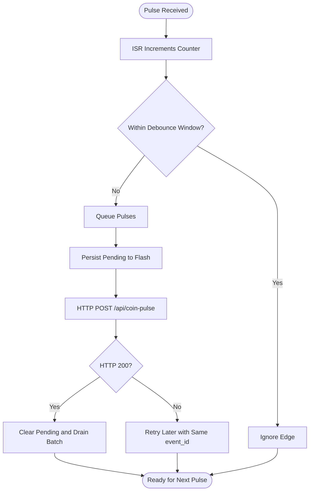
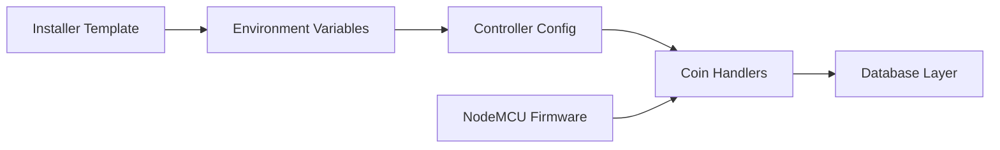

# Hardware Configuration

<cite>
**Referenced Files in This Document**
- [config.go](file://config.go)
- [handlers/coin.go](file://handlers/coin.go)
- [hardware/nodemcu_coin_slot/README.md](file://hardware/nodemcu_coin_slot/README.md)
- [hardware/nodemcu_coin_slot/nodemcu_coin_slot.ino](file://hardware/nodemcu_coin_slot/nodemcu_coin_slot.ino)
- [database/coins.go](file://database/coins.go)
- [install.sh](file://install.sh)
</cite>

## Table of Contents
1. [Introduction](#introduction)
2. [Project Structure](#project-structure)
3. [Core Components](#core-components)
4. [Architecture Overview](#architecture-overview)
5. [Detailed Component Analysis](#detailed-component-analysis)
6. [Dependency Analysis](#dependency-analysis)
7. [Performance Considerations](#performance-considerations)
8. [Troubleshooting Guide](#troubleshooting-guide)
9. [Conclusion](#conclusion)
10. [Appendices](#appendices)

## Introduction
This document explains how to configure and operate the Piso Wi-Fi coin slot integration between a NodeMCU/ESP32 acceptor, the Aircoins controller, and a MikroTik hotspot. It covers:
- All coin-slot environment variables on the controller
- NodeMCU firmware setup and configuration constants
- Hardware wiring for common pulse-type coin acceptors
- Network configuration for the acceptor board
- Calibration procedures for time and monetary value per pulse
- Troubleshooting for connectivity, signal interference, and detection failures
- Example configurations and performance tuning recommendations

The system is designed so that a coin is never lost and never counted twice. The hardware counts pulses; the controller prices them into access time; the customer’s phone polls the controller for balance rather than talking directly to the hardware.

**Section sources**
- [hardware/nodemcu_coin_slot/README.md:1-24](file://hardware/nodemcu_coin_slot/README.md#L1-L24)
- [handlers/coin.go:1-10](file://handlers/coin.go#L1-L10)

## Project Structure
The coin-slot integration spans three layers:
- Hardware layer: ESP8266/ESP32 sketch that reads the acceptor signal and reports pulses over HTTP.
- Controller layer: Go service that authenticates the node, prices pulses, stores balances, and creates hotspot sessions.
- Database layer: SQLite-backed store with limits, deduplication, idle expiry, and audit fields.

**Diagram sources**
- [hardware/nodemcu_coin_slot/README.md:11-24](file://hardware/nodemcu_coin_slot/README.md#L11-L24)
- [handlers/coin.go:27-55](file://handlers/coin.go#L27-L55)

**Section sources**
- [hardware/nodemcu_coin_slot/README.md:1-24](file://hardware/nodemcu_coin_slot/README.md#L1-L24)
- [handlers/coin.go:27-55](file://handlers/coin.go#L27-L55)

## Core Components
- Coin acceptor hardware wired to an interrupt-capable GPIO pin.
- NodeMCU/ESP32 firmware that debounces pulses, persists pending credits, and retries failed reports.
- Controller endpoints for accepting pulses, querying balance, and converting credit into a hotspot session.
- Environment-driven pricing and security controls.

Key responsibilities:
- Firmware: count pulses reliably, authenticate with `COIN_NODE_TOKEN`, send monotonic `event_id`.
- Controller: validate token, price pulses via rates or environment fallback, enforce caps, persist durable state.
- Database: track subject-based balances, expire idle credits, prevent duplicate events.

**Section sources**
- [hardware/nodemcu_coin_slot/nodemcu_coin_slot.ino:112-193](file://hardware/nodemcu_coin_slot/nodemcu_coin_slot.ino#L112-L193)
- [handlers/coin.go:115-220](file://handlers/coin.go#L115-L220)
- [database/coins.go:12-39](file://database/coins.go#L12-L39)

## Architecture Overview
The end-to-end flow is:
1. Customer inserts a coin.
2. Acceptor emits one or more electrical pulses.
3. Firmware counts pulses in an ISR and debounces them.
4. Firmware batches pulses and posts them to `/api/coin-pulse` with `X-Coin-Token`.
5. Controller validates the token, prices pulses, records the event, and returns remaining seconds.
6. Portal polls `/api/coin-status` to show live balance.
7. Customer clicks “Done / Connect now” to redeem the balance as a voucher and start a hotspot session.

**Diagram sources**
- [hardware/nodemcu_coin_slot/README.md:11-24](file://hardware/nodemcu_coin_slot/README.md#L11-L24)
- [handlers/coin.go:115-220](file://handlers/coin.go#L115-L220)
- [handlers/coin.go:334-454](file://handlers/coin.go#L334-L454)

## Detailed Component Analysis

### Environment Variables for Coin Slot Integration
The controller loads these variables from the environment:

| Variable | Type | Default | Purpose | Validation Behavior |
|---|---|---:|---|---|
| `COIN_NODE_TOKEN` | String | Empty | Shared secret presented by the NodeMCU in header `X-Coin-Token`; without it, `/api/coin-pulse` rejects every report. | Required for operation; empty disables coin reporting intentionally. |
| `COIN_SECONDS_PER_PULSE` | Positive integer | `300` | Fallback access time per pulse when no active rate tier exists. | Ignored if not a positive whole number; logs warning and uses default. |
| `COIN_CENTS_PER_PULSE` | Positive integer | `500` | Fallback face value per pulse for reconciliation. | Ignored if not a positive whole number; logs warning and uses default. |
| `COIN_IDLE_TTL` | Duration | `20m` | Time after which an unspent coin balance expires. | Ignored if not a valid positive duration; logs warning and uses default. |
| `COIN_MAX_SESSION_MINUTES` | Positive integer | `240` | Maximum minutes granted per “Connect now” redemption. | Used as cap; prevents large accidental bursts from granting excessive time. |

Notes:
- Pricing priority: active rate tiers first; environment fallback only when no active tiers exist.
- A malformed numeric or duration variable does not stop the controller from booting; it falls back safely.
- The installer template includes commented coin-slot variables for easy enablement.

**Section sources**
- [config.go:59-67](file://config.go#L59-L67)
- [config.go:95-126](file://config.go#L95-L126)
- [handlers/handlers.go:68-85](file://handlers/handlers.go#L68-L85)
- [install.sh:337-343](file://install.sh#L337-L343)

### NodeMCU Firmware Setup
Firmware responsibilities:
- Read pulses on a configurable GPIO using an interrupt handler.
- Debounce contact bounce with a time window.
- Persist pending pulses and event counter to flash before sending.
- Retry failed POSTs while preserving monotonic `event_id`.
- Rate-limit Wi-Fi association attempts to avoid degrading the shared hotspot.

Configuration constants in the sketch:
- `COIN_NODE_TOKEN`: Must match the controller’s `COIN_NODE_TOKEN`.
- `CONTROLLER_HOST` / `CONTROLLER_PORT`: Address of the Aircoins controller.
- `WIFI_SSID` / `WIFI_PASSWORD`: Hotspot network credentials.
- `CLIENT_MAC`: MAC address to credit; leave empty to use the board’s station MAC.
- `NODE_ID`: Unique identifier for this acceptor.
- `COIN_PIN`: GPIO pin for the acceptor signal.
- `DEBOUNCE_MS`: Debounce window; defaults around 25 ms for typical mechanical contacts.
- `MAX_PULSES_PER_REPORT`: Batch size for HTTP requests.
- `SETTLE_MS`: Wait after last pulse before reporting.
- `WIFI_RETRY_MS` / `WIFI_CONNECT_TIMEOUT_MS`: Association timing.

Setup steps:
1. Set `COIN_NODE_TOKEN` on the controller and restart the service.
2. Edit the sketch constants to match your controller IP, Wi-Fi, client MAC, node ID, and pin.
3. Flash the board and open the serial monitor at 115200 baud.
4. Drop a coin and verify the serial output shows reported pulses and updated balance.

Client selection:
- Kiosk mode: leave `CLIENT_MAC` empty; the board credits its own station MAC.
- Customer device mode: set `CLIENT_MAC` to the phone’s MAC. On shared machines, prefer kiosk mode unless you know the exact MAC.

**Section sources**
- [hardware/nodemcu_coin_slot/README.md:50-96](file://hardware/nodemcu_coin_slot/README.md#L50-L96)
- [hardware/nodemcu_coin_slot/nodemcu_coin_slot.ino:116-193](file://hardware/nodemcu_coin_slot/nodemcu_coin_slot.ino#L116-L193)
- [hardware/nodemcu_coin_slot/nodemcu_coin_slot.ino:456-511](file://hardware/nodemcu_coin_slot/nodemcu_coin_slot.ino#L456-L511)

### Hardware Wiring Diagram
Most multi-coin acceptors emit a short switch closure per pulse. The firmware expects a falling edge on an interrupt-capable pin.

Recommended wiring:
- Signal pin: NodeMCU `D5` (GPIO 14) or any free ESP32 GPIO (e.g., 27).
- Ground: connect acceptor GND to board GND.
- Pull-up: add a 10 kΩ pull-up between the signal pin and 3V3.
- If the acceptor outputs 5 V open-collector: use a voltage divider with 1 kΩ from signal to pin and 2.2 kΩ from pin to GND. Do not wire 5 V directly to the ESP.

Why the pull-up matters:
- Without it, the pin floats and coins may be double-counted or missed.
- The firmware enables internal pull-up as a safety net, but an external resistor is strongly recommended near noisy coin mechanisms.

**Diagram sources**
- [hardware/nodemcu_coin_slot/README.md:26-48](file://hardware/nodemcu_coin_slot/README.md#L26-L48)
- [hardware/nodemcu_coin_slot/nodemcu_coin_slot.ino:30-48](file://hardware/nodemcu_coin_slot/nodemcu_coin_slot.ino#L30-L48)

**Section sources**
- [hardware/nodemcu_coin_slot/README.md:26-48](file://hardware/nodemcu_coin_slot/README.md#L26-L48)
- [hardware/nodemcu_coin_slot/nodemcu_coin_slot.ino:30-48](file://hardware/nodemcu_coin_slot/nodemcu_coin_slot.ino#L30-L48)

### Network Configuration for Coin Acceptors
The NodeMCU connects to the same hotspot used by customers:
- Configure `WIFI_SSID` and `WIFI_PASSWORD` in the sketch.
- Set `CONTROLLER_HOST` to the controller’s LAN IP or resolvable hostname.
- Ensure the controller’s `/api/coin-pulse` endpoint is reachable from the guest network.
- The token must match exactly; otherwise the controller returns unauthorized.

Important behaviors:
- Association attempts are rate-limited to avoid radio hammering.
- Pulses taken during Wi-Fi outages are queued in flash and retried later.
- A successful POST clears pending state; a failure leaves it for retry.

**Section sources**
- [hardware/nodemcu_coin_slot/README.md:67-76](file://hardware/nodemcu_coin_slot/README.md#L67-L76)
- [hardware/nodemcu_coin_slot/nodemcu_coin_slot.ino:300-343](file://hardware/nodemcu_coin_slot/nodemcu_coin_slot.ino#L300-L343)
- [hardware/nodemcu_coin_slot/nodemcu_coin_slot.ino:515-576](file://hardware/nodemcu_coin_slot/nodemcu_coin_slot.ino#L515-L576)

### Calibration Procedures
Calibration determines how much time and monetary value each pulse represents.

Two pricing paths exist:
1. Active rate tiers in the database (preferred).
2. Environment fallback using `COIN_SECONDS_PER_PULSE` and `COIN_CENTS_PER_PULSE`.

Recommended calibration workflow:
- Start with `COIN_SECONDS_PER_PULSE=300` (commonly one pulse equals about 5 pesos worth of time).
- Observe real coins through the portal and adjust the value until the displayed balance matches expectations.
- Keep `COIN_CENTS_PER_PULSE` aligned with your currency unit for accurate reconciliation.
- Use the Rates page to define active tiers when multiple denominations or promotions are needed.
- After changing environment variables, restart the controller service.

Validation tips:
- Test with curl against `/api/coin-pulse` and `/api/coin-status`.
- Confirm the serial monitor prints expected pulse reports and balance updates.
- Verify that duplicate `event_id` submissions return `duplicate:true` instead of recharging.

**Section sources**
- [hardware/nodemcu_coin_slot/README.md:52-65](file://hardware/nodemcu_coin_slot/README.md#L52-L65)
- [handlers/coin.go:265-298](file://handlers/coin.go#L265-L298)
- [handlers/coin.go:300-308](file://handlers/coin.go#L300-L308)

### API Endpoints and Data Model
Endpoints:
- `POST /api/coin-pulse`: Accepts pulses from the NodeMCU. Requires `X-Coin-Token`.
- `GET /api/coin-status`: Returns current balance for a subject (MAC/IP).
- `POST /portal/coin/connect`: Converts balance into a voucher and starts a hotspot session.

Request/response highlights:
- Pulse body supports JSON and URL-encoded forms.
- Fields include `mac`, `ip`, `pulses`, `amount_cents`, `seconds`, `node_id`, `event_id`, `router_id`, and optional `subject`.
- Responses include `remaining_seconds`, `duplicate`, `accepted_pulses`, and formatted labels.

Security:
- Token comparison is constant-time.
- Without `COIN_NODE_TOKEN`, all writes are rejected.
- Balances are keyed by normalized MAC/IP subject.

**Diagram sources**
- [handlers/coin.go:57-113](file://handlers/coin.go#L57-L113)

**Section sources**
- [handlers/coin.go:27-55](file://handlers/coin.go#L27-L55)
- [handlers/coin.go:57-113](file://handlers/coin.go#L57-L113)
- [handlers/coin.go:115-220](file://handlers/coin.go#L115-L220)

### Error Handling and Durability
Design guarantees:
- Counting happens in the ISR to avoid missing fast pulses.
- Debouncing uses a time window, not a simple flag.
- Pending pulses are written to flash before sending; cleared only after HTTP 200.
- Every POST carries a monotonic `event_id`; duplicates are recognized and not charged again.
- Wi-Fi association is rate-limited to protect shared hotspot performance.

Database protections:
- Caps on pulses, amount, granted seconds, event ID length, and node ID length.
- Idle TTL expires unspent balances.
- Deduplication prevents double crediting.

**Diagram sources**
- [hardware/nodemcu_coin_slot/nodemcu_coin_slot.ino:220-234](file://hardware/nodemcu_coin_slot/nodemcu_coin_slot.ino#L220-L234)
- [hardware/nodemcu_coin_slot/nodemcu_coin_slot.ino:249-297](file://hardware/nodemcu_coin_slot/nodemcu_coin_slot.ino#L249-L297)
- [hardware/nodemcu_coin_slot/nodemcu_coin_slot.ino:374-450](file://hardware/nodemcu_coin_slot/nodemcu_coin_slot.ino#L374-L450)
- [database/coins.go:24-39](file://database/coins.go#L24-L39)

**Section sources**
- [hardware/nodemcu_coin_slot/README.md:119-144](file://hardware/nodemcu_coin_slot/README.md#L119-L144)
- [hardware/nodemcu_coin_slot/nodemcu_coin_slot.ino:220-234](file://hardware/nodemcu_coin_slot/nodemcu_coin_slot.ino#L220-L234)
- [database/coins.go:24-39](file://database/coins.go#L24-L39)

## Dependency Analysis
The coin-slot feature depends on:
- Environment configuration loaded by the controller.
- HTTP handlers for pulse, status, and connect flows.
- Database layer for durable credit storage, rate pricing, and limits.
- Installer script providing environment variable templates.

**Diagram sources**
- [config.go:59-67](file://config.go#L59-L67)
- [handlers/coin.go:115-220](file://handlers/coin.go#L115-L220)
- [install.sh:337-343](file://install.sh#L337-L343)

**Section sources**
- [config.go:59-67](file://config.go#L59-L67)
- [handlers/coin.go:115-220](file://handlers/coin.go#L115-L220)
- [install.sh:337-343](file://install.sh#L337-L343)

## Performance Considerations
- Debounce window: ~25 ms balances bounce suppression and distinct coin detection. Adjust only if specific acceptors misbehave.
- Batch size: limit pulses per report to avoid oversized payloads; the firmware batches and settles before sending.
- Wi-Fi retry cadence: association attempts are spaced to avoid degrading the hotspot for paying customers.
- Server-side caps: maximum pulses, amount, and granted seconds per report protect against stuck inputs or misconfiguration.
- Idle TTL: expiring unspent balances prevents cross-customer inheritance.
- Max session minutes: caps single redemption to prevent accidental large grants.

Recommendations:
- Keep debounce near 25 ms unless testing shows otherwise.
- Tune `COIN_SECONDS_PER_PULSE` based on observed behavior rather than guessing.
- Monitor serial logs for repeated retries or duplicate events.
- Use active rate tiers for complex pricing; rely on environment fallback only for simple setups.

[No sources needed since this section provides general guidance]

## Troubleshooting Guide
Common symptoms and resolutions:

| Symptom | Likely Cause | Resolution |
|---|---|---|
| `[wifi] association failed` on every boot | Wrong SSID/password or out of range | Verify Wi-Fi settings; pulses still queue in flash. |
| `401` from the controller | `COIN_NODE_TOKEN` mismatch or missing | Match the token on both firmware and controller; restart service. |
| Balance never moves although POST returns `200` | Wrong `CLIENT_MAC` | Compare MAC printed on boot with the one the portal polls. |
| One coin counted as two or none | Missing or incorrect pull-up | Add 10 kΩ pull-up; check 5 V divider if required. |
| `HTTP 400` naming a field | Sketch edited without controller restart or invalid numeric value | Restart controller; ensure integers and durations are valid. |
| Repeated retries | Controller unreachable or token wrong | Check network reachability and token; inspect pending flash journal. |
| Duplicate event detected | Expected behavior on retry after response loss | No action needed; controller marks duplicate and clears pending. |

Diagnostic commands:
- Test pulse endpoint manually with curl using the correct token and payload.
- Query status endpoint with the target MAC to confirm balance visibility.
- Inspect serial output for connection and pulse reporting messages.

**Section sources**
- [hardware/nodemcu_coin_slot/README.md:98-117](file://hardware/nodemcu_coin_slot/README.md#L98-L117)
- [hardware/nodemcu_coin_slot/README.md:145-155](file://hardware/nodemcu_coin_slot/README.md#L145-L155)

## Conclusion
The Piso Wi-Fi coin slot integration is built around durability and correctness: interrupts capture pulses reliably, debouncing avoids false counts, persistence survives power cuts, and monotonic event IDs prevent double charging. Operators should:
- Set `COIN_NODE_TOKEN` and matching firmware token.
- Wire the acceptor with a proper pull-up or voltage divider.
- Calibrate `COIN_SECONDS_PER_PULSE` and optionally `COIN_CENTS_PER_PULSE`.
- Use active rate tiers for flexible pricing.
- Monitor logs and test endpoints to validate behavior.

With these steps, the system turns physical coin pulses into secure, auditable hotspot sessions.

[No sources needed since this section summarizes without analyzing specific files]

## Appendices

### Appendix A: Environment Variables Summary
| Variable | Description | Typical Value | Notes |
|---|---|---:|---|
| `COIN_NODE_TOKEN` | Shared secret for NodeMCU authentication | Random hex string | Required; empty disables coin reporting |
| `COIN_SECONDS_PER_PULSE` | Access time per pulse (fallback) | `300` | Positive integer; seconds |
| `COIN_CENTS_PER_PULSE` | Monetary value per pulse (fallback) | `500` | Positive integer; smallest currency unit |
| `COIN_IDLE_TTL` | Unspent balance expiry | `20m` | Valid duration string |
| `COIN_MAX_SESSION_MINUTES` | Max minutes per redemption | `240` | Positive integer |

**Section sources**
- [config.go:59-67](file://config.go#L59-L67)
- [handlers/handlers.go:68-85](file://handlers/handlers.go#L68-L85)

### Appendix B: Firmware Constants Reference
| Constant | Meaning | Default/Example | Tuning Guidance |
|---|---|---:|---|
| `COIN_NODE_TOKEN` | Controller token | Must match controller | Never leave empty |
| `CONTROLLER_HOST` | Controller address | `192.168.88.1` | Use IP for reliability |
| `WIFI_SSID` / `WIFI_PASSWORD` | Hotspot credentials | Your network | Correct SSID/password required |
| `CLIENT_MAC` | Target MAC | Empty or MAC string | Empty uses board MAC |
| `NODE_ID` | Acceptor identity | `box-1` | Unique per machine |
| `COIN_PIN` | Signal GPIO | `14` (ESP8266), `27` (ESP32) | Match wiring |
| `DEBOUNCE_MS` | Debounce window | `25` | Adjust for problematic acceptors |
| `MAX_PULSES_PER_REPORT` | Batch size | `50` | Bound request size |
| `SETTLE_MS` | Post-burst wait | `1500` | Smooth UI updates |
| `WIFI_RETRY_MS` | Association interval | `20000` | Protect shared AP |
| `WIFI_CONNECT_TIMEOUT_MS` | Connection timeout | `20000` | Avoid long hangs |

**Section sources**
- [hardware/nodemcu_coin_slot/nodemcu_coin_slot.ino:116-193](file://hardware/nodemcu_coin_slot/nodemcu_coin_slot.ino#L116-L193)

### Appendix C: Example Scenarios
- Single-machine kiosk:
  - Leave `CLIENT_MAC` empty.
  - Use `COIN_SECONDS_PER_PULSE=300`.
  - Validate with serial monitor and curl tests.
- Multi-device shared box:
  - Prefer kiosk mode (`CLIENT_MAC` empty) to avoid per-phone MAC management.
  - If crediting a specific device, set `CLIENT_MAC` to that device’s MAC.
- High-volume acceptor:
  - Keep debounce at 25 ms.
  - Increase `MAX_PULSES_PER_REPORT` cautiously if bursts exceed batch limits.
  - Monitor retry logs and pending flash usage.

[No sources needed since this section provides general guidance]