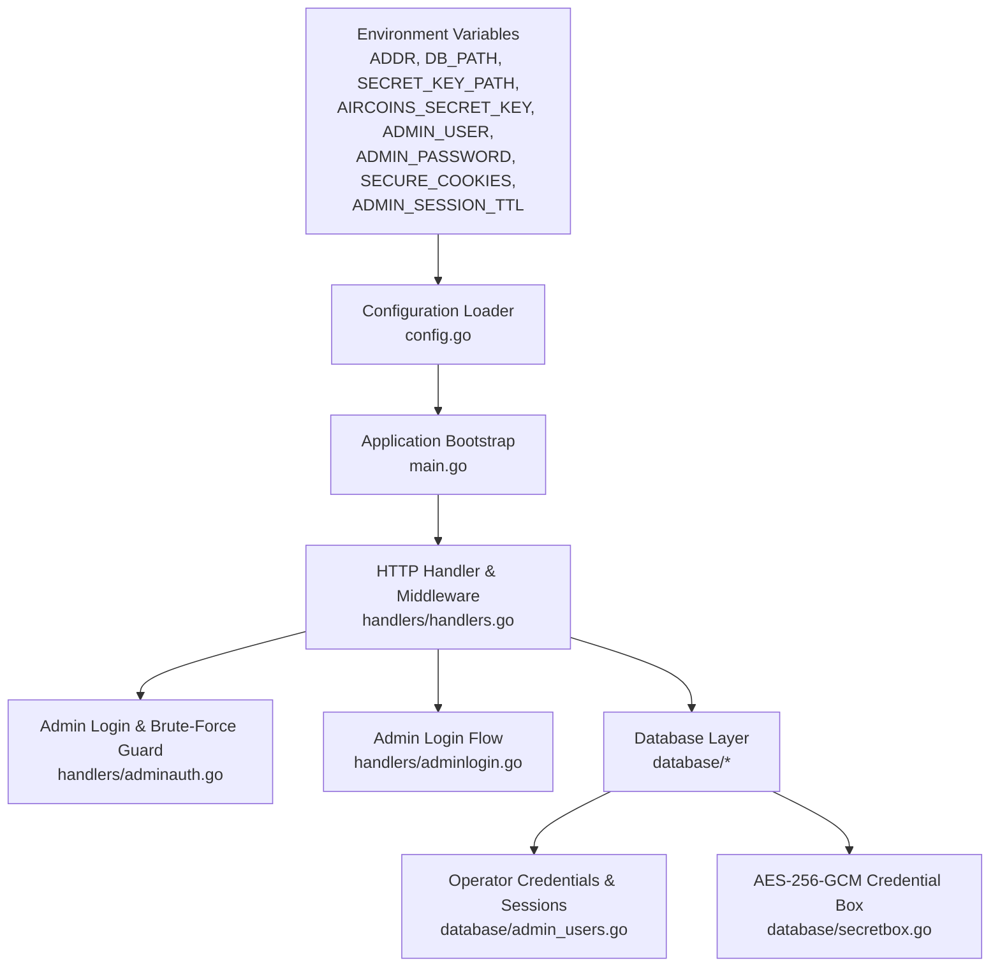
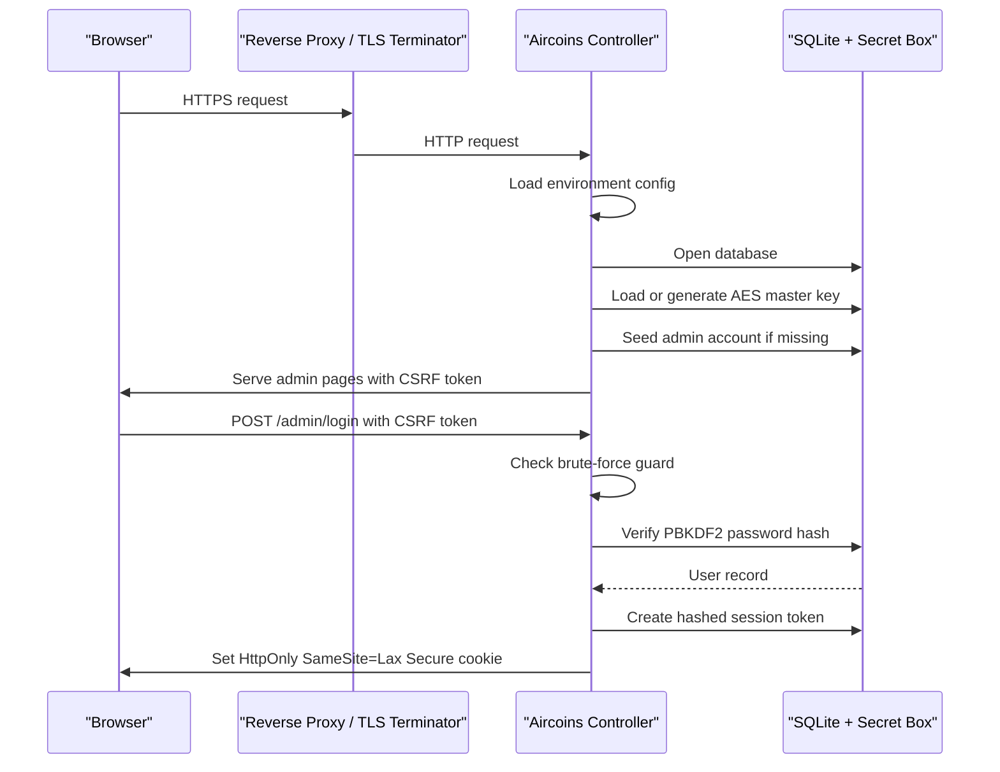
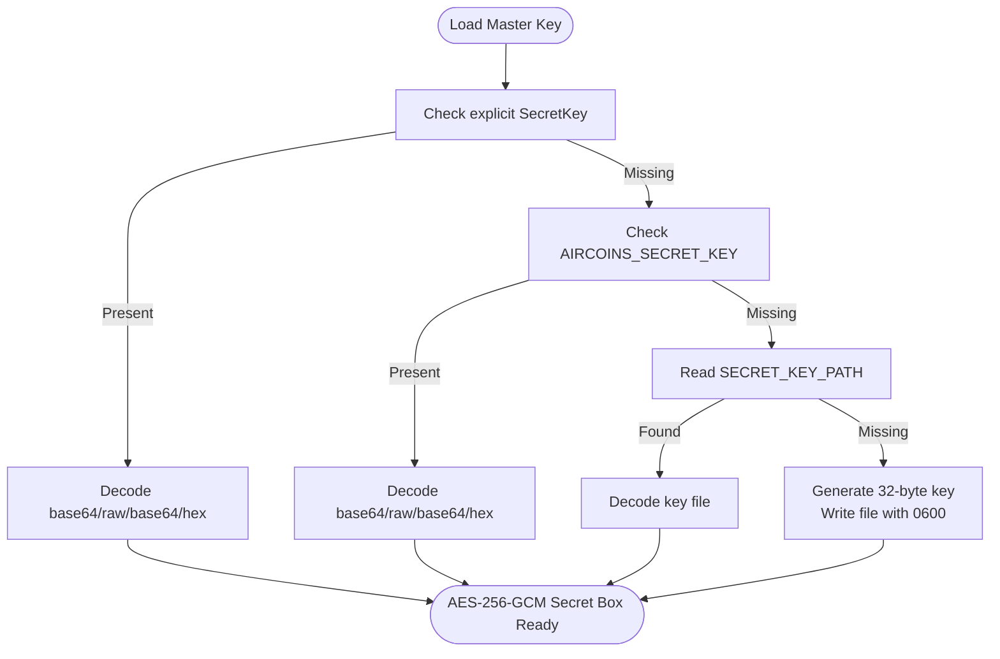
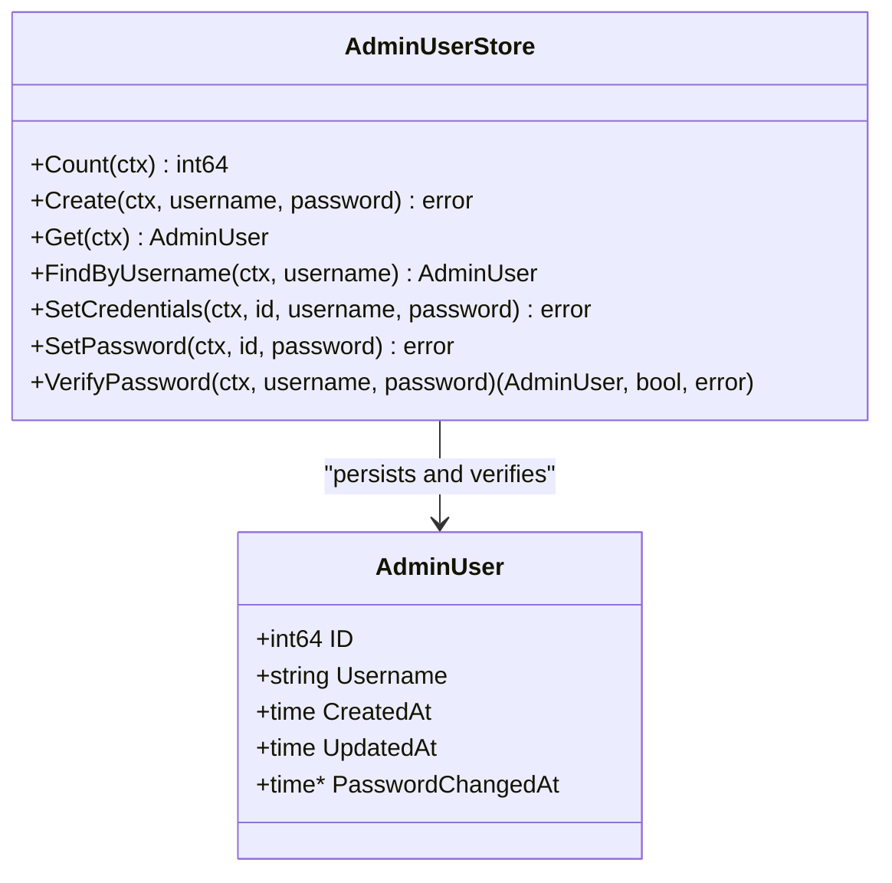
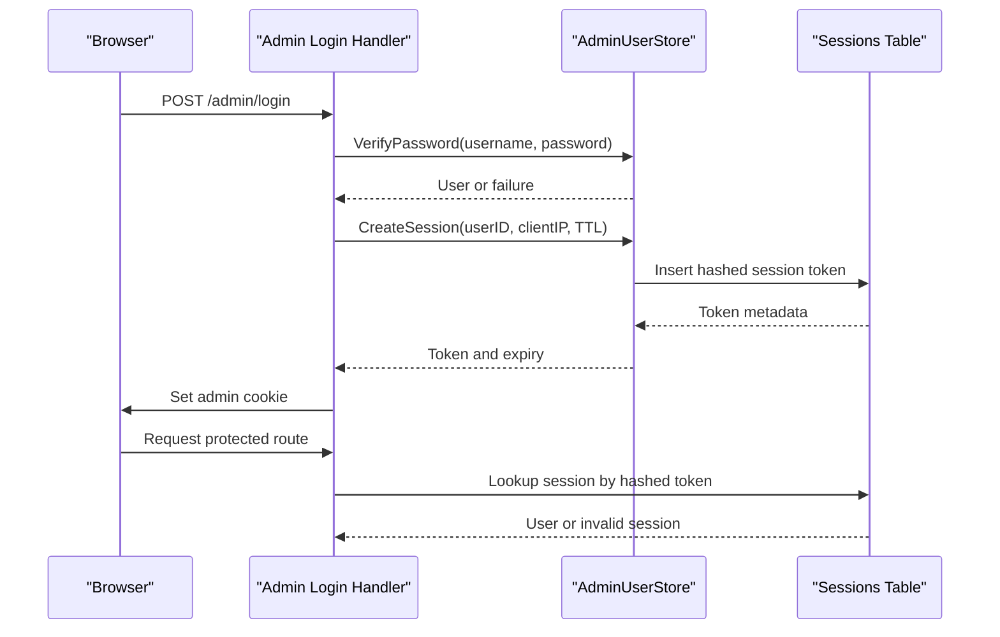
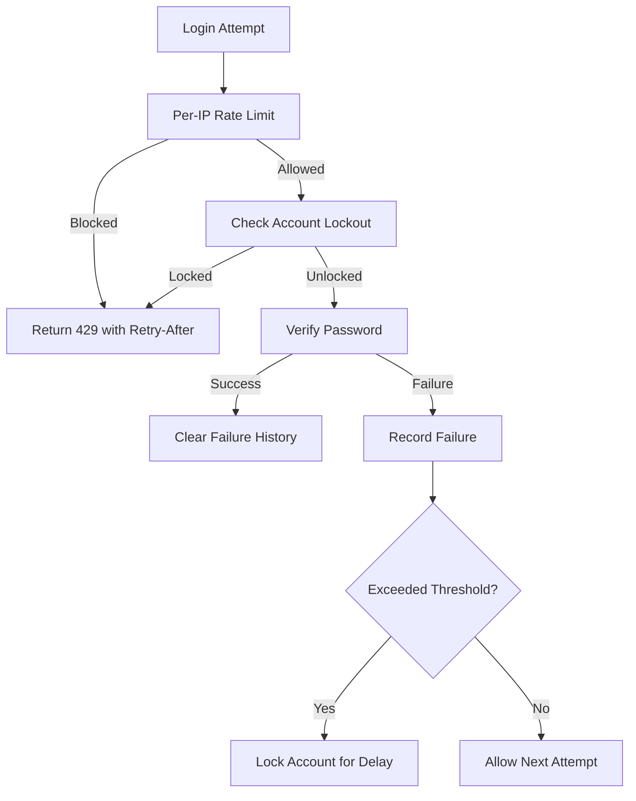
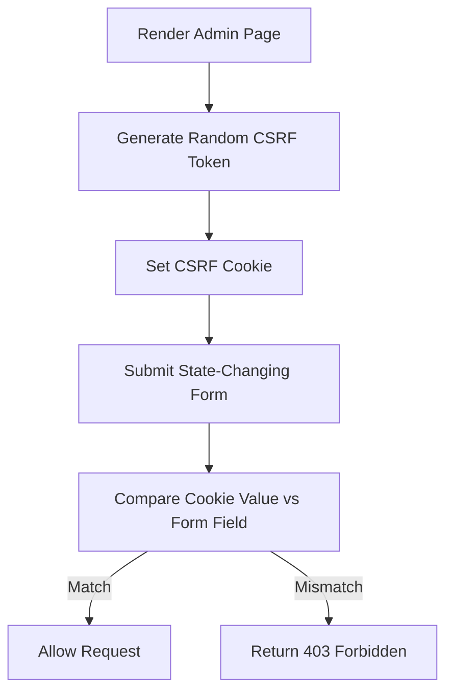
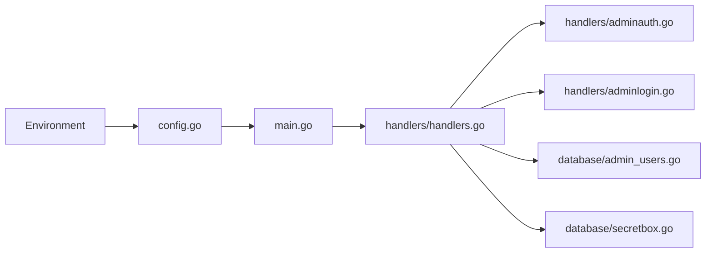

# Security Configuration

<cite>
**Referenced Files in This Document**
- [README.md](file://README.md)
- [config.go](file://config.go)
- [main.go](file://main.go)
- [handlers/handlers.go](file://handlers/handlers.go)
- [handlers/adminauth.go](file://handlers/adminauth.go)
- [handlers/adminlogin.go](file://handlers/adminlogin.go)
- [database/admin_users.go](file://database/admin_users.go)
- [database/secretbox.go](file://database/secretbox.go)
</cite>

## Table of Contents
1. [Introduction](#introduction)
2. [Project Structure](#project-structure)
3. [Core Components](#core-components)
4. [Architecture Overview](#architecture-overview)
5. [Detailed Component Analysis](#detailed-component-analysis)
6. [Dependency Analysis](#dependency-analysis)
7. [Performance Considerations](#performance-considerations)
8. [Troubleshooting Guide](#troubleshooting-guide)
9. [Conclusion](#conclusion)
10. [Appendices](#appendices)

## Introduction
This document explains the security configuration model for the Aircoins MikroTik Controller. It focuses on environment-driven security settings, encryption key management, password hashing, session handling, CSRF protection, and production hardening guidance. The controller is designed to run behind a reverse proxy or TLS terminator, with sensitive runtime behavior controlled through environment variables rather than command-line arguments.

The most important security boundaries are:
- Operator panel authentication under `/admin`.
- AES-256-GCM encryption of RouterOS API passwords at rest.
- PBKDF2-HMAC-SHA256 operator password hashing.
- In-memory brute-force protection for login attempts.
- Double-submit CSRF protection for admin state-changing requests.
- Secure cookie flags controlled by `SECURE_COOKIES`.

## Project Structure
Security-related logic is split across three layers:
- Environment configuration loading.
- HTTP middleware and handlers for authentication, sessions, CSRF, and security headers.
- Database layer for credential storage, session persistence, and encrypted secret storage.

**Diagram sources**
- [config.go:20-77](file://config.go#L20-L77)
- [main.go:214-285](file://main.go#L214-L285)
- [handlers/handlers.go:234-303](file://handlers/handlers.go#L234-L303)
- [handlers/adminauth.go:18-68](file://handlers/adminauth.go#L18-L68)
- [handlers/adminlogin.go:21-77](file://handlers/adminlogin.go#L21-L77)
- [database/admin_users.go:17-37](file://database/admin_users.go#L17-L37)
- [database/secretbox.go:15-45](file://database/secretbox.go#L15-L45)

**Section sources**
- [config.go:20-77](file://config.go#L20-L77)
- [main.go:214-285](file://main.go#L214-L285)
- [handlers/handlers.go:234-303](file://handlers/handlers.go#L234-L303)

## Core Components
The security configuration surface is primarily environment-based. The following variables control core security behavior:

| Variable | Default | Security Purpose |
|---|---:|---|
| `SECRET_KEY_PATH` | `data/secret.key` | Path to the master key file used for AES-256-GCM encryption of stored RouterOS credentials. |
| `AIRCOINS_SECRET_KEY` | None | Optional override for the master key; accepts base64, raw base64, or hex-encoded 32-byte keys. |
| `ADMIN_USER` | `admin` | Operator username seeded only when no account exists. |
| `ADMIN_PASSWORD` | None | Password seeded only when no account exists; if unset, a random password is generated once. |
| `SECURE_COOKIES` | Disabled | Enables the `Secure` flag on admin cookies and CSRF cookies; should be set behind HTTPS. |
| `ADMIN_SESSION_TTL` | `12h` | How long an operator session remains valid. |
| `DB_PATH` | `data/aircoins.db` | SQLite database path where credentials, sessions, and encrypted router secrets are stored. |
| `ADDR` | `:80` | Listener address; not a TLS listener itself. |

Key behaviors:
- `SECRET_KEY_PATH` and `AIRCOINS_SECRET_KEY` control how the controller loads the AES-256-GCM master key.
- `ADMIN_USER` and `ADMIN_PASSWORD` affect only first-boot account seeding.
- `SECURE_COOKIES` controls whether cookies are marked secure.
- `ADMIN_SESSION_TTL` controls session lifetime.

**Section sources**
- [README.md:70-89](file://README.md#L70-L89)
- [config.go:23-57](file://config.go#L23-L57)
- [handlers/handlers.go:28-90](file://handlers/handlers.go#L28-L90)

## Architecture Overview
The controller does not implement its own TLS termination. Instead, it expects to run behind a reverse proxy or TLS terminator. Security is enforced through:
- Environment-driven configuration.
- Encrypted credential storage.
- Strong password hashing.
- Session token hashing.
- Brute-force rate limiting.
- CSRF double-submit validation.
- Conservative security headers.

**Diagram sources**
- [main.go:214-285](file://main.go#L214-L285)
- [database/secretbox.go:84-131](file://database/secretbox.go#L84-L131)
- [handlers/adminlogin.go:35-77](file://handlers/adminlogin.go#L35-L77)
- [handlers/adminauth.go:70-92](file://handlers/adminauth.go#L70-L92)
- [database/admin_users.go:293-328](file://database/admin_users.go#L293-L328)

## Detailed Component Analysis

### Encryption Key Management (AES-256-GCM)
RouterOS API passwords are encrypted at rest using AES-256-GCM. The master key can come from:
1. Explicit configuration value.
2. `AIRCOINS_SECRET_KEY` environment variable.
3. `SECRET_KEY_PATH` file.

If no key is configured and the key file does not exist, the controller generates a new 32-byte key and writes it to the configured path with restrictive permissions.

**Diagram sources**
- [database/secretbox.go:15-45](file://database/secretbox.go#L15-L45)
- [database/secretbox.go:84-131](file://database/secretbox.go#L84-L131)
- [database/secretbox.go:134-151](file://database/secretbox.go#L134-L151)

Operational guidance:
- Treat the master key as equivalent to all stored RouterOS passwords.
- Back up the key separately from the database.
- Do not commit `data/secret.key` to version control.
- If the key is lost, existing encrypted router passwords cannot be decrypted.

**Section sources**
- [database/secretbox.go:15-45](file://database/secretbox.go#L15-L45)
- [database/secretbox.go:84-131](file://database/secretbox.go#L84-L131)
- [database/secretbox.go:134-151](file://database/secretbox.go#L134-L151)

### Operator Authentication and Password Hashing
Operator accounts use PBKDF2-HMAC-SHA256 with:
- A fresh 16-byte random salt per password.
- 210,000 iterations by default.
- Per-row iteration storage so work factor can increase over time.
- Constant-time comparison during verification.
- Timing-resistant behavior for unknown usernames.

Password policy:
- Minimum length is enforced at the store level.
- Weak passwords are rejected even if bypassing the UI.
- Changing the password revokes every existing session.

**Diagram sources**
- [database/admin_users.go:46-62](file://database/admin_users.go#L46-L62)
- [database/admin_users.go:124-148](file://database/admin_users.go#L124-L148)
- [database/admin_users.go:293-328](file://database/admin_users.go#L293-L328)

**Section sources**
- [database/admin_users.go:17-37](file://database/admin_users.go#L17-L37)
- [database/admin_users.go:64-94](file://database/admin_users.go#L64-L94)
- [database/admin_users.go:124-148](file://database/admin_users.go#L124-L148)
- [database/admin_users.go:293-328](file://database/admin_users.go#L293-L328)

### Session Security
Session tokens are:
- 32 bytes of randomness.
- Stored as SHA-256 hashes in the database.
- Delivered via an `HttpOnly`, `SameSite=Lax` cookie.
- Optionally marked `Secure` when `SECURE_COOKIES=1`.
- Revoked on logout.
- Revoked when the operator changes their password.

**Diagram sources**
- [handlers/adminlogin.go:35-77](file://handlers/adminlogin.go#L35-L77)
- [handlers/adminlogin.go:112-140](file://handlers/adminlogin.go#L112-L140)
- [database/admin_users.go:293-328](file://database/admin_users.go#L293-L328)

Best practices:
- Always enable `SECURE_COOKIES=1` behind HTTPS.
- Keep `ADMIN_SESSION_TTL` short enough for operational needs but long enough to avoid excessive re-authentication.
- Revoke sessions after password changes or suspected compromise.

**Section sources**
- [handlers/adminlogin.go:35-77](file://handlers/adminlogin.go#L35-L77)
- [handlers/adminlogin.go:112-140](file://handlers/adminlogin.go#L112-L140)
- [handlers/handlers.go:598-614](file://handlers/handlers.go#L598-L614)

### Brute-Force Protection
The login endpoint uses two independent protections:
- Per-IP token bucket: limits rapid guessing from one source.
- Per-account lockout: after repeated failures, the account is locked for an escalating delay.

Defaults:
- 10 attempts per minute per IP.
- Account lockout begins after 5 consecutive failures.
- Base lockout delay starts at 15 seconds and doubles up to 15 minutes.
- Counters are in memory and reset on restart.

**Diagram sources**
- [handlers/adminauth.go:18-68](file://handlers/adminauth.go#L18-L68)
- [handlers/adminauth.go:70-127](file://handlers/adminauth.go#L70-L127)
- [handlers/adminauth.go:164-180](file://handlers/adminauth.go#L164-L180)

**Section sources**
- [handlers/adminauth.go:18-68](file://handlers/adminauth.go#L18-L68)
- [handlers/adminauth.go:70-127](file://handlers/adminauth.go#L70-L127)
- [handlers/adminauth.go:164-180](file://handlers/adminauth.go#L164-L180)

### CSRF Protection
State-changing admin requests use a double-submit cookie pattern:
- A random CSRF token is stored in an `HttpOnly`, `SameSite=Lax` cookie.
- The same token must be submitted as a form field.
- Comparison is constant-time.
- Captive portal routes and machine-facing endpoints are intentionally exempt because they do not rely on browser cookies.

**Diagram sources**
- [handlers/handlers.go:527-590](file://handlers/handlers.go#L527-L590)
- [handlers/handlers.go:592-625](file://handlers/handlers.go#L592-L625)

**Section sources**
- [handlers/handlers.go:527-590](file://handlers/handlers.go#L527-L590)
- [handlers/handlers.go:592-625](file://handlers/handlers.go#L592-L625)

### Security Headers and Redirect Validation
The controller sets conservative security headers:
- `X-Content-Type-Options: nosniff`
- `X-Frame-Options: DENY`
- `Referrer-Policy: no-referrer`
- A strict Content-Security-Policy that blocks framing, restricts scripts, and limits connections to the same origin.

Additionally, the `next=` redirect parameter is sanitized to prevent open redirects to external hosts.

**Section sources**
- [handlers/handlers.go:498-525](file://handlers/handlers.go#L498-L525)
- [handlers/adminlogin.go:21-33](file://handlers/adminlogin.go#L21-L33)

## Dependency Analysis
Security dependencies flow from environment configuration into application bootstrap, HTTP middleware, and database operations.

**Diagram sources**
- [config.go:20-77](file://config.go#L20-L77)
- [main.go:214-285](file://main.go#L214-L285)
- [handlers/handlers.go:234-303](file://handlers/handlers.go#L234-L303)
- [handlers/adminauth.go:18-68](file://handlers/adminauth.go#L18-L68)
- [handlers/adminlogin.go:21-77](file://handlers/adminlogin.go#L21-L77)
- [database/admin_users.go:17-37](file://database/admin_users.go#L17-L37)
- [database/secretbox.go:15-45](file://database/secretbox.go#L15-L45)

**Section sources**
- [config.go:20-77](file://config.go#L20-L77)
- [main.go:214-285](file://main.go#L214-L285)
- [handlers/handlers.go:234-303](file://handlers/handlers.go#L234-L303)

## Performance Considerations
Security features have measurable performance implications:
- PBKDF2 password hashing adds CPU cost per login attempt.
- Brute-force protection reduces attack impact but may require careful tuning if operators frequently mistype credentials.
- CSRF token generation and validation add small overhead per request.
- AES-256-GCM encryption adds CPU cost when reading/writing router credentials.

Recommendations:
- Keep `ADMIN_SESSION_TTL` reasonable to reduce repeated authentication.
- Monitor login failure rates to detect abuse without disabling protections.
- Ensure the host has sufficient CPU resources for PBKDF2 workloads.
- Avoid exposing the controller directly to untrusted networks without rate limiting at the network edge.

[No sources needed since this section provides general guidance]

## Troubleshooting Guide

### Common Security Issues

| Symptom | Likely Cause | Resolution |
|---|---|---|
| Admin cookies are not sent over HTTPS | `SECURE_COOKIES` is not enabled | Set `SECURE_COOKIES=1` behind HTTPS. |
| Router passwords cannot be decrypted | Wrong or missing master key | Verify `SECRET_KEY_PATH` or `AIRCOINS_SECRET_KEY`; ensure the key matches the database. |
| Initial admin password is unknown | `ADMIN_PASSWORD` was not set | Check service logs for the generated initial password, or use the recovery command. |
| Login returns too many failed attempts | Brute-force guard triggered | Wait for the lockout period or clear local rate-limit state by restarting the service. |
| Admin forms return forbidden | CSRF token mismatch | Reload the page and resubmit the form. |
| Panel redirects to an external site after login | Malicious `next=` parameter | The controller sanitizes redirects; verify the target path is internal. |
| Service cannot bind port 80 | Missing privileges | Use a non-privileged port or configure system capabilities as documented. |

**Section sources**
- [handlers/adminlogin.go:112-140](file://handlers/adminlogin.go#L112-L140)
- [database/secretbox.go:84-131](file://database/secretbox.go#L84-L131)
- [handlers/adminauth.go:164-180](file://handlers/adminauth.go#L164-L180)
- [handlers/handlers.go:527-590](file://handlers/handlers.go#L527-L590)
- [main.go:340-349](file://main.go#L340-L349)

## Conclusion
The Aircoins MikroTik Controller implements defense-in-depth through environment-driven configuration, encrypted credential storage, strong password hashing, session token hashing, brute-force protection, CSRF validation, and strict security headers. For production deployments, the most critical steps are enabling HTTPS, setting `SECURE_COOKIES=1`, managing the AES master key securely, configuring appropriate session TTLs, and restricting access to the controller through firewall rules and a trusted reverse proxy.

[No sources needed since this section summarizes without analyzing specific files]

## Appendices

### Production Security Checklist
- Run behind HTTPS and set `SECURE_COOKIES=1`.
- Configure `SECRET_KEY_PATH` or `AIRCOINS_SECRET_KEY` and back up the master key.
- Set `ADMIN_USER` and `ADMIN_PASSWORD` only for first boot; manage credentials through the panel afterward.
- Set `ADMIN_SESSION_TTL` to a short, operationally appropriate duration.
- Restrict direct access to the controller’s listening address.
- Allow only required ports for MikroTik API access.
- Enable logging and monitor login failures and CSRF rejections.
- Rotate operator passwords periodically and revoke sessions after any suspected compromise.

**Section sources**
- [README.md:111-140](file://README.md#L111-L140)
- [config.go:23-57](file://config.go#L23-L57)
- [handlers/handlers.go:498-525](file://handlers/handlers.go#L498-L525)