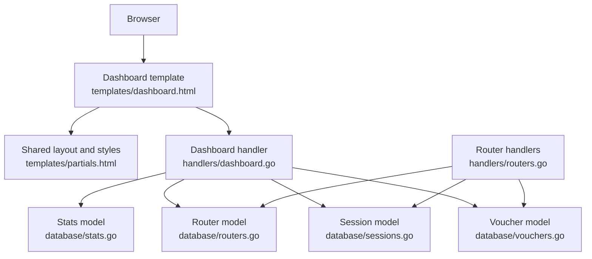
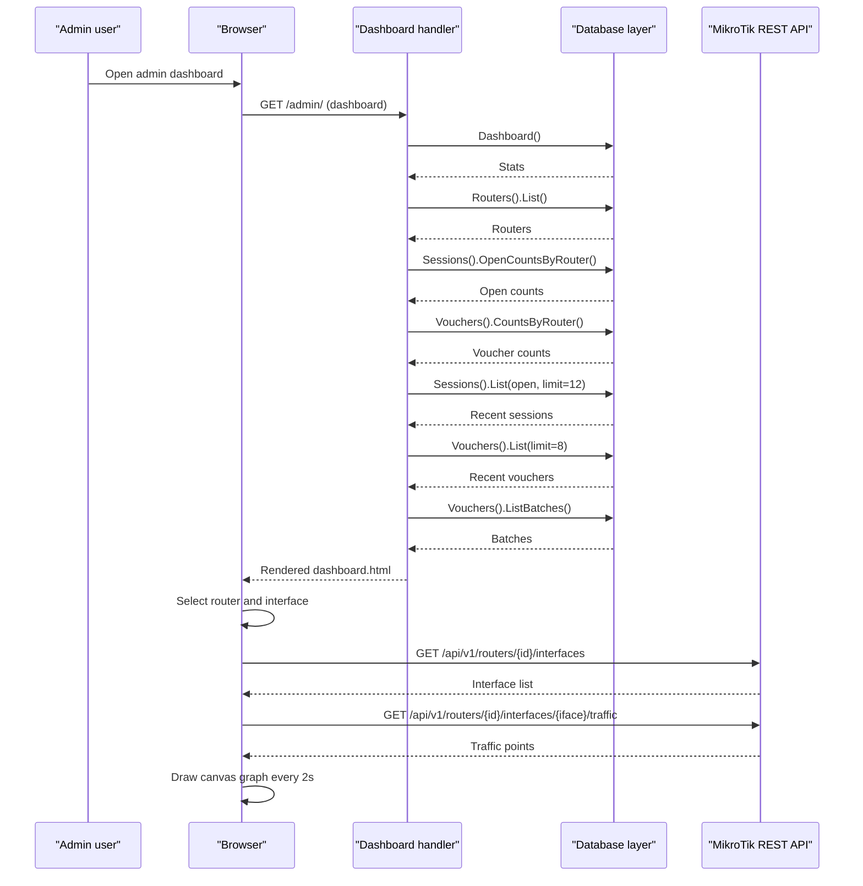
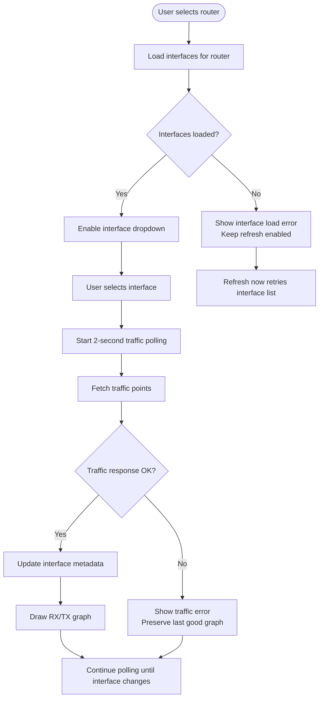
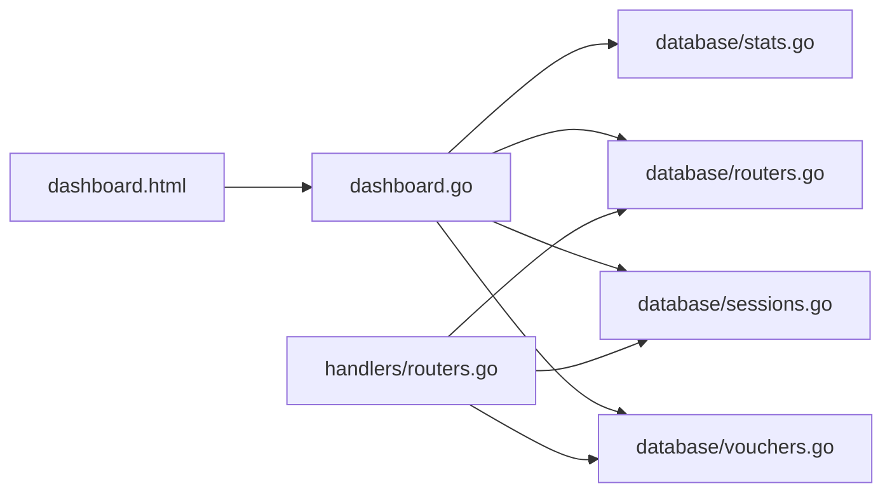

# Admin Dashboard

<cite>
**Referenced Files in This Document**   
- [dashboard.html](file://templates/dashboard.html)
- [partials.html](file://templates/partials.html)
- [dashboard.go](file://handlers/dashboard.go)
- [routers.go](file://handlers/routers.go)
- [stats.go](file://database/stats.go)
- [routers.go](file://database/routers.go)
- [sessions.go](file://database/sessions.go)
- [vouchers.go](file://database/vouchers.go)
</cite>

## Table of Contents
1. [Introduction](#introduction)
2. [Project Structure](#project-structure)
3. [Core Components](#core-components)
4. [Architecture Overview](#architecture-overview)
5. [Detailed Component Analysis](#detailed-component-analysis)
6. [Dependency Analysis](#dependency-analysis)
7. [Performance Considerations](#performance-considerations)
8. [Troubleshooting Guide](#troubleshooting-guide)
9. [Conclusion](#conclusion)

## Introduction
The admin dashboard is the fleet overview for a MikroTik hotspot controller. It presents registered routers, live client sessions, voucher statistics, and an interactive interface traffic monitor. The page is server-rendered with Go templates and enhanced by lightweight browser JavaScript that polls REST endpoints to show real-time RX/TX traffic per selected router interface.

Key responsibilities:
- Fleet health summary across routers, clients, vouchers, and redeemed value.
- Router inventory table with status, client count, voucher count, and last-seen time.
- Live client list showing username, router, address, total traffic, and session state.
- Recent voucher ledger with lifecycle badges and actions.
- Interactive interface traffic graph with 2-second polling, device metadata, and error resilience.

## Project Structure
The dashboard spans three layers:
- Template layer: `templates/dashboard.html` renders the UI and contains the traffic monitor script. Shared layout, navigation, cards, tables, badges, and responsive styles live in `templates/partials.html`.
- Handler layer: `handlers/dashboard.go` composes the data model for the landing page; `handlers/routers.go` provides shared router summaries and related pages.
- Data layer: `database/stats.go`, `database/routers.go`, `database/sessions.go`, and `database/vouchers.go` provide counters, router records, session tracking, and voucher accounting.

**Diagram sources**
- [dashboard.html:1-583](file://templates/dashboard.html#L1-L583)
- [partials.html:1-747](file://templates/partials.html#L1-L747)
- [dashboard.go:1-123](file://handlers/dashboard.go#L1-L123)
- [routers.go:1-660](file://handlers/routers.go#L1-L660)
- [stats.go:1-54](file://database/stats.go#L1-L54)
- [routers.go:1-424](file://database/routers.go#L1-L424)
- [sessions.go:1-420](file://database/sessions.go#L1-L420)
- [vouchers.go:1-743](file://database/vouchers.go#L1-L743)

**Section sources**
- [dashboard.html:1-583](file://templates/dashboard.html#L1-L583)
- [partials.html:1-747](file://templates/partials.html#L1-L747)
- [dashboard.go:1-123](file://handlers/dashboard.go#L1-L123)
- [routers.go:1-660](file://handlers/routers.go#L1-L660)
- [stats.go:1-54](file://database/stats.go#L1-L54)
- [routers.go:1-424](file://database/routers.go#L1-L424)
- [sessions.go:1-420](file://database/sessions.go#L1-L420)
- [vouchers.go:1-743](file://database/vouchers.go#L1-L743)

## Core Components
- Dashboard page model: aggregates fleet stats, router summaries, recent open sessions, recent vouchers, and voucher batches.
- Router summary: combines a stored router record with locally tracked open session counts and voucher counts.
- Stats aggregation: collects router status distribution, open session count, and voucher statistics in one dashboard query path.
- Session store: tracks active hotspot clients, supports filtering, counting, syncing from devices, and closing sessions.
- Voucher store: manages prepaid keys, lifecycle states, redemption accounting, batch operations, and aggregate financial metrics.

**Section sources**
- [dashboard.go:11-86](file://handlers/dashboard.go#L11-L86)
- [stats.go:8-41](file://database/stats.go#L8-L41)
- [sessions.go:12-99](file://database/sessions.go#L12-L99)
- [vouchers.go:78-180](file://database/vouchers.go#L78-L180)

## Architecture Overview
The dashboard request flow loads aggregated statistics, router inventory, session counts, recent sessions, recent vouchers, and voucher batches. The handler then renders the dashboard template with this data. The template displays static summaries and interactive controls. The traffic monitor uses browser-side JavaScript to poll `/api/v1/routers/{id}/interfaces` and `/api/v1/routers/{id}/interfaces/{ifaceId}/traffic`, updating the canvas graph every two seconds.

**Diagram sources**
- [dashboard.go:30-86](file://handlers/dashboard.go#L30-L86)
- [dashboard.html:253-579](file://templates/dashboard.html#L253-L579)

## Detailed Component Analysis

### Dashboard Layout and Top-Level Sections
The dashboard template defines:
- A page header with title, subtitle, and quick links to live sessions and router management.
- Four stat cards: routers, active clients, vouchers, and redeemed value.
- An interface traffic monitor card with router/interface selectors, refresh control, metadata readouts, and a canvas-based line chart.
- A routers table showing name, endpoint, transport mode, status, client count, voucher count, last seen, and an action link.
- A live clients table showing username, router, IP address, total bytes, and open/closed badge.
- A recent vouchers table using a shared partial row renderer.

Responsive behavior:
- The top-level grid uses CSS Grid with auto-fit columns so stat cards reflow on smaller screens.
- Tables are wrapped in scrollable containers for narrow viewports.
- Navigation and sign-out form wrap automatically on mobile widths.

Customization hooks:
- The dashboard uses shared icon helpers and helper functions such as human-readable counts and money formatting.
- Status classes are applied based on router health values.
- Badge classes reflect session and voucher lifecycle states.

**Section sources**
- [dashboard.html:66-251](file://templates/dashboard.html#L66-L251)
- [partials.html:54-75](file://templates/partials.html#L54-L75)
- [partials.html:78-96](file://templates/partials.html#L78-L96)
- [partials.html:181-191](file://templates/partials.html#L181-L191)

### Router Status Overview and Health Monitoring
Router status is derived from the last connectivity probe recorded in the database:
- Values include unknown, online, and offline.
- The dashboard shows the last status, optional error message, and last-seen timestamp.
- The system includes a health endpoint that checks database connectivity and schema initialization.

Data source:
- Router records include last status, last error, latency, and last seen timestamp.
- The dashboard handler fetches all routers and attaches local counters for open sessions and vouchers.

Operational notes:
- When no routers exist, the dashboard shows an empty state with a link to add the first device.
- The routers table indicates the transport mode used for each router.

**Section sources**
- [routers.go:12-29](file://database/routers.go#L12-L29)
- [routers.go:57-98](file://database/routers.go#L57-L98)
- [routers.go:297-317](file://database/routers.go#L297-L317)
- [dashboard.go:38-52](file://handlers/dashboard.go#L38-L52)
- [dashboard.go:88-98](file://handlers/dashboard.go#L88-L98)
- [dashboard.html:172-206](file://templates/dashboard.html#L172-L206)

### Active Sessions Tracking and Management
The dashboard displays up to twelve open sessions with:
- Username or placeholder when missing.
- Router name or fallback identifier.
- Client IP address.
- Total bytes across both directions.
- Open or closed badge.

Underlying model:
- Sessions track router association, session key, username, address, MAC, login method, server, uptime, byte counters, start time, last seen, end time, and end reason.
- Helper methods report whether a session is open, total bytes, and duration.
- The dashboard queries open sessions with a small limit.

Management capabilities available elsewhere in the system:
- Syncing sessions from a router’s active client list.
- Closing individual sessions or all sessions for a user or MAC address.
- Listing and filtering sessions by router, MAC, status, and text query.
- Counting open sessions globally or per router.

**Section sources**
- [dashboard.html:208-232](file://templates/dashboard.html#L208-L232)
- [sessions.go:12-52](file://database/sessions.go#L12-L52)
- [sessions.go:101-178](file://database/sessions.go#L101-L178)
- [sessions.go:180-215](file://database/sessions.go#L180-L215)
- [sessions.go:248-310](file://database/sessions.go#L248-L310)
- [sessions.go:333-375](file://database/sessions.go#L333-L375)

### System Statistics Display
The dashboard aggregates:
- Total routers and their status distribution.
- Total open sessions across all routers.
- Voucher totals including unused, active, used, expired, disabled, pushed, billed value, and face value.

Aggregation logic:
- The stats model groups routers by last status and sums them into totals.
- Open session count is queried directly.
- Voucher statistics combine counts by status and financial aggregates.

**Section sources**
- [stats.go:8-41](file://database/stats.go#L8-L41)
- [dashboard.html:77-98](file://templates/dashboard.html#L77-L98)
- [vouchers.go:578-645](file://database/vouchers.go#L578-L645)

### Interactive Elements: Router Status Indicators, Session Controls, and Performance Metrics

#### Router Status Indicators
- Each router row shows a status label styled according to its last connection result.
- Optional error text appears beneath the status when present.
- Transport mode is appended next to the API endpoint for clarity.

Accessibility and readability:
- Status labels use semantic class names tied to badge styling.
- Monospace fonts are used for endpoints and addresses.

**Section sources**
- [dashboard.html:172-206](file://templates/dashboard.html#L172-L206)
- [routers.go:12-29](file://database/routers.go#L12-L29)

#### Session Controls
The dashboard itself shows read-only session information. Full session controls are provided through other admin pages and handlers, including:
- Refreshing sessions from a specific router.
- Closing sessions by key, username, or MAC address.
- Filtering and paginating session lists.

These controls integrate with the same session data model used by the dashboard.

**Section sources**
- [sessions.go:180-215](file://database/sessions.go#L180-L215)
- [sessions.go:248-310](file://database/sessions.go#L248-L310)
- [routers.go:383-425](file://handlers/routers.go#L383-L425)

#### Interface Traffic Monitor
The traffic monitor is the most interactive part of the dashboard:
- Router selector populates interface options via `/api/v1/routers/{id}/interfaces`.
- Interface selector triggers traffic polling via `/api/v1/routers/{id}/interfaces/{ifaceId}/traffic`.
- A manual refresh button allows retrying interface loading or fetching fresh traffic data.
- A spinner and status messages communicate loading and errors.
- Metadata fields display interface name, type, MAC, MTU, cumulative RX/TX, and current RX/TX rates.
- The canvas draws RX and TX lines with labeled axes, gridlines, area fills, and a time range indicator.
- Polling runs every two seconds while an interface is selected.
- Resizing the browser window recalculates the canvas dimensions and redraws the graph.

Error handling:
- HTTP failures parse the JSON error body when possible and surface a meaningful message.
- Stale responses are ignored if the user changed the router selection during the request.
- Failed traffic polls do not blank the existing graph unless the series changes.
- If no interfaces are reported, the UI informs the operator instead of failing silently.

**Diagram sources**
- [dashboard.html:253-579](file://templates/dashboard.html#L253-L579)

**Section sources**
- [dashboard.html:100-170](file://templates/dashboard.html#L100-L170)
- [dashboard.html:253-579](file://templates/dashboard.html#L253-L579)

### Responsive Design Patterns and Cross-Browser Compatibility
The dashboard relies on modern but widely supported CSS features:
- CSS custom properties define colors, spacing, and component themes.
- CSS Grid with `auto-fit` and `minmax` creates flexible multi-column layouts without media-query-heavy rules.
- Flexbox handles navigation alignment, button rows, and stat heads.
- Media queries adjust padding, font sizes, and layout wrapping for narrow screens.
- Canvas drawing adapts to device pixel ratio for crisp rendering on high-DPI displays.
- The interface selector and table wrappers ensure usability on mobile devices.

Cross-browser considerations:
- No external JavaScript libraries are used for the dashboard.
- The traffic monitor uses vanilla JavaScript and standard DOM APIs.
- Styles avoid vendor-specific hacks beyond common practices already present in the shared stylesheet.

**Section sources**
- [partials.html:1-191](file://templates/partials.html#L1-L191)
- [dashboard.html:8-59](file://templates/dashboard.html#L8-L59)
- [dashboard.html:276-282](file://templates/dashboard.html#L276-L282)

### Dashboard Customization Options
Customization is primarily template-driven:
- Title and portal branding come from the page context.
- Icons are rendered through a helper function.
- Human-readable numbers and currency values are formatted by helper functions.
- Router status classes map to badge styles.
- Voucher rows reuse a shared partial that can be extended for additional actions or metadata.

Integration with underlying models:
- The dashboard template consumes `Stats`, `routerSummary`, `Session`, and `Voucher` structures.
- Router status and transport mode are displayed directly from the router model.
- Session badges and totals derive from session fields and computed helpers.
- Voucher badges, allowance summaries, and financial figures come from the voucher model.

**Section sources**
- [dashboard.html:66-251](file://templates/dashboard.html#L66-L251)
- [dashboard.go:11-86](file://handlers/dashboard.go#L11-L86)
- [partials.html:457-509](file://templates/partials.html#L457-L509)
- [sessions.go:36-52](file://database/sessions.go#L36-L52)
- [vouchers.go:104-180](file://database/vouchers.go#L104-L180)

## Dependency Analysis
The dashboard depends on multiple data stores and handlers:

Coupling and cohesion:
- The dashboard handler is cohesive around composing the landing page view.
- Router, session, and voucher models are reusable across multiple handlers and pages.
- The template layer remains presentation-focused and delegates business logic to handlers and models.

External integration points:
- The browser-side traffic monitor calls REST endpoints exposed by the controller to retrieve interface metadata and traffic samples.
- The backend integrates with MikroTik devices through router dialing and API calls handled elsewhere in the router handlers.

**Diagram sources**
- [dashboard.html:253-579](file://templates/dashboard.html#L253-L579)
- [dashboard.go:30-86](file://handlers/dashboard.go#L30-L86)
- [routers.go:187-227](file://handlers/routers.go#L187-L227)
- [stats.go:18-41](file://database/stats.go#L18-L41)
- [routers.go:125-188](file://database/routers.go#L125-L188)
- [sessions.go:248-310](file://database/sessions.go#L248-L310)
- [vouchers.go:305-354](file://database/vouchers.go#L305-L354)

**Section sources**
- [dashboard.go:30-86](file://handlers/dashboard.go#L30-L86)
- [routers.go:187-227](file://handlers/routers.go#L187-L227)
- [stats.go:18-41](file://database/stats.go#L18-L41)
- [routers.go:125-188](file://database/routers.go#L125-L188)
- [sessions.go:248-310](file://database/sessions.go#L248-L310)
- [vouchers.go:305-354](file://database/vouchers.go#L305-L354)

## Performance Considerations
- Dashboard statistics are aggregated efficiently through grouped SQL queries and dedicated helper methods.
- The dashboard limits recent sessions and vouchers to reduce payload size.
- The traffic monitor polls at a fixed interval only while an interface is selected, avoiding unnecessary background requests.
- Canvas drawing scales with device pixel ratio and redraws on resize, keeping visuals sharp without excessive memory growth.
- Error paths preserve previously successful data to prevent visual flicker during transient network issues.

[No sources needed since this section provides general guidance]

## Troubleshooting Guide
Common dashboard issues and resolutions:
- No routers registered: Add a router through the router management page. The dashboard explicitly guides users to create the first device.
- Router shows offline or unknown: Check the last error message and last seen timestamp. Verify credentials, transport mode, port, and TLS settings. Use the router test flow to validate connectivity.
- Interface list unavailable: The interface selector shows an error and keeps the refresh button enabled. Retry loading interfaces after correcting router connectivity.
- Traffic graph shows “Waiting for data”: Wait for the first traffic sample. The graph requires at least two points to draw meaningful lines.
- Traffic graph shows an error: Inspect the status message. Errors may indicate router unreachable, interface removed, or HTTP failure. The last good graph is preserved when possible.
- Graph does not update: Ensure the selected interface is still valid and the router is reachable. Re-select the interface or click Refresh now.
- Mobile layout looks cramped: The dashboard wraps navigation and tables automatically. Use horizontal scrolling for tables and rely on stacked stat cards on narrow screens.

**Section sources**
- [dashboard.html:172-206](file://templates/dashboard.html#L172-L206)
- [dashboard.html:478-521](file://templates/dashboard.html#L478-L521)
- [dashboard.html:522-579](file://templates/dashboard.html#L522-L579)
- [routers.go:229-273](file://handlers/routers.go#L229-L273)
- [routers.go:338-381](file://handlers/routers.go#L338-L381)

## Conclusion
The admin dashboard provides a clear, responsive overview of the MikroTik hotspot fleet. It combines server-rendered statistics with a lightweight, resilient traffic monitor that updates interface performance in real time. Its design separates concerns cleanly between templates, handlers, and data models, making it straightforward to extend, customize, and troubleshoot. Operators can quickly assess router health, monitor active clients, review voucher usage, and investigate interface performance without leaving the dashboard.

[No sources needed since this section summarizes without analyzing specific files]