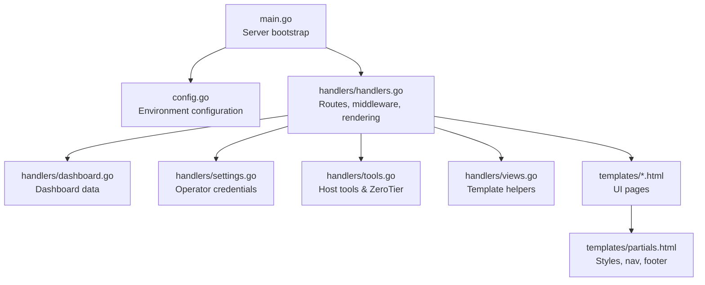
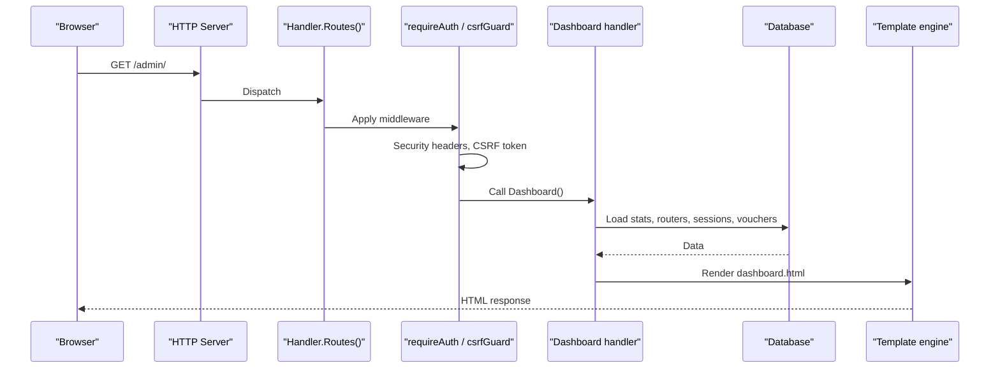
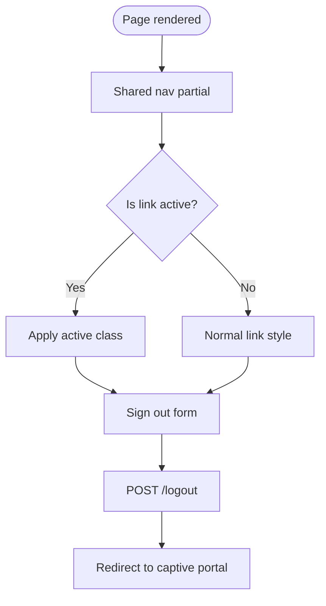
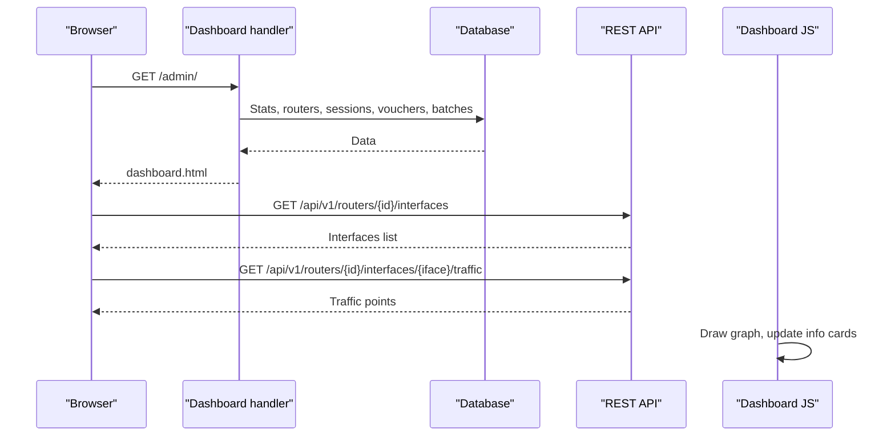
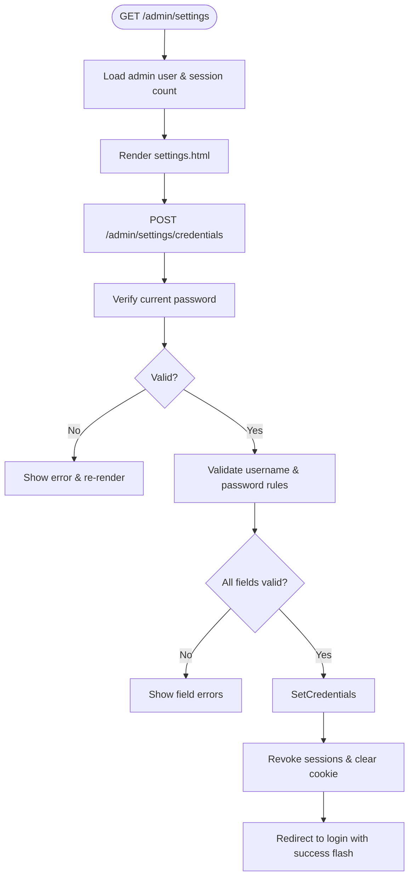
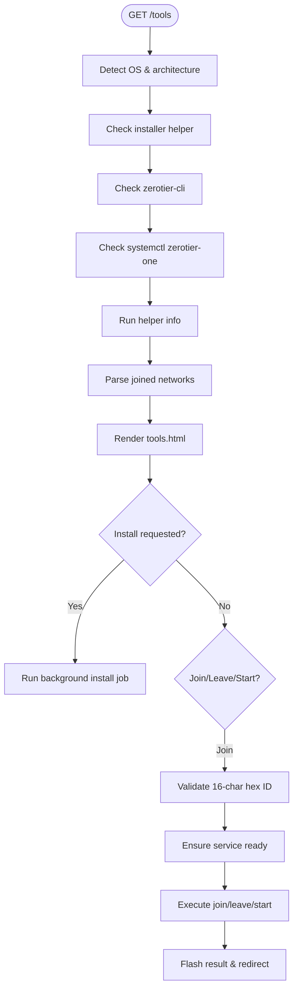
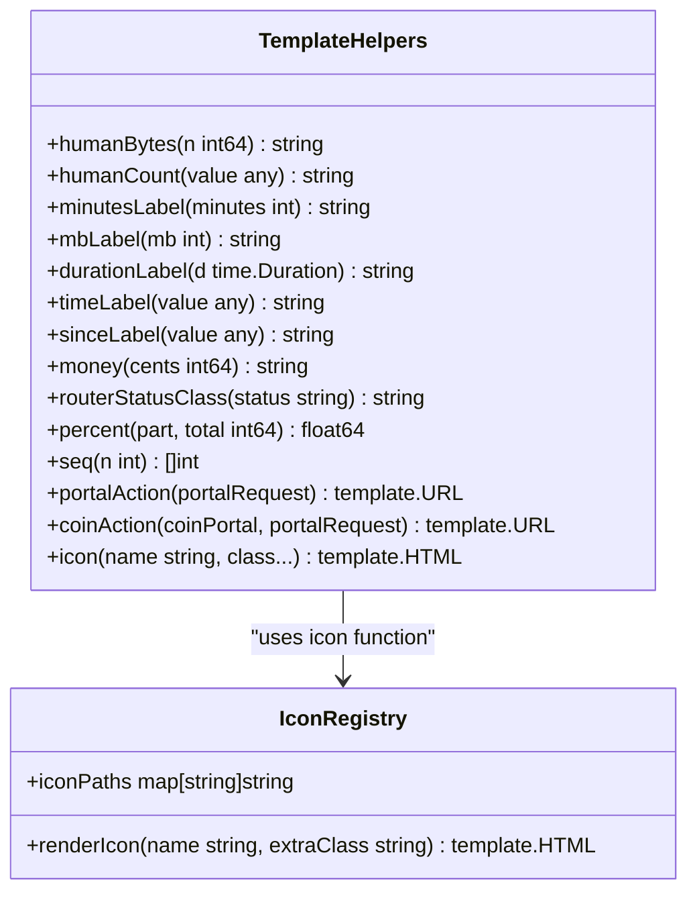
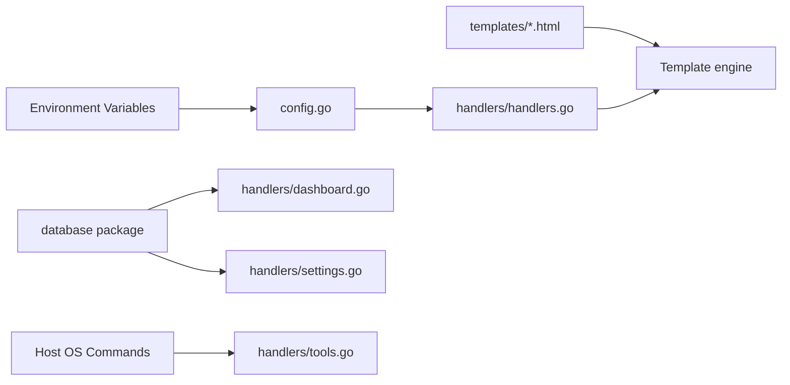

# Dashboard & User Interface

<cite>
**Referenced Files in This Document**   
- [main.go](file://main.go)
- [config.go](file://config.go)
- [handlers/handlers.go](file://handlers/handlers.go)
- [handlers/dashboard.go](file://handlers/dashboard.go)
- [handlers/settings.go](file://handlers/settings.go)
- [handlers/tools.go](file://handlers/tools.go)
- [handlers/views.go](file://handlers/views.go)
- [templates/partials.html](file://templates/partials.html)
- [templates/dashboard.html](file://templates/dashboard.html)
- [templates/settings.html](file://templates/settings.html)
- [templates/tools.html](file://templates/tools.html)
- [templates/routers.html](file://templates/routers.html)
- [templates/sessions.html](file://templates/sessions.html)
</cite>

## Table of Contents
1. [Introduction](#introduction)
2. [Project Structure](#project-structure)
3. [Core Components](#core-components)
4. [Architecture Overview](#architecture-overview)
5. [Detailed Component Analysis](#detailed-component-analysis)
6. [Dependency Analysis](#dependency-analysis)
7. [Performance Considerations](#performance-considerations)
8. [Troubleshooting Guide](#troubleshooting-guide)
9. [Conclusion](#conclusion)
10. [Appendices](#appendices)

## Introduction
This document explains the admin dashboard and user interface for the MikroTik hotspot controller. It covers operator navigation, the fleet overview dashboard, active session monitoring, system tools, settings management, ZeroTier host utilities, template-based UI customization, responsive design, accessibility features, and guidance for extending the interface while keeping it consistent with existing patterns.

The panel is served under an admin prefix by default, while the captive portal remains at the root so guests never see the operator dashboard when opening the controller IP. The dashboard aggregates router health, live clients, vouchers, and traffic monitoring, while the Tools page provides host-level maintenance operations such as ZeroTier installation and network joining.

## Project Structure
The UI is built from:
- A Go HTTP handler layer that renders server-side HTML templates.
- Embedded HTML templates providing shared styles, navigation, flash messages, and per-page content.
- Template helper functions for formatting numbers, times, money, status badges, and inline SVG icons.
- Configuration loaded from environment variables controlling branding, routing, security, and coin slot behavior.

**Diagram sources**
- [main.go:214-285](file://main.go#L214-L285)
- [config.go:20-76](file://config.go#L20-L76)
- [handlers/handlers.go:234-303](file://handlers/handlers.go#L234-L303)
- [handlers/dashboard.go:30-85](file://handlers/dashboard.go#L30-L85)
- [handlers/settings.go:26-43](file://handlers/settings.go#L26-L43)
- [handlers/tools.go:271-284](file://handlers/tools.go#L271-L284)
- [handlers/views.go:16-51](file://handlers/views.go#L16-L51)
- [templates/partials.html:432-455](file://templates/partials.html#L432-L455)

**Section sources**
- [main.go:1-8](file://main.go#L1-L8)
- [handlers/handlers.go:1-7](file://handlers/handlers.go#L1-L7)
- [templates/partials.html:1-18](file://templates/partials.html#L1-L18)

## Core Components
- Operator navigation: a sticky top bar with links to Dashboard, Routers, Network, Tools, Vouchers, Rates, Sessions, Portal editor, and Settings.
- Dashboard: fleet statistics, router inventory, live sessions, recent vouchers, and an interactive interface traffic monitor.
- Settings: operator account details, credential change form, and brute-force protection explanation.
- Tools: ZeroTier installation progress, service status, joined networks, join/leave actions, and start service control.
- Template system: shared CSS variables, layout classes, icon registry, flash alerts, CSRF tokens, and reusable partials.

Key responsibilities:
- `handlers/handlers.go` wires routes, applies middleware (security headers, CSRF, request logging), and renders templates with shared page context.
- `handlers/dashboard.go` loads dashboard statistics, routers, open sessions, vouchers, and batches.
- `handlers/settings.go` serves the settings page and validates credential updates.
- `handlers/tools.go` reads host OS information, checks ZeroTier state, manages installation jobs, and performs network join/leave actions.
- `handlers/views.go` exposes template helpers like `humanBytes`, `humanCount`, `sinceLabel`, `money`, `statusClass`, and `icon`.

**Section sources**
- [handlers/handlers.go:234-441](file://handlers/handlers.go#L234-L441)
- [handlers/dashboard.go:11-85](file://handlers/dashboard.go#L11-L85)
- [handlers/settings.go:11-43](file://handlers/settings.go#L11-L43)
- [handlers/tools.go:69-284](file://handlers/tools.go#L69-L284)
- [handlers/views.go:16-51](file://handlers/views.go#L16-L51)

## Architecture Overview
The admin panel uses a layered architecture:
- Entry point initializes logger, config, database, embedded templates, and HTTP server.
- Handler constructs route tables for public portal endpoints and guarded admin endpoints.
- Middleware enforces security headers, CSRF protection, request logging, and recovery from panics.
- Handlers load data from the database and/or execute host commands, then render templates.
- Templates compose shared styles, navigation, and page-specific content.

**Diagram sources**
- [main.go:214-285](file://main.go#L214-L285)
- [handlers/handlers.go:234-303](file://handlers/handlers.go#L234-L303)
- [handlers/handlers.go:498-525](file://handlers/handlers.go#L498-L525)
- [handlers/handlers.go:546-590](file://handlers/handlers.go#L546-L590)
- [handlers/dashboard.go:30-85](file://handlers/dashboard.go#L30-L85)

## Detailed Component Analysis

### Operator Panel Navigation
The navigation is defined in the shared partial and highlights the current section using the `Nav` field passed by handlers. Links include:
- Dashboard
- Routers
- Network
- Tools
- Vouchers
- Rates
- Sessions
- Portal editor
- Settings

A sign-out form posts to `/logout` and returns operators to the captive portal rather than leaving them on an admin-only page.

**Diagram sources**
- [templates/partials.html:432-455](file://templates/partials.html#L432-L455)
- [handlers/handlers.go:396-405](file://handlers/handlers.go#L396-L405)

**Section sources**
- [templates/partials.html:432-455](file://templates/partials.html#L432-L455)
- [handlers/handlers.go:396-405](file://handlers/handlers.go#L396-L405)

### Dashboard Features
The dashboard provides:
- Fleet overview cards: routers total, active clients, vouchers, redeemed value.
- Router inventory table with status, client count, voucher count, last seen time, and quick access.
- Live clients table showing username, router, address, traffic, and status.
- Recent vouchers with batch, allowance, router binding, status, usage, expiry, and actions.
- Interface traffic monitor: select a router, list interfaces, poll traffic data every two seconds, and draw RX/TX graphs.

Data flow:
1. Handler calls database methods to collect stats, routers, open sessions, vouchers, and batches.
2. For each router, open session and voucher counts are merged into summaries.
3. Template renders sections and injects helper-formatted values.
4. Client-side JavaScript polls `/api/v1/routers/{id}/interfaces` and `/api/v1/routers/{id}/interfaces/{iface}/traffic`.

**Diagram sources**
- [handlers/dashboard.go:30-85](file://handlers/dashboard.go#L30-L85)
- [templates/dashboard.html:100-170](file://templates/dashboard.html#L100-L170)
- [templates/dashboard.html:478-578](file://templates/dashboard.html#L478-L578)

**Section sources**
- [handlers/dashboard.go:11-85](file://handlers/dashboard.go#L11-L85)
- [templates/dashboard.html:66-251](file://templates/dashboard.html#L66-L251)
- [templates/dashboard.html:253-578](file://templates/dashboard.html#L253-L578)

### Settings Management Interface
The settings page shows:
- Current operator name, creation time, password change time, and active session count.
- Credential change form requiring current password, new username, new password, and confirmation.
- Brute-force protection summary explaining per-address and per-account limits.

Validation and security:
- Current password must be verified before updating credentials.
- New password length and strength are enforced via database validation helpers.
- On successful update, all sessions for the account are revoked and the browser is redirected to login.

**Diagram sources**
- [handlers/settings.go:26-43](file://handlers/settings.go#L26-L43)
- [handlers/settings.go:45-119](file://handlers/settings.go#L45-L119)
- [templates/settings.html:26-87](file://templates/settings.html#L26-L87)

**Section sources**
- [handlers/settings.go:11-119](file://handlers/settings.go#L11-L119)
- [templates/settings.html:15-102](file://templates/settings.html#L15-L102)

### Tools Page Functionality
The Tools page focuses on host utilities for Debian-family systems running the panel:
- ZeroTier installation progress with percentage, message, and optional error detail.
- ZeroTier status: OS name/version, architecture, installed flag, service running flag, node ID, version, and joined networks.
- Join/Leave network forms with 16-character hexadecimal validation.
- Start ZeroTier service action when the service is not active.

Backend logic:
- Detects OS via `/etc/os-release` and `uname -m`.
- Checks for ZeroTier CLI and helper script.
- Uses `systemctl` and a privileged helper to install/start/manage ZeroTier.
- Parses JSON output from `zerotier-cli listnetworks` and falls back to kernel interface addresses when needed.

**Diagram sources**
- [handlers/tools.go:75-97](file://handlers/tools.go#L75-L97)
- [handlers/tools.go:99-160](file://handlers/tools.go#L99-L160)
- [handlers/tools.go:271-335](file://handlers/tools.go#L271-L335)
- [handlers/tools.go:355-404](file://handlers/tools.go#L355-L404)
- [templates/tools.html:19-99](file://templates/tools.html#L19-L99)

**Section sources**
- [handlers/tools.go:69-404](file://handlers/tools.go#L69-L404)
- [templates/tools.html:1-104](file://templates/tools.html#L1-L104)

### Template System for UI Customization
The template system provides:
- Shared CSS variables for colors, spacing, shadows, and component styles.
- Responsive grid layouts, cards, buttons, badges, forms, alerts, and tables.
- Inline SVG icons through a centralized registry and template function.
- Flash messages, CSRF tokens, and footer with portal name and version.
- Portal editor support for theme selection, custom HTML, and background image upload.

Customization points:
- Change portal branding via environment variables (`PORTAL_NAME`, `PORTAL_TAGLINE`, `PORTAL_SUPPORT`).
- Use the Portal editor to pick themes, add custom HTML, and upload a background image.
- Extend template helpers in `handlers/views.go` for new formatting or computed values.

**Diagram sources**
- [handlers/views.go:16-51](file://handlers/views.go#L16-L51)
- [handlers/views.go:56-346](file://handlers/views.go#L56-L346)
- [handlers/icons.go:8-95](file://handlers/icons.go#L8-L95)

**Section sources**
- [templates/partials.html:1-255](file://templates/partials.html#L1-L255)
- [handlers/views.go:16-346](file://handlers/views.go#L16-L346)
- [handlers/icons.go:8-95](file://handlers/icons.go#L8-L95)

### Responsive Design Principles
The UI uses CSS variables and flexible grids:
- `.grid.cols-4`, `.cols-3`, `.cols-2` adapt columns based on viewport width.
- `.wrap` constrains max width and adds padding.
- Media queries adjust navigation, font sizes, and card layouts for narrow screens.
- Forms use `.form-grid` and `.field` for consistent spacing and focus states.
- Tables wrap horizontally with `.table-wrap` to avoid horizontal overflow on small devices.

Accessibility considerations:
- Icons are marked `aria-hidden="true"` to avoid redundant announcements.
- Modal dialogs use `role="dialog"`, `aria-modal="true"`, and `aria-labelledby`.
- Live regions announce changes for coin balance updates.
- Focus management ensures keyboard users can navigate modals and controls.

**Section sources**
- [templates/partials.html:54-133](file://templates/partials.html#L54-L133)
- [templates/partials.html:181-191](file://templates/partials.html#L181-L191)
- [templates/partials.html:360-425](file://templates/partials.html#L360-L425)
- [templates/partials.html:519-745](file://templates/partials.html#L519-L745)

### Guidance for Extending the UI
To extend the UI consistently:
- Add new routes in `handlers/handlers.go` under `adminRoutes()` and guard them with `requireAuth`.
- Create a handler method that loads data and calls `h.render(w, r, status, "template_name.html", data)`.
- Create a new template file under `templates/` that includes `{{template "styles" .}}`, `{{template "nav" .}}`, `{{template "flash" .}}`, and `{{template "footer" .}}`.
- Use existing CSS classes from `partials.html` for layout, cards, forms, badges, and buttons.
- Register new template helpers in `handlers/views.go` if you need custom formatting or computation.
- Use the `icon` helper for semantic glyphs instead of hardcoding SVG markup.
- Keep CSRF protection by including `{{template "csrf" .}}` in POST forms.
- Follow the existing error handling pattern: log errors, show flash messages, and redirect where appropriate.

Example extension pattern:
1. Define a new view struct embedding `page`.
2. Implement a handler that populates the view and renders a template.
3. Wire the route in `adminRoutes()`.
4. Add navigation link in `partials.html` with the matching `Nav` key.
5. Style content using existing classes; avoid overriding global variables unless necessary.

**Section sources**
- [handlers/handlers.go:307-441](file://handlers/handlers.go#L307-L441)
- [handlers/handlers.go:748-775](file://handlers/handlers.go#L748-L775)
- [templates/partials.html:432-455](file://templates/partials.html#L432-L455)
- [handlers/views.go:16-51](file://handlers/views.go#L16-L51)

## Dependency Analysis
The UI depends on:
- Database for dashboard stats, router inventory, sessions, vouchers, and operator accounts.
- Host OS commands for ZeroTier management and interface address discovery.
- Template engine for rendering HTML with helpers and partials.
- Environment configuration for branding, routing, security, and coin slot behavior.

**Diagram sources**
- [config.go:20-76](file://config.go#L20-L76)
- [handlers/dashboard.go:30-85](file://handlers/dashboard.go#L30-L85)
- [handlers/settings.go:26-43](file://handlers/settings.go#L26-L43)
- [handlers/tools.go:75-160](file://handlers/tools.go#L75-L160)
- [handlers/handlers.go:234-303](file://handlers/handlers.go#L234-L303)

**Section sources**
- [config.go:20-76](file://config.go#L20-L76)
- [handlers/handlers.go:234-303](file://handlers/handlers.go#L234-L303)

## Performance Considerations
- Dashboard traffic polling runs every two seconds per selected interface; avoid selecting multiple interfaces simultaneously.
- Coin balance polling runs only while the modal is open and pauses when the tab is hidden.
- Template rendering sets `Cache-Control: no-store` to prevent caching sensitive admin pages.
- Security headers limit script and connection origins; inline scripts and styles are allowed for captive portal compatibility.
- Background image upload has a larger body size limit but still bounded to prevent memory exhaustion.

[No sources needed since this section provides general guidance]

## Troubleshooting Guide
Common issues and resolutions:
- Interface dropdown disabled: check router connectivity and API timeout; refresh the interface list.
- Traffic graph shows “Waiting for data”: ensure a router and interface are selected; verify REST/API transport mode.
- ZeroTier installation fails: confirm the installer helper exists and run `install.sh`; check OS support and permissions.
- Credentials update rejected: verify current password, minimum length, and password match.
- CSRF token invalid: reload the page and resubmit the form.

Operational tips:
- Use `/healthz` for liveness probes.
- Review logs for request paths, status codes, and error details.
- Use the Settings page to rotate operator credentials and revoke sessions.
- Use Tools to start ZeroTier service or join/leave networks with validated IDs.

**Section sources**
- [handlers/dashboard.go:100-123](file://handlers/dashboard.go#L100-L123)
- [handlers/handlers.go:498-525](file://handlers/handlers.go#L498-L525)
- [handlers/handlers.go:546-590](file://handlers/handlers.go#L546-L590)
- [handlers/settings.go:45-119](file://handlers/settings.go#L45-L119)
- [handlers/tools.go:286-335](file://handlers/tools.go#L286-L335)

## Conclusion
The admin dashboard provides a comprehensive operator interface for managing MikroTik hotspots, monitoring live sessions, configuring portal branding, and performing host maintenance tasks. The template-driven UI emphasizes consistency, responsiveness, and accessibility, while the handler layer enforces security and robust error handling. Extensions should follow established patterns for routing, rendering, styling, and validation to maintain a cohesive experience.

[No sources needed since this section summarizes without analyzing specific files]

## Appendices

### Configuration Options Relevant to UI
- `PORTAL_NAME`: Branding shown in portal and footer.
- `PORTAL_TAGLINE`: Welcome text on the captive portal landing page.
- `PORTAL_SUPPORT`: Contact line displayed on the captive portal.
- `ADMIN_PATH`: URL prefix for the operator panel.
- `DASHBOARD_AT_ROOT`: Optional legacy layout where `/` serves the dashboard.
- `SECURE_COOKIES`: Enables Secure flag on admin cookies.
- `ADMIN_SESSION_TTL`: Session lifetime for panel logins.

**Section sources**
- [config.go:20-76](file://config.go#L20-L76)
- [handlers/handlers.go:28-90](file://handlers/handlers.go#L28-L90)