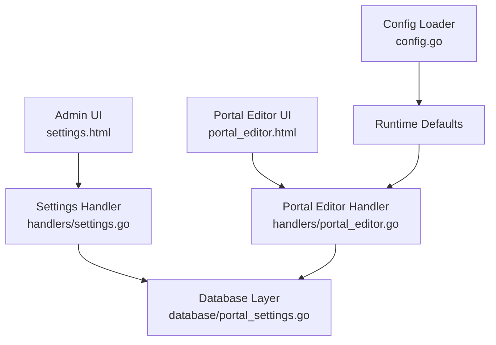
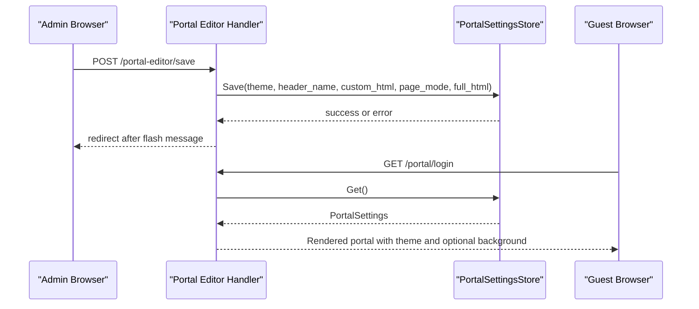
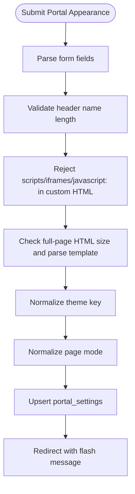
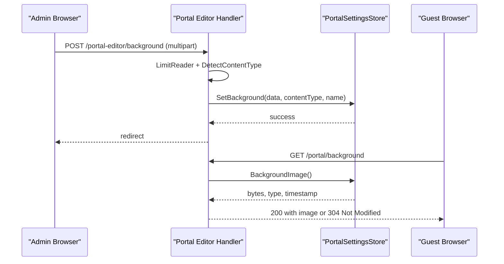
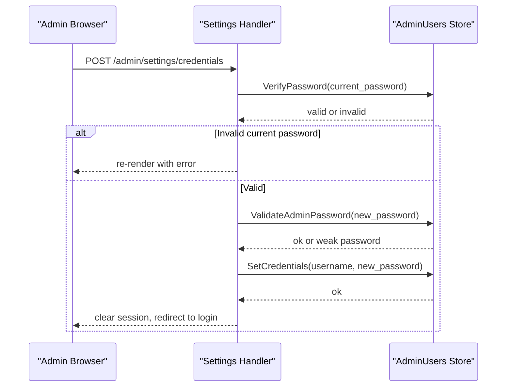
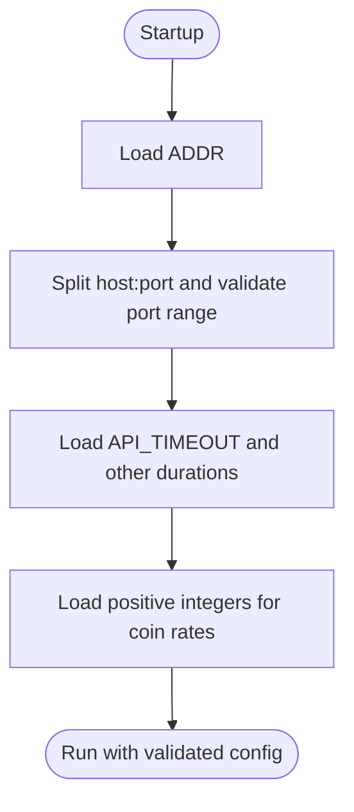
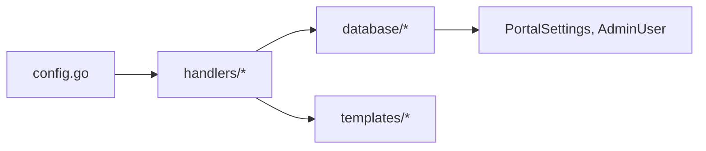

# Settings Management

<cite>
**Referenced Files in This Document**   
- [config.go](file://config.go)
- [handlers/settings.go](file://handlers/settings.go)
- [database/portal_settings.go](file://database/portal_settings.go)
- [handlers/portal_editor.go](file://handlers/portal_editor.go)
- [templates/settings.html](file://templates/settings.html)
- [templates/portal_editor.html](file://templates/portal_editor.html)
</cite>

## Table of Contents
1. [Introduction](#introduction)
2. [Project Structure](#project-structure)
3. [Core Components](#core-components)
4. [Architecture Overview](#architecture-overview)
5. [Detailed Component Analysis](#detailed-component-analysis)
6. [Dependency Analysis](#dependency-analysis)
7. [Performance Considerations](#performance-considerations)
8. [Troubleshooting Guide](#troubleshooting-guide)
9. [Conclusion](#conclusion)
10. [Appendices](#appendices)

## Introduction
This document explains the settings management interface for the controller. It covers:
- Portal branding configuration (theme, header name, custom HTML, background image).
- Panel security settings (operator credentials and brute-force protection).
- Network-related configuration parameters exposed through environment variables.
- System preferences such as session timeouts and cookie behavior.
- Form validation rules, persistence to the database, and real-time preview capabilities.
- The settings schema, default values, and environment variable overrides.
- Guidance for creating custom setting groups and implementing validation rules.

The documentation is organized so that both operators and developers can understand how settings are presented, validated, saved, and applied.

## Project Structure
The settings feature spans handlers, templates, and a dedicated database model:
- Handlers provide the admin UI endpoints for portal appearance and operator credentials.
- Templates render the settings pages and include inline help text and error messages.
- The database layer defines the portal settings schema, defaults, limits, and persistence logic.
- The application configuration loader reads environment variables at startup and supplies runtime defaults.

**Diagram sources**
- [handlers/settings.go:11-43](file://handlers/settings.go#L11-L43)
- [handlers/portal_editor.go:17-52](file://handlers/portal_editor.go#L17-L52)
- [database/portal_settings.go:12-66](file://database/portal_settings.go#L12-L66)
- [config.go:14-76](file://config.go#L14-L76)

**Section sources**
- [handlers/settings.go:11-43](file://handlers/settings.go#L11-L43)
- [handlers/portal_editor.go:17-52](file://handlers/portal_editor.go#L17-L52)
- [database/portal_settings.go:12-66](file://database/portal_settings.go#L12-L66)
- [config.go:14-76](file://config.go#L14-L76)

## Core Components
- Portal branding settings: theme, header name, custom HTML, page mode, full-page HTML, and background image.
- Operator credential settings: username and password change with current-password verification.
- Security posture: brute-force protection and session handling.
- Environment-driven system preferences: address binding, timeouts, cookies, and panel paths.

Key responsibilities:
- Presenting editable fields and live previews.
- Validating inputs against size, type, and policy constraints.
- Persisting changes to the database.
- Serving the configured portal to guests with the selected theme and assets.

**Section sources**
- [database/portal_settings.go:140-173](file://database/portal_settings.go#L140-L173)
- [handlers/settings.go:11-22](file://handlers/settings.go#L11-L22)
- [handlers/portal_editor.go:17-36](file://handlers/portal_editor.go#L17-L36)
- [config.go:14-76](file://config.go#L14-L76)

## Architecture Overview
The settings flow has two main entry points:
- Portal editor: manages guest-facing branding and layout.
- Settings page: manages panel access credentials and displays security posture.

**Diagram sources**
- [handlers/portal_editor.go:305-388](file://handlers/portal_editor.go#L305-L388)
- [database/portal_settings.go:201-285](file://database/portal_settings.go#L201-L285)
- [handlers/portal_editor.go:520-543](file://handlers/portal_editor.go#L520-L543)

## Detailed Component Analysis

### Portal Branding Configuration
The portal editor allows operators to configure:
- Theme selection from a fixed set of built-in themes.
- Header name displayed on the captive portal.
- Custom HTML block injected into the built-in page.
- Page mode: built-in layout or full custom page.
- Full-page HTML when using the custom page mode.
- Background image upload and removal.

Schema and defaults:
- Theme keys are stable identifiers; unknown values normalize to the default theme.
- Default theme is defined centrally and used when no row exists.
- Header name length is bounded by runes.
- Custom HTML and full-page HTML have byte-size limits.
- Background images must be JPEG or PNG and are capped by size.

Persistence:
- Text fields are upserted into a single-row table.
- Background image columns are updated separately to avoid accidental overwrites.
- Timestamps track updates and background replacement time.

Validation highlights:
- Theme normalization prevents unknown values.
- Header name rune count enforced.
- Custom HTML rejects scripts, iframes, and javascript: links.
- Full-page HTML is parsed to detect template errors before saving.
- Background content type is sniffed from bytes and restricted to safe types.

Real-time preview:
- The editor provides a link to preview the live sign-in page.
- Themes are rendered with CSS swatches in the editor.
- A starter full-page template helps operators see placeholders filled with sample data.

**Diagram sources**
- [handlers/portal_editor.go:305-388](file://handlers/portal_editor.go#L305-L388)
- [database/portal_settings.go:247-285](file://database/portal_settings.go#L247-L285)

**Section sources**
- [database/portal_settings.go:31-66](file://database/portal_settings.go#L31-L66)
- [database/portal_settings.go:140-173](file://database/portal_settings.go#L140-L173)
- [database/portal_settings.go:201-285](file://database/portal_settings.go#L201-L285)
- [handlers/portal_editor.go:137-170](file://handlers/portal_editor.go#L137-L170)
- [handlers/portal_editor.go:305-388](file://handlers/portal_editor.go#L305-L388)
- [templates/portal_editor.html:28-158](file://templates/portal_editor.html#L28-L158)

### Background Image Handling
Background image operations include upload, removal, and serving:
- Upload validates file size and content type by sniffing bytes.
- Removal clears image columns while preserving text fields.
- Serving sets cache headers and conditional responses based on ETag and Last-Modified.

**Diagram sources**
- [handlers/portal_editor.go:390-466](file://handlers/portal_editor.go#L390-L466)
- [handlers/portal_editor.go:487-518](file://handlers/portal_editor.go#L487-L518)
- [database/portal_settings.go:287-360](file://database/portal_settings.go#L287-L360)

**Section sources**
- [handlers/portal_editor.go:390-466](file://handlers/portal_editor.go#L390-L466)
- [handlers/portal_editor.go:487-518](file://handlers/portal_editor.go#L487-L518)
- [database/portal_settings.go:287-360](file://database/portal_settings.go#L287-L360)

### Panel Credentials and Security Posture
The settings page manages operator credentials:
- Requires current password to authorize changes.
- Validates new username and password against policies.
- Enforces minimum password length and match confirmation.
- Revokes all sessions upon successful credential update.

Security posture display:
- Shows per-address attempt limits and per-account lockout escalation.
- Notes that counters are in memory and reset on restart.

**Diagram sources**
- [handlers/settings.go:45-119](file://handlers/settings.go#L45-L119)
- [database/admin_users.go:36-91](file://database/admin_users.go#L36-L91)

**Section sources**
- [handlers/settings.go:11-22](file://handlers/settings.go#L11-L22)
- [handlers/settings.go:45-119](file://handlers/settings.go#L45-L119)
- [templates/settings.html:41-87](file://templates/settings.html#L41-L87)
- [templates/settings.html:90-102](file://templates/settings.html#L90-L102)

### Network Configuration Parameters
Network-related parameters are primarily controlled via environment variables at startup:
- ADDR binds the HTTP server.
- API_TIMEOUT controls API call durations.
- RADIUS and hotspot-related network options are validated in network handlers.

Validation patterns:
- ADDR is split into host and port with range checks.
- Duration and integer helpers reject invalid values and fall back to defaults.
- RouterOS interval strings are validated where applicable.

**Diagram sources**
- [config.go:20-76](file://config.go#L20-L76)
- [config.go:128-149](file://config.go#L128-L149)

**Section sources**
- [config.go:20-76](file://config.go#L20-L76)
- [config.go:79-126](file://config.go#L79-L126)
- [config.go:128-149](file://config.go#L128-L149)

### System Preferences
System preferences include:
- ADMIN_PATH and DASHBOARD_AT_ROOT for panel routing.
- SECURE_COOKIES for cookie security flags.
- ADMIN_SESSION_TTL for panel session lifetime.
- PORTAL_NAME, PORTAL_TAGLINE, PORTAL_SUPPORT for default portal branding.

These values are read from environment variables and used throughout handlers and templates.

**Section sources**
- [config.go:32-46](file://config.go#L32-L46)
- [config.go:48-57](file://config.go#L48-L57)

## Dependency Analysis
The settings subsystem depends on:
- Database models for portal settings and admin users.
- Handlers for request processing and rendering.
- Templates for user-facing markup and inline validation feedback.
- Environment configuration for runtime defaults.

**Diagram sources**
- [config.go:14-76](file://config.go#L14-L76)
- [handlers/settings.go:1-120](file://handlers/settings.go#L1-L120)
- [handlers/portal_editor.go:1-544](file://handlers/portal_editor.go#L1-L544)
- [database/portal_settings.go:1-361](file://database/portal_settings.go#L1-L361)

**Section sources**
- [config.go:14-76](file://config.go#L14-L76)
- [handlers/settings.go:1-120](file://handlers/settings.go#L1-L120)
- [handlers/portal_editor.go:1-544](file://handlers/portal_editor.go#L1-L544)
- [database/portal_settings.go:1-361](file://database/portal_settings.go#L1-L361)

## Performance Considerations
- Background image caching:
  - Caching headers reduce repeated downloads for guests.
  - Conditional requests return 304 Not Modified when unchanged.
- Database writes:
  - Upserts minimize extra queries for portal settings.
  - Separate image column updates prevent accidental overwrites.
- Validation efficiency:
  - Early rejection of oversized uploads and invalid content types avoids unnecessary storage.
  - Template parsing for full-page HTML occurs only when non-empty.

[No sources needed since this section provides general guidance]

## Troubleshooting Guide
Common issues and resolutions:
- Portal theme not applying:
  - Ensure the theme key matches one of the supported values; unknown keys normalize to the default.
- Custom HTML rejected:
  - Remove scripts, iframes, and javascript: links from the custom HTML block.
- Full-page HTML not visible:
  - Switch page mode to full and ensure the HTML compiles without template errors.
- Background image not showing:
  - Confirm the file is JPEG or PNG and within the size limit; verify Content-Type sniffing result.
- Credential update fails:
  - Provide the correct current password; ensure new password meets minimum length and matches confirmation.
- Session timeout behavior:
  - Adjust ADMIN_SESSION_TTL with a valid duration string; invalid values are ignored and logged.

**Section sources**
- [database/portal_settings.go:71-88](file://database/portal_settings.go#L71-L88)
- [handlers/portal_editor.go:345-360](file://handlers/portal_editor.go#L345-L360)
- [handlers/portal_editor.go:413-439](file://handlers/portal_editor.go#L413-L439)
- [handlers/settings.go:67-94](file://handlers/settings.go#L67-L94)
- [config.go:48-57](file://config.go#L48-L57)

## Conclusion
The settings management interface provides a secure and flexible way to customize the captive portal and protect the admin panel. Portal branding is persisted with strict validation, while operator credentials are guarded by current-password verification and brute-force protections. Environment variables supply robust defaults for network and system preferences. Operators can preview changes and rely on clear error messages to maintain a consistent guest experience.

[No sources needed since this section summarizes without analyzing specific files]

## Appendices

### Settings Schema and Defaults
- Portal settings table includes theme, header name, custom HTML, page mode, full HTML, background image metadata, and timestamps.
- Default theme is defined centrally; missing rows use defaults.
- Limits:
  - Header name: rune count bound.
  - Custom HTML: byte size bound.
  - Full-page HTML: larger byte size bound.
  - Background image: byte size bound and allowed MIME types.

**Section sources**
- [database/portal_settings.go:18-29](file://database/portal_settings.go#L18-L29)
- [database/portal_settings.go:53-66](file://database/portal_settings.go#L53-L66)
- [database/portal_settings.go:194-199](file://database/portal_settings.go#L194-L199)

### Environment Variables Reference
- ADDR: Listen address with host:port or port-only.
- API_TIMEOUT: Positive duration for API calls.
- PORTAL_NAME, PORTAL_TAGLINE, PORTAL_SUPPORT: Default portal branding.
- ADMIN_PATH, DASHBOARD_AT_ROOT: Panel routing preferences.
- SECURE_COOKIES: Enable secure cookies.
- ADMIN_SESSION_TTL: Panel session lifetime duration.
- COIN_NODE_TOKEN, COIN_SECONDS_PER_PULSE, COIN_CENTS_PER_PULSE, COIN_IDLE_TTL, COIN_MAX_SESSION_MINUTES: Piso Wi-Fi coin slot configuration.

**Section sources**
- [config.go:20-76](file://config.go#L20-L76)
- [config.go:79-126](file://config.go#L79-L126)

### Creating Custom Setting Groups
To add a new settings group:
- Define a struct representing the settings fields.
- Add DDL and constants for limits and defaults in the database layer.
- Implement getters and setters with validation and normalization.
- Create handler methods to load, validate, save, and serve the settings.
- Add template sections for input fields, help text, and error display.
- Wire routes under an authenticated admin path.

Validation rule implementation pattern:
- Use helper functions for common checks (length, enum membership, duration parsing).
- Return typed errors for policy violations.
- Normalize unknown values to safe defaults.
- Log warnings for ignored invalid environment variables.

**Section sources**
- [database/portal_settings.go:140-173](file://database/portal_settings.go#L140-L173)
- [handlers/portal_editor.go:137-170](file://handlers/portal_editor.go#L137-L170)
- [handlers/portal_editor.go:305-388](file://handlers/portal_editor.go#L305-L388)
- [config.go:79-126](file://config.go#L79-L126)