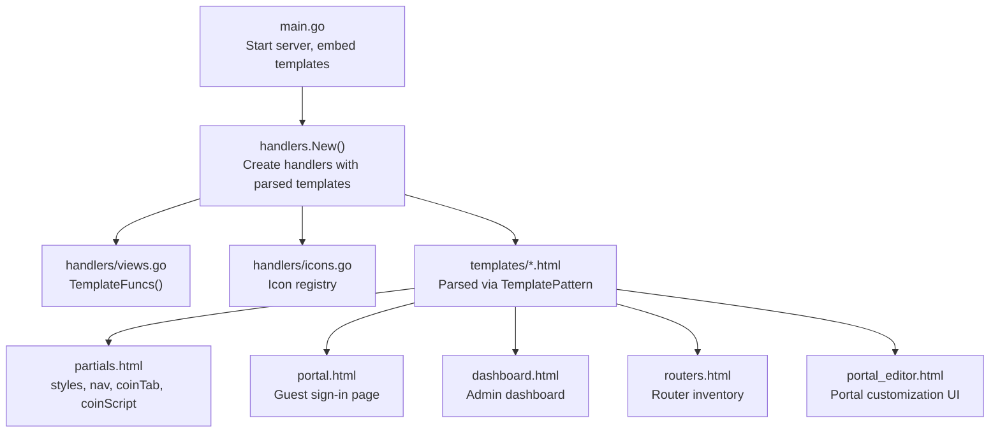
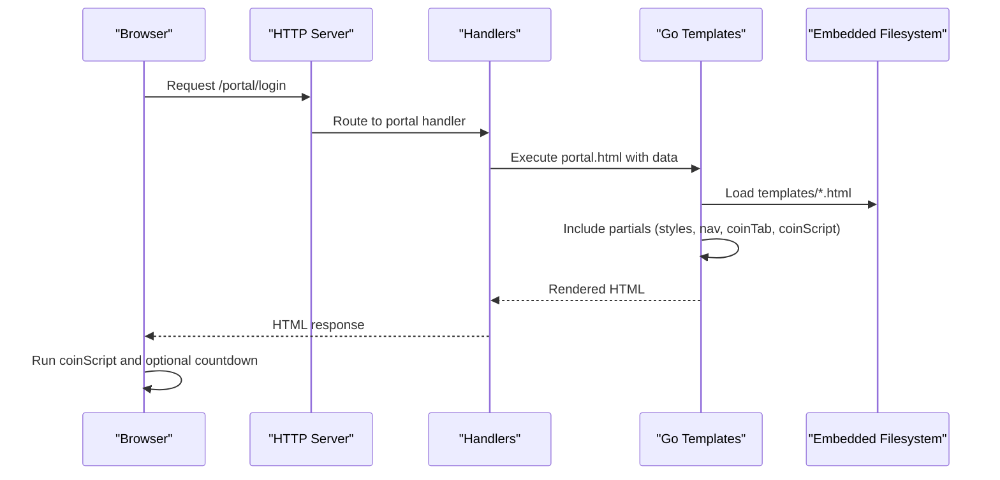
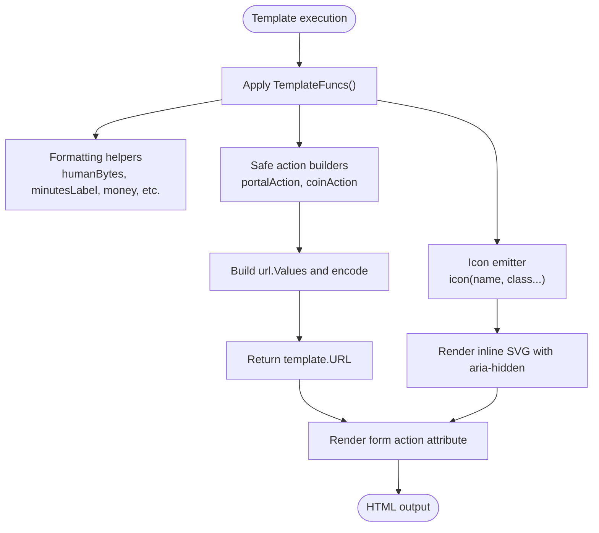
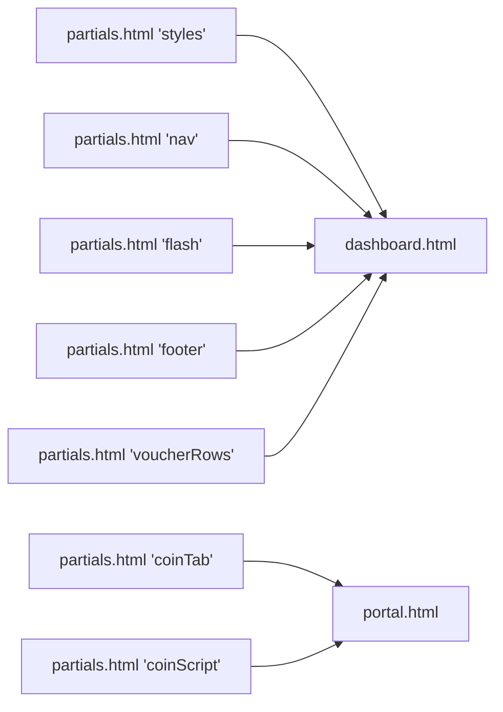
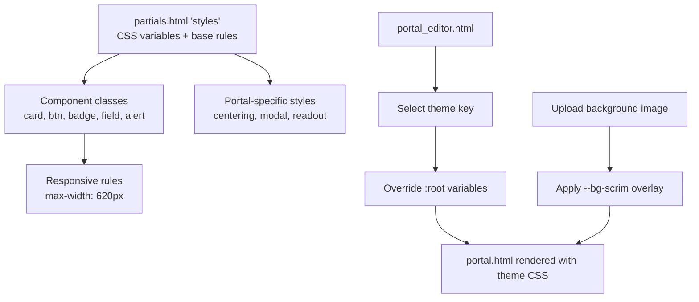
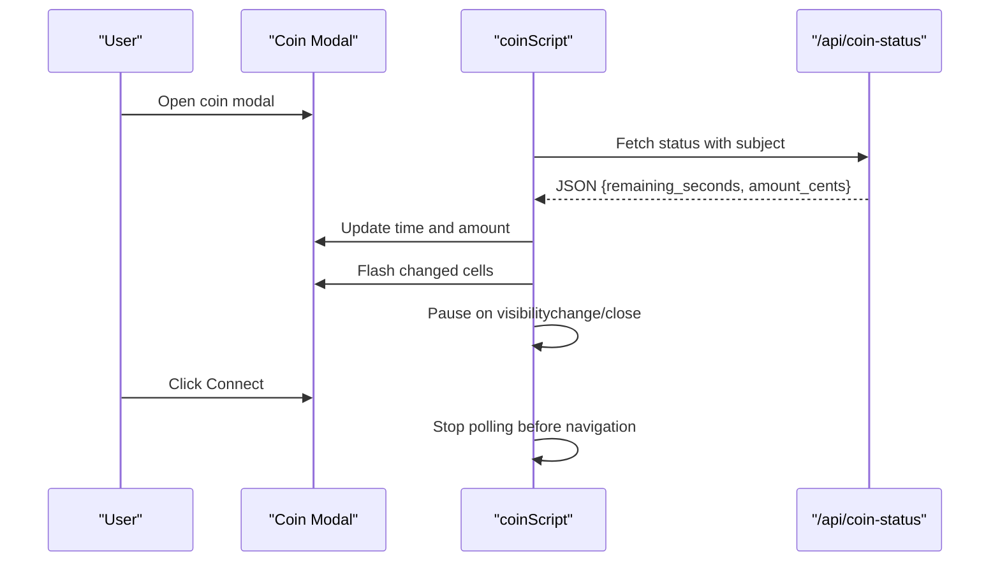
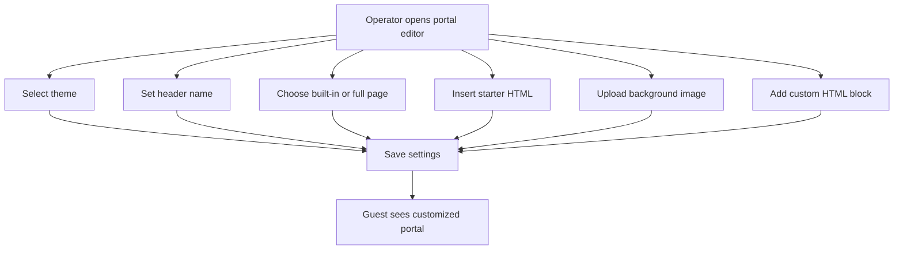
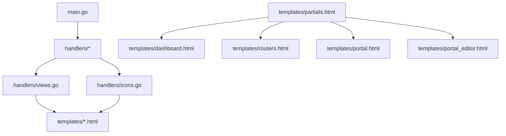

# Template System & Customization

<cite>
**Referenced Files in This Document**
- [main.go](file://main.go)
- [views.go](file://handlers/views.go)
- [icons.go](file://handlers/icons.go)
- [partials.html](file://templates/partials.html)
- [portal.html](file://templates/portal.html)
- [dashboard.html](file://templates/dashboard.html)
- [routers.html](file://templates/routers.html)
- [portal_editor.html](file://templates/portal_editor.html)
- [templates_test.go](file://handlers/templates_test.go)
</cite>

## Table of Contents
1. [Introduction](#introduction)
2. [Project Structure](#project-structure)
3. [Core Components](#core-components)
4. [Architecture Overview](#architecture-overview)
5. [Detailed Component Analysis](#detailed-component-analysis)
6. [Dependency Analysis](#dependency-analysis)
7. [Performance Considerations](#performance-considerations)
8. [Troubleshooting Guide](#troubleshooting-guide)
9. [Conclusion](#conclusion)
10. [Appendices](#appendices)

## Introduction
This document explains the template system and UI customization framework used by the controller. It covers how Go templates are loaded, how reusable partials compose pages, how layout inheritance is achieved through shared blocks, and how the styling system is organized around CSS custom properties. It also documents JavaScript integration patterns, event handling, AJAX polling, and the captive portal editor that lets operators customize guest-facing pages safely. Finally, it provides guidelines for extending views, maintaining design consistency, and implementing accessibility standards.

## Project Structure
The template system lives under `templates/` and is embedded into the binary at build time. The server parses these templates once during startup and passes a shared function map to every rendered page. Reusable UI pieces such as styles, navigation, flash messages, CSRF tokens, voucher rows, coin tab markup, and coin update logic are defined as named template blocks so pages can include them without duplicating code.

**Diagram sources**
- [main.go:234-245](file://main.go#L234-L245)
- [views.go:12-52](file://handlers/views.go#L12-L52)
- [partials.html:1-255](file://templates/partials.html#L1-L255)
- [portal.html:1-105](file://templates/portal.html#L1-L105)
- [dashboard.html:1-60](file://templates/dashboard.html#L1-L60)
- [routers.html:1-10](file://templates/routers.html#L1-L10)
- [portal_editor.html:1-25](file://templates/portal_editor.html#L1-L25)

**Section sources**
- [main.go:30-31](file://main.go#L30-L31)
- [main.go:234-245](file://main.go#L234-L245)
- [views.go:12-52](file://handlers/views.go#L12-L52)
- [partials.html:1-255](file://templates/partials.html#L1-L255)

## Core Components
- Template engine initialization: templates are embedded and parsed once at startup using a glob pattern.
- Shared helper functions: formatting helpers, URL builders, icon emitter, and small arithmetic utilities are exposed to all templates.
- Icon system: semantic names resolve to inline SVG glyphs, keeping icons consistent and CSP-safe.
- Partial templates: shared styles, navigation, flash alerts, CSRF tokens, voucher table rows, captive portal starter HTML, coin tab markup, and coin polling script.
- Page templates: admin pages and the guest-facing portal compose partials rather than duplicating layout or behavior.

Key responsibilities:
- `main.go`: embeds templates, parses them, creates handlers, and starts the HTTP server.
- `handlers/views.go`: defines the template function map and safe URL builders for hotspot login flows.
- `handlers/icons.go`: maps icon names to SVG paths and renders them consistently.
- `templates/partials.html`: centralizes CSS variables, responsive rules, shared components, and interactive scripts.
- `templates/portal.html`: guest sign-in page that composes partials and supports theme/background customization.
- `templates/dashboard.html` and `templates/routers.html`: admin pages demonstrating layout inheritance and AJAX usage.
- `templates/portal_editor.html`: operator UI for choosing themes, header text, full-page mode, background images, and custom HTML.

**Section sources**
- [main.go:234-245](file://main.go#L234-L245)
- [views.go:15-52](file://handlers/views.go#L15-L52)
- [icons.go:8-95](file://handlers/icons.go#L8-L95)
- [partials.html:1-255](file://templates/partials.html#L1-L255)
- [portal.html:1-105](file://templates/portal.html#L1-L105)
- [dashboard.html:1-60](file://templates/dashboard.html#L1-L60)
- [routers.html:1-10](file://templates/routers.html#L1-L10)
- [portal_editor.html:1-25](file://templates/portal_editor.html#L1-L25)

## Architecture Overview
At runtime, the application loads configuration, opens the database, parses embedded templates, seeds the admin account, and registers routes. Every handler receives the same parsed template set and uses the shared function map. Pages render partials for common UI elements, while interactive features use vanilla JavaScript embedded directly in templates because captive portal guests have no internet access.

**Diagram sources**
- [main.go:234-245](file://main.go#L234-L245)
- [views.go:12-52](file://handlers/views.go#L12-L52)
- [portal.html:1-105](file://templates/portal.html#L1-L105)
- [partials.html:340-747](file://templates/partials.html#L340-L747)

## Detailed Component Analysis

### Go Template Engine Usage
Templates are embedded from `templates/*.html` and parsed with a shared function map. The function map exposes helpers for human-readable numbers, time labels, money formatting, status classes, percentage calculations, sequence generation, string normalization, and safe action URL construction for hotspot login flows.

Important behaviors:
- Action URLs for captive portal login and coin connection are built with `url.Values` and returned as `template.URL` to avoid unsafe percent-encoding of query parameters.
- Helpers normalize types that templates cannot express natively, such as integer kinds and nullable timestamps.
- The icon helper emits inline SVGs from a centralized registry, supporting size/modifier classes.

**Diagram sources**
- [views.go:15-52](file://handlers/views.go#L15-L52)
- [views.go:268-339](file://handlers/views.go#L268-L339)
- [icons.go:75-95](file://handlers/icons.go#L75-L95)

**Section sources**
- [main.go:234-237](file://main.go#L234-L237)
- [views.go:12-52](file://handlers/views.go#L12-L52)
- [views.go:268-339](file://handlers/views.go#L268-L339)
- [icons.go:75-95](file://handlers/icons.go#L75-L95)

### Partial Templates and Layout Inheritance
Partial templates define named blocks that pages include via `{{template}}`. This project does not use nested layout files; instead, each page includes shared blocks for styles, navigation, flash messages, CSRF tokens, footer, and feature-specific partials like voucher rows and coin tab/markup.

Shared blocks:
- `styles`: global CSS variables, base styles, component classes, responsive breakpoints, and portal-specific rules.
- `nav`: topbar with brand, navigation links, active state, and sign-out form.
- `flash`: alert banners with semantic icons.
- `csrf`: hidden CSRF token input.
- `voucherRows`: reusable table rows for voucher management.
- `portalStarter`: a complete starter HTML document for custom portal pages.
- `coinTab`: modal markup for the coin slot flow.
- `coinScript`: live polling script for coin balance updates.

Pages compose these blocks to maintain consistent layout and behavior across admin and guest interfaces.

**Diagram sources**
- [partials.html:1-255](file://templates/partials.html#L1-L255)
- [partials.html:428-516](file://templates/partials.html#L428-L516)
- [partials.html:340-747](file://templates/partials.html#L340-L747)
- [dashboard.html:62-65](file://templates/dashboard.html#L62-L65)
- [portal.html:7-102](file://templates/portal.html#L7-L102)

**Section sources**
- [partials.html:1-255](file://templates/partials.html#L1-L255)
- [partials.html:428-516](file://templates/partials.html#L428-L516)
- [partials.html:340-747](file://templates/partials.html#L340-L747)
- [dashboard.html:62-65](file://templates/dashboard.html#L62-L65)
- [portal.html:7-102](file://templates/portal.html#L7-L102)

### Styling System: CSS Organization, Breakpoints, and Themes
The styling system centers on CSS custom properties declared in the `styles` partial. These variables control background colors, panel shades, line borders, text color, muted text, accent colors, border radius, shadows, and the scrim overlay used when a background image is present.

Key characteristics:
- Global variables in `:root` provide a single source of truth for colors and spacing.
- Component classes (`card`, `btn`, `badge`, `field`, `alert`, `grid`) enforce consistent UI structure.
- Responsive behavior is handled with a mobile breakpoint at 620px, adjusting padding, navigation wrapping, and grid layouts.
- Portal-specific styles center the sign-in card, make it readable over background images, and style the coin modal and readout cells.
- Theme customization is provided by redefining CSS variables per theme. Built-in themes redefine only the variables needed to change appearance without altering markup.

Theme customization options:
- Operators choose a theme key through the portal editor.
- Each theme supplies a swatch preview and a CSS block that overrides CSS variables.
- A background image can be uploaded and applied behind the portal card with a scrim overlay.
- Custom HTML can be appended inside the portal card when using the built-in page mode.

**Diagram sources**
- [partials.html:1-255](file://templates/partials.html#L1-L255)
- [portal_editor.html:28-44](file://templates/portal_editor.html#L28-L44)
- [portal_editor.html:213-251](file://templates/portal_editor.html#L213-L251)
- [portal.html:8-10](file://templates/portal.html#L8-L10)

**Section sources**
- [partials.html:1-255](file://templates/partials.html#L1-L255)
- [portal_editor.html:28-44](file://templates/portal_editor.html#L28-L44)
- [portal_editor.html:213-251](file://templates/portal_editor.html#L213-L251)
- [portal.html:8-10](file://templates/portal.html#L8-L10)

### JavaScript Integration Patterns, Event Handling, and AJAX Interactions
JavaScript is embedded directly in templates because captive portal guests have no internet access. The code avoids external dependencies and uses vanilla DOM APIs.

Common patterns:
- Event listeners for clicks, changes, visibility changes, and keyboard events.
- Polling with `setInterval` for live updates, paused when tabs are hidden or modals are closed.
- `fetch` calls to REST endpoints with error handling that preserves last known data.
- Text content updates via `textContent` to prevent XSS from network responses.
- Data attributes to pass server-rendered values into client-side logic.

Examples:
- Coin tab polling: polls `/api/coin-status`, updates time and amount, flashes changed cells, disables connect until credit is ready, and stops polling on navigation.
- Dashboard traffic graph: selects router and interface, fetches interfaces and traffic points, draws RX/TX lines on a canvas, formats bytes and rates, and handles resize and refresh actions.

**Diagram sources**
- [partials.html:519-747](file://templates/partials.html#L519-L747)
- [dashboard.html:253-580](file://templates/dashboard.html#L253-L580)

**Section sources**
- [partials.html:519-747](file://templates/partials.html#L519-L747)
- [dashboard.html:253-580](file://templates/dashboard.html#L253-L580)

### Extending the UI with Custom Views
To add a new admin view:
1. Create a new template file under `templates/` that includes `{{template "styles" .}}`, `{{template "nav" .}}`, `{{template "flash" .}}`, and `{{template "footer" .}}`.
2. Use existing component classes (`card`, `grid`, `form-grid`, `field`, `btn`, `badge`) to keep visual consistency.
3. Add any page-specific `<style>` after including shared styles.
4. Register a route in the handlers package and pass the required data model to the template.
5. If the view needs icons, use the `icon` helper with semantic names.
6. If the view needs AJAX, follow the dashboard traffic graph pattern: attach event listeners, call REST endpoints, handle errors gracefully, and update DOM via `textContent`.

Guidelines:
- Keep scripts self-contained and avoid external assets.
- Use data attributes to pass server-rendered values into client logic.
- Preserve accessibility: associate labels with inputs, use `role="status"` for live hints, and ensure focus management for modals.
- Validate forms server-side and display errors using the shared `.error` class.

**Section sources**
- [dashboard.html:1-60](file://templates/dashboard.html#L1-L60)
- [dashboard.html:253-580](file://templates/dashboard.html#L253-L580)
- [partials.html:1-255](file://templates/partials.html#L1-L255)

### Maintaining Design Consistency
- Prefer shared component classes over ad-hoc styles.
- Use CSS variables for colors, spacing, and shadows; override them only in theme blocks.
- Keep typography consistent with the base font stack and heading sizes.
- Use badges for status indicators and align numeric columns with `.num`.
- Ensure buttons and links follow the shared `.btn` and `.btn.primary/.danger` patterns.
- Use the icon helper for consistent glyph sizing and semantics.

**Section sources**
- [partials.html:1-255](file://templates/partials.html#L1-L255)
- [icons.go:8-95](file://handlers/icons.go#L8-L95)

### Implementing Accessibility Standards
- Use semantic HTML: headings, lists, tables with headers, and forms with labels.
- Provide `aria-label` for close buttons and `aria-controls`/`aria-expanded` for dialog triggers.
- Announce live updates with `role="status"` and `aria-live="polite"`.
- Manage focus when opening/closing modals.
- Ensure keyboard support: Escape closes modals, and controls are reachable via Tab.
- Avoid relying solely on color; pair badges with text labels where possible.

**Section sources**
- [partials.html:360-425](file://templates/partials.html#L360-L425)
- [partials.html:701-743](file://templates/partials.html#L701-L743)

### Captive Portal Customization Workflow
Operators can customize the guest-facing portal through the portal editor:
- Choose a built-in theme that redefines CSS variables.
- Set a header name shown on the portal.
- Select between the built-in page and a full custom page.
- Insert a starter HTML document as a starting point.
- Upload a background image; the portal applies a scrim overlay to keep contrast.
- Add custom HTML inside the portal card when using the built-in page.

Security considerations:
- Custom HTML runs in the guest browser and may contain JavaScript.
- Remote scripts, iframes, and javascript: links are blocked by the server’s security policy.
- Only the panel operator can reach the editor, but compromise of that account allows arbitrary page content.

**Diagram sources**
- [portal_editor.html:25-159](file://templates/portal_editor.html#L25-L159)
- [portal_editor.html:213-251](file://templates/portal_editor.html#L213-L251)
- [portal.html:8-10](file://templates/portal.html#L8-L10)

**Section sources**
- [portal_editor.html:25-159](file://templates/portal_editor.html#L25-L159)
- [portal_editor.html:213-251](file://templates/portal_editor.html#L213-L251)
- [portal.html:8-10](file://templates/portal.html#L8-L10)

## Dependency Analysis
The template system has clear boundaries:
- `main.go` depends on `handlers` for template parsing and handler creation.
- `handlers/views.go` provides template functions consumed by all templates.
- `handlers/icons.go` provides the icon registry used by templates via the `icon` helper.
- `templates/partials.html` is included by multiple pages and defines shared behavior.
- Admin pages depend on partials and may include additional page-specific scripts.
- The captive portal depends on partials and theme CSS injected by the handler.

**Diagram sources**
- [main.go:234-245](file://main.go#L234-L245)
- [views.go:12-52](file://handlers/views.go#L12-L52)
- [icons.go:8-95](file://handlers/icons.go#L8-L95)
- [partials.html:1-255](file://templates/partials.html#L1-L255)

**Section sources**
- [main.go:234-245](file://main.go#L234-L245)
- [views.go:12-52](file://handlers/views.go#L12-L52)
- [icons.go:8-95](file://handlers/icons.go#L8-L95)
- [partials.html:1-255](file://templates/partials.html#L1-L255)

## Performance Considerations
- Templates are parsed once at startup and reused for all requests.
- Inline scripts avoid external asset loading, which is critical for captive portals without internet access.
- Coin polling runs only while the modal is open and pauses when the tab is hidden, reducing unnecessary requests.
- Dashboard traffic polling uses a fixed interval and clears intervals when selections change.
- Canvas drawing respects device pixel ratio and resizes on window resize to avoid blurry graphics.
- Error handling preserves last known data instead of blanking screens during transient failures.

[No sources needed since this section provides general guidance]

## Troubleshooting Guide
Common issues and resolutions:
- Template parse errors: missing blocks or unbalanced directives surface early due to tests that assert all expected templates and partials exist.
- Broken hotspot login: ensure action URLs are built with `portalAction` or `coinAction`; plain strings would percent-encode query parameters and break MikroTik handshakes.
- Missing icons: unknown icon names render nothing; verify the semantic name exists in the icon registry.
- No coin updates: check that the modal is open, the subject is present, and the status endpoint returns valid JSON.
- Graph not updating: verify router and interface selection, and confirm the REST endpoints return points arrays.

**Section sources**
- [templates_test.go:10-50](file://handlers/templates_test.go#L10-L50)
- [views.go:268-339](file://handlers/views.go#L268-L339)
- [icons.go:75-95](file://handlers/icons.go#L75-L95)
- [partials.html:519-747](file://templates/partials.html#L519-L747)
- [dashboard.html:478-578](file://templates/dashboard.html#L478-L578)

## Conclusion
The template system combines Go’s standard template engine with embedded files, shared partials, and a robust function map to deliver consistent admin and guest interfaces. The styling system relies on CSS variables and component classes, enabling theme customization without markup changes. JavaScript integration is pragmatic and secure, using inline scripts, data attributes, and resilient AJAX patterns. Operators can customize the captive portal safely through the portal editor, while developers can extend the UI by following established composition and accessibility patterns.

[No sources needed since this section summarizes without analyzing specific files]

## Appendices

### Best Practices for Template Development
- Compose pages from partials; avoid duplicating styles, navigation, or scripts.
- Use shared component classes for visual consistency.
- Pass data via templates and read it in scripts through data attributes.
- Handle errors gracefully and preserve user-visible state.
- Keep scripts dependency-free and scoped to the page.
- Test template parsing and rendering to catch naming and signature changes early.

**Section sources**
- [partials.html:1-255](file://templates/partials.html#L1-L255)
- [dashboard.html:253-580](file://templates/dashboard.html#L253-L580)
- [templates_test.go:10-50](file://handlers/templates_test.go#L10-L50)