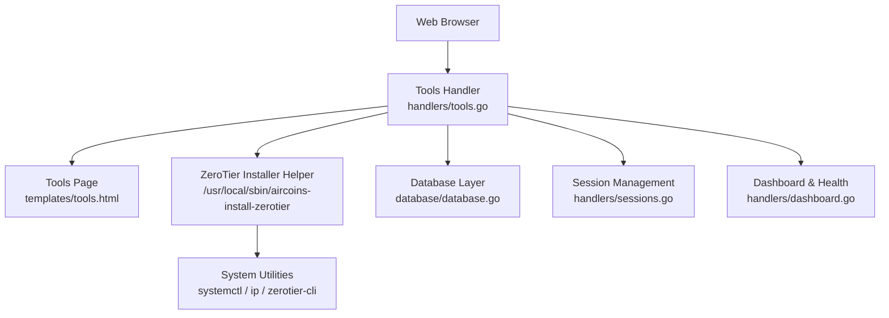
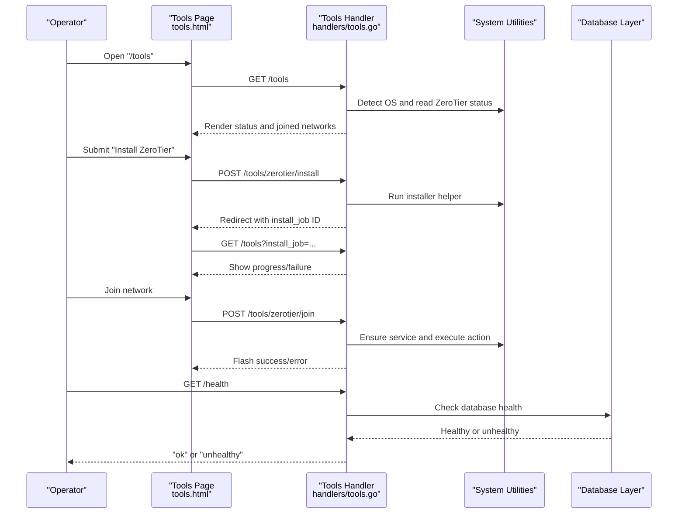
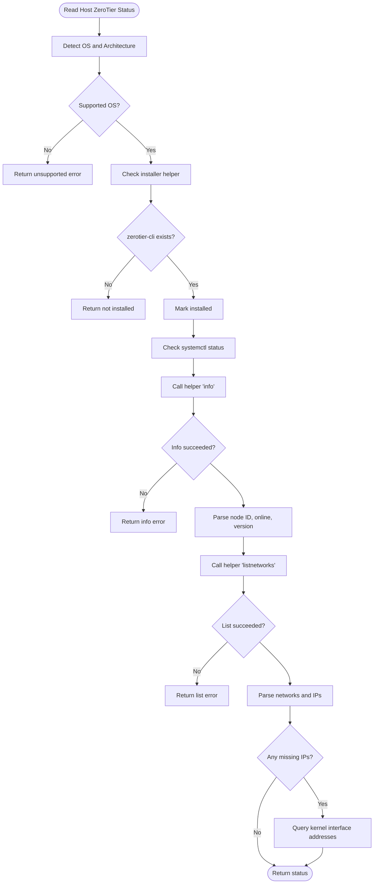
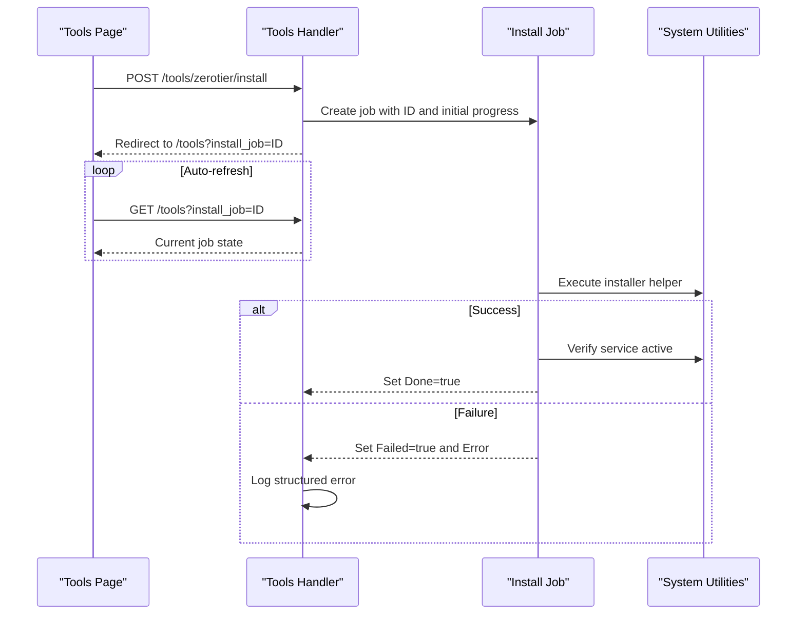
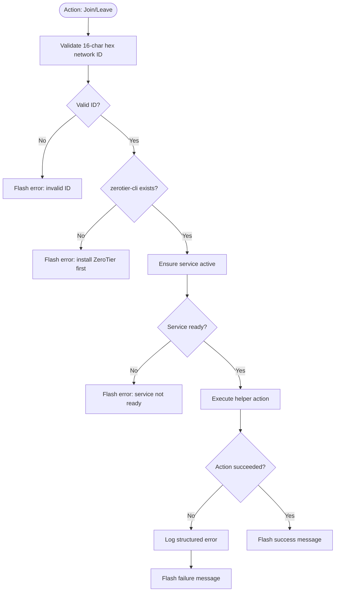
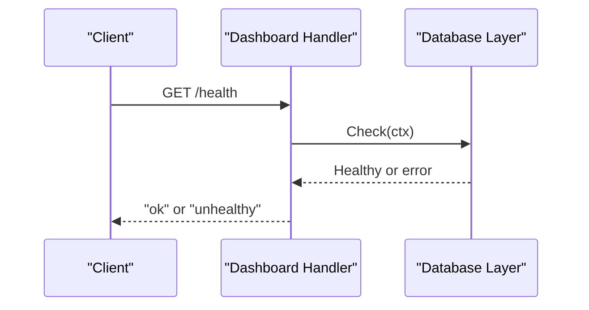
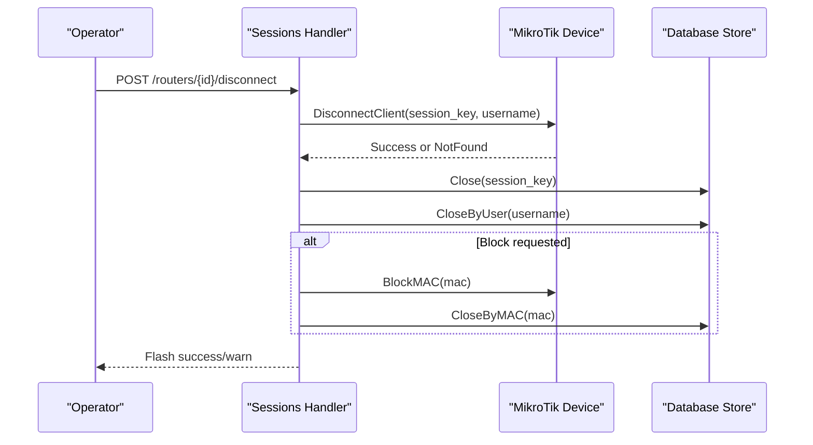
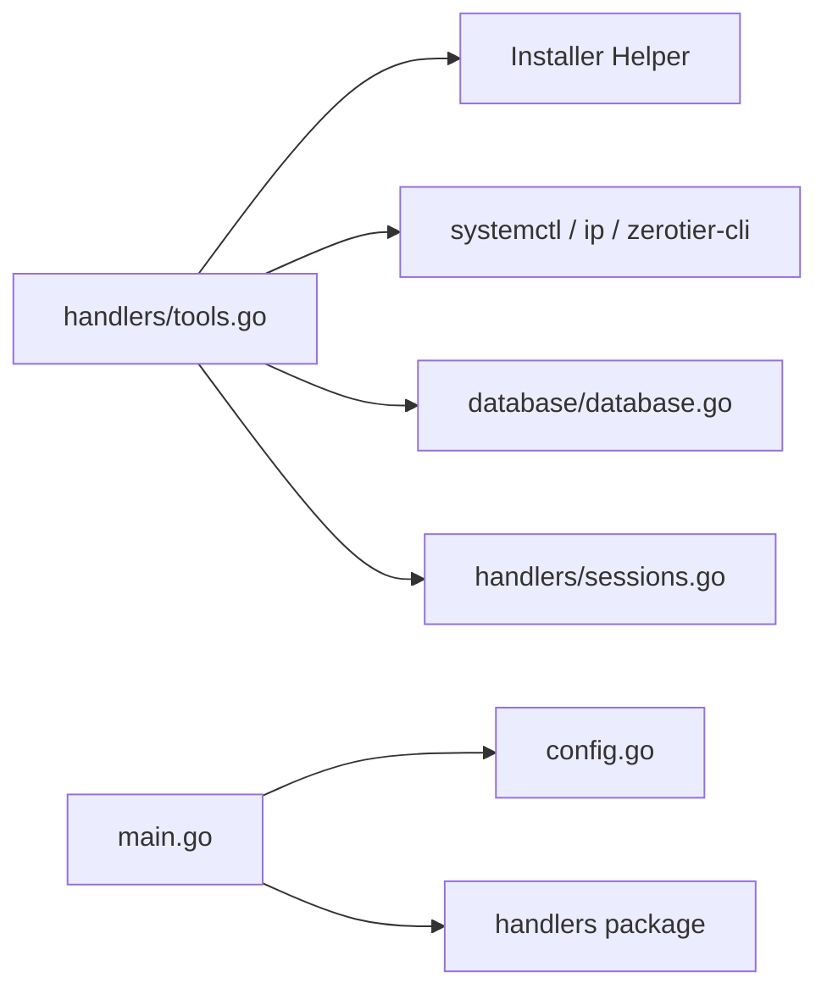

# Tools Interface

<cite>
**Referenced Files in This Document**
- [tools.go](file://handlers/tools.go)
- [tools.html](file://templates/tools.html)
- [tools_test.go](file://handlers/tools_test.go)
- [database.go](file://database/database.go)
- [sessions.go](file://handlers/sessions.go)
- [dashboard.go](file://handlers/dashboard.go)
- [main.go](file://main.go)
- [config.go](file://config.go)
</cite>

## Table of Contents
1. [Introduction](#introduction)
2. [Project Structure](#project-structure)
3. [Core Components](#core-components)
4. [Architecture Overview](#architecture-overview)
5. [Detailed Component Analysis](#detailed-component-analysis)
6. [Dependency Analysis](#dependency-analysis)
7. [Performance Considerations](#performance-considerations)
8. [Troubleshooting Guide](#troubleshooting-guide)
9. [Conclusion](#conclusion)

## Introduction
This document describes the Tools interface that provides system utilities and maintenance operations for the Aircoins MikroTik Controller. The primary focus is ZeroTier network management on the host machine, including peer discovery, network configuration, and connection troubleshooting. It also documents related system utility functions such as database health checks, session management, and operational diagnostics. Safety measures include OS support checks, helper presence validation, CSRF protection, timeouts, structured logging, and user-visible error messages.

## Project Structure
The Tools interface is implemented as a web handler backed by an HTML template. It interacts with the operating system through a privileged helper script to manage ZeroTier, and it integrates with the controller’s database layer for general system state and diagnostics.

**Diagram sources**
- [tools.go:270-404](file://handlers/tools.go#L270-L404)
- [tools.html:1-104](file://templates/tools.html#L1-L104)
- [database.go:70-165](file://database/database.go#L70-L165)
- [sessions.go:127-284](file://handlers/sessions.go#L127-L284)
- [dashboard.go:88-98](file://handlers/dashboard.go#L88-L98)

**Section sources**
- [tools.go:270-404](file://handlers/tools.go#L270-L404)
- [tools.html:1-104](file://templates/tools.html#L1-L104)
- [database.go:70-165](file://database/database.go#L70-L165)
- [sessions.go:127-284](file://handlers/sessions.go#L127-L284)
- [dashboard.go:88-98](file://handlers/dashboard.go#L88-L98)

## Core Components
- ZeroTier status and installation page: Displays host OS information, ZeroTier installation state, service status, node identity, version, and joined networks. Provides actions to install ZeroTier, start the service, join or leave networks, and refresh status.
- ZeroTier installation job tracking: Asynchronous background job with progress, completion, failure, and error details exposed via URL parameter.
- Host OS detection and supported platform checks: Validates Debian, Ubuntu, and Armbian environments and architecture.
- Network address resolution: Reads ZeroTier-assigned addresses and falls back to kernel interface addresses when needed.
- Database health and dashboard integration: Uses the database layer for health checks and aggregates operational statistics.
- Session management utilities: Provides disconnect, block, and unblock operations for hotspot clients, which are relevant for maintenance workflows.

**Section sources**
- [tools.go:75-160](file://handlers/tools.go#L75-L160)
- [tools.go:270-404](file://handlers/tools.go#L270-L404)
- [tools.html:19-99](file://templates/tools.html#L19-L99)
- [database.go:143-165](file://database/database.go#L143-L165)
- [sessions.go:127-284](file://handlers/sessions.go#L127-L284)

## Architecture Overview
The Tools interface follows a layered approach:
- HTTP handlers render pages and process form submissions.
- A privileged helper script performs ZeroTier installation and management tasks.
- System commands (systemctl, ip, zerotier-cli) provide runtime status and control.
- The database layer offers persistence and health checks.
- The dashboard and sessions modules provide complementary operational controls.

**Diagram sources**
- [tools.go:270-404](file://handlers/tools.go#L270-L404)
- [tools.html:19-99](file://templates/tools.html#L19-L99)
- [dashboard.go:88-98](file://handlers/dashboard.go#L88-L98)

## Detailed Component Analysis

### ZeroTier Status and Installation
- OS detection reads architecture and distribution metadata; only Debian, Ubuntu, and Armbian are supported.
- Helper presence check determines whether the one-click installer is provisioned.
- Service readiness is verified using systemctl and the helper’s info command.
- Joined networks are parsed from JSON output, supporting multiple field names across different builds.
- If ZeroTier reports no managed IP, the handler queries the kernel interface addresses and filters link-local IPv6.

**Diagram sources**
- [tools.go:75-160](file://handlers/tools.go#L75-L160)
- [tools.go:162-228](file://handlers/tools.go#L162-L228)
- [tools.go:230-260](file://handlers/tools.go#L230-L260)

**Section sources**
- [tools.go:75-160](file://handlers/tools.go#L75-L160)
- [tools.go:162-228](file://handlers/tools.go#L162-L228)
- [tools.go:230-260](file://handlers/tools.go#L230-L260)
- [tools_test.go:57-89](file://handlers/tools_test.go#L57-L89)

### ZeroTier Installation Job
- Installation is initiated via a POST to the install endpoint.
- A background job updates percent, message, done, failed, and error fields.
- The UI auto-refreshes while the job is running and displays progress and errors.
- Failure paths log structured errors and truncate long outputs for safety.

**Diagram sources**
- [tools.go:286-335](file://handlers/tools.go#L286-L335)
- [tools.html:19-27](file://templates/tools.html#L19-L27)

**Section sources**
- [tools.go:286-335](file://handlers/tools.go#L286-L335)
- [tools.html:19-27](file://templates/tools.html#L19-L27)

### ZeroTier Network Actions (Join/Leave/Start)
- Network ID validation ensures a 16-character hexadecimal value.
- Service readiness is enforced before executing join or leave actions.
- Errors are truncated and logged; users receive flash messages indicating success or failure.
- Starting the service uses the helper if the service is inactive and zerotier-cli is present.

**Diagram sources**
- [tools.go:262-268](file://handlers/tools.go#L262-L268)
- [tools.go:337-353](file://handlers/tools.go#L337-L353)
- [tools.go:355-404](file://handlers/tools.go#L355-L404)

**Section sources**
- [tools.go:262-268](file://handlers/tools.go#L262-L268)
- [tools.go:337-353](file://handlers/tools.go#L337-L353)
- [tools.go:355-404](file://handlers/tools.go#L355-L404)

### Database Health and Operational Diagnostics
- The health endpoint returns “ok” or “unhealthy” based on database connectivity and integrity checks.
- The dashboard aggregates router inventory, open sessions, vouchers, and recent activity.
- These endpoints support system diagnostics and monitoring without exposing sensitive data.

**Diagram sources**
- [dashboard.go:88-98](file://handlers/dashboard.go#L88-L98)
- [database.go:143-146](file://database/database.go#L143-L146)

**Section sources**
- [dashboard.go:88-98](file://handlers/dashboard.go#L88-L98)
- [database.go:143-146](file://database/database.go#L143-L146)

### Session Maintenance Operations
- Disconnecting a client ends the session on the device and marks it closed locally.
- Blocking a MAC creates an IP binding and closes matching sessions.
- Unblocking removes an IP binding and restores access.
- These operations integrate with the database store to keep local state consistent.

**Diagram sources**
- [sessions.go:127-196](file://handlers/sessions.go#L127-L196)
- [sessions.go:198-284](file://handlers/sessions.go#L198-L284)

**Section sources**
- [sessions.go:127-196](file://handlers/sessions.go#L127-L196)
- [sessions.go:198-284](file://handlers/sessions.go#L198-L284)

## Dependency Analysis
The Tools interface depends on:
- Operating system utilities and ZeroTier components via a privileged helper.
- The database layer for health checks and operational data.
- The sessions module for maintenance workflows.
- Configuration and main entry points for server lifecycle and environment settings.

**Diagram sources**
- [tools.go:270-404](file://handlers/tools.go#L270-L404)
- [database.go:70-165](file://database/database.go#L70-L165)
- [sessions.go:127-284](file://handlers/sessions.go#L127-L284)
- [main.go:214-285](file://main.go#L214-L285)
- [config.go:20-77](file://config.go#L20-L77)

**Section sources**
- [tools.go:270-404](file://handlers/tools.go#L270-L404)
- [database.go:70-165](file://database/database.go#L70-L165)
- [sessions.go:127-284](file://handlers/sessions.go#L127-L284)
- [main.go:214-285](file://main.go#L214-L285)
- [config.go:20-77](file://config.go#L20-L77)

## Performance Considerations
- ZeroTier status reads use context timeouts to avoid hanging requests.
- Background installation jobs run asynchronously with bounded durations.
- Database connection pooling is tuned for SQLite with small pools to reduce contention.
- Output truncation prevents excessively large error logs.

[No sources needed since this section provides general guidance]

## Troubleshooting Guide
Common issues and resolutions:
- Unsupported OS: ZeroTier management requires Debian, Ubuntu, or Armbian.
- Missing installer helper: Re-run the provisioning script to install the helper.
- Service not active: Use the “Start ZeroTier service” action if available; otherwise verify systemctl status.
- Invalid network ID: Enter a 16-character hexadecimal ZeroTier network ID.
- Join/leave failures: Check helper output and logs; ensure zerotier-cli is installed and the service is running.
- Database health: Use the health endpoint to confirm database reachability.

Safety measures:
- OS support checks prevent unsupported environments from proceeding.
- Helper presence checks ensure required scripts exist.
- CSRF tokens protect state-changing forms.
- Timeouts bound all external calls.
- Structured logging records errors with context.
- Flash messages inform operators of outcomes.

**Section sources**
- [tools.go:75-160](file://handlers/tools.go#L75-L160)
- [tools.go:286-335](file://handlers/tools.go#L286-L335)
- [tools.go:355-404](file://handlers/tools.go#L355-L404)
- [dashboard.go:88-98](file://handlers/dashboard.go#L88-L98)

## Conclusion
The Tools interface provides robust ZeroTier network management capabilities on supported Linux hosts, with clear status reporting, asynchronous installation, and safe network operations. It integrates with the controller’s database and session management for comprehensive system diagnostics and maintenance. Safety mechanisms, including OS validation, helper checks, CSRF protection, timeouts, and structured logging, ensure reliable operation and clear operator feedback.