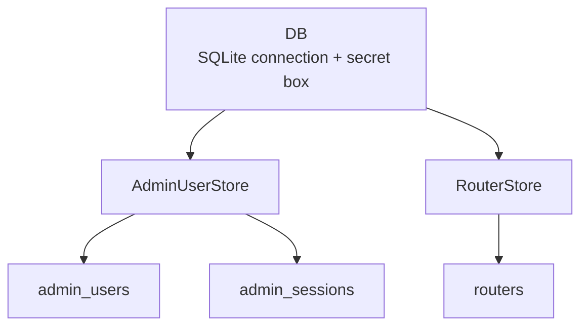
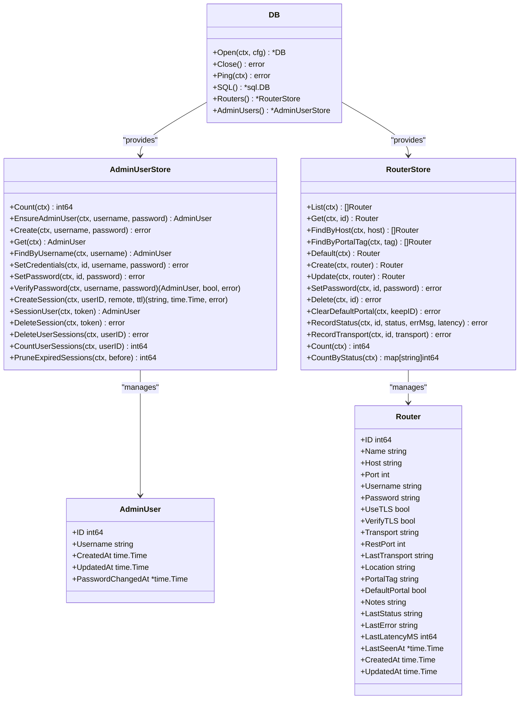
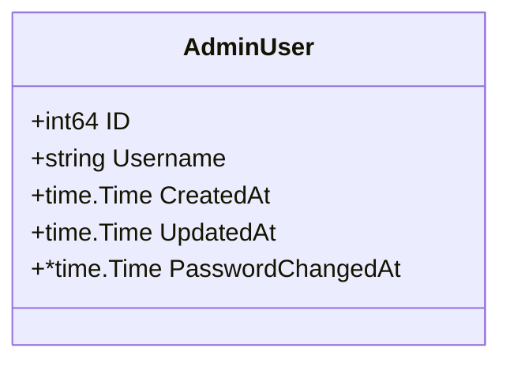
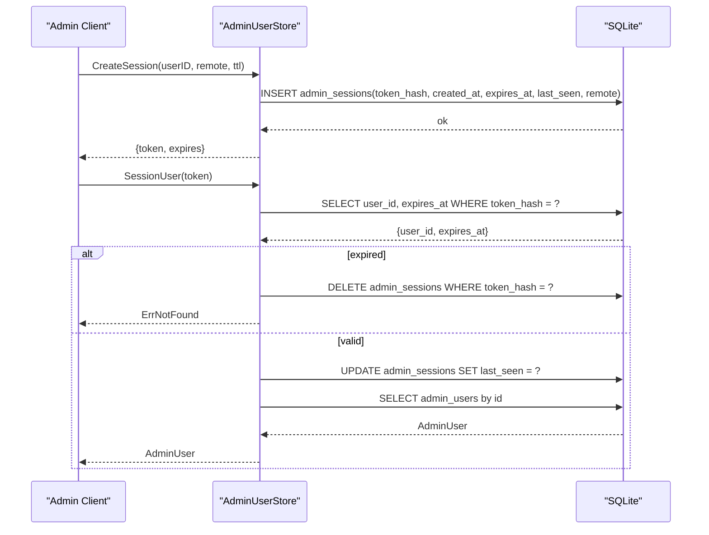
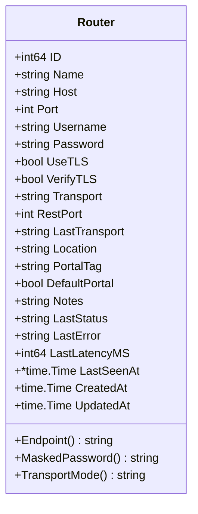
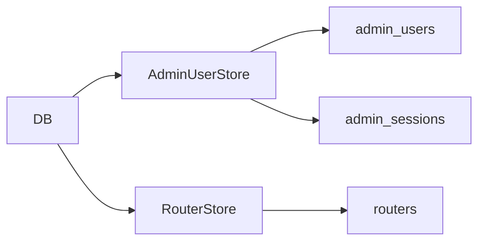

# Core Data Models

<cite>
**Referenced Files in This Document**
- [database.go](file://database/database.go)
- [migrations.go](file://database/migrations.go)
- [admin_users.go](file://database/admin_users.go)
- [admin_sessions.go](file://database/admin_sessions.go)
- [routers.go](file://database/routers.go)
</cite>

## Table of Contents
1. [Introduction](#introduction)
2. [Project Structure](#project-structure)
3. [Core Components](#core-components)
4. [Architecture Overview](#architecture-overview)
5. [Detailed Component Analysis](#detailed-component-analysis)
6. [Dependency Analysis](#dependency-analysis)
7. [Performance Considerations](#performance-considerations)
8. [Troubleshooting Guide](#troubleshooting-guide)
9. [Conclusion](#conclusion)

## Introduction
This document explains the core data models used by the controller for administrative access and router inventory: AdminUser, Session (administrative session), and Router. It covers field definitions, validation rules, primary keys, foreign key constraints, indexing patterns, entity lifecycles, state transitions, database-level business rules, JSON-style representations, Go struct mappings, and common CRUD and query patterns.

The persistence layer uses SQLite with a pure Go driver, applies migrations at startup, and enforces foreign keys through connection pragmas. Sensitive values such as admin passwords and router API credentials are handled securely: admin passwords are hashed with PBKDF2-HMAC-SHA256, while router passwords are encrypted at rest using a secret box.

## Project Structure
The relevant code lives under the `database` package:
- `database.go` opens the database, configures SQLite pragmas, and exposes store factories.
- `migrations.go` defines all DDL statements and migration versions.
- `admin_users.go` implements the AdminUser model and credential operations.
- `admin_sessions.go` implements administrative session creation, lookup, and cleanup.
- `routers.go` implements the Router model, transport modes, status tracking, and CRUD operations.

**Diagram sources**
- [database.go:62-116](file://database/database.go#L62-L116)
- [migrations.go:101-126](file://database/migrations.go#L101-L126)
- [migrations.go:22-46](file://database/migrations.go#L22-L46)

**Section sources**
- [database.go:1-21](file://database/database.go#L1-L21)
- [database.go:62-116](file://database/database.go#L62-L116)
- [migrations.go:215-287](file://database/migrations.go#L215-L287)

## Core Components
This section summarizes the three core entities and their responsibilities.

- AdminUser represents the single operator account that can sign into the panel. It stores normalized username, PBKDF2 hash, salt, iteration count, lifecycle timestamps, and password change time.
- Administrative Session represents an authenticated browser session tied to an AdminUser. Only the SHA-256 of the bearer token is stored; the raw token is returned to the client on login.
- Router represents a registered MikroTik device, its API credentials (encrypted at rest), transport configuration, portal routing metadata, connectivity status, and lifecycle timestamps.

Key cross-cutting behaviors:
- Primary keys are auto-incrementing integers.
- Foreign keys are enforced via SQLite pragmas.
- Timestamps are stored as UTC RFC3339 strings.
- Unique constraints prevent duplicate usernames and router names.
- Indexes optimize lookups by host, portal tag, expiry, user ID, MAC address, and more.

**Section sources**
- [admin_users.go:46-59](file://database/admin_users.go#L46-L59)
- [admin_sessions.go:16-50](file://database/admin_sessions.go#L16-L50)
- [routers.go:57-98](file://database/routers.go#L57-L98)
- [migrations.go:101-126](file://database/migrations.go#L101-L126)
- [migrations.go:22-46](file://database/migrations.go#L22-L46)

## Architecture Overview
The database layer provides typed stores that encapsulate SQL queries and domain logic. The AdminUserStore manages both AdminUser records and administrative sessions. The RouterStore manages router inventory and connectivity telemetry.

**Diagram sources**
- [database.go:62-165](file://database/database.go#L62-L165)
- [admin_users.go:46-59](file://database/admin_users.go#L46-L59)
- [admin_sessions.go:23-50](file://database/admin_sessions.go#L23-L50)
- [routers.go:57-118](file://database/routers.go#L57-L118)

## Detailed Component Analysis

### AdminUser Entity
AdminUser is the single operator account for the control panel. It includes identity fields, security-related storage, and lifecycle timestamps.

Field definitions and types:
- ID: integer primary key, auto-incremented.
- Username: text, case-insensitive unique.
- PasswordHash: text, PBKDF2-derived value.
- Salt: text, per-password random salt.
- Iterations: integer, work factor for PBKDF2.
- CreatedAt/UpdatedAt: text, UTC RFC3339 timestamps.
- PasswordChangedAt: nullable text timestamp.

Validation rules and business logic:
- Minimum password length is enforced before hashing.
- Username normalization trims whitespace and lowercases input.
- Duplicate usernames are rejected with a friendly error.
- Changing the password invalidates all existing sessions for that user.
- Verification uses constant-time comparison and performs a dummy derivation when the user is not found to mitigate timing attacks.

Primary key strategy:
- Auto-increment integer primary key.

Indexing pattern:
- Unique index on username (case-insensitive).

Lifecycle and state transitions:
- Bootstrap: EnsureAdminUser creates the first operator if none exists.
- Creation: Create hashes the password and inserts the row.
- Lookup: Get or FindByUsername retrieves the operator.
- Update: SetCredentials updates username/password and revokes sessions; SetPassword updates only the password and revokes sessions.
- Authentication: VerifyPassword validates credentials and returns the user on success.

Common CRUD and query patterns:
- Count: number of operator accounts.
- EnsureAdminUser: bootstrap path.
- Create: insert new operator.
- Get/FindByUsername: read by ID or name.
- SetCredentials/SetPassword: update credentials and revoke sessions.
- VerifyPassword: authenticate.

JSON-style representation:
- id: integer
- username: string
- created_at: ISO 8601 UTC string
- updated_at: ISO 8601 UTC string
- password_changed_at: ISO 8601 UTC string or null

Go struct mapping:
- ID, Username, CreatedAt, UpdatedAt, PasswordChangedAt map directly to the struct fields.

Security notes:
- Passwords are never stored in plaintext.
- Hashing uses PBKDF2-HMAC-SHA256 with configurable iterations and per-row salt.
- Comparison is constant-time to avoid timing side channels.

**Section sources**
- [admin_users.go:46-59](file://database/admin_users.go#L46-L59)
- [admin_users.go:87-98](file://database/admin_users.go#L87-L98)
- [admin_users.go:100-148](file://database/admin_users.go#L100-L148)
- [admin_users.go:150-197](file://database/admin_users.go#L150-L197)
- [admin_users.go:199-291](file://database/admin_users.go#L199-L291)
- [admin_users.go:293-328](file://database/admin_users.go#L293-L328)
- [migrations.go:101-111](file://database/migrations.go#L101-L111)

#### AdminUser Class Diagram

**Diagram sources**
- [admin_users.go:46-59](file://database/admin_users.go#L46-L59)

### Administrative Session Entity
Administrative sessions represent active operator logins. The system stores only the SHA-256 of the bearer token; the raw token is returned to the client upon successful creation. Sessions have creation, expiration, last seen, and remote address metadata.

Field definitions and types:
- ID: integer primary key, auto-incremented.
- UserID: integer foreign key referencing admin_users(id), cascade delete.
- TokenHash: text, unique SHA-256 of the bearer token.
- CreatedAt/ExpiresAt/LastSeen: text, UTC RFC3339 timestamps.
- Remote: text, truncated client IP or identifier.

Validation rules and business logic:
- Default TTL is applied when zero; negative TTLs are preserved for tests or immediate-expiry behavior.
- Expired tokens are deleted on lookup to keep the table small.
- Successful lookup refreshes last_seen.
- Deleting a session removes one token; deleting all sessions for a user revokes every login.
- CountUserSessions counts live (unexpired) sessions.
- PruneExpiredSessions removes expired rows older than a cutoff.

Primary key strategy:
- Auto-increment integer primary key.

Foreign key constraints:
- user_id references admin_users(id) with ON DELETE CASCADE.

Indexing pattern:
- Unique index on token_hash.
- Index on expires_at for pruning.
- Index on user_id for per-user session management.

Lifecycle and state transitions:
- Creation: CreateSession generates a random token, stores its hash, and returns the raw token plus expiry.
- Validation: SessionUser resolves token to user, deletes expired entries, and refreshes last_seen.
- Revocation: DeleteSession removes one token; DeleteUserSessions removes all tokens for a user.
- Cleanup: PruneExpiredSessions purges old expired rows.

Common CRUD and query patterns:
- CreateSession: mint session and return token.
- SessionUser: resolve token to user.
- DeleteSession: logout.
- DeleteUserSessions: revoke all sessions for a user.
- CountUserSessions: count active sessions.
- PruneExpiredSessions: maintenance task.

JSON-style representation:
- id: integer
- user_id: integer
- token_hash: string
- created_at: ISO 8601 UTC string
- expires_at: ISO 8601 UTC string
- last_seen: ISO 8601 UTC string
- remote: string

Go struct mapping:
- The session is primarily represented by its persisted fields and helper methods; the raw token is transient and returned from CreateSession.

Security notes:
- Only the SHA-256 of the token is stored.
- Constant-time handling and early deletion of expired tokens reduce replay risk.

**Section sources**
- [admin_sessions.go:16-50](file://database/admin_sessions.go#L16-L50)
- [admin_sessions.go:53-123](file://database/admin_sessions.go#L53-L123)
- [migrations.go:113-126](file://database/migrations.go#L113-L126)

#### Administrative Session Sequence Diagram

**Diagram sources**
- [admin_sessions.go:23-50](file://database/admin_sessions.go#L23-L50)
- [admin_sessions.go:53-82](file://database/admin_sessions.go#L53-L82)

### Router Entity
Router represents a registered MikroTik device and its API credentials. It supports multiple transports, TLS options, captive portal routing, and connectivity telemetry.

Field definitions and types:
- ID: integer primary key, auto-incremented.
- Name: text, case-insensitive unique.
- Host: text, device hostname or IP.
- Port: integer, default 8728, validated between 1 and 65535.
- Username: text, API username.
- Password: text, encrypted at rest; decrypted in memory for use by clients.
- UseTLS: boolean flag stored as integer.
- VerifyTLS: boolean flag stored as integer.
- Transport: text, normalized to auto/api/api-ssl/rest/rest-ssl.
- RestPort: integer, port for REST transports.
- LastTransport: text, last successful transport.
- Location: text.
- PortalTag: text, hotspot server-name/NAS identifier.
- DefaultPortal: boolean flag stored as integer.
- Notes: text.
- LastStatus: text, one of unknown/online/offline.
- LastError: text, truncated error message.
- LastLatencyMS: integer, milliseconds.
- LastSeenAt: nullable text timestamp.
- CreatedAt/UpdatedAt: text, UTC RFC3339 timestamps.

Validation rules and business logic:
- Port defaults to 8728 when omitted.
- Transport is normalized; unknown values become auto.
- Default portal flag is enforced to be unique across routers.
- Status recording updates last_status, last_error, last_latency_ms, and last_seen_at when online.
- Transport recording remembers the working protocol for future connections.
- Password is encrypted at rest and decrypted on read.

Primary key strategy:
- Auto-increment integer primary key.

Foreign key constraints:
- No direct foreign keys from routers to other tables in this schema.

Indexing pattern:
- Unique index on name (case-insensitive).
- Index on host for captive portal attribution.
- Index on portal_tag for hotspot server-name matching.

Lifecycle and state transitions:
- Creation: Create encrypts password, sets defaults, and inserts router.
- Read: Get/FindByHost/FindByPortalTag/Default retrieve routers.
- Update: Update mutates fields and preserves password unless explicitly changed.
- Password rotation: SetPassword updates only the encrypted password.
- Deletion: Delete removes the router; related sessions cascade or set NULL depending on relationship.
- Telemetry: RecordStatus and RecordTransport update operational metrics.

Common CRUD and query patterns:
- List: ordered by name.
- Get: by ID.
- FindByHost: attribute captive portal requests.
- FindByPortalTag: match hotspot server-name.
- Default: fallback portal device.
- Create/Update/Delete: full CRUD.
- SetPassword: rotate API password.
- ClearDefaultPortal: ensure only one default portal.
- RecordStatus/RecordTransport: update health and transport.
- Count/CountByStatus: dashboard metrics.

JSON-style representation:
- id: integer
- name: string
- host: string
- port: integer
- username: string
- password: string (not exposed in UI; masked)
- use_tls: boolean
- verify_tls: boolean
- transport: string
- rest_port: integer
- last_transport: string
- location: string
- portal_tag: string
- default_portal: boolean
- notes: string
- last_status: string
- last_error: string
- last_latency_ms: integer
- last_seen_at: ISO 8601 UTC string or null
- created_at: ISO 8601 UTC string
- updated_at: ISO 8601 UTC string

Go struct mapping:
- All fields map directly to the Router struct, including booleans and nullable timestamps.

Security notes:
- Router API passwords are encrypted at rest using a secret box and decrypted in memory only when needed.
- MaskedPassword returns a placeholder for UI display.

**Section sources**
- [routers.go:57-98](file://database/routers.go#L57-L98)
- [routers.go:120-188](file://database/routers.go#L120-L188)
- [routers.go:190-287](file://database/routers.go#L190-L287)
- [routers.go:289-345](file://database/routers.go#L289-L345)
- [routers.go:352-416](file://database/routers.go#L352-L416)
- [migrations.go:22-46](file://database/migrations.go#L22-L46)

#### Router Class Diagram

**Diagram sources**
- [routers.go:57-98](file://database/routers.go#L57-L98)
- [routers.go:100-115](file://database/routers.go#L100-L115)
- [routers.go:51-52](file://database/routers.go#L51-L52)

## Dependency Analysis
The following diagram shows how the database layer connects to the core tables and stores.

**Diagram sources**
- [database.go:151-165](file://database/database.go#L151-L165)
- [migrations.go:101-126](file://database/migrations.go#L101-L126)
- [migrations.go:22-46](file://database/migrations.go#L22-L46)

Relationships and constraints:
- admin_sessions.user_id references admin_users.id with cascade delete.
- Active sessions (active_sessions.router_id) reference routers.id with cascade delete.
- Vouchers and coin credits may reference routers.id with set-null on delete where applicable.

Indexing summary:
- admin_users.username: unique, case-insensitive.
- admin_sessions.token_hash: unique.
- admin_sessions.expires_at: pruning optimization.
- admin_sessions.user_id: per-user session queries.
- routers.name: unique, case-insensitive.
- routers.host: captive portal attribution.
- routers.portal_tag: hotspot server-name matching.

**Section sources**
- [migrations.go:44-46](file://database/migrations.go#L44-L46)
- [migrations.go:68-71](file://database/migrations.go#L68-L71)
- [migrations.go:95-99](file://database/migrations.go#L95-L99)
- [migrations.go:124-126](file://database/migrations.go#L124-L126)
- [migrations.go:48-66](file://database/migrations.go#L48-L66)

## Performance Considerations
- SQLite pragmas enable foreign keys, WAL journaling, synchronous NORMAL, and busy timeout for concurrency safety.
- Connection pool size is small by default because SQLite serializes writers.
- Text-based timestamps allow lexicographic range queries without conversion overhead.
- Indexes on host, portal_tag, expires_at, and user_id support frequent lookups and maintenance tasks.
- Truncation of long strings (error messages, remote addresses) prevents oversized columns.

[No sources needed since this section provides general guidance]

## Troubleshooting Guide
Common issues and resolutions:
- Weak password: Ensure the password meets the minimum length requirement.
- Duplicate username: Normalize and check uniqueness before creating or renaming.
- Not found errors: Verify IDs exist and that deletions did not remove referenced rows.
- Session not resolving: Check token validity, expiration, and whether it was revoked.
- Router not connecting: Validate host/port, transport mode, TLS settings, and stored credentials.
- Default portal conflicts: Ensure only one router has the default portal flag set.

Operational tips:
- Use PruneExpiredSessions periodically to reclaim space.
- Rotate router passwords using SetPassword to invalidate compromised secrets.
- Monitor CountByStatus to track router health.

**Section sources**
- [admin_users.go:87-98](file://database/admin_users.go#L87-L98)
- [admin_users.go:124-148](file://database/admin_users.go#L124-L148)
- [admin_sessions.go:110-123](file://database/admin_sessions.go#L110-L123)
- [routers.go:228-287](file://database/routers.go#L228-L287)

## Conclusion
The AdminUser, administrative Session, and Router models provide secure, well-indexed, and maintainable foundations for the controller’s administrative interface and device inventory. Security is prioritized through PBKDF2 hashing for admin passwords and encryption at rest for router credentials. Database constraints and indexes enforce integrity and performance. The documented lifecycles, validations, and query patterns should guide correct usage and troubleshooting.