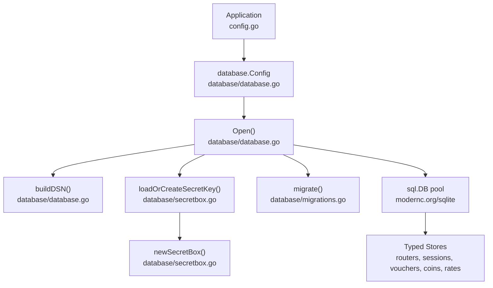
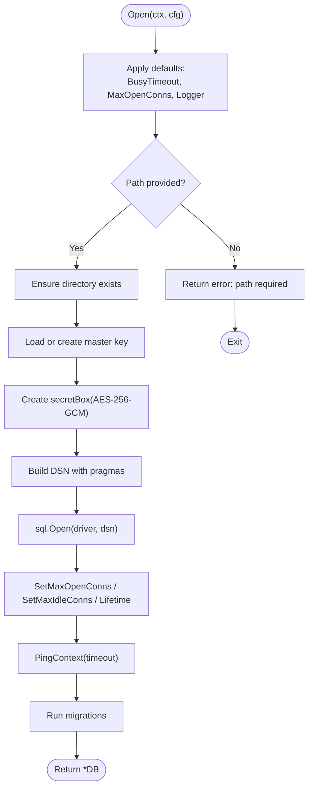
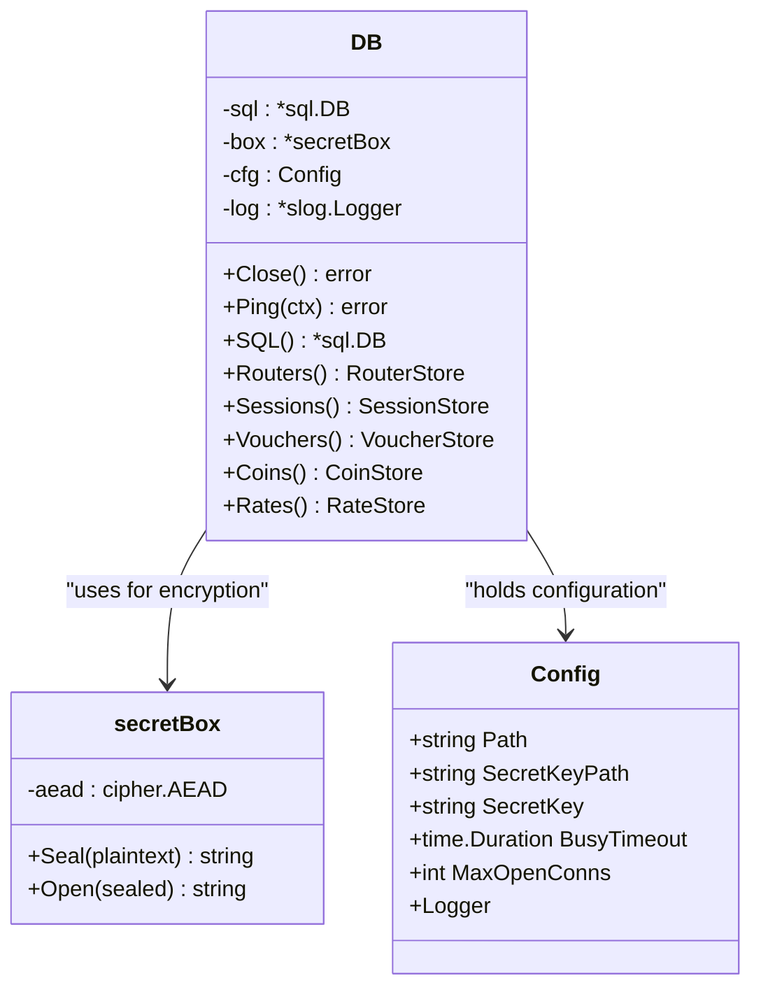
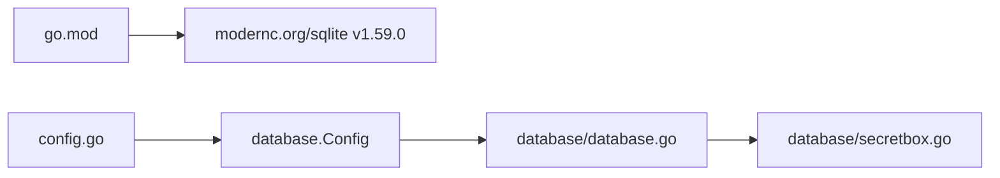

# Database Architecture & Configuration

<cite>
**Referenced Files in This Document**
- [database.go](file://database/database.go)
- [secretbox.go](file://database/secretbox.go)
- [config.go](file://config.go)
- [go.mod](file://go.mod)
</cite>

## Table of Contents
1. [Introduction](#introduction)
2. [Project Structure](#project-structure)
3. [Core Components](#core-components)
4. [Architecture Overview](#architecture-overview)
5. [Detailed Component Analysis](#detailed-component-analysis)
6. [Dependency Analysis](#dependency-analysis)
7. [Performance Considerations](#performance-considerations)
8. [Troubleshooting Guide](#troubleshooting-guide)
9. [Conclusion](#conclusion)

## Introduction
This document explains the database architecture and configuration for the controller’s SQLite-based persistence layer. It covers:
- The modernc.org/sqlite pure Go driver and why it is used
- Connection string construction with important SQLite pragmas
- Connection pool sizing and lifecycle management
- Master key management and AES-256-GCM encryption for router credentials
- Database initialization, migration execution, and health checks
- Configuration options such as Path, SecretKeyPath, SecretKey, BusyTimeout, and MaxOpenConns
- Operational examples and security best practices

## Project Structure
The database subsystem lives under `database/`. The main entry point for persistence is `database/database.go`, which opens the SQLite connection, applies migrations, and exposes typed stores. Security and master key handling are implemented in `database/secretbox.go`. Application-level environment loading maps environment variables into `database.Config` in `config.go`. The SQLite dependency is declared in `go.mod`.



**Diagram sources**
- [database.go:70-116](file://database/database.go#L70-L116)
- [database.go:118-133](file://database/database.go#L118-L133)
- [secretbox.go:84-132](file://database/secretbox.go#L84-L132)
- [secretbox.go:32-45](file://database/secretbox.go#L32-L45)
- [go.mod:5-8](file://go.mod#L5-L8)

**Section sources**
- [database.go:1-21](file://database/database.go#L1-L21)
- [config.go:14-18](file://config.go#L14-L18)
- [go.mod:5-8](file://go.mod#L5-L8)

## Core Components
- `database.Config`: Holds all database-related settings, including file path, secret key source, busy timeout, connection pool size, and logger.
- `DB`: Encapsulates the pooled `*sql.DB`, the credential cipher (`secretBox`), config, and logger. Provides typed store accessors and a raw SQL handle.
- `secretBox`: Implements AES-256-GCM AEAD encryption for sensitive fields (router API passwords). Handles sealing and opening values, plus master key resolution from config, environment, or file.
- `buildDSN`: Builds the modernc.org/sqlite DSN with pragmas for WAL mode, foreign keys, busy timeout, and synchronous behavior.
- `Open`: Validates configuration, ensures directory existence, loads or generates the master key, opens the database, sets pool limits, pings the database, runs migrations, and returns a ready-to-use handle.

**Section sources**
- [database.go:30-68](file://database/database.go#L30-L68)
- [database.go:70-116](file://database/database.go#L70-L116)
- [database.go:118-133](file://database/database.go#L118-L133)
- [secretbox.go:26-45](file://database/secretbox.go#L26-L45)
- [secretbox.go:47-82](file://database/secretbox.go#L47-L82)
- [secretbox.go:84-132](file://database/secretbox.go#L84-L132)

## Architecture Overview
The persistence layer uses a single SQLite database file managed by a small connection pool. All writes are serialized by SQLite; therefore, the pool is intentionally small to avoid contention overhead. Sensitive data such as router API passwords is encrypted at rest using AES-256-GCM before being written to the database. A master key is either provided explicitly, loaded from an environment variable, or generated securely on first run and stored in a restricted file.

```mermaid
sequenceDiagram
participant App as "Application"
participant DB as "database.Open()"
participant Key as "loadOrCreateSecretKey()"
participant Box as "newSecretBox()"
participant SQL as "sql.Open + Pool"
participant Mig as "migrate()"
App->>DB : Open(ctx, Config)
DB->>DB : withDefaults()
DB->>DB : validate Path
DB->>DB : ensure directory exists
DB->>Key : loadOrCreateSecretKey(Config)
Key-->>DB : []byte master key
DB->>Box : newSecretBox(key)
Box-->>DB : *secretBox
DB->>SQL : sql.Open(driverName, buildDSN(cfg))
DB->>SQL : SetMaxOpenConns / SetMaxIdleConns
DB->>SQL : PingContext(timeout)
DB->>Mig : migrate(ctx)
Mig-->>DB : success
DB-->>App : *DB handle
```

**Diagram sources**
- [database.go:70-116](file://database/database.go#L70-L116)
- [database.go:118-133](file://database/database.go#L118-L133)
- [secretbox.go:84-132](file://database/secretbox.go#L84-L132)
- [secretbox.go:32-45](file://database/secretbox.go#L32-L45)

## Detailed Component Analysis

### Database Initialization and Connection Management
Initialization performs several critical steps:
- Apply defaults for busy timeout and connection pool size when not configured.
- Validate that a database path is provided.
- Create the parent directory for the database file if needed.
- Resolve the master key via the priority chain described below.
- Build the DSN with pragmas and open the connection pool.
- Configure pool limits and lifetime.
- Ping the database to verify writability and connectivity.
- Run migrations to ensure schema consistency.

Connection string pragmas:
- `_pragma=busy_timeout(...)`: Controls how long connections wait when the database is locked.
- `_pragma=foreign_keys(1)`: Enforces referential integrity.
- `_pragma=journal_mode(WAL)`: Enables write-ahead logging for better concurrency.
- `_pragma=synchronous(NORMAL)`: Balances durability and performance.

For in-memory testing, a shared cache is enabled so multiple pooled connections share the same in-memory database.



**Diagram sources**
- [database.go:49-60](file://database/database.go#L49-L60)
- [database.go:70-116](file://database/database.go#L70-L116)
- [database.go:118-133](file://database/database.go#L118-L133)

**Section sources**
- [database.go:49-60](file://database/database.go#L49-L60)
- [database.go:70-116](file://database/database.go#L70-L116)
- [database.go:118-133](file://database/database.go#L118-L133)

### Master Key Management and Encryption
Master key resolution follows this priority order:
1. Explicit `Config.SecretKey` value (base64 or hex, 32 bytes).
2. Environment variable `AIRCOINS_SECRET_KEY`.
3. File at `Config.SecretKeyPath`. If missing, a secure random 32-byte key is generated and written with restrictive permissions.

Encryption details:
- Algorithm: AES-256-GCM (AEAD).
- Output format: versioned prefix followed by base64-encoded nonce+ciphertext.
- Empty plaintext remains empty to avoid leaking structure.
- Decryption validates format, length, and authenticates ciphertext; wrong keys produce explicit errors.



**Diagram sources**
- [secretbox.go:26-45](file://database/secretbox.go#L26-L45)
- [secretbox.go:47-82](file://database/secretbox.go#L47-L82)
- [database.go:62-68](file://database/database.go#L62-L68)
- [database.go:151-164](file://database/database.go#L151-L164)

**Section sources**
- [secretbox.go:15-24](file://database/secretbox.go#L15-L24)
- [secretbox.go:32-45](file://database/secretbox.go#L32-L45)
- [secretbox.go:47-82](file://database/secretbox.go#L47-L82)
- [secretbox.go:84-132](file://database/secretbox.go#L84-L132)
- [secretbox.go:134-151](file://database/secretbox.go#L134-L151)

### Configuration Options
The following options control database behavior and security:

- `Path`: Database file path. Use `:memory:` for tests. Default comes from `DB_PATH`.
- `SecretKeyPath`: File containing the master key. Default comes from `SECRET_KEY_PATH`.
- `SecretKey`: Overrides both `SecretKeyPath` and `AIRCOINS_SECRET_KEY` when set. Accepts base64 or hex, exactly 32 bytes.
- `BusyTimeout`: How long a connection waits on a locked database. Default is 5 seconds.
- `MaxOpenConns`: Maximum number of open connections in the pool. Default is 4. For SQLite, a small pool is recommended because writers are serialized.
- `Logger`: Optional structured logger for background database events.

Environment mapping:
- `DB_PATH` maps to `database.Config.Path`.
- `SECRET_KEY_PATH` maps to `database.Config.SecretKeyPath`.
- `AIRCOINS_SECRET_KEY` can provide the master key directly.

**Section sources**
- [database.go:30-47](file://database/database.go#L30-L47)
- [database.go:49-60](file://database/database.go#L49-L60)
- [config.go:20-25](file://config.go#L20-L25)
- [secretbox.go:15-24](file://database/secretbox.go#L15-L24)
- [secretbox.go:84-132](file://database/secretbox.go#L84-L132)

### Examples

#### Minimal Production Setup
- Set `DB_PATH` to a persistent location such as `/var/lib/aircoins/data/aircoins.db`.
- Leave `SECRET_KEY_PATH` unset to use the default key file path, or set it explicitly.
- On first boot, the system will generate a master key file with restrictive permissions.
- Keep `BusyTimeout` at the default unless you observe lock contention.
- Keep `MaxOpenConns` at the default (4) unless profiling indicates otherwise.

#### In-Memory Test Setup
- Set `DB_PATH=:memory:` to use an in-memory database.
- Provide `SecretKey` or `AIRCOINS_SECRET_KEY` for deterministic tests.
- Use a small `MaxOpenConns` since SQLite serializes writers.

#### Connection String Pragmas
- WAL mode improves concurrent read/write performance.
- Foreign keys enforce referential integrity.
- Busy timeout prevents immediate failures under contention.
- Synchronous NORMAL balances durability and speed.

**Section sources**
- [database.go:70-116](file://database/database.go#L70-L116)
- [database.go:118-133](file://database/database.go#L118-L133)
- [config.go:20-25](file://config.go#L20-L25)
- [secretbox.go:84-132](file://database/secretbox.go#L84-L132)

## Dependency Analysis
The persistence layer depends on:
- `modernc.org/sqlite`: Pure Go SQLite driver enabling builds without cgo.
- Standard library packages for crypto, encoding, context, and filesystem operations.
- Application configuration loader that maps environment variables into `database.Config`.



**Diagram sources**
- [go.mod:5-8](file://go.mod#L5-L8)
- [config.go:14-18](file://config.go#L14-L18)
- [database.go:1-21](file://database/database.go#L1-L21)
- [secretbox.go:1-13](file://database/secretbox.go#L1-L13)

**Section sources**
- [go.mod:5-8](file://go.mod#L5-L8)
- [config.go:14-18](file://config.go#L14-L18)
- [database.go:1-21](file://database/database.go#L1-L21)

## Performance Considerations
- Connection pool size: SQLite serializes writers; a small pool (default 4) avoids unnecessary overhead. Increase only after profiling shows contention.
- WAL mode: Improves concurrency for mixed workloads. Ensure adequate disk I/O capacity.
- Busy timeout: Tune based on expected write contention. Too low may cause frequent timeouts; too high may mask backend issues.
- Synchronous mode: NORMAL provides a good balance between safety and throughput.
- In-memory databases: Useful for tests but do not persist data across processes.

[No sources needed since this section provides general guidance]

## Troubleshooting Guide
Common issues and resolutions:
- Missing database path: Ensure `DB_PATH` is set and points to a writable directory.
- Permission denied on key file: Verify `SECRET_KEY_PATH` points to a file readable by the process, or allow the application to create it with restrictive permissions.
- Wrong master key: If decryption fails, confirm that `AIRCOINS_SECRET_KEY` or the key file matches the one used when data was created. Changing the key will invalidate previously encrypted credentials.
- Database ping failure: Check that the database file is writable and not locked by another process.
- Slow queries under load: Review `MaxOpenConns` and `BusyTimeout`; consider workload patterns and whether WAL mode is effective.

Operational hints:
- Use the logger to detect when a new master key is generated.
- Monitor ping failures during startup to catch permission or locking issues early.
- Keep backups of the database and master key file together; losing either compromises data integrity or confidentiality.

**Section sources**
- [database.go:70-116](file://database/database.go#L70-L116)
- [secretbox.go:84-132](file://database/secretbox.go#L84-L132)

## Conclusion
The database layer provides a secure, portable, and performant SQLite-backed persistence solution. It uses a pure Go driver for portability, a small connection pool tuned for SQLite’s serialization model, and AES-256-GCM encryption for sensitive fields. Configuration is flexible, supporting environment variables, explicit values, and secure key files. By following the recommended defaults and security practices, deployments can achieve reliable operation with strong protection for router credentials.

[No sources needed since this section summarizes without analyzing specific files]