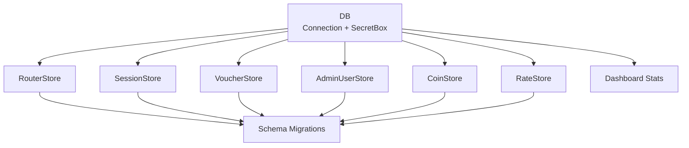
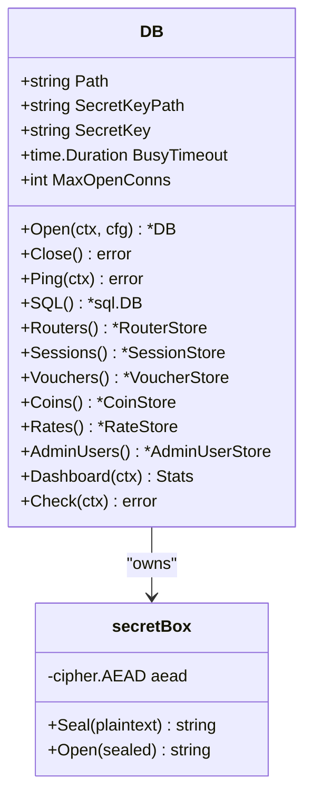
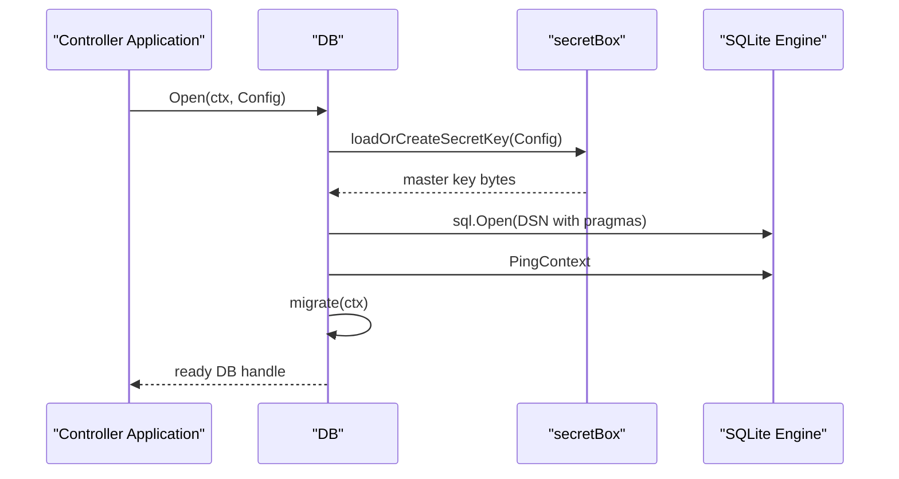
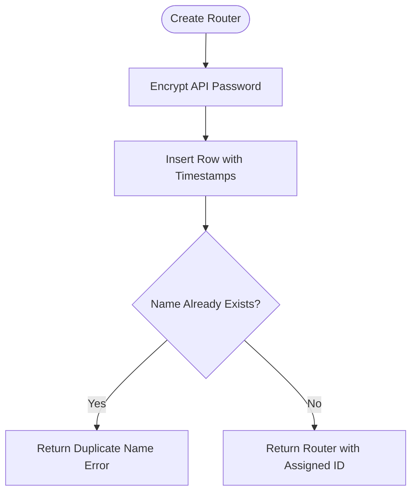
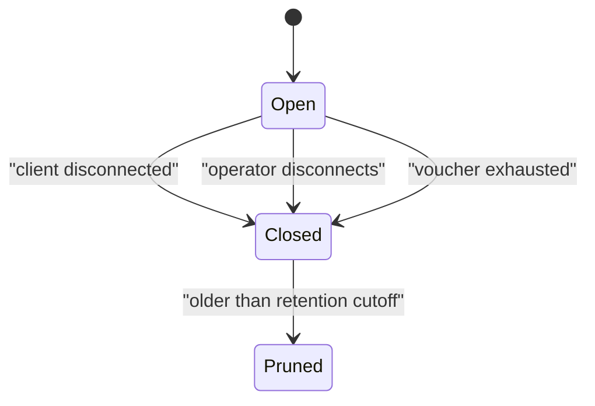
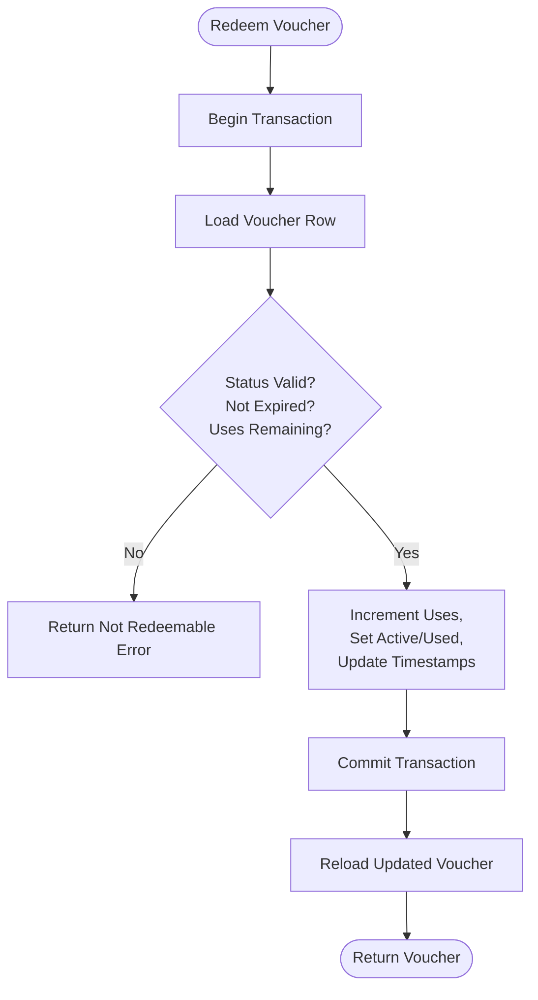
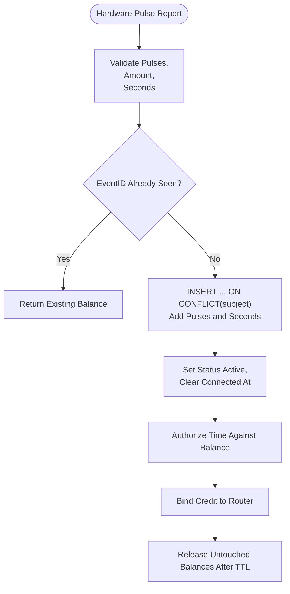
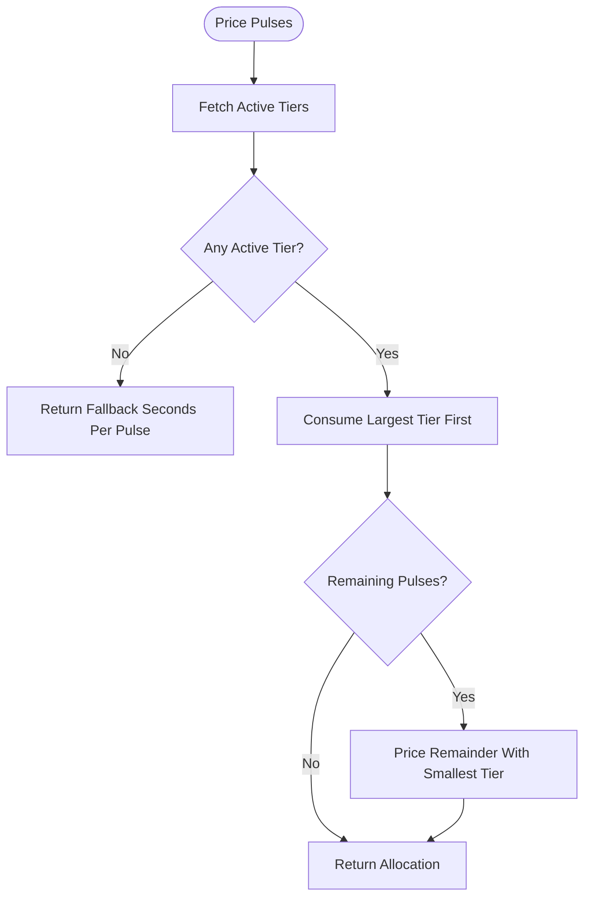
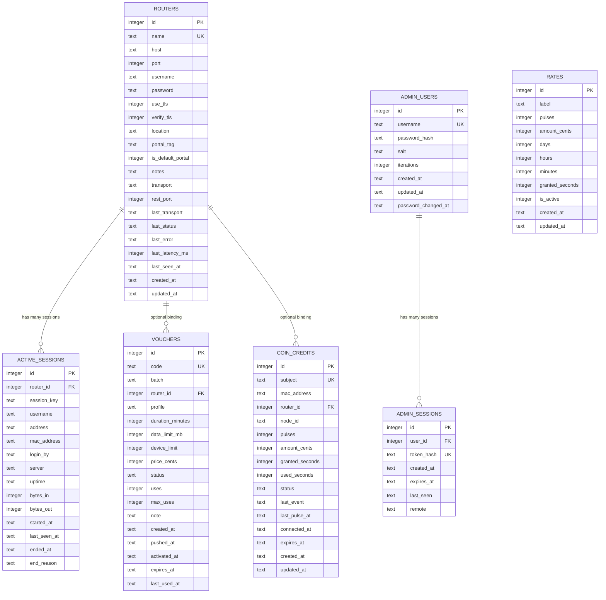

# Database Schema & Data Models

<cite>
**Referenced Files in This Document**
- [database.go](file://database/database.go)
- [migrations.go](file://database/migrations.go)
- [routers.go](file://database/routers.go)
- [sessions.go](file://database/sessions.go)
- [vouchers.go](file://database/vouchers.go)
- [admin_users.go](file://database/admin_users.go)
- [admin_sessions.go](file://database/admin_sessions.go)
- [coins.go](file://database/coins.go)
- [rates.go](file://database/rates.go)
- [stats.go](file://database/stats.go)
- [secretbox.go](file://database/secretbox.go)
- [voucher_code.go](file://database/voucher_code.go)
</cite>

## Table of Contents
1. [Introduction](#introduction)
2. [Project Structure](#project-structure)
3. [Core Components](#core-components)
4. [Architecture Overview](#architecture-overview)
5. [Detailed Component Analysis](#detailed-component-analysis)
6. [Dependency Analysis](#dependency-analysis)
7. [Performance Considerations](#performance-considerations)
8. [Troubleshooting Guide](#troubleshooting-guide)
9. [Conclusion](#conclusion)
10. [Appendices](#appendices)

## Introduction
This document describes the SQLite data model used by the Aircoins MikroTik controller. It covers every persistent entity, including routers, hotspot sessions, prepaid vouchers, administrator accounts and sessions, coin-slot credits, pricing rates, and dashboard statistics. It also documents primary and foreign keys, indexes, constraints, migration-based schema evolution, AES-256-GCM encryption for router API passwords, master key management, data lifecycle and retention policies, backup considerations, and performance characteristics.

The database layer is implemented as a Go package that uses the pure Go modernc.org/sqlite driver. It exposes typed stores for each domain area and applies forward-only migrations at startup.

**Section sources**
- [database.go:1-21](file://database/database.go#L1-L21)
- [database.go:70-116](file://database/database.go#L70-L116)

## Project Structure
The persistence layer lives under `database/`. Each major entity has its own file:

| File | Responsibility |
|---|---|
| `database.go` | Connection configuration, DSN construction, connection pool settings, store accessors, and bootstrap logic. |
| `migrations.go` | Versioned schema definitions, index definitions, and the migration runner. |
| `routers.go` | Router inventory, transport selection, status tracking, and encrypted password handling. |
| `sessions.go` | Hotspot session observation, reconciliation, filtering, and pruning. |
| `vouchers.go` | Prepaid voucher ledger, batch creation, redemption, expiration, and statistics. |
| `admin_users.go` | Operator account storage with PBKDF2-HMAC-SHA256 password hashing. |
| `admin_sessions.go` | Bearer token session management with hashed tokens and expiry. |
| `coins.go` | Coin-slot credit tallies, de-duplicated hardware reports, consumption, and idle expiration. |
| `rates.go` | Pricing tiers for coin pulses, validation, and greedy allocation. |
| `stats.go` | Dashboard aggregation and health check helpers. |
| `secretbox.go` | AES-256-GCM encryption for router API passwords and master key loading. |
| `voucher_code.go` | Voucher code generation, normalization, and lookup formatting. |



**Diagram sources**
- [database.go:151-164](file://database/database.go#L151-L164)
- [migrations.go:289-324](file://database/migrations.go#L289-L324)

**Section sources**
- [database.go:30-68](file://database/database.go#L30-L68)
- [database.go:151-164](file://database/database.go#L151-L164)

## Core Components
The core persistence object is `DB`, which owns:

- An underlying `*sql.DB` connection pool.
- A `secretBox` for encrypting and decrypting router API passwords.
- Configuration values such as database path, busy timeout, and maximum open connections.
- Store accessors for routers, sessions, vouchers, coins, rates, and admin users.

Key behaviors:

- The database directory is created if missing.
- The master secret key is loaded or generated before opening the SQL connection.
- Foreign keys are enabled via SQLite pragmas.
- WAL mode and synchronous behavior are tuned for single-writer SQLite workloads.
- Migrations are applied after the database is pinged.



**Diagram sources**
- [database.go:30-68](file://database/database.go#L30-L68)
- [database.go:70-116](file://database/database.go#L70-L116)
- [secretbox.go:26-45](file://database/secretbox.go#L26-L45)

**Section sources**
- [database.go:30-68](file://database/database.go#L30-L68)
- [database.go:70-116](file://database/database.go#L70-L116)
- [database.go:118-133](file://database/database.go#L118-L133)

## Architecture Overview
At runtime, the controller opens one `DB` instance per process. Every domain operation goes through a typed store rather than raw SQL. Sensitive router credentials are never stored in plaintext; they are sealed with AES-256-GCM before being written to SQLite and decrypted only when needed by the RouterOS client.



**Diagram sources**
- [database.go:70-116](file://database/database.go#L70-L116)
- [secretbox.go:84-131](file://database/secretbox.go#L84-L131)
- [migrations.go:289-324](file://database/migrations.go#L289-L324)

## Detailed Component Analysis

### Router Inventory
The router table stores MikroTik devices and their API credentials.

| Column | Type | Constraints / Notes |
|---|---|---|
| `id` | `INTEGER` | Primary key, autoincrement. |
| `name` | `TEXT` | Case-insensitive unique name. |
| `host` | `TEXT` | Device hostname or IP. Indexed. |
| `port` | `INTEGER` | Default 8728; checked between 1 and 65535. |
| `username` | `TEXT` | RouterOS API username. |
| `password` | `TEXT` | Encrypted API password using AES-256-GCM. |
| `use_tls` | `INTEGER` | Boolean flag stored as integer. |
| `verify_tls` | `INTEGER` | Optional TLS certificate verification. |
| `location` | `TEXT` | Free-form location description. |
| `portal_tag` | `TEXT` | Hotspot server-name/NAS identifier; indexed. |
| `is_default_portal` | `INTEGER` | Fallback captive portal device. |
| `notes` | `TEXT` | Operator notes. |
| `transport` | `TEXT` | Auto, api, api-ssl, rest, or rest-ssl. |
| `rest_port` | `INTEGER` | HTTP/HTTPS www service port. |
| `last_transport` | `TEXT` | Last successful transport for auto probing. |
| `last_status` | `TEXT` | Unknown, online, or offline. |
| `last_error` | `TEXT` | Truncated last error message. |
| `last_latency_ms` | `INTEGER` | Milliseconds from last probe. |
| `last_seen_at` | `TEXT` | RFC3339 timestamp when last seen online. |
| `created_at` | `TEXT` | Creation time. |
| `updated_at` | `TEXT` | Last update time. |

Indexes:

- `routers_host_idx` on `host`.
- `routers_portal_tag_idx` on `portal_tag`.

Relationships:

- `active_sessions.router_id` references `routers.id` with cascade delete.
- `vouchers.router_id` references `routers.id` with set-null delete.
- `coin_credits.router_id` references `routers.id` with set-null delete.

Data access patterns:

- Create encrypts the password before insert.
- Update preserves an unchanged password when empty.
- Read decrypts the password into the in-memory struct.
- Status and transport records are updated without changing other fields.



**Diagram sources**
- [routers.go:190-226](file://database/routers.go#L190-L226)

**Section sources**
- [migrations.go:22-46](file://database/migrations.go#L22-L46)
- [routers.go:57-98](file://database/routers.go#L57-L98)
- [routers.go:190-226](file://database/routers.go#L190-L226)
- [routers.go:228-257](file://database/routers.go#L228-L257)
- [routers.go:352-393](file://database/routers.go#L352-L393)

### Hotspot Sessions
The active sessions table tracks observed MikroTik hotspot clients.

| Column | Type | Constraints / Notes |
|---|---|---|
| `id` | `INTEGER` | Primary key, autoincrement. |
| `router_id` | `INTEGER` | Foreign key to `routers.id`; cascade delete. |
| `session_key` | `TEXT` | RouterOS `.id` or synthetic key. |
| `username` | `TEXT` | Hotspot username. |
| `address` | `TEXT` | Client IP address. |
| `mac_address` | `TEXT` | Normalized MAC address. |
| `login_by` | `TEXT` | Authentication method. |
| `server` | `TEXT` | Server identifier. |
| `uptime` | `TEXT` | Human-readable uptime string. |
| `bytes_in` | `INTEGER` | Inbound bytes. |
| `bytes_out` | `INTEGER` | Outbound bytes. |
| `started_at` | `TEXT` | Session start time. |
| `last_seen_at` | `TEXT` | Last heartbeat time. |
| `ended_at` | `TEXT` | Null while open; filled when closed. |
| `end_reason` | `TEXT` | Reason for closure. |

Constraints:

- Unique composite key on `(router_id, session_key)`.

Indexes:

- `sessions_open_idx` on `(router_id, ended_at)`.
- `sessions_mac_idx` on `mac_address`.
- `sessions_started_idx` on `started_at DESC`.

Lifecycle:

- `SyncDevice` upserts live sessions and closes stale ones.
- `Register` pre-registers a session during captive portal authentication.
- `Close`, `CloseByUser`, and `CloseByMAC` mark sessions finished.
- `PruneClosed` deletes old closed sessions based on cutoff time.



**Diagram sources**
- [sessions.go:101-178](file://database/sessions.go#L101-L178)
- [sessions.go:377-386](file://database/sessions.go#L377-L386)

**Section sources**
- [migrations.go:48-71](file://database/migrations.go#L48-L71)
- [sessions.go:12-34](file://database/sessions.go#L12-L34)
- [sessions.go:101-178](file://database/sessions.go#L101-L178)
- [sessions.go:217-246](file://database/sessions.go#L217-L246)
- [sessions.go:377-386](file://database/sessions.go#L377-L386)

### Prepaid Vouchers
The vouchers table is the prepaid hotspot key ledger.

| Column | Type | Constraints / Notes |
|---|---|---|
| `id` | `INTEGER` | Primary key, autoincrement. |
| `code` | `TEXT` | Unique, human-friendly voucher code. |
| `batch` | `TEXT` | Generation batch label. |
| `router_id` | `INTEGER` | Optional bound device; set null on delete. |
| `profile` | `TEXT` | Hotspot user profile. |
| `duration_minutes` | `INTEGER` | Time allowance; non-negative. |
| `data_limit_mb` | `INTEGER` | Traffic allowance; non-negative. |
| `device_limit` | `INTEGER` | Maximum concurrent devices; non-negative. |
| `price_cents` | `INTEGER` | Face value in cents; non-negative. |
| `status` | `TEXT` | Unused, active, used, expired, disabled. |
| `uses` | `INTEGER` | Redemptions consumed. |
| `max_uses` | `INTEGER` | Maximum redemptions. |
| `note` | `TEXT` | Operator note. |
| `created_at` | `TEXT` | Creation time. |
| `pushed_at` | `TEXT` | When provisioned on device. |
| `activated_at` | `TEXT` | First activation time. |
| `expires_at` | `TEXT` | Validity deadline. |
| `last_used_at` | `TEXT` | Last redemption time. |

Indexes:

- `vouchers_status_idx` on `status`.
- `vouchers_batch_idx` on `batch`.
- `vouchers_router_idx` on `router_id`.
- `vouchers_expiry_idx` on `(status, expires_at)`.

Lifecycle states:

- `unused`: never redeemed.
- `active`: redeemed and still usable.
- `used`: all allowed redemptions consumed.
- `expired`: validity window passed.
- `disabled`: operator blocked.

Redemption rules:

- Redemption increments `uses`.
- Activation and expiration may be computed on first use.
- Concurrent redemptions are serialized by transaction and unique constraints.



**Diagram sources**
- [vouchers.go:439-495](file://database/vouchers.go#L439-L495)

**Section sources**
- [migrations.go:73-99](file://database/migrations.go#L73-L99)
- [vouchers.go:12-26](file://database/vouchers.go#L12-L26)
- [vouchers.go:78-102](file://database/vouchers.go#L78-L102)
- [vouchers.go:141-160](file://database/vouchers.go#L141-L160)
- [vouchers.go:224-277](file://database/vouchers.go#L224-L277)
- [vouchers.go:439-495](file://database/vouchers.go#L439-L495)
- [voucher_code.go:10-16](file://database/voucher_code.go#L10-L16)
- [voucher_code.go:53-76](file://database/voucher_code.go#L53-L76)

### Administrator Users and Sessions
Administrator accounts are stored separately from router credentials.

#### `admin_users`

| Column | Type | Constraints / Notes |
|---|---|---|
| `id` | `INTEGER` | Primary key, autoincrement. |
| `username` | `TEXT` | Case-insensitive unique operator name. |
| `password_hash` | `TEXT` | PBKDF2-HMAC-SHA256 derived key. |
| `salt` | `TEXT` | Base64-encoded salt. |
| `iterations` | `INTEGER` | Work factor; defaults to OWASP guidance. |
| `created_at` | `TEXT` | Account creation time. |
| `updated_at` | `TEXT` | Last credential update time. |
| `password_changed_at` | `TEXT` | Last password change time. |

Password policy:

- Minimum length enforced.
- Random per-user salt.
- Iteration count stored per row so it can be raised later.
- Verification uses constant-time comparison.

#### `admin_sessions`

| Column | Type | Constraints / Notes |
|---|---|---|
| `id` | `INTEGER` | Primary key, autoincrement. |
| `user_id` | `INTEGER` | Foreign key to `admin_users.id`; cascade delete. |
| `token_hash` | `TEXT` | SHA-256 hash of bearer token; unique. |
| `created_at` | `TEXT` | Session creation time. |
| `expires_at` | `TEXT` | Expiration time. |
| `last_seen` | `TEXT` | Last activity time. |
| `remote` | `TEXT` | Remote address or identifier. |

Indexes:

- `admin_sessions_expiry_idx` on `expires_at`.
- `admin_sessions_user_idx` on `user_id`.

Behavior:

- Only the token hash is stored; the plaintext token is returned once to the caller.
- Expired sessions are cleaned up during lookup.
- Changing a password revokes all existing sessions.

```mermaid
classDiagram
class AdminUser {
+int64 ID
+string Username
+time.Time CreatedAt
+time.Time UpdatedAt
+time.Time PasswordChangedAt
}
class AdminSession {
+int64 ID
+int64 UserID
+string TokenHash
+time.Time CreatedAt
+time.Time ExpiresAt
+time.Time LastSeen
+string Remote
}
AdminUser ||--o{ AdminSession : "has many sessions"
```

**Diagram sources**
- [admin_users.go:46-59](file://database/admin_users.go#L46-L59)
- [admin_sessions.go:16-21](file://database/admin_sessions.go#L16-L21)

**Section sources**
- [migrations.go:101-126](file://database/migrations.go#L101-L126)
- [admin_users.go:17-34](file://database/admin_users.go#L17-L34)
- [admin_users.go:64-85](file://database/admin_users.go#L64-L85)
- [admin_users.go:124-148](file://database/admin_users.go#L124-L148)
- [admin_users.go:293-328](file://database/admin_users.go#L293-L328)
- [admin_sessions.go:23-51](file://database/admin_sessions.go#L23-L51)
- [admin_sessions.go:53-82](file://database/admin_sessions.go#L53-L82)
- [admin_sessions.go:110-123](file://database/admin_sessions.go#L110-L123)

### Coin-Slot Credits
The coin system tracks paying clients through a running credit tally.

| Column | Type | Constraints / Notes |
|---|---|---|
| `id` | `INTEGER` | Primary key, autoincrement. |
| `subject` | `TEXT` | Unique client key: `mac:<normalized>` or `ip:<address>`. |
| `mac_address` | `TEXT` | Normalized MAC; optional. |
| `router_id` | `INTEGER` | Optional device association; set null on delete. |
| `node_id` | `TEXT` | Coin acceptor identifier. |
| `pulses` | `INTEGER` | Total acceptor pulses received; non-negative. |
| `amount_cents` | `INTEGER` | Face value inserted; non-negative. |
| `granted_seconds` | `INTEGER` | Total access time bought; non-negative. |
| `used_seconds` | `INTEGER` | Access time already authorized; non-negative. |
| `status` | `TEXT` | Active, connected, or expired. |
| `last_event` | `TEXT` | De-duplication token from node. |
| `last_pulse_at` | `TEXT` | Last pulse receipt time. |
| `connected_at` | `TEXT` | When balance was handed to device. |
| `expires_at` | `TEXT` | Idle expiration deadline. |
| `created_at` | `TEXT` | Creation time. |
| `updated_at` | `TEXT` | Last update time. |

Indexes:

- `coin_credits_status_idx` on `(status, updated_at DESC)`.
- `coin_credits_node_idx` on `node_id`.

Design notes:

- The subject key prefers MAC over IP so balances survive DHCP changes.
- Hardware reports are de-duplicated by `last_event`.
- Credit updates are atomic to avoid double-counting pulses.
- Consumption caps `used_seconds` at `granted_seconds`.
- Idle balances expire after a configured TTL.



**Diagram sources**
- [coins.go:139-223](file://database/coins.go#L139-L223)
- [coins.go:260-319](file://database/coins.go#L260-L319)
- [coins.go:321-348](file://database/coins.go#L321-L348)

**Section sources**
- [migrations.go:128-207](file://database/migrations.go#L128-L207)
- [coins.go:41-79](file://database/coins.go#L41-L79)
- [coins.go:139-223](file://database/coins.go#L139-L223)
- [coins.go:260-319](file://database/coins.go#L260-L319)
- [coins.go:321-348](file://database/coins.go#L321-L348)
- [coins.go:421-433](file://database/coins.go#L421-L433)

### Pricing Rates
The rates table defines how coin pulses buy Wi-Fi time.

| Column | Type | Constraints / Notes |
|---|---|---|
| `id` | `INTEGER` | Primary key, autoincrement. |
| `label` | `TEXT` | Optional operator label. |
| `pulses` | `INTEGER` | Accepts 1 to 1000 pulses. |
| `amount_cents` | `INTEGER` | Face value; non-negative. |
| `days` | `INTEGER` | 0 to 30. |
| `hours` | `INTEGER` | 0 to 23. |
| `minutes` | `INTEGER` | 0 to 59. |
| `granted_seconds` | `INTEGER` | Derived from days/hours/minutes; non-negative. |
| `is_active` | `INTEGER` | Soft-delete flag. |
| `created_at` | `TEXT` | Creation time. |
| `updated_at` | `TEXT` | Last update time. |

Index:

- `rates_active_idx` on `(is_active, pulses)`.

Pricing algorithm:

- Active tiers are consumed greedily from largest pulse count down.
- Remainder pulses are priced at the smallest active tier.
- A rate must award some time; zero-time tiers are rejected.
- If no active tier exists, the system returns a fallback seconds-per-pulse value.



**Diagram sources**
- [rates.go:361-424](file://database/rates.go#L361-L424)

**Section sources**
- [migrations.go:187-203](file://database/migrations.go#L187-L203)
- [rates.go:12-49](file://database/rates.go#L12-L49)
- [rates.go:91-149](file://database/rates.go#L91-L149)
- [rates.go:361-424](file://database/rates.go#L361-L424)

### Dashboard Statistics
The stats module aggregates counters across routers, sessions, and vouchers for the dashboard.

| Field | Meaning |
|---|---|
| `RoutersTotal` | Total registered routers. |
| `RoutersOnline` | Routers reporting online. |
| `RoutersOffline` | Routers reporting offline. |
| `RoutersUnknown` | Routers with unknown status. |
| `SessionsOpen` | Currently open hotspot sessions. |
| `Vouchers` | Voucher counts and financial summaries. |

Health check:

- Pings the database.
- Verifies that the schema migrations table exists.

**Section sources**
- [stats.go:8-41](file://database/stats.go#L8-L41)
- [stats.go:43-53](file://database/stats.go#L43-L53)

## Dependency Analysis
The main database-level dependencies are:

- `active_sessions.router_id` → `routers.id` (cascade).
- `vouchers.router_id` → `routers.id` (set null).
- `coin_credits.router_id` → `routers.id` (set null).
- `admin_sessions.user_id` → `admin_users.id` (cascade).

There are no circular foreign-key relationships. The schema evolves through forward-only migrations, so older installs keep historical rows even when columns or tables are added later.



**Diagram sources**
- [migrations.go:15-207](file://database/migrations.go#L15-L207)

**Section sources**
- [migrations.go:215-287](file://database/migrations.go#L215-L287)

## Performance Considerations
The database layer is optimized for a single-process SQLite workload:

- **Connection pool size**: Defaults to four connections. SQLite serializes writers, so a large pool adds overhead without improving throughput.
- **Busy timeout**: Defaults to five seconds, giving short-lived writes time to complete.
- **WAL mode**: Enables concurrent readers while allowing one writer.
- **Foreign keys**: Enabled globally via pragma.
- **Journal mode**: WAL reduces locking contention compared to default rollback journal.
- **Synchronous mode**: Set to NORMAL for reasonable durability with lower write latency.
- **In-memory testing**: Uses shared cache so pooled connections see the same in-memory database.
- **Indexes**: Targeted indexes support common filters such as router status, session MAC, voucher status, and coin credit status.
- **Pagination**: Listing endpoints normalize limits to prevent unbounded result sets.
- **Timestamp format**: RFC3339 TEXT timestamps sort lexicographically, simplifying range queries.

Recommendations:

- Keep `MaxOpenConns` small unless background tasks require parallel reads.
- Use the provided store methods instead of ad hoc SQL to benefit from normalized queries and parameterization.
- Run periodic cleanup jobs for closed sessions and expired admin sessions.
- Monitor SQLite file size and WAL file growth under heavy session churn.
- Avoid full-table scans on large voucher or session lists; always apply filters and pagination.

[No sources needed since this section provides general guidance]

## Troubleshooting Guide

### Master Key Problems
Symptoms:

- Startup fails because no master key is configured.
- Router passwords cannot be decrypted.
- Errors mention unsupported credential format or wrong master key.

Causes:

- Missing `SecretKeyPath`.
- Empty or invalid `AIRCOINS_SECRET_KEY`.
- Corrupted or rotated master key file.
- Stored credentials were encrypted with a different key.

Resolution:

- Provide a valid 32-byte base64 or hex key.
- Restore the original master key file if it was accidentally replaced.
- Do not generate a new key unless you intend to lose access to existing router passwords.

**Section sources**
- [secretbox.go:84-131](file://database/secretbox.go#L84-L131)
- [secretbox.go:61-82](file://database/secretbox.go#L61-L82)

### Migration Failures
Symptoms:

- Startup logs indicate migration errors.
- Schema is partially applied.

Behavior:

- Each migration runs in its own transaction.
- Failed statements abort the migration and return an error.
- Applied versions are recorded and never replayed.

Resolution:

- Inspect the migration version and statement number in the error.
- Fix the DDL or data issue.
- Restart the controller; only pending migrations are applied.

**Section sources**
- [migrations.go:289-347](file://database/migrations.go#L289-L347)

### Duplicate Voucher Codes
Symptoms:

- Batch creation fails with duplicate code error.

Cause:

- Generated code collision.

Resolution:

- Regenerate codes with fresh randomness.
- Ensure uniqueness checks are performed before bulk insertion.

**Section sources**
- [vouchers.go:194-195](file://database/vouchers.go#L194-L195)
- [vouchers.go:224-277](file://database/vouchers.go#L224-L277)

### Duplicate Coin Pulses
Symptoms:

- Hardware report is accepted but does not increase the balance.
- Caller receives duplicate pulse error.

Cause:

- NodeMCU retries the same POST after a network failure.

Resolution:

- Ensure the node sends a stable `EventID` per physical coin event.
- Treat duplicate pulse as success; do not retry indefinitely.

**Section sources**
- [coins.go:139-223](file://database/coins.go#L139-L223)

### Stale Sessions
Symptoms:

- Local UI shows a session still open after device reboot or disconnect.

Cause:

- Controller did not receive the latest session list from the router.

Resolution:

- Trigger another sync cycle.
- Use prune operations to remove old closed sessions.

**Section sources**
- [sessions.go:101-178](file://database/sessions.go#L101-L178)
- [sessions.go:377-386](file://database/sessions.go#L377-L386)

### Admin Session Revocation
Symptoms:

- Existing browser tabs stop working after password change.

Cause:

- Password change intentionally revokes all sessions.

Resolution:

- Log in again with the new password.

**Section sources**
- [admin_users.go:204-243](file://database/admin_users.go#L204-L243)
- [admin_users.go:260-291](file://database/admin_users.go#L260-L291)
- [admin_sessions.go:94-99](file://database/admin_sessions.go#L94-L99)

## Conclusion
The Aircoins controller’s SQLite schema models a complete captive portal and prepaid Wi-Fi system. Routers hold encrypted API credentials, sessions track live hotspot clients, vouchers provide prepaid access, admin users secure the panel, coin credits reconcile hardware payments, and rates define flexible pricing. Forward-only migrations ensure safe schema evolution, while AES-256-GCM protects sensitive router passwords behind a master key. Careful indexing, bounded limits, transactional updates, and explicit lifecycle states make the data model suitable for small embedded deployments where reliability, auditability, and simplicity matter more than horizontal scale.

[No sources needed since this section summarizes without analyzing specific files]

## Appendices

### Encryption Summary
- Algorithm: AES-256-GCM.
- Key source: explicit config, environment variable, or file.
- Format: version prefix plus base64-encoded nonce and ciphertext.
- Scope: router API passwords only.
- Recovery: losing the master key makes stored router passwords unrecoverable.

**Section sources**
- [secretbox.go:15-45](file://database/secretbox.go#L15-L45)
- [secretbox.go:47-82](file://database/secretbox.go#L47-L82)
- [secretbox.go:84-151](file://database/secretbox.go#L84-L151)

### Backup Procedures
Recommended operational practices:

- Back up the SQLite database file regularly.
- Back up the master key file separately and protect it with strict permissions.
- Test restoration procedures, especially after master key rotation.
- For in-memory databases, understand that data is ephemeral and not suitable for production backups.
- Schedule periodic cleanup of closed sessions and expired admin sessions to control database growth.

[No sources needed since this section provides general guidance]

### Data Lifecycle and Retention Policies
- **Sessions**: Closed sessions should be pruned periodically to retain only recent history.
- **Admin sessions**: Expired sessions are cleaned up during lookup and can be pruned by cutoff time.
- **Vouchers**: Expired vouchers are marked during listing or synchronization; deletion can preserve or discard redeemed keys depending on operator preference.
- **Coin credits**: Idle balances expire after a configured TTL to prevent one client’s unused money from being inherited by another.
- **Routers**: Deleting a router cascades sessions but keeps voucher and credit history with null router references.

**Section sources**
- [sessions.go:377-386](file://database/sessions.go#L377-L386)
- [admin_sessions.go:110-123](file://database/admin_sessions.go#L110-L123)
- [vouchers.go:561-576](file://database/vouchers.go#L561-L576)
- [coins.go:321-348](file://database/coins.go#L321-L348)
- [routers.go:276-287](file://database/routers.go#L276-L287)