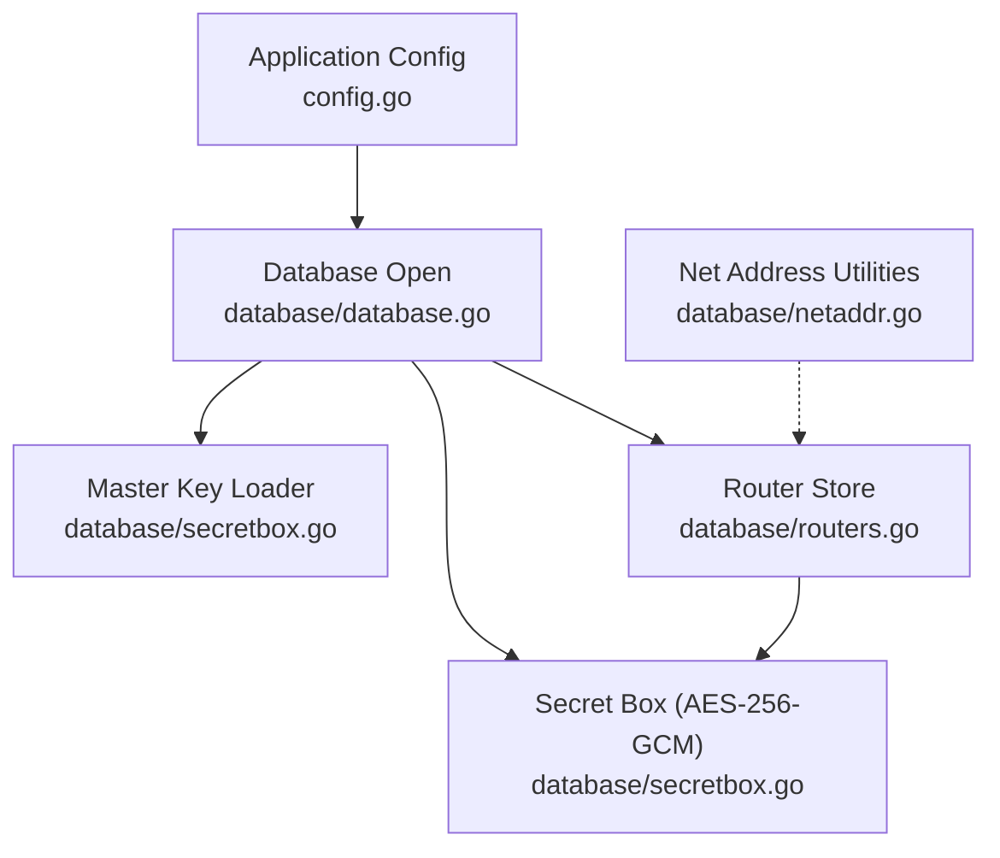
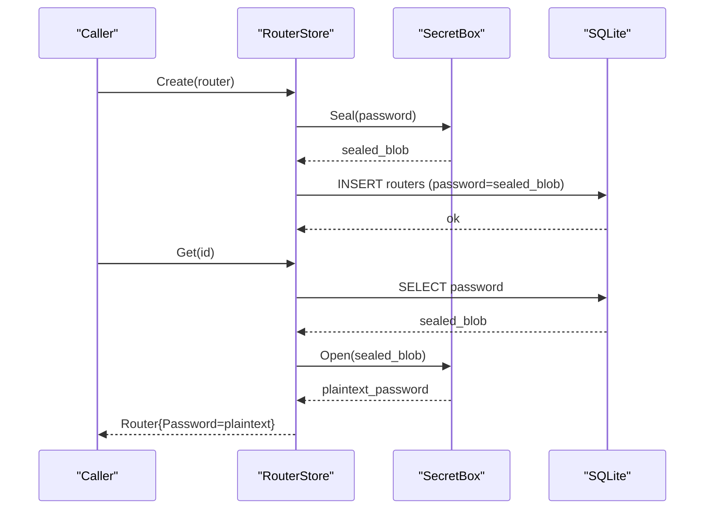
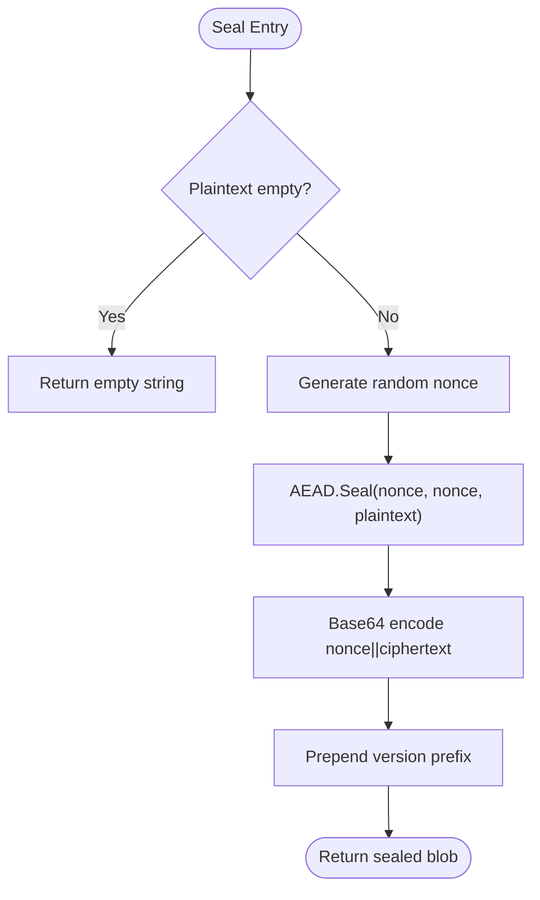
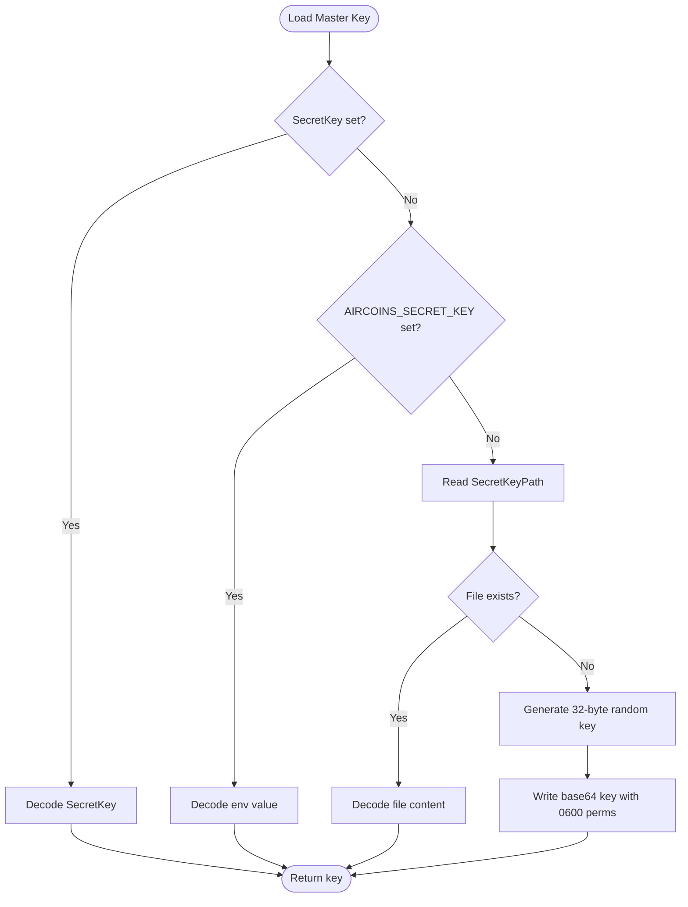
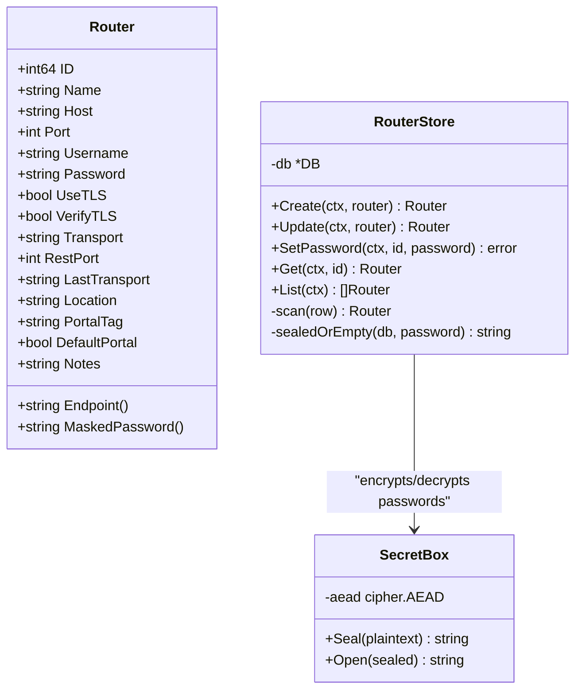
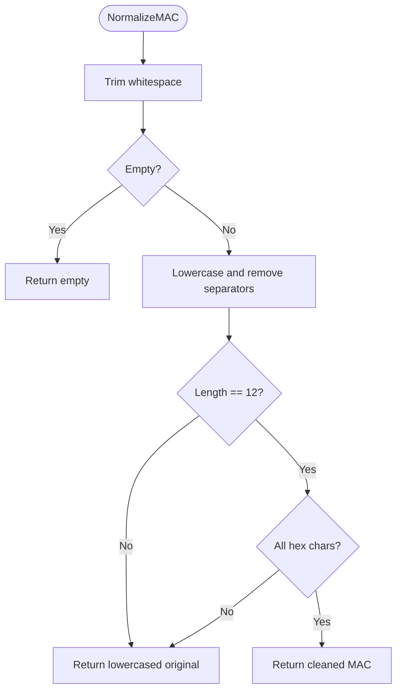
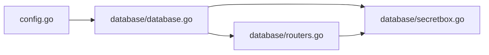

# Encryption & Security

<cite>
**Referenced Files in This Document**
- [secretbox.go](file://database/secretbox.go)
- [database.go](file://database/database.go)
- [routers.go](file://database/routers.go)
- [netaddr.go](file://database/netaddr.go)
- [config.go](file://config.go)
- [database_test.go](file://database/database_test.go)
</cite>

## Table of Contents
1. [Introduction](#introduction)
2. [Project Structure](#project-structure)
3. [Core Components](#core-components)
4. [Architecture Overview](#architecture-overview)
5. [Detailed Component Analysis](#detailed-component-analysis)
6. [Dependency Analysis](#dependency-analysis)
7. [Performance Considerations](#performance-considerations)
8. [Security Best Practices](#security-best-practices)
9. [Key Rotation Procedures](#key-rotation-procedures)
10. [Data Protection Strategies](#data-protection-strategies)
11. [Troubleshooting Guide](#troubleshooting-guide)
12. [Conclusion](#conclusion)

## Introduction
This document explains the encryption and security mechanisms used to protect sensitive data, especially RouterOS API passwords, in the controller’s SQLite database. It covers:
- AES-256-GCM encryption via a secret box pattern
- Master key discovery, validation, and file-based generation
- Encrypted storage and decryption workflows for router credentials
- Net address utilities for MAC and IP normalization and formatting
- Security best practices, key rotation procedures, and audit guidance

The goal is to make these mechanisms understandable for operators while preserving technical accuracy for developers.

## Project Structure
The encryption and security logic lives primarily in the `database` package, with configuration wiring in the application root. The relevant files are:
- `database/secretbox.go`: AES-256-GCM secret box, master key loading, and decoding
- `database/database.go`: Database initialization, connection pooling, and secret box integration
- `database/routers.go`: Router model and store that encrypts/decrypts passwords
- `database/netaddr.go`: MAC and IP normalization/formatting helpers
- `config.go`: Application-level defaults for the secret key path and other runtime settings
- `database/database_test.go`: Tests validating encrypted-at-rest behavior

**Diagram sources**
- [config.go:20-77](file://config.go#L20-L77)
- [database.go:70-116](file://database/database.go#L70-L116)
- [secretbox.go:84-132](file://database/secretbox.go#L84-L132)
- [routers.go:190-226](file://database/routers.go#L190-L226)
- [netaddr.go:8-54](file://database/netaddr.go#L8-L54)

**Section sources**
- [config.go:20-77](file://config.go#L20-L77)
- [database.go:30-68](file://database/database.go#L30-L68)
- [secretbox.go:15-30](file://database/secretbox.go#L15-L30)
- [routers.go:57-98](file://database/routers.go#L57-L98)
- [netaddr.go:8-54](file://database/netaddr.go#L8-L54)

## Core Components
- Secret Box (AES-256-GCM): Provides authenticated encryption for sensitive strings such as router passwords. It uses a unique nonce per encryption and stores a versioned prefix to support future cipher changes.
- Master Key Management: Loads the 32-byte master key from an explicit config value, environment variable, or file. If missing, it generates a secure random key and writes it with restrictive permissions.
- Router Credential Storage: Encrypts passwords before writing to SQLite and decrypts them when reading into memory. UI exposure is masked; plaintext is only used by the RouterOS client.
- Net Address Utilities: Normalize and format MAC addresses and canonicalize IP addresses for reliable comparisons and consistent output.

**Section sources**
- [secretbox.go:19-82](file://database/secretbox.go#L19-L82)
- [secretbox.go:84-151](file://database/secretbox.go#L84-L151)
- [routers.go:190-226](file://database/routers.go#L190-L226)
- [routers.go:352-393](file://database/routers.go#L352-L393)
- [netaddr.go:8-54](file://database/netaddr.go#L8-L54)

## Architecture Overview
The system integrates encryption at the persistence layer so callers interact with plaintext objects in memory while data at rest remains protected.

**Diagram sources**
- [routers.go:190-226](file://database/routers.go#L190-L226)
- [routers.go:352-393](file://database/routers.go#L352-L393)
- [secretbox.go:47-82](file://database/secretbox.go#L47-L82)

## Detailed Component Analysis

### AES-256-GCM Secret Box
The secret box implements authenticated encryption using AES-256-GCM:
- Key size: 32 bytes (AES-256)
- AEAD mode: GCM
- Nonce: Randomly generated per encryption, stored alongside ciphertext
- Format: Version-prefixed base64 blob to allow future cipher upgrades without ambiguity

Key responsibilities:
- `Seal(plaintext)` returns a versioned, base64-encoded ciphertext
- `Open(sealed)` validates format, extracts nonce and ciphertext, and returns plaintext
- Errors include unsupported format, truncated blobs, and wrong master key

**Diagram sources**
- [secretbox.go:47-59](file://database/secretbox.go#L47-L59)

**Section sources**
- [secretbox.go:19-82](file://database/secretbox.go#L19-L82)

### Master Key Management
Master key resolution follows a strict priority order:
1. Explicit config value (`SecretKey`)
2. Environment variable (`AIRCOINS_SECRET_KEY`)
3. File path (`SecretKeyPath`, defaulting to `data/secret.key`)

If the file does not exist, a secure random 32-byte key is generated, base64-encoded, and written with `0600` permissions. Decoding supports base64 (standard/raw) and hex formats.

**Diagram sources**
- [secretbox.go:84-132](file://database/secretbox.go#L84-L132)
- [config.go:20-25](file://config.go#L20-L25)

**Section sources**
- [secretbox.go:84-151](file://database/secretbox.go#L84-L151)
- [config.go:20-25](file://config.go#L20-L25)

### Router Password Encryption Workflow
Passwords are encrypted before being persisted and decrypted on read:
- On create/update, passwords are sealed using the secret box
- On read, the stored blob is opened to obtain plaintext for use by the RouterOS client
- UI exposure is masked; plaintext never appears in templates

**Diagram sources**
- [routers.go:57-98](file://database/routers.go#L57-L98)
- [routers.go:190-226](file://database/routers.go#L190-L226)
- [routers.go:352-393](file://database/routers.go#L352-L393)
- [secretbox.go:26-82](file://database/secretbox.go#L26-L82)

**Section sources**
- [routers.go:190-226](file://database/routers.go#L190-L226)
- [routers.go:228-274](file://database/routers.go#L228-L274)
- [routers.go:352-393](file://database/routers.go#L352-L393)

### Net Address Handling Utilities
MAC and IP handling ensures consistent comparison and display:
- `NormalizeMAC`: Lowercases and strips separators, validates length and characters
- `FormatMAC`: Renders normalized MAC in RouterOS canonical uppercase colon-separated form
- `NormalizeIP`: Canonicalizes IPv4/IPv6 addresses; returns trimmed input if parsing fails

**Diagram sources**
- [netaddr.go:8-27](file://database/netaddr.go#L8-L27)

**Section sources**
- [netaddr.go:8-54](file://database/netaddr.go#L8-L54)

## Dependency Analysis
The encryption components depend on each other and on configuration:
- `database.go` initializes the database and constructs the secret box using the resolved master key
- `routers.go` depends on the secret box for credential lifecycle operations
- `config.go` provides defaults for the secret key path and other runtime parameters

**Diagram sources**
- [config.go:20-25](file://config.go#L20-L25)
- [database.go:70-116](file://database/database.go#L70-L116)
- [routers.go:190-226](file://database/routers.go#L190-L226)
- [secretbox.go:84-132](file://database/secretbox.go#L84-L132)

**Section sources**
- [database.go:70-116](file://database/database.go#L70-L116)
- [routers.go:190-226](file://database/routers.go#L190-L226)
- [secretbox.go:84-132](file://database/secretbox.go#L84-L132)

## Performance Considerations
- Connection Pooling: SQLite writer serialization means a small pool is faster than a large one; defaults cap open connections.
- WAL Mode: Journaling in WAL mode improves concurrency and durability characteristics.
- Busy Timeout: A configurable busy timeout reduces contention under concurrent writes.
- Encryption Overhead: AES-256-GCM is efficient; overhead is dominated by I/O and network calls to RouterOS devices.

[No sources needed since this section provides general guidance]

## Security Best Practices
- Protect the master key:
  - Prefer injecting via environment variables or external secret managers
  - Restrict file permissions to `0600` for the key file
  - Never commit keys to version control
- Limit exposure:
  - Plaintext passwords are only used by the RouterOS client
  - UI shows masked placeholders
- Validate inputs:
  - Use net address utilities to normalize MAC/IP values
  - Enforce transport modes and TLS verification where appropriate
- Audit access:
  - Log key generation events and errors
  - Monitor database integrity and access patterns

**Section sources**
- [secretbox.go:84-132](file://database/secretbox.go#L84-L132)
- [routers.go:108-115](file://database/routers.go#L108-L115)
- [netaddr.go:8-54](file://database/netaddr.go#L8-L54)

## Key Rotation Procedures
To rotate the master key:
1. Prepare the new master key (base64 or hex, 32 bytes).
2. Temporarily configure both old and new keys during migration:
   - Set the new key via `SecretKey` or `AIRCOINS_SECRET_KEY`
   - Keep the old key accessible for decryption during migration
3. Re-encrypt stored passwords:
   - For each router, decrypt the stored password using the old key
   - Re-seal with the new key and update the row
4. Remove the old key and finalize:
   - Ensure all rows are re-encrypted
   - Delete or revoke access to the old key file/environment value
5. Verify:
   - Confirm reads return correct plaintext
   - Confirm direct database queries show version-prefixed encrypted blobs

Note: The current implementation does not provide an automated bulk re-encryption tool; operators must implement a migration step that uses the same secret box APIs to re-encrypt existing records.

**Section sources**
- [secretbox.go:47-82](file://database/secretbox.go#L47-L82)
- [secretbox.go:84-151](file://database/secretbox.go#L84-L151)
- [routers.go:352-393](file://database/routers.go#L352-L393)

## Data Protection Strategies
- At-Rest Encryption: All router passwords are encrypted using AES-256-GCM before being written to SQLite.
- In-Memory Minimization: Plaintext passwords are held only in memory and passed directly to the RouterOS client.
- Transport Security: Optional TLS and certificate verification can be enabled for RouterOS transports.
- Input Normalization: MAC and IP values are normalized to prevent comparison issues and ensure consistent formatting.

**Section sources**
- [routers.go:190-226](file://database/routers.go#L190-L226)
- [routers.go:352-393](file://database/routers.go#L352-L393)
- [netaddr.go:8-54](file://database/netaddr.go#L8-L54)

## Troubleshooting Guide
Common issues and resolutions:
- Wrong master key:
  - Symptom: Decryption fails with “wrong master key”
  - Resolution: Verify the active key matches the one used to encrypt stored secrets
- Unsupported credential format:
  - Symptom: “unsupported credential format”
  - Resolution: Ensure stored values have the expected version prefix; migrate legacy data if necessary
- Truncated credential blob:
  - Symptom: “credential blob is truncated”
  - Resolution: Inspect database integrity and restore from backup if corrupted
- Missing master key:
  - Symptom: Startup fails due to no configured key
  - Resolution: Provide `SecretKey`, `AIRCOINS_SECRET_KEY`, or `SecretKeyPath`; ensure file permissions are correct

Validation examples:
- Test that passwords are encrypted at rest and decrypted on read
- Confirm updates preserve existing secrets when the password field is blank

**Section sources**
- [secretbox.go:61-82](file://database/secretbox.go#L61-L82)
- [database_test.go:161-206](file://database/database_test.go#L161-L206)

## Conclusion
The controller protects sensitive router credentials using AES-256-GCM with a robust secret box pattern and secure master key management. Data at rest is encrypted, plaintext is minimized in memory, and utilities ensure consistent handling of network identifiers. Operators should follow the recommended best practices, perform careful key rotations, and validate encryption behavior through tests and audits.

[No sources needed since this section summarizes without analyzing specific files]