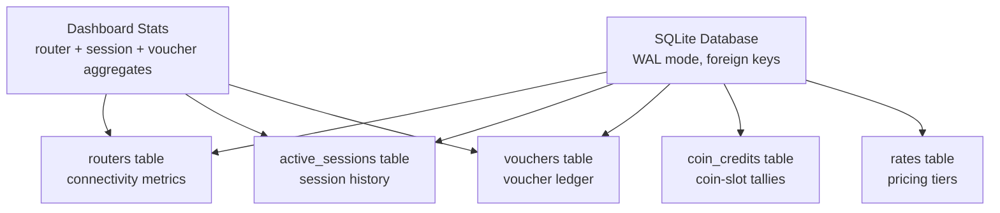
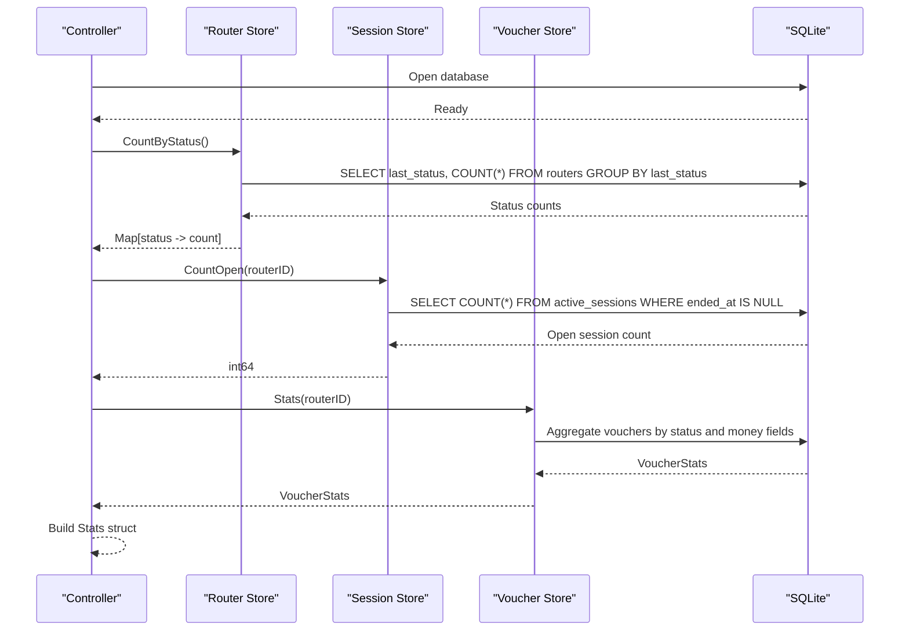
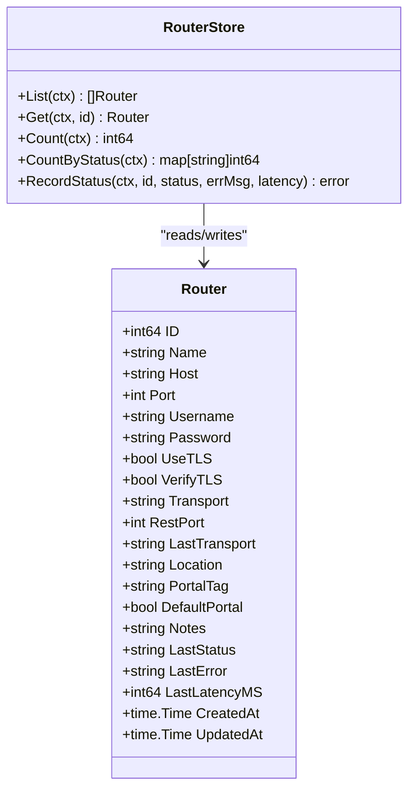
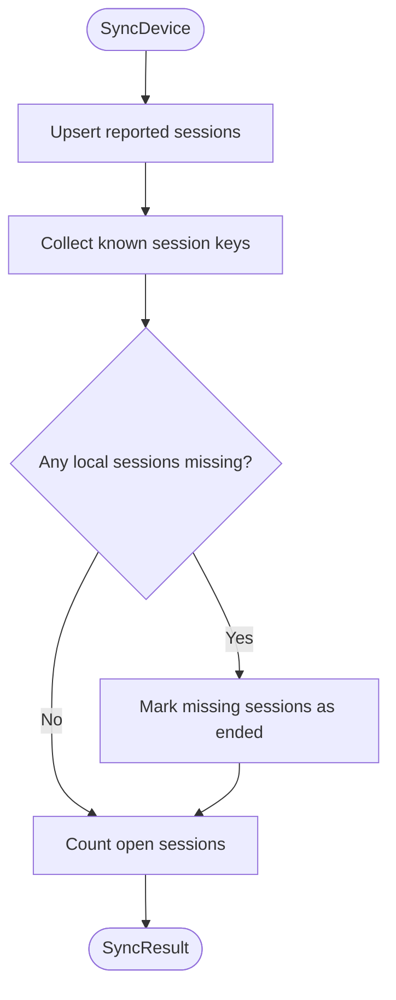
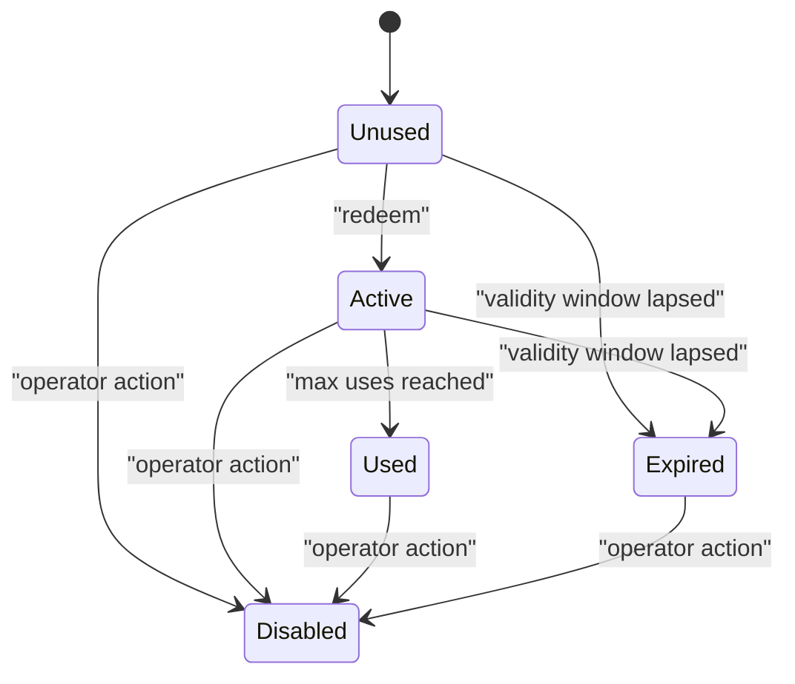
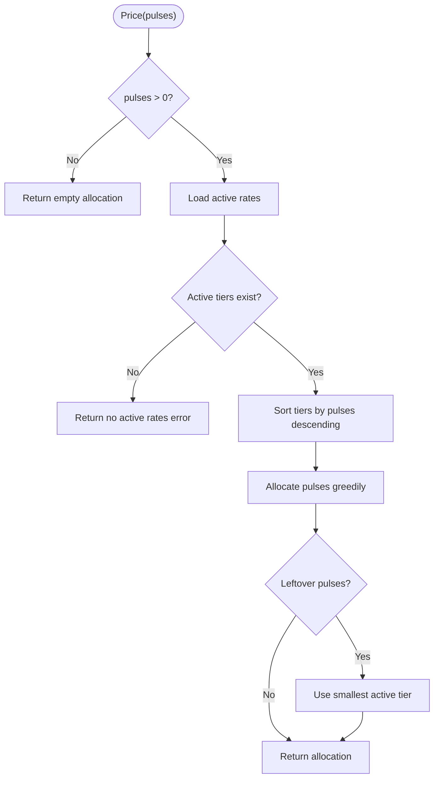
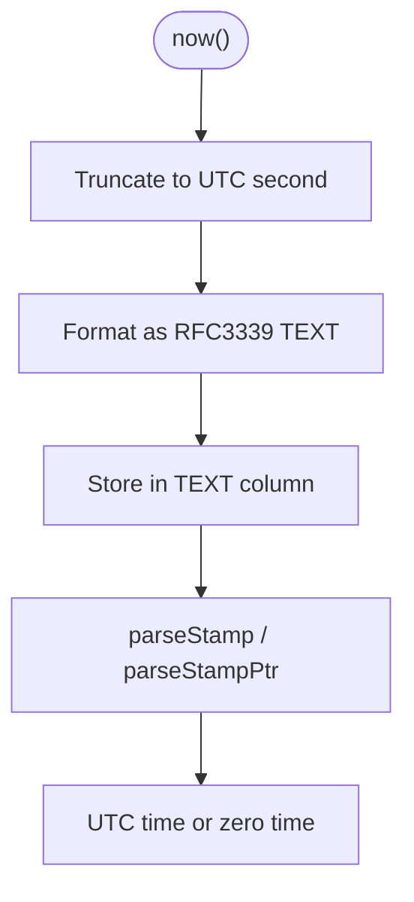
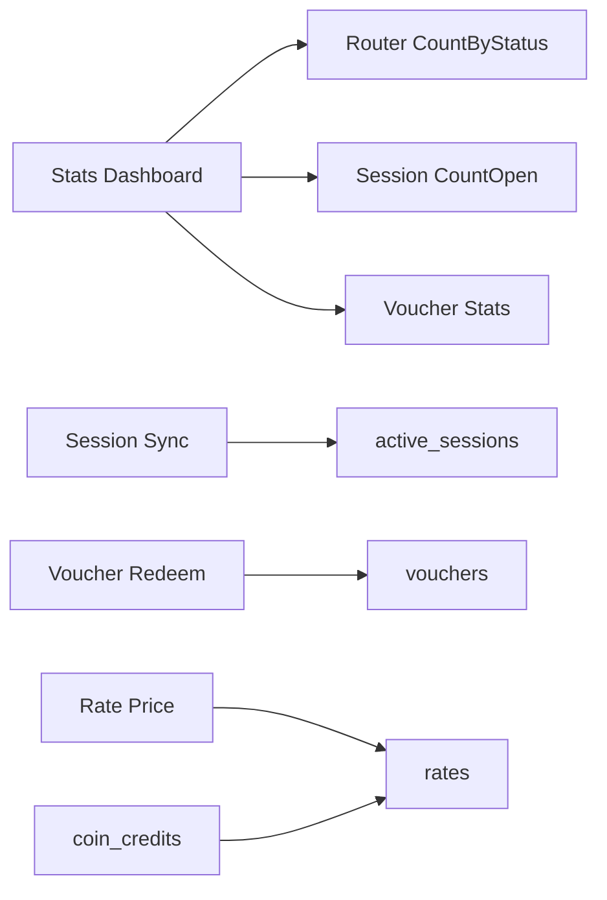

# Statistics & Analytics Schema

<cite>
**Referenced Files in This Document**
- [database.go](file://database/database.go)
- [migrations.go](file://database/migrations.go)
- [stats.go](file://database/stats.go)
- [sessions.go](file://database/sessions.go)
- [routers.go](file://database/routers.go)
- [vouchers.go](file://database/vouchers.go)
- [rates.go](file://database/rates.go)
- [times.go](file://database/times.go)
</cite>

## Table of Contents
1. [Introduction](#introduction)
2. [Project Structure](#project-structure)
3. [Core Components](#core-components)
4. [Architecture Overview](#architecture-overview)
5. [Detailed Component Analysis](#detailed-component-analysis)
6. [Dependency Analysis](#dependency-analysis)
7. [Performance Considerations](#performance-considerations)
8. [Troubleshooting Guide](#troubleshooting-guide)
9. [Conclusion](#conclusion)
10. [Appendices](#appendices)

## Introduction
This document explains the statistics and analytics database schema used by the controller. It focuses on how operational counters, session history, voucher accounting, coin-slot credits, and router health metrics are stored and aggregated. The system is not a traditional time-series database; instead, it uses normalized timestamp columns, indexed status fields, and SQL aggregation to produce dashboard statistics, session reports, and financial reconciliation data.

The key design principles are:
- All timestamps are stored as UTC RFC3339 text for lexicographical range queries.
- Operational state is kept close to the live devices so dashboards remain responsive even when routers are unreachable.
- Aggregations are performed with targeted SQL queries rather than materialized tables.
- Retention is implemented through explicit pruning operations rather than automatic TTLs.

## Project Structure
The statistics and analytics logic lives primarily under the `database` package:
- `database.go` configures SQLite, connection pooling, WAL mode, and exposes store factories.
- `migrations.go` defines all persistent tables, indexes, and migration versions.
- `stats.go` provides the dashboard aggregate view.
- `sessions.go` tracks active hotspot sessions and their lifecycle.
- `routers.go` stores router inventory and connectivity metrics.
- `vouchers.go` manages prepaid voucher accounting and reporting aggregates.
- `rates.go` defines pricing tiers that convert coin pulses into session time.
- `times.go` centralizes timestamp formatting and parsing helpers.

**Diagram sources**
- [database.go:118-133](file://database/database.go#L118-L133)
- [migrations.go:22-207](file://database/migrations.go#L22-L207)
- [stats.go:8-40](file://database/stats.go#L8-L40)

**Section sources**
- [database.go:1-165](file://database/database.go#L1-L165)
- [migrations.go:1-348](file://database/migrations.go#L1-L348)

## Core Components
The analytics surface is built from five main areas:

| Area | Primary Tables | Purpose | Key Metrics |
|---|---|---|---|
| Router Health | `routers` | Device inventory and last probe results | online/offline/unknown counts, latency, last seen |
| Session Tracking | `active_sessions` | Observed hotspot clients | open sessions, bytes transferred, duration |
| Voucher Accounting | `vouchers` | Prepaid key lifecycle and revenue signals | unused/active/used/expired/disabled counts, billed value |
| Coin-Slot Credits | `coin_credits` | Additive credit accumulation per subject | pulses, granted seconds, used seconds |
| Pricing Tiers | `rates` | Pulse-to-time conversion rules | active tiers, days/hours/minutes, granted seconds |

The dashboard combines these sources into one lightweight aggregate object containing router totals, router status distribution, open session count, and voucher statistics.

**Section sources**
- [stats.go:8-40](file://database/stats.go#L8-L40)
- [migrations.go:22-207](file://database/migrations.go#L22-L207)

## Architecture Overview
At runtime, the controller reads live device state, reconciles it locally, and exposes aggregated counters for the UI. There is no separate analytics pipeline or external time-series store.

**Diagram sources**
- [stats.go:18-40](file://database/stats.go#L18-L40)
- [routers.go:326-344](file://database/routers.go#L326-L344)
- [sessions.go:339-351](file://database/sessions.go#L339-L351)
- [vouchers.go:595-644](file://database/vouchers.go#L595-L644)

## Detailed Component Analysis

### Router Health Metrics
The `routers` table stores each MikroTik device plus its latest connectivity probe result. Metrics include:
- `last_status`: unknown, online, or offline.
- `last_error`: truncated error message.
- `last_latency_ms`: integer milliseconds.
- `last_seen_at`: UTC timestamp when the device was last observed online.

These fields support dashboard counters such as total routers, online routers, offline routers, and unknown routers.

**Diagram sources**
- [routers.go:57-98](file://database/routers.go#L57-L98)
- [routers.go:319-344](file://database/routers.go#L319-L344)
- [routers.go:297-308](file://database/routers.go#L297-L308)

**Section sources**
- [migrations.go:22-46](file://database/migrations.go#L22-L46)
- [routers.go:12-30](file://database/routers.go#L12-L30)
- [routers.go:319-344](file://database/routers.go#L319-L344)

### Session Data Storage and Aggregation
Sessions represent observed hotspot clients. The `active_sessions` table keeps both current and finished sessions, enabling historical analysis while still supporting fast open-session queries.

Key attributes:
- `router_id`: links to the device.
- `session_key`: stable identifier per router.
- `username`, `address`, `mac_address`: client identity.
- `bytes_in`, `bytes_out`: traffic counters.
- `started_at`, `last_seen_at`, `ended_at`: time boundaries.
- `end_reason`: why the session closed.

Aggregation patterns:
- Open session count per router.
- Open session count across all routers.
- Session listing filtered by router, MAC, status, or free-text query.
- Pruning of closed sessions older than a cutoff.

**Diagram sources**
- [sessions.go:101-177](file://database/sessions.go#L101-L177)

**Section sources**
- [migrations.go:48-71](file://database/migrations.go#L48-L71)
- [sessions.go:12-52](file://database/sessions.go#L12-L52)
- [sessions.go:101-177](file://database/sessions.go#L101-L177)
- [sessions.go:248-310](file://database/sessions.go#L248-L310)
- [sessions.go:339-386](file://database/sessions.go#L339-L386)

### Voucher Accounting and Reporting
The `vouchers` table is the financial and provisioning ledger for prepaid hotspot access. Each row represents a generated code with allowances such as duration, data limit, device limit, price, and lifecycle state.

Reporting dimensions:
- Status: unused, active, used, expired, disabled.
- Batch grouping for bulk generation.
- Router binding for device-level accounting.
- Pushed flag indicating whether the hotspot user exists on a device.
- Monetary fields: `price_cents`, `uses`, and derived billed value.

The `Stats` method returns:
- Total vouchers.
- Counts by status.
- Number of vouchers pushed to devices.
- Billed cents (face value of vouchers redeemed at least once).
- Face value cents (total value of all generated vouchers).

**Diagram sources**
- [vouchers.go:12-26](file://database/vouchers.go#L12-L26)
- [vouchers.go:141-159](file://database/vouchers.go#L141-L159)
- [vouchers.go:439-494](file://database/vouchers.go#L439-L494)
- [vouchers.go:561-575](file://database/vouchers.go#L561-L575)

**Section sources**
- [migrations.go:73-99](file://database/migrations.go#L73-L99)
- [vouchers.go:78-102](file://database/vouchers.go#L78-L102)
- [vouchers.go:578-644](file://database/vouchers.go#L578-L644)

### Coin-Slot Credit Aggregation
The `coin_credits` table tracks additive credit accumulation for coin-slot hardware. It is keyed by a normalized subject rather than only MAC address, allowing credit tracking even when MAC information is unavailable.

Important fields:
- `subject`: unique identity combining MAC or IP.
- `pulses`: total acceptor pulses received.
- `amount_cents`: informational face value.
- `granted_seconds`: total time purchased.
- `used_seconds`: total time consumed.
- `status`, `last_event`, `connected_at`, `expires_at`.

This table supports reconciliation between physical coins and granted Wi-Fi time.

**Section sources**
- [migrations.go:128-207](file://database/migrations.go#L128-L207)

### Rate Calculation System
The `rates` table defines pricing tiers that convert acceptor pulses into session time. A tier specifies:
- `pulses`: number of pulses covered.
- `amount_cents`: informational monetary amount.
- `days`, `hours`, `minutes`: structured time allowance.
- `granted_seconds`: flattened duration for arithmetic.
- `is_active`: soft delete flag.

The rate calculation algorithm:
1. Load active tiers.
2. Sort tiers greedily from largest pulse count downward.
3. Consume pulses against tiers.
4. Handle leftover pulses using the smallest active tier.
5. Return an allocation representing granted time.

**Diagram sources**
- [rates.go:91-117](file://database/rates.go#L91-L117)
- [rates.go:361-387](file://database/rates.go#L361-L387)

**Section sources**
- [migrations.go:163-203](file://database/migrations.go#L163-L203)
- [rates.go:12-39](file://database/rates.go#L12-L39)
- [rates.go:91-117](file://database/rates.go#L91-L117)
- [rates.go:361-387](file://database/rates.go#L361-L387)

### Time-Series Data Storage Pattern
The system does not use dedicated time-series tables. Instead, it stores events and snapshots with normalized UTC timestamps:
- `started_at`, `last_seen_at`, `ended_at` for sessions.
- `created_at`, `updated_at`, `last_seen_at` for routers.
- `created_at`, `pushed_at`, `activated_at`, `expires_at`, `last_used_at` for vouchers.
- `created_at`, `updated_at`, `last_pulse_at`, `connected_at`, `expires_at` for coin credits.

Timestamp handling:
- Stored as RFC3339 text.
- Truncated to second precision.
- Parsed safely with zero-time fallbacks.
- Range queries rely on lexicographic ordering of ISO timestamps.

**Diagram sources**
- [times.go:10-43](file://database/times.go#L10-L43)
- [database.go:26-28](file://database/database.go#L26-L28)

**Section sources**
- [times.go:1-72](file://database/times.go#L1-L72)
- [database.go:26-28](file://database/database.go#L26-L28)

## Dependency Analysis
The analytics layer depends on several interconnected components:

**Diagram sources**
- [stats.go:18-40](file://database/stats.go#L18-L40)
- [sessions.go:101-177](file://database/sessions.go#L101-L177)
- [vouchers.go:439-494](file://database/vouchers.go#L439-L494)
- [rates.go:361-387](file://database/rates.go#L361-L387)

Coupling and cohesion observations:
- `stats.go` is a thin aggregator over other stores, keeping dashboard logic cohesive.
- `sessions.go` encapsulates session lifecycle, filtering, and retention.
- `vouchers.go` contains both business rules and reporting aggregation.
- `rates.go` isolates pricing logic behind a clear interface.
- `database.go` centralizes connection configuration and store factories.

Potential circular dependencies:
- None detected among the analyzed files; stores depend on `DB` but do not import each other directly.

External integration points:
- SQLite via `modernc.org/sqlite`.
- RouterOS API indirectly through higher layers that populate sessions and router status.

**Section sources**
- [database.go:1-165](file://database/database.go#L1-L165)
- [stats.go:18-40](file://database/stats.go#L18-L40)
- [sessions.go:101-177](file://database/sessions.go#L101-L177)
- [vouchers.go:439-494](file://database/vouchers.go#L439-L494)
- [rates.go:361-387](file://database/rates.go#L361-L387)

## Performance Considerations
Optimization strategies already present in the schema and queries:

- **WAL mode**: Improves concurrent read performance and reduces locking contention.
- **Small connection pool**: SQLite serializes writers; a small pool is faster than a large one.
- **Indexes**:
  - `active_sessions.router_id, ended_at` for open-session scans.
  - `active_sessions.mac_address` for MAC-based lookups.
  - `active_sessions.started_at DESC` for recent session queries.
  - `vouchers.status`, `vouchers.batch`, `vouchers.router_id`, `vouchers(status, expires_at)` for filtering and expiry sync.
  - `rates(is_active, pulses)` for active rate selection.
  - `coin_credits(status, updated_at DESC)` and `coin_credits(node_id)` for credit queries.
- **Normalized timestamps**: Lexicographic sorting avoids expensive datetime conversions.
- **Aggregation queries**: Single-pass SQL aggregations reduce application-side processing.
- **Pruning**: Closed sessions can be deleted by cutoff time to keep the working set manageable.

Recommended analytical workload optimizations:
- Prefer filtered aggregation queries with specific router IDs and date ranges.
- Avoid full-table scans on large session histories without index-friendly filters.
- Use pagination with `LIMIT` and `OFFSET` for listing endpoints.
- Schedule periodic cleanup of old closed sessions.
- For heavy reporting, consider exporting filtered subsets rather than scanning all rows.

**Section sources**
- [database.go:118-133](file://database/database.go#L118-L133)
- [migrations.go:44-71](file://database/migrations.go#L44-L71)
- [migrations.go:95-99](file://database/migrations.go#L95-L99)
- [migrations.go:202-207](file://database/migrations.go#L202-L207)
- [sessions.go:377-386](file://database/sessions.go#L377-L386)

## Troubleshooting Guide
Common issues and diagnostics:

| Symptom | Likely Cause | Diagnostic Action |
|---|---|---|
| Dashboard shows zero routers | No routers configured or schema not initialized | Run health check and verify `schema_migrations` |
| Open session count does not decrease | Device did not report disconnect or sync did not run | Inspect `active_sessions.ended_at` and `end_reason` |
| Voucher appears usable after expiration | Expiry sync has not run | Run voucher expiry sync and check `expires_at` |
| Rate calculation fails | No active pricing tiers configured | Check `rates.is_active` and active tier list |
| Slow session listing | Missing filter or large offset | Add router/MAC/status filters and avoid deep pagination |
| Database locked during writes | High concurrency or long-running transactions | Reduce connection pool size and shorten transaction scope |

Health and validation utilities:
- `DB.Check` verifies connectivity and schema initialization.
- `wrapDBError` adds operation context while preserving error types.
- `isUniqueViolation` detects primary key or unique constraint clashes.

**Section sources**
- [stats.go:43-52](file://database/stats.go#L43-L52)
- [times.go:54-71](file://database/times.go#L54-L71)
- [sessions.go:180-215](file://database/sessions.go#L180-L215)
- [vouchers.go:561-575](file://database/vouchers.go#L561-L575)

## Conclusion
The statistics and analytics schema is centered around normalized operational tables rather than a dedicated time-series engine. Dashboard statistics are produced by lightweight SQL aggregation over router status, active sessions, and voucher accounting. Session history, voucher lifecycle, coin-slot credits, and router health metrics together provide a complete picture of network usage, device reliability, and revenue signals.

For analytical workloads, the most effective approach is to use the existing indexes, apply targeted filters, and schedule retention cleanup. When building new reports, prefer single-pass aggregation queries and avoid loading entire tables into application memory.

## Appendices

### Common Statistical Queries
Below are conceptual query patterns based on the implemented methods. Replace placeholders with actual values at runtime.

- Total routers by status:
  - Group by `last_status` and count rows in `routers`.
- Open sessions per router:
  - Filter `active_sessions` where `ended_at IS NULL`, group by `router_id`, count rows.
- Total open sessions:
  - Count rows in `active_sessions` where `ended_at IS NULL`.
- Voucher counts by status:
  - Group by `status` in `vouchers`.
- Billed vs face value:
  - Sum `price_cents` where `uses > 0` for billed value; sum all `price_cents` for face value.
- Recent sessions:
  - Order by `started_at DESC` or `last_seen_at DESC` with `LIMIT`.
- Closed session pruning:
  - Delete rows where `ended_at IS NOT NULL AND ended_at < cutoff`.

### Data Export Formats
Exportable entities and recommended formats:

| Entity | Recommended Fields | Suggested Format |
|---|---|---|
| Sessions | router name, username, address, MAC, started_at, last_seen_at, ended_at, bytes_in, bytes_out, end_reason | CSV or JSON array |
| Vouchers | code, batch, router name, profile, duration_minutes, data_limit_mb, price_cents, status, uses, created_at, activated_at, expires_at | CSV or JSON array |
| Routers | name, host, port, location, portal_tag, last_status, last_latency_ms, last_seen_at | CSV or JSON array |
| Coin Credits | subject, mac_address, router_id, node_id, pulses, amount_cents, granted_seconds, used_seconds, status | CSV or JSON array |

### Retention Policies
Current implementation:
- Closed sessions can be pruned by cutoff time.
- Vouchers retain historical states unless explicitly deleted.
- Router status is overwritten on each probe.
- No automatic TTL is applied to all tables.

Recommended policy:
- Define a retention window for closed sessions, e.g., 30–90 days.
- Keep voucher history indefinitely unless compliance requires deletion.
- Archive router logs separately if long-term trend analysis is needed.
- Run pruning as a scheduled background job.

**Section sources**
- [sessions.go:377-386](file://database/sessions.go#L377-L386)
- [vouchers.go:529-558](file://database/vouchers.go#L529-L558)
- [routers.go:297-308](file://database/routers.go#L297-L308)