# Voucher System Schema

<cite>
**Referenced Files in This Document**   
- [database/vouchers.go](file://database/vouchers.go)
- [database/voucher_code.go](file://database/voucher_code.go)
- [database/coins.go](file://database/coins.go)
- [database/rates.go](file://database/rates.go)
- [database/migrations.go](file://database/migrations.go)
- [handlers/vouchers.go](file://handlers/vouchers.go)
- [handlers/portal.go](file://handlers/portal.go)
</cite>

## Table of Contents
1. [Introduction](#introduction)
2. [Project Structure](#project-structure)
3. [Core Components](#core-components)
4. [Architecture Overview](#architecture-overview)
5. [Detailed Component Analysis](#detailed-component-analysis)
6. [Dependency Analysis](#dependency-analysis)
7. [Performance Considerations](#performance-considerations)
8. [Troubleshooting Guide](#troubleshooting-guide)
9. [Conclusion](#conclusion)

## Introduction
This document explains the voucher system database schema and its integration with the coin credit and pricing systems. It covers:
- The `vouchers` table and the `Voucher` entity.
- Voucher code generation, uniqueness constraints, and normalization.
- Expiration handling and lifecycle states.
- Integration with the coin credit system (`coin_credits`) and rate tiers (`rates`).
- Example workflows for voucher creation, redemption, and balance management.

The goal is to make the data model, algorithms, and flows clear to both operators and developers.

## Project Structure
The voucher system lives primarily in the database layer and is driven by handlers that expose administrative and portal endpoints.

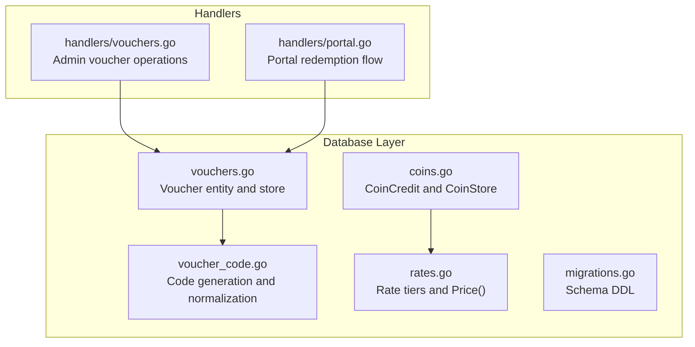

**Diagram sources**
- [database/vouchers.go:78-102](file://database/vouchers.go#L78-L102)
- [database/voucher_code.go:10-16](file://database/voucher_code.go#L10-L16)
- [database/coins.go:41-79](file://database/coins.go#L41-L79)
- [database/rates.go:25-49](file://database/rates.go#L25-L49)
- [database/migrations.go:73-99](file://database/migrations.go#L73-L99)
- [handlers/vouchers.go:293-406](file://handlers/vouchers.go#L293-L406)
- [handlers/portal.go:201-233](file://handlers/portal.go#L201-L233)

**Section sources**
- [database/vouchers.go:78-102](file://database/vouchers.go#L78-L102)
- [database/voucher_code.go:10-16](file://database/voucher_code.go#L10-L16)
- [database/coins.go:41-79](file://database/coins.go#L41-L79)
- [database/rates.go:25-49](file://database/rates.go#L25-L49)
- [database/migrations.go:73-99](file://database/migrations.go#L73-L99)
- [handlers/vouchers.go:293-406](file://handlers/vouchers.go#L293-L406)
- [handlers/portal.go:201-233](file://handlers/portal.go#L201-L233)

## Core Components
- Voucher: a prepaid hotspot key with allowances (time, data, devices), price, status, usage counters, and timestamps.
- Voucher code: cryptographically generated, human-friendly strings with strict uniqueness constraints.
- Coin credit: per-client running tally of purchased access time, decoupled from vouchers but integrated via rates.
- Rate tier: pricing rules mapping acceptor pulses to session time; used by coin credits, not directly by vouchers.

Key relationships:
- `vouchers` references `routers` for device binding.
- `coin_credits` references `routers` for attribution.
- `rates` are independent pricing rules consumed by the coin credit path.

**Section sources**
- [database/vouchers.go:78-102](file://database/vouchers.go#L78-L102)
- [database/voucher_code.go:18-51](file://database/voucher_code.go#L18-L51)
- [database/coins.go:41-79](file://database/coins.go#L41-L79)
- [database/rates.go:25-49](file://database/rates.go#L25-L49)
- [database/migrations.go:73-99](file://database/migrations.go#L73-L99)
- [database/migrations.go:143-200](file://database/migrations.go#L143-L200)

## Architecture Overview
The voucher system has two main paths:
- Voucher path: generate codes, optionally provision on routers, redeem at the portal, enforce limits on RouterOS.
- Coin credit path: accept hardware pulses, compute seconds using active rate tiers, track granted vs used time, connect sessions.

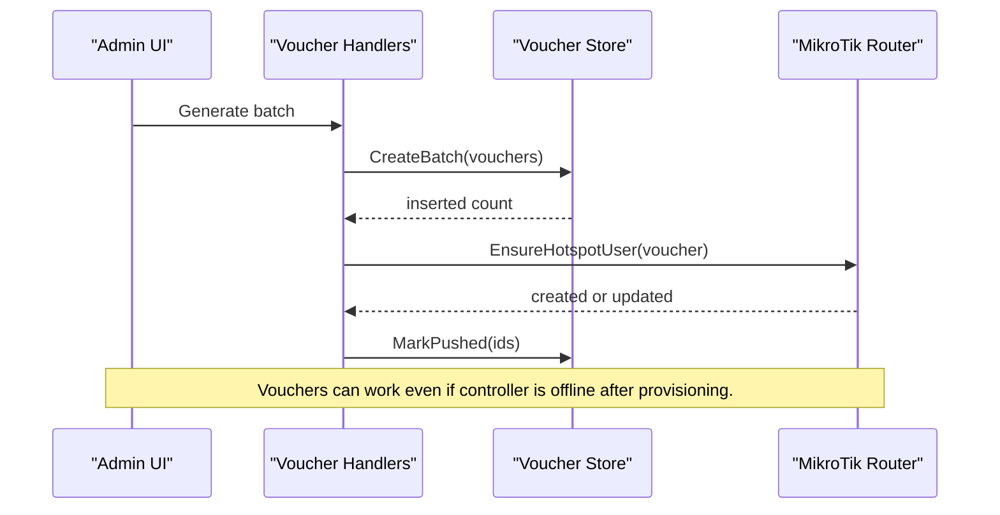

**Diagram sources**
- [handlers/vouchers.go:293-370](file://handlers/vouchers.go#L293-L370)
- [handlers/vouchers.go:471-516](file://handlers/vouchers.go#L471-L516)
- [database/vouchers.go:227-277](file://database/vouchers.go#L227-L277)

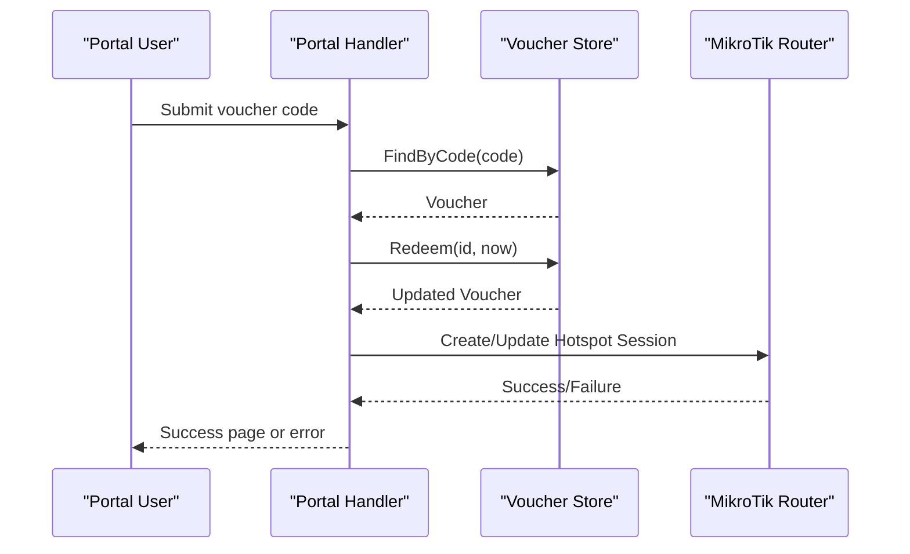

**Diagram sources**
- [handlers/portal.go:201-233](file://handlers/portal.go#L201-L233)
- [database/vouchers.go:289-303](file://database/vouchers.go#L289-L303)
- [database/vouchers.go:439-495](file://database/vouchers.go#L439-L495)

## Detailed Component Analysis

### Voucher Entity and Lifecycle
The `Voucher` struct represents a prepaid key with:
- Identity: `id`, `code`, `batch`.
- Device binding: optional `router_id` and joined `router_name`.
- Allowances: `profile`, `duration_minutes`, `data_limit_mb`, `device_limit`.
- Pricing: `price_cents` (face value).
- Status: unused, active, used, expired, disabled.
- Usage tracking: `uses`, `max_uses`.
- Timestamps: `created_at`, `pushed_at`, `activated_at`, `expires_at`, `last_used_at`.

Lifecycle validation:
- `Redeemable(at)` checks disabled/expired/used state, expiry window, and remaining uses.
- `SyncExpired` marks lapsed vouchers as expired before listing.

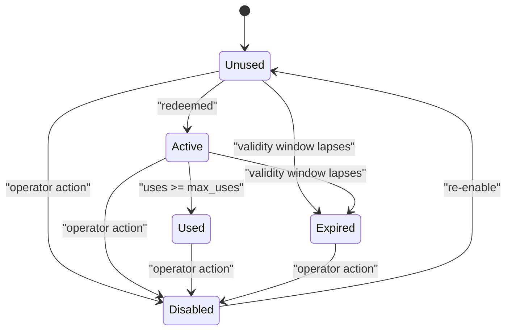

**Diagram sources**
- [database/vouchers.go:12-26](file://database/vouchers.go#L12-L26)
- [database/vouchers.go:141-160](file://database/vouchers.go#L141-L160)
- [database/vouchers.go:561-576](file://database/vouchers.go#L561-L576)

**Section sources**
- [database/vouchers.go:78-102](file://database/vouchers.go#L78-L102)
- [database/vouchers.go:141-160](file://database/vouchers.go#L141-L160)
- [database/vouchers.go:439-495](file://database/vouchers.go#L439-L495)
- [database/vouchers.go:561-576](file://database/vouchers.go#L561-L576)

### Voucher Code Generation and Uniqueness
Code generation:
- Alphabet excludes easily confused characters.
- Default format: prefix + dash-separated groups (e.g., AIR-XXXX-XXXX).
- Cryptographic randomness ensures low collision probability.

Normalization:
- Lookup normalizes input: uppercase, remove dashes/spaces.
- Storage normalizes user-provided codes to consistent casing and grouping.

Uniqueness constraint:
- Database column `code` is UNIQUE.
- Batch insert returns `ErrDuplicateVoucherCode` on clash; handlers retry up to three times.

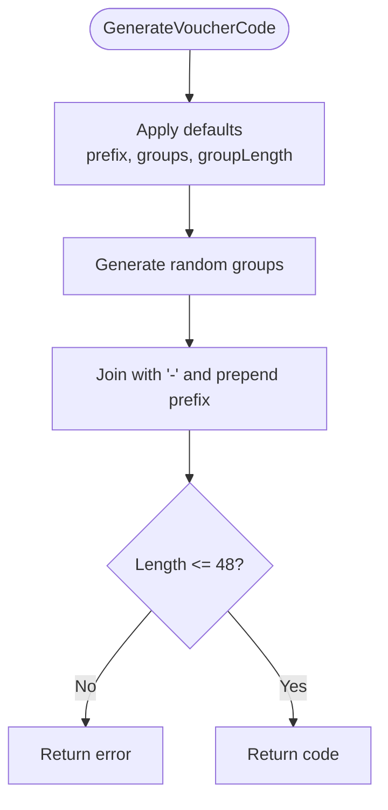

**Diagram sources**
- [database/voucher_code.go:10-16](file://database/voucher_code.go#L10-L16)
- [database/voucher_code.go:53-76](file://database/voucher_code.go#L53-L76)
- [database/voucher_code.go:90-104](file://database/voucher_code.go#L90-L104)

**Section sources**
- [database/voucher_code.go:10-16](file://database/voucher_code.go#L10-L16)
- [database/voucher_code.go:53-76](file://database/voucher_code.go#L53-L76)
- [database/voucher_code.go:90-104](file://database/voucher_code.go#L90-L104)
- [handlers/vouchers.go:321-349](file://handlers/vouchers.go#L321-L349)

### Expiration Handling
Expiration logic:
- If `DurationMinutes > 0` and no explicit `ExpiresAt`, expiration is set on first activation as `ActivatedAt + Duration`.
- `SyncExpired` updates status to expired when `ExpiresAt <= now()` for unused/active rows.
- Listing pages call `SyncExpired` to keep badges accurate.

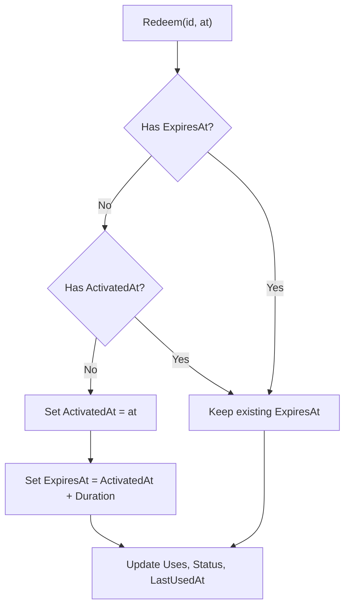

**Diagram sources**
- [database/vouchers.go:439-495](file://database/vouchers.go#L439-L495)
- [database/vouchers.go:561-576](file://database/vouchers.go#L561-L576)

**Section sources**
- [database/vouchers.go:439-495](file://database/vouchers.go#L439-L495)
- [database/vouchers.go:561-576](file://database/vouchers.go#L561-L576)

### Voucher Creation Workflow
Administrative workflow:
- Form validates quantity, groups, group length, and price.
- Generates batch of vouchers with unique codes.
- Optionally provisions each voucher on the target router and marks them pushed.

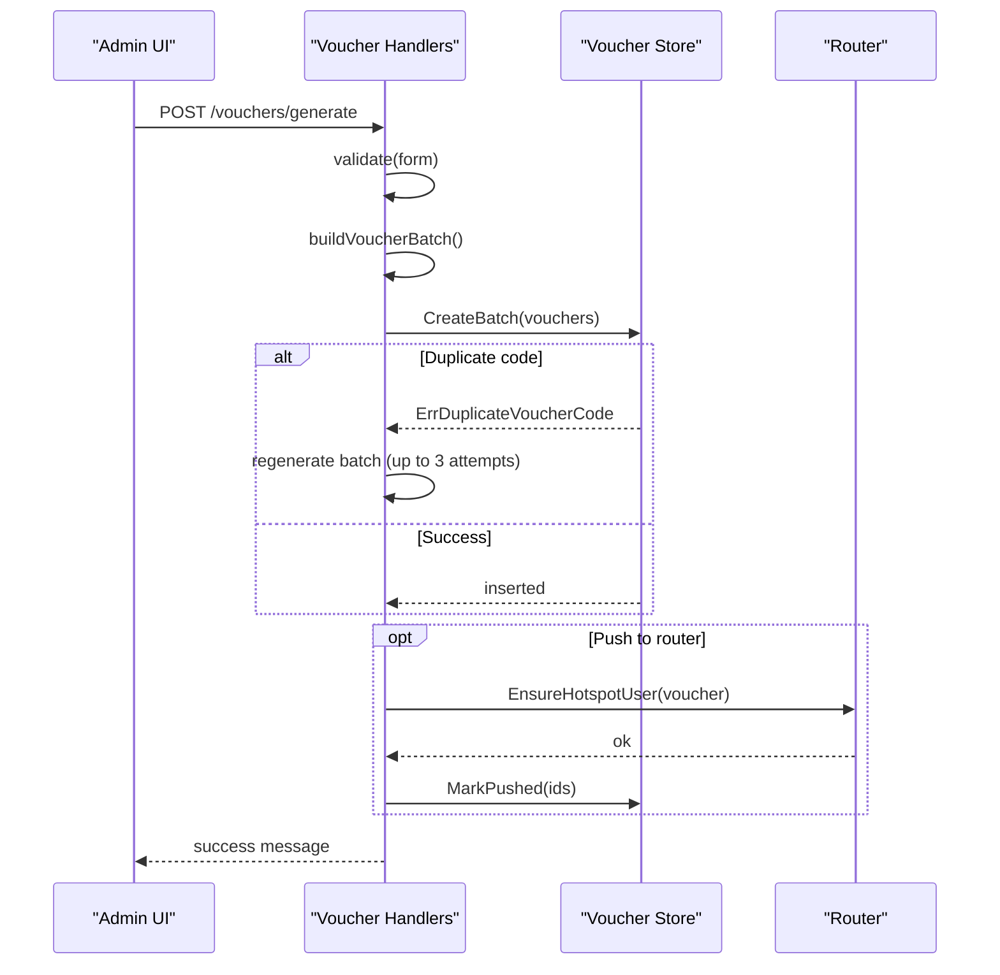

**Diagram sources**
- [handlers/vouchers.go:145-174](file://handlers/vouchers.go#L145-L174)
- [handlers/vouchers.go:293-370](file://handlers/vouchers.go#L293-L370)
- [handlers/vouchers.go:372-406](file://handlers/vouchers.go#L372-L406)
- [handlers/vouchers.go:471-516](file://handlers/vouchers.go#L471-L516)
- [database/vouchers.go:227-277](file://database/vouchers.go#L227-L277)

**Section sources**
- [handlers/vouchers.go:145-174](file://handlers/vouchers.go#L145-L174)
- [handlers/vouchers.go:293-370](file://handlers/vouchers.go#L293-L370)
- [handlers/vouchers.go:372-406](file://handlers/vouchers.go#L372-L406)
- [handlers/vouchers.go:471-516](file://handlers/vouchers.go#L471-L516)
- [database/vouchers.go:227-277](file://database/vouchers.go#L227-L277)

### Voucher Redemption Process
Portal redemption:
- Lookup voucher by normalized code.
- Enforce device binding (voucher must belong to the current router).
- Call `Redeem` inside a transaction to prevent double consumption.
- Update activated/expires timestamps and increment uses.

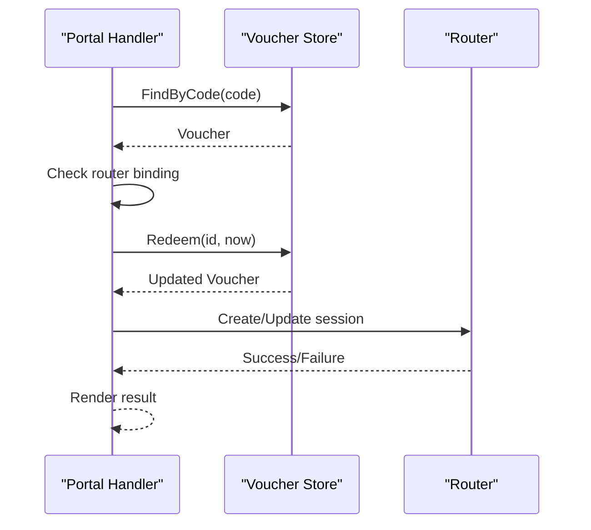

**Diagram sources**
- [handlers/portal.go:201-233](file://handlers/portal.go#L201-L233)
- [database/vouchers.go:289-303](file://database/vouchers.go#L289-L303)
- [database/vouchers.go:439-495](file://database/vouchers.go#L439-L495)

**Section sources**
- [handlers/portal.go:201-233](file://handlers/portal.go#L201-L233)
- [database/vouchers.go:289-303](file://database/vouchers.go#L289-L303)
- [database/vouchers.go:439-495](file://database/vouchers.go#L439-L495)

### Coin Credit System Integration
The coin credit system is separate from vouchers but shares the router and rate concepts:
- `CoinCredit` tracks per-client grants and usage.
- `CoinStore.Credit` applies pulses, deduplicates by event ID, and sets idle TTL expiration.
- `CoinStore.Consume` deducts authorized seconds and transitions to connected when fully spent.
- Idle balances expire automatically to avoid cross-customer inheritance.

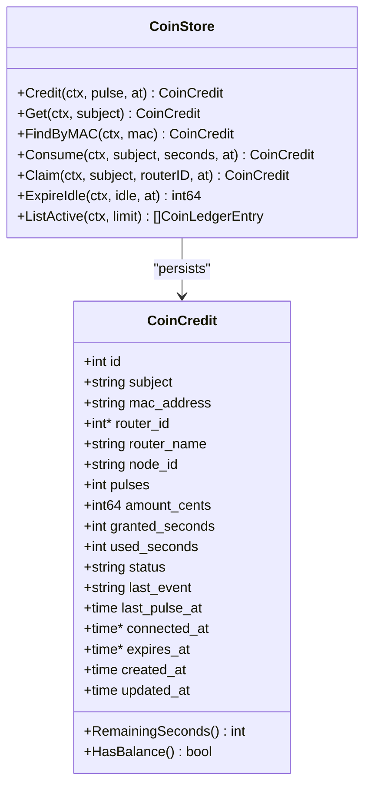

**Diagram sources**
- [database/coins.go:41-79](file://database/coins.go#L41-L79)
- [database/coins.go:149-223](file://database/coins.go#L149-L223)
- [database/coins.go:261-319](file://database/coins.go#L261-L319)
- [database/coins.go:321-348](file://database/coins.go#L321-L348)

**Section sources**
- [database/coins.go:41-79](file://database/coins.go#L41-L79)
- [database/coins.go:149-223](file://database/coins.go#L149-L223)
- [database/coins.go:261-319](file://database/coins.go#L261-L319)
- [database/coins.go:321-348](file://database/coins.go#L321-L348)

### Rate Calculations and Pricing Tiers
Rates define how many acceptor pulses buy how much time:
- Additive tiers: multiple tiers can be active simultaneously.
- Greedy allocation: largest tiers consumed first; remainder priced at smallest tier.
- Derived metrics: `SecondsPerPulse`, `CentsPerPulse`.
- Fallback: if no active tiers, use environment-based fallback seconds per pulse.

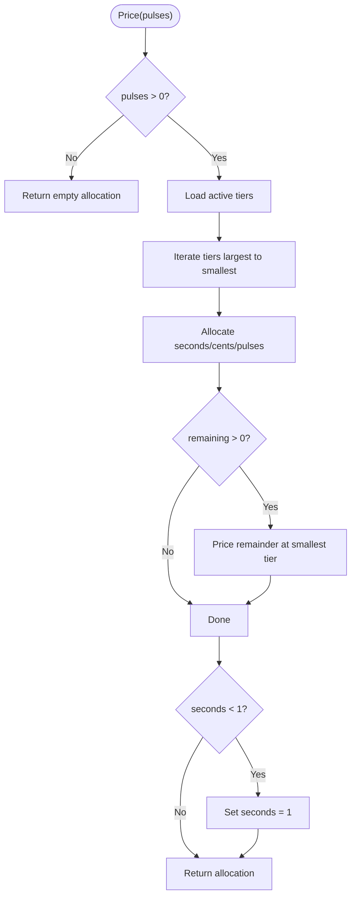

**Diagram sources**
- [database/rates.go:361-424](file://database/rates.go#L361-L424)
- [database/rates.go:151-159](file://database/rates.go#L151-L159)
- [database/rates.go:426-440](file://database/rates.go#L426-L440)

**Section sources**
- [database/rates.go:25-49](file://database/rates.go#L25-L49)
- [database/rates.go:103-118](file://database/rates.go#L103-L118)
- [database/rates.go:151-159](file://database/rates.go#L151-L159)
- [database/rates.go:361-424](file://database/rates.go#L361-L424)
- [database/rates.go:426-440](file://database/rates.go#L426-L440)

### Balance Management Operations
- Credit application: `CoinStore.Credit` atomically inserts or updates a credit row, deduplicating by event ID.
- Consumption: `CoinStore.Consume` caps `used_seconds` to never exceed `granted_seconds`.
- Claiming: `CoinStore.Claim` binds a credit to a router for auditability.
- Idle expiration: `CoinStore.ExpireIdle` releases untouched balances after TTL.

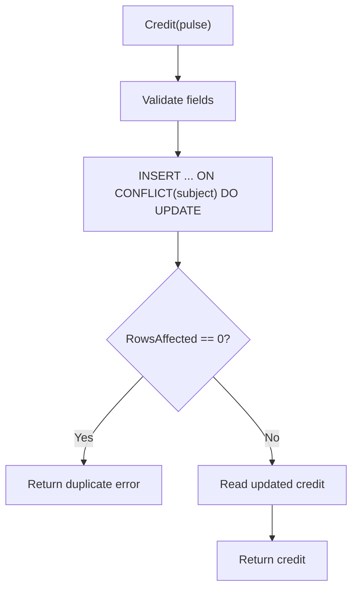

**Diagram sources**
- [database/coins.go:149-223](file://database/coins.go#L149-L223)

**Section sources**
- [database/coins.go:149-223](file://database/coins.go#L149-L223)
- [database/coins.go:261-319](file://database/coins.go#L261-L319)
- [database/coins.go:321-348](file://database/coins.go#L321-L348)

## Dependency Analysis
- Vouchers depend on routers for device binding and on voucher code utilities for generation and normalization.
- Coin credits depend on routers for attribution and on rates for pricing pulses into seconds.
- Handlers orchestrate interactions between stores and external routers.

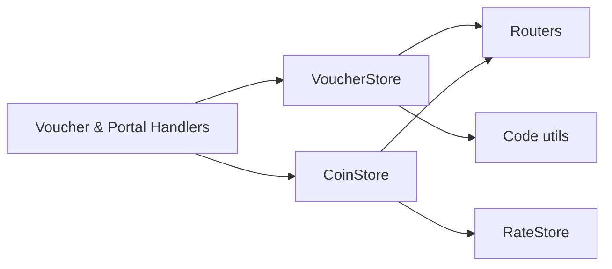

**Diagram sources**
- [database/vouchers.go:227-277](file://database/vouchers.go#L227-L277)
- [database/voucher_code.go:53-76](file://database/voucher_code.go#L53-L76)
- [database/coins.go:149-223](file://database/coins.go#L149-L223)
- [database/rates.go:361-424](file://database/rates.go#L361-L424)
- [handlers/vouchers.go:293-406](file://handlers/vouchers.go#L293-L406)
- [handlers/portal.go:201-233](file://handlers/portal.go#L201-L233)

**Section sources**
- [database/vouchers.go:227-277](file://database/vouchers.go#L227-L277)
- [database/voucher_code.go:53-76](file://database/voucher_code.go#L53-L76)
- [database/coins.go:149-223](file://database/coins.go#L149-L223)
- [database/rates.go:361-424](file://database/rates.go#L361-L424)
- [handlers/vouchers.go:293-406](file://handlers/vouchers.go#L293-L406)
- [handlers/portal.go:201-233](file://handlers/portal.go#L201-L233)

## Performance Considerations
- Batch voucher creation uses transactions and prepared statements to reduce overhead.
- Unique index on `vouchers.code` prevents duplicates; collisions trigger retries at the handler level.
- Voucher listing and counting support pagination and filters to keep queries efficient.
- Coin credit updates are single-statement upserts with deduplication to avoid race conditions.
- Idle expiration runs periodically to release stale balances without blocking hot paths.

[No sources needed since this section provides general guidance]

## Troubleshooting Guide
Common issues and resolutions:
- Duplicate voucher code:
  - Cause: extremely unlikely hash collision during generation.
  - Resolution: handler retries batch generation up to three times.
- Voucher not redeemable:
  - Causes: disabled, expired, already used, or exceeded max uses.
  - Resolution: check status and timestamps; re-enable or generate new voucher.
- Voucher bound to wrong router:
  - Cause: voucher belongs to another hotspot.
  - Resolution: ensure correct router selection during generation or push.
- Coin credit duplicate pulse:
  - Cause: NodeMCU retries POST.
  - Resolution: rely on EventID deduplication; do not re-credit.
- Idle coin balance not expiring:
  - Cause: missing TTL or misconfigured sweeper.
  - Resolution: verify IdleTTL and periodic expiration job.

**Section sources**
- [handlers/vouchers.go:321-349](file://handlers/vouchers.go#L321-L349)
- [database/vouchers.go:141-160](file://database/vouchers.go#L141-L160)
- [handlers/portal.go:201-233](file://handlers/portal.go#L201-L233)
- [database/coins.go:149-223](file://database/coins.go#L149-L223)
- [database/coins.go:321-348](file://database/coins.go#L321-L348)

## Conclusion
The voucher system provides robust prepaid access keys with strong uniqueness guarantees, clear lifecycle management, and optional device provisioning. It integrates cleanly with the coin credit system through shared router entities and rate tiers, enabling flexible pricing and reliable balance accounting. Operators can generate batches, manage statuses, and export data, while the portal enforces redemption rules and device binding. The design emphasizes correctness under concurrency, auditability, and operational clarity.

[No sources needed since this section summarizes without analyzing specific files]