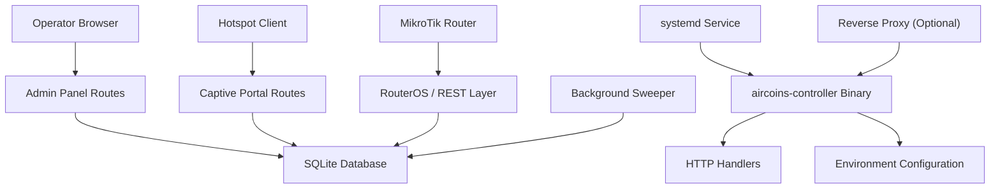
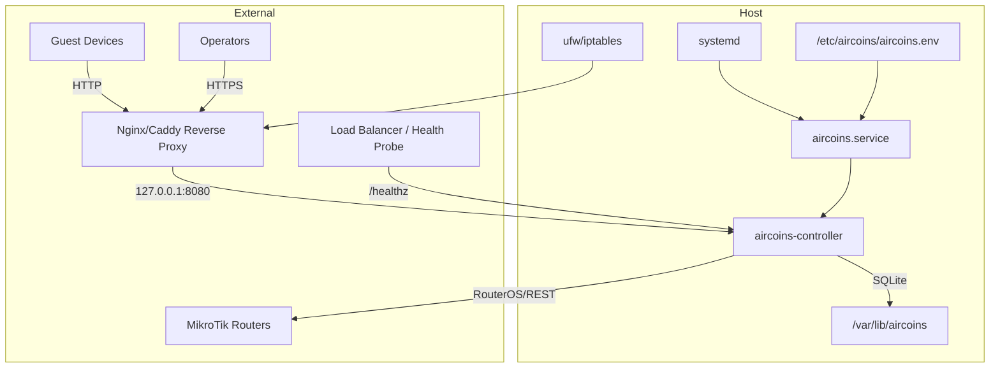
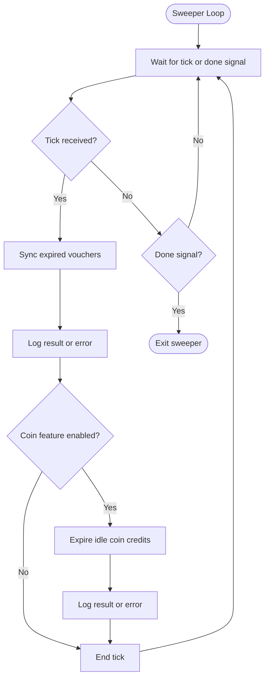
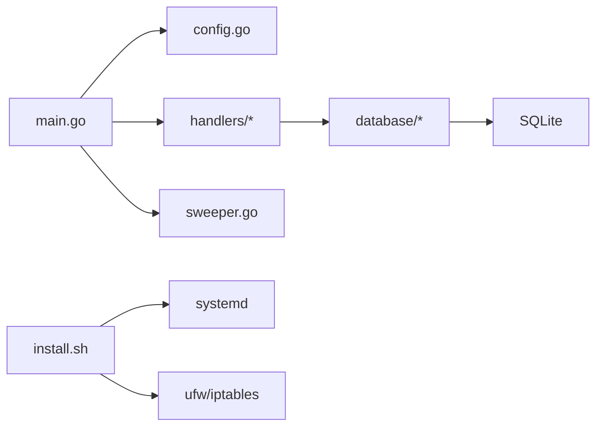

# Deployment & Operations

<cite>
**Referenced Files in This Document**
- [README.md](file://README.md)
- [INSTALLATION.md](file://INSTALLATION.md)
- [main.go](file://main.go)
- [config.go](file://config.go)
- [sweeper.go](file://sweeper.go)
- [install.sh](file://install.sh)
- [handlers/dashboard.go](file://handlers/dashboard.go)
- [handlers/handlers.go](file://handlers/handlers.go)
- [database/database.go](file://database/database.go)
- [database/migrations.go](file://database/migrations.go)
- [database/stats.go](file://database/stats.go)
</cite>

## Table of Contents
1. [Introduction](#introduction)
2. [Project Structure](#project-structure)
3. [Core Components](#core-components)
4. [Architecture Overview](#architecture-overview)
5. [Detailed Component Analysis](#detailed-component-analysis)
6. [Dependency Analysis](#dependency-analysis)
7. [Performance Considerations](#performance-considerations)
8. [Troubleshooting Guide](#troubleshooting-guide)
9. [Conclusion](#conclusion)
10. [Appendices](#appendices)

## Introduction
This document provides production deployment and operations guidance for the Aircoins MikroTik Controller. It covers systemd service configuration, Docker containerization options, scaling considerations, monitoring and maintenance procedures, background sweeper behavior, performance tuning, capacity planning, operational runbooks, incident response, troubleshooting workflows, upgrade procedures, version compatibility, and rollback strategies.

The controller is a single Go binary that serves:
- A captive portal for hotspot clients.
- An operator panel behind authentication.
- A REST/RouterOS integration layer for MikroTik routers.
- SQLite-backed persistence with migrations and encrypted router credentials.

It is designed to run on Debian/Ubuntu systems and Armbian SBCs, typically behind port 80 or behind a reverse proxy.

**Section sources**
- [README.md:1-10](file://README.md#L1-L10)
- [README.md:197-206](file://README.md#L197-L206)

## Project Structure
At runtime, the application consists of:
- Entry point and process lifecycle management.
- Environment-driven configuration.
- HTTP server and route handlers.
- Background housekeeping goroutine.
- SQLite database with migrations and credential encryption.
- Installer script that provisions systemd, firewall, directories, and smoke tests.

**Diagram sources**
- [main.go:36-57](file://main.go#L36-L57)
- [main.go:214-285](file://main.go#L214-L285)
- [handlers/handlers.go:293-303](file://handlers/handlers.go#L293-L303)
- [database/database.go:70-116](file://database/database.go#L70-L116)
- [sweeper.go:11-52](file://sweeper.go#L11-L52)

**Section sources**
- [README.md:197-206](file://README.md#L197-L206)
- [main.go:36-57](file://main.go#L36-L57)
- [handlers/handlers.go:293-303](file://handlers/handlers.go#L293-L303)

## Core Components
- **Entry point**: Initializes logging, loads configuration, opens the database, seeds templates, bootstraps the admin account, starts the HTTP server, and launches the expiry sweeper.
- **Configuration**: Reads environment variables for listen address, database path, secret key path, portal branding, session TTL, API timeout, secure cookies, and coin slot settings.
- **Handlers**: Mount health checks, captive portal routes, admin panel routes, and API endpoints.
- **Database**: Opens SQLite with WAL mode, applies migrations, manages a master key file, and exposes dashboard statistics and health checks.
- **Sweeper**: Periodically expires vouchers and releases idle coin credits.
- **Installer**: Creates user, directories, builds the binary, writes systemd unit, configures firewall, enables service, and performs a health check smoke test.

**Section sources**
- [main.go:36-57](file://main.go#L36-L57)
- [main.go:214-285](file://main.go#L214-L285)
- [config.go:14-77](file://config.go#L14-L77)
- [handlers/handlers.go:293-303](file://handlers/handlers.go#L293-L303)
- [database/database.go:70-116](file://database/database.go#L70-L116)
- [database/stats.go:8-53](file://database/stats.go#L8-L53)
- [sweeper.go:11-52](file://sweeper.go#L11-L52)
- [install.sh:282-419](file://install.sh#L282-L419)

## Architecture Overview
The production architecture supports two common patterns:
- Direct binding on port 80 using systemd capabilities.
- Reverse proxy termination with TLS and internal non-privileged port.

**Diagram sources**
- [install.sh:385-419](file://install.sh#L385-L419)
- [install.sh:421-447](file://install.sh#L421-L447)
- [INSTALLATION.md:236-258](file://INSTALLATION.md#L236-L258)
- [handlers/dashboard.go:88-98](file://handlers/dashboard.go#L88-L98)

**Section sources**
- [INSTALLATION.md:155-258](file://INSTALLATION.md#L155-L258)
- [install.sh:385-447](file://install.sh#L385-L447)

## Detailed Component Analysis

### Production Deployment Strategies

#### systemd Service Configuration
- The installer writes `/etc/systemd/system/aircoins.service` with:
  - `Type=simple`.
  - Unprivileged service user `aircoins`.
  - `WorkingDirectory=/opt/aircoins`.
  - `EnvironmentFile=/etc/aircoins/aircoins.env`.
  - `ExecStart=/opt/aircoins/aircoins-controller`.
  - `Restart=on-failure` with `RestartSec=3`.
  - Capability `AmbientCapabilities=CAP_NET_BIND_SERVICE` so the unprivileged user can bind port 80.
  - Restricted filesystem access via `ProtectHome=true`, `PrivateTmp=true`, and `ReadWritePaths` pointing at the data directory.
- The service is enabled and restarted during installation; the installer also probes `/healthz` until it returns `ok`.

Operational notes:
- If you manage the unit manually, ensure `AmbientCapabilities=CAP_NET_BIND_SERVICE` remains present when serving port 80.
- Alternatively, bind a non-privileged port such as `:8080` and place a reverse proxy or iptables redirect in front.

**Section sources**
- [install.sh:385-419](file://install.sh#L385-L419)
- [install.sh:449-502](file://install.sh#L449-L502)
- [README.md:143-165](file://README.md#L143-L165)
- [INSTALLATION.md:198-218](file://INSTALLATION.md#L198-L218)

#### Docker Containerization Options
The repository does not include an official Dockerfile. However, the binary is built with `CGO_ENABLED=0`, making it suitable for static container images. Recommended containerization approach:
- Use a minimal base image such as `gcr.io/distroless/static-debian12` or `alpine`.
- Copy the compiled `aircoins-controller` binary into the container.
- Mount `/var/lib/aircoins` for persistent SQLite data and secret key storage.
- Set environment variables through container orchestration (e.g., Kubernetes `env` or Docker Compose `environment`).
- Expose only the configured `ADDR` port internally; terminate TLS at a sidecar or ingress controller.
- Run as a non-root user inside the container and restrict filesystem write paths to the mounted data directory.

Recommended container environment variables:
- `ADDR`: Listen address, e.g., `:8080`.
- `DB_PATH`: Persistent path, e.g., `/data/aircoins.db`.
- `SECRET_KEY_PATH`: Persistent path, e.g., `/data/secret.key`.
- `PORTAL_NAME`, `ADMIN_PATH`, `API_TIMEOUT`, `SECURE_COOKIES`, and other variables documented in the README.

Scaling considerations:
- The controller uses SQLite, which is best suited for single-instance deployments. Horizontal scaling should be avoided unless you migrate to a shared database backend and externalize state.
- For high availability, deploy multiple instances behind a load balancer only if you accept the implications of per-process in-memory rate limits and session counters.
- Prefer vertical scaling and resource limits over horizontal replication for this component.

[No sources needed since this section provides general containerization guidance based on build characteristics]

#### Scaling Considerations
- Single-instance design: SQLite serializes writers; connection pool defaults are small (`MaxOpenConns=4`) to avoid contention.
- In-memory security counters: Brute-force protection counters reset on restart, so multi-instance setups cannot share lockout state reliably.
- Router API timeouts: Tune `API_TIMEOUT` to match network conditions and router responsiveness.
- Reverse proxy buffering: Ensure timeouts and buffer sizes align with handler read/write/idle timeouts.

**Section sources**
- [database/database.go:39-60](file://database/database.go#L39-L60)
- [config.go:26-31](file://config.go#L26-L31)
- [README.md:123-131](file://README.md#L123-L131)

### Monitoring and Maintenance Procedures

#### Health Checks
- The `/healthz` endpoint responds with `ok` when the database is reachable and schema migrations are initialized.
- On failure, it returns `unhealthy` with status `503`.
- The installer waits up to 30 seconds after starting the service before declaring success.

Operational runbook:
- External probe: `curl -fsS http://<board-ip>/healthz`
- Expected output: `ok`
- If unhealthy:
  - Check service logs: `journalctl -u aircoins -f`
  - Verify database writability and permissions under `/var/lib/aircoins`.
  - Confirm no port conflict on `ADDR`.
  - Validate that migrations completed successfully.

**Section sources**
- [handlers/dashboard.go:88-98](file://handlers/dashboard.go#L88-L98)
- [database/stats.go:43-53](file://database/stats.go#L43-L53)
- [install.sh:481-502](file://install.sh#L481-L502)

#### Log Analysis
- Logs use structured text logging via `log/slog`.
- Key log lines:
  - Controller listening address and version.
  - Generated initial panel password.
  - Voucher expiry sweep results.
  - Coin credit sweep results.
  - Health check failures.
  - Migration application events.

Recommended commands:
- Follow live logs: `journalctl -u aircoins -f`
- Search for errors: `journalctl -u aircoins -p err --since today`
- Inspect first-boot password generation: `journalctl -u aircoins | grep 'initial panel password'`

**Section sources**
- [main.go:264-265](file://main.go#L264-L265)
- [main.go:320-325](file://main.go#L320-L325)
- [sweeper.go:29-46](file://sweeper.go#L29-L46)
- [handlers/dashboard.go:91-93](file://handlers/dashboard.go#L91-L93)
- [database/migrations.go:321-321](file://database/migrations.go#L321-L321)

#### Backup Strategies
Critical artifacts:
- SQLite database file: `/var/lib/aircoins/aircoins.db`
- Master key file: `/var/lib/aircoins/secret.key` (mode `0600`)
- Environment configuration: `/etc/aircoins/aircoins.env`

Backup recommendations:
- Stop the service before copying the database to ensure consistency, or use a snapshot tool compatible with SQLite WAL mode.
- Back up `secret.key` separately with strict access controls; without it, router passwords stored in the database are unrecoverable.
- Version-control configuration files but never commit secrets or database files.
- Schedule automated backups with retention policies aligned to compliance requirements.

Restore procedure:
- Stop the service.
- Restore `aircoins.db` and `secret.key` with correct ownership and permissions.
- Start the service and verify `/healthz`.
- Re-register routers if credentials were lost due to missing `secret.key`.

**Section sources**
- [INSTALLATION.md:101-105](file://INSTALLATION.md#L101-L105)
- [database/database.go:70-116](file://database/database.go#L70-L116)
- [database/secretbox.go:120-131](file://database/secretbox.go#L120-L131)
- [.gitignore:8-15](file://.gitignore#L8-L15)

#### Disaster Recovery
- If `secret.key` is lost, router API passwords cannot be recovered; operators must re-enter credentials.
- If the database is corrupted:
  - Restore from the latest backup.
  - Verify schema migrations by checking `/healthz`.
  - Reconnect routers and validate inventory.
- If the host is replaced:
  - Preserve `/var/lib/aircoins` and `/etc/aircoins/aircoins.env`.
  - Recreate the `aircoins` user and install the binary if necessary.
  - Restart the service and confirm health.

**Section sources**
- [INSTALLATION.md:153-153](file://INSTALLATION.md#L153-L153)
- [database/stats.go:43-53](file://database/stats.go#L43-L53)

### Background Sweeper Processes
The expiry sweeper runs as a background goroutine and performs two periodic tasks every five minutes:
- Expire vouchers that have lapsed.
- Release idle coin balances when the coin slot feature is configured.

Behavior details:
- The sweeper uses a ticker and respects a `done` channel for graceful shutdown.
- Each sweep runs with a 30-second context timeout.
- Errors are logged; successful sweeps log counts.
- Coin balance expiration is gated by `COIN_IDLE_TTL`; if set, balances are released between ticks.

**Diagram sources**
- [sweeper.go:11-52](file://sweeper.go#L11-L52)

**Section sources**
- [sweeper.go:11-52](file://sweeper.go#L11-L52)
- [main.go:255-257](file://main.go#L255-L257)

### Performance Tuning Guidelines
- Database connection pool: Default `MaxOpenConns=4` is tuned for SQLite writer serialization. Increase cautiously under heavy concurrent load.
- Busy timeout: Default busy timeout prevents long hangs on locked databases; adjust if queries frequently contend.
- API timeout: Tune `API_TIMEOUT` to balance responsiveness and reliability when communicating with MikroTik routers.
- HTTP server timeouts: Read header, read, write, and idle timeouts are set in the server initialization. Adjust based on expected payload sizes and client behavior.
- Reverse proxy buffers: Align proxy timeouts and buffer sizes with server timeouts to avoid premature disconnects.

**Section sources**
- [database/database.go:39-60](file://database/database.go#L39-L60)
- [config.go:26-31](file://config.go#L26-L31)
- [main.go:246-253](file://main.go#L246-L253)

### Resource Requirements and Capacity Planning
- Supported platforms: Armbian SBCs and x64 Ubuntu/Debian mini PCs.
- Build time: First build may take several minutes on ARM; swap is automatically created on low-memory boards.
- Memory: Small boards receive a 1 GB swapfile during installation if none exists.
- Storage: SQLite database and secret key reside under `/var/lib/aircoins`; size depends on router inventory, sessions, vouchers, and ledger history.
- CPU: Single-binary workload; scale vertically rather than horizontally.

Capacity planning tips:
- Monitor disk usage for SQLite files and WAL segments.
- Track active sessions and voucher batches to estimate growth.
- Plan router API call volume against `API_TIMEOUT` and network latency.
- Avoid running additional heavy workloads on the same host if memory is constrained.

**Section sources**
- [INSTALLATION.md:50-64](file://INSTALLATION.md#L50-L64)
- [INSTALLATION.md:188-198](file://INSTALLATION.md#L188-L198)
- [INSTALLATION.md:101-105](file://INSTALLATION.md#L101-L105)

### Operational Runbooks

#### Common Maintenance Tasks
- Rotate operator password:
  - Stop the service.
  - Run the password recovery command.
  - Start the service.
- Change operator username:
  - Use the password utility with the appropriate flag.
- Update portal branding:
  - Edit `/etc/aircoins/aircoins.env` and restart the service.
- Move off port 80:
  - Set `ADDR` to a non-privileged port and restart.
  - Configure reverse proxy or iptables redirect as needed.

**Section sources**
- [README.md:32-42](file://README.md#L32-L42)
- [INSTALLATION.md:155-171](file://INSTALLATION.md#L155-L171)

#### Incident Response Procedures
- Service unhealthy:
  - Check `journalctl -u aircoins -e`.
  - Verify port binding and permissions.
  - Confirm database writability and migration status.
- Router offline:
  - Validate IP/port, allowed addresses, API user groups, and firewall rules.
  - Test connection method: REST vs binary API.
- Lost master key:
  - Accept that router passwords are unrecoverable; re-enter credentials after restoring the database.

**Section sources**
- [INSTALLATION.md:138-153](file://INSTALLATION.md#L138-L153)

#### Troubleshooting Workflows
- Port 80 permission denied:
  - Ensure `AmbientCapabilities=CAP_NET_BIND_SERVICE` is present.
  - Or bind a non-privileged port.
- Health check fails after upgrade:
  - Compare the installed address with the effective address in the env file.
  - Restart and re-run the installer to reconcile ADDR.
- Template or dashboard errors:
  - Rebuild from the latest source and restart the service.

**Section sources**
- [INSTALLATION.md:198-218](file://INSTALLATION.md#L198-L218)
- [INSTALLATION.md:173-196](file://INSTALLATION.md#L173-L196)
- [INSTALLATION.md:134-137](file://INSTALLATION.md#L134-L137)

### Upgrade Procedures, Version Compatibility, and Rollback Strategies

#### Upgrade Procedure
- Preferred method: Re-run the installer; it is idempotent and upgrades the binary in place.
- The installer:
  - Detects hardware and OS.
  - Installs dependencies.
  - Builds the binary with `CGO_ENABLED=0`.
  - Writes the systemd unit and environment file.
  - Enables and restarts the service.
  - Probes `/healthz` until healthy.
- Footer version comes from `AIRCOINS_VERSION`, git describe, or `dev`.

**Section sources**
- [INSTALLATION.md:1-21](file://INSTALLATION.md#L1-L21)
- [INSTALLATION.md:23-48](file://INSTALLATION.md#L23-L48)
- [install.sh:310-323](file://install.sh#L310-L323)
- [install.sh:449-502](file://install.sh#L449-L502)

#### Version Compatibility
- Go toolchain: Installer ensures a compatible Go version is available; it reads the minimum from `go.mod`.
- Database migrations: Forward-only migrations are applied at startup; each migration is transactional and recorded in `schema_migrations`.
- Router API: Supports both REST and legacy binary API; auto-detection remembers whichever protocol answered.

**Section sources**
- [INSTALLATION.md:11-21](file://INSTALLATION.md#L11-L21)
- [database/migrations.go:289-347](file://database/migrations.go#L289-L347)
- [INSTALLATION.md:70-84](file://INSTALLATION.md#L70-L84)

#### Rollback Strategy
- Keep previous binary versions in a safe location before upgrading.
- Preserve `/var/lib/aircoins` and `/etc/aircoins/aircoins.env`.
- If an upgrade breaks health checks:
  - Stop the service.
  - Restore the previous binary.
  - Restart and verify `/healthz`.
  - Investigate migration logs if schema changes caused issues.
- The installer backs up the legacy default `ADDR` line when migrating the environment file.

**Section sources**
- [INSTALLATION.md:173-196](file://INSTALLATION.md#L173-L196)
- [install.sh:345-359](file://install.sh#L345-L359)

## Dependency Analysis
The controller has clear boundaries:
- Entry point orchestrates configuration, database, handlers, and sweeper.
- Handlers depend on the database and template engine.
- Database depends on SQLite and a secret key manager.
- Installer depends on system tools and package managers.

**Diagram sources**
- [main.go:36-57](file://main.go#L36-L57)
- [config.go:14-77](file://config.go#L14-L77)
- [handlers/handlers.go:293-303](file://handlers/handlers.go#L293-L303)
- [database/database.go:70-116](file://database/database.go#L70-L116)
- [install.sh:385-447](file://install.sh#L385-L447)

**Section sources**
- [main.go:36-57](file://main.go#L36-L57)
- [config.go:14-77](file://config.go#L14-L77)
- [handlers/handlers.go:293-303](file://handlers/handlers.go#L293-L303)
- [database/database.go:70-116](file://database/database.go#L70-L116)
- [install.sh:385-447](file://install.sh#L385-L447)

## Performance Considerations
- Use SQLite WAL mode and synchronous NORMAL for balanced durability and performance.
- Keep connection pool small to avoid SQLite contention.
- Tune API timeouts to match router responsiveness and network conditions.
- Avoid exposing the controller directly to untrusted networks; prefer reverse proxy termination with TLS.
- Monitor disk I/O and database growth; schedule regular backups and rotation.

[No sources needed since this section provides general guidance]

## Troubleshooting Guide
Common issues and resolutions:
- Unsupported CPU architecture: Use a supported 64-bit image.
- Build OOM on small boards: Installer adds swap; rebuild.
- Distro Go too old: Installer fetches official tarball.
- Linker error due to spaces in version: Use sanitized version or set `AIRCOINS_VERSION`.
- Template error on router detail page: Rebuild from latest source.
- Service unhealthy: Check logs, port clash, DB writability.
- Bind permission denied on port 80: Add capability or use non-privileged port.
- Portal not linked: Set router portal tag or default portal.
- Router offline: Check IP/port, allowed address, API user group, firewall.
- Lost master key: Router passwords are unrecoverable; re-enter them.

**Section sources**
- [INSTALLATION.md:123-153](file://INSTALLATION.md#L123-L153)

## Conclusion
The Aircoins MikroTik Controller is a compact, single-binary service optimized for edge deployments. Production readiness relies on proper systemd configuration, careful handling of the SQLite database and master key, and disciplined monitoring via `/healthz` and journal logs. Upgrades are streamlined through the installer, while rollbacks require preserving binaries and data directories. For scale-out scenarios, treat the controller as a stateful single instance and rely on reverse proxies and external TLS termination rather than horizontal replication.

[No sources needed since this section summarizes without analyzing specific files]

## Appendices

### Configuration Reference Summary
Key environment variables:
- `ADDR`: Listen address.
- `DB_PATH`: SQLite database path.
- `SECRET_KEY_PATH`: Master key file path.
- `PORTAL_NAME`, `PORTAL_TAGLINE`, `PORTAL_SUPPORT`: Portal branding.
- `ADMIN_PATH`, `DASHBOARD_AT_ROOT`: Panel routing.
- `ADMIN_USER`, `ADMIN_PASSWORD`: Initial operator credentials.
- `DEFAULT_REDIRECT`: Portal fallback URL.
- `ADMIN_SESSION_TTL`: Session lifetime.
- `API_TIMEOUT`: Router API timeout.
- `SECURE_COOKIES`: Enable secure cookies behind HTTPS.
- `VERSION`: Build-time footer version.

**Section sources**
- [README.md:70-90](file://README.md#L70-L90)
- [config.go:20-77](file://config.go#L20-L77)