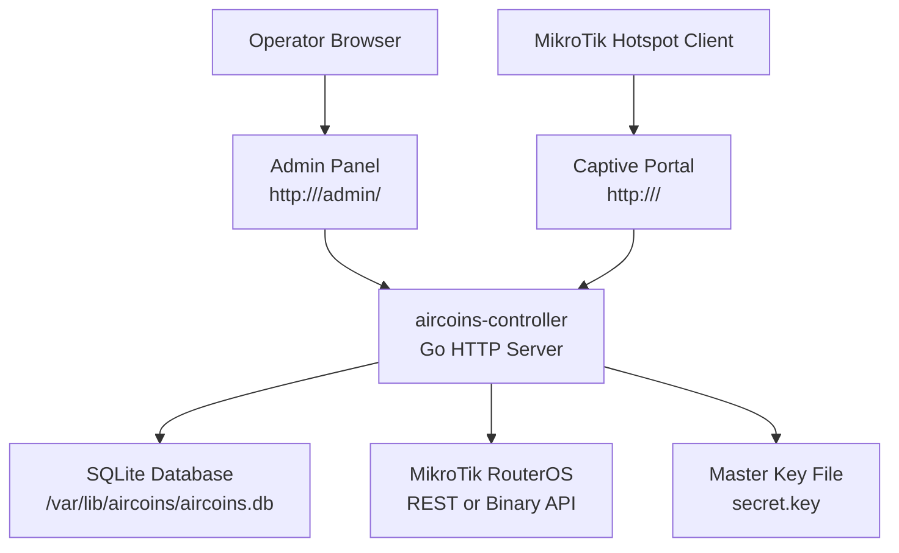

# Installation & Setup

<cite>
**Referenced Files in This Document**   
- [INSTALLATION.md](file://INSTALLATION.md)
- [install.sh](file://install.sh)
- [README.md](file://README.md)
- [go.mod](file://go.mod)
- [main.go](file://main.go)
- [config.go](file://config.go)
- [run_demo.ps1](file://run_demo.ps1)
- [netstart.ps1](file://netstart.ps1)
</cite>

## Table of Contents
1. [Introduction](#introduction)
2. [System Requirements](#system-requirements)
3. [Automated Installation with install.sh](#automated-installation-with-installsh)
4. [Manual Installation](#manual-installation)
5. [Environment Configuration](#environment-configuration)
6. [Initial Setup and First Boot](#initial-setup-and-first-boot)
7. [Verification Procedures](#verification-procedures)
8. [Troubleshooting Common Issues](#troubleshooting-common-issues)
9. [Architecture Overview](#architecture-overview)
10. [Conclusion](#conclusion)

## Introduction
Aircoins MikroTik Controller is a Go-based controller for MikroTik hotspots. It provides:
- A captive portal for hotspot clients.
- An operator panel for managing routers, vouchers, sessions, and settings.
- SQLite-backed storage with encrypted router credentials.
- Optional ZeroTier host management through a restricted helper.

The recommended deployment target is Debian/Ubuntu/Armbian on SBCs or mini PCs. The installer supports automated setup, systemd integration, firewall configuration, and health checks.

## System Requirements

### Supported Operating Systems
- Armbian on SBC boards (Orange Pi, Raspberry Pi, Rockchip, Allwinner, Amlogic).
- Ubuntu 22.04 / 24.04.
- Debian 11 / 12.
- Raspberry Pi OS Lite is supported; Git may need to be installed first.

### Supported CPU Architectures
- x64 (Intel/AMD 64-bit).
- ARM 64-bit (aarch64/arm64), preferred on SBCs.
- ARM 32-bit (armv7l/armv6l) works but compiles slowly.
- RISC-V 64-bit is recognized by the installer.

### Go Version
- The project requires Go 1.26.5 as declared in the module file.
- The installer prefers a distro Go package if it meets the minimum version, otherwise it downloads the official tarball for the detected architecture.

### Hardware Recommendations
- Prefer 64-bit images on ARM SBCs.
- For very small boards (for example 512 MB RAM), the installer can create swap automatically during build.
- Use a stable power supply and fast storage for reliable builds.

### Network Requirements
- Port 80 is used by default for the portal and panel. If another service owns port 80, move the controller to another port or use a reverse proxy.
- RouterOS access ports:
  - REST over HTTPS (www-ssl) or HTTP (www).
  - Legacy API (8728) or API-SSL (8729).

**Section sources**
- [INSTALLATION.md:1-21](file://INSTALLATION.md#L1-L21)
- [INSTALLATION.md:50-64](file://INSTALLATION.md#L50-L64)
- [INSTALLATION.md:123-153](file://INSTALLATION.md#L123-L153)
- [go.mod:1-8](file://go.mod#L1-L8)
- [install.sh:96-161](file://install.sh#L96-L161)
- [install.sh:213-277](file://install.sh#L213-L277)

## Automated Installation with install.sh

### One-Line Install
```bash
git clone https://github.com/Djnirds1984/Aircoins-Mikrotik-Controller.git
cd Aircoins-Mikrotik-Controller
sudo ./install.sh
```

### Useful Variants
- Move off port 80:
  ```bash
  sudo ./install.sh --port 8080 --portal-name "My Hotspot"
  ```
- Install from a custom repository and branch:
  ```bash
  sudo ./install.sh --repo https://github.com/Djnirds1984/Aircoins-Mikrotik-Controller.git --branch main
  ```
- Bind to a specific address and skip firewall/service:
  ```bash
  sudo ./install.sh --addr 127.0.0.1:8080 --skip-firewall --no-service
  ```
- Uninstall:
  ```bash
  sudo ./install.sh --uninstall
  ```

### Key Installer Flags
- `--port`
- `--addr`
- `--install-dir`
- `--data-dir`
- `--user`
- `--portal-name`
- `--go-version`
- `--repo`
- `--branch`
- `--skip-firewall`
- `--no-service`
- `--uninstall`

### What the Installer Does
- Detects CPU architecture, board model, OS, RAM, and cores.
- Installs required system packages such as curl, git, build tools, ufw/iptables, and systemd.
- Creates swap on low-memory boards when needed.
- Uses or installs a compatible Go toolchain.
- Builds the binary with CGO disabled.
- Creates the `aircoins` service user.
- Writes `/etc/aircoins/aircoins.env`.
- Installs a hardened systemd unit that binds port 80 using `CAP_NET_BIND_SERVICE`.
- Opens the selected port in the firewall.
- Performs a smoke test against `/healthz`.

**Section sources**
- [INSTALLATION.md:23-48](file://INSTALLATION.md#L23-L48)
- [install.sh:1-10](file://install.sh#L1-L10)
- [install.sh:60-94](file://install.sh#L60-L94)
- [install.sh:176-212](file://install.sh#L176-L212)
- [install.sh:282-323](file://install.sh#L282-L323)
- [install.sh:375-419](file://install.sh#L375-L419)
- [install.sh:421-447](file://install.sh#L421-L447)
- [install.sh:449-502](file://install.sh#L449-L502)

## Manual Installation

### Build and Run Manually
```bash
go version
CGO_ENABLED=0 go build -trimpath -ldflags "-s -w" -o aircoins-controller .
sudo ADDR=:80 DB_PATH=/var/lib/aircoins/aircoins.db \
SECRET_KEY_PATH=/var/lib/aircoins/secret.key \
PORTAL_NAME="Aircoins Hotspot" ./aircoins-controller
```

Notes:
- Port 80 requires root or capability privileges.
- Without root, run on an unprivileged port such as `ADDR=:8080`.
- Copy the systemd unit from the installer output and adjust paths, user, environment file, and writable directories.

**Section sources**
- [INSTALLATION.md:107-122](file://INSTALLATION.md#L107-L122)
- [main.go:340-349](file://main.go#L340-L349)

## Environment Configuration

### Primary Environment Variables
| Variable | Default | Purpose |
|---|---|---|
| `ADDR` | `:80` | Listen address; port 80 serves the portal without a port suffix. |
| `DB_PATH` | `data/aircoins.db` | SQLite database path. |
| `SECRET_KEY_PATH` | `data/secret.key` | Master key file created with restrictive permissions. |
| `AIRCOINS_SECRET_KEY` | — | Master key override. |
| `PORTAL_NAME` | `Aircoins Hotspot` | Branding text in the UI and portal. |
| `ADMIN_PATH` | `/admin` | URL prefix for the operator panel. |
| `DASHBOARD_AT_ROOT` | — | Set to place the dashboard at `/`; the portal moves to `/portal`. |
| `PORTAL_TAGLINE` | `Connect to the Wi-Fi to get online` | Welcome line on the portal landing page. |
| `PORTAL_SUPPORT` | `Ask the front desk for a voucher code.` | Contact line on the portal landing page. |
| `ADMIN_USER` | `admin` | Operator name seeded only on first boot. |
| `ADMIN_PASSWORD` | — | Password seeded only on first boot; unset means generate and log once. |
| `DEFAULT_REDIRECT` | — | Portal fallback when `link-orig` is absent. |
| `ADMIN_SESSION_TTL` | `12h` | Panel session lifetime. |
| `API_TIMEOUT` | `12s` | Per-call RouterOS timeout. |
| `SECURE_COOKIES` | — | Enable secure cookies behind HTTPS. |
| `VERSION` | `dev` | Build-time footer version. |

### Piso Wi-Fi Coin Slot Variables
| Variable | Default | Purpose |
|---|---|---|
| `COIN_NODE_TOKEN` | — | Shared secret for coin acceptor reports. |
| `COIN_SECONDS_PER_PULSE` | `300` | Access time per pulse. |
| `COIN_CENTS_PER_PULSE` | `500` | Face value per pulse for reconciliation. |
| `COIN_IDLE_TTL` | `20m` | Idle balance lifetime. |
| `COIN_MAX_SESSION_MINUTES` | `240` | Maximum session minutes per pulse flow. |

### Important Behavior
- Invalid numeric or duration values are ignored rather than stopping the service.
- The master key protects encrypted router passwords at rest.
- The panel defaults to `/admin`, while the captive portal remains at `/`.

**Section sources**
- [README.md:70-109](file://README.md#L70-L109)
- [config.go:20-77](file://config.go#L20-L77)
- [config.go:95-126](file://config.go#L95-L126)
- [config.go:128-149](file://config.go#L128-L149)

## Initial Setup and First Boot

### Database Initialization
- The application opens the SQLite database configured by `DB_PATH`.
- On first boot, migrations and default portal settings are applied.
- The installer writes the database path into `/etc/aircoins/aircoins.env`.

### Admin Account Creation
- On first boot, the controller creates one operator account.
- If `ADMIN_PASSWORD` is set, it is used.
- If `ADMIN_PASSWORD` is unset, a random password is generated and logged once.
- After the first boot, credentials are managed through the panel or the `passwd` subcommand.

### Basic Configuration Steps
1. Check service status and logs.
2. Open the portal and health endpoint.
3. Register routers under the admin panel.
4. Point the MikroTik hotspot login page at the portal URL.
5. Generate voucher batches.
6. Optionally manage ZeroTier through the Tools page after reinstalling the helper via the installer.

**Section sources**
- [INSTALLATION.md:65-105](file://INSTALLATION.md#L65-L105)
- [README.md:21-49](file://README.md#L21-L49)
- [main.go:287-327](file://main.go#L287-L327)
- [main.go:82-191](file://main.go#L82-L191)

## Verification Procedures

### Service Health
- Check systemd status:
  ```bash
  systemctl status aircoins
  journalctl -u aircoins -f
  ```
- Test the health endpoint:
  ```bash
  curl http://<board-ip>/healthz
  ```
- Expected response indicates the service is healthy.

### Portal and Panel URLs
- Portal: `http://<board-ip>/`
- Panel: `http://<board-ip>/admin/`
- Health: `http://<board-ip>/healthz`

### Firewall and Port Binding
- Confirm the expected port is open.
- If port 80 is unavailable, move the controller to another port or configure a reverse proxy.
- Review the effective address in `/etc/aircoins/aircoins.env`.

### Windows Demo Scripts
- `run_demo.ps1` builds the binary, starts it locally, and performs basic API and portal checks.
- `netstart.ps1` stops existing processes, rebuilds, starts the process, and exercises network and portal endpoints.

**Section sources**
- [INSTALLATION.md:65-69](file://INSTALLATION.md#L65-L69)
- [INSTALLATION.md:155-171](file://INSTALLATION.md#L155-L171)
- [INSTALLATION.md:219-258](file://INSTALLATION.md#L219-L258)
- [run_demo.ps1:1-20](file://run_demo.ps1#L1-L20)
- [netstart.ps1:1-39](file://netstart.ps1#L1-L39)

## Troubleshooting Common Issues

### Unsupported CPU Architecture
- Use a 64-bit image for x86_64 or aarch64.
- The installer rejects unsupported architectures.

### Build Out of Memory on Small Boards
- The installer warns about low RAM and can create swap automatically.
- Re-run the installer; it adjusts parallelism and memory usage where possible.

### Distro Go Too Old
- The installer tries the distro Go package first.
- If too old, it downloads the official tarball matching the required version.

### Linker Error Due to Spaces in Version String
- The installer sanitizes the version string passed to `-ldflags`.
- Use the latest script or pass `AIRCOINS_VERSION=dev`.

### HTTP 500 Template Error on Router Pages
- Rebuild from the latest source and restart the service.

### Service Unhealthy
- Inspect recent logs.
- Check for port clashes.
- Verify database writability.
- Compare the listening address in logs with the expected address from the environment file.

### Permission Denied on Port 80
- The systemd unit grants `CAP_NET_BIND_SERVICE` to the unprivileged service user.
- Alternatives:
  - Apply file capabilities to the binary.
  - Lower the privileged port threshold system-wide.
  - Use an unprivileged port such as `ADDR=:8080`.

### Portal Not Linked
- Ensure the router portal tag matches the hotspot `server-name`, or mark the portal as default.

### Router Offline
- Check IP, port, allowed addresses, API user group, and firewall.
- For REST, ensure the correct RouterOS web service is enabled and the port is set explicitly.

### Lost Master Key
- Router passwords are encrypted with the master key.
- Without the key, router passwords must be re-entered.

**Section sources**
- [INSTALLATION.md:123-153](file://INSTALLATION.md#L123-L153)
- [INSTALLATION.md:155-218](file://INSTALLATION.md#L155-L218)
- [install.sh:156-161](file://install.sh#L156-L161)
- [install.sh:254-277](file://install.sh#L254-L277)
- [install.sh:293-308](file://install.sh#L293-L308)
- [install.sh:487-502](file://install.sh#L487-L502)

## Architecture Overview



**Diagram sources**
- [main.go:36-57](file://main.go#L36-L57)
- [main.go:214-285](file://main.go#L214-L285)
- [config.go:20-77](file://config.go#L20-L77)
- [README.md:167-186](file://README.md#L167-L186)

## Conclusion
For production deployments, prefer the automated installer on supported Debian/Ubuntu/Armbian systems. It handles architecture detection, dependency installation, Go toolchain selection, service hardening, firewall rules, and health verification. Use manual installation only when you need full control over the build and runtime environment. Always verify the health endpoint, confirm the correct listen address, register routers, and point the hotspot login page at the portal URL. Keep the master key secure, because it is required to decrypt stored router credentials.