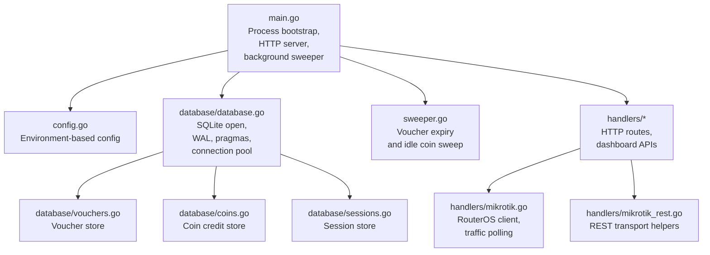
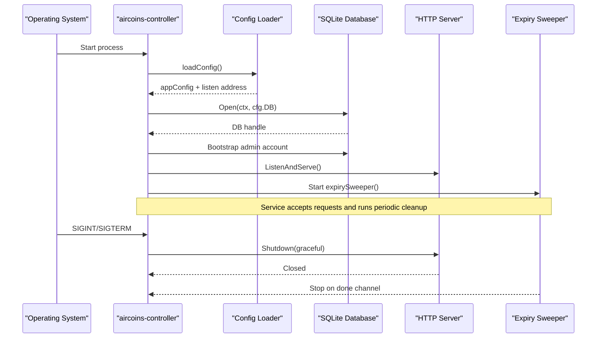
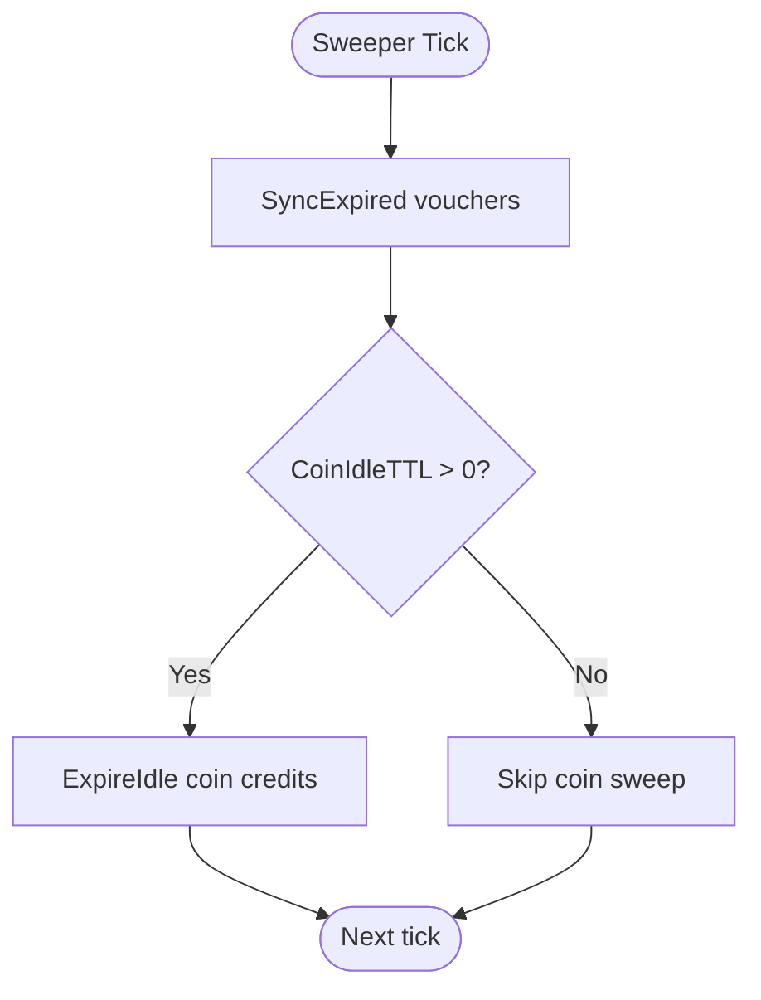
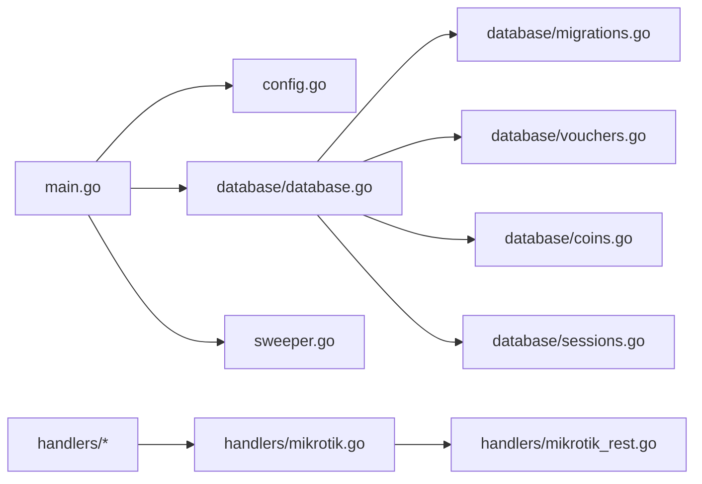

# Monitoring & Maintenance

<cite>
**Referenced Files in This Document**   
- [main.go](file://main.go)
- [sweeper.go](file://sweeper.go)
- [config.go](file://config.go)
- [database/database.go](file://database/database.go)
- [database/migrations.go](file://database/migrations.go)
- [database/vouchers.go](file://database/vouchers.go)
- [database/coins.go](file://database/coins.go)
- [database/sessions.go](file://database/sessions.go)
- [handlers/api.go](file://handlers/api.go)
- [handlers/mikrotik.go](file://handlers/mikrotik.go)
- [handlers/mikrotik_rest.go](file://handlers/mikrotik_rest.go)
- [.gitignore](file://.gitignore)
</cite>

## Table of Contents
1. [Introduction](#introduction)
2. [Project Structure](#project-structure)
3. [Core Components](#core-components)
4. [Architecture Overview](#architecture-overview)
5. [Detailed Component Analysis](#detailed-component-analysis)
6. [Dependency Analysis](#dependency-analysis)
7. [Performance Considerations](#performance-considerations)
8. [Troubleshooting Guide](#troubleshooting-guide)
9. [Conclusion](#conclusion)
10. [Appendices](#appendices)

## Introduction
This document provides operational monitoring and maintenance guidance for the Aircoins Mikrotik Controller. It focuses on:
- Health and status signals exposed by the process and its database layer
- Metrics collection opportunities through existing dashboard endpoints
- Alerting strategies based on logs, session counts, voucher state, and coin credit behavior
- Background sweeper responsibilities for voucher expiry and idle coin balance cleanup
- Log analysis techniques, performance monitoring tools, and capacity planning
- Backup procedures for the SQLite database and secret key file
- Disaster recovery workflows and system update steps
- Operational runbooks for routine maintenance, incident response, and performance optimization

The controller is a single Go binary that starts an HTTP server, opens an encrypted SQLite database, seeds the operator account if needed, and runs periodic housekeeping tasks.

## Project Structure
The repository is organized into runtime entry points, configuration loading, HTTP handlers, database models, templates, and hardware integration code. The most relevant parts for monitoring and maintenance are:
- Application bootstrap and lifecycle management
- Configuration via environment variables
- Database initialization, connection pooling, and migrations
- Background sweeper for vouchers and coin credits
- API endpoints used by the dashboard to collect traffic and session data

**Diagram sources**
- [main.go:214-285](file://main.go#L214-L285)
- [config.go:20-77](file://config.go#L20-L77)
- [database/database.go:70-115](file://database/database.go#L70-L115)
- [sweeper.go:11-52](file://sweeper.go#L11-L52)
- [handlers/mikrotik.go:847-876](file://handlers/mikrotik.go#L847-L876)
- [handlers/mikrotik_rest.go:171-187](file://handlers/mikrotik_rest.go#L171-L187)

**Section sources**
- [main.go:1-57](file://main.go#L1-L57)
- [config.go:1-150](file://config.go#L1-L150)

## Core Components
The following components are central to monitoring and maintenance:

- **Application bootstrap**: Starts logging, loads configuration, opens the database, initializes templates, boots the admin account, creates the HTTP server, and launches the background sweeper.
- **Configuration loader**: Reads environment variables such as `ADDR`, `DB_PATH`, `SECRET_KEY_PATH`, `API_TIMEOUT`, `ADMIN_SESSION_TTL`, and coin slot settings.
- **Database layer**: Opens SQLite with WAL mode, sets busy timeout and connection pool limits, applies schema migrations, and exposes stores for vouchers, coins, sessions, routers, rates, and admin users.
- **Background sweeper**: Runs every five minutes to mark expired vouchers and release idle coin balances when configured.
- **Dashboard and API handlers**: Provide router inventory, session listing, traffic graphs, voucher management, rate configuration, and device connectivity status.

Key operational implications:
- The process writes structured text logs to standard output using `log/slog`.
- The database uses WAL mode and a small connection pool tuned for SQLite concurrency characteristics.
- Session and voucher state are persisted and can be queried from the dashboard or database directly.
- Coin credit behavior is important for piso Wi-Fi deployments where unspent balances must not leak between customers.

**Section sources**
- [main.go:214-285](file://main.go#L214-L285)
- [config.go:20-77](file://config.go#L20-L77)
- [database/database.go:39-115](file://database/database.go#L39-L115)
- [sweeper.go:11-52](file://sweeper.go#L11-L52)

## Architecture Overview
At runtime, the controller performs these operations:
1. Parse command-line arguments for version and password reset.
2. Load environment-based configuration.
3. Open the SQLite database and apply migrations.
4. Bootstrap the panel operator account if none exists.
5. Create HTTP handlers and start the server.
6. Start the expiry sweeper goroutine.
7. Handle graceful shutdown on SIGINT/SIGTERM.

**Diagram sources**
- [main.go:36-57](file://main.go#L36-L57)
- [main.go:214-285](file://main.go#L214-L285)
- [sweeper.go:19-52](file://sweeper.go#L19-L52)

## Detailed Component Analysis

### Health Check Endpoints and Status Signals
The controller does not expose a dedicated `/health` endpoint. Operators should use the following signals:

- **Process-level health**:
  - The service logs a startup message including the listening address, portal name, and version.
  - A successful startup means the HTTP server is accepting connections.
  - Graceful shutdown is triggered by SIGINT or SIGTERM.

- **Database health**:
  - On startup, the database connection is pinged; failure indicates an unwritable path or corrupted file.
  - Migrations run automatically; migration failures prevent the server from starting.

- **Router connectivity health**:
  - Each router record stores `last_transport`, `last_status`, `last_error`, `last_latency_ms`, and `last_seen_at`.
  - These fields are updated when the controller interacts with RouterOS devices.

- **Session health**:
  - The session store provides open session counts per router and total open sessions.
  - Dashboard pages render active sessions and allow operators to close them.

Recommended external checks:
- TCP port check against `ADDR`.
- Optional HTTP probe against a known safe route if one is added later.
- Periodic query of router last seen timestamps and latency.
- Count of open sessions exceeding expected thresholds.

**Section sources**
- [main.go:262-284](file://main.go#L262-L284)
- [database/database.go:105-115](file://database/database.go#L105-L115)
- [database/migrations.go:15-42](file://database/migrations.go#L15-L42)
- [database/sessions.go:339-375](file://database/sessions.go#L339-L375)

### Metrics Collection
The controller relies on the dashboard and RouterOS telemetry rather than exporting Prometheus metrics directly. Available data sources include:

- **Interface traffic history**:
  - The handler collects interface traffic points and keeps up to 60 points for graphing.
  - Points include timestamp, RX/TX bytes, and RX/TX rates.

- **Router status fields**:
  - Last transport, status, error, latency, and last seen time are stored per router.

- **Session counters**:
  - Total open sessions and per-router open session counts.

- **Voucher statistics**:
  - Totals by status, pushed count, billed cents, and face value cents.

- **Coin credit ledger**:
  - Active balances, pulses, amount cents, granted seconds, used seconds, and expiration state.

Operational recommendation:
- Use the dashboard’s live traffic graphs and session views for near-real-time monitoring.
- Export router status and session counts periodically by querying the database if centralized metrics are required.
- If Prometheus-style metrics are needed, add a metrics endpoint that reads from the same stores used by the dashboard.

**Section sources**
- [handlers/mikrotik.go:847-876](file://handlers/mikrotik.go#L847-L876)
- [handlers/api.go:152-186](file://handlers/api.go#L152-L186)
- [database/vouchers.go:578-645](file://database/vouchers.go#L578-L645)
- [database/coins.go:41-79](file://database/coins.go#L41-L79)

### Alerting Strategies
Alerts should be based on observable operational signals:

- **Service availability**:
  - Alert if the listening port is unreachable.
  - Alert if the process exits unexpectedly.

- **Database integrity**:
  - Alert on startup failure due to database open or ping errors.
  - Alert if migrations fail.

- **Router connectivity**:
  - Alert if `last_seen_at` stops advancing beyond a threshold.
  - Alert if `last_error` contains authentication or permission errors.
  - Alert if `last_latency_ms` exceeds acceptable bounds.

- **Session anomalies**:
  - Alert if open session count grows beyond expected capacity.
  - Alert if many sessions end with unexpected reasons.

- **Voucher anomalies**:
  - Alert if expired vouchers accumulate without being cleaned.
  - Alert if disabled vouchers are created unintentionally.

- **Coin credit anomalies**:
  - Alert if idle coin credits remain active past the configured idle TTL.
  - Alert if duplicate pulse events indicate retry storms or misconfigured nodes.

**Section sources**
- [main.go:262-284](file://main.go#L262-L284)
- [database/database.go:105-115](file://database/database.go#L105-L115)
- [database/sessions.go:339-375](file://database/sessions.go#L339-L375)
- [database/vouchers.go:561-576](file://database/vouchers.go#L561-L576)
- [database/coins.go:321-348](file://database/coins.go#L321-L348)

### Background Sweeper Processes
The expiry sweeper runs continuously and performs two cleanup passes:

1. **Voucher expiry sweep**:
   - Runs every five minutes.
   - Marks unused and active vouchers as expired when their validity window has passed.
   - Ensures the dashboard shows honest voucher states even when the controller is idle.

2. **Idle coin credit sweep**:
   - Runs only when coin idle TTL is configured.
   - Releases balances that were topped up but never connected within the idle window.
   - Prevents a customer who walks away from a coin slot from leaving a balance that the next user inherits.

**Diagram sources**
- [sweeper.go:19-52](file://sweeper.go#L19-L52)
- [database/vouchers.go:561-576](file://database/vouchers.go#L561-L576)
- [database/coins.go:321-348](file://database/coins.go#L321-L348)

**Section sources**
- [sweeper.go:11-52](file://sweeper.go#L11-L52)
- [database/vouchers.go:561-576](file://database/vouchers.go#L561-L576)
- [database/coins.go:321-348](file://database/coins.go#L321-L348)

### Log Analysis Techniques
The application uses structured logging via `log/slog`. Logs include:
- Startup information: listening address, portal name, version.
- Generated initial admin password warnings.
- Database operation errors wrapped with context.
- Sweeper results: number of expired vouchers or released coin credits.
- Router transport and error messages.

Recommended log analysis practices:
- Monitor stdout for startup and shutdown messages.
- Search for error keywords such as `failed`, `error`, `permission`, `authentication`, `listen`.
- Track sweeper logs to confirm voucher and coin cleanup is running.
- Correlate router errors with `last_error` and `last_status` fields.
- Use structured log fields like `addr`, `portal`, `version`, `expired`, `released` for filtering.

**Section sources**
- [main.go:262-284](file://main.go#L262-L284)
- [main.go:320-325](file://main.go#L320-L325)
- [sweeper.go:29-46](file://sweeper.go#L29-L46)

### Performance Monitoring Tools
Built-in performance indicators:
- **HTTP server timeouts**: Read header, read, write, and idle timeouts are configured.
- **Router API retries**: Commands may retry once after a dropped connection with a short delay.
- **Traffic graph window**: Up to 60 points are retained for interface traffic graphs.
- **Database pragmas**: WAL mode, synchronous NORMAL, foreign keys enabled, busy timeout set.
- **Connection pool**: Small pool size suitable for SQLite writers.

Operational recommendations:
- Monitor HTTP request latency and error rates at the reverse proxy or load balancer.
- Watch RouterOS API latency and error rates.
- Monitor SQLite disk I/O and WAL file growth.
- Use dashboard traffic graphs to detect interface saturation.
- Add application-level metrics if deeper observability is required.

**Section sources**
- [main.go:246-253](file://main.go#L246-L253)
- [handlers/mikrotik.go:151-158](file://handlers/mikrotik.go#L151-L158)
- [handlers/mikrotik.go:847-876](file://handlers/mikrotik.go#L847-L876)
- [database/database.go:118-129](file://database/database.go#L118-L129)

### Capacity Planning Guidelines
Capacity planning should consider:
- **SQLite constraints**:
  - Writers are serialized; keep connection pool small.
  - WAL mode improves concurrent readers.
  - Database file and WAL files must fit on disk with headroom.

- **Session volume**:
  - Active sessions are tracked per router.
  - High session counts increase dashboard query load and memory usage.

- **Voucher volume**:
  - Large voucher batches require batch insert handling and audit retention policies.

- **Coin credit volume**:
  - Idle TTL prevents balance leakage but requires timely sweeps.
  - Pulse deduplication protects against double crediting.

- **Router fleet size**:
  - More routers mean more API calls, latency probes, and status updates.

Guidelines:
- Size disk for database, WAL, logs, and backups.
- Set idle TTL and max session minutes according to business rules.
- Limit dashboard polling frequency to avoid overwhelming routers.
- Monitor open session counts and voucher accumulation.

**Section sources**
- [database/database.go:39-59](file://database/database.go#L39-L59)
- [database/sessions.go:339-375](file://database/sessions.go#L339-L375)
- [database/vouchers.go:224-277](file://database/vouchers.go#L224-L277)
- [database/coins.go:321-348](file://database/coins.go#L321-L348)
- [config.go:59-67](file://config.go#L59-L67)

## Dependency Analysis
The main dependencies for monitoring and maintenance are:

**Diagram sources**
- [main.go:214-285](file://main.go#L214-L285)
- [config.go:20-77](file://config.go#L20-L77)
- [database/database.go:70-115](file://database/database.go#L70-L115)
- [database/migrations.go:15-42](file://database/migrations.go#L15-L42)
- [database/vouchers.go:197-277](file://database/vouchers.go#L197-L277)
- [database/coins.go:120-223](file://database/coins.go#L120-L223)
- [database/sessions.go:78-178](file://database/sessions.go#L78-L178)
- [handlers/mikrotik.go:160-278](file://handlers/mikrotik.go#L160-L278)
- [handlers/mikrotik_rest.go:171-187](file://handlers/mikrotik_rest.go#L171-L187)

**Section sources**
- [main.go:214-285](file://main.go#L214-L285)
- [database/database.go:70-115](file://database/database.go#L70-L115)

## Performance Considerations
- Keep HTTP timeouts aligned with expected RouterOS API latency.
- Avoid excessive dashboard polling intervals.
- Use the built-in traffic history window instead of storing large historical datasets in the controller.
- Monitor SQLite WAL growth and rotate logs appropriately.
- Tune `API_TIMEOUT`, `ADMIN_SESSION_TTL`, and coin idle TTL based on deployment needs.
- Avoid increasing SQLite connection pool unnecessarily; it can degrade performance under writer contention.

[No sources needed since this section provides general guidance]

## Troubleshooting Guide
Common operational issues and responses:

- **Cannot bind privileged port**:
  - Default `ADDR=:80` requires elevated privileges.
  - Use `ADDR=:8080` or configure capability binding as documented.

- **Database cannot be opened**:
  - Check file path permissions and directory creation.
  - Verify SQLite file is writable and not locked by another process.

- **Admin account not accessible**:
  - Use the `passwd` subcommand to generate or reset the operator password.
  - Existing accounts are not overwritten by bootstrap credentials.

- **Router API errors**:
  - Check `last_error`, `last_status`, and `last_transport`.
  - Validate credentials, TLS settings, and transport mode.

- **Vouchers appear stale**:
  - Confirm the sweeper is running.
  - Check voucher expiry logic and validity windows.

- **Coin credits not expiring**:
  - Verify `COIN_IDLE_TTL` is configured.
  - Check sweeper logs for coin credit sweep results.

**Section sources**
- [main.go:340-348](file://main.go#L340-L348)
- [main.go:82-191](file://main.go#L82-L191)
- [database/database.go:70-115](file://database/database.go#L70-L115)
- [sweeper.go:29-46](file://sweeper.go#L29-L46)

## Conclusion
The Aircoins Mikrotik Controller provides a compact, environment-driven service with built-in logging, SQLite-backed persistence, and periodic cleanup tasks. While it does not expose a dedicated health endpoint, operators can monitor process availability, database readiness, router connectivity, session counts, and sweeper activity. For production environments, supplement these signals with external health checks, centralized logging, and optional metrics export. Backups, disaster recovery, and update procedures should treat the database file and secret key as sensitive runtime artifacts.

[No sources needed since this section summarizes without analyzing specific files]

## Appendices

### Backup Procedures
Back up the following runtime artifacts regularly:
- SQLite database file at `DB_PATH`.
- SQLite WAL and shared-memory files (`*.db-wal`, `*.db-shm`).
- Secret key file at `SECRET_KEY_PATH`.
- Operator-generated initial password logs if needed for recovery.

Important notes:
- Do not commit database files or secret keys to version control.
- Ensure backups are encrypted and access-controlled.
- Test restore procedures periodically.

**Section sources**
- [.gitignore:8-15](file://.gitignore#L8-L15)
- [database/database.go:70-115](file://database/database.go#L70-L115)

### Disaster Recovery Workflow
1. Stop the controller service.
2. Restore the database file and WAL files from backup.
3. Restore the secret key file if missing or rotated incorrectly.
4. Verify database permissions and ownership.
5. Start the controller and check startup logs.
6. Validate router connectivity and session state.
7. Reset the admin password if necessary using the `passwd` subcommand.

**Section sources**
- [main.go:82-191](file://main.go#L82-L191)
- [database/database.go:70-115](file://database/database.go#L70-L115)

### System Updates
1. Build or obtain the new binary.
2. Stop the service gracefully.
3. Back up the database and secret key.
4. Replace the binary.
5. Start the service and verify migrations applied successfully.
6. Check router connectivity and dashboard functionality.
7. Monitor sweeper logs for voucher and coin cleanup.

**Section sources**
- [main.go:36-57](file://main.go#L36-L57)
- [database/database.go:111-115](file://database/database.go#L111-L115)
- [sweeper.go:29-46](file://sweeper.go#L29-L46)

### Operational Runbooks

#### Routine Maintenance Tasks
- Review router last seen timestamps and latency.
- Inspect open session counts and close stale sessions if needed.
- Verify voucher status distribution and expired voucher cleanup.
- Check coin credit idle balances and ensure idle TTL is appropriate.
- Rotate logs and monitor disk usage.

**Section sources**
- [database/sessions.go:339-375](file://database/sessions.go#L339-L375)
- [database/vouchers.go:561-576](file://database/vouchers.go#L561-L576)
- [database/coins.go:321-348](file://database/coins.go#L321-L348)

#### Incident Response Procedures
- Confirm service availability via port check and process status.
- Inspect startup and sweeper logs for errors.
- Validate database connectivity and migration status.
- Check router credentials and transport configuration.
- Isolate problematic routers if they cause repeated failures.
- Reset admin credentials if operator lockout occurs.

**Section sources**
- [main.go:262-284](file://main.go#L262-L284)
- [database/database.go:105-115](file://database/database.go#L105-L115)
- [main.go:82-191](file://main.go#L82-L191)

#### Performance Optimization Strategies
- Adjust HTTP timeouts and dashboard polling intervals.
- Reduce unnecessary RouterOS API calls.
- Monitor SQLite WAL growth and disk I/O.
- Tune coin idle TTL and max session minutes.
- Add application-level metrics if current dashboard data is insufficient.

**Section sources**
- [main.go:246-253](file://main.go#L246-L253)
- [handlers/mikrotik.go:847-876](file://handlers/mikrotik.go#L847-L876)
- [config.go:59-67](file://config.go#L59-L67)