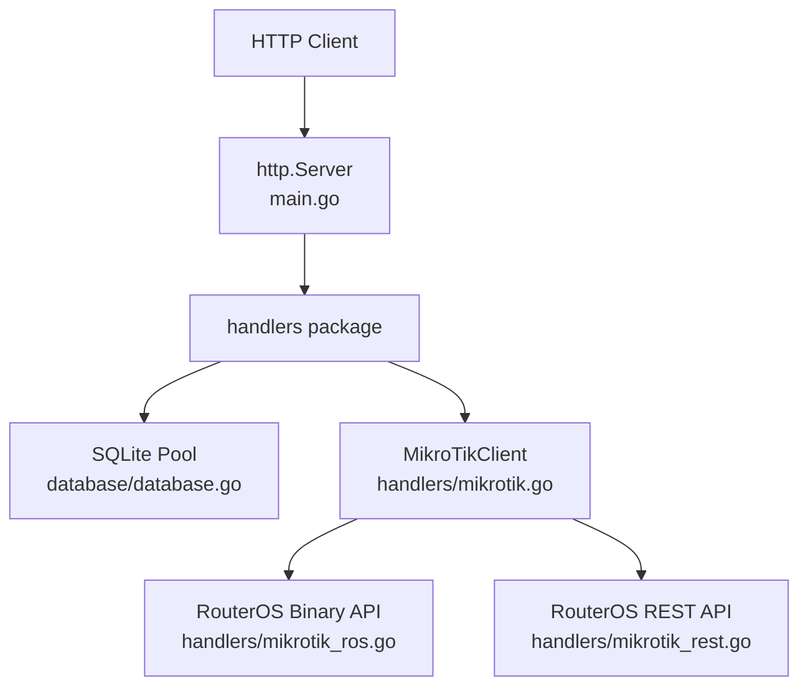
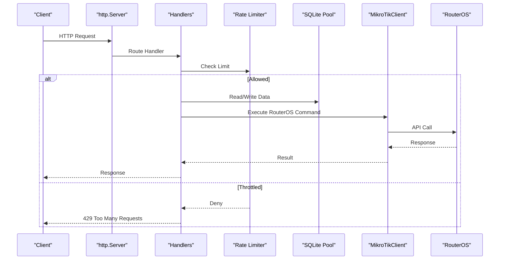
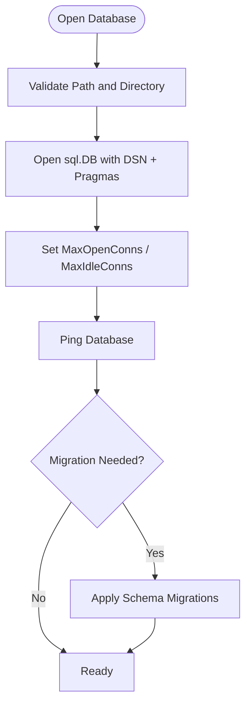
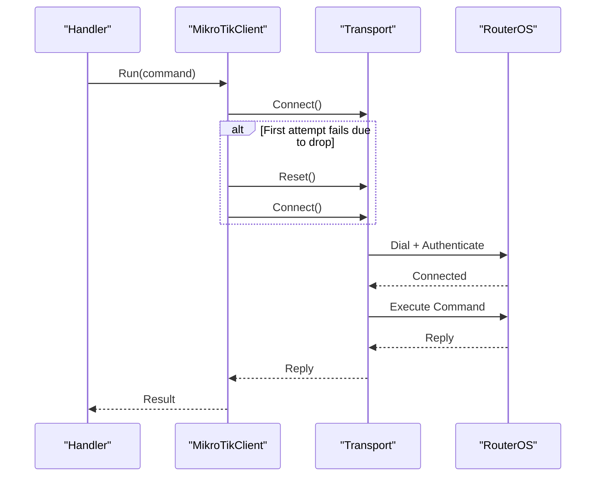
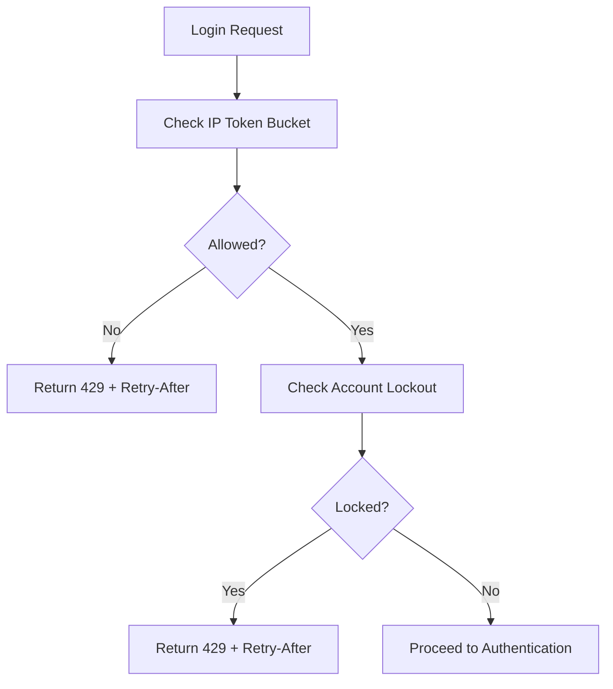
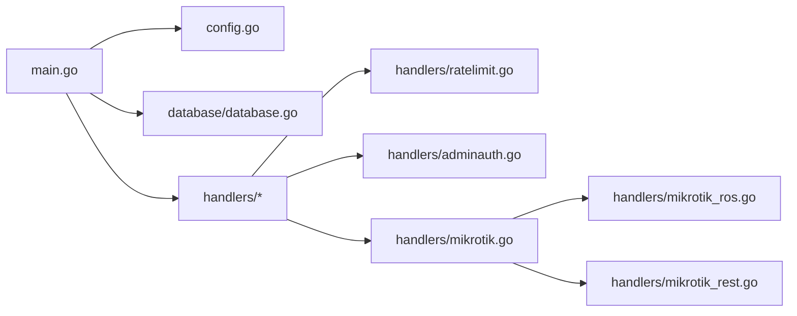

# Performance & Scaling

<cite>
**Referenced Files in This Document**
- [main.go](file://main.go)
- [config.go](file://config.go)
- [database/database.go](file://database/database.go)
- [handlers/ratelimit.go](file://handlers/ratelimit.go)
- [handlers/adminauth.go](file://handlers/adminauth.go)
- [handlers/mikrotik.go](file://handlers/mikrotik.go)
- [handlers/mikrotik_ros.go](file://handlers/mikrotik_ros.go)
- [handlers/mikrotik_rest.go](file://handlers/mikrotik_rest.go)
- [README.md](file://README.md)
</cite>

## Table of Contents
1. [Introduction](#introduction)
2. [Project Structure](#project-structure)
3. [Core Components](#core-components)
4. [Architecture Overview](#architecture-overview)
5. [Detailed Component Analysis](#detailed-component-analysis)
6. [Dependency Analysis](#dependency-analysis)
7. [Performance Considerations](#performance-considerations)
8. [Troubleshooting Guide](#troubleshooting-guide)
9. [Conclusion](#conclusion)

## Introduction
This document explains how the Aircoins MikroTik Controller performs under load and how to tune it for production. It focuses on:
- Resource requirements, memory usage patterns, and CPU characteristics.
- SQLite database optimization, connection pooling, and query behavior.
- MikroTik API rate limiting, connection management, and retry mechanisms.
- Horizontal scaling, load balancing, and high availability considerations.
- Benchmarking, profiling, bottleneck identification, caching strategies, memory tuning, and garbage collection guidance.

The controller is a single-process Go HTTP server backed by an in-process SQLite database with a pure-Go driver. External dependencies are limited to RouterOS devices via the binary API or REST API.

## Project Structure
At runtime, the process owns:
- One embedded HTTP server handling captive portal, admin panel, and API routes.
- One SQLite database handle with a small connection pool.
- Per-router MikroTik clients that maintain long-lived connections (binary API) or stateless REST calls.
- In-memory rate limiters for login protection and portal throttling.

**Diagram sources**
- [main.go:246-253](file://main.go#L246-L253)
- [database/database.go:95-103](file://database/database.go#L95-L103)
- [handlers/mikrotik.go:160-181](file://handlers/mikrotik.go#L160-L181)
- [handlers/mikrotik_ros.go:1-31](file://handlers/mikrotik_ros.go#L1-L31)
- [handlers/mikrotik_rest.go:171-205](file://handlers/mikrotik_rest.go#L171-L205)

**Section sources**
- [main.go:36-57](file://main.go#L36-L57)
- [README.md:197-205](file://README.md#L197-L205)

## Core Components
- HTTP server lifecycle and timeouts are configured at startup.
- Database initialization sets SQLite pragmas and connection pool limits.
- Rate limiting protects both the captive portal and admin login endpoints.
- MikroTik client manages transport selection, retries, and connection reuse.

Key configuration knobs include listen address, database path, API timeout, secure cookies, session TTL, and coin-slot parameters.

**Section sources**
- [main.go:246-253](file://main.go#L246-L253)
- [config.go:20-77](file://config.go#L20-L77)
- [database/database.go:30-60](file://database/database.go#L30-L60)
- [handlers/ratelimit.go:10-40](file://handlers/ratelimit.go#L10-L40)
- [handlers/adminauth.go:18-68](file://handlers/adminauth.go#L18-L68)
- [handlers/mikrotik.go:151-158](file://handlers/mikrotik.go#L151-L158)

## Architecture Overview
The system follows a layered request flow:
- Requests enter the HTTP server and are routed through handlers.
- Handlers perform validation, apply rate limits, and render templates or JSON.
- Persistent data goes through the SQLite layer with WAL mode and bounded concurrency.
- Device operations go through a per-router MikroTik client that selects the best transport and serializes commands.

**Diagram sources**
- [main.go:246-253](file://main.go#L246-L253)
- [handlers/ratelimit.go:89-103](file://handlers/ratelimit.go#L89-L103)
- [database/database.go:95-103](file://database/database.go#L95-L103)
- [handlers/mikrotik.go:186-240](file://handlers/mikrotik.go#L186-L240)

## Detailed Component Analysis

### HTTP Server and Timeouts
The server configures read/write/idle timeouts and graceful shutdown. These values bound request processing time and help prevent resource exhaustion under load.

- Read header timeout: short enough to reject slowloris-style attacks.
- Read/write timeouts: cap request body parsing and response generation.
- Idle timeout: controls keep-alive duration for pooled connections.
- Graceful shutdown: stops accepting new requests and drains in-flight work within a bounded window.

Recommendations:
- Keep timeouts conservative when calling MikroTik devices; device latency can dominate total request time.
- Monitor active goroutines and open connections during load tests to detect leaks or saturation.

**Section sources**
- [main.go:246-253](file://main.go#L246-L253)
- [main.go:279-284](file://main.go#L279-L284)

### Database Optimization and Connection Pooling
The database uses modernc.org/sqlite with:
- WAL journal mode for concurrent readers.
- Foreign keys enabled.
- Busy timeout to avoid immediate lock contention.
- A small connection pool sized to SQLite’s writer serialization model.

Connection pool settings:
- MaxOpenConns equals MaxIdleConns to avoid idle connection churn.
- ConnMaxLifetime is disabled to let SQLite manage file handles.
- Pragmas are applied per connection via the DSN.

**Diagram sources**
- [database/database.go:70-116](file://database/database.go#L70-L116)
- [database/database.go:118-133](file://database/database.go#L118-L133)

Tuning guidance:
- Keep MaxOpenConns small (default is sufficient). Increasing it does not improve throughput because SQLite serializes writers.
- Tune BusyTimeout based on write contention observed under load.
- Prefer WAL mode (already enabled) for mixed read/write workloads.
- Avoid excessive concurrent transactions; batch writes where possible.

**Section sources**
- [database/database.go:30-60](file://database/database.go#L30-L60)
- [database/database.go:95-103](file://database/database.go#L95-L103)
- [database/database.go:118-133](file://database/database.go#L118-L133)

### MikroTik API Rate Limiting, Connection Management, and Retries
Per-device command execution uses a reconnecting client:
- Commands are serialized over a single connection per router.
- Transport selection tries secure options first, then falls back according to configuration.
- On dropped connections, one retry is attempted after a short delay.
- Context deadlines propagate to dial and command execution.

**Diagram sources**
- [handlers/mikrotik.go:151-158](file://handlers/mikrotik.go#L151-L158)
- [handlers/mikrotik.go:186-240](file://handlers/mikrotik.go#L186-L240)
- [handlers/mikrotik.go:413-460](file://handlers/mikrotik.go#L413-L460)
- [handlers/mikrotik_ros.go:25-31](file://handlers/mikrotik_ros.go#L25-L31)

Operational notes:
- API_TIMEOUT controls per-call device latency budget.
- Auto transport probing caps individual attempts to avoid page stalls.
- TLS verification is optional per router; enable verification in production where possible.

**Section sources**
- [handlers/mikrotik.go:151-158](file://handlers/mikrotik.go#L151-L158)
- [handlers/mikrotik.go:268-270](file://handlers/mikrotik.go#L268-L270)
- [handlers/mikrotik.go:413-460](file://handlers/mikrotik.go#L413-L460)

### Rate Limiting and Brute-Force Protection
Two layers protect authentication and portal endpoints:
- IP-based token bucket limiter for portal login attempts.
- Admin login guard combining per-IP throttling and per-account lockout with exponential backoff.

Behavior:
- Portal throttle returns 429 with Retry-After.
- Admin login guard enforces per-IP attempts and escalating account lockout durations.
- Counters are in-memory; restarts clear them.

**Diagram sources**
- [handlers/ratelimit.go:42-73](file://handlers/ratelimit.go#L42-L73)
- [handlers/ratelimit.go:89-103](file://handlers/ratelimit.go#L89-L103)
- [handlers/adminauth.go:57-92](file://handlers/adminauth.go#L57-L92)
- [handlers/adminauth.go:94-127](file://handlers/adminauth.go#L94-L127)

**Section sources**
- [handlers/ratelimit.go:10-40](file://handlers/ratelimit.go#L10-L40)
- [handlers/ratelimit.go:89-103](file://handlers/ratelimit.go#L89-L103)
- [handlers/adminauth.go:18-68](file://handlers/adminauth.go#L18-L68)
- [handlers/adminauth.go:164-179](file://handlers/adminauth.go#L164-L179)

### Memory Usage Patterns and CPU Characteristics
Memory:
- The process holds one SQLite database handle and a small connection pool.
- Templates are embedded and parsed once at startup.
- Rate limiters and login guards use in-memory maps and buckets keyed by IP/account.
- Per-router MikroTik clients hold one live connection (binary API) plus minimal state.

CPU:
- Most CPU time will be spent in template rendering, SQL queries, and network I/O to RouterOS devices.
- SQLite is single-writer; heavy write bursts may contend even with WAL.
- RouterOS API calls are I/O-bound and dominated by device latency.

Garbage collection:
- No explicit GC tuning is present in the codebase.
- For very large dashboards or traffic graphs, consider reducing per-request allocations and reusing buffers.

[No sources needed since this section provides general guidance]

### Caching Strategies
Observed caching behavior:
- Interface traffic history is kept in-memory for up to 60 points per interface.
- No application-level cache exists for routers, sessions, vouchers, or rates.

Recommendations:
- Cache frequently read, rarely changing data such as router inventory and rate tiers behind a short TTL.
- Use process-local caches with size limits and expiration to reduce SQLite reads.
- Avoid caching volatile hotspot session lists unless refreshed from authoritative device state.

**Section sources**
- [handlers/mikrotik.go:847-876](file://handlers/mikrotik.go#L847-L876)

### Horizontal Scaling and High Availability
Current design:
- Single process with in-process SQLite and in-memory rate limiters.
- Not horizontally scalable out of the box.

Scaling approaches:
- Stateless frontends: place multiple controllers behind a reverse proxy if you move persistence off-host.
- Shared persistence: replace SQLite with a shared database and externalize rate limiting to a distributed store.
- Process-per-router: run multiple controller processes, each managing a subset of routers, behind a load balancer.
- High availability: deploy multiple instances with health checks and failover; ensure shared state (sessions, rate limits) is externalized.

[No sources needed since this section provides general guidance]

### Load Balancing Strategies
- Reverse proxy can distribute HTTP requests across replicas.
- Sticky sessions may be required if using in-process sessions; otherwise, externalize sessions.
- Health probes should validate both HTTP endpoints and database connectivity.

[No sources needed since this section provides general guidance]

### Benchmarking Guidelines
- Measure end-to-end latency for captive portal, admin panel, and API endpoints.
- Isolate device-bound paths by mocking RouterOS responses.
- Profile SQLite contention by varying write concurrency and measuring wait times.
- Track goroutine count, heap size, and GC pauses under sustained load.

[No sources needed since this section provides general guidance]

### Performance Profiling Techniques
- Use Go pprof to capture CPU and memory profiles during load tests.
- Focus on hotspots in template rendering, SQL execution, and RouterOS API calls.
- Correlate pprof samples with request traces to identify slow handlers.

[No sources needed since this section provides general guidance]

### Bottleneck Identification Methods
- Database: monitor SQLite busy waits and WAL activity; check for write contention.
- Network: measure RouterOS API latency and failure rates; watch for frequent reconnects.
- Application: inspect handler latencies and error rates; look for excessive allocations.
- System: track CPU, memory, file descriptors, and disk I/O.

[No sources needed since this section provides general guidance]

## Dependency Analysis
The main runtime dependencies are:
- net/http server.
- modernc.org/sqlite driver.
- RouterOS client libraries for binary and REST transports.

**Diagram sources**
- [main.go:26-28](file://main.go#L26-L28)
- [config.go:3-12](file://config.go#L3-L12)
- [handlers/ratelimit.go:1-8](file://handlers/ratelimit.go#L1-L8)
- [handlers/adminauth.go:1-10](file://handlers/adminauth.go#L1-L10)
- [handlers/mikrotik.go:1-10](file://handlers/mikrotik.go#L1-L10)
- [handlers/mikrotik_ros.go:1-8](file://handlers/mikrotik_ros.go#L1-L8)
- [handlers/mikrotik_rest.go:1-10](file://handlers/mikrotik_rest.go#L1-L10)

**Section sources**
- [main.go:26-28](file://main.go#L26-L28)
- [config.go:3-12](file://config.go#L3-L12)

## Performance Considerations
- Keep SQLite MaxOpenConns small; increasing it does not improve throughput.
- Tune BusyTimeout based on observed write contention.
- Use WAL mode (enabled) and avoid long-running transactions.
- Bound all external calls with context deadlines; device latency dominates.
- Reuse RouterOS connections where supported; avoid unnecessary reconnects.
- Minimize template allocations and avoid large in-memory payloads.
- Enable secure cookies only behind TLS.

**Section sources**
- [database/database.go:30-60](file://database/database.go#L30-L60)
- [database/database.go:95-103](file://database/database.go#L95-L103)
- [handlers/mikrotik.go:151-158](file://handlers/mikrotik.go#L151-L158)
- [README.md:139-140](file://README.md#L139-L140)

## Troubleshooting Guide
Common issues and diagnostics:
- Port binding errors: privileged ports require capabilities or root.
- Database ping failures: verify file permissions and writability.
- Excessive 429 responses: review rate limiter thresholds and client retry behavior.
- Frequent RouterOS reconnects: check transport configuration, TLS settings, and device availability.
- Slow dashboard or API: profile handler latency and device call times.

Actionable steps:
- Inspect server logs for listen errors and database warnings.
- Validate ADDR, DB_PATH, SECRET_KEY_PATH, and API_TIMEOUT.
- Confirm RouterOS services are reachable on expected ports and credentials are correct.
- Reduce concurrent writes to SQLite and batch operations where possible.

**Section sources**
- [main.go:340-349](file://main.go#L340-L349)
- [database/database.go:105-110](file://database/database.go#L105-L110)
- [handlers/ratelimit.go:89-103](file://handlers/ratelimit.go#L89-L103)
- [handlers/adminauth.go:164-179](file://handlers/adminauth.go#L164-L179)
- [handlers/mikrotik.go:186-240](file://handlers/mikrotik.go#L186-L240)

## Conclusion
The controller is optimized for simplicity and reliability on a single host. Its performance hinges on SQLite concurrency limits, RouterOS API latency, and handler efficiency. Production tuning should focus on conservative timeouts, small SQLite pools, WAL mode, and careful monitoring of device connectivity. Horizontal scaling requires externalizing state and replacing SQLite with a shared backend. Rate limiting and brute-force protections are effective but in-memory; externalize them for multi-instance deployments.

[No sources needed since this section summarizes without analyzing specific files]