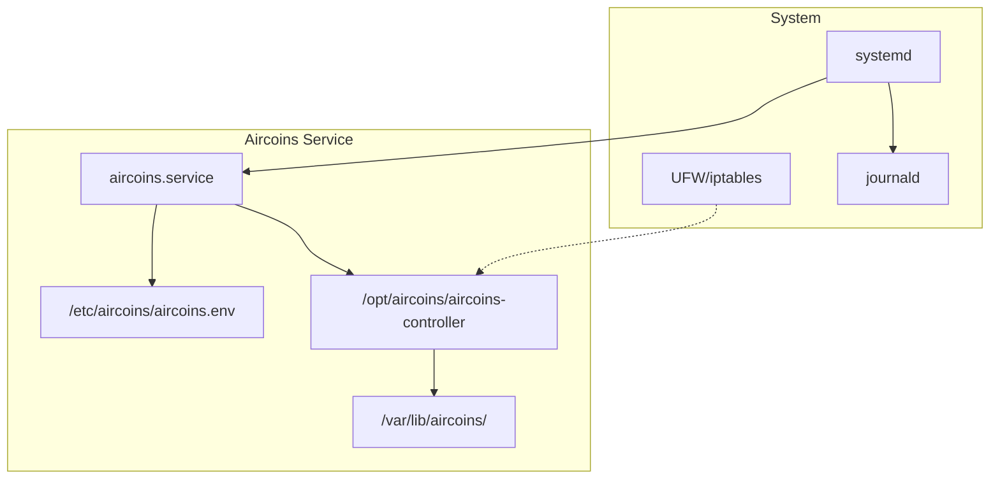
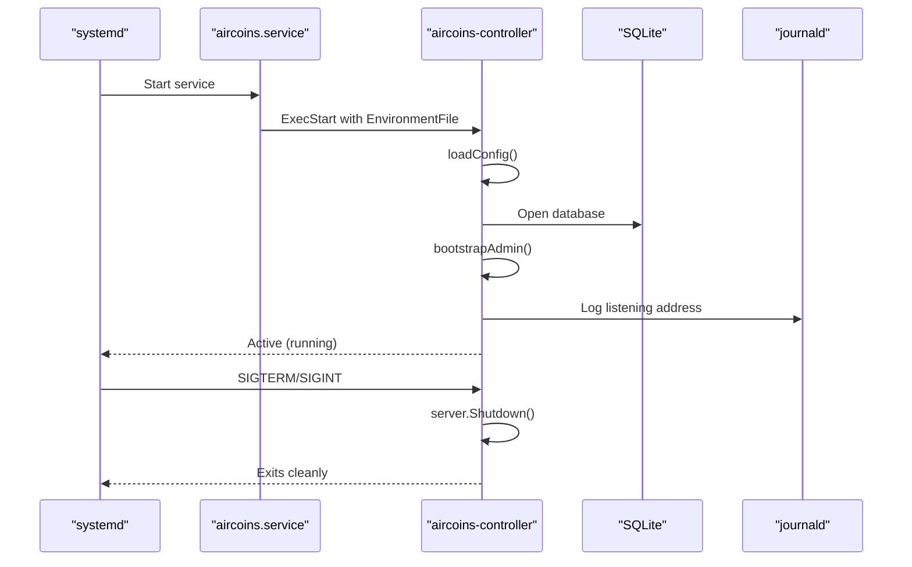
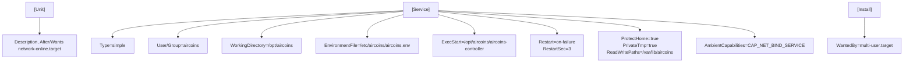
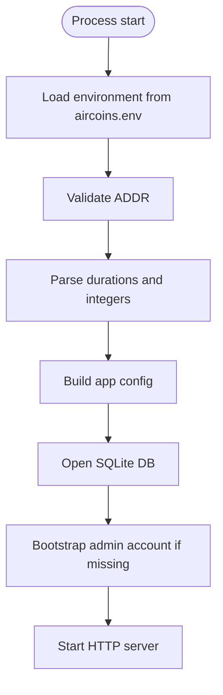
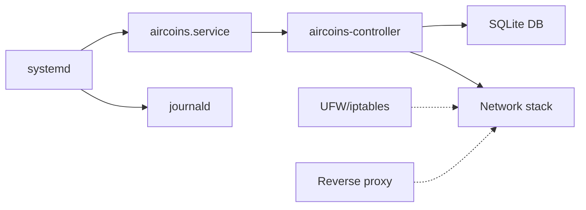

# Systemd Service Configuration

<cite>
**Referenced Files in This Document**
- [main.go](file://main.go)
- [config.go](file://config.go)
- [sweeper.go](file://sweeper.go)
- [install.sh](file://install.sh)
- [INSTALLATION.md](file://INSTALLATION.md)
- [README.md](file://README.md)
</cite>

## Table of Contents
1. [Introduction](#introduction)
2. [Project Structure](#project-structure)
3. [Core Components](#core-components)
4. [Architecture Overview](#architecture-overview)
5. [Detailed Component Analysis](#detailed-component-analysis)
6. [Dependency Analysis](#dependency-analysis)
7. [Performance Considerations](#performance-considerations)
8. [Troubleshooting Guide](#troubleshooting-guide)
9. [Conclusion](#conclusion)
10. [Appendices](#appendices)

## Introduction
This document explains how the Aircoins MikroTik Controller runs as a systemd service, including the generated unit file structure, environment configuration, security posture, and operational commands. It also covers logging through journald, log rotation considerations, performance monitoring integration points, and provides examples for custom deployments such as reverse proxying, non-privileged ports, and hardened isolation.

The application is designed to run unchanged under systemd using environment-based configuration. The installer creates a dedicated system user, installs a hardened unit, writes an environment file, opens the firewall, and performs a health check after start.

**Section sources**
- [main.go:1-8](file://main.go#L1-L8)
- [INSTALLATION.md:1-21](file://INSTALLATION.md#L1-L21)

## Project Structure
At runtime, the controller binary is managed by systemd. The installer generates the unit file and environment file, and places the binary and data directories at well-known locations.

**Diagram sources**
- [install.sh:385-419](file://install.sh#L385-L419)
- [INSTALLATION.md:101-105](file://INSTALLATION.md#L101-L105)

**Section sources**
- [install.sh:385-419](file://install.sh#L385-L419)
- [INSTALLATION.md:101-105](file://INSTALLATION.md#L101-L105)

## Core Components
- Service unit: Generated by the installer and installed at `/etc/systemd/system/aircoins.service`.
- Environment file: `/etc/aircoins/aircoins.env`, loaded via `EnvironmentFile`.
- Binary: `/opt/aircoins/aircoins-controller`.
- Data directory: `/var/lib/aircoins/` (SQLite database and secret key).
- Service user: Dedicated unprivileged user created by the installer.

Key behaviors:
- The process listens on an HTTP address configured by `ADDR` in the environment file.
- On first boot, it seeds an admin account if none exists.
- A background sweeper periodically expires vouchers and releases idle coin balances.
- The service logs to stdout/stderr, which journald captures automatically.

**Section sources**
- [main.go:214-285](file://main.go#L214-L285)
- [sweeper.go:11-52](file://sweeper.go#L11-L52)
- [INSTALLATION.md:101-105](file://INSTALLATION.md#L101-L105)

## Architecture Overview
The controller starts, loads configuration from the environment, initializes the database, boots the admin account if needed, and serves HTTP requests. It handles graceful shutdown on SIGINT/SIGTERM.

**Diagram sources**
- [main.go:214-285](file://main.go#L214-L285)
- [install.sh:385-419](file://install.sh#L385-L419)

## Detailed Component Analysis

### Systemd Unit File Structure
The installer writes a minimal but secure unit:
- Type: simple
- User/Group: dedicated service user
- WorkingDirectory: installation directory
- EnvironmentFile: path to `/etc/aircoins/aircoins.env`
- ExecStart: absolute path to the binary
- Restart policy: on-failure with a short restart delay
- Security hardening: ProtectHome, PrivateTmp, ReadWritePaths restricted to data directory
- Capability: AmbientCapabilities=CAP_NET_BIND_SERVICE to bind port 80 as an unprivileged user
- WantedBy: multi-user.target

Notes:
- `ProtectSystem=false` is used because the helper tool must write package files while the controller is idle.
- `NoNewPrivileges=false` allows the controlled sudo helper to escalate only for that specific task.

**Diagram sources**
- [install.sh:385-419](file://install.sh#L385-L419)

**Section sources**
- [install.sh:385-419](file://install.sh#L385-L419)

### Environment Variables and Configuration
The controller reads all runtime settings from the environment. The installer uses an environment file so secrets and options are not embedded in the unit.

Important variables:
- ADDR: Listen address (default :80). Can be host:port or bare port.
- DB_PATH: SQLite database path (default data/aircoins.db; installer uses /var/lib/aircoins/aircoins.db).
- SECRET_KEY_PATH: Path to the master encryption key (default data/secret.key; installer uses /var/lib/aircoins/secret.key).
- PORTAL_NAME, PORTAL_TAGLINE, PORTAL_SUPPORT: Portal branding and support text.
- ADMIN_PATH: Admin panel path (default /admin).
- DASHBOARD_AT_ROOT: Legacy layout toggle.
- ADMIN_USER, ADMIN_PASSWORD: Seed values for initial admin account creation only.
- DEFAULT_REDIRECT: Default redirect target for portal flows.
- SECURE_COOKIES: Enable secure cookies when behind TLS termination.
- API_TIMEOUT: Timeout for external API calls.
- COIN_NODE_TOKEN, COIN_SECONDS_PER_PULSE, COIN_CENTS_PER_PULSE, COIN_IDLE_TTL, COIN_MAX_SESSION_MINUTES: Piso Wi-Fi coin slot behavior.

Validation:
- ADDR is validated to accept ":port" or "host:port".
- Numeric and duration fields have safe defaults and warnings for invalid values.

**Diagram sources**
- [config.go:20-77](file://config.go#L20-L77)
- [main.go:214-285](file://main.go#L214-L285)

**Section sources**
- [config.go:20-77](file://config.go#L20-L77)
- [main.go:214-285](file://main.go#L214-L285)

### Resource Limits and Isolation
Current unit characteristics:
- No explicit CPU/Memory limits (no MemoryMax/CPUQuota).
- Filesystem isolation:
  - ProtectHome=true
  - PrivateTmp=true
  - ReadWritePaths limited to the data directory
- Capability bounding set is intentionally left unset to allow the sudo helper to acquire required capabilities.
- Ambient capability CAP_NET_BIND_SERVICE enables binding privileged port 80 without running as root.

Recommendations for production:
- Add MemoryMax and/or CPUQuota based on board capacity.
- Consider ReadOnlyPaths for the install directory if not needed at runtime.
- Keep ProtectSystem=false only if the helper requires filesystem writes; otherwise tighten further.

**Section sources**
- [install.sh:402-415](file://install.sh#L402-L415)
- [INSTALLATION.md:198-214](file://INSTALLATION.md#L198-L214)

### Service Management Commands
Common operations:
- Start: systemctl start aircoins
- Stop: systemctl stop aircoins
- Restart: systemctl restart aircoins
- Reload configuration: systemctl reload aircoins (if supported by the application; otherwise restart)
- Check status: systemctl status aircoins
- Enable on boot: systemctl enable aircoins
- Disable on boot: systemctl disable aircoins

The installer enables and restarts the service during setup and verifies it becomes active.

**Section sources**
- [install.sh:449-466](file://install.sh#L449-L466)

### Logging with journald
The application logs to stdout/stderr using Go’s structured logger. systemd forwards these streams to journald automatically.

Useful commands:
- Follow live logs: journalctl -u aircoins -f
- Show recent errors: journalctl -u aircoins -e
- Filter by priority: journalctl -u aircoins -p err..alert
- View full startup sequence: journalctl -u aircoins --since "10 min ago"

Log rotation:
- Managed by journald. Configure retention and size in /etc/systemd/journald.conf (e.g., SystemMaxSize, MaxRetentionSec).
- Avoid enabling persistent disk storage unless you need long-term audit trails; it can grow quickly.

Health endpoint:
- The installer probes http://<addr>/healthz to confirm readiness.

**Section sources**
- [main.go:214-285](file://main.go#L214-L285)
- [install.sh:481-502](file://install.sh#L481-L502)

### Performance Monitoring Integration
Integration points:
- Process metrics: Use systemd’s built-in metrics (systemd-cgtop, systemctl show) and cgroup stats for CPU/memory usage.
- Application metrics: Export Prometheus-compatible metrics from the application if implemented, and scrape them with node_exporter + prometheus.
- Network metrics: Monitor interface counters and MikroTik traffic via the controller’s router endpoints.
- Database metrics: Track SQLite WAL size and page cache usage; monitor disk I/O for /var/lib/aircoins.

Operational tips:
- Set appropriate timeouts (API_TIMEOUT) to avoid resource exhaustion under load.
- Tune HTTP server timeouts in the application if needed.
- Use Reverse Proxy buffering and timeouts if placing nginx/caddy in front.

[No sources needed since this section provides general guidance]

### Security Considerations
- Service user: Runs as a dedicated unprivileged user.
- Port binding: Uses AmbientCapabilities=CAP_NET_BIND_SERVICE to bind port 80 without root.
- Filesystem access: Only the data directory is writable at runtime.
- Privilege escalation: Controlled sudo helper is whitelisted for a single no-argument script.
- Network binding: Restrict ADDR to loopback when behind a reverse proxy.
- Cookies: Enable SECURE_COOKIES when terminating TLS at a proxy.

Recommended hardening:
- Bind to 127.0.0.1 when using a reverse proxy.
- Limit systemd sandboxing where possible (e.g., add ProtectSystem=strict with necessary ReadWritePaths).
- Rotate and protect the secret key file (mode 0600).
- Audit sudoers entries regularly.

**Section sources**
- [install.sh:402-415](file://install.sh#L402-L415)
- [INSTALLATION.md:198-214](file://INSTALLATION.md#L198-L214)
- [main.go:340-349](file://main.go#L340-L349)

### Custom Service Configurations

#### Example 1: Run on a non-privileged port
- Set ADDR=0.0.0.0:8080 in /etc/aircoins/aircoins.env.
- Restart the service.
- No AmbientCapabilities needed for port 8080.

**Section sources**
- [INSTALLATION.md:155-171](file://INSTALLATION.md#L155-L171)
- [config.go:69-76](file://config.go#L69-L76)

#### Example 2: Reverse proxy on port 80
- Set ADDR=127.0.0.1:8080 in /etc/aircoins/aircoins.env.
- Configure nginx or caddy to terminate TLS and proxy to 127.0.0.1:8080.
- Enable SECURE_COOKIES=1.

**Section sources**
- [INSTALLATION.md:236-258](file://INSTALLATION.md#L236-L258)

#### Example 3: Minimal inline unit (manual deployment)
A minimal unit can use inline Environment directives instead of EnvironmentFile. Ensure paths match your deployment.

- Type=simple
- User=aircoins
- WorkingDirectory=/opt/aircoins
- Environment=ADDR=:80
- Environment=DB_PATH=/var/lib/aircoins/aircoins.db
- Environment=SECRET_KEY_PATH=/var/lib/aircoins/secret.key
- Environment=PORTAL_NAME=Aircoins Hotspot
- AmbientCapabilities=CAP_NET_BIND_SERVICE
- ExecStart=/opt/aircoins/aircoins-controller
- Restart=on-failure

**Section sources**
- [README.md:150-165](file://README.md#L150-L165)

#### Example 4: Tighten filesystem isolation
If you do not need the helper to write packages at runtime:
- Set ProtectSystem=strict
- Add ReadWritePaths=/var/lib/aircoins
- Remove ProtectSystem=false

**Section sources**
- [install.sh:402-415](file://install.sh#L402-L415)

## Dependency Analysis
The service depends on:
- systemd for lifecycle management
- journald for logging
- SQLite for persistence
- Optional firewall tools (ufw/iptables) for opening the listen port
- Optional reverse proxy (nginx/caddy) for TLS termination

**Diagram sources**
- [install.sh:385-419](file://install.sh#L385-L419)
- [INSTALLATION.md:236-258](file://INSTALLATION.md#L236-L258)

**Section sources**
- [install.sh:421-447](file://install.sh#L421-L447)
- [INSTALLATION.md:236-258](file://INSTALLATION.md#L236-L258)

## Performance Considerations
- Timeouts: Tune API_TIMEOUT to balance responsiveness and reliability when communicating with routers.
- HTTP server timeouts: Adjust read/write/idle timeouts in the application if needed.
- Sweeper intervals: Voucher expiry and coin idle release run on a fixed tick; ensure COIN_IDLE_TTL aligns with business expectations.
- Reverse proxy: Offload TLS and consider connection pooling and keepalive tuning.
- Disk I/O: Place SQLite on fast storage; monitor WAL growth and perform backups.

[No sources needed since this section provides general guidance]

## Troubleshooting Guide
Common issues and resolutions:
- Service fails to bind port 80:
  - Ensure AmbientCapabilities=CAP_NET_BIND_SERVICE is present.
  - Or change ADDR to a non-privileged port.
- Health check fails after upgrade:
  - Compare the “controller listening” log line with the expected address; env file may override installer flags.
- Permission denied on port 80:
  - Verify capability is set or run with elevated privileges; see INSTALLATION.md section F.
- Lost secret.key:
  - Router credentials are unrecoverable without it; re-enter credentials.

Useful commands:
- systemctl status aircoins
- journalctl -u aircoins -f
- ss -tlnp | grep ':80 '
- curl http://<addr>/healthz

**Section sources**
- [INSTALLATION.md:138-153](file://INSTALLATION.md#L138-L153)
- [INSTALLATION.md:198-217](file://INSTALLATION.md#L198-L217)
- [main.go:340-349](file://main.go#L340-L349)

## Conclusion
The Aircoins MikroTik Controller is designed to run securely and predictably under systemd. The installer provisions a hardened unit, environment file, and firewall rules, while the application relies on environment-based configuration. For production, consider tightening systemd sandboxing, adding resource limits, integrating with monitoring stacks, and using a reverse proxy for TLS termination.

[No sources needed since this section summarizes without analyzing specific files]

## Appendices

### Appendix A: Environment Reference Summary
- ADDR: Listen address (default :80).
- DB_PATH: SQLite database path.
- SECRET_KEY_PATH: Master encryption key path.
- PORTAL_NAME, PORTAL_TAGLINE, PORTAL_SUPPORT: Portal branding.
- ADMIN_PATH: Admin panel path (default /admin).
- DASHBOARD_AT_ROOT: Legacy dashboard at root.
- ADMIN_USER, ADMIN_PASSWORD: Initial admin seed.
- DEFAULT_REDIRECT: Default redirect target.
- SECURE_COOKIES: Secure cookies behind TLS.
- API_TIMEOUT: External API timeout.
- COIN_*: Coin slot behavior parameters.

**Section sources**
- [config.go:20-77](file://config.go#L20-L77)

### Appendix B: Operational Checklist
- Verify service status and logs.
- Confirm health endpoint responds.
- Validate firewall rules for the chosen port.
- Back up /var/lib/aircoins/secret.key.
- Review environment file for sensitive values.

**Section sources**
- [INSTALLATION.md:65-69](file://INSTALLATION.md#L65-L69)
- [INSTALLATION.md:101-105](file://INSTALLATION.md#L101-L105)