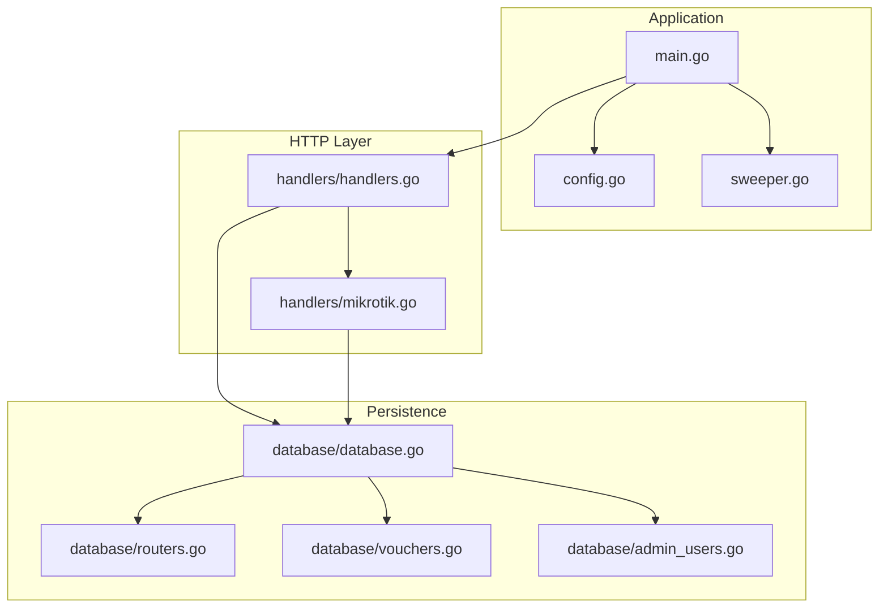
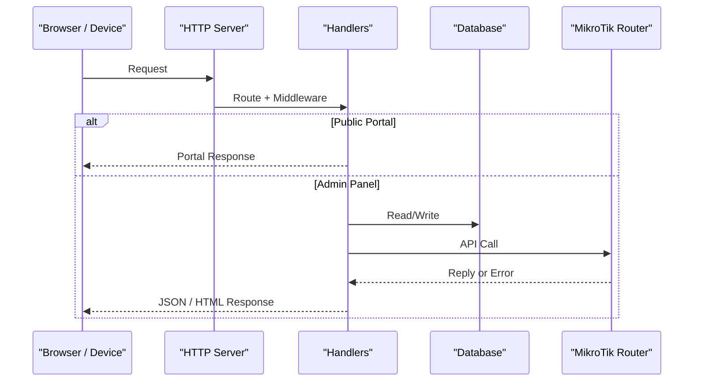
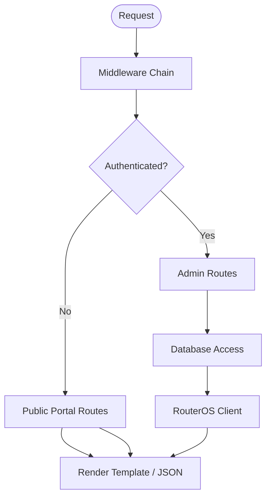
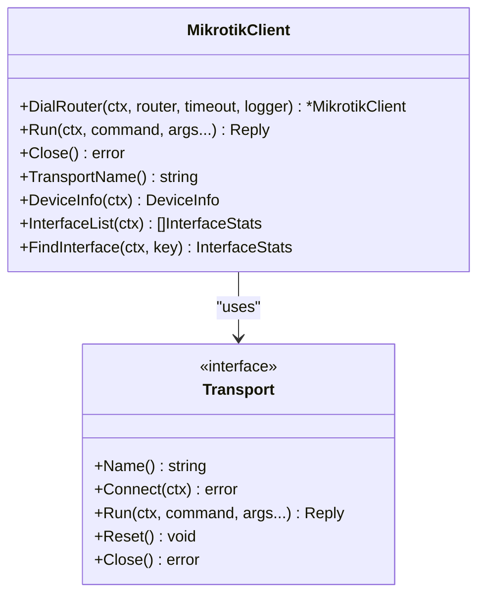
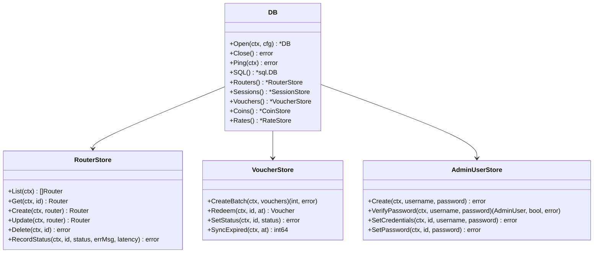

# Development Guide

<cite>
**Referenced Files in This Document**
- [README.md](file://README.md)
- [INSTALLATION.md](file://INSTALLATION.md)
- [main.go](file://main.go)
- [config.go](file://config.go)
- [sweeper.go](file://sweeper.go)
- [go.mod](file://go.mod)
- [handlers/handlers.go](file://handlers/handlers.go)
- [handlers/mikrotik.go](file://handlers/mikrotik.go)
- [database/database.go](file://database/database.go)
- [database/routers.go](file://database/routers.go)
- [database/vouchers.go](file://database/vouchers.go)
- [database/admin_users.go](file://database/admin_users.go)
</cite>

## Table of Contents
1. [Introduction](#introduction)
2. [Project Structure](#project-structure)
3. [Development Environment Setup](#development-environment-setup)
4. [Build Process and Dependency Management](#build-process-and-dependency-management)
5. [Architecture Overview](#architecture-overview)
6. [Core Components](#core-components)
7. [Detailed Component Analysis](#detailed-component-analysis)
8. [Testing Framework and Test Execution](#testing-framework-and-test-execution)
9. [Code Quality, Security, and Conventions](#code-quality-security-and-conventions)
10. [Debugging, Profiling, and Performance Analysis](#debugging-profiling-and-performance-analysis)
11. [Release Procedures](#release-procedures)
12. [Contributing Guidelines](#contributing-guidelines)
13. [Troubleshooting Common Development Issues](#troubleshooting-common-development-issues)
14. [Conclusion](#conclusion)

## Introduction
Aircoins MikroTik Controller is a Go-based centralized controller for MikroTik Hotspot deployments. It provides:
- A captive portal that honors MikroTik redirect parameters.
- An operator panel for router inventory, live hotspot client management, voucher generation, session history, and host tools.
- A prepaid voucher engine with local ledgering and device-side enforcement.
- SQLite-backed persistence with encrypted router API passwords at rest.
- Support for both the legacy RouterOS binary API and the RouterOS v7 REST API.

This guide explains how to set up the development environment, understand the architecture, run tests, build releases, debug issues, and contribute changes safely.

## Project Structure
The repository follows a layered layout:
- `main.go`, `config.go`, `sweeper.go`: application entry point, environment configuration, and background expiry sweep.
- `database/`: SQLite persistence, migrations, credential encryption, and domain stores (routers, vouchers, sessions, coins, rates, admin users).
- `handlers/`: HTTP routing, middleware, dashboard, routers, sessions, vouchers, portal, and RouterOS client abstraction.
- `templates/`: pure HTML templates embedded into the binary.
- `hardware/nodemcu_coin_slot/`: optional coin acceptor firmware reference.
- Scripts and deployment helpers are present alongside the root package.

**Diagram sources**
- [main.go:36-285](file://main.go#L36-L285)
- [handlers/handlers.go:234-303](file://handlers/handlers.go#L234-L303)
- [handlers/mikrotik.go:160-240](file://handlers/mikrotik.go#L160-L240)
- [database/database.go:70-116](file://database/database.go#L70-L116)

**Section sources**
- [README.md:197-205](file://README.md#L197-L205)

## Development Environment Setup
Prerequisites:
- Go toolchain matching the module requirement.
- Git for cloning the repository.
- Optional: systemd-compatible Linux distribution for service-like behavior during development.

Recommended workflow:
1. Clone the repository.
2. Build the binary locally.
3. Run it with minimal environment variables for quick iteration.
4. Use the installer script or manual steps for production-like setup.

Key environment variables for development:
- `ADDR`: listen address; default `:80`. For non-root development use `:8080`.
- `DB_PATH`: SQLite file path; tests commonly use `:memory:`.
- `SECRET_KEY_PATH`: master key file path for encrypting router credentials.
- `PORTAL_NAME`, `ADMIN_USER`, `ADMIN_PASSWORD`: initial branding and first-boot operator account.
- `API_TIMEOUT`: per-call RouterOS timeout.
- `SECURE_COOKIES`: enable secure cookies behind HTTPS.

For rapid local runs without root privileges:
- Set `ADDR=:8080` and `DB_PATH=/tmp/aircoins.db`.
- Start the binary and open the portal at `http://localhost:8080/` and the panel at `/admin`.

Operational notes:
- The installer supports Armbian boards and Ubuntu/Debian mini PCs.
- Port 80 requires capability handling; prefer `ADDR=:8080` during development.

**Section sources**
- [README.md:50-58](file://README.md#L50-L58)
- [README.md:70-90](file://README.md#L70-L90)
- [INSTALLATION.md:107-118](file://INSTALLATION.md#L107-L118)

## Build Process and Dependency Management
Module and dependencies:
- Module path: `github.com/djnirds1984/aircoins-mikrotik-controller`.
- Go version: pinned in `go.mod`.
- Core runtime dependencies:
  - RouterOS client library.
  - Pure-Go SQLite driver.

Build options:
- Standard build: `go build .`
- Production-style build: `CGO_ENABLED=0 go build -trimpath -ldflags "-s -w" -o aircoins-controller .`
- Version injection: `-ldflags "-X main.version=1.0.0"` sets the footer version.

Dependency characteristics:
- Minimal external dependencies reduce attack surface and simplify builds.
- SQLite is pure Go, avoiding system libraries.
- Indirect dependencies include humanize formatting, UUID generation, and low-level utilities.

Best practices:
- Keep Go toolchain aligned with `go.mod`.
- Prefer `CGO_ENABLED=0` builds for portability.
- Validate dependency updates with tests before committing.

**Section sources**
- [go.mod:1-21](file://go.mod#L1-L21)
- [README.md:50-58](file://README.md#L50-L58)
- [INSTALLATION.md:107-118](file://INSTALLATION.md#L107-L118)

## Architecture Overview
The application is an HTTP server built on the standard library:
- Entry point initializes configuration, database, templates, admin bootstrap, and the HTTP server.
- Handler layer wires routes, applies middleware (security headers, CSRF, logging, panic recovery), and serves both public portal endpoints and authenticated admin endpoints.
- Database layer encapsulates SQLite access, migrations, and domain stores.
- RouterOS client abstracts transport selection (REST vs binary API), connection lifecycle, retries, and error classification.

**Diagram sources**
- [main.go:214-285](file://main.go#L214-L285)
- [handlers/handlers.go:234-303](file://handlers/handlers.go#L234-L303)
- [handlers/mikrotik.go:477-520](file://handlers/mikrotik.go#L477-L520)

## Core Components
- Application bootstrap:
  - Parses CLI flags (`--version`, `passwd`).
  - Loads environment configuration.
  - Opens the database and applies migrations.
  - Embeds and parses HTML templates.
  - Bootstraps the operator account if missing.
  - Starts the HTTP server with timeouts and graceful shutdown.
  - Launches the background expiry sweeper.

- Configuration:
  - Reads environment variables with safe defaults.
  - Validates addresses, durations, and boolean toggles.
  - Separates handler and database configuration.

- Background sweeper:
  - Periodically marks expired vouchers.
  - Releases idle coin-slot balances when configured.

- HTTP handlers:
  - Exposes captive portal endpoints and operator panel routes.
  - Applies security headers, CSRF protection, request logging, and panic recovery.
  - Renders templates with shared page context.

- Database:
  - Provides a unified `DB` handle with stores for routers, vouchers, sessions, coins, rates, and admin users.
  - Encrypts router API passwords using a master secret box.
  - Uses WAL mode, foreign keys, and sensible busy timeouts.

- RouterOS client:
  - Supports multiple transports: API, API-SSL, REST, REST-SSL.
  - Implements retry logic for transient connection losses.
  - Classifies errors into sentinel types for UI-friendly messages.

**Section sources**
- [main.go:36-285](file://main.go#L36-L285)
- [config.go:20-77](file://config.go#L20-L77)
- [sweeper.go:11-52](file://sweeper.go#L11-L52)
- [handlers/handlers.go:28-173](file://handlers/handlers.go#L28-L173)
- [database/database.go:70-116](file://database/database.go#L70-L116)
- [handlers/mikrotik.go:160-240](file://handlers/mikrotik.go#L160-L240)

## Detailed Component Analysis

### HTTP Handler Layer
Responsibilities:
- Route registration for portal, admin, API, vouchers, sessions, network management, and tools.
- Middleware chain: recoverer, logRequests, securityHeaders, csrfGuard.
- Template rendering with shared page data and flash messages.
- Path normalization for admin prefix and public portal paths.

Security and resilience:
- Strict Content-Security-Policy and other security headers.
- Double-submit CSRF token for state-changing admin requests.
- Panic recovery returns 500 and logs stack traces.
- Body size limits protect against memory exhaustion.

**Diagram sources**
- [handlers/handlers.go:234-303](file://handlers/handlers.go#L234-L303)
- [handlers/handlers.go:443-590](file://handlers/handlers.go#L443-L590)

**Section sources**
- [handlers/handlers.go:28-173](file://handlers/handlers.go#L28-L173)
- [handlers/handlers.go:234-303](file://handlers/handlers.go#L234-L303)
- [handlers/handlers.go:443-590](file://handlers/handlers.go#L443-L590)

### RouterOS Client
Responsibilities:
- Transport negotiation: auto mode tries secure REST first, then API-SSL, then API.
- Connection lifecycle: dial, authenticate, reconnect on loss, close.
- Command execution with retries and context-aware timeouts.
- Error classification into sentinels like authentication failure, timeout, command unavailable, conflict, not found, permission denied.

**Diagram sources**
- [handlers/mikrotik.go:160-240](file://handlers/mikrotik.go#L160-L240)
- [handlers/mikrotik.go:477-520](file://handlers/mikrotik.go#L477-L520)
- [handlers/mikrotik.go:650-794](file://handlers/mikrotik.go#L650-L794)

**Section sources**
- [handlers/mikrotik.go:23-48](file://handlers/mikrotik.go#L23-L48)
- [handlers/mikrotik.go:160-240](file://handlers/mikrotik.go#L160-L240)
- [handlers/mikrotik.go:477-520](file://handlers/mikrotik.go#L477-L520)

### Database Layer
Responsibilities:
- Open SQLite with configurable pragmas and connection pool settings.
- Manage secret key loading and secret box for credential encryption.
- Provide typed stores for routers, vouchers, admin users, sessions, coins, and rates.
- Apply migrations and ensure schema readiness.

**Diagram sources**
- [database/database.go:70-116](file://database/database.go#L70-L116)
- [database/routers.go:117-287](file://database/routers.go#L117-L287)
- [database/vouchers.go:197-495](file://database/vouchers.go#L197-L495)
- [database/admin_users.go:124-291](file://database/admin_users.go#L124-L291)

**Section sources**
- [database/database.go:70-116](file://database/database.go#L70-L116)
- [database/routers.go:117-287](file://database/routers.go#L117-L287)
- [database/vouchers.go:197-495](file://database/vouchers.go#L197-L495)
- [database/admin_users.go:124-291](file://database/admin_users.go#L124-L291)

## Testing Framework and Test Execution
Testing approach:
- Standard Go testing framework is used across packages.
- Tests cover configuration parsing, database operations, handler behaviors, and integration scenarios.
- In-memory SQLite is used for fast, isolated tests.

Execution procedures:
- Run all tests: `go test ./...`
- Run specific package tests: `go test ./database` or `go test ./handlers`
- Run a single test function: `go test -run TestName ./package`
- Use verbose output: `go test -v ./...`

Test data and fixtures:
- Database tests typically open an in-memory database via `:memory:`.
- Configuration tests validate environment parsing and defaults.
- Handler tests focus on route behavior, CSRF, and template rendering where applicable.

Best practices:
- Keep tests deterministic by mocking time-sensitive behavior where possible.
- Use small, focused test cases covering edge conditions.
- Ensure tests pass with `CGO_ENABLED=0` to match production builds.

**Section sources**
- [config_test.go](file://config_test.go)
- [database/admin_users_test.go](file://database/admin_users_test.go)
- [database/coins_test.go](file://database/coins_test.go)
- [database/database_test.go](file://database/database_test.go)
- [database/portal_settings_test.go](file://database/portal_settings_test.go)
- [database/rates_test.go](file://database/rates_test.go)
- [handlers/adminauth_test.go](file://handlers/adminauth_test.go)
- [handlers/api_traffic_test.go](file://handlers/api_traffic_test.go)
- [handlers/captive_test.go](file://handlers/captive_test.go)
- [handlers/coin_test.go](file://handlers/coin_test.go)
- [handlers/icons_test.go](file://handlers/icons_test.go)
- [handlers/mikrotik_hotspot_installer_test.go](file://handlers/mikrotik_hotspot_installer_test.go)
- [handlers/mikrotik_hotspot_test.go](file://handlers/mikrotik_hotspot_test.go)
- [handlers/mikrotik_network_test.go](file://handlers/mikrotik_network_test.go)
- [handlers/mikrotik_rest_test.go](file://handlers/mikrotik_rest_test.go)
- [handlers/network_e2e_test.go](file://handlers/network_e2e_test.go)
- [handlers/portal_editor_test.go](file://handlers/portal_editor_test.go)
- [handlers/portal_fullpage_test.go](file://handlers/portal_fullpage_test.go)
- [handlers/portal_router_page_test.go](file://handlers/portal_router_page_test.go)
- [handlers/portal_status_test.go](file://handlers/portal_status_test.go)
- [handlers/rates_form_test.go](file://handlers/rates_form_test.go)
- [handlers/rates_test.go](file://handlers/rates_test.go)
- [handlers/security_headers_test.go](file://handlers/security_headers_test.go)
- [handlers/templates_render_test.go](file://handlers/templates_render_test.go)
- [handlers/templates_test.go](file://handlers/templates_test.go)
- [handlers/tools_test.go](file://handlers/tools_test.go)

## Code Quality, Security, and Conventions
Conventions:
- Environment-driven configuration with robust validation and safe defaults.
- Clear separation between HTTP handlers, database stores, and RouterOS client.
- Errors are wrapped and classified for actionable diagnostics.
- Templates are pure HTML embedded into the binary.

Security practices:
- Password hashing uses PBKDF2-HMAC-SHA256 with per-user salt and stored iteration count.
- Sessions use random tokens with HttpOnly and SameSite attributes.
- Brute-force protection includes per-IP and per-account rate limiting.
- CSRF double-submit token protects state-changing admin requests.
- Router API passwords are AES-256-GCM encrypted at rest using a master key.
- Security headers enforce strict content policies.

Coding standards:
- Favor explicit error handling and typed sentinel errors.
- Avoid leaking sensitive data in logs or responses.
- Keep configuration parsing defensive; invalid values should not crash the process.
- Use context propagation for timeouts and cancellation.

Extension points:
- New RouterOS commands can be added through the existing client abstraction.
- New stores follow the pattern of wrapping `*sql.DB` and providing typed methods.
- New routes are registered in the handler mux with appropriate middleware.

**Section sources**
- [database/admin_users.go:17-41](file://database/admin_users.go#L17-L41)
- [database/admin_users.go:64-94](file://database/admin_users.go#L64-L94)
- [handlers/handlers.go:498-590](file://handlers/handlers.go#L498-L590)
- [database/routers.go:19-49](file://database/routers.go#L19-L49)

## Debugging, Profiling, and Performance Analysis
Debugging techniques:
- Use structured logging via `log/slog` for request logs, database events, and RouterOS interactions.
- Inspect generated initial admin password from logs when `ADMIN_PASSWORD` is unset.
- Check service health endpoint `/healthz` for operational readiness.
- Review RouterOS error classifications to identify connectivity, authentication, or permission issues.

Profiling and performance:
- Enable Go profiling by adding pprof endpoints if needed for deep analysis.
- Monitor database connection pool settings and SQLite pragmas (WAL, synchronous, busy timeout).
- Observe RouterOS client retry behavior and classify transient failures.
- Profile template rendering and large response bodies under load.

Performance considerations:
- SQLite writer serialization means a small connection pool is often faster than a large one.
- RouterOS API calls are bounded by per-call timeouts and context deadlines.
- Background sweeper runs periodically to keep voucher and coin-state consistent.

**Section sources**
- [main.go:214-285](file://main.go#L214-L285)
- [handlers/handlers.go:479-496](file://handlers/handlers.go#L479-L496)
- [handlers/mikrotik.go:477-520](file://handlers/mikrotik.go#L477-L520)
- [database/database.go:118-133](file://database/database.go#L118-L133)
- [sweeper.go:11-52](file://sweeper.go#L11-L52)

## Release Procedures
Release preparation:
- Pin the Go version in `go.mod`.
- Inject version via `-ldflags "-X main.version=..."`.
- Build with `CGO_ENABLED=0 -trimpath -ldflags "-s -w"` for a lean binary.
- Validate installation script behavior and firewall rules.

Deployment:
- Use `install.sh` for automated setup on supported platforms.
- Configure systemd unit with proper capabilities for privileged ports.
- Back up the master secret key; router passwords are unrecoverable without it.

Versioning:
- Footer version comes from `AIRCOINS_VERSION`, `git describe`, or `dev`.
- Installer supports passing `AIRCOINS_VERSION` explicitly.

**Section sources**
- [README.md:87-90](file://README.md#L87-L90)
- [INSTALLATION.md:40-48](file://INSTALLATION.md#L40-L48)
- [INSTALLATION.md:107-118](file://INSTALLATION.md#L107-L118)

## Contributing Guidelines
How to contribute:
- Fork the repository and create a feature branch.
- Implement changes following the architectural patterns:
  - Add new routes in the handler mux with appropriate middleware.
  - Encapsulate database operations in typed stores.
  - Extend RouterOS client only through the transport abstraction.
- Write tests for new functionality and update existing tests as needed.
- Ensure all tests pass with `go test ./...`.
- Build with `CGO_ENABLED=0` and verify no regressions.

Writing tests:
- Focus on unit tests for configuration parsing, store methods, and handler logic.
- Use in-memory databases for persistence tests.
- Cover error paths, edge cases, and security-sensitive flows.

Documenting changes:
- Update relevant README sections if user-facing behavior changes.
- Include comments explaining design decisions and trade-offs.
- Keep environment variable documentation accurate.

Review checklist:
- Security: no secrets in logs or responses; CSRF and headers intact.
- Reliability: context timeouts, retries, and error classification correct.
- Performance: database pool and query efficiency reasonable.
- Compatibility: works with both REST and binary API transports.

**Section sources**
- [handlers/handlers.go:234-303](file://handlers/handlers.go#L234-L303)
- [database/database.go:151-165](file://database/database.go#L151-L165)
- [handlers/mikrotik.go:242-278](file://handlers/mikrotik.go#L242-L278)

## Troubleshooting Common Development Issues
Common issues and resolutions:
- Port binding errors on port 80:
  - Use `ADDR=:8080` or grant capabilities as documented.
- Template rendering errors:
  - Verify template names and data structures passed to renderers.
- Router offline or unreachable:
  - Check IP/port, API user permissions, firewall, and selected transport.
- Lost master key:
  - Router passwords are unrecoverable; re-enter them after restoring or replacing the key.
- Service unhealthy:
  - Inspect logs, check port conflicts, and verify database writability.

Operational tips:
- Use `/healthz` to confirm service readiness.
- Confirm the listener address matches expectations.
- Align hotspot login form action with the controller’s reachable address.

**Section sources**
- [INSTALLATION.md:123-153](file://INSTALLATION.md#L123-L153)
- [INSTALLATION.md:155-217](file://INSTALLATION.md#L155-L217)
- [README.md:167-186](file://README.md#L167-L186)

## Conclusion
This guide provided a comprehensive overview of the Aircoins MikroTik Controller’s development environment, architecture, components, testing, build and release processes, debugging strategies, and contribution workflows. By following these conventions and procedures, contributors can maintain code quality, security, and reliability while extending the platform’s capabilities.