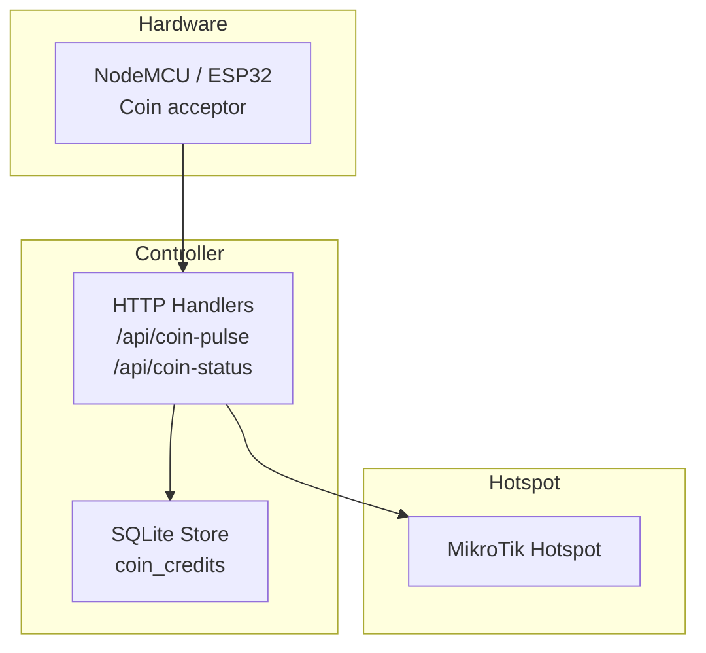
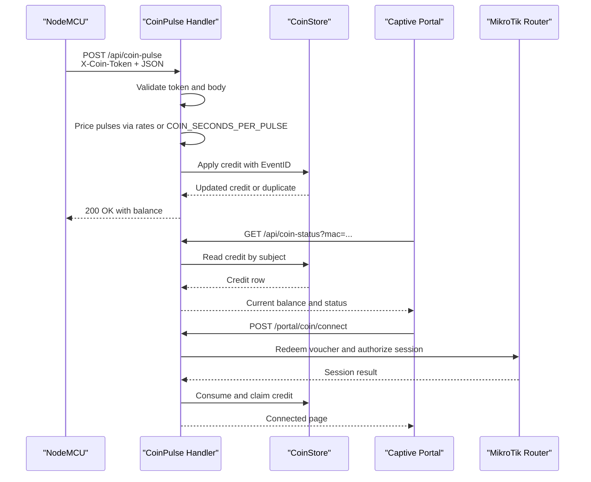
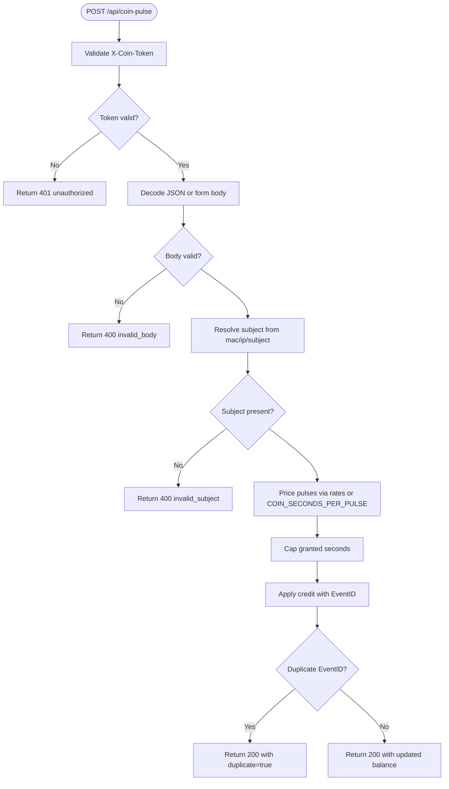
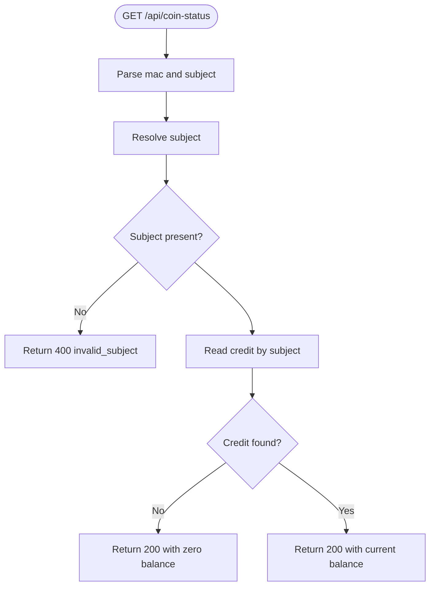
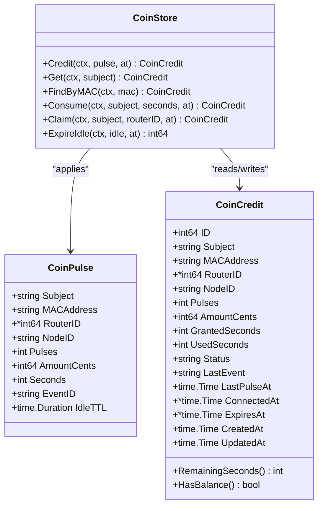
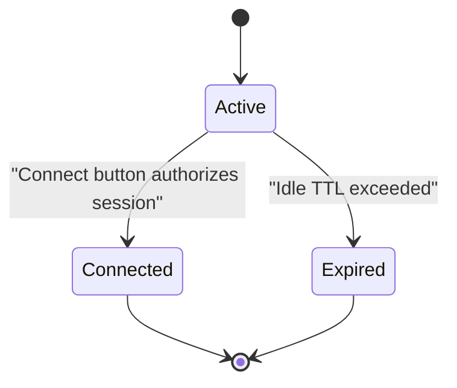
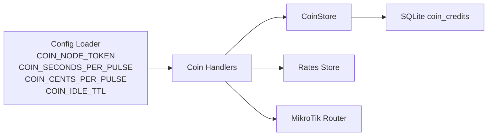

# Coin Pulse API Integration

<cite>
**Referenced Files in This Document**
- [coin.go](file://handlers/coin.go)
- [coins.go](file://database/coins.go)
- [config.go](file://config.go)
- [README.md](file://hardware/nodemcu_coin_slot/README.md)
- [nodemcu_coin_slot.ino](file://hardware/nodemcu_coin_slot/nodemcu_coin_slot.ino)
</cite>

## Table of Contents
1. [Introduction](#introduction)
2. [Project Structure](#project-structure)
3. [Core Components](#core-components)
4. [Architecture Overview](#architecture-overview)
5. [Detailed Component Analysis](#detailed-component-analysis)
6. [Dependency Analysis](#dependency-analysis)
7. [Performance Considerations](#performance-considerations)
8. [Troubleshooting Guide](#troubleshooting-guide)
9. [Conclusion](#conclusion)
10. [Appendices](#appendices)

## Introduction
This document describes the coin pulse API endpoints that connect physical coin acceptors to the Aircoins MikroTik controller. It focuses on:

- POST `/api/coin-pulse`: receiving hardware pulse reports from NodeMCU devices.
- GET `/api/coin-status`: querying a client’s credit balance by MAC address or subject.
- Authentication using the `X-Coin-Token` header and shared secret validation.
- Credit calculation based on configured rates, with environment fallbacks such as `COIN_SECONDS_PER_PULSE`.
- Duplicate event detection through monotonic `event_id` values.
- Balance persistence, idle expiration, and error response semantics.
- Practical integration guidance for custom hardware implementations.

The design goal is strict financial integrity: inserted coins must never be lost and must never be counted twice. The system persists credit in SQLite, de-duplicates events at the database layer, and only deducts time after successful hotspot authorization.

## Project Structure
The coin slot feature spans three main layers:

- HTTP handlers define the public API surface and request validation.
- The database layer implements durable credit storage, idempotent updates, and idle expiration.
- The NodeMCU sketch provides the hardware-facing client that counts pulses and posts them to the controller.



**Diagram sources**
- [coin.go:27-50](file://handlers/coin.go#L27-L50)
- [coins.go:120-149](file://database/coins.go#L120-L149)
- [nodemcu_coin_slot.ino:9-27](file://hardware/nodemcu_coin_slot/nodemcu_coin_slot.ino#L9-L27)

**Section sources**
- [coin.go:27-50](file://handlers/coin.go#L27-L50)
- [coins.go:120-149](file://database/coins.go#L120-L149)
- [nodemcu_coin_slot.ino:9-27](file://hardware/nodemcu_coin_slot/nodemcu_coin_slot.ino#L9-L27)

## Core Components
The coin slot implementation consists of:

| Component | Responsibility | Key Behavior |
|---|---|---|
| `CoinPulse` handler | Accepts hardware pulse reports | Validates authentication, decodes JSON or form body, prices pulses, applies credit, returns current balance |
| `CoinStatus` handler | Returns credit state | Resolves subject from MAC or IP, reads stored credit, returns zero-balance shape when none exists |
| `CoinStore.Credit` | Applies a pulse report durably | Uses an upsert with a duplicate-event guard so retries cannot double-count |
| `CoinStore.Consume` | Deducts authorized time | Only runs after successful router authorization |
| `CoinStore.ExpireIdle` | Releases unspent balances | Marks inactive credits expired after the configured idle window |
| Configuration loader | Reads coin-related settings | Loads token, seconds-per-pulse, cents-per-pulse, idle TTL, and session cap |

**Section sources**
- [coin.go:115-220](file://handlers/coin.go#L115-L220)
- [coin.go:222-263](file://handlers/coin.go#L222-L263)
- [coins.go:139-223](file://database/coins.go#L139-L223)
- [coins.go:261-319](file://database/coins.go#L261-L319)
- [coins.go:321-348](file://database/coins.go#L321-L348)
- [config.go:59-67](file://config.go#L59-L67)

## Architecture Overview
The coin flow separates concerns between hardware reporting, server-side pricing, durable accounting, and hotspot provisioning.



**Diagram sources**
- [coin.go:123-220](file://handlers/coin.go#L123-L220)
- [coin.go:230-263](file://handlers/coin.go#L230-L263)
- [coin.go:353-454](file://handlers/coin.go#L353-L454)
- [coins.go:139-223](file://database/coins.go#L139-L223)
- [coins.go:261-319](file://database/coins.go#L261-L319)

## Detailed Component Analysis

### POST `/api/coin-pulse`
This endpoint receives pulse reports from NodeMCU devices and adds credit to the target client.

#### Request Schema
The handler accepts either JSON or URL-encoded form data. The primary fields are:

| Field | Type | Required | Description |
|---|---|---:|---|
| `mac` | string | Conditional | Client MAC address; used to build the subject when no explicit `subject` is provided |
| `ip` | string | Optional | Fallback client IP when MAC is unavailable |
| `pulses` | integer | Yes | Number of acceptor pulses reported |
| `node_id` | string | Optional | Human-readable identifier for the acceptor device |
| `event_id` | string | Recommended | Monotonic de-duplication token for retry safety |
| `subject` | string | Optional | Explicit storage key; if empty, derived from `mac` or `ip` |
| `amount_cents` | integer | Optional | Face value in smallest currency unit; defaults to rate-derived value |
| `seconds` | integer | Optional | Override access time per report; defaults to rate-derived value |
| `router_id` | integer | Optional | Attributes credit to a known router |

The NodeMCU sketch sends `mac`, `pulses`, `node_id`, and `event_id`. Advanced acceptors may also send `amount_cents` or `seconds` when they know their own coin denominations.

#### Authentication
Authentication uses the `X-Coin-Token` header. The controller compares the presented token against the configured `COIN_NODE_TOKEN` using constant-time comparison. If the token is missing or wrong, the endpoint returns `401 Unauthorized`.

A query parameter named `token` is also accepted for compatibility with constrained clients that cannot set custom headers.

#### Validation Rules
- Missing or malformed body returns `400 Bad Request`.
- Missing subject (no `subject`, `mac`, or usable `ip`) returns `400 Bad Request`.
- Invalid numeric fields return `400 Bad Request` with the offending field name.
- No active pricing configuration returns `503 Service Unavailable`.
- Excessive values are capped or rejected according to database limits.

#### Credit Calculation Algorithm
Credit calculation follows this order:

1. If the report includes valid `seconds` or `amount_cents`, those values are honored.
2. Otherwise, the handler asks the rates store to price the pulse count.
3. If no active rate tier is configured, the environment fallback is used:
   - `COIN_SECONDS_PER_PULSE` determines access time.
   - `COIN_CENTS_PER_PULSE` determines face value.
4. A maximum grant cap prevents one report from buying an unreasonable amount of time.
5. The resulting credit is persisted atomically with duplicate-event protection.



**Diagram sources**
- [coin.go:123-220](file://handlers/coin.go#L123-L220)
- [coin.go:265-298](file://handlers/coin.go#L265-L298)
- [coins.go:139-223](file://database/coins.go#L139-L223)

#### Response Schema
Successful responses include:

| Field | Type | Description |
|---|---|---|
| `subject` | string | Storage key for the credited client |
| `mac` | string | Normalized MAC address |
| `pulses` | integer | Running total of pulses |
| `amount_cents` | integer | Running face value inserted |
| `remaining_seconds` | integer | Access time still available |
| `session_label` | string | Human-readable remaining time |
| `status` | string | `active`, `connected`, or `expired` |
| `seconds_per_pulse` | integer | Live seconds-per-pulse value echoed to clients |
| `duplicate` | boolean | True when the event was already recorded |
| `accepted_pulses` | integer | Pulses added by this request |
| `updated_at` | string | RFC3339 timestamp of the last update |

Error responses use a machine-friendly JSON shape with `ok`, `code`, and `message`.

**Section sources**
- [coin.go:57-86](file://handlers/coin.go#L57-L86)
- [coin.go:88-113](file://handlers/coin.go#L88-L113)
- [coin.go:123-220](file://handlers/coin.go#L123-L220)
- [coin.go:551-572](file://handlers/coin.go#L551-L572)
- [coin.go:574-619](file://handlers/coin.go#L574-L619)
- [coin.go:635-654](file://handlers/coin.go#L635-L654)
- [coins.go:24-39](file://database/coins.go#L24-L39)

### GET `/api/coin-status`
This endpoint returns the current credit balance for a client.

#### Query Parameters
| Parameter | Description |
|---|---|
| `mac` | Client MAC address; preferred subject when present |
| `subject` | Explicit storage key fallback |
| Fallback | If neither is provided, the requester’s IP is used |

#### Behavior
- If no credit exists, the endpoint returns `200 OK` with a zeroed balance rather than an error.
- If reading fails, the handler returns an internal error response.
- The response shape matches the coin pulse response schema so both NodeMCU and browser clients can parse it uniformly.



**Diagram sources**
- [coin.go:222-263](file://handlers/coin.go#L222-L263)

**Section sources**
- [coin.go:222-263](file://handlers/coin.go#L222-L263)
- [coins.go:227-259](file://database/coins.go#L227-L259)

### Shared Secret Validation
The coin pulse endpoint requires a shared secret configured through `COIN_NODE_TOKEN`. The validation logic:

- Rejects requests when the token is not configured.
- Accepts the token from the `X-Coin-Token` header.
- Falls back to the `token` query parameter for legacy or constrained clients.
- Uses constant-time comparison to avoid timing side channels.

This design ensures that exposing the controller on a guest network does not become a free-internet vending machine.

**Section sources**
- [coin.go:45-54](file://handlers/coin.go#L45-L54)
- [coin.go:551-572](file://handlers/coin.go#L551-L572)
- [config.go:59-63](file://config.go#L59-L63)

### Duplicate Event Detection
Duplicate detection is implemented at the database layer to guarantee idempotency even under concurrent retries.

Key mechanisms:

- Each pulse report carries an `event_id`.
- The credit upsert includes a condition that only applies when the incoming event differs from the stored `last_event`.
- If no rows are affected because the event was already recorded, the store returns a duplicate error.
- The handler treats this as success: it returns `200 OK` with `duplicate: true`, allowing the NodeMCU to stop retrying without penalizing the customer.



**Diagram sources**
- [coins.go:41-118](file://database/coins.go#L41-L118)
- [coins.go:139-223](file://database/coins.go#L139-L223)

**Section sources**
- [coins.go:131-149](file://database/coins.go#L131-L149)
- [coins.go:179-223](file://database/coins.go#L179-L223)
- [coin.go:199-219](file://handlers/coin.go#L199-L219)

### Balance Persistence and Idle Expiration
Credits are stored in SQLite and designed to survive controller restarts. Important properties:

- Credits are running totals, not wallets deleted on spend.
- `granted_seconds` tracks total time bought.
- `used_seconds` tracks time authorized for sessions.
- `remaining_seconds` is computed as `granted_seconds - used_seconds`.
- Idle balances expire after `COIN_IDLE_TTL`, preventing one customer’s leftover credit from being inherited by another user on the same MAC or IP.



**Diagram sources**
- [coins.go:12-22](file://database/coins.go#L12-L22)
- [coins.go:321-348](file://database/coins.go#L321-L348)

**Section sources**
- [coins.go:41-88](file://database/coins.go#L41-L88)
- [coins.go:321-348](file://database/coins.go#L321-L348)

### Error Responses
| Status | Code | Meaning |
|---|---|---|
| `401 Unauthorized` | `unauthorized` | Missing or incorrect `X-Coin-Token` |
| `400 Bad Request` | `invalid_body` | Malformed JSON or unreadable form |
| `400 Bad Request` | `invalid_subject` | Missing usable MAC/IP/subject |
| `400 Bad Request` | `invalid_pulse` | Invalid pulse, amount, seconds, or other validated field |
| `503 Service Unavailable` | `no_rates` | No active rate configuration available |

All errors use a consistent JSON structure with `ok`, `code`, and `message`.

**Section sources**
- [coin.go:123-148](file://handlers/coin.go#L123-L148)
- [coin.go:154-182](file://handlers/coin.go#L154-L182)
- [coin.go:645-654](file://handlers/coin.go#L645-L654)

### Rate Limiting Considerations
The repository does not implement a general-purpose rate limiter for the coin pulse endpoint. Instead, it relies on several safeguards:

- Database-level caps on pulses, amount, seconds, and event ID length.
- Maximum grant cap per report.
- NodeMCU-side debouncing, settle delay, and bounded batch size.
- Wi-Fi association retry throttling on the hardware side.
- A separate portal rate limiter is referenced elsewhere in the handler package, but it is not applied directly to `/api/coin-pulse`.

For production deployments, consider adding application-level rate limiting around the coin pulse endpoint to protect against misconfigured hardware or intentional abuse.

**Section sources**
- [coins.go:24-39](file://database/coins.go#L24-L39)
- [coin.go:177-182](file://handlers/coin.go#L177-L182)
- [nodemcu_coin_slot.ino:152-189](file://hardware/nodemcu_coin_slot/nodemcu_coin_slot.ino#L152-L189)

### Integration Examples for Custom Hardware
The NodeMCU README provides verification examples using `curl`. These demonstrate the expected request and response behavior.

Example POST to submit one pulse:

```sh
curl -i -X POST http://192.168.88.1/api/coin-pulse \
  -H 'X-Coin-Token: <your token>' \
  -H 'Content-Type: application/json' \
  -d '{"mac":"AA:BB:CC:DD:EE:FF","pulses":1,"node_id":"box-1","event_id":"test-1"}'
```

Example GET to check balance:

```sh
curl 'http://192.168.88.1/api/coin-status?mac=AA:BB:CC:DD:EE:FF'
```

Expected behaviors:

- `401` means the token is wrong or missing.
- `400` with a message naming a field indicates a validation mismatch.
- `200` with `"duplicate":true` means the event was already counted and the node should stop retrying.

**Section sources**
- [README.md:98-117](file://hardware/nodemcu_coin_slot/README.md#L98-L117)
- [nodemcu_coin_slot.ino:374-449](file://hardware/nodemcu_coin_slot/nodemcu_coin_slot.ino#L374-L449)

## Dependency Analysis
The coin pulse API depends on configuration, database operations, and optional hotspot interaction.



**Diagram sources**
- [config.go:59-67](file://config.go#L59-L67)
- [coin.go:265-298](file://handlers/coin.go#L265-L298)
- [coins.go:120-149](file://database/coins.go#L120-L149)

**Section sources**
- [config.go:59-67](file://config.go#L59-L67)
- [coin.go:265-298](file://handlers/coin.go#L265-L298)
- [coins.go:120-149](file://database/coins.go#L120-L149)

## Performance Considerations
- The credit update is a single SQL statement with an atomic upsert and duplicate guard, avoiding read-modify-write races.
- Responses disable caching (`Cache-Control: no-store`) because balance is live money state.
- The NodeMCU batches pulses and waits for a settle period to reduce request churn.
- Debouncing prevents contact bounce from inflating pulse counts.
- Idle expiration prevents stale balances from accumulating indefinitely.

[No sources needed since this section provides general guidance]

## Troubleshooting Guide
Common issues and their likely causes:

| Symptom | Likely Cause | Resolution |
|---|---|---|
| `401 Unauthorized` | Wrong or missing `COIN_NODE_TOKEN` | Set matching token on controller and NodeMCU |
| `400 Bad Request` naming a field | Sketch and controller disagree on field type or value | Fix malformed or missing field |
| Balance never moves despite `200` | Wrong MAC or subject | Compare board boot MAC with queried MAC |
| One coin counted twice or not at all | Missing pull-up resistor or wiring issue | Add 10 kOhm pull-up and verify voltage divider |
| Controller unreachable during connect | Router offline or API timeout | Retry after gateway recovers; balance remains saved |
| Duplicate event detected | Network retry after successful credit | Expected behavior; node should stop retrying |

**Section sources**
- [README.md:145-154](file://hardware/nodemcu_coin_slot/README.md#L145-L154)
- [coin.go:123-148](file://handlers/coin.go#L123-L148)
- [coin.go:199-219](file://handlers/coin.go#L199-L219)

## Conclusion
The coin pulse API provides a secure, durable, and idempotent interface between physical coin acceptors and the Aircoins controller. Its security model relies on a shared secret, its financial integrity relies on database-level deduplication and persistence, and its operational clarity relies on structured error responses and echo-back balance shapes. For custom hardware, follow the NodeMCU integration pattern: count pulses locally, persist pending state, send monotonic event IDs, authenticate with `X-Coin-Token`, and treat `duplicate: true` as confirmation that the coin has already been counted.

[No sources needed since this section summarizes without analyzing specific files]

## Appendices

### Configuration Reference
| Environment Variable | Default | Purpose |
|---|---|---|
| `COIN_NODE_TOKEN` | Empty | Shared secret for `/api/coin-pulse` |
| `COIN_SECONDS_PER_PULSE` | `300` | Fallback access time per pulse |
| `COIN_CENTS_PER_PULSE` | `500` | Fallback face value per pulse |
| `COIN_IDLE_TTL` | `20m` | Time before unspent credit expires |
| `COIN_MAX_SESSION_MINUTES` | `240` | Maximum session duration from Connect button |

**Section sources**
- [config.go:59-67](file://config.go#L59-L67)