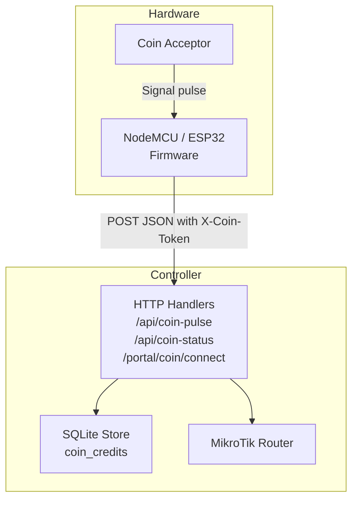
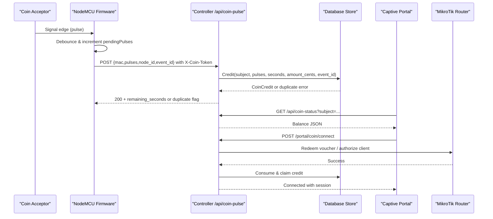
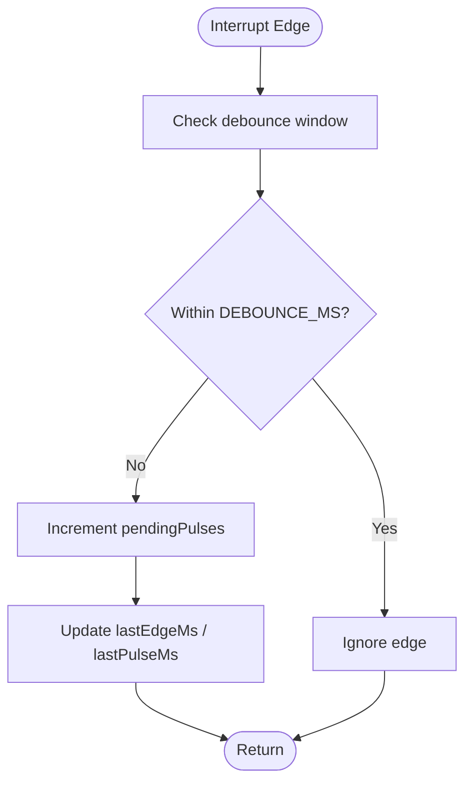
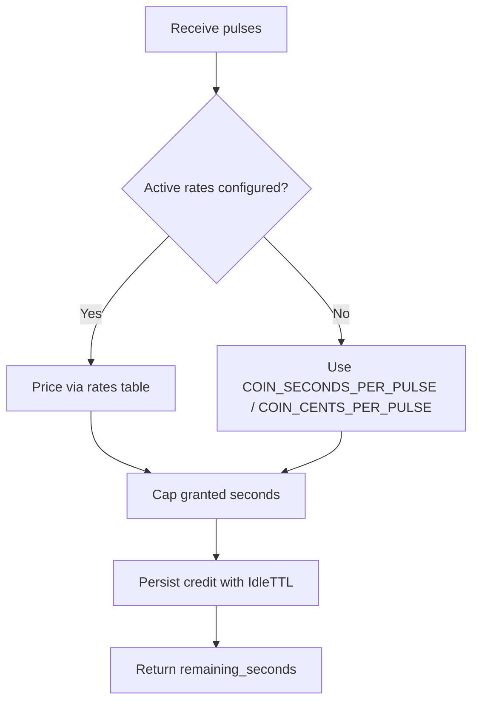
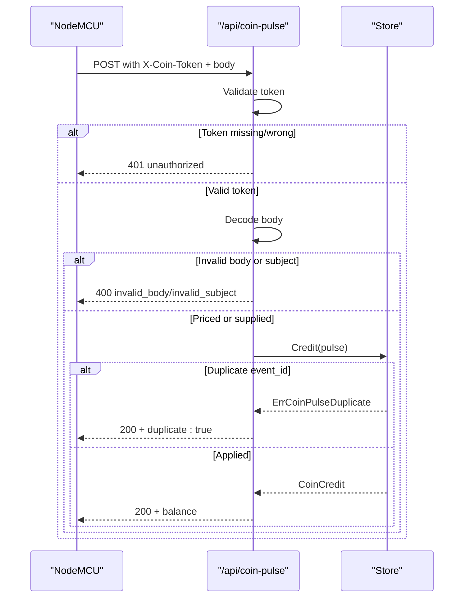
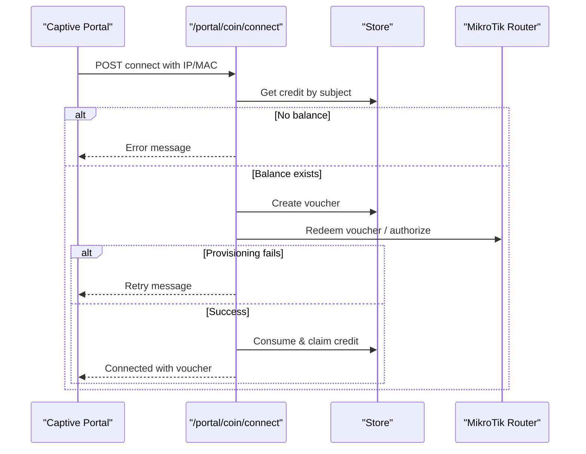
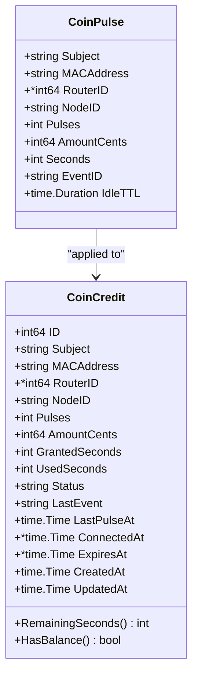
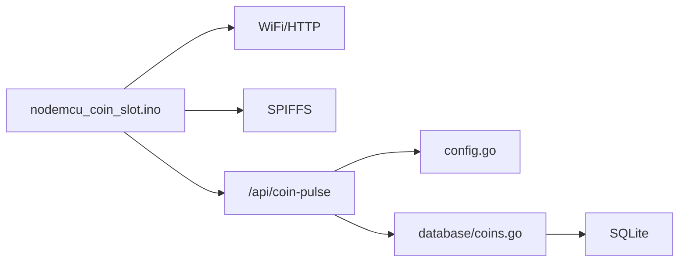

# Hardware Integration

<cite>
**Referenced Files in This Document**
- [README.md](file://hardware/nodemcu_coin_slot/README.md)
- [nodemcu_coin_slot.ino](file://hardware/nodemcu_coin_slot/nodemcu_coin_slot.ino)
- [coin.go](file://handlers/coin.go)
- [coins.go](file://database/coins.go)
- [config.go](file://config.go)
</cite>

## Table of Contents
1. [Introduction](#introduction)
2. [Project Structure](#project-structure)
3. [Core Components](#core-components)
4. [Architecture Overview](#architecture-overview)
5. [Detailed Component Analysis](#detailed-component-analysis)
6. [Dependency Analysis](#dependency-analysis)
7. [Performance Considerations](#performance-considerations)
8. [Troubleshooting Guide](#troubleshooting-guide)
9. [Conclusion](#conclusion)
10. [Appendices](#appendices)

## Introduction
This document explains the hardware integration for coin-based hotspot access, focusing on NodeMCU and ESP32 coin acceptor support. It covers how physical coin pulses are detected, how credit is calculated and stored, how the controller exposes a secure API for hardware reports, and how accumulated credit becomes a live MikroTik session. It also documents firmware configuration, wiring requirements, calibration parameters, shared-secret authentication, and extension points for custom hardware.

## Project Structure
The coin integration spans three layers:
- Firmware layer: an Arduino sketch running on ESP8266/ESP32 that detects coin pulses and reports them to the controller.
- Controller layer: HTTP handlers that authenticate hardware reports, price pulses into time or currency, persist balances, and convert credit into sessions.
- Persistence layer: durable records of credits, pulses, and idle expiration.

**Diagram sources**
- [nodemcu_coin_slot.ino:101-110](file://hardware/nodemcu_coin_slot/nodemcu_coin_slot.ino#L101-L110)
- [coin.go:27-55](file://handlers/coin.go#L27-L55)
- [coins.go:120-127](file://database/coins.go#L120-L127)

**Section sources**
- [README.md:11-24](file://hardware/nodemcu_coin_slot/README.md#L11-L24)
- [coin.go:1-11](file://handlers/coin.go#L1-L11)

## Core Components
- Coin acceptor signal detection via interrupt-driven debouncing on the microcontroller.
- Firmware reporting pipeline that persists pending pulses locally and retries until acknowledged.
- Controller endpoints for receiving pulses, querying balance, and connecting credit to a router session.
- Pricing engine using configured rates or environment fallbacks.
- Durable credit store with de-duplication, idle expiry, and consumption semantics.

Key responsibilities:
- Firmware: count pulses, build authenticated requests, handle retries and duplicates.
- Handler: validate token, decode body, price pulses, apply credit, return balance.
- Database: enforce limits, deduplicate by event ID, track status transitions.

**Section sources**
- [nodemcu_coin_slot.ino:112-190](file://hardware/nodemcu_coin_slot/nodemcu_coin_slot.ino#L112-L190)
- [coin.go:115-220](file://handlers/coin.go#L115-L220)
- [coins.go:120-223](file://database/coins.go#L120-L223)

## Architecture Overview
The system separates pricing from counting. The firmware counts pulses; the controller prices them. This allows operators to change pricing without reflashing hardware.

**Diagram sources**
- [nodemcu_coin_slot.ino:220-234](file://hardware/nodemcu_coin_slot/nodemcu_coin_slot.ino#L220-L234)
- [nodemcu_coin_slot.ino:374-449](file://hardware/nodemcu_coin_slot/nodemcu_coin_slot.ino#L374-L449)
- [coin.go:123-220](file://handlers/coin.go#L123-L220)
- [coin.go:230-263](file://handlers/coin.go#L230-L263)
- [coin.go:353-454](file://handlers/coin.go#L353-L454)
- [coins.go:149-223](file://database/coins.go#L149-L223)

## Detailed Component Analysis

### Physical Coin Detection System
- The acceptor closes a switch contact briefly per coin. The firmware uses an interrupt handler to capture edges reliably even under bursts.
- A time-window debounce prevents double-counting due to mechanical bounce while still allowing distinct coins close together.
- The internal pull-up is enabled, but an external pull-up is recommended for reliability. For 5 V open-collector outputs, a voltage divider must be used to protect the ESP.

**Diagram sources**
- [nodemcu_coin_slot.ino:152-175](file://hardware/nodemcu_coin_slot/nodemcu_coin_slot.ino#L152-L175)
- [nodemcu_coin_slot.ino:220-234](file://hardware/nodemcu_coin_slot/nodemcu_coin_slot.ino#L220-L234)

**Section sources**
- [README.md:26-48](file://hardware/nodemcu_coin_slot/README.md#L26-L48)
- [nodemcu_coin_slot.ino:30-47](file://hardware/nodemcu_coin_slot/nodemcu_coin_slot.ino#L30-L47)
- [nodemcu_coin_slot.ino:152-175](file://hardware/nodemcu_coin_slot/nodemcu_coin_slot.ino#L152-L175)
- [nodemcu_coin_slot.ino:220-234](file://hardware/nodemcu_coin_slot/nodemcu_coin_slot.ino#L220-L234)

### Credit Allocation Workflow
- The firmware sends pulses, not seconds or cents, so pricing remains a controller concern.
- If the node does not send seconds or amount_cents, the controller prices pulses using configured rates; if no active rates exist, it falls back to COIN_SECONDS_PER_PULSE and COIN_CENTS_PER_PULSE.
- A maximum grant cap protects against misconfiguration or stuck inputs.
- Credits are persisted with an idle TTL; unspent balances expire after the configured window.

**Diagram sources**
- [coin.go:154-182](file://handlers/coin.go#L154-L182)
- [coin.go:265-298](file://handlers/coin.go#L265-L298)
- [coins.go:149-223](file://database/coins.go#L149-L223)

**Section sources**
- [coin.go:154-182](file://handlers/coin.go#L154-L182)
- [coin.go:265-298](file://handlers/coin.go#L265-L298)
- [coins.go:149-223](file://database/coins.go#L149-L223)

### NodeMCU Firmware Setup
- Shared secret: set COIN_NODE_TOKEN in both firmware and controller environment.
- Network: configure SSID/password and controller host/port.
- Client identity: either leave CLIENT_MAC empty to credit the board’s own MAC, or set it to the customer device’s MAC.
- Node identification: set NODE_ID for audit trails.
- Pin mapping: default pin is defined per platform; adjust COIN_PIN if wired differently.
- Flash and verify: serial output shows MAC being credited, pin monitored, and pulse reports.

Configuration constants include:
- COIN_NODE_TOKEN
- CONTROLLER_HOST / CONTROLLER_PORT
- WIFI_SSID / WIFI_PASSWORD
- CLIENT_MAC
- NODE_ID
- COIN_PIN
- DEBOUNCE_MS
- MAX_PULSES_PER_REPORT
- SETTLE_MS
- WIFI_RETRY_MS / WIFI_CONNECT_TIMEOUT_MS

**Section sources**
- [README.md:50-90](file://hardware/nodemcu_coin_slot/README.md#L50-L90)
- [nodemcu_coin_slot.ino:116-190](file://hardware/nodemcu_coin_slot/nodemcu_coin_slot.ino#L116-L190)
- [nodemcu_coin_slot.ino:456-510](file://hardware/nodemcu_coin_slot/nodemcu_coin_slot.ino#L456-L510)

### Wiring Requirements
- Connect acceptor signal to the configured GPIO and GND to GND.
- Use a 10 kOhm pull-up between signal and 3V3 for reliable logic levels.
- For 5 V open-collector outputs, use a voltage divider (e.g., 1 kΩ to signal, 2.2 kΩ to GND). Do not connect 5 V directly to the pin.

**Section sources**
- [README.md:26-48](file://hardware/nodemcu_coin_slot/README.md#L26-L48)
- [nodemcu_coin_slot.ino:30-47](file://hardware/nodemcu_coin_slot/nodemcu_coin_slot.ino#L30-L47)

### Coin Pulse API Endpoint
- Method: POST
- Path: /api/coin-pulse
- Authentication: header X-Coin-Token must match COIN_NODE_TOKEN; otherwise returns 401.
- Body: JSON or URL-encoded form with fields including mac/ip, pulses, seconds, amount_cents, node_id, event_id, router_id.
- Response: JSON with subject, pulses, amount_cents, remaining_seconds, session_label, status, seconds_per_pulse, duplicate flag, accepted_pulses, updated_at.

Validation and behavior:
- Unauthorized requests are rejected early.
- Invalid bodies produce 400 with field-specific messages.
- Missing subject produces 400.
- No active rates produce 503 unless the node supplies its own seconds/amount.
- Duplicate event_id returns 200 with duplicate:true and current balance.

**Diagram sources**
- [coin.go:123-220](file://handlers/coin.go#L123-L220)
- [coins.go:149-223](file://database/coins.go#L149-L223)

**Section sources**
- [coin.go:123-220](file://handlers/coin.go#L123-L220)
- [coin.go:574-619](file://handlers/coin.go#L574-L619)
- [coins.go:149-223](file://database/coins.go#L149-L223)

### Shared Secret Authentication
- The controller reads COIN_NODE_TOKEN from the environment.
- The endpoint accepts the token via header X-Coin-Token or query parameter token.
- Comparison is constant-time to prevent timing attacks.
- If COIN_NODE_TOKEN is unset, all reports are rejected.

**Section sources**
- [config.go:59-67](file://config.go#L59-L67)
- [coin.go:551-572](file://handlers/coin.go#L551-L572)

### Credit Calculation Based on COIN_SECONDS_PER_PULSE and COIN_CENTS_PER_PULSE
- When the node does not supply seconds or amount_cents, the controller attempts to price pulses using configured rates.
- If no active rates exist, it falls back to COIN_SECONDS_PER_PULSE and COIN_CENTS_PER_PULSE.
- The resulting allocation includes seconds, cents, and label indicating the source of pricing.

Environment variables:
- COIN_SECONDS_PER_PULSE: seconds of access per pulse (default 300).
- COIN_CENTS_PER_PULSE: face value per pulse (default 500).
- COIN_IDLE_TTL: idle expiry window (default 20 minutes).

**Section sources**
- [coin.go:265-298](file://handlers/coin.go#L265-L298)
- [config.go:63-67](file://config.go#L63-L67)

### Connection Flow: From Credit to Session
- The captive portal polls /api/coin-status to show the current balance.
- When the user clicks “Done / Connect now”, the controller creates a voucher, provisions the client on the router, and only then consumes the credit.
- If provisioning fails, the credit remains available for retry.

**Diagram sources**
- [coin.go:353-454](file://handlers/coin.go#L353-L454)
- [coins.go:261-319](file://database/coins.go#L261-L319)

**Section sources**
- [coin.go:230-263](file://handlers/coin.go#L230-L263)
- [coin.go:353-454](file://handlers/coin.go#L353-L454)
- [coins.go:261-319](file://database/coins.go#L261-L319)

### Data Model and State Transitions

**Diagram sources**
- [coins.go:41-79](file://database/coins.go#L41-L79)
- [coins.go:97-118](file://database/coins.go#L97-L118)

**Section sources**
- [coins.go:41-79](file://database/coins.go#L41-L79)
- [coins.go:97-118](file://database/coins.go#L97-L118)

## Dependency Analysis
- Firmware depends on WiFi and HTTP libraries for the target platform and SPIFFS for local persistence.
- Controller handlers depend on database stores for credit operations and rate pricing.
- Configuration binds environment variables to runtime settings for coin handling.

**Diagram sources**
- [nodemcu_coin_slot.ino:101-110](file://hardware/nodemcu_coin_slot/nodemcu_coin_slot.ino#L101-L110)
- [coin.go:13-25](file://handlers/coin.go#L13-L25)
- [config.go:1-12](file://config.go#L1-L12)

**Section sources**
- [nodemcu_coin_slot.ino:101-110](file://hardware/nodemcu_coin_slot/nodemcu_coin_slot.ino#L101-L110)
- [coin.go:13-25](file://handlers/coin.go#L13-L25)
- [config.go:1-12](file://config.go#L1-L12)

## Performance Considerations
- Interrupt-driven counting ensures fast pulses are captured without blocking main loop tasks.
- Local flash journaling prevents loss of pending pulses across power cycles.
- Wi-Fi association is rate-limited to avoid radio congestion during reconnection loops.
- Batch reporting bounds request size and reduces UI flicker by settling multiple pulses before sending.
- Database updates are single statements with atomic constraints to avoid race conditions and double crediting.

[No sources needed since this section provides general guidance]

## Troubleshooting Guide
Common symptoms and resolutions:
- Association failures on boot: check SSID/password and range; pulses queue in flash until connectivity resumes.
- 401 from controller: ensure COIN_NODE_TOKEN matches between firmware and controller; verify header or query parameter presence.
- Balance never moves despite 200 response: confirm MAC identity matches what the portal polls; compare boot-printed MAC with portal subject.
- Double-counting or missed coins: verify pull-up resistor and correct voltage level; inspect DEBOUNCE_MS tuning.
- HTTP 400 naming a field: reconcile firmware edits with controller restart; ensure numeric fields are whole numbers.

Additional checks:
- Verify /api/coin-status returns expected balance for the subject.
- Test /api/coin-pulse manually with curl using the correct token and body.
- Review controller logs for unauthorized, invalid_body, invalid_subject, no_rates, and duplicate events.

**Section sources**
- [README.md:98-117](file://hardware/nodemcu_coin_slot/README.md#L98-L117)
- [README.md:145-154](file://hardware/nodemcu_coin_slot/README.md#L145-L154)
- [coin.go:123-220](file://handlers/coin.go#L123-L220)

## Conclusion
The NodeMCU coin acceptor integration separates pulse counting from pricing, ensuring robustness and operational flexibility. The firmware guarantees reliable detection and delivery of pulses, while the controller enforces security, pricing rules, and durable accounting. With proper wiring, token configuration, and calibration of COIN_SECONDS_PER_PULSE, the system provides dependable credit allocation and seamless conversion into hotspot sessions.

[No sources needed since this section summarizes without analyzing specific files]

## Appendices

### Configuration Parameters Summary
- COIN_NODE_TOKEN: shared secret for hardware reports.
- COIN_SECONDS_PER_PULSE: fallback seconds per pulse when no active rates exist.
- COIN_CENTS_PER_PULSE: fallback cents per pulse for reconciliation.
- COIN_IDLE_TTL: idle expiry window for unspent balances.
- COIN_MAX_SESSION_MINUTES: maximum session duration from coin credit.

**Section sources**
- [config.go:59-67](file://config.go#L59-L67)

### Extension Points for Custom Hardware
- Acceptors that know their denominations can supply seconds and/or amount_cents in the pulse report; the controller honors these values when present.
- The event_id mechanism supports idempotent retries; custom nodes should maintain a monotonic counter.
- The subject field allows explicit attribution; otherwise, MAC/IP normalization determines the key.
- RouterID can attribute credit to a known device when known at the node.

**Section sources**
- [nodemcu_coin_slot.ino:16-27](file://hardware/nodemcu_coin_slot/nodemcu_coin_slot.ino#L16-L27)
- [coin.go:57-86](file://handlers/coin.go#L57-L86)
- [coins.go:97-118](file://database/coins.go#L97-L118)