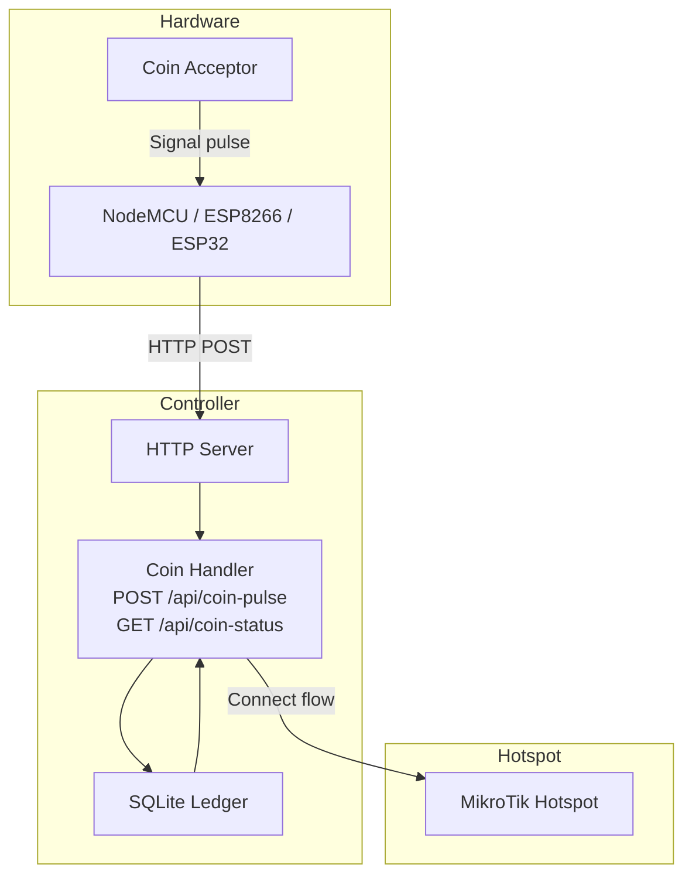
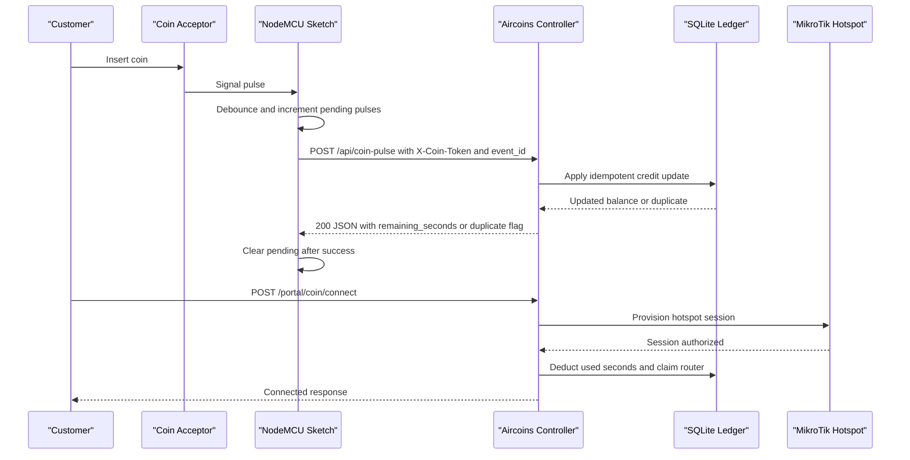
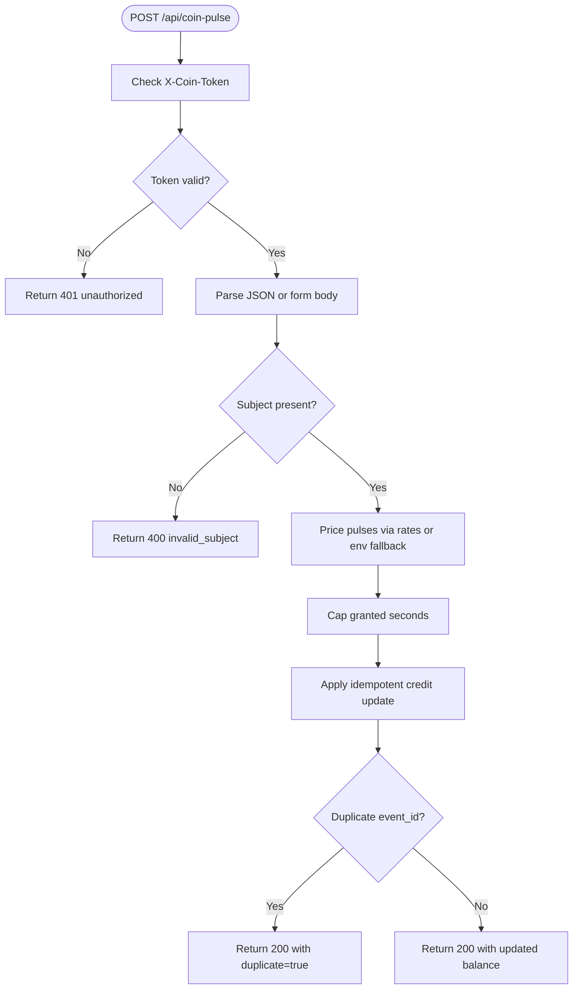
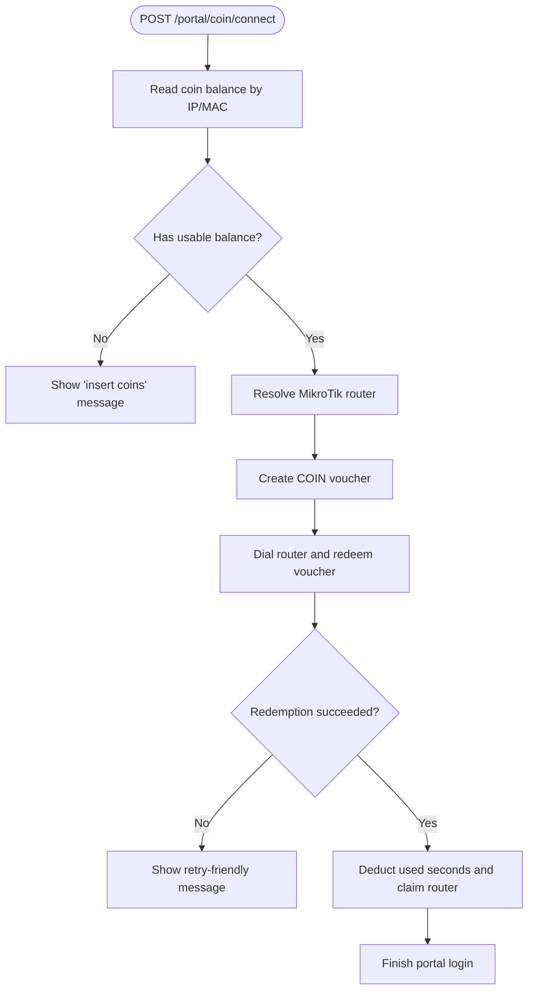
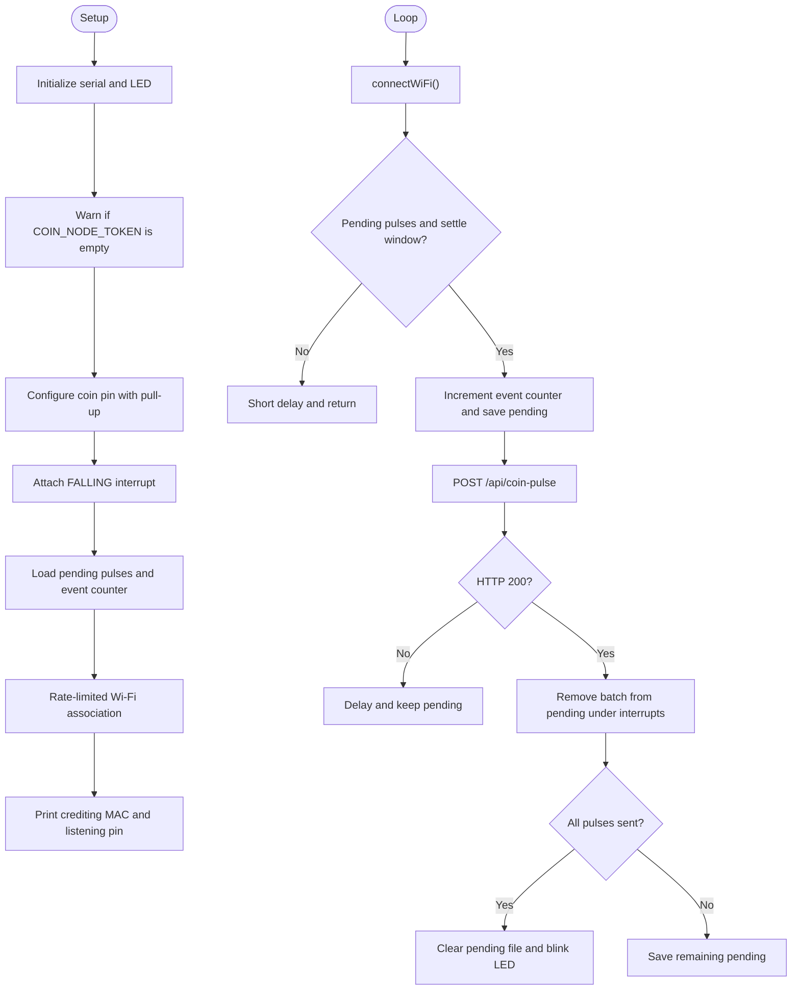
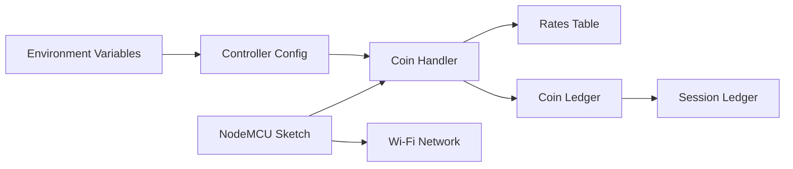

# Hardware Troubleshooting

<cite>
**Referenced Files in This Document**
- [README.md](file://README.md)
- [config.go](file://config.go)
- [handlers/coin.go](file://handlers/coin.go)
- [database/coins.go](file://database/coins.go)
- [hardware/nodemcu_coin_slot/nodeMCU_coin_slot.ino](file://hardware/nodemcu_coin_slot/nodeMCU_coin_slot.ino)
</cite>

## Table of Contents
1. [Introduction](#introduction)
2. [Project Structure](#project-structure)
3. [Core Components](#core-components)
4. [Architecture Overview](#architecture-overview)
5. [Detailed Component Analysis](#detailed-component-analysis)
6. [Dependency Analysis](#dependency-analysis)
7. [Performance Considerations](#performance-considerations)
8. [Troubleshooting Guide](#troubleshooting-guide)
9. [Conclusion](#conclusion)

## Introduction
This document is a practical troubleshooting guide for the hardware integration between the Aircoins controller and a Piso Wi-Fi coin acceptor. It focuses on diagnosing real-world symptoms such as WiFi association failures, token authentication errors, balance not updating despite successful POST responses, and coin counting anomalies. It also explains how to test the coin API with `curl` without live hardware, how to interpret serial monitor output from the NodeMCU sketch, and how to separate wiring/controller problems from software configuration issues. Finally, it provides performance guidance for Wi-Fi reconnection loops and interrupt handling.

## Project Structure
The relevant parts of the codebase are:
- The Go controller that exposes `/api/coin-pulse`, `/api/coin-status`, and `/portal/coin/connect`.
- The SQLite-backed coin ledger that enforces idempotency, idle expiry, and session limits.
- The NodeMCU/ESP8266/ESP32 sketch that counts pulses, persists pending reports, and retries safely over Wi-Fi.
- Environment configuration for the shared token, pricing, idle TTL, and session caps.

**Diagram sources**
- [handlers/coin.go:27-50](file://handlers/coin.go#L27-L50)
- [database/coins.go:120-149](file://database/coins.go#L120-L149)
- [hardware/nodemcu_coin_slot/nodeMCU_coin_slot.ino:347-449](file://hardware/nodemcu_coin_slot/nodeMCU_coin_slot.ino#L347-L449)

**Section sources**
- [README.md:91-106](file://README.md#L91-L106)
- [handlers/coin.go:27-50](file://handlers/coin.go#L27-L50)
- [database/coins.go:120-149](file://database/coins.go#L120-L149)
- [hardware/nodemcu_coin_slot/nodeMCU_coin_slot.ino:1-64](file://hardware/nodemcu_coin_slot/nodeMCU_coin_slot.ino#L1-L64)

## Core Components
- **NodeMCU coin sketch**: Counts mechanical pulses, debounces them, persists pending reports, and POSTs them to the controller. It uses a monotonic event ID so retries do not double-charge.
- **Controller coin handler**: Validates the shared token, prices pulses against configured rates, applies idempotent credit updates, and returns a JSON balance including duplicate detection.
- **Database coin store**: Stores running totals, last event IDs, idle expiry, and connection state. It guarantees that a retry with the same event ID does not add time twice.
- **Configuration**: Controls the shared token, seconds per pulse, cents per pulse, idle TTL, and maximum session minutes.

Key responsibilities:
- Never lose a coin.
- Never count a coin twice.
- Keep pricing in software, not firmware.
- Make failures recoverable through durable queues and idempotent events.

**Section sources**
- [hardware/nodemcu_coin_slot/nodeMCU_coin_slot.ino:67-99](file://hardware/nodemcu_coin_slot/nodeMCU_coin_slot.ino#L67-L99)
- [handlers/coin.go:115-122](file://handlers/coin.go#L115-L122)
- [database/coins.go:139-149](file://database/coins.go#L139-L149)
- [README.md:91-106](file://README.md#L91-L106)

## Architecture Overview
The coin flow has two distinct phases:
1. **Credit accumulation**: The acceptor sends pulses; the controller converts them into access time and stores a durable balance.
2. **Session activation**: The customer presses “Connect now”; the controller provisions a hotspot session and only then deducts the spent time.

**Diagram sources**
- [hardware/nodemcu_coin_slot/nodeMCU_coin_slot.ino:374-449](file://hardware/nodemcu_coin_slot/nodeMCU_coin_slot.ino#L374-L449)
- [handlers/coin.go:123-219](file://handlers/coin.go#L123-L219)
- [database/coins.go:149-223](file://database/coins.go#L149-L223)
- [handlers/coin.go:353-453](file://handlers/coin.go#L353-L453)

## Detailed Component Analysis

### Coin Pulse Authentication and Pricing
The controller requires a shared secret header. If the token is missing or wrong, the endpoint rejects the request. When no explicit seconds or cents are provided, the controller prices pulses using active rate tiers or environment fallback values. A report claiming an unrealistically large amount of time is capped.

Important diagnostic signals:
- Unauthorized token → 401 with a machine-readable error.
- No active rates → 503 indicating the operator must configure pricing.
- Invalid subject (no MAC/IP) → 400 naming the required field.
- Duplicate event ID → 200 with a duplicate flag instead of adding time again.

**Diagram sources**
- [handlers/coin.go:123-219](file://handlers/coin.go#L123-L219)
- [handlers/coin.go:551-572](file://handlers/coin.go#L551-L572)
- [database/coins.go:149-223](file://database/coins.go#L149-L223)

**Section sources**
- [handlers/coin.go:123-219](file://handlers/coin.go#L123-L219)
- [handlers/coin.go:551-572](file://handlers/coin.go#L551-L572)
- [database/coins.go:149-223](file://database/coins.go#L149-L223)

### Balance Status Endpoint
The status endpoint returns the current balance for a subject derived from MAC, IP, or an explicit subject parameter. If no record exists, it still returns a zero balance rather than an error, so the portal can show “0 minutes” cleanly.

Use this endpoint to verify whether the controller has recorded credit independently of the connect flow.

**Section sources**
- [handlers/coin.go:222-263](file://handlers/coin.go#L222-L263)
- [database/coins.go:227-259](file://database/coins.go#L227-L259)

### Connect Flow and Session Limits
When the customer clicks “Connect now”, the controller:
1. Reads the available balance.
2. Creates a voucher representing the spend.
3. Provisions the hotspot session.
4. Only after successful authorization, deducts the used seconds and claims the router.

A maximum session duration protects against jammed acceptors. Time is rounded down to whole minutes for provisioning.

**Diagram sources**
- [handlers/coin.go:353-453](file://handlers/coin.go#L353-L453)
- [handlers/coin.go:484-549](file://handlers/coin.go#L484-L549)
- [database/coins.go:261-319](file://database/coins.go#L261-L319)

**Section sources**
- [handlers/coin.go:353-453](file://handlers/coin.go#L353-L453)
- [handlers/coin.go:484-549](file://handlers/coin.go#L484-L549)
- [database/coins.go:261-319](file://database/coins.go#L261-L319)

### NodeMCU Sketch Behavior
The sketch:
- Uses an interrupt service routine to count pulses with minimal work inside the ISR.
- Debounces using a time window rather than a simple boolean flag.
- Waits briefly after the last pulse before reporting, so multiple coins dropped together produce one clean update.
- Persists pending pulses and event counters to flash before sending.
- Retries failed POSTs while preserving the same event ID until the server acknowledges.
- Rate-limits Wi-Fi association attempts to avoid degrading the hotspot’s Wi-Fi.

**Diagram sources**
- [hardware/nodemcu_coin_slot/nodeMCU_coin_slot.ino:220-234](file://hardware/nodemcu_coin_slot/nodeMCU_coin_slot.ino#L220-L234)
- [hardware/nodemcu_coin_slot/nodeMCU_coin_slot.ino:249-297](file://hardware/nodemcu_coin_slot/nodeMCU_coin_slot.ino#L249-L297)
- [hardware/nodemcu_coin_slot/nodeMCU_coin_slot.ino:310-343](file://hardware/nodemcu_coin_slot/nodeMCU_coin_slot.ino#L310-L343)
- [hardware/nodemcu_coin_slot/nodeMCU_coin_slot.ino:374-449](file://hardware/nodemcu_coin_slot/nodeMCU_coin_slot.ino#L374-L449)
- [hardware/nodemcu_coin_slot/nodeMCU_coin_slot.ino:456-576](file://hardware/nodemcu_coin_slot/nodeMCU_coin_slot.ino#L456-L576)

**Section sources**
- [hardware/nodemcu_coin_slot/nodeMCU_coin_slot.ino:67-99](file://hardware/nodemcu_coin_slot/nodeMCU_coin_slot.ino#L67-L99)
- [hardware/nodemcu_coin_slot/nodeMCU_coin_slot.ino:152-185](file://hardware/nodemcu_coin_slot/nodeMCU_coin_slot.ino#L152-L185)
- [hardware/nodemcu_coin_slot/nodeMCU_coin_slot.ino:310-343](file://hardware/nodemcu_coin_slot/nodeMCU_coin_slot.ino#L310-L343)
- [hardware/nodemcu_coin_slot/nodeMCU_coin_slot.ino:374-449](file://hardware/nodemcu_coin_slot/nodeMCU_coin_slot.ino#L374-L449)
- [hardware/nodemcu_coin_slot/nodeMCU_coin_slot.ino:456-576](file://hardware/nodemcu_coin_slot/nodeMCU_coin_slot.ino#L456-L576)

## Dependency Analysis
The coin system depends on several layers:
- Firmware depends on Wi-Fi stability, correct GPIO wiring, and matching controller credentials.
- The controller depends on environment configuration, rate tables, and SQLite durability.
- The database layer enforces business rules like idempotency, idle expiry, and session caps.

**Diagram sources**
- [config.go:59-67](file://config.go#L59-L67)
- [handlers/coin.go:265-308](file://handlers/coin.go#L265-L308)
- [database/coins.go:321-348](file://database/coins.go#L321-L348)
- [hardware/nodemcu_coin_slot/nodeMCU_coin_slot.ino:116-141](file://hardware/nodemcu_coin_slot/nodeMCU_coin_slot.ino#L116-L141)

**Section sources**
- [config.go:59-67](file://config.go#L59-L67)
- [handlers/coin.go:265-308](file://handlers/coin.go#L265-L308)
- [database/coins.go:321-348](file://database/coins.go#L321-L348)
- [hardware/nodemcu_coin_slot/nodeMCU_coin_slot.ino:116-141](file://hardware/nodemcu_coin_slot/nodeMCU_coin_slot.ino#L116-L141)

## Performance Considerations
- **Wi-Fi reconnection loop**: The sketch limits association attempts and keeps blocking association rare. Tight retries would consume radio resources and degrade service for paying customers.
- **Interrupt handling**: The ISR only increments a counter and records timestamps. Heavy operations belong in the main loop.
- **Report batching**: Pending pulses are reported in bounded batches to avoid oversized requests and reduce UI flicker when multiple coins are inserted quickly.
- **Idle balance expiry**: Unspent balances expire after a configurable TTL so the next customer does not inherit another person’s credit.
- **Session cap**: Maximum session minutes prevents a stuck acceptor from granting excessive time in one burst.

Recommendations:
- Keep `WIFI_RETRY_MS` and `WIFI_CONNECT_TIMEOUT_MS` conservative on small hotspots.
- Tune debounce timing based on the specific acceptor’s bounce behavior.
- Use the settle window to group rapid coin drops into one update.
- Ensure the controller’s `COIN_IDLE_TTL` matches operational expectations.

**Section sources**
- [hardware/nodemcu_coin_slot/nodeMCU_coin_slot.ino:152-192](file://hardware/nodemcu_coin_slot/nodeMCU_coin_slot.ino#L152-L192)
- [hardware/nodemcu_coin_slot/nodeMCU_coin_slot.ino:301-343](file://hardware/nodemcu_coin_slot/nodeMCU_coin_slot.ino#L301-L343)
- [hardware/nodemcu_coin_slot/nodeMCU_coin_slot.ino:515-576](file://hardware/nodemcu_coin_slot/nodeMCU_coin_slot.ino#L515-L576)
- [database/coins.go:321-348](file://database/coins.go#L321-L348)
- [handlers/coin.go:484-498](file://handlers/coin.go#L484-L498)

## Troubleshooting Guide

### Symptom: WiFi Association Failures
**What to look for:**
- Serial logs repeatedly showing association failure and retry messages.
- The board never prints a connected address.
- The controller receives no coin reports because the device cannot reach it.

**Likely causes:**
- Wrong SSID or password in the sketch.
- Controller host unreachable from the kiosk network.
- Small AP overloaded by tight reconnection attempts.

**Diagnostic steps:**
1. Open the serial monitor at 115200.
2. Confirm the sketch prints connecting to the expected SSID.
3. Verify the controller IP or hostname resolves from the kiosk.
4. Check that the sketch’s Wi-Fi retry interval is not too aggressive.
5. Temporarily move the kiosk closer to the AP to rule out RF issues.

**Relevant implementation details:**
- The sketch performs rate-limited association and yields during blocking connects.
- Logs include `[wifi] connecting`, `[wifi] connected`, and `[wifi] association failed`.

**Section sources**
- [hardware/nodemcu_coin_slot/nodeMCU_coin_slot.ino:310-343](file://hardware/nodemcu_coin_slot/nodeMCU_coin_slot.ino#L310-L343)
- [hardware/nodemcu_coin_slot/nodeMCU_coin_slot.ino:187-192](file://hardware/nodemcu_coin_slot/nodeMCU_coin_slot.ino#L187-L192)

### Symptom: Token Authentication Errors
**What to look for:**
- Serial log shows report rejected with HTTP 401 or similar.
- Controller logs mention node token rejection.
- The endpoint refuses every report.

**Likely causes:**
- `COIN_NODE_TOKEN` is unset on the controller.
- The sketch’s token does not match the controller’s token.
- The header `X-Coin-Token` is missing or malformed.

**Diagnostic steps:**
1. On the controller, confirm `COIN_NODE_TOKEN` is set and non-empty.
2. In the sketch, confirm the token constant matches exactly.
3. Test manually with `curl` using the shared token.
4. If testing from a browser-only client, remember the endpoint expects a secure write path; expose it behind a proxy if needed.

**Expected controller behavior:**
- Missing or wrong token → 401 with a machine-readable error.
- Empty controller token → all reports rejected intentionally.

**Section sources**
- [handlers/coin.go:123-131](file://handlers/coin.go#L123-L131)
- [handlers/coin.go:551-572](file://handlers/coin.go#L551-L572)
- [config.go:59-63](file://config.go#L59-L63)
- [hardware/nodemcu_coin_slot/nodeMCU_coin_slot.ino:118-121](file://hardware/nodemcu_coin_slot/nodeMCU_coin_slot.ino#L118-L121)

### Symptom: Balance Not Updating Despite Successful POST Responses
**What to look for:**
- The sketch sees HTTP 200 but the balance remains unchanged.
- Serial log mentions duplicate or already counted.
- The controller logged the event as already recorded.

**Likely causes:**
- The same `event_id` was sent again after a previous successful POST whose response was lost.
- The controller correctly returned `duplicate:true`, and the sketch should clear pending as if accepted.
- The subject (MAC/IP) changed between insertion and status check.

**Diagnostic steps:**
1. Check the serial log for duplicate reporting.
2. Query `/api/coin-status` with the exact subject used by the sketch.
3. Compare the MAC printed by the sketch with the MAC used by the captive portal.
4. If the subject differs, align the sketch’s `CLIENT_MAC` or rely on the board’s own STA MAC.

**Expected controller behavior:**
- Duplicate event ID → 200 with `duplicate:true` and the unchanged balance.
- The sketch treats duplicate as success and clears pending.

**Section sources**
- [handlers/coin.go:200-208](file://handlers/coin.go#L200-L208)
- [database/coins.go:216-223](file://database/coins.go#L216-L223)
- [hardware/nodemcu_coin_slot/nodeMCU_coin_slot.ino:429-449](file://hardware/nodemcu_coin_slot/nodeMCU_coin_slot.ino#L429-L449)
- [hardware/nodemcu_coin_slot/nodeMCU_coin_slot.ino:355-365](file://hardware/nodemcu_coin_slot/nodeMCU_coin_slot.ino#L355-L365)

### Symptom: Coin Counting Anomalies
**What to look for:**
- One coin counted multiple times.
- Rapid multi-coin drops merged into fewer credits.
- No coins counted at all.

**Likely causes:**
- Contact bounce causing double counts.
- Debounce window too short or too long.
- Missing or incorrect pull-up resistor.
- Wrong GPIO pin or signal polarity.
- Stuck input line producing spurious edges.

**Diagnostic steps:**
1. Inspect wiring: signal pin, GND, optional pull-up, and voltage divider for 5 V open-collector outputs.
2. Confirm the interrupt is attached to the correct pin.
3. Adjust `DEBOUNCE_MS` based on the acceptor’s mechanical behavior.
4. Observe serial output for unexpected pulse bursts.
5. Temporarily disconnect the acceptor and inject a known square wave to validate the interrupt path.

**Relevant implementation details:**
- The ISR debounces using a time window.
- Pull-up is enabled before attaching the interrupt.
- The sketch listens for falling edges.

**Section sources**
- [hardware/nodemcu_coin_slot/nodeMCU_coin_slot.ino:152-175](file://hardware/nodemcu_coin_slot/nodeMCU_coin_slot.ino#L152-L175)
- [hardware/nodemcu_coin_slot/nodeMCU_coin_slot.ino:220-234](file://hardware/nodemcu_coin_slot/nodeMCU_coin_slot.ino#L220-L234)
- [hardware/nodemcu_coin_slot/nodeMCU_coin_slot.ino:478-482](file://hardware/nodemcu_coin_slot/nodeMCU_coin_slot.ino#L478-L482)
- [hardware/nodemcu_coin_slot/nodeMCU_coin_slot.ino:30-47](file://hardware/nodemcu_coin_slot/nodeMCU_coin_slot.ino#L30-L47)

### Symptom: MAC Address Mismatches
**What to look for:**
- Credits appear under one MAC/IP but the portal shows zero balance.
- The sketch prints a different MAC than the hotspot assigned.
- Reconnecting devices get new DHCP addresses.

**Likely causes:**
- `CLIENT_MAC` is empty and the board’s STA MAC differs from the customer’s phone MAC.
- The hotspot identifies the device by MAC later, but the credit was stored under an IP.
- The portal polls status under a different subject.

**Diagnostic steps:**
1. Print the MAC the sketch will use: either `CLIENT_MAC` or the board’s STA MAC.
2. Compare it with the hotspot’s active client list.
3. If the kiosk itself is the client, leave `CLIENT_MAC` empty so the board’s MAC is used.
4. If the customer’s phone is the client, set `CLIENT_MAC` to the phone’s MAC.
5. Use `/api/coin-status?mac=<normalized>` to query the exact subject.

**Relevant implementation details:**
- The sketch chooses `CLIENT_MAC` or falls back to `WiFi.macAddress()`.
- The controller normalizes MAC separators.
- The connect flow prefers IP-based credit when available, then falls back to MAC lookup.

**Section sources**
- [hardware/nodemcu_coin_slot/nodeMCU_coin_slot.ino:131-137](file://hardware/nodemcu_coin_slot/nodeMCU_coin_slot.ino#L131-L137)
- [hardware/nodemcu_coin_slot/nodeMCU_coin_slot.ino:355-365](file://hardware/nodemcu_coin_slot/nodeMCU_coin_slot.ino#L355-L365)
- [handlers/coin.go:456-482](file://handlers/coin.go#L456-L482)
- [database/coins.go:421-443](file://database/coins.go#L421-L443)

### Testing API Endpoints Without Hardware
You can reproduce and diagnose coin behavior using `curl` against the controller.

Recommended tests:
- Health check:
  - `curl http://<controller>/healthz`
- Coin status for a subject:
  - `curl "http://<controller>/api/coin-status?subject=mac:<normalized_mac>"`
- Submit a pulse report as JSON:
  - `curl -X POST http://<controller>/api/coin-pulse -H "Content-Type: application/json" -H "X-Coin-Token: <shared-token>" -d '{"mac":"AA:BB:CC:DD:EE:FF","pulses":1,"node_id":"box-1","event_id":"box-1-lu-1"}'`
- Submit a pulse report as a form:
  - `curl -X POST http://<controller>/api/coin-pulse -d "mac=AA:BB:CC:DD:EE:FF&pulses=1&node_id=box-1&event_id=box-1-lu-2"`

Interpretation:
- 401 means the token is missing or wrong.
- 400 means the body or subject is invalid.
- 503 means no active rate is configured.
- 200 with `duplicate:true` means the event was already counted.
- 200 with `remaining_seconds` shows the updated balance.

**Section sources**
- [handlers/coin.go:57-86](file://handlers/coin.go#L57-L86)
- [handlers/coin.go:574-619](file://handlers/coin.go#L574-L619)
- [handlers/coin.go:635-654](file://handlers/coin.go#L635-L654)
- [README.md:44-48](file://README.md#L44-L48)

### Interpreting Serial Monitor Output
Useful serial messages:
- `[wifi] connecting to <SSID>`
- `[wifi] connected, address <IP>`
- `[wifi] association failed, will retry`
- `[boot] recovered <N> unacknowledged pulse(s) from a previous run`
- `[boot] crediting MAC <MAC>`
- `[boot] listening on the acceptor signal, pin <PIN>`
- `[coin] report rejected, HTTP <status> - <response>`
- `[coin] reported <N> pulse(s), already counted`
- `[coin] reported <N> pulse(s)`

How to read them:
- If you see repeated association failures, focus on Wi-Fi credentials and AP health.
- If you see recovered pulses, the previous run did not receive acknowledgment; the sketch will retry.
- If you see report rejected, inspect the token, body, and controller logs.
- If you see already counted, the controller previously accepted the event; this is safe idempotent behavior.

**Section sources**
- [hardware/nodemcu_coin_slot/nodeMCU_coin_slot.ino:321-342](file://hardware/nodemcu_coin_slot/nodeMCU_coin_slot.ino#L321-L342)
- [hardware/nodemcu_coin_slot/nodeMCU_coin_slot.ino:489-509](file://hardware/nodemcu_coin_slot/nodeMCU_coin_slot.ino#L489-L509)
- [hardware/nodemcu_coin_slot/nodeMCU_coin_slot.ino:418-447](file://hardware/nodemcu_coin_slot/nodeMCU_coin_slot.ino#L418-L447)

### Isolating Wiring vs Controller Issues
Use this systematic process:

1. **Verify power and signal wiring**
   - Confirm signal pin, GND, and optional pull-up.
   - For 5 V open-collector outputs, use a voltage divider rather than 5 V directly.
2. **Validate interrupt detection**
   - Confirm the sketch prints the listening pin.
   - Inject a known edge and observe whether the serial log reports pulses.
3. **Test the controller endpoint directly**
   - Use `curl` to POST a pulse with the correct token and subject.
   - Check for 401, 400, 503, or 200 responses.
4. **Check subject identity**
   - Compare the MAC/IP used by the sketch with the status endpoint query.
5. **Check pricing configuration**
   - Ensure active rates exist or environment fallback values are sensible.
6. **Check idempotency**
   - Send the same `event_id` twice; expect duplicate behavior.
7. **Check connectivity**
   - Confirm the controller is reachable from the kiosk network.
8. **Check session activation**
   - If credit exists but connect fails, inspect router reachability and hotspot configuration.

**Section sources**
- [hardware/nodemcu_coin_slot/nodeMCU_coin_slot.ino:30-47](file://hardware/nodemcu_coin_slot/nodeMCU_coin_slot.ino#L30-L47)
- [hardware/nodemcu_coin_slot/nodeMCU_coin_slot.ino:478-482](file://hardware/nodemcu_coin_slot/nodeMCU_coin_slot.ino#L478-L482)
- [handlers/coin.go:123-219](file://handlers/coin.go#L123-L219)
- [handlers/coin.go:222-263](file://handlers/coin.go#L222-L263)
- [handlers/coin.go:353-453](file://handlers/coin.go#L353-L453)

### Debugging Pull-Up Resistor Issues
Symptoms:
- Intermittent counts.
- Double counts from contact bounce.
- No counts due to floating input.

Guidance:
- Many acceptors are open-collector outputs and need a pull-up.
- The sketch enables internal pull-up before attaching the interrupt.
- External pull-ups may be needed depending on the acceptor design.
- For 5 V outputs, use a voltage divider to protect the ESP.

**Section sources**
- [hardware/nodemcu_coin_slot/nodeMCU_coin_slot.ino:30-47](file://hardware/nodemcu_coin_slot/nodeMCU_coin_slot.ino#L30-L47)
- [hardware/nodemcu_coin_slot/nodeMCU_coin_slot.ino:478-482](file://hardware/nodemcu_coin_slot/nodeMCU_coin_slot.ino#L478-L482)

### Diagnosing Wi-Fi Reconnection Loops
Symptoms:
- Board repeatedly tries to associate.
- Other clients on the same AP experience degraded Wi-Fi.
- Coin reports are delayed or queued.

Actions:
- Increase retry intervals if necessary.
- Reduce background tasks on the kiosk.
- Improve AP coverage or credentials.
- Avoid logging heavy data inside the ISR.

**Section sources**
- [hardware/nodemcu_coin_slot/nodeMCU_coin_slot.ino:187-192](file://hardware/nodemcu_coin_slot/nodeMCU_coin_slot.ino#L187-L192)
- [hardware/nodemcu_coin_slot/nodeMCU_coin_slot.ino:301-343](file://hardware/nodemcu_coin_slot/nodeMCU_coin_slot.ino#L301-L343)
- [hardware/nodemcu_coin_slot/nodeMCU_coin_slot.ino:67-99](file://hardware/nodemcu_coin_slot/nodeMCU_coin_slot.ino#L67-L99)

### Diagnosing Interrupt Handling Problems
Symptoms:
- Missed pulses.
- Excessive CPU usage.
- Spurious counts.

Actions:
- Keep the ISR minimal.
- Use time-window debouncing.
- Avoid Serial I/O or heap allocation in the ISR.
- Validate the interrupt pin and falling-edge trigger.

**Section sources**
- [hardware/nodemcu_coin_slot/nodeMCU_coin_slot.ino:67-99](file://hardware/nodemcu_coin_slot/nodeMCU_coin_slot.ino#L67-L99)
- [hardware/nodemcu_coin_slot/nodeMCU_coin_slot.ino:220-234](file://hardware/nodemcu_coin_slot/nodeMCU_coin_slot.ino#L220-L234)
- [hardware/nodemcu_coin_slot/nodeMCU_coin_slot.ino:478-482](file://hardware/nodemcu_coin_slot/nodeMCU_coin_slot.ino#L478-L482)

## Conclusion
The most reliable way to troubleshoot hardware integration is to isolate each layer: physical wiring, interrupt detection, Wi-Fi connectivity, controller authentication, pricing configuration, subject identity, and session activation. The codebase is designed so that a coin is neither lost nor counted twice: the sketch persists pending reports and uses monotonic event IDs, the controller validates tokens and prices pulses deterministically, and the database enforces idempotency and idle expiry. Use the serial monitor, `curl` tests, and the coin status endpoint to pinpoint where the failure occurs, then adjust wiring, configuration, or networking accordingly.