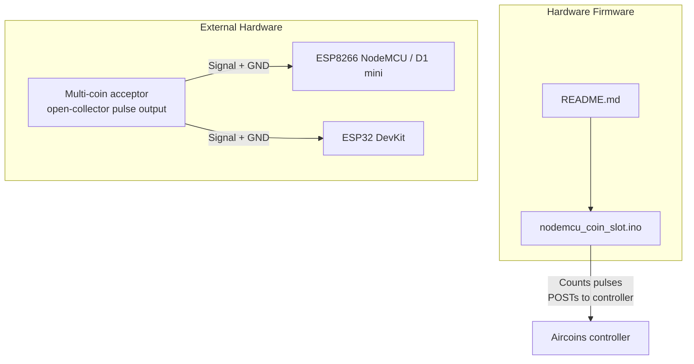
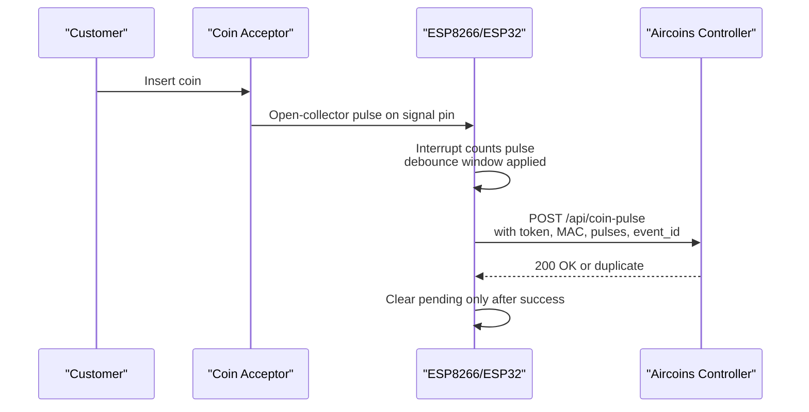
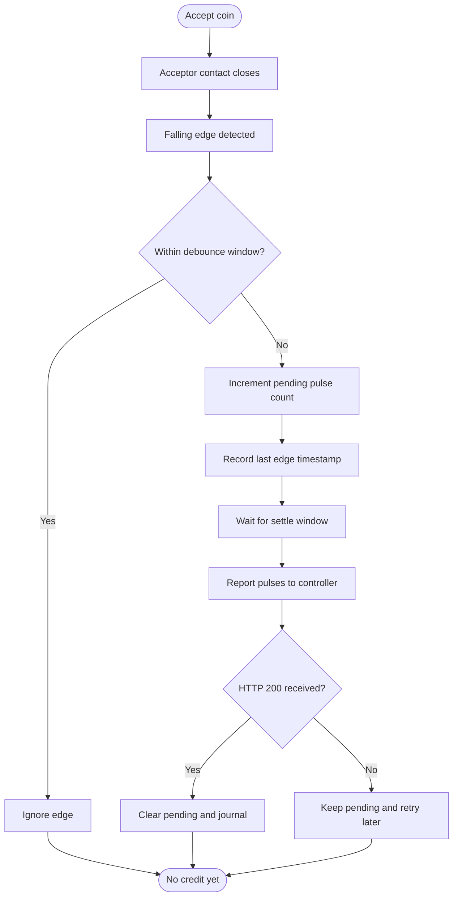
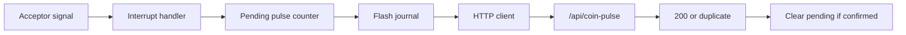

# Hardware Wiring & Installation

<cite>
**Referenced Files in This Document**   
- [nodemcu_coin_slot.ino](file://hardware/nodemcu_coin_slot/nodemcu_coin_slot.ino)
- [README.md](file://hardware/nodemcu_coin_slot/README.md)
</cite>

## Table of Contents
1. [Introduction](#introduction)
2. [Project Structure](#project-structure)
3. [Core Components](#core-components)
4. [Architecture Overview](#architecture-overview)
5. [Detailed Component Analysis](#detailed-component-analysis)
6. [Dependency Analysis](#dependency-analysis)
7. [Performance Considerations](#performance-considerations)
8. [Troubleshooting Guide](#troubleshooting-guide)
9. [Conclusion](#conclusion)

## Introduction
This document is a practical wiring and installation guide for connecting physical multi-coin acceptors to the Aircoins coin-slot firmware running on ESP8266 (NodeMCU/D1 mini) or ESP32 boards. It explains how the acceptor’s pulse signal connects to the microcontroller, why pull-up resistors and voltage dividers are required, which pins to use, and how to avoid common hardware mistakes such as double-counting, missed coins, and floating inputs.

The firmware counts pulses from the acceptor and reports them to the Aircoins controller over HTTP. The controller then converts those pulses into hotspot access time based on operator-configured rates.

## Project Structure
The relevant hardware integration lives under the `hardware/nodemcu_coin_slot` directory:

**Diagram sources**
- [nodemcu_coin_slot.ino:1-64](file://hardware/nodemnu_coin_slot/nodemcu_coin_slot.ino#L1-L64)
- [README.md:11-24](file://hardware/nodemcu_coin_slot/README.md#L11-L24)

**Section sources**
- [nodemcu_coin_slot.ino:1-64](file://hardware/nodemcu_coin_slot/nodemcu_coin_slot.ino#L1-L64)
- [README.md:1-24](file://hardware/nodemcu_coin_slot/README.md#L1-L24)

## Core Components
- **Multi-coin acceptor:** Emits a short open-collector pulse when it accepts a coin. The contact typically closes for about 20–40 ms per coin.
- **Microcontroller board:** ESP8266 (NodeMCU/D1 mini) or ESP32 runs the coin-slot firmware.
- **Firmware:** Uses an interrupt-driven pulse counter, debounces mechanically noisy contacts, persists pending credits, and POSTs confirmed events to the controller.
- **Controller API:** Accepts `/api/coin-pulse` with a shared token and returns confirmation including duplicate detection and remaining session balance.

Key implementation facts:
- The acceptor signal pin is configured as an input with an internal pull-up enabled by the firmware.
- The firmware attaches a falling-edge interrupt to count pulses reliably even during Wi-Fi association or network outages.
- Pending pulses are saved to flash before being sent; they are cleared only after a successful controller response.

**Section sources**
- [nodemcu_coin_slot.ino:30-48](file://hardware/nodemcu_coin_slot/nodemcu_coin_slot.ino#L30-L48)
- [nodemcu_coin_slot.ino:145-150](file://hardware/nodemcu_coin_slot/nodemcu_coin_slot.ino#L145-L150)
- [nodemcu_coin_slot.ino:220-234](file://hardware/nodemcu_coin_slot/nodemcu_coin_slot.ino#L220-L234)
- [nodemcu_coin_slot.ino:478-482](file://hardware/nodemcu_coin_slot/nodemcu_coin_slot.ino#L478-L482)
- [nodemcu_coin_slot.ino:538-575](file://hardware/nodemcu_coin_slot/nodemcu_coin_slot.ino#L538-L575)

## Architecture Overview
The physical integration path is simple: the acceptor provides a dry-switch-like pulse that the microcontroller detects via an interrupt. The firmware does not decide coin value; it sends pulse counts to the controller, which applies pricing rules.

**Diagram sources**
- [nodemcu_coin_slot.ino:30-48](file://hardware/nodemcu_coin_slot/nodemcu_coin_slot.ino#L30-L48)
- [nodemcu_coin_slot.ino:220-234](file://hardware/nodemcu_coin_slot/nodemcu_coin_slot.ino#L220-L234)
- [nodemcu_coin_slot.ino:374-449](file://hardware/nodemcu_coin_slot/nodemcu_coin_slot.ino#L374-L449)
- [nodemcu_coin_slot.ino:538-575](file://hardware/nodemcu_coin_slot/nodemcu_coin_slot.ino#L538-L575)

## Detailed Component Analysis

### Electrical Connections and Pin Mapping
The firmware defines the acceptor signal pin as:
- ESP8266: GPIO 14, labeled `D5` on NodeMCU boards.
- ESP32: A free GPIO, default example `GPIO 27`.

Ground must be shared between the acceptor and the microcontroller.

Recommended wiring table:

| NodeMCU (ESP8266) | ESP32 | Connects to | Notes |
| --- | --- | --- | --- |
| `D5` / GPIO 14 | GPIO 27 (any free pin) | Acceptor signal | Falling-edge interrupt input |
| `GND` | `GND` | Acceptor GND | Common ground required |
| `3V3` | `3V3` | Optional pull-up resistor | 10 kOhm pull-up to 3V3 recommended |

Important safety rule:
- Do not connect 5 V directly to any ESP input pin. Doing so can destroy the microcontroller.
- If the acceptor uses a 5 V open-collector output, add a voltage divider between the acceptor signal and the ESP pin.

Voltage divider guidance:
- Use approximately 1 kOhm from the acceptor signal to the ESP input pin.
- Use approximately 2.2 kOhm from the ESP input pin to GND.
- This reduces the 5 V logic level to a safe 3.3 V-compatible level while preserving the open-collector switching behavior.

Pull-up resistor guidance:
- Fit a 10 kOhm pull-up between the signal pin and 3V3.
- The firmware enables an internal pull-up (`INPUT_PULLUP`) as a secondary safety net, but an external 10 kOhm pull-up is more reliable near noisy mechanical switches.

Grounding procedure:
- Always connect acceptor GND to the ESP/GND rail.
- Without a common ground, the ESP cannot interpret the open-collector switch correctly, leading to missed or spurious counts.

**Section sources**
- [nodemcu_coin_slot.ino:37-47](file://hardware/nodemcu_coin_slot/nodemcu_coin_slot.ino#L37-L47)
- [nodemcu_coin_slot.ino:145-150](file://hardware/nodemcu_coin_slot/nodemcu_coin_slot.ino#L145-L150)
- [nodemcu_coin_slot.ino:478-482](file://hardware/nodemcu_coin_slot/nodemcu_coin_slot.ino#L478-L482)
- [README.md:26-48](file://hardware/nodemcu_coin_slot/README.md#L26-L48)

### Signal Behavior and Debouncing
A multi-coin acceptor closes its internal contact briefly for each accepted coin. Because this pulse is short and mechanical contacts bounce, the firmware:
- Attaches an interrupt on the falling edge.
- Uses a time-window debounce rather than a simple “ignore next edge” flag.
- Ignores edges within a short window after a counted pulse.

This design avoids two major failure modes:
- Double-counting due to contact bounce.
- Merging distinct coins when the debounce window is too long.

**Diagram sources**
- [nodemcu_coin_slot.ino:152-175](file://hardware/nodemcu_coin_slot/nodemcu_coin_slot.ino#L152-L175)
- [nodemcu_coin_slot.ino:220-234](file://hardware/nodemcu_coin_slot/nodemcu_coin_slot.ino#L220-L234)
- [nodemcu_coin_slot.ino:515-575](file://hardware/nodemcu_coin_slot/nodemcu_coin_slot.ino#L515-L575)

**Section sources**
- [nodemcu_coin_slot.ino:152-175](file://hardware/nodemcu_coin_slot/nodemcu_coin_slot.ino#L152-L175)
- [nodemcu_coin_slot.ino:220-234](file://hardware/nodemcu_coin_slot/nodemcu_coin_slot.ino#L220-L234)
- [nodemcu_coin_slot.ino:515-575](file://hardware/nodemcu_coin_slot/nodemcu_coin_slot.ino#L515-L575)

### Safety Warnings
- Never wire 5 V directly to ESP8266 or ESP32 input pins.
- Always use a voltage divider when the acceptor outputs 5 V logic.
- Always share ground between the acceptor and the microcontroller.
- Use a 10 kOhm pull-up to 3V3 for reliable open-collector operation.
- Treat the coin slot as a real-money interface: miswiring can cause lost coins or incorrect charges.

**Section sources**
- [nodemcu_coin_slot.ino:42-47](file://hardware/nodemcu_coin_slot/nodemcu_coin_slot.ino#L42-L47)
- [README.md:37-48](file://hardware/nodemcu_coin_slot/README.md#L37-L48)

### Types of Coin Acceptors and Wiring Requirements
- **Open-collector pulse acceptor:** Most common multi-coin acceptors. They close a switch contact for a short time per coin. Wire the signal to the ESP input and add a pull-up to 3V3.
- **5 V open-collector acceptor:** Larger units often use 5 V logic. Use the recommended voltage divider before connecting to the ESP input.
- **Pulse-only acceptor:** Sends no denomination information. The firmware sends pulse counts, and the controller assigns value based on configured rates.
- **Recognizer acceptor with denomination data:** Can send seconds or amount fields instead of pulses. The firmware supports those fields when present, but a plain pulse counter should leave them out so pricing remains consistent with the controller configuration.

**Section sources**
- [nodemcu_coin_slot.ino:16-27](file://hardware/nodemcu_coin_slot/nodemcu_coin_slot.ino#L16-L27)
- [nodemcu_coin_slot.ino:30-47](file://hardware/nodemcu_coin_slot/nodemcu_coin_slot.ino#L30-L47)
- [README.md:26-48](file://hardware/nodemcu_coin_slot/README.md#L26-L48)

## Dependency Analysis
At the hardware level, the firmware depends on:
- Stable Wi-Fi connectivity to report pulses.
- Correct interrupt pin configuration.
- Reliable electrical signaling from the acceptor.
- A matching controller token and endpoint.

At the code level:
- The interrupt handler updates a volatile pulse counter.
- The main loop batches pulses, persists them to flash, and posts them to the controller.
- Successful responses clear pending state; failures keep pending state for retry.

**Diagram sources**
- [nodemcu_coin_slot.ino:220-234](file://hardware/nodemcu_coin_slot/nodemcu_coin_slot.ino#L220-L234)
- [nodemcu_coin_slot.ino:249-297](file://hardware/nodemcu_coin_slot/nodemcu_coin_slot.ino#L249-L297)
- [nodemcu_coin_slot.ino:374-449](file://hardware/nodemcu_coin_slot/nodemcu_coin_slot.ino#L374-L449)
- [nodemcu_coin_slot.ino:538-575](file://hardware/nodemcu_coin_slot/nodemcu_coin_slot.ino#L538-L575)

**Section sources**
- [nodemcu_coin_slot.ino:220-234](file://hardware/nodemcu_coin_slot/nodemcu_coin_slot.ino#L220-L234)
- [nodemcu_coin_slot.ino:249-297](file://hardware/nodemcu_coin_slot/nodemcu_coin_slot.ino#L249-L297)
- [nodemcu_coin_slot.ino:374-449](file://hardware/nodemcu_coin_slot/nodemcu_coin_slot.ino#L374-L449)
- [nodemcu_coin_slot.ino:538-575](file://hardware/nodemcu_coin_slot/nodemcu_coin_slot.ino#L538-L575)

## Performance Considerations
- **Interrupt-driven counting:** Ensures short pulses are not missed even when Wi-Fi is reconnecting.
- **Debouncing window:** Prevents bounce-induced double-counting while avoiding merging separate coins.
- **Batch reporting:** Limits request size and reduces UI flicker by waiting briefly after the last pulse.
- **Flash journaling:** Survives power loss and prevents lost coins during network or controller outages.
- **Rate-limited Wi-Fi association:** Avoids degrading the hotspot for paying customers when the controller is down.

[No sources needed since this section summarizes previously analyzed behavior]

## Troubleshooting Guide

### Wiring Problems
| Symptom | Likely Cause | Fix |
| --- | --- | --- |
| One coin counted twice | Missing or weak pull-up; floating signal pin | Add a 10 kOhm pull-up from signal pin to 3V3 and verify common GND |
| Coin not counted at all | No signal, wrong pin, or 5 V logic connected directly | Confirm correct pin mapping; use voltage divider for 5 V open-collector outputs |
| Intermittent counting | Poor grounding or loose wires | Secure GND connection and check wiring continuity |
| Board damaged after wiring | 5 V connected directly to ESP input | Replace damaged board; install proper voltage divider |

### Configuration Problems
| Symptom | Likely Cause | Fix |
| --- | --- | --- |
| Controller rejects reports | `COIN_NODE_TOKEN` mismatch | Set the same token on the firmware and controller |
| Balance never moves despite `200` | Wrong `CLIENT_MAC` | Match the MAC printed on boot with the portal query |
| HTTP 400 from controller | Sketch/controller settings disagreement | Restart controller after changing rate/token settings |
| `[wifi] association failed` | Wrong SSID/password or out of range | Fix Wi-Fi credentials; pulses still queue in flash |

### Mechanical and Timing Problems
| Symptom | Likely Cause | Fix |
| --- | --- | --- |
| Double-counting | Bounce or missing pull-up | Improve pull-up and wiring; adjust debounce timing only if necessary |
| Missed rapid multi-coin bursts | Debounce window too long | Review acceptor timing; avoid excessive debounce values |
| Float pin behavior | Open-collector output without pull-up | Install 10 kOhm pull-up to 3V3 |

**Section sources**
- [README.md:145-154](file://hardware/nodemcu_coin_slot/README.md#L145-L154)
- [nodemcu_coin_slot.ino:152-175](file://hardware/nodemcu_coin_slot/nodemcu_coin_slot.ino#L152-L175)
- [nodemcu_coin_slot.ino:468-482](file://hardware/nodemcu_coin_slot/nodemcu_coin_slot.ino#L468-L482)

## Conclusion
Reliable coin acceptance depends first on correct wiring and second on robust firmware behavior. For most multi-coin acceptors:
- Connect the acceptor signal to ESP8266 `D5`/GPIO 14 or ESP32 GPIO 27.
- Share GND between the acceptor and the microcontroller.
- Install a 10 kOhm pull-up from the signal pin to 3V3.
- Use a voltage divider if the acceptor outputs 5 V logic.
- Verify the controller token, MAC address, and Wi-Fi configuration.

When wired correctly, the firmware counts pulses safely, survives power loss, retries failed reports, and ensures customers are charged exactly once.

[No sources needed since this section summarizes without analyzing specific files]