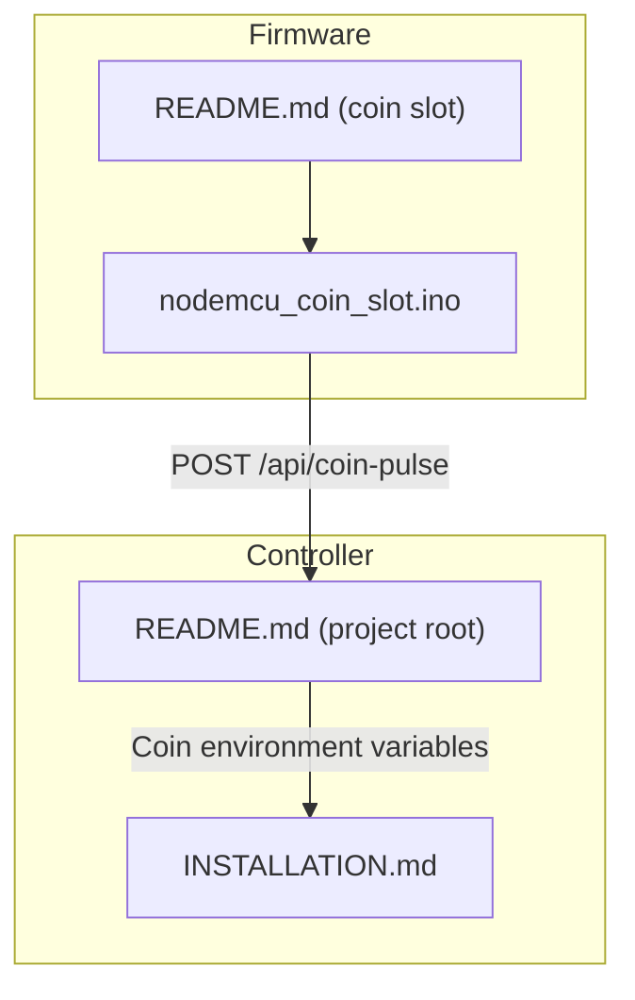
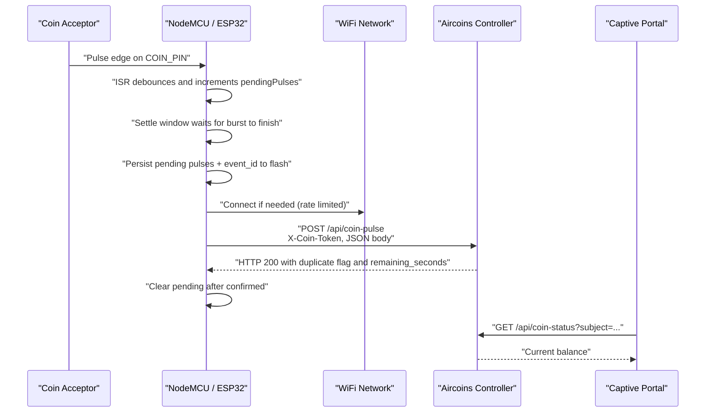
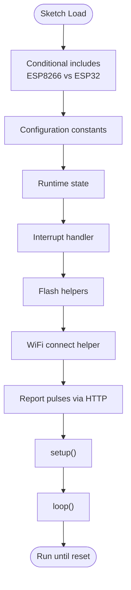
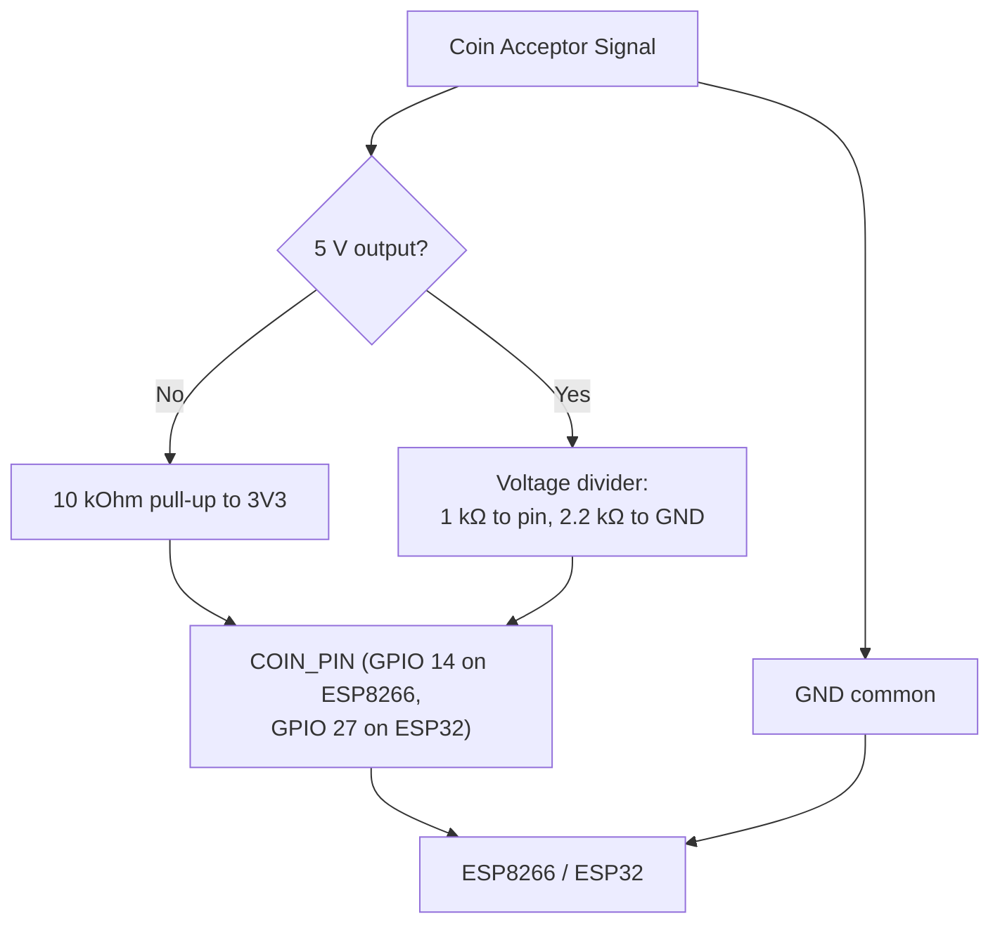
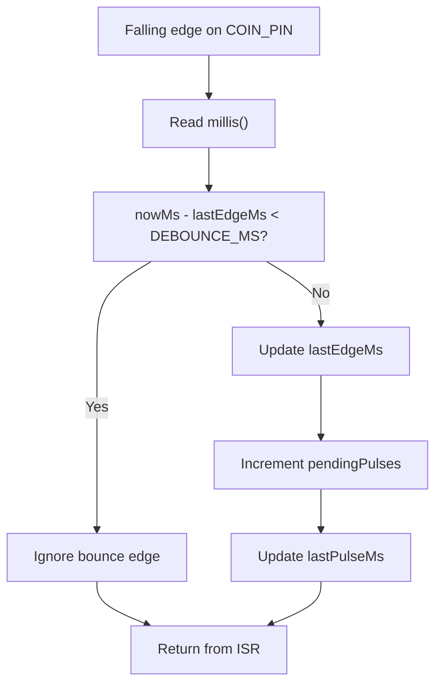
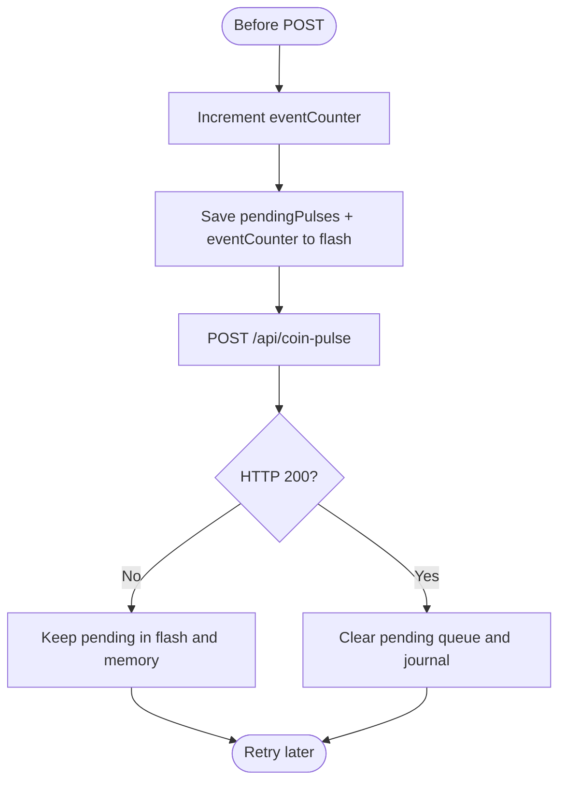
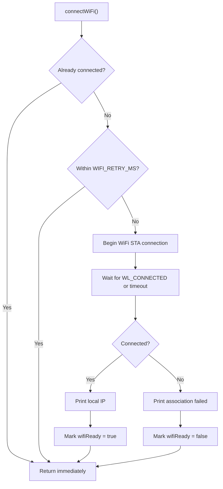
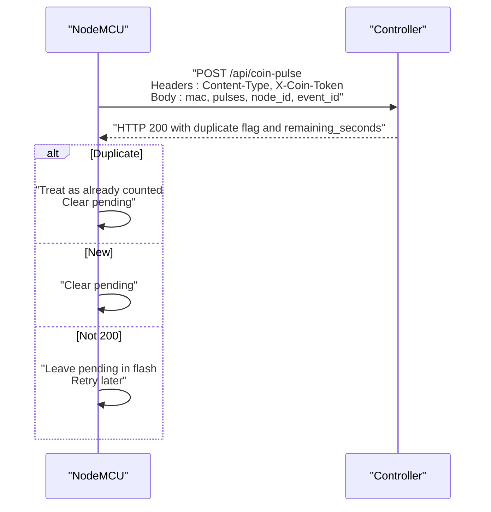
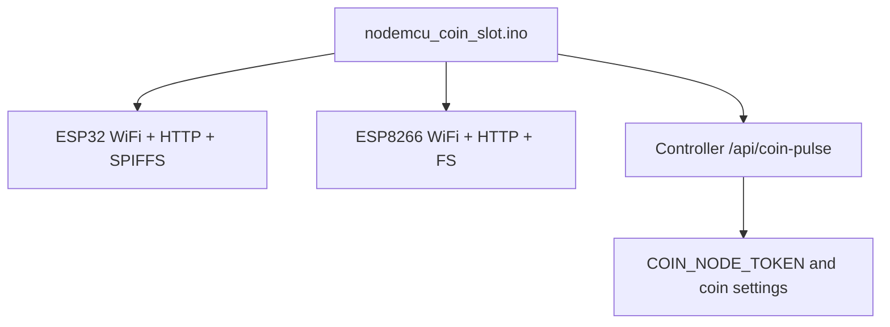

# NodeMCU Firmware Setup

<cite>
**Referenced Files in This Document**
- [nodemcu_coin_slot.ino](file://hardware/nodemcu_coin_slot/nodemcu_coin_slot.ino)
- [README.md (NodeMCU coin slot)](file://hardware/nodemcu_coin_slot/README.md)
- [README.md (Project root)](file://README.md)
- [INSTALLATION.md](file://INSTALLATION.md)
</cite>

## Table of Contents
1. [Introduction](#introduction)
2. [Project Structure](#project-structure)
3. [Core Components](#core-components)
4. [Architecture Overview](#architecture-overview)
5. [Detailed Component Analysis](#detailed-component-analysis)
6. [Dependency Analysis](#dependency-analysis)
7. [Performance Considerations](#performance-considerations)
8. [Troubleshooting Guide](#troubleshooting-guide)
9. [Conclusion](#conclusion)
10. [Appendices](#appendices)

## Introduction
This document explains how to set up and configure the NodeMCU firmware that counts pulses from a coin acceptor and reports them to the Aircoins MikroTik controller. It covers hardware wiring, Arduino sketch structure, pin configuration, firmware constants, interrupt-based pulse counting, debouncing, credit persistence through flash storage, flashing instructions, serial monitor interpretation, and WiFi connectivity troubleshooting. It also clarifies kiosk mode versus customer device modes and how MAC address selection affects credit attribution.

The firmware is intentionally simple: it does not decide coin value. It counts pulses and sends them to the controller, which converts pulses into hotspot access time based on operator-configured rates.

## Project Structure
The relevant firmware lives under `hardware/nodemcu_coin_slot/`:

- `nodemcu_coin_slot.ino` — Arduino sketch for ESP8266 and ESP32.
- `README.md` — Wiring, setup, verification, and troubleshooting notes for the coin slot.



**Diagram sources**
- [nodemcu_coin_slot.ino:1-64](file://hardware/nodemcu_coin_slot/nodemcu_coin_slot.ino#L1-L64)
- [README.md (NodeMCU coin slot):11-24](file://hardware/nodemcu_coin_slot/README.md#L11-L24)
- [README.md (Project root):91-106](file://README.md#L91-L106)

**Section sources**
- [nodemcu_coin_slot.ino:1-64](file://hardware/nodemcu_coin_slot/nodemcu_coin_slot.ino#L1-L64)
- [README.md (NodeMCU coin slot):1-24](file://hardware/nodemcu_coin_slot/README.md#L1-L24)

## Core Components
The firmware implements:

- Configuration constants for token, controller host, WiFi credentials, client MAC, node identifier, and coin signal pin.
- An interrupt service routine (ISR) that increments a volatile counter with time-window debouncing.
- A settle-and-batch reporting loop that persists pending credits to flash before sending HTTP requests.
- WiFi association logic with rate-limited retries.
- Serial diagnostics and an onboard LED indicator.

Key responsibilities:

| Area | Responsibility |
| --- | --- |
| Interrupt handling | Count edges safely without blocking or heavy work. |
| Debouncing | Avoid double-counting mechanical contact bounce. |
| Persistence | Save pending pulses and event IDs to flash so power loss does not lose coins. |
| Reporting | POST pulses to `/api/coin-pulse` with a shared token and monotonic event ID. |
| WiFi management | Connect once per retry window; do not hammer the AP. |
| Diagnostics | Print boot info, connection status, and coin report results at 115200 baud. |

**Section sources**
- [nodemcu_coin_slot.ino:116-193](file://hardware/nodemcu_coin_slot/nodemcu_coin_slot.ino#L116-L193)
- [nodemcu_coin_slot.ino:210-234](file://hardware/nodemcu_coin_slot/nodemcu_coin_slot.ino#L210-L234)
- [nodemcu_coin_slot.ino:238-297](file://hardware/nodemcu_coin_slot/nodemcu_coin_slot.ino#L238-L297)
- [nodemcu_coin_slot.ino:299-343](file://hardware/nodemcu_coin_slot/nodemcu_coin_slot.ino#L299-L343)
- [nodemcu_coin_slot.ino:347-450](file://hardware/nodemcu_coin_slot/nodemcu_coin_slot.ino#L347-L450)
- [nodemcu_coin_slot.ino:454-576](file://hardware/nodemcu_coin_slot/nodemcu_coin_slot.ino#L454-L576)

## Architecture Overview
The coin slot firmware runs on an ESP8266 or ESP32 board connected to a coin acceptor. It connects to the local WiFi network and posts pulse events to the Aircoins controller. The controller then grants hotspot session time to the target client identified by MAC address.



**Diagram sources**
- [nodemcu_coin_slot.ino:210-234](file://hardware/nodemcu_coin_slot/nodemcu_coin_slot.ino#L210-L234)
- [nodemcu_coin_slot.ino:347-450](file://hardware/nodemcu_coin_slot/nodemcu_coin_slot.ino#L347-L450)
- [README.md (NodeMCU coin slot):11-24](file://hardware/nodemcu_coin_slot/README.md#L11-L24)

## Detailed Component Analysis

### Arduino Sketch Structure
The sketch is organized into logical sections:

- Header comments explaining purpose, API contract, wiring, and setup.
- Conditional includes for ESP8266 and ESP32.
- Flash journal path definition.
- Configuration constants.
- Runtime state variables.
- ISR implementation.
- Flash storage helpers.
- WiFi connection helper.
- Credit attribution and HTTP reporting.
- `setup()` initialization.
- `loop()` processing and batching.



**Diagram sources**
- [nodemcu_coin_slot.ino:101-114](file://hardware/nodemcu_coin_slot/nodemcu_coin_slot.ino#L101-L114)
- [nodemcu_coin_slot.ino:116-193](file://hardware/nodemcu_coin_slot/nodemcu_coin_slot.ino#L116-L193)
- [nodemcu_coin_slot.ino:194-209](file://hardware/nodemcu_coin_slot/nodemcu_coin_slot.ino#L194-L209)
- [nodemcu_coin_slot.ino:210-234](file://hardware/nodemcu_coin_slot/nodemcu_coin_slot.ino#L210-L234)
- [nodemcu_coin_slot.ino:238-297](file://hardware/nodemcu_coin_slot/nodemcu_coin_slot.ino#L238-L297)
- [nodemcu_coin_slot.ino:299-343](file://hardware/nodemcu_coin_slot/nodemcu_coin_slot.ino#L299-L343)
- [nodemcu_coin_slot.ino:347-450](file://hardware/nodemcu_coin_slot/nodemcu_coin_slot.ino#L347-L450)
- [nodemcu_coin_slot.ino:454-576](file://hardware/nodemcu_coin_slot/nodemcu_coin_slot.ino#L454-L576)

**Section sources**
- [nodemcu_coin_slot.ino:1-114](file://hardware/nodemcu_coin_slot/nodemcu_coin_slot.ino#L1-L114)
- [nodemcu_coin_slot.ino:116-576](file://hardware/nodemcu_coin_slot/nodemcu_coin_slot.ino#L116-L576)

### Pin Configurations and Hardware Requirements
- Signal input pin:
  - ESP8266: GPIO 14 (D5).
  - ESP32: configurable free GPIO, default example uses GPIO 27.
- Ground must be connected between the acceptor and the board.
- Pull-up resistor:
  - Fit a 10 kOhm pull-up between the signal pin and 3V3.
  - The internal pull-up is enabled as a secondary safety net, but an external resistor is strongly recommended near the coin mechanism.
- 5 V acceptors:
  - If the acceptor outputs 5 V open-collector, use a voltage divider: 1 kOhm from signal to pin and 2.2 kOhm from pin to GND.
  - Do not wire 5 V directly to the ESP pin; it can destroy the chip.



**Diagram sources**
- [nodemcu_coin_slot.ino:145-150](file://hardware/nodemcu_coin_slot/nodemcu_coin_slot.ino#L145-L150)
- [README.md (NodeMCU coin slot):26-48](file://hardware/nodemcu_coin_slot/README.md#L26-L48)

**Section sources**
- [nodemcu_coin_slot.ino:145-150](file://hardware/nodemcu_coin_slot/nodemcu_coin_slot.ino#L145-L150)
- [README.md (NodeMCU coin slot):26-48](file://hardware/nodemcu_coin_slot/README.md#L26-L48)

### Firmware Constants and Their Roles
| Constant | Role | Notes |
| --- | --- | --- |
| `COIN_NODE_TOKEN` | Shared secret sent in `X-Coin-Token` header | Must match the controller’s `COIN_NODE_TOKEN`. Without it, the controller rejects every report. |
| `CONTROLLER_HOST` | Target controller hostname or IP | Hostname works if DNS resolves; IP is more reliable on small networks. |
| `CONTROLLER_PORT` | HTTP port used for `/api/coin-pulse` | Default is 80. |
| `WIFI_SSID` | WiFi network name | The kiosk connects to this SSID. |
| `WIFI_PASSWORD` | WiFi password | Required for STA connection. |
| `CLIENT_MAC` | Client whose balance receives credit | Leave empty for kiosk mode; otherwise set to the customer’s phone MAC. |
| `NODE_ID` | Unique identifier for this acceptor box | Used in audit trail and event IDs. |
| `COIN_PIN` | GPIO pin wired to acceptor signal | Defaults differ between ESP8266 and ESP32. |
| `DEBOUNCE_MS` | Time window to ignore repeated edges | Prevents double-counting due to contact bounce. |
| `MAX_PULSES_PER_REPORT` | Maximum pulses per HTTP request | Batches bursts while bounding request size. |
| `SETTLE_MS` | Wait after last pulse before reporting | Groups rapid coin drops into one update. |
| `WIFI_RETRY_MS` | Minimum interval between WiFi association attempts | Prevents radio hammering. |
| `WIFI_CONNECT_TIMEOUT_MS` | Timeout for a single association attempt | Controls blocking connect duration. |

These constants are defined in the configuration section of the sketch and control authentication, networking, credit attribution, hardware behavior, and reliability.

**Section sources**
- [nodemcu_coin_slot.ino:116-193](file://hardware/nodemcu_coin_slot/nodemcu_coin_slot.ino#L116-L193)

### Interrupt-Based Pulse Counting and Debouncing
The coin acceptor emits short pulses when a coin is accepted. The firmware uses an interrupt-driven approach:

- The ISR reads `millis()` and compares the current edge timestamp with the last counted edge.
- If the difference is less than `DEBOUNCE_MS`, the edge is ignored as bounce.
- Otherwise, the ISR increments `pendingPulses` and updates the last pulse timestamp.
- The ISR performs minimal work to avoid missing fast bursts.



**Diagram sources**
- [nodemcu_coin_slot.ino:210-234](file://hardware/nodemcu_coin_slot/nodemcu_coin_slot.ino#L210-L234)
- [nodemcu_coin_slot.ino:152-175](file://hardware/nodemcu_coin_slot/nodemcu_coin_slot.ino#L152-L175)

**Section sources**
- [nodemcu_coin_slot.ino:210-234](file://hardware/nodemcu_coin_slot/nodemcu_coin_slot.ino#L210-L234)
- [nodemcu_coin_slot.ino:152-175](file://hardware/nodemcu_coin_slot/nodemcu_coin_slot.ino#L152-L175)

### Credit Persistence Using Flash Storage
Pending pulses and the last event ID are persisted to SPIFFS so a power cut does not lose a customer’s coin:

- Before sending a report, the firmware increments `eventCounter`, writes `pendingPulses` and `eventCounter` to a small text file, and then attempts the HTTP POST.
- Only after receiving HTTP 200 does it clear the pending queue and remove the journal file.
- On reboot, the firmware loads any unacknowledged pulses and resumes the monotonic event counter.



**Diagram sources**
- [nodemcu_coin_slot.ino:238-297](file://hardware/nodemcu_coin_slot/nodemcu_coin_slot.ino#L238-L297)
- [nodemcu_coin_slot.ino:538-575](file://hardware/nodemcu_coin_slot/nodemcu_coin_slot.ino#L538-L575)

**Section sources**
- [nodemcu_coin_slot.ino:238-297](file://hardware/nodemcu_coin_slot/nodemcu_coin_slot.ino#L238-L297)
- [nodemcu_coin_slot.ino:484-495](file://hardware/nodemcu_coin_slot/nodemcu_coin_slot.ino#L484-L495)
- [nodemcu_coin_slot.ino:538-575](file://hardware/nodemcu_coin_slot/nodemcu_coin_slot.ino#L538-L575)

### WiFi Connectivity Flow
WiFi association is performed in a controlled way:

- Connection attempts are rate-limited by `WIFI_RETRY_MS`.
- Each attempt blocks briefly while waiting for association, calling `yield()` to avoid watchdog resets.
- Successful connection prints the local IP; failure prints a retry message.
- Pulses continue accumulating during failed association because they are stored in flash.



**Diagram sources**
- [nodemcu_coin_slot.ino:299-343](file://hardware/nodemcu_coin_slot/nodemcu_coin_slot.ino#L299-L343)
- [nodemcu_coin_slot.ino:187-192](file://hardware/nodemcu_coin_slot/nodemcu_coin_slot.ino#L187-L192)

**Section sources**
- [nodemcu_coin_slot.ino:299-343](file://hardware/nodemcu_coin_slot/nodemcu_coin_slot.ino#L299-L343)
- [nodemcu_coin_slot.ino:187-192](file://hardware/nodemcu_coin_slot/nodemcu_coin_slot.ino#L187-L192)

### Kiosk Mode and Customer Device Modes
The firmware supports two primary deployment modes:

| Mode | CLIENT_MAC Behavior | Use Case |
| --- | --- | --- |
| Kiosk mode | Leave `CLIENT_MAC` empty. The board uses its own station MAC. | The machine itself is the hotspot client. |
| Customer device mode | Set `CLIENT_MAC` to the customer’s phone MAC. | Credits are attributed to the customer’s device. |

When `CLIENT_MAC` is empty, the sketch prints the board’s MAC address on boot. When set explicitly, it prints the configured MAC. The controller normalizes MAC separators, so different formats are treated equivalently.

**Section sources**
- [nodemcu_coin_slot.ino:131-141](file://hardware/nodemcu_coin_slot/nodemcu_coin_slot.ino#L131-L141)
- [nodemcu_coin_slot.ino:355-365](file://hardware/nodemcu_coin_slot/nodemcu_coin_slot.ino#L355-L365)
- [README.md (NodeMCU coin slot):78-87](file://hardware/nodemcu_coin_slot/README.md#L78-L87)

### HTTP Reporting Contract
The firmware posts JSON to `/api/coin-pulse` with:

- Header: `Content-Type: application/json`
- Header: `X-Coin-Token: <COIN_NODE_TOKEN>`
- Body fields:
  - `mac`: client MAC address.
  - `pulses`: number of pulses reported.
  - `node_id`: acceptor identifier.
  - `event_id`: monotonic event identifier including `NODE_ID`.

A response with HTTP 200 is considered success. A response containing `"duplicate":true` means the controller already counted the event; the firmware still clears pending credit because the customer has been charged exactly once. Other responses leave pending pulses in flash for retry.



**Diagram sources**
- [nodemcu_coin_slot.ino:374-450](file://hardware/nodemcu_coin_slot/nodemcu_coin_slot.ino#L374-L450)

**Section sources**
- [nodemcu_coin_slot.ino:374-450](file://hardware/nodemcu_coin_slot/nodemcu_coin_slot.ino#L374-L450)

## Dependency Analysis
The firmware depends on platform-specific WiFi and HTTP libraries, plus SPIFFS for persistence:

- ESP32: `WiFi.h`, `HTTPClient.h`, `SPIFFS.h`.
- ESP8266: `ESP8266WiFi.h`, `ESP8266HTTPClient.h`, `FS.h`.

The controller side exposes `/api/coin-pulse` and `/api/coin-status`, and requires the `COIN_NODE_TOKEN` environment variable to accept reports.



**Diagram sources**
- [nodemcu_coin_slot.ino:101-110](file://hardware/nodemcu_coin_slot/nodemcu_coin_slot.ino#L101-L110)
- [README.md (Project root):91-106](file://README.md#L91-L106)

**Section sources**
- [nodemcu_coin_slot.ino:101-110](file://hardware/nodemcu_coin_slot/nodemcu_coin_slot.ino#L101-L110)
- [README.md (Project root):91-106](file://README.md#L91-L106)

## Performance Considerations
- Keep the ISR minimal: only increment counters and timestamps.
- Use fixed-size buffers instead of dynamic string concatenation to avoid heap fragmentation on long-running kiosks.
- Batch pulses up to `MAX_PULSES_PER_REPORT` to reduce request overhead while bounding payload size.
- Rate-limit WiFi association to avoid degrading the shared access point.
- Persist pending data before attempting network I/O so transient failures do not lose coins.
- Disable interrupts around read-modify-write of the pending counter to prevent losing an edge mid-subtraction.

[No sources needed since this section provides general guidance]

## Troubleshooting Guide

### Serial Monitor Output Interpretation
Open the serial monitor at 115200 baud. Expected observations include:

- Boot banner identifying the coin slot firmware.
- Warning if `COIN_NODE_TOKEN` is empty.
- Recovery messages for unacknowledged pulses from a previous run.
- WiFi connection status and local IP.
- MAC address being credited.
- Coin report lines showing pulses reported and balance changes.

Example expected line after a successful coin:

```text
[coin] reported 1 pulse(s), balance now 5 min
```

**Section sources**
- [nodemcu_coin_slot.ino:456-510](file://hardware/nodemcu_coin_slot/nodemcu_coin_slot.ino#L456-L510)
- [nodemcu_coin_slot.ino:436-447](file://hardware/nodemcu_coin_slot/nodemcu_coin_slot.ino#L436-L447)
- [README.md (NodeMCU coin slot):89-95](file://hardware/nodemcu_coin_slot/README.md#L89-L95)

### WiFi Connectivity Troubleshooting
Common symptoms and causes:

| Symptom | Likely Cause | Action |
| --- | --- | --- |
| `[wifi] association failed` on every boot | Wrong SSID/password or out of range. | Verify `WIFI_SSID` and `WIFI_PASSWORD`; check signal strength. |
| Board boots but no coin credit appears | Token mismatch or wrong MAC. | Confirm `COIN_NODE_TOKEN` matches controller; verify credited MAC. |
| Balance never moves although POST returns 200 | MAC is wrong. | Compare boot-printed MAC with portal query MAC. |
| One coin counted as two or none | Missing or incorrect pull-up or 5 V divider. | Add 10 kOhm pull-up; use voltage divider for 5 V acceptors. |
| HTTP 400 naming a field | Sketch edited without restarting controller or invalid numeric setting. | Restart controller and validate coin settings. |

**Section sources**
- [README.md (NodeMCU coin slot):145-154](file://hardware/nodemcu_coin_slot/README.md#L145-L154)
- [nodemcu_coin_slot.ino:310-343](file://hardware/nodemcu_coin_slot/nodemcu_coin_slot.ino#L310-L343)
- [nodemcu_coin_slot.ino:418-427](file://hardware/nodemcu_coin_slot/nodemcu_coin_slot.ino#L418-L427)

### Verifying Without Hardware
You can exercise the controller endpoints from a laptop to distinguish wiring faults from controller faults:

- POST to `/api/coin-pulse` with the correct token and a test event ID.
- Query `/api/coin-status` with the target MAC.
- A 401 response indicates a token mismatch.
- A 400 response indicates a validation error.
- A 200 response with `"duplicate":true` confirms idempotent retry behavior.

**Section sources**
- [README.md (NodeMCU coin slot):98-117](file://hardware/nodemcu_coin_slot/README.md#L98-L117)

### Flashing Instructions
The repository documents flashing through the Arduino IDE or compatible toolchain. General steps:

1. Install the appropriate board package for ESP8266 or ESP32.
2. Open `hardware/nodemcu_coin_slot/nodemcu_coin_slot.ino`.
3. Edit the configuration constants:
   - `COIN_NODE_TOKEN`
   - `CONTROLLER_HOST`
   - `WIFI_SSID`
   - `WIFI_PASSWORD`
   - `CLIENT_MAC`
   - `NODE_ID`
   - `COIN_PIN` if using a non-default pin.
4. Select the correct board and COM port.
5. Upload the sketch.
6. Open the serial monitor at 115200 baud.
7. Drop a coin and observe the `[coin] reported ...` line.

For controller-side coin configuration, ensure the controller’s `COIN_NODE_TOKEN` and related coin environment variables are set and the service restarted.

**Section sources**
- [README.md (NodeMCU coin slot):50-95](file://hardware/nodemcu_coin_slot/README.md#L50-L95)
- [nodemcu_coin_slot.ino:116-193](file://hardware/nodemcu_coin_slot/nodemcu_coin_slot.ino#L116-L193)
- [README.md (Project root):91-106](file://README.md#L91-L106)

## Conclusion
The NodeMCU coin slot firmware provides a robust, low-level pulse counter designed for unreliable environments. It prioritizes correctness over speed: interrupts capture edges, debouncing prevents bounce artifacts, flash persistence survives power cuts, and monotonic event IDs make retries safe. Proper wiring, correct configuration constants, and matching controller settings are essential. For most deployments, start with kiosk mode by leaving `CLIENT_MAC` empty, verify serial output, and then adjust MAC attribution and coin timing as needed.

[No sources needed since this section summarizes without analyzing specific files]

## Appendices

### Environment Variables on the Controller
The controller requires coin-related environment variables when a coin acceptor is fitted. Key variables include:

| Variable | Purpose |
| --- | --- |
| `COIN_NODE_TOKEN` | Shared secret for `/api/coin-pulse`. |
| `COIN_SECONDS_PER_PULSE` | Access time granted per pulse. |
| `COIN_CENTS_PER_PULSE` | Face value recorded for reconciliation. |
| `COIN_IDLE_TTL` | Lifetime of an inserted-but-unconnected balance. |
| `COIN_MAX_SESSION_MINUTES` | Cap on one “Done / Connect now” session. |

**Section sources**
- [README.md (Project root):91-106](file://README.md#L91-L106)