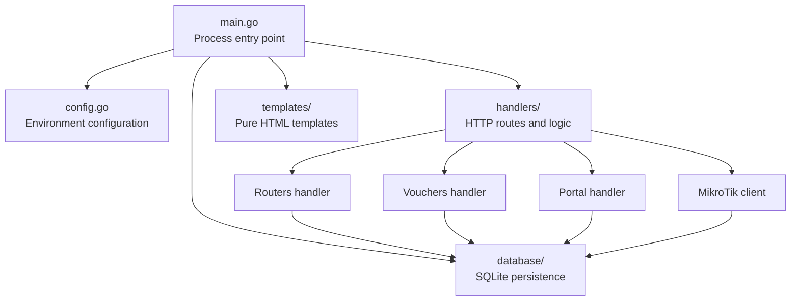
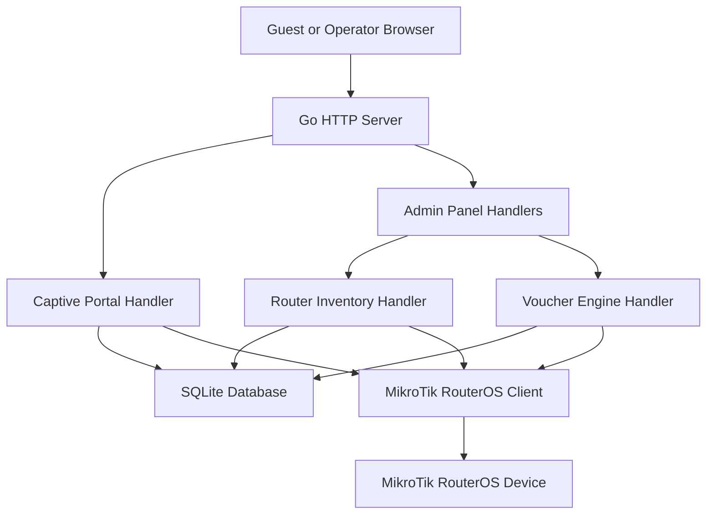
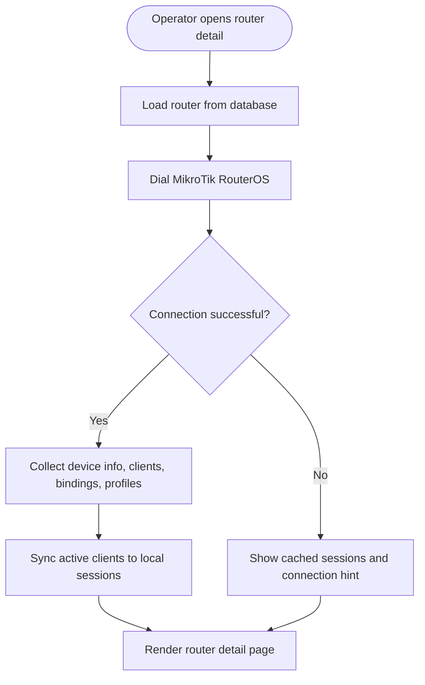
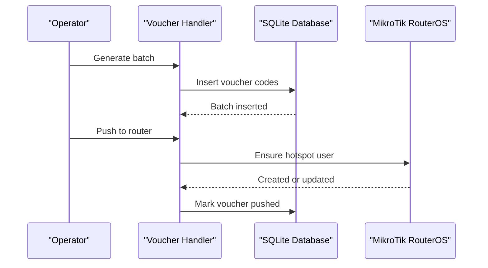
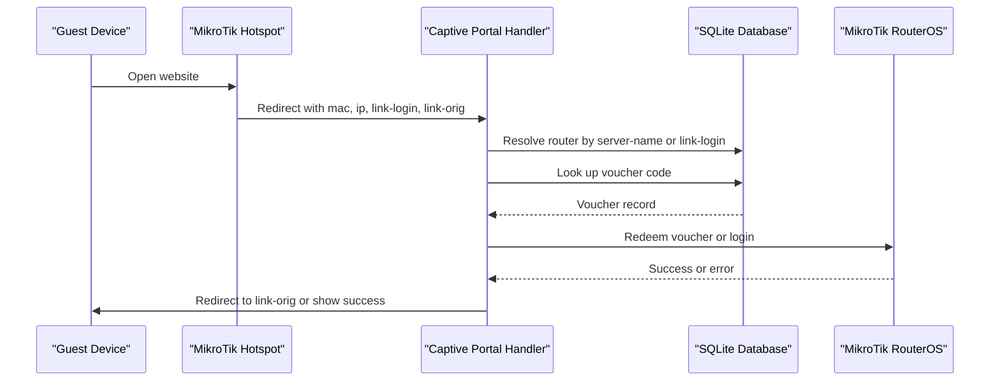
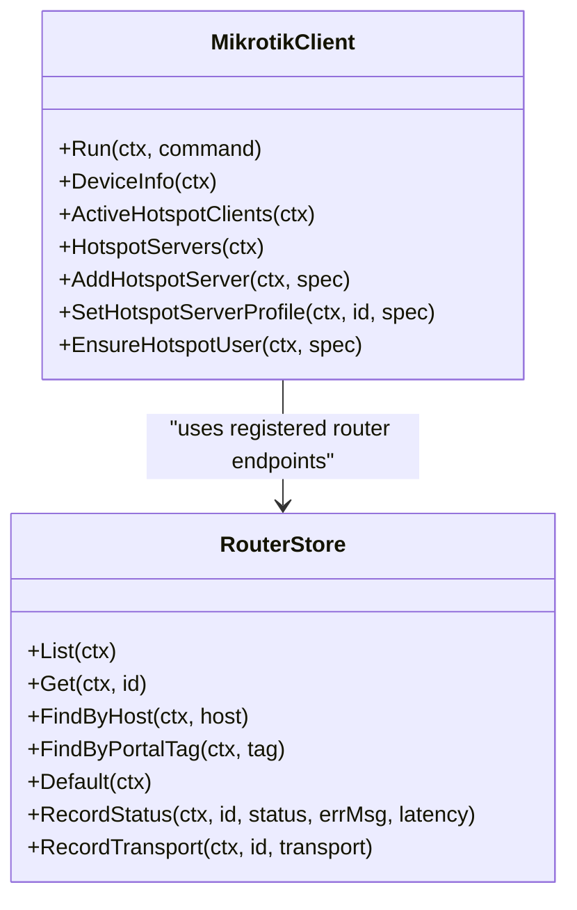
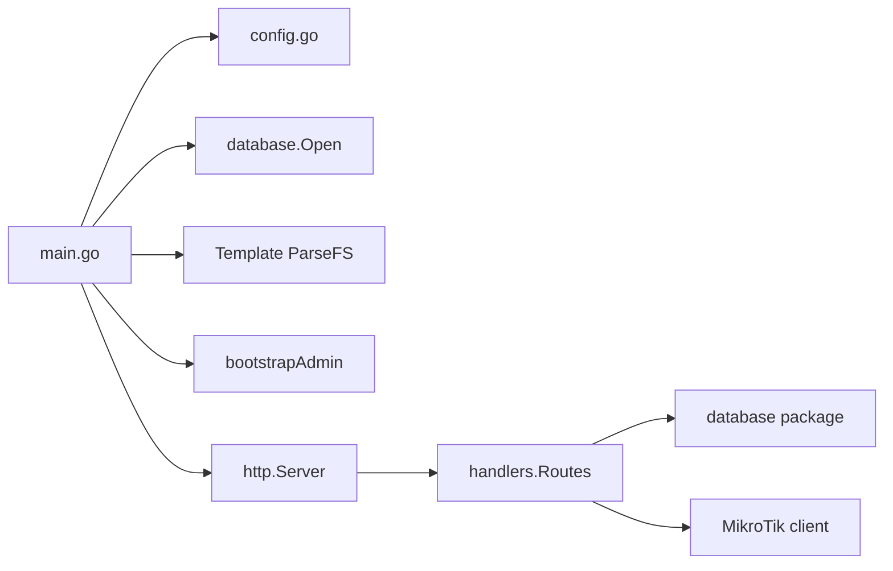

# Project Overview

<cite>
**Referenced Files in This Document**
- [README.md](file://README.md)
- [main.go](file://main.go)
- [config.go](file://config.go)
- [handlers/routers.go](file://handlers/routers.go)
- [database/routers.go](file://database/routers.go)
- [handlers/vouchers.go](file://handlers/vouchers.go)
- [handlers/portal.go](file://handlers/portal.go)
- [handlers/mikrotik_hotspot.go](file://handlers/mikrotik_hotspot.go)
- [handlers/mikrotik_hotspot_installer.go](file://handlers/mikrotik_hotspot_installer.go)
</cite>

## Table of Contents
1. [Introduction](#introduction)
2. [Project Structure](#project-structure)
3. [Core Components](#core-components)
4. [Architecture Overview](#architecture-overview)
5. [Detailed Component Analysis](#detailed-component-analysis)
6. [Dependency Analysis](#dependency-analysis)
7. [Performance Considerations](#performance-considerations)
8. [Troubleshooting Guide](#troubleshooting-guide)
9. [Conclusion](#conclusion)

## Introduction
Aircoins MikroTik Controller is a centralized MikroTik Hotspot Controller designed for WiFi hotspot operators and network administrators who need to manage multiple MikroTik RouterOS devices from one interface. It provides multi-router inventory management, live device monitoring, a prepaid voucher engine, captive portal integration with MikroTik redirect parameters, and optional hardware coin acceptor support.

The system is built in Go, uses pure HTML templates without a JavaScript framework, and persists state in SQLite. It exposes two front doors:
- The captive portal at the root path, which greets already online clients and presents sign-in or voucher entry.
- The operator panel under `/admin`, where routers, sessions, vouchers, rates, settings, and tools are managed.

Target users include small venue operators, campus networks, hotels, cafés, and any administrator running MikroTik hotspots that need prepaid access control, branding, and operational visibility.

**Section sources**
- [README.md:1-8](file://README.md#L1-L8)
- [README.md:11-19](file://README.md#L11-L19)
- [main.go:1-8](file://main.go#L1-L8)

## Project Structure
At a high level, the repository separates runtime configuration, HTTP routing, database persistence, and embedded HTML templates:
- `main.go` starts the process, loads environment configuration, boots the admin account, parses embedded templates, and runs the HTTP server.
- `config.go` reads environment variables such as listen address, database path, secret key location, portal branding, admin session TTL, API timeout, and coin slot settings.
- `database/` contains SQLite schema helpers, migrations, router inventory, sessions, vouchers, coins, rates, portal settings, and encrypted credential handling.
- `handlers/` implements HTTP routes for the captive portal, admin authentication, dashboard, routers, sessions, vouchers, rates, settings, tools, and MikroTik RouterOS communication.
- `templates/` holds the pure HTML views rendered by Go’s template engine.
- `hardware/nodemcu_coin_slot/` documents the NodeMCU-based coin acceptor firmware used when physical coin payment is desired.

**Diagram sources**
- [main.go:214-285](file://main.go#L214-L285)
- [config.go:20-77](file://config.go#L20-L77)
- [handlers/routers.go:187-227](file://handlers/routers.go#L187-L227)
- [handlers/vouchers.go:176-269](file://handlers/vouchers.go#L176-L269)
- [handlers/portal.go:85-114](file://handlers/portal.go#L85-L114)

**Section sources**
- [README.md:197-205](file://README.md#L197-L205)
- [main.go:36-57](file://main.go#L36-L57)
- [config.go:14-18](file://config.go#L14-L18)

## Core Components
The controller centers around four core capabilities:

| Component | Responsibility | Key Behaviors |
|---|---|---|
| Router inventory | Stores and manages MikroTik RouterOS devices | Create, update, delete routers; test connectivity; record online/offline status and latency; choose between RouterOS API and REST transports |
| Live device monitoring | Reads active hotspot clients and device metadata | Lists active clients, IP bindings, profiles, and syncs local session snapshots |
| Voucher engine | Generates, provisions, validates, and redeems prepaid keys | Batch generation, per-voucher limits, push provisioning, CSV export, status management |
| Captive portal | Authenticates guests via voucher or username/password | Honors MikroTik redirect parameters, resolves the correct router, redirects safely after login |

These components share the same SQLite-backed data model and use the same error-handling and logging patterns.

**Section sources**
- [handlers/routers.go:14-40](file://handlers/routers.go#L14-L40)
- [handlers/vouchers.go:21-66](file://handlers/vouchers.go#L21-L66)
- [handlers/portal.go:19-83](file://handlers/portal.go#L19-L83)
- [database/routers.go:57-98](file://database/routers.go#L57-L98)

## Architecture Overview
The application follows a layered web architecture:
- The HTTP server is created in the main process and serves both guest-facing and operator-facing routes.
- Handlers parse requests, validate input, call the database layer, and render HTML templates.
- The MikroTik client communicates with RouterOS using either the legacy binary API or the RouterOS v7 REST API.
- The database layer encrypts sensitive fields such as router API passwords and stores structured records for routers, sessions, vouchers, coins, rates, and portal settings.

**Diagram sources**
- [main.go:245-285](file://main.go#L245-L285)
- [handlers/portal.go:85-194](file://handlers/portal.go#L85-L194)
- [handlers/routers.go:187-381](file://handlers/routers.go#L187-L381)
- [handlers/vouchers.go:293-370](file://handlers/vouchers.go#L293-L370)
- [handlers/mikrotik_hotspot.go:348-383](file://handlers/mikrotik_hotspot.go#L348-L383)

## Detailed Component Analysis

### Router Inventory and Live Monitoring
The router inventory lets operators register MikroTik devices, test credentials, view live hotspot activity, and keep the local session table synchronized with the device.

Key behaviors:
- Router forms validate name, host, port, username, password, transport mode, TLS options, and REST port selection.
- Creating a router immediately dials the device and reports whether the connection and identity read succeed.
- The device detail page collects device info, active clients, IP bindings, profiles, warnings, and voucher statistics.
- Session synchronization converts RouterOS uptime strings into start times and updates the local session snapshot.

**Diagram sources**
- [handlers/routers.go:481-553](file://handlers/routers.go#L481-L553)
- [handlers/routers.go:566-594](file://handlers/routers.go#L566-L594)
- [handlers/routers.go:596-620](file://handlers/routers.go#L596-L620)

**Section sources**
- [handlers/routers.go:42-163](file://handlers/routers.go#L42-L163)
- [handlers/routers.go:187-227](file://handlers/routers.go#L187-L227)
- [handlers/routers.go:229-381](file://handlers/routers.go#L229-L381)
- [handlers/routers.go:481-553](file://handlers/routers.go#L481-L553)
- [database/routers.go:19-29](file://database/routers.go#L19-L29)
- [database/routers.go:57-98](file://database/routers.go#L57-L98)

### Voucher Generation, Provisioning, and Redemption
The voucher engine supports batch creation, optional immediate provisioning on a target router, validation, status changes, deletion, and CSV export.

Important aspects:
- Batch size is capped to prevent accidental large generations.
- Codes are generated with configurable prefix, group count, and group length.
- Time and data limits are mapped to RouterOS hotspot user constraints.
- Push provisioning creates or updates hotspot users on the device and marks them pushed locally.
- Redemption checks ledger state, enforces router binding, and logs the client in through the MikroTik API when possible.

**Diagram sources**
- [handlers/vouchers.go:293-370](file://handlers/vouchers.go#L293-L370)
- [handlers/vouchers.go:372-406](file://handlers/vouchers.go#L372-L406)
- [handlers/vouchers.go:471-516](file://handlers/vouchers.go#L471-L516)

**Section sources**
- [handlers/vouchers.go:17-19](file://handlers/vouchers.go#L17-L19)
- [handlers/vouchers.go:45-89](file://handlers/vouchers.go#L45-L89)
- [handlers/vouchers.go:145-174](file://handlers/vouchers.go#L145-L174)
- [handlers/vouchers.go:293-370](file://handlers/vouchers.go#L293-L370)
- [handlers/vouchers.go:452-469](file://handlers/vouchers.go#L452-L469)
- [handlers/vouchers.go:471-516](file://handlers/vouchers.go#L471-L516)

### Captive Portal and MikroTik Redirect Integration
The captive portal is the guest-facing entry point. It accepts MikroTik redirect parameters such as `mac`, `ip`, `username`, `link-login`, `link-login-only`, `link-orig`, and `server-name`. It supports:
- Voucher redemption.
- Username/password login.
- Safe redirection back to the original destination.
- Fallback to the hotspot’s own login endpoint when direct API login is unavailable.
- Router resolution based on portal tag, link-login host, default portal flag, or single-router fallback.

**Diagram sources**
- [handlers/portal.go:19-63](file://handlers/portal.go#L19-L63)
- [handlers/portal.go:85-114](file://handlers/portal.go#L85-L114)
- [handlers/portal.go:116-194](file://handlers/portal.go#L116-L194)
- [handlers/portal.go:196-242](file://handlers/portal.go#L196-L242)
- [handlers/portal.go:306-352](file://handlers/portal.go#L306-L352)
- [handlers/portal.go:404-451](file://handlers/portal.go#L404-L451)

**Section sources**
- [README.md:11-19](file://README.md#L11-L19)
- [README.md:167-185](file://README.md#L167-L185)
- [handlers/portal.go:85-194](file://handlers/portal.go#L85-L194)
- [handlers/portal.go:306-402](file://handlers/portal.go#L306-L402)
- [handlers/portal.go:404-451](file://handlers/portal.go#L404-L451)

### Hardware Coin Acceptor Support
When a NodeMCU coin acceptor is installed, the controller can accept pulses representing paid access time. Configuration includes:
- A shared token required for coin pulse reports.
- Seconds per pulse.
- Face value recorded in cents for reconciliation.
- Idle TTL so an unconnected balance does not persist across customers.
- Maximum session minutes to guard against jammed hardware.

This feature is optional and ignored when no coin token is configured.

**Section sources**
- [README.md:91-106](file://README.md#L91-L106)
- [config.go:59-67](file://config.go#L59-L67)

### MikroTik RouterOS Integration
The controller speaks to RouterOS through:
- Legacy RouterOS API over TCP 8728 or API-SSL over 8729.
- RouterOS v7 REST API over HTTP or HTTPS served by the www/www-ssl service.
- An auto transport mode that probes candidates and remembers the last successful transport.

Hotspot-related operations include listing hotspot servers, managing server profiles, reading active clients, and creating hotspot users for voucher enforcement.

**Diagram sources**
- [handlers/mikrotik_hotspot.go:348-383](file://handlers/mikrotik_hotspot.go#L348-L383)
- [handlers/mikrotik_hotspot_installer.go:352-380](file://handlers/mikrotik_hotspot_installer.go#L352-L380)
- [database/routers.go:19-29](file://database/routers.go#L19-L29)
- [database/routers.go:125-167](file://database/routers.go#L125-L167)
- [database/routers.go:297-317](file://database/routers.go#L297-L317)

**Section sources**
- [database/routers.go:19-29](file://database/routers.go#L19-L29)
- [database/routers.go:57-98](file://database/routers.go#L57-L98)
- [handlers/mikrotik_hotspot.go:348-383](file://handlers/mikrotik_hotspot.go#L348-L383)
- [handlers/mikrotik_hotspot_installer.go:352-380](file://handlers/mikrotik_hotspot_installer.go#L352-L380)

## Dependency Analysis
The main process depends on configuration, database initialization, template parsing, admin bootstrap, and HTTP routing. Handlers depend on the database layer for persistent state and on the MikroTik client for live device operations.

**Diagram sources**
- [main.go:214-285](file://main.go#L214-L285)
- [config.go:20-77](file://config.go#L20-L77)

**Section sources**
- [main.go:214-285](file://main.go#L214-L285)
- [config.go:20-77](file://config.go#L20-L77)

## Performance Considerations
- API calls to RouterOS are bounded by a configurable timeout, preventing slow or unreachable devices from blocking the entire request.
- Voucher batch generation is capped to avoid accidental large inserts.
- Router device snapshots collect partial failures as warnings so the operator still sees available data even when some device queries fail.
- The captive portal degrades gracefully when custom portal settings cannot be loaded, serving the built-in layout instead of failing the guest flow.
- Background expiry sweeping cleans stale coin balances and expired records without stopping the server.

[No sources needed since this section provides general guidance]

## Troubleshooting Guide
Common operational issues and their typical causes:

| Symptom | Likely Cause | Recommended Action |
|---|---|---|
| Captive portal shows “no hotspot router is linked” | No router matches the hotspot’s `server-name`, `link-login` host, default portal flag, or single-router fallback | Set a portal tag, configure `link-login`, mark a default portal, or register exactly one router |
| Router connection test fails | Wrong IP, port, username, password, TLS setting, or service disabled on RouterOS | Verify RouterOS API or REST service, credentials, and firewall rules |
| Voucher redemption says it belongs to another hotspot | Voucher is bound to a different router ID | Use vouchers issued for the correct router or reassign the batch |
| Login redirects but guest never reaches original page | Missing or unsafe `link-orig`, or fallback URL missing required parameters | Check MikroTik redirect form and ensure `link-orig` points to a valid HTTP(S) URL |
| Coin pulses do not grant time | `COIN_NODE_TOKEN` unset or invalid, or coin configuration values are malformed | Configure the shared token and verify coin seconds-per-pulse and idle TTL settings |

**Section sources**
- [handlers/portal.go:15-17](file://handlers/portal.go#L15-L17)
- [handlers/portal.go:404-451](file://handlers/portal.go#L404-L451)
- [handlers/routers.go:338-381](file://handlers/routers.go#L338-L381)
- [handlers/vouchers.go:213-218](file://handlers/vouchers.go#L213-L218)
- [README.md:91-106](file://README.md#L91-L106)

## Conclusion
Aircoins MikroTik Controller provides a focused, operator-friendly platform for managing MikroTik hotspots at scale. Its dual-interface design keeps guests on the captive portal while giving administrators a secure panel for router inventory, live monitoring, voucher lifecycle management, and optional coin-operated access. The Go-based architecture, pure HTML templates, and SQLite storage make it straightforward to deploy, operate, and extend for real-world WiFi hotspot deployments.

[No sources needed since this section summarizes without analyzing specific files]