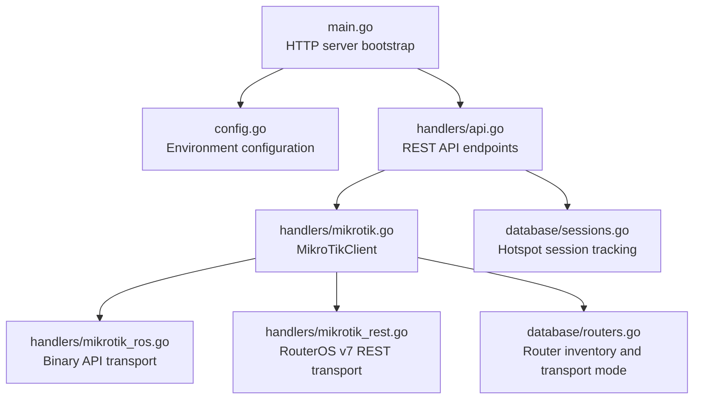
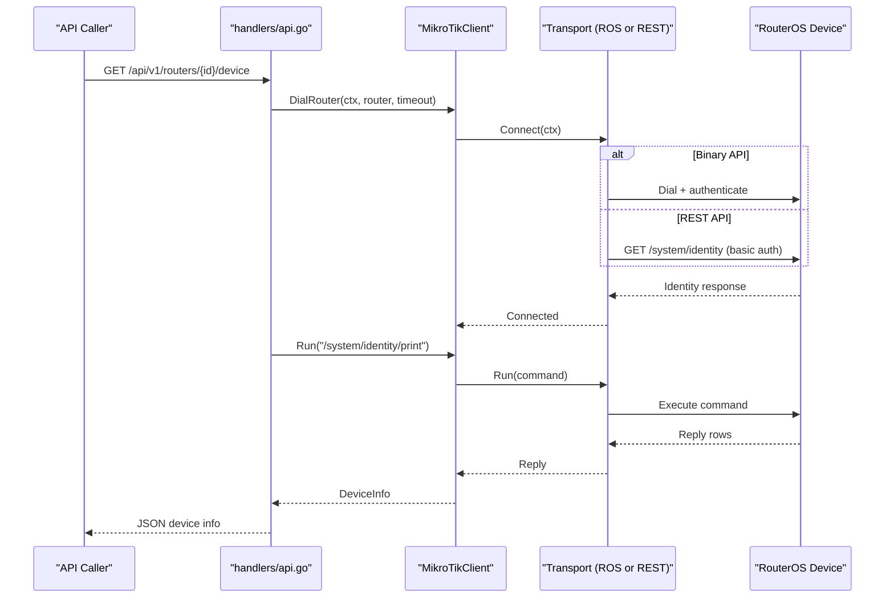
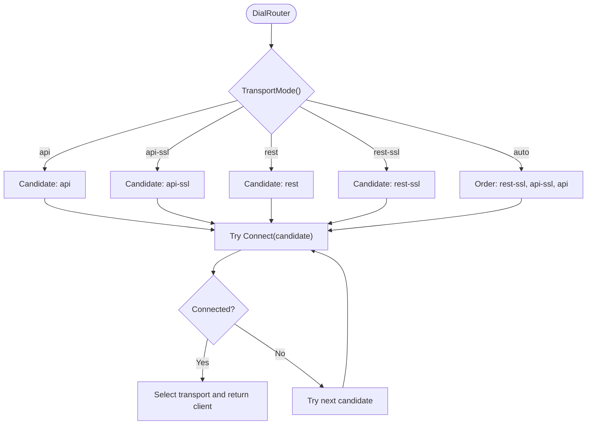
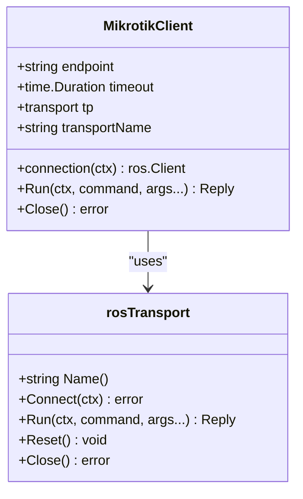
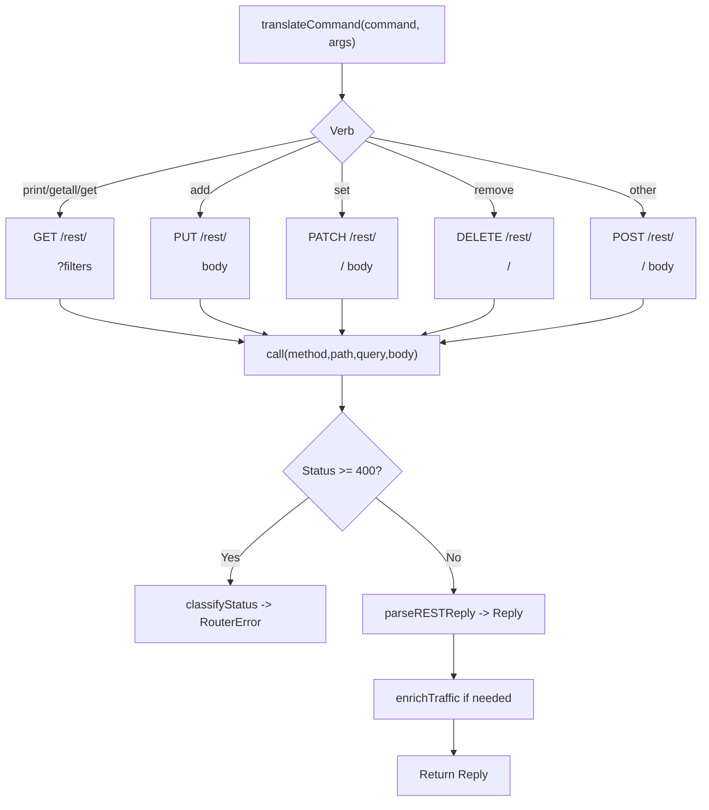
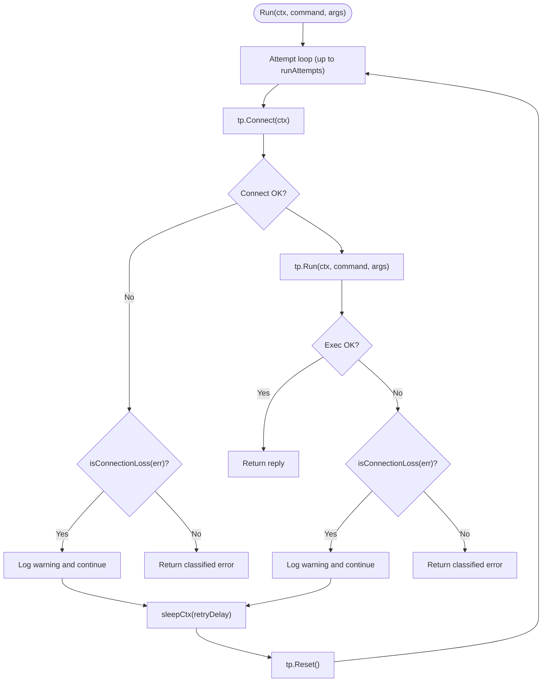
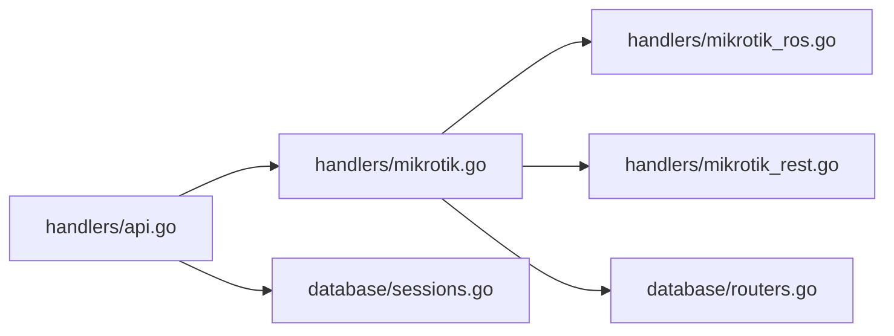

# Router Communication & API Integration

<cite>
**Referenced Files in This Document**
- [main.go](file://main.go)
- [config.go](file://config.go)
- [handlers/mikrotik.go](file://handlers/mikrotik.go)
- [handlers/mikrotik_ros.go](file://handlers/mikrotik_ros.go)
- [handlers/mikrotik_rest.go](file://handlers/mikrotik_rest.go)
- [database/routers.go](file://database/routers.go)
- [handlers/api.go](file://handlers/api.go)
- [database/sessions.go](file://database/sessions.go)
</cite>

## Table of Contents
1. [Introduction](#introduction)
2. [Project Structure](#project-structure)
3. [Core Components](#core-components)
4. [Architecture Overview](#architecture-overview)
5. [Detailed Component Analysis](#detailed-component-analysis)
6. [Dependency Analysis](#dependency-analysis)
7. [Performance Considerations](#performance-considerations)
8. [Troubleshooting Guide](#troubleshooting-guide)
9. [Conclusion](#conclusion)

## Introduction
This document explains how the controller communicates with MikroTik routers and how its REST API integrates with those devices. It covers:
- The MikroTik RouterOS API client implementation
- Connection management, retry logic, timeouts, and error recovery
- Protocol selection between standard API, API-SSL, REST API, and REST-SSL transports
- Authentication, permissions, and security considerations
- Example API calls for device information, client management, and configuration operations
- Network connectivity troubleshooting and performance optimization

The system supports two communication layers:
- A transport layer that speaks to MikroTik devices using either the legacy binary RouterOS API or the RouterOS v7 REST API
- An HTTP REST API under `/api/v1` that exposes router inventory, device health, active clients, interface statistics, and administrative operations

## Project Structure
At a high level:
- `main.go` starts the HTTP server and wires application configuration
- `config.go` loads environment-based settings such as API timeout and portal defaults
- `handlers/mikrotik.go` implements the reconnecting RouterOS client, protocol selection, retries, and command execution
- `handlers/mikrotik_ros.go` adapts the legacy binary API transport
- `handlers/mikrotik_rest.go` implements the RouterOS v7 REST transport
- `database/routers.go` stores router inventory, transport preferences, TLS options, and last-used transport
- `handlers/api.go` exposes machine-friendly endpoints for router and client management
- `database/sessions.go` tracks hotspot sessions locally so the controller can maintain history even when routers are unreachable

**Diagram sources**
- [main.go:214-285](file://main.go#L214-L285)
- [config.go:20-77](file://config.go#L20-L77)
- [handlers/api.go:106-136](file://handlers/api.go#L106-L136)
- [handlers/mikrotik.go:160-240](file://handlers/mikrotik.go#L160-L240)
- [handlers/mikrotik_ros.go:10-31](file://handlers/mikrotik_ros.go#L10-L31)
- [handlers/mikrotik_rest.go:49-121](file://handlers/mikrotik_rest.go#L49-L121)
- [database/routers.go:19-52](file://database/routers.go#L19-L52)
- [database/sessions.go:12-34](file://database/sessions.go#L12-L34)

**Section sources**
- [main.go:214-285](file://main.go#L214-L285)
- [config.go:20-77](file://config.go#L20-L77)

## Core Components
- **MikroTikClient**: Reconnecting client bound to one router. It serializes commands on a single connection, selects a transport, handles retries, and classifies errors into sentinel types.
- **Transport Interface**: Abstracts binary API and REST API implementations behind a common interface with `Name`, `Connect`, `Run`, `Reset`, and `Close`.
- **rosTransport**: Implements the legacy binary API over TCP 8728 or 8729 with TLS.
- **restTransport**: Implements the RouterOS v7 REST API over HTTP/HTTPS, including JSON translation, fallback command form, and traffic counter enrichment.
- **Router Inventory**: Stores host, port, credentials, TLS flags, transport mode, REST port, last successful transport, and status metrics.
- **API Layer**: Exposes `/api/v1` endpoints for router CRUD, device info, active clients, interface stats, client disconnect/block/unblock, and raw command execution.

Key responsibilities:
- Protocol selection based on explicit or auto mode
- Secure defaults (auto probes secure transports first)
- Retry once on connection loss
- Timeout handling via context deadlines and per-candidate probing caps
- Error classification into user-actionable sentinels

**Section sources**
- [handlers/mikrotik.go:160-257](file://handlers/mikrotik.go#L160-L257)
- [handlers/mikrotik_ros.go:10-54](file://handlers/mikrotik_ros.go#L10-L54)
- [handlers/mikrotik_rest.go:49-121](file://handlers/mikrotik_rest.go#L49-L121)
- [database/routers.go:57-98](file://database/routers.go#L57-L98)
- [handlers/api.go:106-136](file://handlers/api.go#L106-L136)

## Architecture Overview
The controller uses a layered architecture:
- HTTP API handlers receive requests and delegate to `MikroTikClient`
- `MikroTikClient` chooses a transport and executes commands
- Binary API transport dials a persistent socket and authenticates during handshake
- REST transport performs authenticated HTTP requests with basic auth and JSON payloads
- Errors are classified into sentinel types for consistent UI and API responses

**Diagram sources**
- [handlers/api.go:117-117](file://handlers/api.go#L117-L117)
- [handlers/mikrotik.go:186-240](file://handlers/mikrotik.go#L186-L240)
- [handlers/mikrotik_ros.go:25-46](file://handlers/mikrotik_ros.go#L25-L46)
- [handlers/mikrotik_rest.go:99-146](file://handlers/mikrotik_rest.go#L99-L146)

## Detailed Component Analysis

### MikroTikClient and Transport Selection
`MikroTikClient.DialRouter` builds candidates based on the router’s configured transport mode:
- Explicit modes: `api`, `api-ssl`, `rest`, `rest-ssl`
- Auto mode: tries secure REST first, then secure binary API, then plain binary API; it never probes plain HTTP REST by default because sending credentials to an unrelated web service is unsafe
- For REST over HTTP, an explicit port is required; otherwise the candidate is rejected
- Each candidate gets a capped probe timeout to avoid long stalls when multiple protocols are tried

**Diagram sources**
- [handlers/mikrotik.go:186-240](file://handlers/mikrotik.go#L186-L240)
- [handlers/mikrotik.go:280-354](file://handlers/mikrotik.go#L280-L354)

**Section sources**
- [handlers/mikrotik.go:186-240](file://handlers/mikrotik.go#L186-L240)
- [handlers/mikrotik.go:280-354](file://handlers/mikrotik.go#L280-L354)
- [database/routers.go:19-52](file://database/routers.go#L19-L52)

### Binary API Transport (Standard API and API-SSL)
- Uses the RouterOS binary protocol over TCP 8728 or 8729 with TLS
- Authentication happens during the dial/handshake; a successful `Connect` proves credentials
- The client keeps a persistent socket and reuses it across commands
- Timeouts and TLS configuration are applied at dial time

**Diagram sources**
- [handlers/mikrotik.go:160-181](file://handlers/mikrotik.go#L160-L181)
- [handlers/mikrotik_ros.go:10-54](file://handlers/mikrotik_ros.go#L10-L54)

**Section sources**
- [handlers/mikrotik_ros.go:10-54](file://handlers/mikrotik_ros.go#L10-L54)
- [handlers/mikrotik.go:413-475](file://handlers/mikrotik.go#L413-L475)

### REST API Transport (REST and REST-SSL)
- Implements RouterOS v7 REST API over HTTP/HTTPS
- Authenticates using HTTP Basic Auth with the router username and password
- Translates console commands to REST methods:
  - print/getall/get -> GET with query parameters
  - add -> PUT with JSON body
  - set -> PATCH with JSON body
  - remove -> DELETE
  - other verbs -> POST to `/rest/<menu>/<verb>`
- Falls back to the universal command form if a menu rejects the CRUD verb mapping
- Enriches traffic counters for `/interface/print` by calling `/interface/monitor-traffic` when the binary API’s `=.sum` operator has no REST equivalent
- Connection pooling is handled by Go’s `http.Transport` with idle connections and per-host limits

**Diagram sources**
- [handlers/mikrotik_rest.go:123-146](file://handlers/mikrotik_rest.go#L123-L146)
- [handlers/mikrotik_rest.go:207-282](file://handlers/mikrotik_rest.go#L207-L282)
- [handlers/mikrotik_rest.go:346-391](file://handlers/mikrotik_rest.go#L346-L391)
- [handlers/mikrotik_rest.go:393-444](file://handlers/mikrotik_rest.go#L393-L444)

**Section sources**
- [handlers/mikrotik_rest.go:49-121](file://handlers/mikrotik_rest.go#L49-L121)
- [handlers/mikrotik_rest.go:123-187](file://handlers/mikrotik_rest.go#L123-L187)
- [handlers/mikrotik_rest.go:207-344](file://handlers/mikrotik_rest.go#L207-L344)
- [handlers/mikrotik_rest.go:346-476](file://handlers/mikrotik_rest.go#L346-L476)

### Connection Management, Retries, Timeouts, and Error Recovery
- **Connection pooling**:
  - Binary API: one persistent socket per client, guarded by a mutex
  - REST API: Go `http.Transport` with `MaxIdleConnsPerHost=2` and `IdleConnTimeout=30s`
- **Retries**:
  - Commands are retried up to `runAttempts=2`; only connection-loss errors trigger a reconnect
  - A short delay (`retryDelay`) separates retries to allow rebooting devices to accept connections again
- **Timeouts**:
  - Global API timeout from configuration; context deadline may shorten it
  - Probe cap bounds each candidate attempt while auto mode tries multiple transports
- **Error recovery**:
  - Errors are wrapped in `RouterError` with sentinel values like `ErrRouterUnreachable`, `ErrRouterAuth`, `ErrRouterTimeout`, `ErrRouterPermission`, etc.
  - Human-readable hints are provided through `routerErrorHint`

**Diagram sources**
- [handlers/mikrotik.go:477-520](file://handlers/mikrotik.go#L477-L520)
- [handlers/mikrotik.go:595-636](file://handlers/mikrotik.go#L595-L636)

**Section sources**
- [handlers/mikrotik.go:151-158](file://handlers/mikrotik.go#L151-L158)
- [handlers/mikrotik.go:477-520](file://handlers/mikrotik.go#L477-L520)
- [handlers/mikrotik.go:522-636](file://handlers/mikrotik.go#L522-L636)
- [handlers/mikrotik_rest.go:79-93](file://handlers/mikrotik_rest.go#L79-L93)

### API Authentication, Permissions, and Security
- **Device authentication**:
  - Binary API: credentials are part of the handshake; success implies valid username/password
  - REST API: HTTP Basic Auth with router username and password
- **TLS and certificate verification**:
  - Both transports support TLS; verification is opt-in due to MikroTik’s self-signed certificates
  - Minimum TLS version is enforced
- **Security considerations**:
  - Auto mode avoids probing plain HTTP REST to prevent accidental credential leakage to unrelated services
  - Plain HTTP REST requires an explicit port; it is not chosen automatically
  - The external REST API under `/api/v1` is intended for machine clients and should be exposed behind a reverse proxy with authentication

**Section sources**
- [handlers/mikrotik.go:440-451](file://handlers/mikrotik.go#L440-L451)
- [handlers/mikrotik_rest.go:82-91](file://handlers/mikrotik_rest.go#L82-L91)
- [handlers/mikrotik.go:280-354](file://handlers/mikrotik.go#L280-L354)
- [handlers/api.go:1-9](file://handlers/api.go#L1-L9)

### API Examples

#### Device Information Retrieval
- Endpoint: `GET /api/v1/routers/{id}/device`
- Behavior:
  - Loads the router record and opens a device connection
  - Calls `DeviceInfo`, which queries `/system/identity/print` and `/system/resource/print`
  - Returns identity, version, board name, architecture, uptime, CPU load, memory usage

**Section sources**
- [handlers/api.go:117-117](file://handlers/api.go#L117-L117)
- [handlers/mikrotik.go:650-688](file://handlers/mikrotik.go#L650-L688)

#### Active Hotspot Clients
- Endpoint: `GET /api/v1/routers/{id}/clients`
- Behavior:
  - Reads active clients via the selected transport
  - Works unchanged over both binary API and REST
  - Includes fields such as user, address, MAC, uptime, login method, server, and byte counters

**Section sources**
- [handlers/api.go:119-119](file://handlers/api.go#L119-L119)
- [handlers/mikrotik_rest_test.go:151-169](file://handlers/mikrotik_rest_test.go#L151-L169)

#### Client Management
- Disconnect a client:
  - Endpoint: `POST /api/v1/routers/{id}/clients/{cid}/disconnect`
  - Accepts client ID in path or username in request body
  - Calls `DisconnectClient`, updates local session state, returns status
- Block/unblock a client:
  - Endpoints: `POST /api/v1/routers/{id}/block`, `POST /api/v1/routers/{id}/unblock`
  - Integrates with IP bindings and hotspot controls

**Section sources**
- [handlers/api.go:757-790](file://handlers/api.go#L757-L790)
- [database/sessions.go:180-199](file://database/sessions.go#L180-L199)

#### Configuration Operations
- Raw command execution:
  - Endpoint: `POST /api/v1/routers/{id}/command`
  - Executes arbitrary RouterOS commands through the selected transport
- Router CRUD:
  - Create/update/delete routers with transport mode, TLS flags, REST port, and credentials
  - Validation ensures REST over HTTP includes an explicit port

**Section sources**
- [handlers/api.go:127-127](file://handlers/api.go#L127-L127)
- [handlers/api.go:343-376](file://handlers/api.go#L343-L376)

## Dependency Analysis
The main dependencies and relationships:
- `handlers/api.go` depends on `handlers/mikrotik.go` for device operations
- `handlers/mikrotik.go` depends on `database/routers.go` for router configuration and transport mode
- `handlers/mikrotik_ros.go` adapts the binary API client
- `handlers/mikrotik_rest.go` implements REST transport with HTTP client pooling
- `database/sessions.go` tracks hotspot sessions independently of live device connectivity

**Diagram sources**
- [handlers/api.go:106-136](file://handlers/api.go#L106-L136)
- [handlers/mikrotik.go:186-240](file://handlers/mikrotik.go#L186-L240)
- [handlers/mikrotik_ros.go:10-54](file://handlers/mikrotik_ros.go#L10-L54)
- [handlers/mikrotik_rest.go:49-121](file://handlers/mikrotik_rest.go#L49-L121)
- [database/routers.go:57-98](file://database/routers.go#L57-L98)
- [database/sessions.go:12-34](file://database/sessions.go#L12-L34)

**Section sources**
- [handlers/api.go:106-136](file://handlers/api.go#L106-L136)
- [handlers/mikrotik.go:186-240](file://handlers/mikrotik.go#L186-L240)
- [database/routers.go:57-98](file://database/routers.go#L57-L98)

## Performance Considerations
- **Connection reuse**:
  - Binary API maintains a single persistent socket per client
  - REST API uses Go’s HTTP transport with small connection pools to reduce overhead
- **Probe capping**:
  - Auto mode limits each candidate’s probe time to avoid long waits when multiple transports are tried
- **Timeout tuning**:
  - Use `API_TIMEOUT` to balance responsiveness and reliability
  - Context deadlines propagate down to dial and command execution
- **Traffic counters**:
  - REST enriches interface counters by calling monitor-traffic only when needed
- **Logging and diagnostics**:
  - Debug logs include dial latency and transport selection details

[No sources needed since this section provides general guidance]

## Troubleshooting Guide
Common issues and resolutions:
- **Authentication failures**:
  - Check username/password and API account permissions
  - Binary API handshake failure indicates invalid credentials
  - REST API 401 Unauthorized maps to authentication error
- **Unreachable devices**:
  - Verify IP, port, firewall rules, and enabled services (`api`/`api-ssl` or `www`/`www-ssl`)
  - Auto mode avoids plain HTTP REST unless explicitly configured
- **Timeouts**:
  - Increase `API_TIMEOUT` if devices are slow to respond
  - Check network latency and device load
- **Permission denied**:
  - Ensure the API account has read/write access to hotspot menus
- **Certificate verification errors**:
  - Install a trusted certificate or enable verification only when appropriate
- **REST command fallback**:
  - Some menus reject CRUD verbs; the client falls back to POST command form automatically

**Section sources**
- [handlers/mikrotik.go:89-113](file://handlers/mikrotik.go#L89-L113)
- [handlers/mikrotik_rest.go:446-476](file://handlers/mikrotik_rest.go#L446-L476)
- [handlers/mikrotik.go:563-584](file://handlers/mikrotik.go#L563-L584)

## Conclusion
The controller provides robust, secure, and flexible communication with MikroTik routers through two transports:
- Legacy binary API for broad compatibility
- RouterOS v7 REST API for modern deployments

It automates protocol selection, manages connections efficiently, retries transient failures, and classifies errors for clear operator feedback. The external REST API offers a stable integration surface for device discovery, monitoring, and control. Proper configuration of transport mode, TLS, and permissions ensures reliable and secure router communications.

[No sources needed since this section summarizes without analyzing specific files]