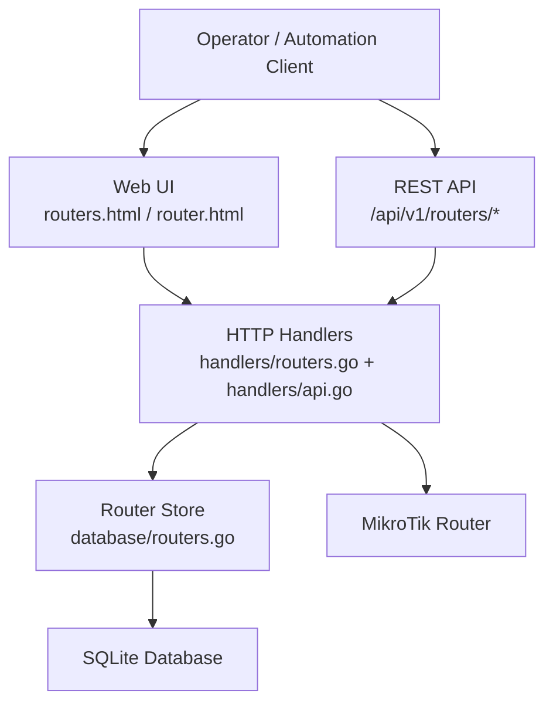
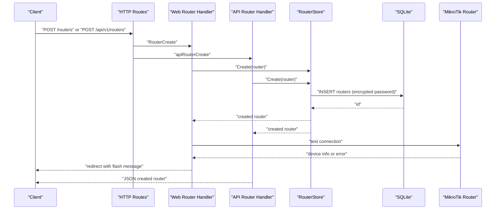
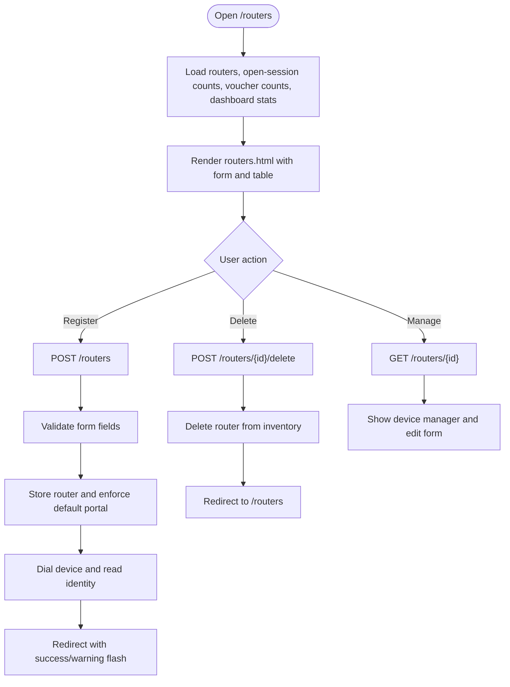
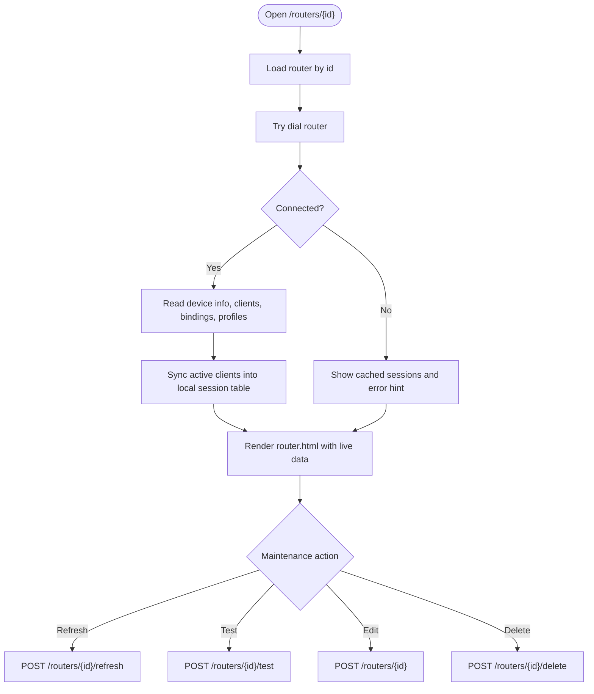
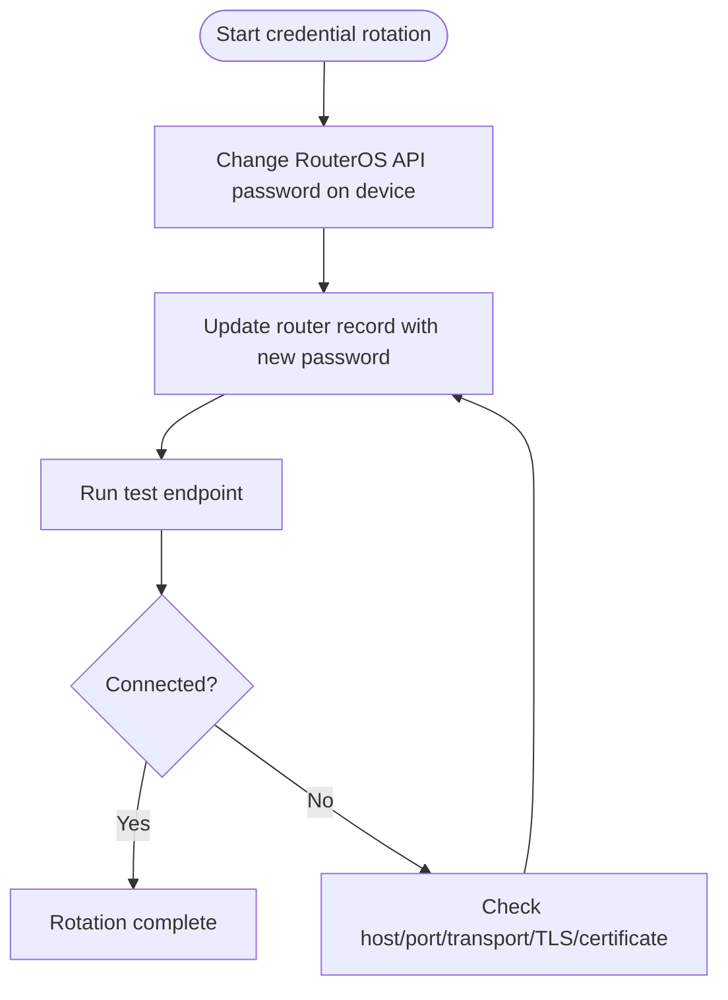
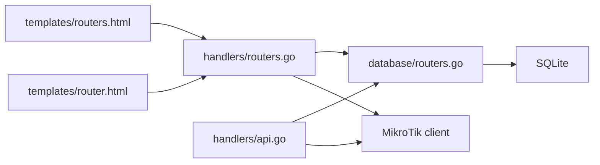

# Router Lifecycle Management

<cite>
**Referenced Files in This Document**
- [main.go](file://main.go)
- [README.md](file://README.md)
- [handlers/api.go](file://handlers/api.go)
- [handlers/routers.go](file://handlers/routers.go)
- [database/routers.go](file://database/routers.go)
- [templates/routers.html](file://templates/routers.html)
- [templates/router.html](file://templates/router.html)
</cite>

## Table of Contents
1. [Introduction](#introduction)
2. [Project Structure](#project-structure)
3. [Core Components](#core-components)
4. [Architecture Overview](#architecture-overview)
5. [Detailed Component Analysis](#detailed-component-analysis)
6. [Dependency Analysis](#dependency-analysis)
7. [Performance Considerations](#performance-considerations)
8. [Troubleshooting Guide](#troubleshooting-guide)
9. [Conclusion](#conclusion)
10. [Appendices](#appendices)

## Introduction
This document explains the complete router lifecycle management in the Aircoins MikroTik Controller. It covers how routers are created, updated, deleted, tested, refreshed, and maintained through both the web interface and the REST API. It also documents partial updates, credential rotation, deletion impact, inventory management, administrative tasks, backup/restore considerations, migration between controller instances, and production best practices.

The controller maintains a local SQLite inventory of MikroTik routers and connects to them using either the legacy RouterOS API or the RouterOS v7 REST API. Credentials are encrypted at rest with AES-256-GCM under a master key, so database backups must be paired with the secret key file.

**Section sources**
- [README.md:1-10](file://README.md#L1-L10)
- [README.md:108-109](file://README.md#L108-L109)

## Project Structure
Router lifecycle functionality is implemented across three layers:

- Web handlers render forms, validate input, call the database layer, and optionally dial the device.
- The REST API exposes JSON endpoints for automation and machine clients.
- The database layer persists router records, encrypts passwords, tracks status, and manages transport selection.

**Diagram sources**
- [handlers/routers.go:187-336](file://handlers/routers.go#L187-L336)
- [handlers/api.go:111-136](file://handlers/api.go#L111-L136)
- [database/routers.go:117-324](file://database/routers.go#L117-L324)

**Section sources**
- [main.go:214-285](file://main.go#L214-L285)
- [handlers/api.go:106-136](file://handlers/api.go#L106-L136)
- [handlers/routers.go:187-336](file://handlers/routers.go#L187-L336)
- [database/routers.go:117-324](file://database/routers.go#L117-L324)

## Core Components
- **Router model**: Represents a registered MikroTik device, its connection settings, encryption flags, transport mode, portal routing metadata, health metrics, and timestamps.
- **Router store**: Provides CRUD operations, password sealing/unsealing, default-portal enforcement, status recording, transport tracking, and counts.
- **Web handler**: Renders the router inventory and device manager, validates forms, performs live tests, refreshes sessions, and handles delete actions.
- **API handler**: Exposes JSON endpoints for listing, creating, reading, updating, deleting, testing, and querying device data.

Key responsibilities:
- Creation validates required fields, stores credentials securely, enforces single default portal, and optionally tests connectivity.
- Update supports partial changes; omitting the password keeps the stored secret.
- Delete removes the router record from the inventory without touching hotspot users on the device.
- Test and refresh provide operational diagnostics and session synchronization.

**Section sources**
- [database/routers.go:57-98](file://database/routers.go#L57-L98)
- [database/routers.go:190-287](file://database/routers.go#L190-L287)
- [handlers/routers.go:146-185](file://handlers/routers.go#L146-L185)
- [handlers/routers.go:229-336](file://handlers/routers.go#L229-L336)
- [handlers/api.go:152-187](file://handlers/api.go#L152-L187)

## Architecture Overview
The router lifecycle flows through HTTP routes into handlers, which may call the database store and/or the MikroTik client.

**Diagram sources**
- [handlers/routers.go:229-273](file://handlers/routers.go#L229-L273)
- [handlers/api.go:343-407](file://handlers/api.go#L343-L407)
- [database/routers.go:190-226](file://database/routers.go#L190-L226)

**Section sources**
- [handlers/routers.go:229-273](file://handlers/routers.go#L229-L273)
- [handlers/api.go:343-407](file://handlers/api.go#L343-L407)
- [database/routers.go:190-226](file://database/routers.go#L190-L226)

## Detailed Component Analysis

### Router Inventory Web Interface
The inventory page shows all registered routers, their endpoint, last status, latency, active session count, voucher count, and per-router actions. Operators can register a new router, open a device manager, test connections, refresh sessions, block devices, manage vouchers, and delete routers.

Key behaviors:
- Registration form includes name, host, transport selection, optional REST port, API port, username, password, location, portal tag, notes, TLS options, certificate verification, and default portal flag.
- Validation prevents invalid ports, missing required fields, and unsafe REST over HTTP configuration.
- Default portal flag is enforced so only one router owns the fallback captive portal.
- Deletion is confirmed via an inline form and redirects back to the inventory.

**Diagram sources**
- [handlers/routers.go:187-227](file://handlers/routers.go#L187-L227)
- [handlers/routers.go:229-336](file://handlers/routers.go#L229-L336)
- [templates/routers.html:26-147](file://templates/routers.html#L26-L147)

**Section sources**
- [handlers/routers.go:187-227](file://handlers/routers.go#L187-L227)
- [handlers/routers.go:229-336](file://handlers/routers.go#L229-L336)
- [templates/routers.html:26-147](file://templates/routers.html#L26-L147)

### Router Detail and Maintenance Page
The device manager page displays live device information, active hotspot clients, IP bindings, user profiles, vouchers, and connection details. It provides maintenance actions such as refreshing sessions, testing connectivity, disconnecting clients, blocking/unblocking MAC addresses, generating vouchers, and editing or deleting the router.

Important points:
- If the device is unreachable, the page still renders cached sessions and warnings instead of failing completely.
- Partial device data is shown when some queries fail; warnings explain unavailable features.
- Editing the router allows changing connection parameters and rotating the API password while keeping other fields unchanged.

**Diagram sources**
- [handlers/routers.go:487-553](file://handlers/routers.go#L487-L553)
- [handlers/routers.go:383-425](file://handlers/routers.go#L383-L425)
- [handlers/routers.go:338-381](file://handlers/routers.go#L338-L381)
- [templates/router.html:319-389](file://templates/router.html#L319-L389)

**Section sources**
- [handlers/routers.go:487-553](file://handlers/routers.go#L487-L553)
- [handlers/routers.go:383-425](file://handlers/routers.go#L383-L425)
- [handlers/routers.go:338-381](file://handlers/routers.go#L338-L381)
- [templates/router.html:319-389](file://templates/router.html#L319-L389)

### Router CRUD Through the Web Interface
- **Create**: POST `/routers` with form fields. Validates required fields, stores the router, clears any previous default portal if this router becomes the default, then tests the connection and returns a helpful flash message.
- **Update**: POST `/routers/{id}`. Validates fields, applies partial update, clears previous default portal if needed, and reports whether the stored password was kept or replaced.
- **Delete**: POST `/routers/{id}/delete`. Removes the router from the inventory and informs the operator that hotspot users remain untouched on the device.

Validation rules include:
- Name length limits.
- Host presence.
- Port range validation.
- Username presence.
- Password requirement for creation but not for update.
- Portal tag length limit.
- REST over HTTP requires explicit `rest_port`; it is never auto-selected.

**Section sources**
- [handlers/routers.go:116-163](file://handlers/routers.go#L116-L163)
- [handlers/routers.go:229-336](file://handlers/routers.go#L229-L336)

### Router CRUD Through the REST API
The API exposes these router endpoints:

| Endpoint | Method | Purpose | Request Body | Response | Notes |
|---|---|---|---|---|---|
| `/api/v1/routers` | GET | List all routers | None | `{ routers: [], total: number }` | Reads inventory only |
| `/api/v1/routers` | POST | Create router | JSON router object | Created router JSON | Requires name, host, username; validates transport/rest_port |
| `/api/v1/routers/{id}` | GET | Get router by id | None | Router JSON | No device connection required |
| `/api/v1/routers/{id}` | PUT | Update router | JSON router object | Updated router JSON | Partial update; omitted password keeps stored secret |
| `/api/v1/routers/{id}` | DELETE | Delete router | None | Empty body with 204 No Content | Removes inventory record |
| `/api/v1/routers/{id}/test` | POST | Test connectivity | None | Connection result with identity/version/board | Dials device and reads identity |
| `/api/v1/routers/{id}/device` | GET | Read device info | None | Device info JSON | Requires reachable device |
| `/api/v1/routers/{id}/clients` | GET | List active hotspot clients | None | Clients list | Requires reachable device |
| `/api/v1/routers/{id}/bindings` | GET | List IP bindings | None | Bindings list | Requires reachable device |
| `/api/v1/routers/{id}/interfaces` | GET | List interfaces | None | Interfaces list | Requires reachable device |
| `/api/v1/routers/{id}/interfaces/{iface}/traffic` | GET | Traffic history | None | Interface traffic window | Requires reachable device |
| `/api/v1/routers/{id}/clients/{cid}/disconnect` | POST | Disconnect client | Optional body with client_id/user | Disconnected status | Updates local session state |
| `/api/v1/routers/{id}/block` | POST | Block MAC address | MAC and optional comment | Binding result | Adds blocked IP binding |
| `/api/v1/routers/{id}/unblock` | POST | Unblock/remove binding | Binding id | Binding result | Removes IP binding |
| `/api/v1/routers/{id}/command` | POST | Send RouterOS command | Command string and args | Raw reply | Uses universal translation for REST |

Partial update behavior:
- Omitting `password` preserves the stored secret.
- Omitting optional fields leaves existing values unchanged.
- Transport normalization ensures unknown values fall back to safe defaults.

Error responses use a consistent JSON structure with `code` and `message`.

**Section sources**
- [handlers/api.go:111-136](file://handlers/api.go#L111-L136)
- [handlers/api.go:314-502](file://handlers/api.go#L314-L502)
- [handlers/api.go:504-745](file://handlers/api.go#L504-L745)
- [handlers/api.go:757-800](file://handlers/api.go#L757-L800)

### Router Update Process and Credential Rotation
The update process supports partial updates:

- Web update form allows changing name, host, transport, REST port, API port, username, optional new password, location, portal tag, notes, TLS flags, certificate verification, and default portal.
- API update accepts a JSON object with the same fields.
- If the password field is empty, the stored encrypted password remains unchanged.
- If the password field is provided, it is sealed with AES-256-GCM before being written.
- Changing the default portal flag clears the flag on every other router.

Credential rotation workflow:
1. Generate a new RouterOS API password on the MikroTik device.
2. Update the router record through the web form or API with the new password.
3. Optionally run the test endpoint to verify connectivity.
4. Monitor `last_status`, `last_error`, and `last_latency_ms` to confirm stability.

**Diagram sources**
- [handlers/routers.go:275-316](file://handlers/routers.go#L275-L316)
- [handlers/api.go:409-480](file://handlers/api.go#L409-L480)
- [database/routers.go:228-274](file://database/routers.go#L228-L274)

**Section sources**
- [handlers/routers.go:275-316](file://handlers/routers.go#L275-L316)
- [handlers/api.go:409-480](file://handlers/api.go#L409-L480)
- [database/routers.go:228-274](file://database/routers.go#L228-L274)

### Router Deletion Process and Impact
Deletion removes the router from the controller’s inventory. It does not remove hotspot users, vouchers, or configurations from the MikroTik device. Local session tracking for the router is removed because the router row no longer exists. Voucher history remains intact even if related rows reference a NULL router after deletion semantics apply elsewhere.

Operational guidance:
- Use deletion when retiring a device or moving it to another controller instance.
- Before deletion, export relevant data if historical analysis is needed.
- After deletion, verify that captive portal routing no longer depends on the removed router unless another default portal is configured.

**Section sources**
- [handlers/routers.go:318-336](file://handlers/routers.go#L318-L336)
- [database/routers.go:276-287](file://database/routers.go#L276-L287)

### Router Inventory Management
The inventory view aggregates:
- Registered routers.
- Last known status: unknown, online, offline.
- Latency in milliseconds.
- Open session counts per router.
- Voucher counts per router.
- Default portal designation.
- Transport mode and endpoint display.

Administrative tasks available from the inventory and device pages include:
- Registering routers.
- Testing connectivity.
- Refreshing session tables.
- Disconnecting clients.
- Blocking and unblocking MAC addresses.
- Generating and managing vouchers.
- Editing router connection settings.
- Deleting routers.

Bulk operations:
- There is no dedicated bulk router create/update/delete endpoint in the current implementation.
- Bulk operations should be performed by iterating over the REST API endpoints from an automation script.
- For large fleets, batch API calls with rate limiting and retry logic to avoid overwhelming the controller or MikroTik devices.

**Section sources**
- [handlers/routers.go:187-227](file://handlers/routers.go#L187-L227)
- [handlers/api.go:314-331](file://handlers/api.go#L314-L331)
- [database/routers.go:319-345](file://database/routers.go#L319-L345)

### Administrative Tasks and Health Checks
Administrative capabilities include:
- Panel operator account management through the CLI subcommand and settings page.
- Health check endpoint `/api/v1/health` for liveness probes.
- Router test endpoint for quick connectivity validation.
- Session refresh to synchronize local state with the device.
- Tools page for host-level utilities such as ZeroTier management.

Security-related administrative tasks:
- Password hashing uses PBKDF2-HMAC-SHA256 with configurable iteration count.
- Sessions use random tokens with server-side SHA-256 storage.
- Brute-force protection applies per-address and per-account limits.
- Settings require the current password to prevent takeover from a stolen session.

**Section sources**
- [main.go:82-192](file://main.go#L82-L192)
- [handlers/api.go:138-146](file://handlers/api.go#L138-L146)
- [README.md:111-140](file://README.md#L111-L140)

## Dependency Analysis
Router lifecycle components depend on each other as follows:

**Diagram sources**
- [templates/routers.html:26-147](file://templates/routers.html#L26-L147)
- [templates/router.html:319-389](file://templates/router.html#L319-L389)
- [handlers/routers.go:187-336](file://handlers/routers.go#L187-L336)
- [handlers/api.go:314-502](file://handlers/api.go#L314-L502)
- [database/routers.go:117-324](file://database/routers.go#L117-L324)

Coupling and cohesion:
- Handlers are cohesive around router lifecycle and device interaction.
- The store encapsulates persistence and credential handling.
- External dependencies include SQLite, RouterOS API/REST, and embedded HTML templates.

Potential circular dependencies:
- None observed; handlers depend on store and client, store depends on database, templates depend on handlers indirectly through rendering.

External integration points:
- MikroTik RouterOS API and REST endpoints.
- System service configuration and environment variables.
- Secret key file for credential encryption.

**Section sources**
- [handlers/routers.go:187-336](file://handlers/routers.go#L187-L336)
- [handlers/api.go:314-502](file://handlers/api.go#L314-L502)
- [database/routers.go:117-324](file://database/routers.go#L117-L324)

## Performance Considerations
- Router API calls are bounded by `API_TIMEOUT`, preventing long-running device queries from blocking the server.
- Device snapshots collect partial results as warnings rather than failing the entire request, improving resilience.
- Session sync occurs after successful client listing to keep local state consistent without blocking the response path unnecessarily.
- Traffic history is kept in memory with pruning to avoid unbounded growth.
- Large inventories benefit from efficient listing queries ordered by name.

Recommendations:
- Keep `API_TIMEOUT` tuned for network conditions and device load.
- Avoid polling high-frequency endpoints during peak hours.
- Use the REST API with controlled concurrency for automation.
- Monitor `last_latency_ms` and `last_status` to detect slow or unhealthy routers.

[No sources needed since this section provides general guidance]

## Troubleshooting Guide
Common issues and resolutions:

- **Router not found**: Occurs when accessing a deleted router or invalid id. Check inventory and API id values.
- **Router unreachable**: Indicates network, firewall, or credential problems. Use the test endpoint to isolate connectivity vs authentication.
- **Invalid transport configuration**: REST over HTTP requires explicit `rest_port`. Auto mode prefers secure transports and avoids probing plain HTTP on port 80.
- **Certificate verification failures**: Enable `verify_tls` only when a valid certificate is configured; otherwise disable verification for self-signed certificates.
- **Default portal conflicts**: Only one router can be the default portal; setting it on another router clears the flag on the previous one.
- **Session mismatch**: Use the refresh action to synchronize local sessions with the device.
- **Credential rotation failure**: Verify the new RouterOS API password, transport mode, port, and TLS settings.

Operational checks:
- Run `/api/v1/health` to verify controller database availability.
- Run `/api/v1/routers/{id}/test` to validate device connectivity.
- Inspect `last_error` and `last_seen_at` for recent failures.
- Review warnings on the device manager page for partial data.

**Section sources**
- [handlers/api.go:54-104](file://handlers/api.go#L54-L104)
- [handlers/api.go:375-379](file://handlers/api.go#L375-L379)
- [handlers/routers.go:116-163](file://handlers/routers.go#L116-L163)
- [handlers/routers.go:555-594](file://handlers/routers.go#L555-L594)

## Conclusion
Router lifecycle management in the Aircoins MikroTik Controller is designed for clarity, safety, and operational resilience. The web interface provides intuitive forms for inventory management and device maintenance, while the REST API enables automation and integration. Credentials are encrypted at rest, partial updates support safe credential rotation, and deletion affects only the controller inventory. Production environments should rely on HTTPS, proper TLS configuration, controlled API access, regular backups of both the database and secret key, and careful monitoring of router health and session state.

[No sources needed since this section summarizes without analyzing specific files]

## Appendices

### Backup and Restore Guidance
- Back up the SQLite database file specified by `DB_PATH`.
- Back up the master secret key file specified by `SECRET_KEY_PATH`.
- Without the secret key, the encrypted router passwords cannot be decrypted.
- Restore both artifacts together to recover router credentials and inventory.

**Section sources**
- [README.md:70-89](file://README.md#L70-L89)
- [README.md:108-109](file://README.md#L108-L109)

### Migration Between Controller Instances
- Export the router inventory and voucher data from the source controller’s database.
- Copy the destination controller’s database file and secret key file.
- Ensure the destination controller has compatible schema and version.
- Verify router connectivity after migration using the test endpoint.
- Confirm captive portal routing and default portal assignment.

**Section sources**
- [README.md:70-89](file://README.md#L70-L89)
- [handlers/api.go:504-528](file://handlers/api.go#L504-L528)

### Production Best Practices
- Run behind HTTPS and enable secure cookies.
- Restrict API access to trusted networks or reverse proxies with authentication.
- Rotate panel operator passwords regularly and revoke sessions when necessary.
- Use strong RouterOS API accounts with minimal required permissions.
- Prefer REST over HTTPS where supported; otherwise use API-SSL with verified certificates.
- Monitor router status, latency, and session counts.
- Schedule regular backups of the database and secret key.
- Test credential rotations in a staging environment before applying to production.

**Section sources**
- [README.md:111-140](file://README.md#L111-L140)
- [README.md:167-186](file://README.md#L167-L186)