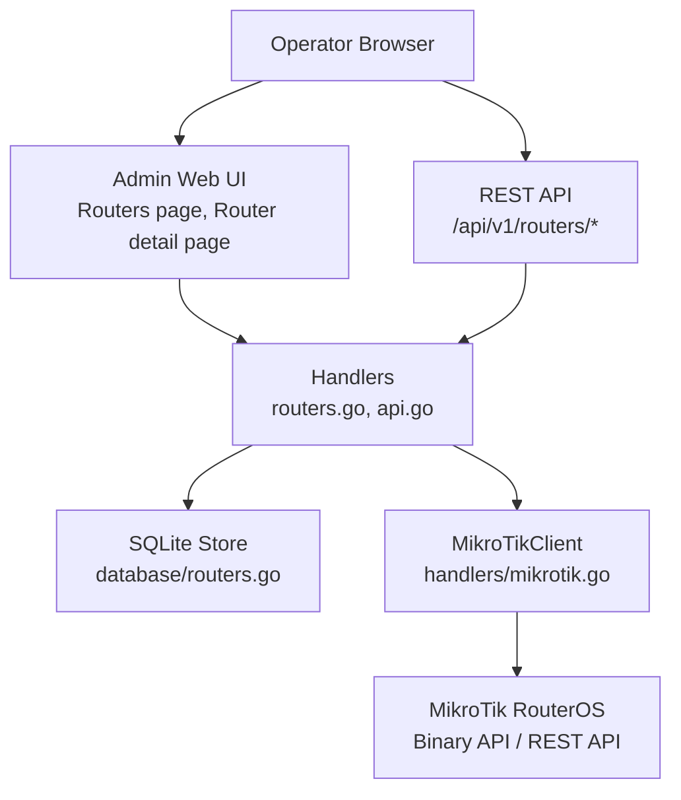
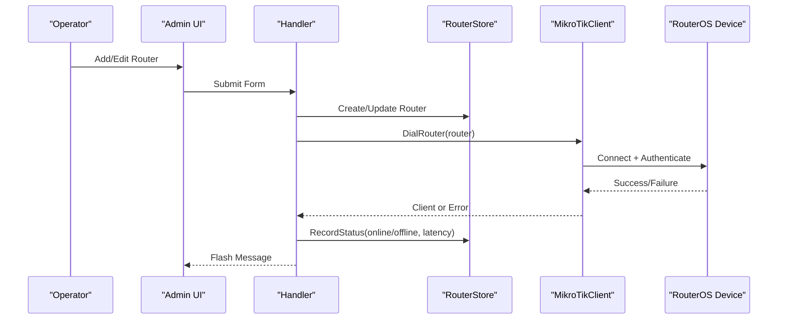
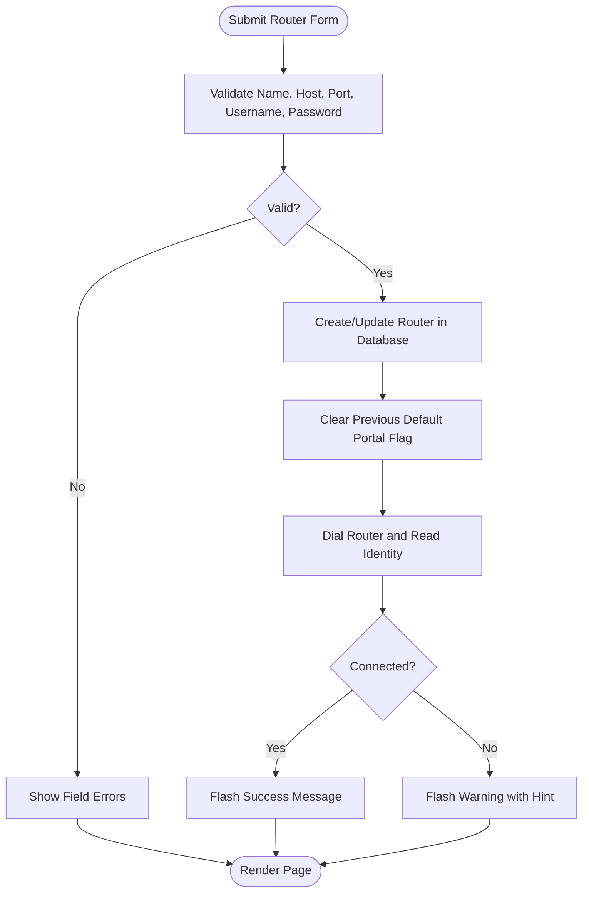
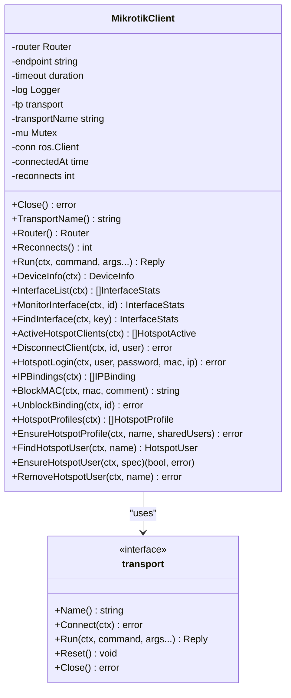
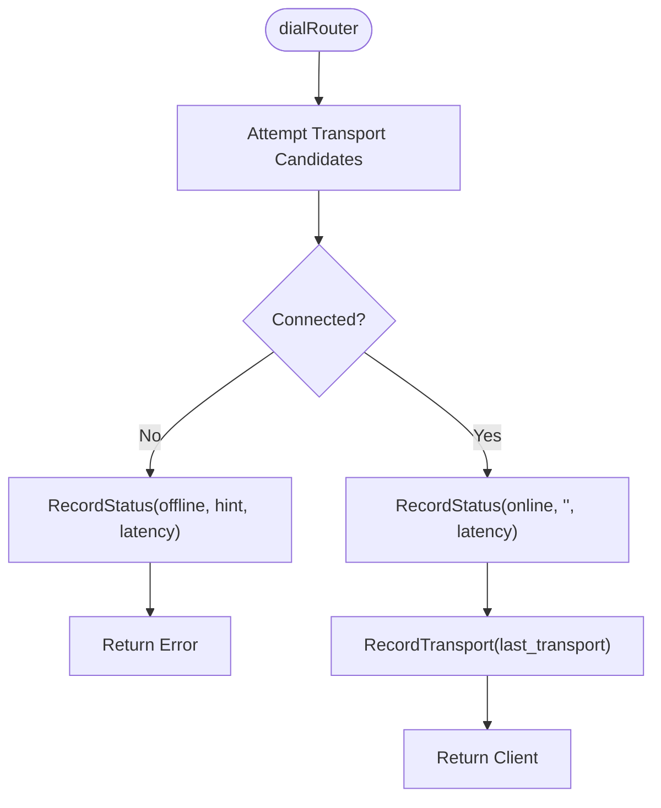
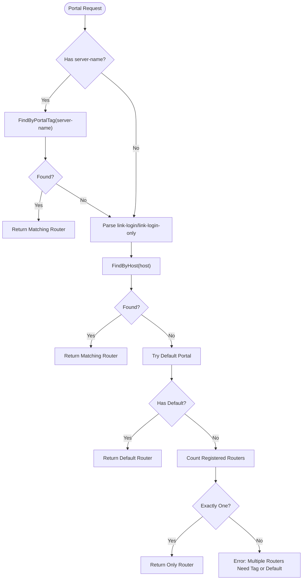
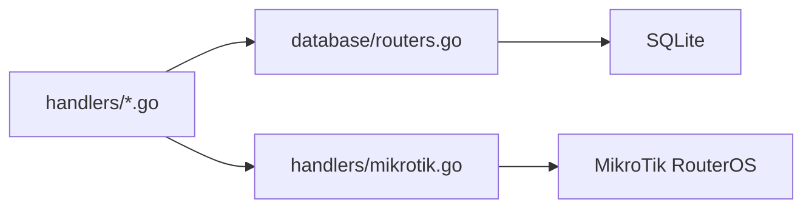

# Router Management

<cite>
**Referenced Files in This Document**
- [README.md](file://README.md)
- [main.go](file://main.go)
- [config.go](file://config.go)
- [database/routers.go](file://database/routers.go)
- [handlers/mikrotik.go](file://handlers/mikrotik.go)
- [handlers/routers.go](file://handlers/routers.go)
- [handlers/api.go](file://handlers/api.go)
- [handlers/portal.go](file://handlers/portal.go)
</cite>

## Table of Contents
1. [Introduction](#introduction)
2. [Project Structure](#project-structure)
3. [Core Components](#core-components)
4. [Architecture Overview](#architecture-overview)
5. [Detailed Component Analysis](#detailed-component-analysis)
6. [Dependency Analysis](#dependency-analysis)
7. [Performance Considerations](#performance-considerations)
8. [Troubleshooting Guide](#troubleshooting-guide)
9. [Conclusion](#conclusion)
10. [Appendices](#appendices)

## Introduction
This document explains how the controller manages MikroTik routers: adding them, configuring API access, monitoring health and latency, managing hotspot network state, and communicating through the RouterOS API or REST interface. It also documents router registration, connection testing, online/offline tracking, API user setup on routers, service permissions, firewall configuration, router resolution order for captive portal requests, and guidance for troubleshooting and performance tuning.

The controller supports multiple routers, tracks their last known status and latency, and exposes both a web operator panel and a REST API for programmatic management.

**Section sources**
- [README.md:1-10](file://README.md#L1-L10)
- [README.md:167-185](file://README.md#L167-L185)

## Project Structure
Router management spans three main layers:

- **HTTP handlers**: inventory forms, router detail pages, test/refresh actions, and REST endpoints.
- **RouterOS client layer**: transport selection, connection handling, command execution, error classification, and device data retrieval.
- **Database layer**: router inventory, encrypted credentials, transport history, and health metrics.

**Diagram sources**
- [handlers/routers.go:187-316](file://handlers/routers.go#L187-L316)
- [handlers/api.go:76-109](file://handlers/api.go#L76-L109)
- [handlers/mikrotik.go:160-240](file://handlers/mikrotik.go#L160-L240)
- [database/routers.go:57-98](file://database/routers.go#L57-L98)

**Section sources**
- [main.go:1-8](file://main.go#L1-L8)
- [README.md:197-205](file://README.md#L197-L205)

## Core Components
- **Router model**: stores host, port, username, encrypted password, TLS settings, transport mode, REST port, portal tag, default portal flag, location, notes, and health fields such as last status, last error, last latency, and last seen time.
- **Router store**: persists routers, normalizes transport modes, encrypts passwords, records status and transport, and provides lookup helpers by ID, host, portal tag, and default portal.
- **MikroTikClient**: reconnecting client that selects between legacy binary API and RouterOS v7 REST API, executes commands, classifies errors, and reads device information, interfaces, hotspot clients, bindings, profiles, and users.
- **Handler layer**: renders router inventory and detail pages, validates forms, creates/updates/deletes routers, tests connections, refreshes sessions, and exposes REST endpoints.
- **Portal resolver**: chooses which registered router handles a captive portal login based on server-name, link-login host, default portal, or single-router fallback.

**Section sources**
- [database/routers.go:57-98](file://database/routers.go#L57-L98)
- [database/routers.go:125-167](file://database/routers.go#L125-L167)
- [handlers/mikrotik.go:160-240](file://handlers/mikrotik.go#L160-L240)
- [handlers/routers.go:42-163](file://handlers/routers.go#L42-L163)
- [handlers/portal.go:404-451](file://handlers/portal.go#L404-L451)

## Architecture Overview
The router management flow is request-driven:

1. An operator adds or edits a router in the admin UI or via REST.
2. The handler validates input, persists the router with an encrypted password, and optionally sets it as the default portal.
3. On creation or explicit test, the handler dials the router using `DialRouter`, selecting a transport candidate.
4. The client connects to the selected endpoint, runs a lightweight identity query, and records online/offline status with latency.
5. The router detail page loads live device info, active hotspot clients, IP bindings, and profiles; it also syncs local session snapshots.
6. Portal login requests are routed to the correct router using the resolution order.

**Diagram sources**
- [handlers/routers.go:229-273](file://handlers/routers.go#L229-L273)
- [handlers/mikrotik.go:183-240](file://handlers/mikrotik.go#L183-L240)
- [handlers/mikrotik.go:1353-1379](file://handlers/mikrotik.go#L1353-L1379)
- [database/routers.go:297-316](file://database/routers.go#L297-L316)

**Section sources**
- [handlers/routers.go:229-316](file://handlers/routers.go#L229-L316)
- [handlers/mikrotik.go:183-240](file://handlers/mikrotik.go#L183-L240)
- [handlers/mikrotik.go:1353-1379](file://handlers/mikrotik.go#L1353-L1379)

## Detailed Component Analysis

### Router Registration and Configuration
The router form collects name, host, port, username, password, TLS options, verify TLS, location, portal tag, default portal flag, notes, transport mode, and REST port. Validation ensures required fields, valid ports, and REST port rules. When creating a router, the controller immediately tests the connection and reports success or a helpful hint.

Key behaviors:
- Default API port is 8728 unless overridden.
- Transport defaults to auto.
- REST over HTTP requires an explicitly typed port; HTTPS REST defaults to 443 when no port is provided.
- Creating or updating a router clears previous default portal flags except the current one.
- Passwords are stored encrypted; editing without a new password keeps the existing secret.

**Diagram sources**
- [handlers/routers.go:116-163](file://handlers/routers.go#L116-L163)
- [handlers/routers.go:229-273](file://handlers/routers.go#L229-L273)

**Section sources**
- [handlers/routers.go:42-163](file://handlers/routers.go#L42-L163)
- [handlers/routers.go:229-316](file://handlers/routers.go#L229-L316)

### Router Communication Through RouterOS API and REST
`MikroTikClient` abstracts communication with a single router. It supports:
- Legacy binary API (`api` on TCP 8728, `api-ssl` on 8729).
- RouterOS v7 REST API (`rest` over HTTP, `rest-ssl` over HTTPS served by www/www-ssl).

Transport selection:
- Explicit transport yields a single candidate.
- Auto mode tries secure transports first, then falls back to plain API if needed.
- Plain HTTP REST is deliberately excluded from auto probing to avoid sending credentials to unrelated services.
- The successful transport is remembered in `last_transport`.

Connection lifecycle:
- `connection()` dials once and reuses the socket.
- `Run()` retries once on transient connection loss after a short delay.
- Errors are classified into sentinel types like unreachable, auth failure, timeout, permission denied, unknown command, not found, conflict, or generic device error.

**Diagram sources**
- [handlers/mikrotik.go:160-240](file://handlers/mikrotik.go#L160-L240)
- [handlers/mikrotik.go:242-278](file://handlers/mikrotik.go#L242-L278)
- [handlers/mikrotik.go:378-411](file://handlers/mikrotik.go#L378-L411)
- [handlers/mikrotik.go:477-520](file://handlers/mikrotik.go#L477-L520)

**Section sources**
- [handlers/mikrotik.go:160-240](file://handlers/mikrotik.go#L160-L240)
- [handlers/mikrotik.go:242-376](file://handlers/mikrotik.go#L242-L376)
- [handlers/mikrotik.go:378-520](file://handlers/mikrotik.go#L378-L520)

### Connection Testing and Latency Monitoring
When dialing a router, the handler measures elapsed time and records:
- Status: online or offline.
- Last error message (truncated).
- Last latency in milliseconds.
- Last seen timestamp (only updated on successful connection).
- Successful transport name for future auto probing.

This means the dashboard always shows the most recent health snapshot even if the device is currently unreachable.

**Diagram sources**
- [handlers/mikrotik.go:1353-1379](file://handlers/mikrotik.go#L1353-L1379)
- [database/routers.go:297-316](file://database/routers.go#L297-L316)

**Section sources**
- [handlers/mikrotik.go:1353-1379](file://handlers/mikrotik.go#L1353-L1379)
- [database/routers.go:297-316](file://database/routers.go#L297-L316)

### Router Resolution Order and Multi-Router Handling
For captive portal requests, the controller resolves the target router in this order:
1. Match the hotspot `server-name` against a router’s `portal_tag`.
2. Parse `link-login` or `link-login-only` and match its hostname against a registered router host.
3. Use the router flagged as the default portal.
4. If exactly one router is registered, use it.
5. Otherwise, return an error indicating that multiple routers exist and require a portal tag or default portal setting.

This logic ensures that multi-router deployments can route login requests correctly while still providing a safe fallback.

**Diagram sources**
- [handlers/portal.go:404-451](file://handlers/portal.go#L404-L451)
- [database/routers.go:140-167](file://database/routers.go#L140-L167)

**Section sources**
- [handlers/portal.go:404-451](file://handlers/portal.go#L404-L451)
- [database/routers.go:140-167](file://database/routers.go#L140-L167)

### Network Configuration and Hotspot Management
The client provides operations commonly used for hotspot management:
- List active hotspot clients.
- Disconnect a client by session ID or username.
- Authenticate a client through `/ip/hotspot/active/login`.
- Manage IP bindings to block or unblock MAC addresses.
- List and ensure hotspot user profiles.
- Create, update, find, and remove hotspot users.
- Read system identity and resource usage.

These functions map directly to RouterOS commands and handle version differences where necessary, such as trying both remove-by-id and logout approaches for disconnecting clients.

**Section sources**
- [handlers/mikrotik.go:878-974](file://handlers/mikrotik.go#L878-L974)
- [handlers/mikrotik.go:976-1059](file://handlers/mikrotik.go#L976-L1059)
- [handlers/mikrotik.go:1061-1281](file://handlers/mikrotik.go#L1061-L1281)
- [handlers/mikrotik.go:650-688](file://handlers/mikrotik.go#L650-L688)

### API User Setup, Service Permissions, and Firewall Configuration
On each MikroTik router:
- Create an API user with read/write access to hotspot menus.
- Allow the controller’s IP address under `/ip/service` so the API port is reachable.
- Ensure the hotspot package is enabled; otherwise commands will be unavailable.

The controller surfaces these issues through friendly hints:
- Authentication failures indicate wrong username/password.
- Unreachable errors suggest checking IP, port, IP service, and firewall.
- Command-unavailable errors indicate missing hotspot support.
- Permission-denied errors indicate insufficient API rights.

**Section sources**
- [README.md:167-173](file://README.md#L167-L173)
- [handlers/mikrotik.go:23-48](file://handlers/mikrotik.go#L23-L48)
- [handlers/mikrotik.go:89-113](file://handlers/mikrotik.go#L89-L113)

### Controller Health and Startup
The application entry point initializes logging, configuration, database, templates, admin account bootstrap, HTTP server, and background expiry sweeper. It listens on the configured address and gracefully shuts down on signals.

While router management is handled by handlers and the client layer, the startup sequence ensures the controller is ready before accepting requests.

**Section sources**
- [main.go:36-57](file://main.go#L36-L57)
- [main.go:214-285](file://main.go#L214-L285)

## Dependency Analysis
Router management depends on:
- **Handlers** for HTTP routing and business orchestration.
- **Database store** for persistence and health metrics.
- **MikroTik client** for protocol abstraction and command execution.
- **RouterOS devices** for actual network control.

**Diagram sources**
- [handlers/routers.go:1-12](file://handlers/routers.go#L1-L12)
- [handlers/api.go:76-109](file://handlers/api.go#L76-L109)
- [handlers/mikrotik.go:1-21](file://handlers/mikrotik.go#L1-L21)
- [database/routers.go:1-10](file://database/routers.go#L1-L10)

**Section sources**
- [handlers/routers.go:187-316](file://handlers/routers.go#L187-L316)
- [handlers/api.go:76-109](file://handlers/api.go#L76-L109)
- [handlers/mikrotik.go:160-240](file://handlers/mikrotik.go#L160-L240)
- [database/routers.go:57-98](file://database/routers.go#L57-L98)

## Performance Considerations
- **API timeout**: Adjust `API_TIMEOUT` to balance responsiveness and reliability. Shorter timeouts reduce page load stalls; longer timeouts help with slow or congested networks.
- **Transport probing**: Auto mode probes multiple transports but caps per-candidate timeout to avoid long waits. Prefer explicit transport when you know the router’s preferred API method.
- **Connection reuse**: The binary API client keeps a single connection and retries once on transient loss, reducing overhead during brief blips.
- **Latency recording**: Every dial attempt records latency, enabling operators to spot slow routers or network paths.
- **REST vs Binary API**: REST may have different performance characteristics depending on RouterOS build and configuration. Use the transport that works reliably in your environment.

[No sources needed since this section provides general guidance]

## Troubleshooting Guide

### Common Connectivity Issues
- **Authentication failed**: Verify the API username and password on the router. The controller rejects invalid credentials early and returns a clear hint.
- **Device unreachable**: Check the router IP, API port, IP service allowlist, and firewall rules. The controller logs endpoint and hint for quick diagnosis.
- **Command unavailable**: The hotspot package may be disabled or unsupported. Enable hotspot features on the router.
- **Permission denied**: The API user needs read/write access to hotspot menus.
- **Unknown host**: The client is not yet known to the hotspot; retry or wait for the host table to populate.

### Connection Test Failures
Use the router “Test” action to validate connectivity and identity. If it fails:
- Confirm the router is reachable on the configured API port.
- Confirm TLS settings match the router configuration.
- Confirm the API user exists and has sufficient permissions.
- Check firewall and IP service allowlists.

### Session Refresh Problems
If refreshing the session list fails:
- Ensure the router is online and the API is reachable.
- Check for permission errors when reading `/ip/hotspot/active/print`.
- Review warnings on the router detail page for partial data availability.

### Router Resolution Conflicts
If portal login cannot determine the correct router:
- Set a unique `portal_tag` matching the hotspot `server-name`.
- Or mark one router as the default portal.
- Or ensure only one router is registered.

**Section sources**
- [handlers/mikrotik.go:23-48](file://handlers/mikrotik.go#L23-L48)
- [handlers/mikrotik.go:89-113](file://handlers/mikrotik.go#L89-L113)
- [handlers/routers.go:338-381](file://handlers/routers.go#L338-L381)
- [handlers/portal.go:404-451](file://handlers/portal.go#L404-L451)

## Conclusion
Router management in the controller combines a robust inventory system, resilient API communication, and clear operational feedback. Operators can add and configure routers, test connectivity, monitor health and latency, manage hotspot state, and rely on deterministic router resolution for captive portal logins. Proper API user setup, service permissions, and firewall configuration are essential for reliable operation. When issues arise, the controller’s error classification and human-friendly hints make troubleshooting straightforward.

[No sources needed since this section summarizes without analyzing specific files]

## Appendices

### Router Model Fields Summary
- Identification: name, host, port, location, notes.
- Credentials: username, encrypted password.
- Security: use_tls, verify_tls.
- Transport: transport mode, rest_port, last_transport.
- Portal routing: portal_tag, default_portal.
- Health: last_status, last_error, last_latency_ms, last_seen_at.

**Section sources**
- [database/routers.go:57-98](file://database/routers.go#L57-L98)

### REST API Router Endpoints
The REST API supports loading, creating, updating, and deleting routers. A helper function resolves a router by ID and opens an API connection, returning appropriate errors for invalid IDs, missing routers, or unreachable devices.

**Section sources**
- [handlers/api.go:76-109](file://handlers/api.go#L76-L109)
- [handlers/api.go:409-443](file://handlers/api.go#L409-L443)