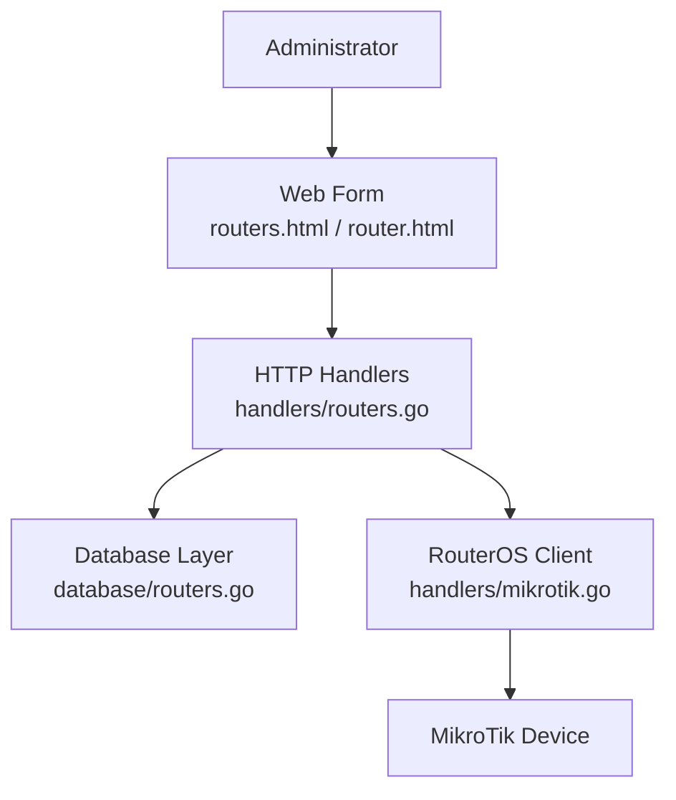
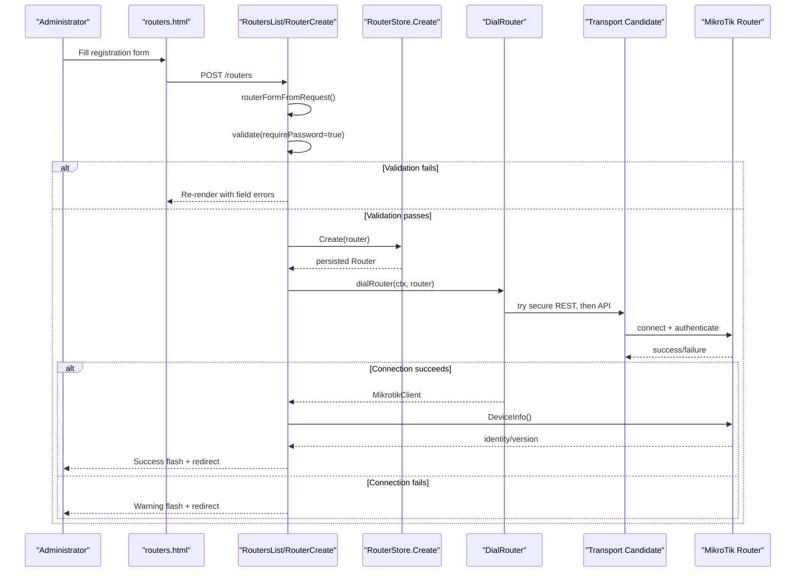
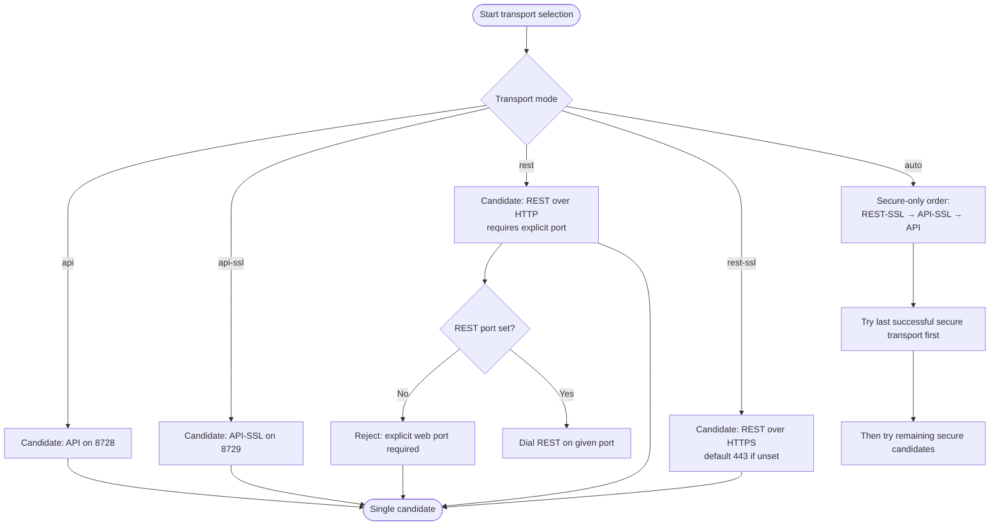
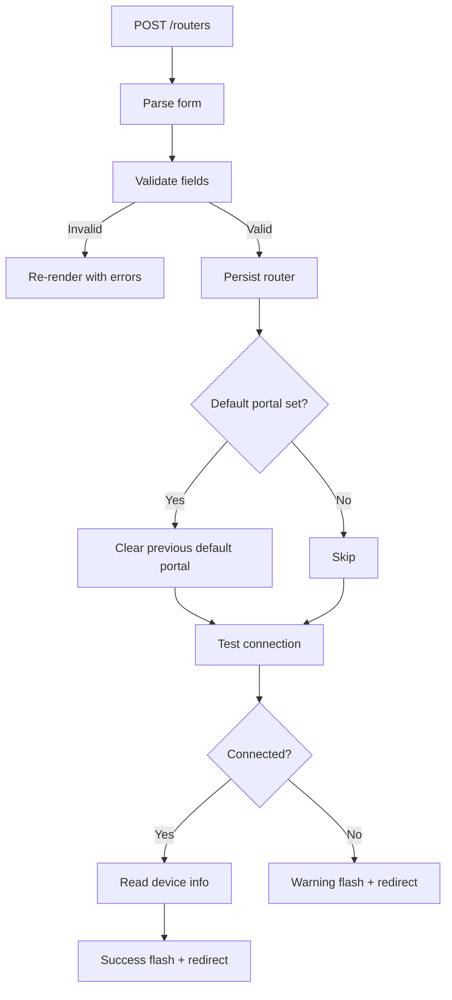
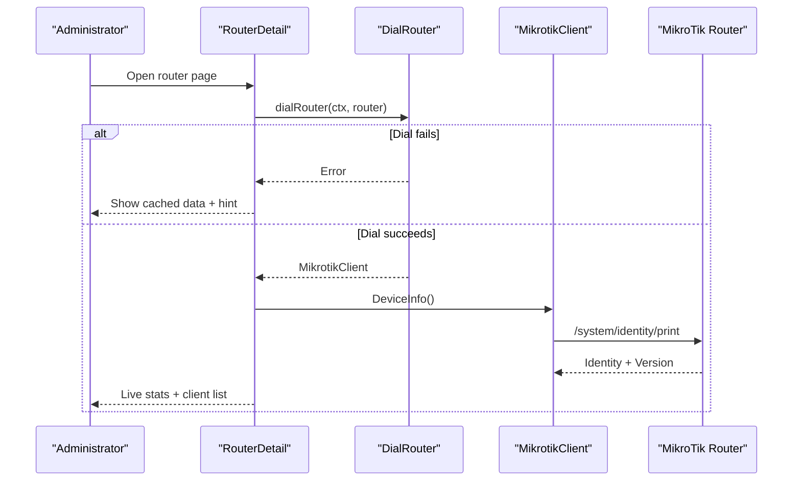
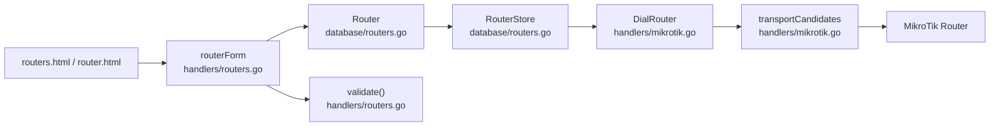

# Router Registration & Configuration

<cite>
**Referenced Files in This Document**   
- [handlers/routers.go](file://handlers/routers.go)
- [database/routers.go](file://database/routers.go)
- [handlers/mikrotik.go](file://handlers/mikrotik.go)
- [templates/routers.html](file://templates/routers.html)
- [templates/router.html](file://templates/router.html)
- [handlers/api.go](file://handlers/api.go)
</cite>

## Table of Contents
1. [Introduction](#introduction)
2. [Project Structure](#project-structure)
3. [Core Components](#core-components)
4. [Architecture Overview](#architecture-overview)
5. [Detailed Component Analysis](#detailed-component-analysis)
6. [Dependency Analysis](#dependency-analysis)
7. [Performance Considerations](#performance-considerations)
8. [Troubleshooting Guide](#troubleshooting-guide)
9. [Conclusion](#conclusion)

## Introduction
This document explains how routers are registered and configured in the controller, focusing on the router form, validation rules, transport modes, TLS behavior, REST port configuration, credential handling, connection testing, and common failure scenarios. It is intended for administrators setting up MikroTik routers as well as developers integrating with the router inventory system.

## Project Structure
Router registration spans three layers:
- Web form and templates render the registration UI and display inventory status.
- HTTP handlers parse, validate, persist, and test router entries.
- The database layer stores encrypted credentials, transport settings, and connectivity probes.

**Diagram sources**
- [templates/routers.html:26-101](file://templates/routers.html#L26-L101)
- [handlers/routers.go:187-273](file://handlers/routers.go#L187-L273)
- [database/routers.go:57-98](file://database/routers.go#L57-L98)
- [handlers/mikrotik.go:183-240](file://handlers/mikrotik.go#L183-L240)

**Section sources**
- [handlers/routers.go:14-64](file://handlers/routers.go#L14-L64)
- [database/routers.go:57-98](file://database/routers.go#L57-L98)
- [templates/routers.html:26-101](file://templates/routers.html#L26-L101)

## Core Components
The router registration flow centers on these components:
- `routerForm`: carries submitted values, defaults, and per-field errors.
- `Router` (database model): represents a registered device, including encrypted password, transport mode, REST port, TLS flags, portal tag, and last connectivity probe results.
- `MikrotikClient` and transport selection: dials the correct protocol based on configured or auto-detected transport.
- Templates: provide the registration form, edit form, and live device details.

Key responsibilities:
- Parse and normalize form input.
- Validate required fields and transport-specific constraints.
- Persist router metadata and encrypted credentials.
- Test API connectivity immediately after creation.
- Display live device information when available.

**Section sources**
- [handlers/routers.go:42-163](file://handlers/routers.go#L42-L163)
- [database/routers.go:57-98](file://database/routers.go#L57-L98)
- [handlers/mikrotik.go:160-240](file://handlers/mikrotik.go#L160-L240)

## Architecture Overview
The following diagram shows the end-to-end registration process from form submission to connection verification.

**Diagram sources**
- [handlers/routers.go:75-144](file://handlers/routers.go#L75-L144)
- [handlers/routers.go:229-273](file://handlers/routers.go#L229-L273)
- [handlers/mikrotik.go:183-240](file://handlers/mikrotik.go#L183-L240)

## Detailed Component Analysis

### Router Form Structure and Field Requirements
The registration form collects the following fields:
- Name: human-readable identifier for the router.
- Host: IP address or hostname reachable by the controller.
- Port: API port used by Auto, API, and API-SSL; ignored for REST.
- Username: RouterOS API user account.
- Password: RouterOS API password.
- Location: optional descriptive location.
- Portal tag: optional hotspot server-name used to route captive portal requests.
- Notes: optional notes.
- Use TLS: enables API-SSL when using binary API.
- Verify TLS: enforces certificate verification for TLS transports.
- Default portal: marks this router as fallback for unattributed portal requests.
- Transport: connection method.
- REST port: www/www-ssl port used by REST transports.

Validation rules:
- Name must be present and under 60 characters.
- Host must be present.
- Port must be between 1 and 65535; REST ignores it but still validates it as a number.
- Username must be present.
- Password is required during creation; leaving it blank on update keeps the stored secret.
- Portal tag must be under 40 characters.
- REST port must be a valid port number if provided.
- When transport is REST over HTTP, REST port must be explicitly set; it is never defaulted to 80.

REST port behavior:
- Empty REST port means “not set.”
- For HTTPS REST, default port 443 is used internally when no explicit port is provided.
- For plain HTTP REST, an explicit port is mandatory; omitting it produces a validation error.

TLS behavior:
- Use TLS applies to the legacy binary API (port 8728 vs 8729).
- Verify TLS controls whether certificate verification is enforced for TLS connections.
- Self-signed certificates are allowed unless Verify TLS is enabled.

Portal tag usage:
- Used to match the hotspot server-name so captive portal logins can be routed to the correct router.

Default portal flag:
- Only one router may be the default portal at a time; saving another clears the previous default.

**Section sources**
- [handlers/routers.go:42-163](file://handlers/routers.go#L42-L163)
- [templates/routers.html:32-99](file://templates/routers.html#L32-L99)
- [templates/router.html:320-380](file://templates/router.html#L320-L380)

### Transport Modes and Selection Logic
Supported transport modes:
- auto: secure-first probing order; tries secure REST, then API-SSL, then API. Plain HTTP REST is intentionally excluded from auto probing.
- api: legacy binary API over TCP 8728.
- api-ssl: legacy binary API over TLS on TCP 8729.
- rest: RouterOS v7 REST over HTTP www service; requires explicit REST port.
- rest-ssl: RouterOS v7 REST over HTTPS www service; defaults to 443 when no explicit REST port is provided.

Auto mode candidate order:
1. REST over HTTPS.
2. API-SSL.
3. API.

If a previous successful transport is recorded and safe, auto mode tries that first before falling back to the other candidates. Plain HTTP REST is never probed automatically, even if previously remembered, to avoid accidentally sending credentials to unrelated web services.

Explicit mode behavior:
- Each explicit mode yields exactly one candidate.
- REST without an explicit port is rejected during dialing because it would otherwise target an unspecified web service.

**Diagram sources**
- [handlers/mikrotik.go:280-354](file://handlers/mikrotik.go#L280-L354)
- [handlers/mikrotik.go:200-240](file://handlers/mikrotik.go#L200-L240)

**Section sources**
- [database/routers.go:19-52](file://database/routers.go#L19-L52)
- [handlers/mikrotik.go:280-354](file://handlers/mikrotik.go#L280-L354)

### Router Creation Process
When creating a router:
1. The handler reads form values and normalizes transport.
2. Validation runs with password required.
3. If validation passes, the router is inserted into the database with an encrypted password.
4. If the new router is marked as default portal, any previous default is cleared.
5. The handler immediately attempts to connect using `dialRouter`.
6. On successful connection, it calls `DeviceInfo` to confirm identity and version.
7. A success or warning flash message is shown depending on connectivity.

Important behaviors:
- A failed connection does not prevent saving the router; it only warns the operator.
- The endpoint displayed in logs and messages uses host and port according to the selected transport.
- The winning transport is later recorded so future auto-mode connections start with the known-good protocol.

**Diagram sources**
- [handlers/routers.go:229-273](file://handlers/routers.go#L229-L273)

**Section sources**
- [handlers/routers.go:229-273](file://handlers/routers.go#L229-L273)
- [database/routers.go:190-226](file://database/routers.go#L190-L226)

### Credential Handling and Security
- Passwords are encrypted before storage and decrypted when needed for authentication.
- The decrypted password is never rendered in templates.
- During updates, leaving the password field blank preserves the existing secret.
- The UI shows a masked indicator rather than the actual password.
- TLS verification is opt-in; self-signed certificates work unless certificate verification is explicitly enabled.

**Section sources**
- [database/routers.go:64-71](file://database/routers.go#L64-L71)
- [database/routers.go:108-115](file://database/routers.go#L108-L115)
- [database/routers.go:190-226](file://database/routers.go#L190-L226)
- [database/routers.go:228-257](file://database/routers.go#L228-L257)
- [handlers/mikrotik.go:440-459](file://handlers/mikrotik.go#L440-L459)

### Connection Testing and Live Data
Connection testing is available both during creation and via the router detail page:
- Router creation tests connectivity and device identity.
- The router detail page offers a dedicated “Test connection” action.
- Successful tests report identity, RouterOS version, board name, active clients, and profiles where available.
- Partial failures are surfaced as warnings so operators can still see cached data.

**Diagram sources**
- [handlers/routers.go:487-553](file://handlers/routers.go#L487-L553)
- [handlers/mikrotik.go:662-688](file://handlers/mikrotik.go#L662-L688)

**Section sources**
- [handlers/routers.go:338-381](file://handlers/routers.go#L338-L381)
- [handlers/routers.go:487-553](file://handlers/routers.go#L487-L553)
- [handlers/mikrotik.go:662-688](file://handlers/mikrotik.go#L662-L688)

### Examples of Proper Router Configuration

#### Example 1: Modern RouterOS v7 with HTTPS REST
Use case:
- RouterOS v7 with the web interface enabled.
- HTTPS REST preferred for security.
- No need to expose the legacy API externally.

Recommended settings:
- Transport: `rest-ssl`.
- REST port: leave empty to use 443, or enter the custom HTTPS www port if changed.
- API port: keep default 8728; it is ignored for REST.
- Use TLS: not relevant for REST; TLS is handled by HTTPS.
- Verify TLS: enable if you have a trusted certificate chain.
- Portal tag: set to match the hotspot server-name if captive portal routing is used.

#### Example 2: Legacy RouterOS with Binary API
Use case:
- Older RouterOS builds without REST.
- Controller connects directly to the RouterOS API.

Recommended settings:
- Transport: `api` for plain API on 8728, or `api-ssl` for TLS on 8729.
- API port: 8728 for `api`, 8729 for `api-ssl`.
- Use TLS: enable for `api-ssl`.
- Verify TLS: enable if you trust the router’s certificate.
- Username/password: create a dedicated API user with hotspot read/write permissions.

#### Example 3: Explicit HTTP REST for Internal Networks
Use case:
- Internal network where HTTP REST on the router’s www port is acceptable.
- Operator knows the exact www port.

Recommended settings:
- Transport: `rest`.
- REST port: explicitly set to the router’s www port, such as 10775 or 80 if that is actually configured.
- Do not rely on auto mode for HTTP REST; select `rest` explicitly.
- Ensure firewall allows controller access to the chosen www port.

#### Example 4: Auto Mode for Mixed Environments
Use case:
- Multiple routers with varying capabilities.
- Prefer secure transports automatically.

Recommended settings:
- Transport: `auto`.
- REST port: optional; used only when REST is selected by probing.
- API port: keep default 8728.
- Auto will try secure REST first, then API-SSL, then API.

**Section sources**
- [handlers/mikrotik.go:280-354](file://handlers/mikrotik.go#L280-L354)
- [handlers/routers.go:94-144](file://handlers/routers.go#L94-L144)
- [database/routers.go:19-52](file://database/routers.go#L19-L52)

### Firewall Requirements
Firewall rules should allow the controller to reach the selected endpoint:
- For API: TCP 8728 or 8729 depending on transport.
- For API-SSL: TCP 8729 with TLS enabled.
- For REST over HTTPS: TCP 443 or the custom HTTPS www port.
- For REST over HTTP: only the explicitly configured www port; do not open port 80 broadly unless intentionally required.
- Restrict source IPs to the controller host(s) where possible.
- Ensure the MikroTik IP service permits the API or REST listener on the configured interface.

**Section sources**
- [handlers/mikrotik.go:200-240](file://handlers/mikrotik.go#L200-L240)
- [handlers/mikrotik.go:280-354](file://handlers/mikrotik.go#L280-L354)

### API User Setup on Routers
For reliable operation:
- Create a dedicated API user such as `aircoins`.
- Grant sufficient permissions to read hotspot state and manage sessions.
- Avoid using the admin account unless necessary.
- For hotspot operations, ensure the hotspot package is enabled.
- For REST-based setups, ensure the web interface is enabled and accessible on the configured port.

Common permission-related symptoms:
- Authentication failures indicate wrong username or password.
- Permission-denied errors indicate insufficient rights.
- Command-not-found errors often mean the hotspot package is disabled or unsupported.

**Section sources**
- [handlers/mikrotik.go:23-48](file://handlers/mikrotik.go#L23-L48)
- [handlers/mikrotik.go:563-584](file://handlers/mikrotik.go#L563-L584)

## Dependency Analysis
The router registration feature depends on:
- Form parsing and validation in the handlers layer.
- Database persistence with encrypted passwords and normalized transport values.
- Transport selection logic that respects explicit mode, auto mode, and safety rules for HTTP REST.
- Template rendering for both registration and device management.

**Diagram sources**
- [handlers/routers.go:42-163](file://handlers/routers.go#L42-L163)
- [database/routers.go:57-98](file://database/routers.go#L57-L98)
- [handlers/mikrotik.go:280-354](file://handlers/mikrotik.go#L280-L354)
- [templates/routers.html:26-101](file://templates/routers.html#L26-L101)
- [templates/router.html:320-380](file://templates/router.html#L320-L380)

**Section sources**
- [handlers/routers.go:42-163](file://handlers/routers.go#L42-L163)
- [database/routers.go:57-98](file://database/routers.go#L57-L98)
- [handlers/mikrotik.go:280-354](file://handlers/mikrotik.go#L280-L354)

## Performance Considerations
- Auto mode limits each probe attempt to a capped timeout so multiple candidates do not stall the request.
- The overall dial budget is shared across candidates; single explicit transports receive the full timeout.
- Connection loss triggers a single retry with a short delay to handle transient drops or reboots.
- Device queries are wrapped with context timeouts to avoid long-running requests.

Recommendations:
- Prefer explicit transport when the environment is stable to avoid probing overhead.
- Keep API timeouts reasonable for your network latency.
- Use HTTPS REST or API-SSL to reduce unnecessary retries caused by misrouted credentials.

**Section sources**
- [handlers/mikrotik.go:268-271](file://handlers/mikrotik.go#L268-L271)
- [handlers/mikrotik.go:356-363](file://handlers/mikrotik.go#L356-L363)
- [handlers/mikrotik.go:477-520](file://handlers/mikrotik.go#L477-L520)

## Troubleshooting Guide

### Common Registration Failures
- Missing or invalid name: ensure the name is present and under 60 characters.
- Missing host: provide a reachable IP or hostname.
- Invalid port: enter a number between 1 and 65535 for API transports; REST ignores it but still validates it.
- Missing username: supply a RouterOS API user.
- Missing password on creation: provide the API password; leaving it blank on update preserves the stored secret.
- Portal tag too long: keep it under 40 characters.
- REST port invalid: enter a valid port number when using REST over HTTP.
- REST over HTTP without explicit port: select an explicit REST port; auto mode never defaults to 80.

### Connectivity Issues
- “Device unreachable”: check IP, port, IP service, and firewall rules.
- “Authentication failed”: verify username and password.
- “Account lacks permission”: grant hotspot read/write rights to the API user.
- “Command unavailable”: ensure the hotspot package is enabled.
- “Certificate verification failed”: either disable strict verification for self-signed certificates or configure trusted certificates.
- “REST over HTTP requires an explicit web port”: set the REST port explicitly.

### Diagnostic Steps
1. Use the “Test connection” button on the router detail page.
2. Confirm the selected transport matches the router’s capabilities.
3. Verify the REST port for HTTP REST or the API port for binary API.
4. Check firewall rules for the selected port.
5. Review the last status, last error, and last seen timestamp in the router inventory.
6. If auto mode fails, temporarily set an explicit transport to isolate the issue.

**Section sources**
- [handlers/routers.go:116-144](file://handlers/routers.go#L116-L144)
- [handlers/routers.go:338-381](file://handlers/routers.go#L338-L381)
- [handlers/mikrotik.go:89-113](file://handlers/mikrotik.go#L89-L113)
- [handlers/mikrotik.go:200-240](file://handlers/mikrotik.go#L200-L240)

## Conclusion
Router registration combines careful form validation, secure credential handling, flexible transport selection, and immediate connection testing. Auto mode provides a safe default by preferring secure transports and avoiding accidental exposure of credentials to plain HTTP. Administrators should choose the transport that matches their RouterOS version and network policy, configure firewalls accordingly, and use the built-in connection tests to validate setup quickly.