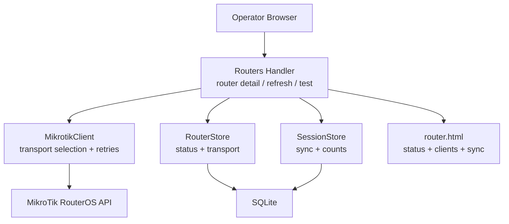
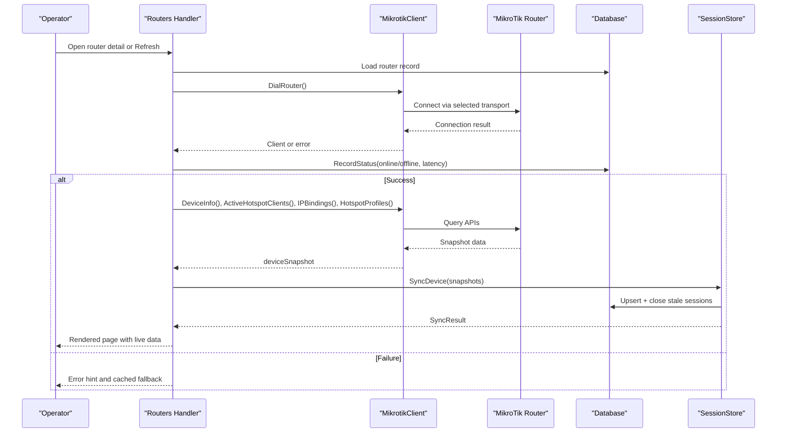
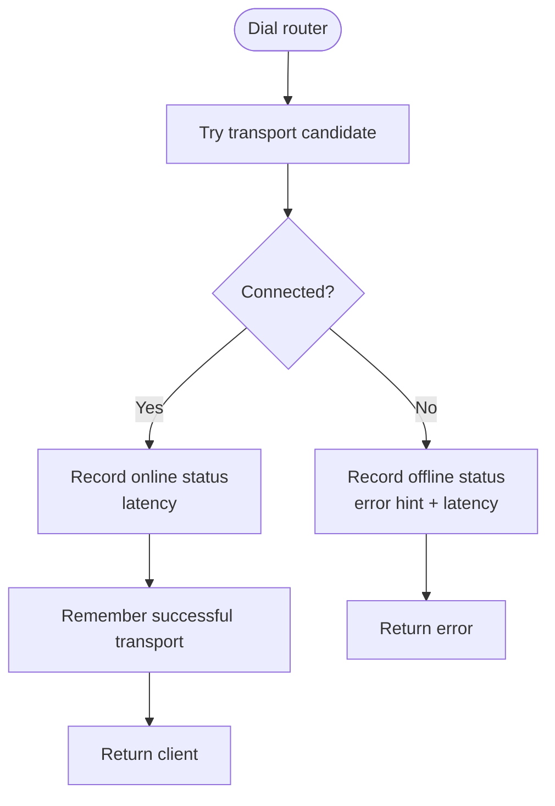
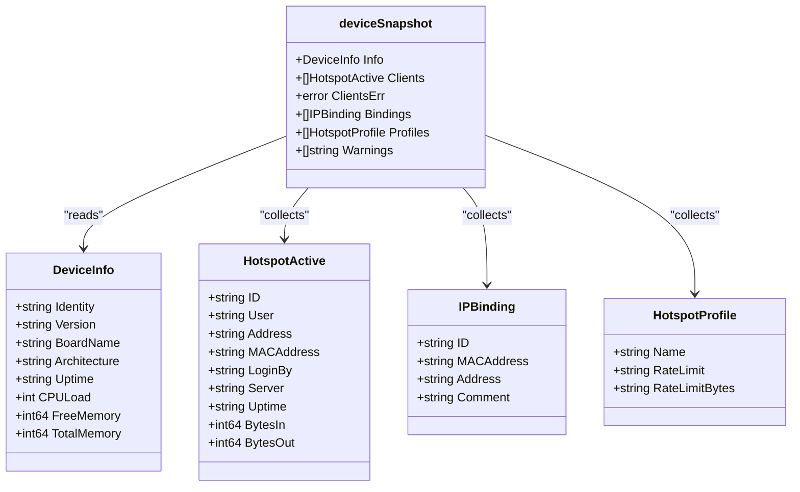
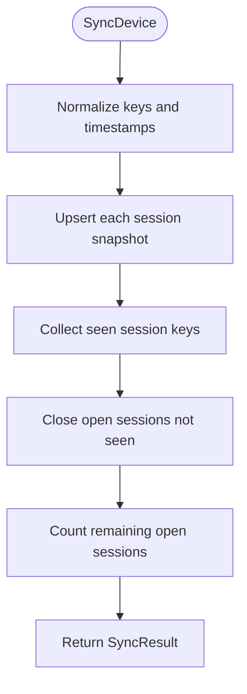
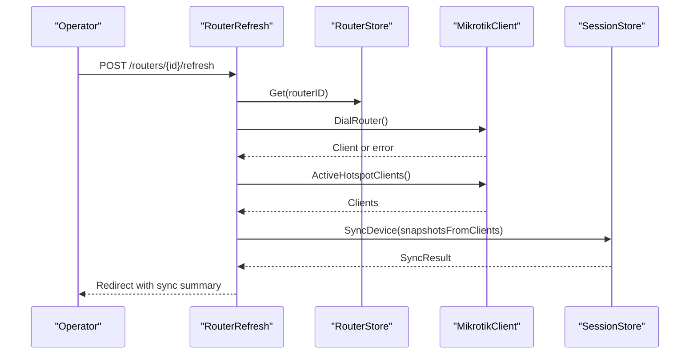
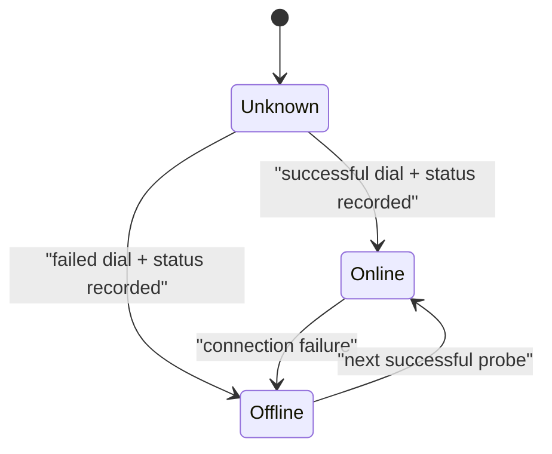
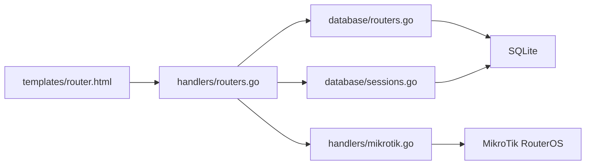

# Router Status Monitoring

<cite>
**Referenced Files in This Document**   
- [README.md](file://README.md)
- [database/routers.go](file://database/routers.go)
- [database/sessions.go](file://database/sessions.go)
- [handlers/routers.go](file://handlers/routers.go)
- [handlers/mikrotik.go](file://handlers/mikrotik.go)
- [templates/router.html](file://templates/router.html)
</cite>

## Table of Contents
1. [Introduction](#introduction)
2. [Project Structure](#project-structure)
3. [Core Components](#core-components)
4. [Architecture Overview](#architecture-overview)
5. [Detailed Component Analysis](#detailed-component-analysis)
6. [Dependency Analysis](#dependency-analysis)
7. [Performance Considerations](#performance-considerations)
8. [Troubleshooting Guide](#troubleshooting-guide)
9. [Conclusion](#conclusion)

## Introduction
This document explains how the controller monitors MikroTik router health, tracks online/offline status and latency, collects device snapshots, synchronizes live hotspot sessions, and exposes manual refresh operations. It is intended for operators who need to interpret router status indicators, understand connection states, and monitor performance metrics such as CPU load, memory usage, active clients, IP bindings, and user profiles.

The system combines:
- Health probing that records router status and latency.
- A device snapshot mechanism that reads system information, active hotspot clients, IP bindings, and hotspot profiles.
- Session synchronization that reconciles local session history with the live device state.
- Manual session table synchronization through a dedicated refresh action.

**Section sources**
- [README.md:167-185](file://README.md#L167-L185)

## Project Structure
Router monitoring spans several layers:
- Database models and persistence for routers and sessions.
- HTTP handlers for inventory, device detail, testing, and refresh.
- RouterOS client abstraction supporting multiple transports.
- Templates rendering status, clients, and sync results.

**Diagram sources**
- [handlers/routers.go:481-594](file://handlers/routers.go#L481-L594)
- [handlers/mikrotik.go:183-240](file://handlers/mikrotik.go#L183-L240)
- [database/routers.go:297-317](file://database/routers.go#L297-L317)
- [database/sessions.go:101-178](file://database/sessions.go#L101-L178)
- [templates/router.html:14-31](file://templates/router.html#L14-L31)

**Section sources**
- [handlers/routers.go:14-40](file://handlers/routers.go#L14-L40)
- [handlers/mikrotik.go:160-181](file://handlers/mikrotik.go#L160-L181)
- [database/routers.go:57-98](file://database/routers.go#L57-L98)
- [database/sessions.go:12-76](file://database/sessions.go#L12-L76)

## Core Components
This section summarizes the main pieces involved in router status monitoring.

| Component | Responsibility | Key Behavior |
|---|---|---|
| `Router` model | Stores registered router identity, credentials, transport settings, and last-known health | Tracks `LastStatus`, `LastError`, `LastLatencyMS`, `LastSeenAt`, and successful transport mode |
| `RouterStore` | Persists router inventory and health probes | Records online/offline status, error hints, latency, and last working transport |
| `MikrotikClient` | Connects to a router using binary API or REST, with retry and classification | Selects transport candidates, measures dial time, classifies errors, and runs commands |
| `deviceSnapshot` | Best-effort collection of device data | Reads system info, active clients, IP bindings, and profiles; collects warnings instead of failing fast |
| `SessionStore` | Tracks observed hotspot sessions locally | Upserts live entries, closes stale sessions, and reports sync results |
| `routerPage` view | Renders operator device manager | Shows live/cached clients, system stats, bindings, profiles, sync summary, and voucher context |

**Section sources**
- [database/routers.go:57-98](file://database/routers.go#L57-L98)
- [database/routers.go:297-317](file://database/routers.go#L297-L317)
- [handlers/mikrotik.go:160-181](file://handlers/mikrotik.go#L160-L181)
- [handlers/routers.go:555-594](file://handlers/routers.go#L555-L594)
- [database/sessions.go:12-76](file://database/sessions.go#L12-L76)
- [handlers/routers.go:22-40](file://handlers/routers.go#L22-L40)

## Architecture Overview
Router status monitoring follows a request-driven flow:
1. The operator opens a router page or triggers a refresh/test action.
2. The handler dials the router through `MikrotikClient`.
3. Dialing records online/offline status and latency.
4. On success, the handler loads a device snapshot.
5. Live hotspot clients are converted into session snapshots.
6. The session store reconciles local state with the device list.
7. The template renders status indicators, client tables, and sync results.

**Diagram sources**
- [handlers/routers.go:481-553](file://handlers/routers.go#L481-L553)
- [handlers/mikrotik.go:183-240](file://handlers/mikrotik.go#L183-L240)
- [handlers/mikrotik.go:1355-1379](file://handlers/mikrotik.go#L1355-L1379)
- [database/sessions.go:101-178](file://database/sessions.go#L101-L178)

## Detailed Component Analysis

### Router Health Probing and Latency Tracking
Every attempt to connect to a router is measured and recorded:
- Successful connections update the router’s last status to online and store the measured latency.
- Failed connections update the last status to offline, store an operator-friendly error hint, and record latency.
- The transport that successfully connected is remembered so future auto-mode probes start with the known-good protocol.

**Diagram sources**
- [handlers/mikrotik.go:183-240](file://handlers/mikrotik.go#L183-L240)
- [handlers/mikrotik.go:1355-1379](file://handlers/mikrotik.go#L1355-L1379)
- [database/routers.go:297-317](file://database/routers.go#L297-L317)

**Section sources**
- [handlers/mikrotik.go:183-240](file://handlers/mikrotik.go#L183-L240)
- [handlers/mikrotik.go:1355-1379](file://handlers/mikrotik.go#L1355-L1379)
- [database/routers.go:297-317](file://database/routers.go#L297-L317)

### Device Snapshot Mechanism
When the router is reachable, the handler builds a best-effort snapshot:
- System identity and resource information including CPU load, uptime, free memory, and total memory.
- Active hotspot clients read from `/ip/hotspot/active/print`.
- IP bindings used by hotspot configuration.
- Hotspot user profiles available on the device.
- Individual failures are collected as warnings so partial data still reaches the operator.

**Diagram sources**
- [handlers/mikrotik.go:650-688](file://handlers/mikrotik.go#L650-L688)
- [handlers/routers.go:555-594](file://handlers/routers.go#L555-L594)

**Section sources**
- [handlers/mikrotik.go:650-688](file://handlers/mikrotik.go#L650-L688)
- [handlers/routers.go:555-594](file://handlers/routers.go#L555-L594)

### Live Client Monitoring and Session Synchronization
Live hotspot clients are transformed into session snapshots and reconciled with the local session table:
- Each client entry becomes a `SessionSnapshot`.
- If the RouterOS uptime string can be parsed, the controller estimates when the session started.
- Existing sessions are refreshed; new sessions are inserted.
- Sessions no longer reported by the router are closed with a “client disconnected” reason.
- The sync result reports tracked count, closed stale sessions, and current open count.

**Diagram sources**
- [database/sessions.go:101-178](file://database/sessions.go#L101-L178)
- [handlers/routers.go:598-620](file://handlers/routers.go#L598-L620)

**Section sources**
- [database/sessions.go:101-178](file://database/sessions.go#L101-L178)
- [handlers/routers.go:598-620](file://handlers/routers.go#L598-L620)

### RouterRefresh Functionality
The manual refresh endpoint synchronizes the local session table with the device:
- Validates the router ID and loads the router record.
- Dials the router and reads the active hotspot client list.
- Converts clients into session snapshots.
- Calls `SyncDevice` to reconcile local state.
- Returns a flash message showing tracked clients, currently tracked sessions, and any closed stale sessions.

**Diagram sources**
- [handlers/routers.go:383-425](file://handlers/routers.go#L383-L425)
- [handlers/routers.go:598-620](file://handlers/routers.go#L598-L620)
- [database/sessions.go:101-178](file://database/sessions.go#L101-L178)

**Section sources**
- [handlers/routers.go:383-425](file://handlers/routers.go#L383-L425)

### Interpreting Status Indicators and Connection States
The router detail page shows:
- Router name, endpoint, location, and last-seen timestamp.
- Last status badge indicating unknown, online, or offline.
- Whether the page is showing live data or cached data.
- System metrics such as CPU load and memory.
- Number of active clients, profiles, IP bindings, and stale closed sessions.
- A warning when only cached sessions are displayed because the API connection failed.

**Diagram sources**
- [database/routers.go:12-17](file://database/routers.go#L12-L17)
- [handlers/mikrotik.go:1355-1379](file://handlers/mikrotik.go#L1355-L1379)
- [templates/router.html:14-31](file://templates/router.html#L14-L31)

**Section sources**
- [database/routers.go:12-17](file://database/routers.go#L12-L17)
- [handlers/mikrotik.go:1355-1379](file://handlers/mikrotik.go#L1355-L1379)
- [templates/router.html:14-31](file://templates/router.html#L14-L31)

### Performance Metrics and Health Signals
System information provides operational signals:
- `CPULoad`: percentage value indicating processor utilization.
- `FreeMemory` and `TotalMemory`: memory availability and capacity.
- `Uptime`: device uptime string used for display and session start estimation.
- Active client count and per-client byte counters help identify heavy users or unusual traffic patterns.
- IP bindings and hotspot profiles indicate configuration scope and rate-limiting policies.

These values are rendered in the router detail view and can be used to detect overloaded devices, memory pressure, or configuration drift.

**Section sources**
- [handlers/mikrotik.go:650-688](file://handlers/mikrotik.go#L650-L688)
- [templates/router.html:64-72](file://templates/router.html#L64-L72)

## Dependency Analysis
The following diagram maps the primary dependencies between components involved in router status monitoring.

**Diagram sources**
- [handlers/routers.go:481-594](file://handlers/routers.go#L481-L594)
- [handlers/mikrotik.go:183-240](file://handlers/mikrotik.go#L183-L240)
- [database/routers.go:297-317](file://database/routers.go#L297-L317)
- [database/sessions.go:101-178](file://database/sessions.go#L101-L178)
- [templates/router.html:14-31](file://templates/router.html#L14-L31)

**Section sources**
- [handlers/routers.go:481-594](file://handlers/routers.go#L481-L594)
- [handlers/mikrotik.go:183-240](file://handlers/mikrotik.go#L183-L240)
- [database/routers.go:297-317](file://database/routers.go#L297-L317)
- [database/sessions.go:101-178](file://database/sessions.go#L101-L178)

## Performance Considerations
- **API timeout budget**: Per-call timeouts prevent slow routers from blocking the operator interface.
- **Auto transport probing**: Auto mode tries secure transports first and remembers the last successful transport to reduce repeated probing.
- **Best-effort snapshots**: Partial failures are captured as warnings so the UI remains usable even if one subsystem is unavailable.
- **Session upserts**: Reconciliation uses conflict-aware updates to avoid unnecessary churn while keeping local state consistent.
- **Connection loss handling**: Transient network drops trigger a single reconnect attempt, reducing noise while recovering from brief outages.

[No sources needed since this section provides general guidance]

## Troubleshooting Guide
Common issues and their interpretation:

| Symptom | Likely Cause | What to Check |
|---|---|---|
| Router shows offline | API connection failed | Verify IP, port, service access, firewall rules, username/password, and TLS settings |
| Router shows unknown | No recent probe or initial state | Trigger Test Connection or open the router detail page |
| Live data unavailable but cached clients shown | API dial failed during page load | Use Refresh to force a fresh session table sync |
| Stale closed sessions appear | Router rebooted or API dropped earlier | Run Refresh to close stale sessions |
| Active hotspot clients unavailable | Hotspot package disabled or unsupported command | Confirm hotspot is enabled and API permissions allow reading active clients |
| IP bindings or profiles unavailable | Permission or version mismatch | Check API account rights and RouterOS capabilities |
| High CPU load or low memory | Device under stress | Monitor `CPULoad`, `FreeMemory`, and active client volume |

Useful endpoints and actions:
- **Test Connection**: validates credentials and basic device reachability.
- **Refresh Sessions**: forces synchronization of the local session table with the device.
- **Router Detail Page**: displays live or cached clients, system metrics, bindings, profiles, and sync results.

**Section sources**
- [handlers/routers.go:338-381](file://handlers/routers.go#L338-L381)
- [handlers/routers.go:383-425](file://handlers/routers.go#L383-L425)
- [handlers/routers.go:481-553](file://handlers/routers.go#L481-L553)
- [handlers/mikrotik.go:89-113](file://handlers/mikrotik.go#L89-L113)

## Conclusion
Router status monitoring in this controller is built around reliable connectivity probing, best-effort device snapshots, and robust session reconciliation. Operators can interpret status badges, latency, and system metrics to assess router health, use Refresh to keep session tables accurate, and rely on cached fallback data when routers are temporarily unreachable. The design prioritizes clarity, resilience, and actionable diagnostics for multi-router hotspot environments.

[No sources needed since this section summarizes without analyzing specific files]