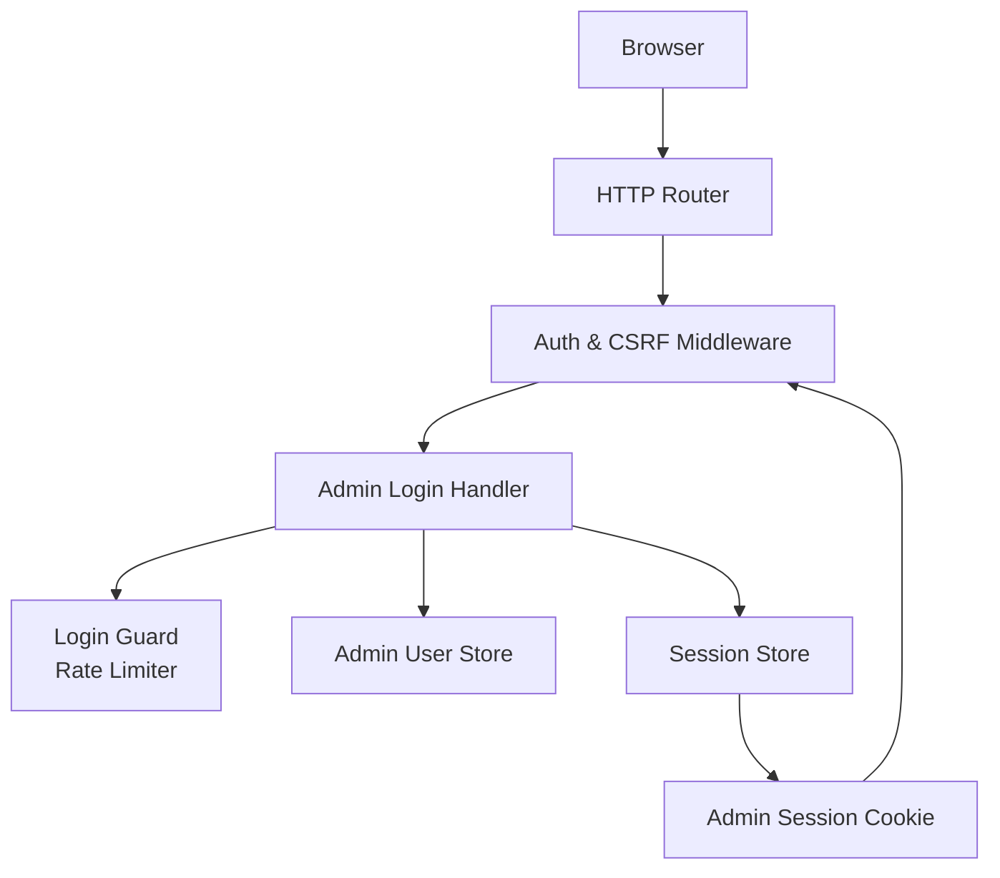
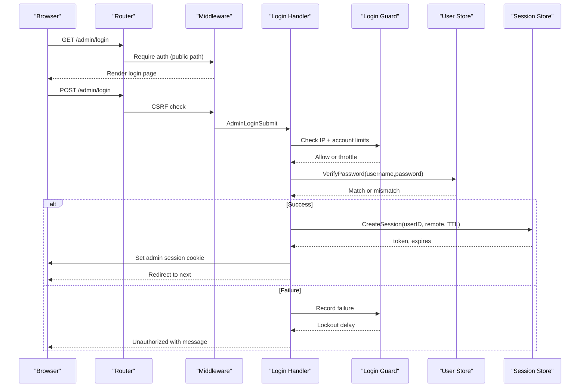
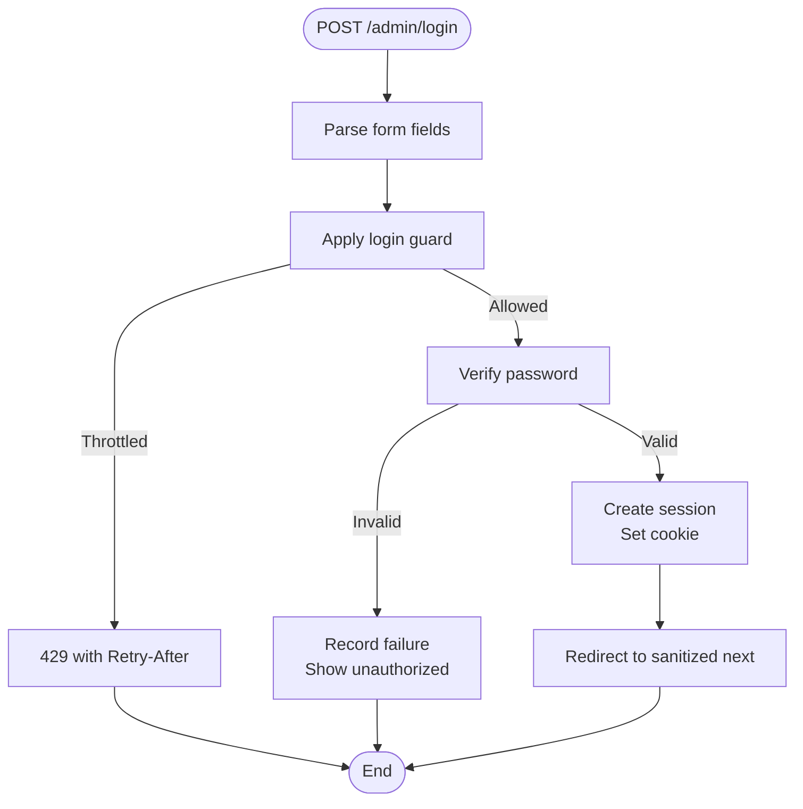
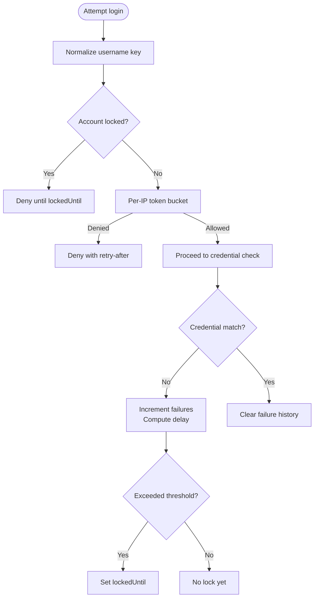
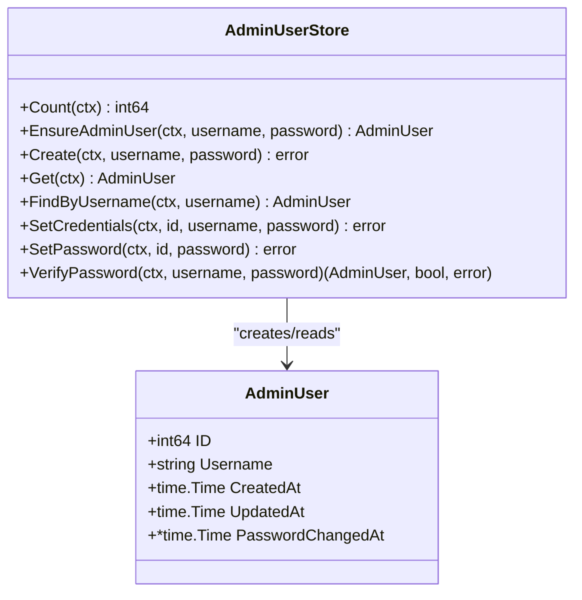
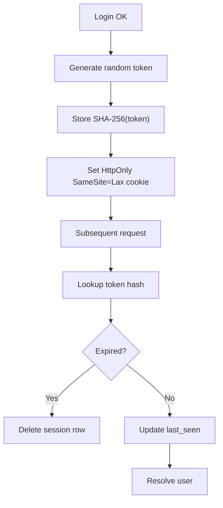
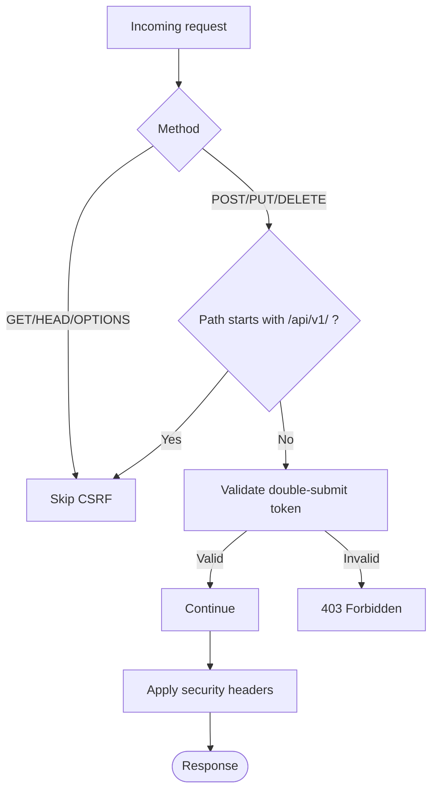
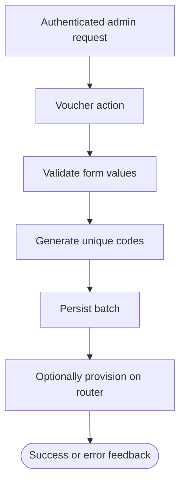
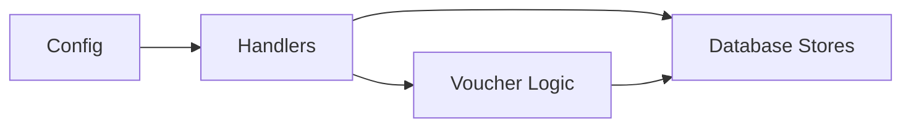

# Authentication Problems

<cite>
**Referenced Files in This Document**
- [handlers/adminauth.go](file://handlers/adminauth.go)
- [handlers/adminlogin.go](file://handlers/adminlogin.go)
- [handlers/adminmiddleware.go](file://handlers/adminmiddleware.go)
- [handlers/handlers.go](file://handlers/handlers.go)
- [database/admin_users.go](file://database/admin_users.go)
- [database/admin_sessions.go](file://database/admin_sessions.go)
- [config.go](file://config.go)
- [handlers/vouchers.go](file://handlers/vouchers.go)
- [database/vouchers.go](file://database/vouchers.go)
- [database/voucher_code.go](file://database/voucher_code.go)
</cite>

## Table of Contents
1. [Introduction](#introduction)
2. [Project Structure](#project-structure)
3. [Core Components](#core-components)
4. [Architecture Overview](#architecture-overview)
5. [Detailed Component Analysis](#detailed-component-analysis)
6. [Dependency Analysis](#dependency-analysis)
7. [Performance Considerations](#performance-considerations)
8. [Troubleshooting Guide](#troubleshooting-guide)
9. [Conclusion](#conclusion)

## Introduction
This document provides comprehensive troubleshooting guidance for authentication-related issues in the admin panel and voucher system. It covers invalid credentials, session expiration, CSRF token errors, permission denied responses, password reset procedures, account lockouts, role-based access control behavior, cookie and session management problems, browser compatibility issues, security header conflicts, debugging flows, auth log analysis, database corruption scenarios affecting user accounts, and secure configuration best practices.

## Project Structure
The authentication and authorization logic spans handlers, database stores, and application configuration:

- Admin login flow and rate limiting are implemented in the handler layer.
- Session creation, validation, and revocation live in the database store.
- Security headers, CSRF protection, and request logging are applied by middleware.
- Voucher generation, redemption, and lifecycle state are handled separately but share the same authenticated panel.

**Diagram sources**
- [handlers/handlers.go:288-302](file://handlers/handlers.go#L288-L302)
- [handlers/adminlogin.go:35-77](file://handlers/adminlogin.go#L35-L77)
- [handlers/adminauth.go:18-68](file://handlers/adminauth.go#L18-L68)
- [database/admin_users.go:293-328](file://database/admin_users.go#L293-L328)
- [database/admin_sessions.go:23-51](file://database/admin_sessions.go#L23-L51)

**Section sources**
- [handlers/handlers.go:288-302](file://handlers/handlers.go#L288-L302)
- [handlers/adminlogin.go:35-77](file://handlers/adminlogin.go#L35-L77)
- [handlers/adminauth.go:18-68](file://handlers/adminauth.go#L18-L68)
- [database/admin_users.go:293-328](file://database/admin_users.go#L293-L328)
- [database/admin_sessions.go:23-51](file://database/admin_sessions.go#L23-L51)

## Core Components
- Admin login handler: parses form fields, applies login guard, verifies credentials, creates a session, sets an HttpOnly SameSite=Lax cookie, and redirects to the intended destination.
- Login guard: enforces per-IP throttling and per-account exponential backoff lockout after repeated failures.
- Admin user store: validates minimum password length, hashes passwords with PBKDF2-HMAC-SHA256, compares hashes in constant time, and supports credential updates that revoke all sessions.
- Session store: generates random tokens, stores only their SHA-256 hash, checks expiry, refreshes last seen, and supports logout and bulk revocation.
- Middleware: requires authentication for protected routes, sanitizes redirect targets, applies strict security headers, and enforces CSRF on mutating requests.
- Voucher system: generates codes, persists them, tracks lifecycle states, and optionally provisions hotspot users on routers; it is protected by the same admin authentication.

**Section sources**
- [handlers/adminlogin.go:35-77](file://handlers/adminlogin.go#L35-L77)
- [handlers/adminauth.go:18-68](file://handlers/adminauth.go#L18-L68)
- [database/admin_users.go:64-94](file://database/admin_users.go#L64-L94)
- [database/admin_users.go:293-328](file://database/admin_users.go#L293-L328)
- [database/admin_sessions.go:23-51](file://database/admin_sessions.go#L23-L51)
- [handlers/handlers.go:498-524](file://handlers/handlers.go#L498-L524)
- [handlers/handlers.go:546-560](file://handlers/handlers.go#L546-L560)
- [handlers/vouchers.go:293-370](file://handlers/vouchers.go#L293-L370)

## Architecture Overview
The admin panel uses a layered approach:

1. Request enters the router and passes through recovery, logging, security headers, and CSRF guards.
2. Protected routes require a valid admin session; otherwise, browsers are redirected to login while API clients receive 401.
3. The login handler applies the login guard before touching credentials.
4. Credentials are verified against stored PBKDF2 hashes.
5. On success, a session token is created, hashed in the database, and set as a secure cookie.
6. Subsequent requests validate the session cookie and refresh activity timestamps.

**Diagram sources**
- [handlers/handlers.go:288-302](file://handlers/handlers.go#L288-L302)
- [handlers/handlers.go:546-560](file://handlers/handlers.go#L546-L560)
- [handlers/adminlogin.go:35-77](file://handlers/adminlogin.go#L35-L77)
- [handlers/adminauth.go:70-92](file://handlers/adminauth.go#L70-L92)
- [database/admin_users.go:293-328](file://database/admin_users.go#L293-L328)
- [database/admin_sessions.go:23-51](file://database/admin_sessions.go#L23-L51)

## Detailed Component Analysis

### Admin Authentication Flow
- The login page is public under the admin prefix.
- Successful sign-in sets an HttpOnly, SameSite=Lax cookie with Secure flag controlled by configuration.
- Logout revokes the session in the database and clears the cookie.
- The redirect target is sanitized to prevent open redirects.

**Diagram sources**
- [handlers/adminlogin.go:35-77](file://handlers/adminlogin.go#L35-L77)
- [handlers/adminauth.go:164-180](file://handlers/adminauth.go#L164-L180)
- [handlers/adminmiddleware.go:68-97](file://handlers/adminmiddleware.go#L68-L97)

**Section sources**
- [handlers/adminlogin.go:35-77](file://handlers/adminlogin.go#L35-L77)
- [handlers/adminlogin.go:97-140](file://handlers/adminlogin.go#L97-L140)
- [handlers/adminmiddleware.go:68-97](file://handlers/adminmiddleware.go#L68-L97)

### Login Guard and Account Lockout
- Per-IP token bucket prevents rapid brute-force attempts from one address.
- Per-account failure counter triggers exponential backoff lockout after a threshold.
- A successful login clears the failure history for that account.
- Throttled responses include a Retry-After header and a human-readable wait message.

**Diagram sources**
- [handlers/adminauth.go:32-68](file://handlers/adminauth.go#L32-L68)
- [handlers/adminauth.go:70-127](file://handlers/adminauth.go#L70-L127)
- [handlers/adminauth.go:164-180](file://handlers/adminauth.go#L164-L180)

**Section sources**
- [handlers/adminauth.go:18-68](file://handlers/adminauth.go#L18-L68)
- [handlers/adminauth.go:70-127](file://handlers/adminauth.go#L70-L127)
- [handlers/adminauth.go:164-180](file://handlers/adminauth.go#L164-L180)

### Password Verification and Storage
- Passwords are validated for minimum length.
- Hashing uses PBKDF2-HMAC-SHA256 with a per-password salt and configurable iterations.
- Comparison is constant-time to avoid timing side channels.
- Unknown usernames still perform a derivation to avoid enumeration via timing.

**Diagram sources**
- [database/admin_users.go:46-59](file://database/admin_users.go#L46-L59)
- [database/admin_users.go:100-159](file://database/admin_users.go#L100-L159)
- [database/admin_users.go:293-328](file://database/admin_users.go#L293-L328)

**Section sources**
- [database/admin_users.go:64-94](file://database/admin_users.go#L64-L94)
- [database/admin_users.go:293-328](file://database/admin_users.go#L293-L328)

### Session Management
- Sessions are created with a random token and an expiry derived from the configured TTL.
- Only the SHA-256 hash of the token is stored in the database.
- Session lookup rejects expired tokens and cleans them up.
- Logout deletes the specific session; changing credentials revokes all sessions for the user.

**Diagram sources**
- [database/admin_sessions.go:23-51](file://database/admin_sessions.go#L23-L51)
- [database/admin_sessions.go:53-82](file://database/admin_sessions.go#L53-L82)
- [database/admin_sessions.go:84-99](file://database/admin_sessions.go#L84-L99)
- [handlers/adminlogin.go:112-140](file://handlers/adminlogin.go#L112-L140)

**Section sources**
- [database/admin_sessions.go:23-51](file://database/admin_sessions.go#L23-L51)
- [database/admin_sessions.go:53-82](file://database/admin_sessions.go#L53-L82)
- [database/admin_sessions.go:84-99](file://database/admin_sessions.go#L84-L99)
- [handlers/adminlogin.go:112-140](file://handlers/adminlogin.go#L112-L140)

### CSRF Protection and Security Headers
- CSRF double-submit is enforced for mutating requests under the admin prefix.
- Captive portal endpoints are intentionally exempt because they may not retain cookies.
- Security headers include strict defaults: no clickjacking, no framing, restrictive CSP, and safe content type handling.
- Inline scripts are allowed explicitly for dashboard functionality; connect-src allows same-origin fetch calls.

**Diagram sources**
- [handlers/handlers.go:527-544](file://handlers/handlers.go#L527-L544)
- [handlers/handlers.go:546-560](file://handlers/handlers.go#L546-L560)
- [handlers/handlers.go:498-524](file://handlers/handlers.go#L498-L524)

**Section sources**
- [handlers/handlers.go:527-544](file://handlers/handlers.go#L527-L544)
- [handlers/handlers.go:546-560](file://handlers/handlers.go#L546-L560)
- [handlers/handlers.go:498-524](file://handlers/handlers.go#L498-L524)

### Voucher System Authentication Context
- Voucher listing, generation, status changes, deletion, push, and validation are protected by the same admin session requirement.
- Voucher code generation produces human-friendly, collision-resistant codes; duplicates trigger batch regeneration.
- Redemption is transactional and enforces local ledger rules before allowing activation.

**Diagram sources**
- [handlers/vouchers.go:293-370](file://handlers/vouchers.go#L293-L370)
- [database/vouchers.go:224-277](file://database/vouchers.go#L224-L277)
- [database/voucher_code.go:53-76](file://database/voucher_code.go#L53-L76)

**Section sources**
- [handlers/vouchers.go:293-370](file://handlers/vouchers.go#L293-L370)
- [database/vouchers.go:224-277](file://database/vouchers.go#L224-L277)
- [database/voucher_code.go:53-76](file://database/voucher_code.go#L53-L76)

## Dependency Analysis
- Handlers depend on the database layer for user verification and session management.
- Middleware depends on configuration for paths, timeouts, and cookie security flags.
- Voucher handlers depend on both voucher persistence and optional router provisioning.

**Diagram sources**
- [config.go:14-77](file://config.go#L14-L77)
- [handlers/handlers.go:288-302](file://handlers/handlers.go#L288-L302)
- [handlers/vouchers.go:293-370](file://handlers/vouchers.go#L293-L370)
- [database/admin_users.go:100-159](file://database/admin_users.go#L100-L159)
- [database/admin_sessions.go:23-51](file://database/admin_sessions.go#L23-L51)

**Section sources**
- [config.go:14-77](file://config.go#L14-L77)
- [handlers/handlers.go:288-302](file://handlers/handlers.go#L288-L302)
- [handlers/vouchers.go:293-370](file://handlers/vouchers.go#L293-L370)
- [database/admin_users.go:100-159](file://database/admin_users.go#L100-L159)
- [database/admin_sessions.go:23-51](file://database/admin_sessions.go#L23-L51)

## Performance Considerations
- Login guard keeps counters in memory; restarts clear them, which is acceptable for operator panels.
- Password hashing uses PBKDF2 with a high iteration count; consider hardware constraints when tuning.
- Session lookups update last_seen on each request; prune expired sessions periodically if needed.
- CSRF parsing handles multipart forms carefully to avoid rejecting legitimate uploads.

[No sources needed since this section provides general guidance]

## Troubleshooting Guide

### Invalid Credentials
Symptoms:
- Repeated “Wrong operator name or password” messages.
- Account becomes temporarily locked after multiple failures.

Likely causes:
- Incorrect username or password.
- Case normalization differences (usernames are normalized).
- Brute-force protection triggered.

Resolution steps:
- Confirm the exact operator username and password.
- Wait for the lockout period indicated by the UI or Retry-After header.
- If you cannot remember the password, use the settings page to change credentials; this revokes existing sessions.
- If the account is missing entirely, ensure the initial admin user was created during first boot.

Relevant implementation details:
- Credential verification returns false for wrong passwords and records failures.
- Lockout delay grows exponentially after a threshold.
- Successful login clears failure history.

**Section sources**
- [handlers/adminlogin.go:35-77](file://handlers/adminlogin.go#L35-L77)
- [handlers/adminauth.go:70-127](file://handlers/adminauth.go#L70-L127)
- [database/admin_users.go:293-328](file://database/admin_users.go#L293-L328)

### Session Expiration
Symptoms:
- After some time, the panel redirects to login even though you were previously signed in.
- API calls return 401 without a redirect.

Likely causes:
- Admin session TTL elapsed.
- Cookie expired or was cleared.
- Backend invalidated sessions due to password change.

Resolution steps:
- Sign in again.
- Adjust ADMIN_SESSION_TTL if sessions expire too quickly.
- Ensure SECURE_COOKIES is enabled behind HTTPS so cookies are retained correctly.

Relevant implementation details:
- Sessions have a default TTL and can be overridden via configuration.
- Session lookup rejects expired tokens and removes them.
- Changing credentials revokes all sessions for the user.

**Section sources**
- [database/admin_sessions.go:23-51](file://database/admin_sessions.go#L23-L51)
- [database/admin_sessions.go:53-82](file://database/admin_sessions.go#L53-L82)
- [database/admin_users.go:204-243](file://database/admin_users.go#L204-L243)
- [config.go:48-57](file://config.go#L48-L57)

### CSRF Token Errors
Symptoms:
- Submitting the login form or performing admin actions returns 403 Forbidden.
- Logout or other mutating operations fail unexpectedly.

Likely causes:
- Missing or stale CSRF token in the form.
- Using a script or external site to submit a mutating request.
- Multipart form upload where the token was not parsed correctly.

Resolution steps:
- Always load the page first to obtain the current CSRF token.
- Include csrf_token in every mutating request.
- For background uploads, ensure the CSRF field is present and parsed.

Relevant implementation details:
- CSRF guard skips GET/HEAD/OPTIONS and API v1 routes.
- parseRequestForm handles multipart forms to populate PostForm for CSRF checks.

**Section sources**
- [handlers/handlers.go:527-544](file://handlers/handlers.go#L527-L544)
- [handlers/handlers.go:546-560](file://handlers/handlers.go#L546-L560)

### Permission Denied Messages
Symptoms:
- Unauthenticated requests are redirected to login.
- JSON/API requests receive 401 with an unauthorized message.

Likely causes:
- Missing or invalid admin session cookie.
- Attempting to access a protected route without signing in.

Resolution steps:
- Sign in via the admin login page.
- For machine clients, ensure the session cookie is present or use supported API authentication mechanisms.
- Avoid relying on open redirects; the next parameter is sanitized.

Relevant implementation details:
- requireAuth redirects browsers and returns 401 for JSON clients.
- sanitizeNext blocks unsafe redirect targets.

**Section sources**
- [handlers/adminmiddleware.go:31-55](file://handlers/adminmiddleware.go#L31-L55)
- [handlers/adminmiddleware.go:68-97](file://handlers/adminmiddleware.go#L68-L97)

### Password Reset Procedures
Symptoms:
- You cannot sign in and need to recover access.

Resolution steps:
- Use the settings page to change the operator username and/or password.
- Changing the password automatically revokes all existing sessions.
- If the admin user does not exist, ensure the controller initializes the account on first boot.

Security notes:
- Minimum password length is enforced at the database layer.
- Weak passwords are rejected with a distinct error.

**Section sources**
- [database/admin_users.go:87-94](file://database/admin_users.go#L87-L94)
- [database/admin_users.go:204-243](file://database/admin_users.go#L204-L243)
- [database/admin_users.go:260-291](file://database/admin_users.go#L260-L291)

### User Account Lockout Scenarios
Symptoms:
- Login attempts are blocked with a message indicating a lockout period.
- Retry-After header suggests waiting.

Resolution steps:
- Wait for the lockout duration to expire.
- Reduce automated login retries.
- After a successful login, the failure counter resets.

Relevant implementation details:
- Per-IP throttling and per-account exponential backoff work together.
- Locked accounts deny password checks entirely until unlocked.

**Section sources**
- [handlers/adminauth.go:18-68](file://handlers/adminauth.go#L18-L68)
- [handlers/adminauth.go:70-127](file://handlers/adminauth.go#L70-L127)
- [handlers/adminauth.go:164-180](file://handlers/adminauth.go#L164-L180)

### Role-Based Access Control Issues
Observation:
- The admin panel currently uses a single operator account model rather than multiple roles.
- All protected routes require a valid admin session; there is no granular role enforcement.

Resolution steps:
- Treat the operator account as the sole privileged identity.
- If multi-role support is required, extend the admin user model and middleware accordingly.

**Section sources**
- [database/admin_users.go:46-59](file://database/admin_users.go#L46-L59)
- [handlers/adminmiddleware.go:31-55](file://handlers/adminmiddleware.go#L31-L55)

### Cookie and Session Management Problems
Symptoms:
- Cookies not sent on cross-site navigation.
- Sessions drop immediately after navigating from another origin.
- Secure cookies not working over HTTP.

Resolution steps:
- Keep SameSite=Lax; Strict would break navigation from external links.
- Enable SECURE_COOKIES=1 behind HTTPS.
- Ensure the admin cookie path is correct and not blocked by browser privacy settings.

Relevant implementation details:
- Admin session cookie is HttpOnly, SameSite=Lax, and Secure based on configuration.
- Logout clears the cookie and revokes the session.

**Section sources**
- [handlers/adminlogin.go:112-140](file://handlers/adminlogin.go#L112-L140)
- [config.go:40-47](file://config.go#L40-L47)

### Browser Compatibility Issues
Symptoms:
- Dashboard interface dropdown remains disabled.
- Inline scripts do not execute.
- Fetch calls to /api/v1 are blocked.

Resolution steps:
- Do not override Content-Security-Policy to remove script-src 'unsafe-inline' or connect-src 'self'.
- Ensure the server sends the provided security headers.
- Verify that inline scripts are present in templates as expected.

Relevant implementation details:
- Security headers set default-src 'none' with explicit allowances for inline scripts and same-origin connections.
- Tests assert these directives remain intact.

**Section sources**
- [handlers/handlers.go:498-524](file://handlers/handlers.go#L498-L524)

### Debugging Authentication Flows
Recommended steps:
- Inspect HTTP logs for method, path, status, bytes, remote address, and duration.
- Check for 429 responses with Retry-After during brute-force patterns.
- Verify CSRF token presence in mutating requests.
- Confirm admin session cookie existence and attributes.
- Review session rows for token_hash validity and expiry.

Useful log entries:
- Admin login throttled with retry_after_seconds.
- Admin signed in/out events.
- HTTP request logs showing unauthorized or forbidden responses.

**Section sources**
- [handlers/handlers.go:479-496](file://handlers/handlers.go#L479-L496)
- [handlers/adminauth.go:164-180](file://handlers/adminauth.go#L164-L180)
- [handlers/adminlogin.go:75-76](file://handlers/adminlogin.go#L75-L76)

### Analyzing Auth Logs
What to look for:
- Repeated 401 responses indicating failed credentials.
- 429 responses indicating throttling or lockout.
- 403 responses indicating CSRF failures.
- Redirects to /admin/login indicating missing sessions.

Actions:
- Correlate remote addresses with known operators or attackers.
- Identify whether failures occur before or after CSRF checks.
- Track session creation and logout events.

**Section sources**
- [handlers/handlers.go:479-496](file://handlers/handlers.go#L479-L496)
- [handlers/adminauth.go:164-180](file://handlers/adminauth.go#L164-L180)

### Resolving Database Corruption Affecting User Accounts
Symptoms:
- Salt appears corrupt during password verification.
- Cannot create or update admin credentials.
- Session lookup fails unexpectedly.

Resolution steps:
- Back up the database file before making changes.
- Repair or restore the database from a known-good snapshot.
- Recreate the admin user if necessary using the initialization path.
- After restoring, verify that session rows contain valid token_hash values.

Relevant implementation details:
- Corrupt salt raises a specific error during verification.
- Session rows store only the SHA-256 hash of tokens.

**Section sources**
- [database/admin_users.go:316-319](file://database/admin_users.go#L316-L319)
- [database/admin_sessions.go:23-51](file://database/admin_sessions.go#L23-L51)

### Secure Authentication Configuration and Common Misconfigurations
Best practices:
- Run behind HTTPS and enable SECURE_COOKIES=1.
- Keep ADMIN_PATH consistent and avoid exposing the panel directly over untrusted networks.
- Do not disable CSRF protection or alter security headers unless you fully understand the implications.
- Use strong passwords meeting the minimum length requirement.
- Monitor login attempts and adjust timeout/TTL settings appropriately.

Common misconfigurations:
- Enabling SECURE_COOKIES over plain HTTP causes cookies to be dropped.
- Overriding CSP to allow arbitrary origins breaks dashboard functionality.
- Removing CSRF protection exposes mutating endpoints to forgery.
- Setting ADMIN_SESSION_TTL too low causes frequent logouts.

**Section sources**
- [config.go:40-57](file://config.go#L40-L57)
- [handlers/handlers.go:498-524](file://handlers/handlers.go#L498-L524)
- [handlers/handlers.go:546-560](file://handlers/handlers.go#L546-L560)

## Conclusion
Authentication in this system combines robust rate limiting, secure password hashing, hashed session storage, strict CSRF enforcement, and conservative security headers. Most login failures stem from incorrect credentials, session expiration, CSRF token issues, or misconfigured cookie security. By following the troubleshooting steps above, analyzing logs, and applying secure configuration practices, operators can resolve common issues and maintain a reliable, secure admin panel and voucher system.